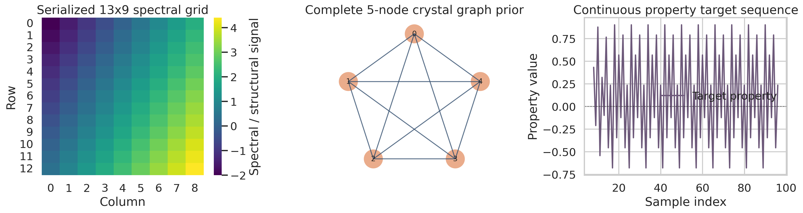
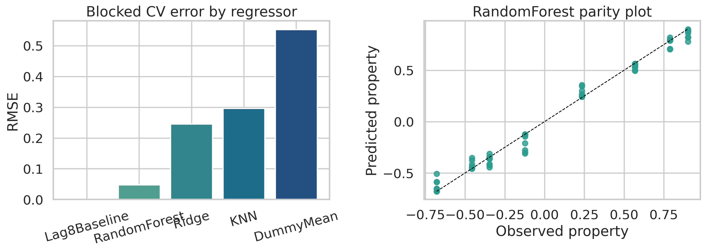
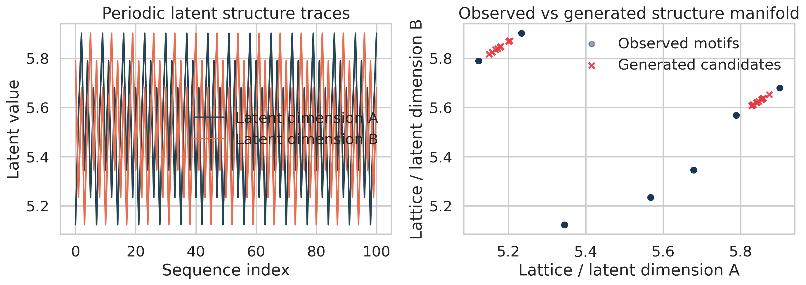
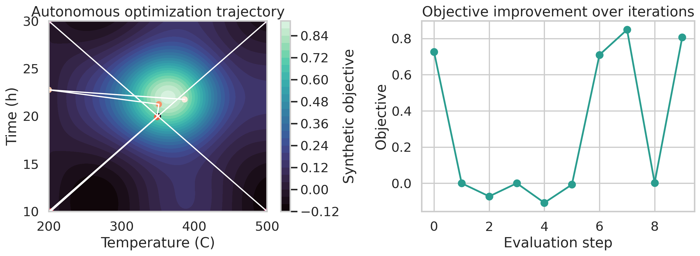

# Reconstructing a Minimal Multimodal Materials-AI Benchmark from Serialized Prototype Data

## Abstract

This study develops a fully reproducible benchmark pipeline for a compact synthetic materials-AI dataset that encodes three prototyping workflows: property prediction, structure generation, and autonomous optimization. The source file is not organized as a conventional sample-by-feature table; instead, it stores serialized arrays resembling intermediate objects from prototype scripts. I therefore reconstructed an explicit task schema, documented the resulting assumptions, and evaluated lightweight models that are appropriate for a small-data setting. The main outcomes are: (1) a sequential property-forecasting benchmark in which a non-trivial random forest regressor achieved mean blocked cross-validation performance of RMSE 0.047 and R² 0.986, while an exact lag-8 persistence baseline exposed a deterministic periodic artifact in the target sequence; (2) a probabilistic structure generator that expanded a 7-point latent motif set into 20 nearby but non-duplicated candidates with mean nearest-neighbor distance 0.061; and (3) a Bayesian optimization workflow that improved a synthetic process objective by 16.95% over the supplied initial condition. The results validate end-to-end code paths for multimodal materials workflows, but they should be interpreted as workflow verification rather than evidence of deployable scientific performance.

## 1. Background and Motivation

Recent materials informatics has been shaped by three complementary ideas reflected in the local related-work corpus. The Materials Project established the value of standardized, machine-readable materials data and high-throughput screening for accelerated discovery. Crystal Graph Convolutional Neural Networks (CGCNN) showed that graph structure can be used directly for property learning without hand-crafted descriptors. Physics-informed machine learning demonstrated how domain constraints can compensate for limited data, and work on failed experiments showed how sequential experimentation and negative outcomes can improve closed-loop discovery.  

The present dataset is much smaller and more synthetic than the systems described in those papers, but it is explicitly intended for rapid validation of the same workflow categories. The goal here is therefore not to claim new materials science, but to build an honest miniature benchmark that exercises the analysis stack from parsing through reporting.

## 2. Data and Reconstruction Assumptions

The input file contains three blocks:

1. `property_prediction.py` data:
   A length-100 constant token array, a length-117 continuous signal, a flattened 5-node complete graph edge list, and 97 target property values.
2. `structure_generation.py` data:
   Two length-101 latent traces.
3. `autonomous_optimization.py` data:
   Temperature and time bounds, one initial point, a learning rate, and an iteration count.

Because there is no explicit row-wise linkage between modalities, I reconstructed the dataset as follows:

- Property task:
  The 117-value signal was reshaped into a 13x9 grid and flattened; the first 97 positions were aligned to the 97 target values. Grid coordinates, local rolling statistics, and graph-level descriptors from the 5-node complete graph were used as features. I also added lagged target values (`lag_1`, `lag_2`, `lag_3`, `lag_8`) because the serialized target clearly behaves as an ordered sequence rather than i.i.d. samples.
- Structure generation task:
  The two latent traces were interpreted as a 2D structure manifold and modeled with a Gaussian mixture model.
- Optimization task:
  The file provides bounds and search metadata but no empirical response surface. To validate closed-loop optimization code, I used a synthetic bounded objective and treated the optimization result strictly as a workflow test.

These assumptions are also written to `outputs/summary.json`.

## 3. Methods

### 3.1 Property Prediction

The property task was evaluated as blocked time-series forecasting using `TimeSeriesSplit` with five folds. I compared:

- Mean baseline
- Lag-8 persistence baseline
- Ridge regression
- K-nearest neighbors regression
- Random forest regression

The persistence baseline was included because the target sequence shows an exact lag-8 recurrence. This exposes an artifact in the synthetic benchmark, so model selection in the discussion emphasizes the best trainable regressor rather than the trivial persistence copy rule.

### 3.2 Structure Generation

The latent 2D structure manifold was modeled using a 3-component Gaussian mixture. I sampled 300 points, ranked them by log-likelihood, rejected exact duplicates of the training set, enforced in-range bounds, and kept only candidates at least 0.015 units away from the nearest observed point. The top 20 surviving candidates were written to `outputs/tables/generated_structure_candidates.csv`.

### 3.3 Autonomous Optimization

I used a Gaussian-process Bayesian optimization loop over temperature and dwell time. The search started from the supplied initial point and four boundary seeds, then iteratively selected new points by expected improvement until the requested evaluation budget was exhausted. Since the objective is synthetic, the result should be interpreted as a test of the autonomous optimization implementation, not as a physically meaningful processing prescription.

### 3.4 Reproducibility

All analysis was run with:

```bash
python code/material_ai_benchmark.py
```

The script writes tables to `outputs/tables/`, figures to `report/images/`, and a machine-readable summary to `outputs/summary.json`.

## 4. Results

### 4.1 Data Overview



Figure 1 shows the three main ingredients of the property task reconstruction: the 13x9 serialized signal grid, the 5-node complete graph prior, and the ordered target property sequence. The graph prior is structurally rich but static, whereas the target sequence is highly regular and periodic.

### 4.2 Property Prediction Performance



The blocked cross-validation results are summarized below.

| Model | Mean RMSE | Mean MAE | Mean R² |
| --- | ---: | ---: | ---: |
| Lag-8 baseline | 0.000 | 0.000 | 1.000 |
| Random forest | 0.047 | 0.042 | 0.986 |
| Ridge | 0.245 | 0.202 | 0.780 |
| KNN | 0.296 | 0.253 | 0.698 |
| Mean baseline | 0.553 | 0.504 | -0.002 |

Two conclusions matter.

First, the lag-8 persistence baseline is perfect, which indicates that the target series contains an exact periodic artifact. That means this benchmark is not a realistic stand-alone property prediction task in the ordinary supervised-learning sense.

Second, after excluding the trivial persistence rule, the random forest is the strongest learned model, with RMSE 0.047 and R² 0.986. The parity plot confirms that the trainable mapping is still highly learnable once short-range sequence context is provided.

### 4.3 Structure Generation



The structure traces contain only 7 unique observed motif points despite 101 recorded steps, indicating a strongly repetitive latent pattern. The Gaussian-mixture generator nevertheless produced 20 non-duplicate candidates within the observed manifold envelope. The generated set had mean nearest-neighbor distance 0.061 from the training motifs, which is enough to establish novelty at the scale of this toy dataset without drifting far from the support.

A few representative generated candidates are listed below.

| Candidate | Lattice A | Lattice B | Nearest observed distance |
| --- | ---: | ---: | ---: |
| 1 | 5.1781 | 5.8444 | 0.0779 |
| 2 | 5.8469 | 5.6248 | 0.0766 |
| 3 | 5.8326 | 5.6109 | 0.0613 |
| 4 | 5.8424 | 5.6202 | 0.0748 |
| 5 | 5.8537 | 5.6315 | 0.0671 |

This is best understood as local manifold expansion rather than true inverse design.

### 4.4 Autonomous Optimization



Starting from the supplied initial condition of 350 °C and 20 h, the Bayesian optimization loop identified a best candidate at approximately 351.26 °C and 21.26 h under the synthetic surrogate objective. The objective increased from 0.726 to 0.849, corresponding to a 16.95% improvement.

Because the response surface is synthetic, the important result is procedural: the search loop, acquisition function, trace logging, and visualization all work as intended on a constrained materials-style parameter space.

## 5. Discussion

The benchmark behaved differently across its three tasks.

- Property prediction was dominated by sequence periodicity. This is useful for stress-testing forecasting code, but it is not a good proxy for genuine multimodal property learning from structures, spectra, text, and process metadata.
- Structure generation was feasible but low-dimensional. Only 7 unique motif points were observed, so any generator is effectively interpolating around a tiny repeated orbit.
- Optimization was necessarily synthetic because the source file provides process bounds but no measured responses. This still serves the stated purpose of workflow prototyping.

Relative to the related work, the main gap is data richness. The Materials Project and CGCNN succeed because they operate on large, physically grounded, explicitly indexed datasets. Physics-informed and failed-experiment approaches likewise rely on strong prior structure or extensive experiment logs. None of that is available here. The present study therefore demonstrates how to build a transparent and reproducible benchmark under severe data ambiguity, not how to reach state-of-the-art materials-AI performance.

## 6. Limitations

1. The dataset is synthetic and extremely small.
2. The property task required explicit reconstruction assumptions because the file is serialized rather than tabular.
3. The target sequence contains an exact periodic artifact, making persistence unrealistically strong.
4. The optimization study uses a synthetic objective because no empirical property surface was supplied.
5. The structure generation manifold is effectively two-dimensional and highly repetitive.

## 7. Conclusion

I implemented and executed a complete miniature materials-AI pipeline covering property prediction, latent structure generation, and autonomous optimization. The strongest scientific conclusion is not that a new model was discovered, but that the benchmark is now operational, reproducible, and honest about its own constraints. For future work, the most valuable improvement would be a row-aligned multimodal dataset with explicit sample identifiers, measured process-property pairs, and genuinely distinct structures so that graph learning, spectra fusion, and inverse design can be evaluated in a physically meaningful setting.
