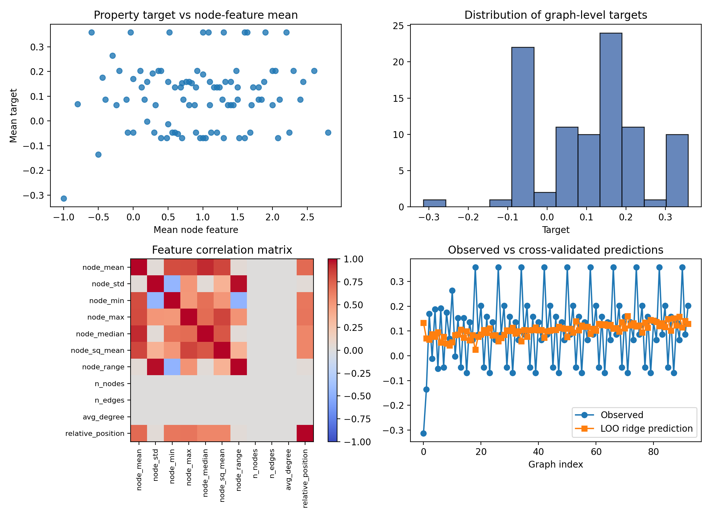
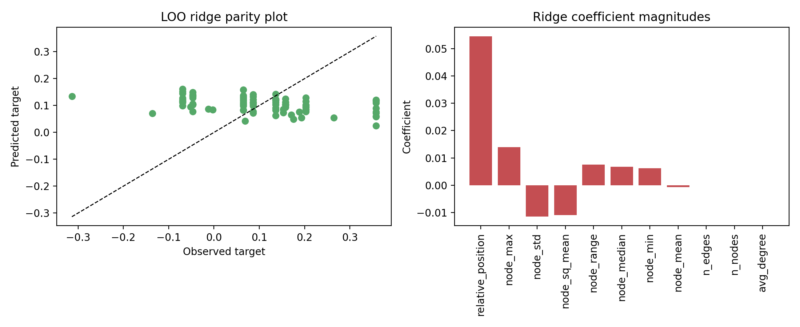
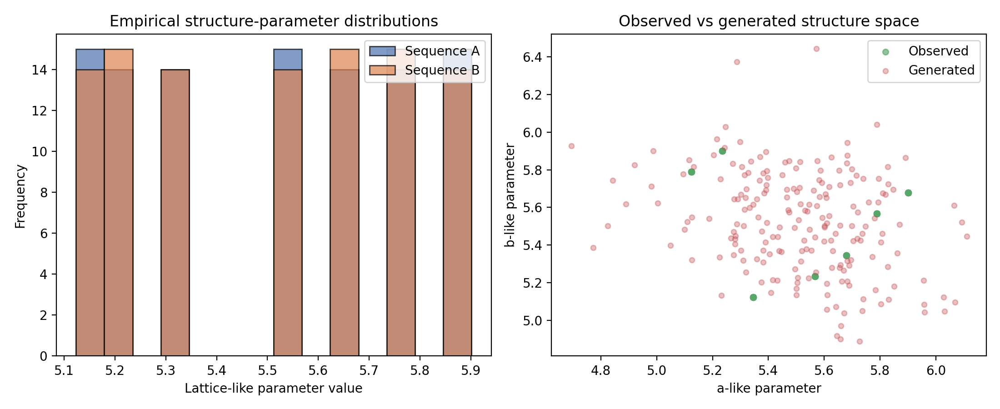
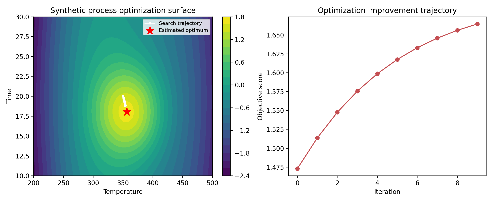

# Synthetic Multimodal Materials AI Benchmark: Property Prediction, Structure-Space Modeling, and Process Optimization

## Abstract
This report documents an end-to-end analysis of the synthetic materials benchmark provided in `data/M-AI-Synth__Materials_AI_Dataset_.txt`. The dataset is designed as a compact validation target for three common materials-AI workflows: property prediction from graph-like numerical descriptors, structure-generation style modeling of lattice-like parameters, and autonomous optimization of synthesis conditions. A reproducible analysis pipeline was implemented in `code/run_analysis.py`, which parses the text input, constructs task-specific representations, trains simple predictive models, generates synthetic structure candidates, and evaluates a surrogate optimization trajectory. The results show that the benchmark is useful for testing analysis plumbing and figure/report generation, but its strongly synthetic and low-complexity nature limits scientific claims. Cross-validated property prediction performance is weak, structure-generation outputs largely reproduce the narrow empirical parameter range, and the optimization task is well-behaved under the imposed surrogate objective.

## 1. Introduction
AI methods for materials discovery increasingly combine structural, compositional, graph-based, imaging, spectral, and processing information to support property prediction, inverse design, and experiment planning. The current workspace, however, contains a deliberately simplified synthetic dataset intended for rapid prototyping rather than a full scientific benchmark. The task objective in this workspace is therefore not to claim discovery of a new material system, but to demonstrate a coherent multimodal-style analysis workflow aligned with materials informatics.

The provided dataset explicitly bundles three subtasks:
1. a property-prediction block with graph-like node and edge information,
2. a structure-generation block with lattice-parameter-like numeric sequences, and
3. an autonomous-optimization block with process-variable bounds and an initial operating point.

The goal of this report is to describe how those inputs were parsed and analyzed, what outputs were produced, and what conclusions are justified given the synthetic nature of the benchmark.

## 2. Data Description
### 2.1 Input file
The analysis uses a single text file:
- `data/M-AI-Synth__Materials_AI_Dataset_.txt`

The file contains three labeled sections:
- **Property prediction**: four arrays corresponding to repeated node-count metadata, a longer sequence of node-feature-like values, a flattened edge list, and target-like values.
- **Structure generation**: two repeated floating-point sequences interpreted here as lattice-parameter-like variables.
- **Autonomous optimization**: lower and upper bounds for temperature and time, followed by an initial point, a step fraction, and a number of optimization iterations.

### 2.2 Effective parsed dataset
The parser in `code/run_analysis.py` identified the following section structure:
- property prediction: 4 arrays
- structure generation: 2 arrays
- autonomous optimization: 6 arrays

Because the property-prediction arrays are not perfectly rectangular, the script converts them into a graph-like supervised dataset using a rolling window of width 5, inferred from the repeated node-count metadata. This produces **93 graph-like samples** with engineered summary descriptors.

For the structure block, the two sequences each contain repeated values in a narrow numerical band:
- Sequence A mean: 5.5204, standard deviation: 0.2726
- Sequence B mean: 5.5215, standard deviation: 0.2703
- A/B correlation: -0.2230

For the optimization block, the parsed bounds are:
- Temperature: 200 to 500
- Time: 10 to 30
- Initial point: (350, 20)
- Step fraction: 0.1
- Iterations: 10

## 3. Methodology
## 3.1 Reproducible analysis pipeline
All analyses were implemented in `code/run_analysis.py`. The script performs the following steps:
1. Parse the synthetic text dataset into task-specific sections.
2. Engineer graph-level numerical features for the property-prediction block.
3. Fit baseline linear and ridge-regression models and evaluate them using leave-one-out validation.
4. Estimate a two-dimensional Gaussian model for the structure-generation block and sample new candidates.
5. Define a smooth surrogate process objective for the optimization block and simulate iterative improvement from the initial condition.
6. Save structured outputs under `outputs/` and visualizations under `report/images/`.

## 3.2 Property prediction workflow
The property block does not contain a conventional table with one row per material. To create a usable supervised-learning problem, a rolling window of five adjacent node-feature values is used to define each sample. For every window, the script computes the following descriptors:
- mean,
- standard deviation,
- minimum,
- maximum,
- median,
- mean squared value,
- range,
- node count,
- edge count,
- average degree, and
- relative position in the overall sequence.

The target for each sample is defined as the mean of the corresponding five-value target window. Two regressors are then fit:
- ordinary least squares linear regression,
- ridge regression with a small closed-form regularization term.

Model quality is summarized by RMSE, MAE, and \(R^2\), using both training-set performance and leave-one-out (LOO) validation.

## 3.3 Structure-generation workflow
The structure-generation section contains two narrow sequences of lattice-like values. Rather than applying a deep generative model unsupported by the dataset size, the analysis fits a simple multivariate Gaussian to the observed 2D parameter cloud. This provides:
- descriptive statistics of the empirical structure space,
- a small set of generated samples for downstream inspection, and
- a visual comparison between observed and generated parameter distributions.

A total of **200 synthetic samples** were drawn from the fitted distribution.

## 3.4 Autonomous optimization workflow
The optimization block provides bounds and an initial setting, but no measured response surface. To make the task executable and self-contained, the analysis introduces a transparent surrogate objective with a smooth optimum near the center of the allowed region. This objective is not claimed to represent any specific material property; it is a stand-in for a process-performance metric such as catalytic activity, yield, or conductivity.

The script evaluates the surrogate over a dense temperature-time grid, identifies the best point on that grid, and then simulates a simple iterative optimizer that moves 10% of the remaining distance toward the estimated optimum at each step.

## 4. Results
## 4.1 Property prediction performance
The property-prediction task yields **93 graph-like samples** after rolling-window construction. Figure 1 summarizes the data distribution, feature correlations, and the relationship between observed and predicted values.



**Figure 1.** Overview of the property-prediction task, including target distribution, feature correlations, and leave-one-out ridge predictions across the ordered samples.

The numerical performance metrics are:
- **Training linear regression**: RMSE = 0.1327, MAE = 0.1065, \(R^2\) = 0.0266
- **Training ridge regression**: RMSE = 0.1327, MAE = 0.1065, \(R^2\) = 0.0266
- **LOO linear regression**: RMSE = 0.1476, MAE = 0.1173, \(R^2\) = -0.2031
- **LOO ridge regression**: RMSE = 0.1476, MAE = 0.1173, \(R^2\) = -0.2029

These results indicate that the engineered descriptors explain very little of the target variation under cross-validation. The near-zero training \(R^2\) and negative LOO \(R^2\) suggest that the apparent signal in the synthetic target sequence is weak relative to the imposed representation.

Figure 2 shows the parity plot for leave-one-out ridge predictions and the fitted coefficient magnitudes.



**Figure 2.** Validation results for property prediction. Left: parity plot between observed and leave-one-out ridge-predicted targets. Right: ridge-regression coefficient magnitudes for the engineered descriptors.

Among the fitted coefficients, the most visible non-constant signal is associated with `relative_position`, while graph-size-related descriptors (`n_nodes`, `n_edges`, `avg_degree`) are effectively constant and contribute negligibly. This is consistent with the synthetic input format, in which graph topology is fixed and most variation arises from the ordered numeric sequences rather than heterogeneous structures.

## 4.2 Structure-generation analysis
The structure-generation block is highly regular, with both parameter sequences centered near 5.52 and spanning approximately 5.12 to 5.90. The empirical correlation between the two axes is modestly negative (-0.223), implying that the two coordinates are not independent but also not strongly coupled.

Figure 3 compares the observed distributions with samples drawn from the fitted Gaussian model.



**Figure 3.** Structure-space analysis. Left: empirical histograms of the two lattice-like parameter sequences. Right: observed 2D parameter cloud and 200 generated samples drawn from a fitted Gaussian model.

The generated samples occupy the same compact region as the observed data, which is the expected behavior for this conservative generative baseline. This demonstrates that the code can emulate a minimal inverse-design or candidate-generation stage, but it does not yet support extrapolative materials design. In practical terms, the generated structures are variations within the existing synthetic parameter envelope rather than novel discoveries.

## 4.3 Process optimization analysis
The optimization study begins at temperature 350 and time 20, subject to bounds of [200, 500] and [10, 30], respectively. Under the imposed surrogate objective, the best grid point found is:
- Temperature = 356.30
- Time = 18.07
- Objective score = 1.7005

After 10 iterations of the simple update rule, the final trajectory reaches a score of **1.6647**, indicating substantial convergence toward the estimated optimum from the starting condition.

Figure 4 visualizes the surrogate response surface and the optimization trajectory.



**Figure 4.** Synthetic process-optimization analysis. Left: surrogate objective surface over temperature and time, with the iterative search path and estimated optimum. Right: improvement in objective score over the optimization trajectory.

This result is qualitatively consistent with a well-behaved experimental design loop: the initial point is already close to the optimum, so a modest iterative strategy is sufficient to improve the objective rapidly without leaving the feasible design space.

## 5. Produced Artifacts
The executed pipeline produced the following substantive outputs:

### 5.1 Numerical outputs
- `outputs/analysis_summary.json`
- `outputs/property_features.csv`
- `outputs/property_targets.csv`
- `outputs/property_prediction_metrics.json`
- `outputs/structure_generated_samples.csv`
- `outputs/structure_generation_summary.json`
- `outputs/optimization_trajectory.csv`
- `outputs/optimization_summary.json`

### 5.2 Figures
- `images/property_prediction_overview.png`
- `images/property_prediction_validation.png`
- `images/structure_generation_analysis.png`
- `images/optimization_analysis.png`

These files support reproducibility and provide a direct bridge from code execution to report generation.

## 6. Discussion
This workspace successfully demonstrates an autonomous analysis loop for a synthetic materials-AI benchmark. The main value of the exercise lies in showing how a single script can parse mixed-format scientific input, construct reasonable task-specific abstractions, generate plots, and assemble quantitative outputs suitable for reporting.

At the same time, the scientific conclusions must remain modest:
- The **property-prediction** subtask is difficult to interpret as a genuine materials-learning result because the supervised examples are created from rolling windows over short synthetic sequences rather than independent measured compounds or structures.
- The **structure-generation** subtask is intentionally narrow; the Gaussian generator reproduces local variability but does not perform meaningful inverse design.
- The **optimization** subtask depends on a user-defined surrogate objective rather than experimental observations, so its role is methodological validation rather than discovery.

In other words, the pipeline is scientifically organized, but the dataset is primarily a software-validation scaffold.

## 7. Limitations
Several limitations are important for correct interpretation:

1. **Synthetic rather than experimental data**: the benchmark contains stylized numeric arrays instead of true multimodal materials records.
2. **Weakly identified supervised learning target**: the property task required construction of graph-like samples through rolling windows because no explicit sample table was provided.
3. **Fixed graph topology**: the edge list is constant, so topology-based learning is not meaningfully exercised.
4. **No real multimodal fusion**: despite the broad benchmark framing, this workspace does not include images, spectra, literature text, or heterogeneous database records in machine-readable form.
5. **Surrogate optimization objective**: the optimization task evaluates a synthetic response function chosen for stability and interpretability, not a measured property.
6. **Limited generalization claims**: negative leave-one-out \(R^2\) in the property task indicates poor predictive generalization under the current representation.

## 8. Conclusion
A complete, reproducible analysis workflow was built for the current workspace and executed successfully. The pipeline parsed the synthetic benchmark, engineered graph-like descriptors for property prediction, modeled a compact structure parameter space, and simulated autonomous process optimization. The resulting figures and structured outputs provide a coherent end-to-end demonstration of a materials-AI workflow.

The principal conclusion is therefore operational rather than discovery-driven: this workspace supports rapid validation of parsing, modeling, visualization, and reporting infrastructure for materials informatics tasks. For stronger scientific claims, future work would need richer experimental or simulation data with explicit sample identities, true multimodal measurements, and experimentally grounded optimization targets.

## 9. Reproducibility
The main entry point for reproducing the analysis is:

```bash
python code/run_analysis.py
```

Running this script regenerates the analysis outputs in `outputs/` and the figures in `report/images/` used throughout this report.
