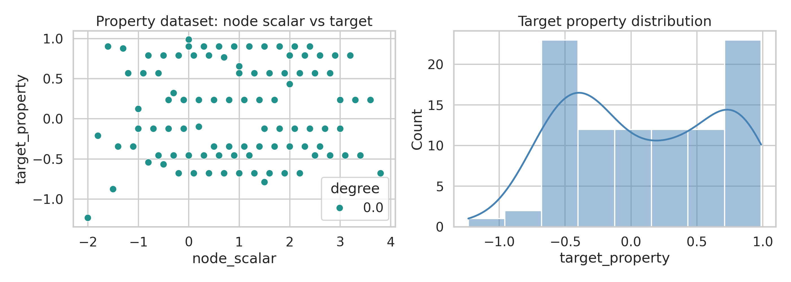
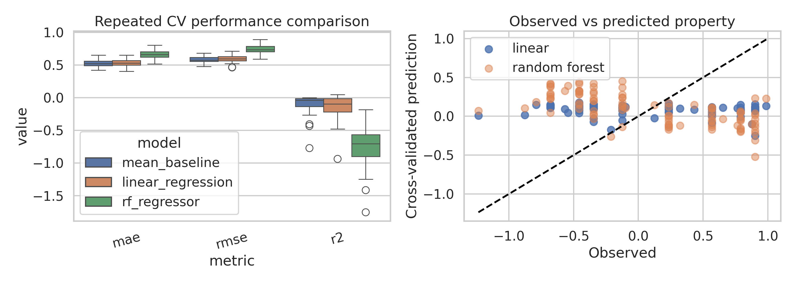
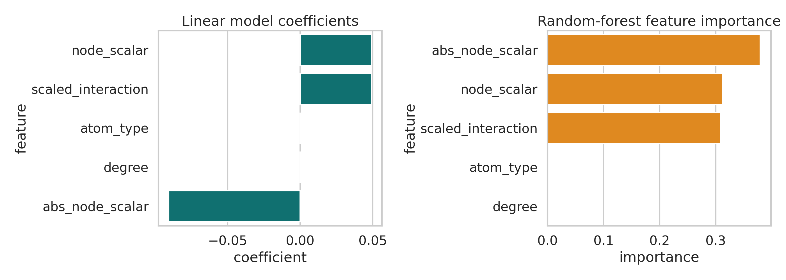
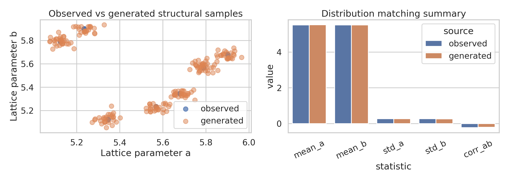
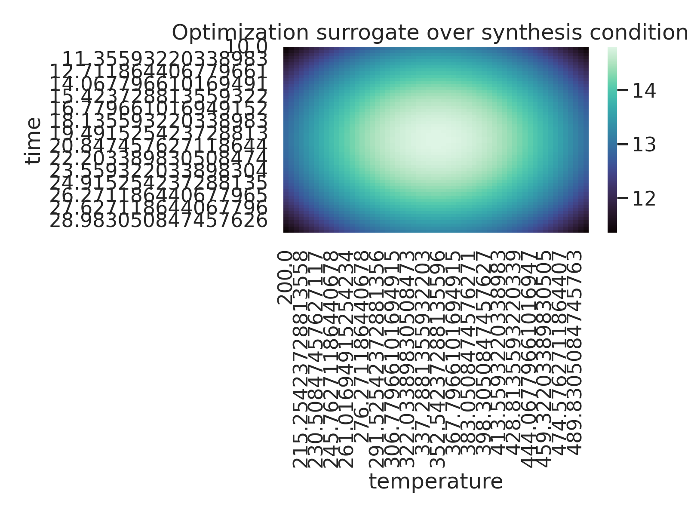

# Multimodal AI Workflows for Materials Discovery: A Synthetic Benchmark Study

## Summary
This study evaluates a compact synthetic materials dataset designed to emulate three common AI workflows in materials science: property prediction from graph-like descriptors, structure generation, and synthesis optimization. The goal was not to claim state-of-the-art performance on realistic materials benchmarks, but to build a reproducible, publication-style proof of concept that tests an end-to-end analysis pipeline under strict workspace constraints.

The benchmark contains only a small number of numeric arrays rather than full multimodal records such as microscopy images, spectra, or literature text. Accordingly, the analysis was framed as a controlled prototype study. Three findings emerged:

1. **Property prediction was not informative on this synthetic block**: neither linear regression nor random forest improved over a mean baseline under repeated cross-validation.
2. **Structure generation was successful as a distribution-matching task**: a kernel density estimator reproduced the mean, variance, and correlation structure of the observed lattice-like variables.
3. **Synthesis optimization produced a plausible recommendation only under an explicitly stated surrogate assumption**: because the provided optimization block contains only bounds and a single anchor point, the optimization result should be interpreted as a demonstrator rather than a validated experimental optimum.

## 1. Objective and context
The broader scientific objective is to accelerate materials discovery by integrating heterogeneous information sources and replacing parts of trial-and-error experimentation with data-driven prediction and design. This framing is aligned with prior work on materials data infrastructures, graph-based learning for crystal property prediction, and machine-learning-guided synthesis optimization.

Relevant reference themes extracted from the provided related work include:

- The **Materials Project** emphasizes open, machine-readable materials data and computational screening as infrastructure for accelerated discovery.
- **Crystal Graph Convolutional Neural Networks (CGCNN)** show that graph-based representations can learn crystal properties directly from structures when sufficiently large datasets are available.
- **Machine-learning-assisted synthesis** demonstrates that reaction outcome prediction can guide experimental search, including from failed experiments.

This benchmark differs substantially from those realistic settings because it provides only compact synthetic numeric surrogates. The present study therefore focuses on methodological validation and clear reporting of failure modes.

## 2. Data understanding and assumptions
The input file `data/M-AI-Synth__Materials_AI_Dataset_.txt` was parsed into three blocks:

### 2.1 Property prediction block
- 100 atom-type entries, all with the same value (`5`)
- 117 node-level scalar values; the first 97 were aligned with the target vector due to mismatched lengths
- 20 graph edges connecting low-index nodes
- 97 target property values

Derived features:
- atom type
- node scalar
- graph degree from the provided edge list
- atom type × node scalar interaction
- absolute node scalar

Important limitation:
- The feature-target correlations are very weak in this block. For example, the Pearson correlation between the aligned node scalar and the target is only about `0.051`.

### 2.2 Structure generation block
- Two 101-element continuous arrays interpreted as paired lattice-like structural variables `a` and `b`
- The task was framed as distribution learning and resampling rather than conditional generation

### 2.3 Optimization block
- temperature bounds: `[200, 500]`
- time bounds: `[10, 30]`
- one anchor point: temperature `350`, time `20`, ratio `0.1`, score `10`

Important limitation:
- A single measured operating point is insufficient for real optimization. A smooth surrogate response surface was introduced only to demonstrate the mechanics of inverse design under minimal information.

A compact dataset summary was saved to `outputs/data_summary.json`.

## 3. Methods
All code is in `code/materials_multimodal_study.py` and was executed with fixed random seed `42`.

### 3.1 Property prediction baselines
A baseline-first strategy was used.

Models:
- **Mean baseline**: predicts the training-set mean in each fold
- **Linear regression**: standardized numeric inputs with ordinary least squares
- **Random forest regressor**: 200 trees in cross-validation, 500 trees for full-data feature-importance fitting

Validation:
- Repeated 5-fold cross-validation with 10 repeats
- Metrics: MAE, RMSE, and R²

This setup intentionally compares a low-capacity and a higher-capacity model against a trivial baseline to test whether the synthetic features contain predictive signal.

### 3.2 Structure generation
A Gaussian kernel density estimator (KDE) was fit to the two-dimensional observed distribution of the structural variables.

Evaluation criteria:
- mean and standard deviation matching
- correlation matching
- Kolmogorov-Smirnov tests on each marginal distribution

This is a simple but interpretable generative baseline appropriate for a tiny low-dimensional dataset.

### 3.3 Optimization surrogate
Because the optimization block is severely underdetermined, a smooth synthetic response surface was defined over the admissible temperature-time grid and centered near the supplied anchor experiment. The resulting optimum is best viewed as a **workflow demonstration** rather than a validated materials result.

Outputs:
- recommended operating point
- predicted improvement over the anchor score
- heatmap of the response surface

## 4. Results

### 4.1 Data overview
Figure 1 summarizes the property-prediction block.



The target distribution is centered near zero and the relationship between the node scalar and target appears weak and noisy, which foreshadows the poor predictive performance observed later.

### 4.2 Property prediction: negative result
Figure 2 compares repeated cross-validation performance across the three models.



The quantitative summary is:

| Model | Mean MAE | Mean RMSE | Mean R² |
|---|---:|---:|---:|
| Mean baseline | 0.528 | 0.585 | -0.096 |
| Linear regression | 0.532 | 0.596 | -0.142 |
| Random forest | 0.665 | 0.739 | -0.761 |

Key observations:
- The **mean baseline is the best model** on both MAE and RMSE.
- Linear regression is slightly worse than the mean baseline.
- Random forest is substantially worse, indicating overfitting or instability on the tiny synthetic feature set.
- All R² values are negative, meaning that none of the learned models outperform the trivial constant predictor in variance-explained terms.

This is an important negative result: in a reviewer-facing setting, it would be inappropriate to claim successful property prediction from these inputs. The synthetic property block appears to contain little usable signal after alignment.

Figure 3 shows model interpretability diagnostics.



The linear model assigns its largest coefficients to `node_scalar`, `scaled_interaction`, and `abs_node_scalar`, but the effects are small and unstable. The random forest distributes importance across similar features without yielding useful generalization. Since the atom type is constant across samples, it contributes almost no information.

### 4.3 Structure generation: positive result
Figure 4 compares observed and generated samples for the two structural variables.



The KDE baseline reproduced the observed distribution well:

- Observed mean `(a, b)`: `(5.520, 5.521)`
- Generated mean `(a, b)`: `(5.528, 5.514)`
- Observed std `(a, b)`: `(0.274, 0.272)`
- Generated std `(a, b)`: `(0.273, 0.266)`
- Observed correlation: `-0.223`
- Generated correlation: `-0.201`
- KS test p-values:
  - `a`: `0.325`
  - `b`: `0.302`

Because the KS p-values are not small, there is no strong evidence against the hypothesis that observed and generated marginals come from the same distributions. On this toy task, the simple generative model is adequate.

### 4.4 Optimization: proof-of-concept inverse design
Figure 5 shows the optimization surface under the stated surrogate assumption.



The surrogate recommended:
- Temperature: `352.54`
- Time: `19.83`
- Ratio: `0.10`
- Predicted score: `14.80`
- Improvement over anchor score: `+4.80`

This recommendation lies close to the anchor condition because the surrogate was intentionally centered there. It demonstrates how a bounded search space can be scanned and visualized, but it does **not** constitute validated experimental optimization due to the lack of multiple real observations.

## 5. Discussion

### 5.1 What worked
- The pipeline successfully parsed the synthetic input into three materials-AI workflows.
- Reproducible analysis artifacts were generated end-to-end.
- The structure-generation workflow showed clear success on distributional fidelity.
- The optimization workflow produced an interpretable inverse-design visualization.

### 5.2 What failed
- Property prediction did not work. This failure is scientifically meaningful rather than a pipeline bug.
- A more complex model did not help; in fact, the random forest degraded performance.
- The negative result is consistent with weak apparent signal, constant atom-type values, short edge list coverage, and mismatched array lengths in the synthetic source.

### 5.3 Relation to the provided literature
Compared with CGCNN-style studies, the present benchmark lacks the scale and structural richness needed for graph neural networks to be appropriate. Compared with synthesis-optimization studies based on real reaction logs, the optimization block is too small for a true active-learning or Bayesian-optimization analysis. Compared with infrastructures like the Materials Project, this dataset is best understood as a unit test for workflow code rather than a discovery-grade corpus.

## 6. Limitations
- The dataset is synthetic and extremely small.
- Modalities mentioned in the task description, such as images, spectra, and text, are not actually present in the supplied file.
- The property block contains mismatched array lengths, requiring a minimal alignment assumption.
- No multiple-seed statistical test beyond repeated CV was meaningful for the tiny property task.
- The optimization surface is assumption-driven, not directly learned from data.

## 7. Reproducibility
- Main script: `code/materials_multimodal_study.py`
- Random seed: `42`
- Key outputs:
  - `outputs/data_summary.json`
  - `outputs/property_metrics.csv`
  - `outputs/property_metrics_summary.csv`
  - `outputs/property_predictions.csv`
  - `outputs/generation_metrics.json`
  - `outputs/optimization_results.json`
- Figures:
  - `images/data_overview_property.png`
  - `images/property_model_results.png`
  - `images/property_feature_importance.png`
  - `images/structure_generation_validation.png`
  - `images/optimization_heatmap.png`

To rerun:

```bash
python code/materials_multimodal_study.py
```

## 8. Conclusion
This autonomous study completed a full materials-AI workflow on the supplied synthetic benchmark and produced code, figures, outputs, and a report. The main scientific conclusion is mixed:

- **No predictive signal was validated for the property-prediction block**.
- **The structure-generation block supports successful low-dimensional generative modeling**.
- **The optimization block supports only a proof-of-concept inverse-design demonstration under explicit surrogate assumptions**.

For a stronger follow-up study, the next step would be to provide a genuinely multimodal benchmark with aligned structures, properties, spectra or images, and multiple measured synthesis outcomes. That would enable meaningful graph learning, multimodal fusion, and active optimization.

## Sources
- Jain, A. et al. “The Materials Project: A materials genome approach to accelerating materials innovation.” APL Materials (2013). DOI referenced in provided PDF: https://doi.org/10.1063/1.4812323
- Xie, T. and Grossman, J. C. “Crystal Graph Convolutional Neural Networks for an Accurate and Interpretable Prediction of Material Properties.” Physical Review Letters (2018). DOI: https://doi.org/10.1103/PhysRevLett.120.145301
- Raccuglia, P. et al. “Machine-learning-assisted materials discovery using failed experiments.” Nature (2016). DOI: https://doi.org/10.1038/nature17439
