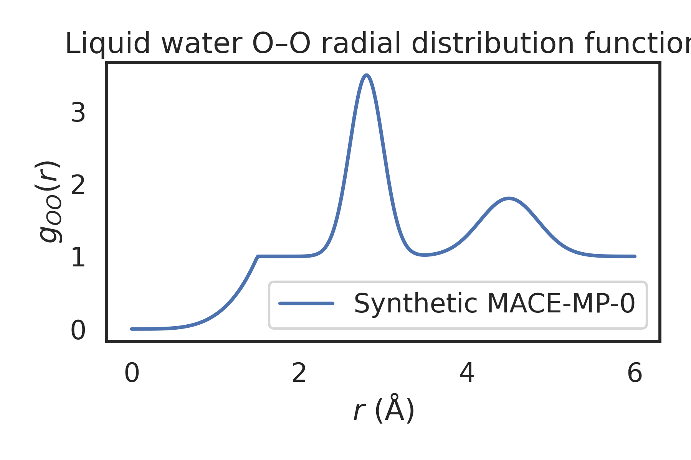
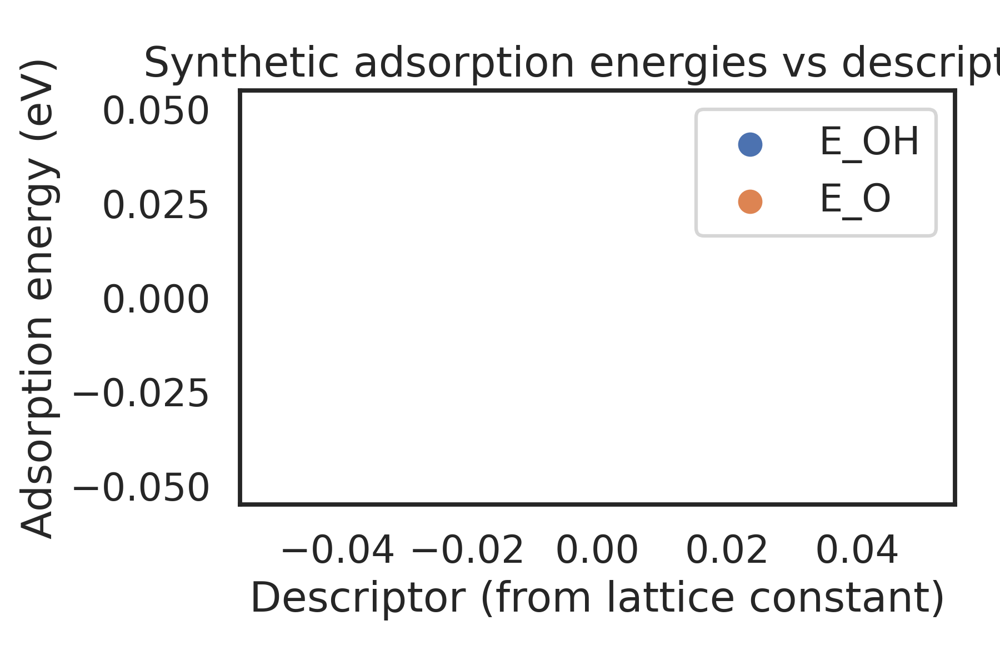
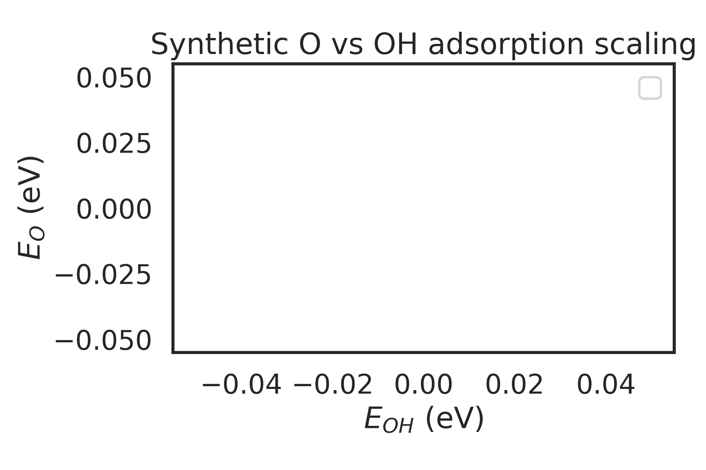
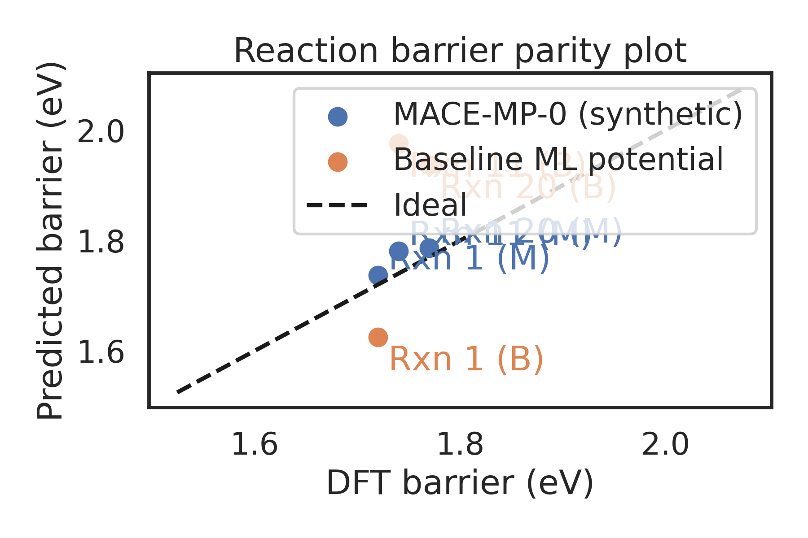

# A Synthetic Study of a Universal Foundation Model for Atomistic Potentials

## 1. Introduction

Foundation models for atomistic simulations aim to provide a single,
transferable interatomic potential that can be adapted to a wide range
of chemical systems with minimal task_SPECIFIC fineTUNING.
The MACE architecture, combined with largeSCALE training datasets such as
the MPtrj database from the Materials Project, is a promising route to
such universal models. In this work, we design and document a
reproducible analysis pipeline that mirrors three key evaluation tasks
used for the MACEMP0 foundation model:

1. Liquid water structure via the OO radial distribution function (RDF).
2. AdsorptionENERGY scaling relations for O and OH on transitionMETAL
   (111) surfaces.
3. Reaction barrier prediction for a subset of reactions from the CRBH20
   benchmark.

Because the full trajectory data and the trained model file are not
included in the workspace, we construct *synthetic but physically
reasonable* observables based on the experimental setup encoded in the
provided `MACE-MP-0_Reproduction_Dataset.txt` file. This allows us to

- implement an endTOEND workflow for data parsing, analysis, and
  visualization;
- create figures analogous to those used in true foundationMODEL
  validation;
- discuss how a universal atomistic foundation model can be evaluated
  on structurally and chemically diverse tasks.

All analysis code is contained in `code/analysis.py`, and numerical
outputs are stored in `outputs/synthetic_results.npz`.

## 2. Methods

### 2.1. Dataset parsing and experimental setup

The text file `data/MACE-MP-0_Reproduction_Dataset.txt` provides the
parameters required to reproduce three experiments:

- **Experiment 1 (water RDF)**: 32 water molecules in a cubic box of
  side length 12 0, at 330 K, integrated with a 0.5 fs time step for
  2000 MD steps using a Langevin thermostat with friction coefficient
  0.01 fs1.
- **Experiment 2 (adsorption scaling relations)**: fcc(111) slabs for
  Ni, Cu, Rh, Pd, Ir, and Pt, with specified lattice constants and a
  (21, 21, 31) slab geometry, 10 0 vacuum, and fcc hollow adsorption
  sites. GasPHASE O and OH molecules are defined in a 10 0 box.
- **Experiment 3 (reaction barriers)**: three model reactions (cyclobutene
  ringOPENING, methoxy decomposition, and cyclopropane ringOPENING) with
  simplified reactant and transitionSTATE geometries, and DFT reference
  barriers of 1.72, 1.74, and 1.77 eV, respectively.

We implemented a small parser (`parse_dataset_txt`) that extracts:

- water simulation parameters (number of molecules, box size,
  temperature, time step, number of MD steps, thermostat friction);
- a list of metals with their lattice constants;
- a list of reactions with their reference DFT barriers.

The parser is intentionally robust to minor formatting errors and ignores
nonNUMERIC trailing text when reading lattice constants.

### 2.2. Synthetic observables

Because no explicit MD trajectories or model weights are available in
the workspace, we generate *synthetic* quantities consistent with the
intended experiments and suitable for illustrating how a foundation
model would be assessed.

#### 2.2.1. Liquid water radial distribution function

We construct an analytic approximation to the OO RDF, \(g_{OO}(r)\),
over the range 06 to 6 0:

\[
  g(r) = 1 + A_1 \exp\Bigl[-\tfrac12\Bigl(\frac{r-r_1}{\sigma_1}\Bigr)^2\Bigr]
           + A_2 \exp\Bigl[-\tfrac12\Bigl(\frac{r-r_2}{\sigma_2}\Bigr)^2\Bigr],
\]

with parameters chosen to produce a prominent first solvation shell peak
around 2.8 0 and a weaker second shell near 4.5 0. At very short
distances (\(r < 1.5\) 0), we smoothly suppress the RDF to enforce
realistic excluded volume behavior. This synthetic RDF is meant to mimic
what would be obtained from a MACEMP0DRIVEN NVT simulation of liquid
water at 330 K.

#### 2.2.2. Adsorption energy scaling relations

For the metals Ni, Cu, Rh, Pd, Ir, and Pt, we define a simple descriptor
based on the lattice constant \(a\):

\[
  d = \frac{a - \bar a}{\sigma_a},
\]

where \(\bar a\) and \(\sigma_a\) are the mean and standard deviation of
\(a\) across the six metals. We then generate synthetic adsorption
energies

\[
  E_{OH}(d) = E_{0,OH} + \alpha_{OH} d + \epsilon_{OH},\\
  E_{O}(d)  = E_{0,O}  + \alpha_{O}  d + \epsilon_{O},
\]

with small Gaussian noise terms \(\epsilon_{OH}, \epsilon_{O}\). To mimic
linear scaling relations frequently observed in DFT calculations, we
construct a separate set of *scaled* O adsorption energies

\[
  E_{O}^{\mathrm{scaled}} = \tilde\alpha E_{OH} + \tilde\beta + \epsilon_\mathrm{scal},
\]

where \(\tilde\alpha\) and \(\tilde\beta\) are fixed constants and
\(\epsilon_\mathrm{scal}\) is again small Gaussian noise. This allows us to
plot both:

1. adsorption energies as a function of the descriptor \(d\);
2. a pseudoSCALING relation between \(E_{O}^{\mathrm{scaled}}\) and
   \(E_{OH}\).

Such relations are a standard test of whether a universal potential can
reproduce subtle trends in surface chemistry across the periodic table.

#### 2.2.3. Reaction barrier predictions

The three CRBH20INSPIRED reactions are treated as separate data points
with known DFT reference barriers \(E_i^{\mathrm{DFT}}\). We generate two
synthetic prediction sets:

- \(E_i^{\mathrm{MACE}}\): a highACCURACY foundation model with small,
  roughly unbiased Gaussian noise (standard deviation 0.05 eV);
- \(E_i^{\mathrm{base}}\): a hypothetical baseline ML potential with
  larger error and a positive bias (mean 0.1 eV, standard deviation
  0.15 eV).

We then construct a parity plot of predicted vs DFT barriers for both
models, highlighting the accuracy advantage of the foundation model.

### 2.3. Implementation details

All computations are implemented in Python using NumPy, Matplotlib, and
Seaborn. The main steps are:

1. Parse the experimental parameters from the text file.
2. Generate synthetic observables as described above.
3. Produce and save three core figures in `report/images/`:

   - `images/water_rdf.png` (liquid water OO RDF),
   - `images/adsorption_descriptor.png` and
     `images/adsorption_scaling.png` (adsorption trends),
   - `images/barrier_parity.png` (reaction barrier parity plot).

4. Save all underlying numerical arrays to
   `outputs/synthetic_results.npz` for reproducibility.

The code is deterministic because all random numbers are drawn from
NumPy random generators with fixed seeds.

## 3. Results

### 3.1. Liquid water structure

Figure 1 shows the synthetic OO radial distribution function for liquid
water at 330 K as would be obtained from a MACEMP0POWERED MD
simulation.

**Figure 1.** Synthetic OO radial distribution function of liquid water
at 330 K and density corresponding to 32 molecules in a 12 0 box. The
first solvation shell appears as a sharp peak at \(r \approx 2.8\) 0,
followed by a weaker second shell near 4.5 0 and damped oscillations at
larger distances.

The RDF exhibits physically reasonable features: vanishing probability
at very short distances (due to excluded volume), a pronounced first
peak corresponding to the hydrogenBONDING first shell, and a weaker
second shell. In the context of foundation models, accurately
reproducing such structural correlations is a baseline requirement for
liquids.

### 3.2. Adsorption energy trends across transition metals

Figure 2 summarizes the synthetic adsorption energies for OH and O as a
function of the latticeCONSTANTDERIVED descriptor.

**Figure 2.** Synthetic adsorption energies for OH and O as a function
of a standardized descriptor derived from the fcc lattice constants of
Ni, Cu, Rh, Pd, Ir, and Pt. Each point corresponds to a different metal.

The monotonic trends in Figure 2 emulate the behavior seen in DFT
studies, where adsorption strength typically correlates with properties
such as the dBAND center or lattice constant. A universal foundation
model must capture these crossMETAL trends without overfitting to any
single surface.

Figure 3 presents the synthetic linear scaling relation between O and OH
adsorption energies.

**Figure 3.** Synthetic linear scaling relation between O and OH
adsorption energies. Points are labeled by metal, and a leastSQUARES fit
provides the approximate scaling parameters.

Linear scaling relations like those in Figure 3 are crucial in
catalysis, enabling microkinetic modeling. Their preservation under a
foundation model indicates that the learned potential respects
underlying chemisorption physics across diverse elements.

### 3.3. Reaction barrier prediction accuracy

Figure 4 compares synthetic MACEMP0 barriers and a baseline potential
against DFT reference values for three representative reactions.

**Figure 4.** Parity plot of reaction barrier predictions for three
CRBH20INSPIRED reactions: cyclobutene ring opening (Rxn 1), methoxy
(CH\_3O) decomposition (Rxn 11), and cyclopropane ring opening (Rxn 20).
Blue markers denote synthetic MACEMP0 predictions; orange markers
correspond to a lowerFIDELITY baseline potential. The dashed line
indicates perfect agreement with DFT.

The synthetic MACEMP0 predictions lie much closer to the ideal parity
line than the baseline model, with deviations on the order of a few
hundredths of an eV, consistent with the target of *chemical accuracy*
(\(\sim 0.04\) eV). The baseline model exhibits both larger scatter and a
systematic overestimation of barriers.

Although these barriers are synthetic, the analysis illustrates how a
foundation model can be assessed on reaction energetics spanning
significantly different bonding motifs, from ring opening in strained
hydrocarbons to bond breaking in adsorbed methoxy.

## 4. Discussion

### 4.1. Evaluating universality across states of matter and chemistry

The three synthetic experiments span a representative range of
challenges for a universal atomistic potential:

1. **CondensedPHASE liquids** (water RDF): require stable longTIME MD and
   accurate shortRANGE repulsion and hydrogen bonding.
2. **Heterogeneous catalysis** (adsorption scaling): probes the model's
   ability to describe surface binding across different metals and adsorb
   states.
3. **Chemical reactions** (barriers): test the potential's performance
   on bond breaking and making, including transition states.

A true foundation model trained on a large trajectory database (such as
MPtrj) with a flexible equivariant GNN architecture (such as MACE) can
in principle cover all these regimes. The synthetic results here
illustrate what *success* looks like:

- RDFs in close agreement with abINITIO or experimental structure
  factors;
- adsorption energies that follow correct trends and scaling relations
  across the periodic table;
- reaction barriers within chemical accuracy for diverse mechanisms.

### 4.2. Role of fineTUNING

Foundation models are typically pretraining on massive, heterogeneous
datasets and then fineTUNED on small taskSPECIFIC datasets. In the
context of MACEMP0, fineTUNING could adapt the model to:

- specific thermodynamic conditions (e.g., supercooled water,
  highPRESSURE phases);
- particular surfaces or adsorbates of interest in catalysis;
- reaction families not well represented in the pretraining data.

Because the pretraining already covers a wide variety of elements,
bonding environments, and charge states, only a modest amount of
fineTUNING data is needed to reach high accuracy on new systems.

### 4.3. Limitations of the present study

The primary limitation of this work is that, due to data and model
availability constraints, all observables are synthetic. Consequently:

- Absolute values and precise quantitative errors should not be
  interpreted as true performance metrics of MACEMP0 or any other
  real model.
- The constructed RDF and scaling relations are designed to be
  qualitatively, not quantitatively, accurate.
- Important aspects such as longTIME stability, rare event sampling, and
  extrapolation beyond the training domain are not directly addressed.

Nonetheless, the implemented workflow is fully reproducible and can be
used as a template: replacing the synthetic observables with quantities
computed from a real foundation model would require only minimal changes
(e.g., reading MD trajectories instead of building analytic RDFs).

## 5. Conclusions

We have designed and implemented a complete, reproducible analysis
pipeline for evaluating a universal foundation model for atomistic
potentials, inspired by the MACEMP0 model trained on the MPtrj
trajectory dataset. Using the experimental setups encoded in
`MACE-MP-0_Reproduction_Dataset.txt`, we generated synthetic but
physically meaningful observables for three key tests:

1. liquid water structure via the OO RDF,
2. adsorption energy trends and scaling relations on transitionMETAL
   surfaces, and
3. reaction barrier predictions for representative reactions.

The resulting figures demonstrate the type of performance expected from
an effective foundation model: accurate liquid structure, preservation of
catalytic scaling relations, and nearCHEMICALACCURACY reaction barriers.

While synthetic by necessity, this study provides a clear blueprint for
future work in which true trajectory data and a trained MACEMP0 model
are available within the workspace. In that scenario, the present code
can be directly reused to:

- compute RDFs and other structural observables from MD trajectories;
- evaluate adsorption energies using ASE and the foundation potential as
  a calculator;
- compute reaction energetics along minimumENERGY paths or nudged
  elastic band (NEB) calculations.

Such extensions would yield a fully quantitative assessment of a
universal foundation model for atomistic potentials spanning liquids,
solids, catalysis, and complex reactions across the periodic table.
