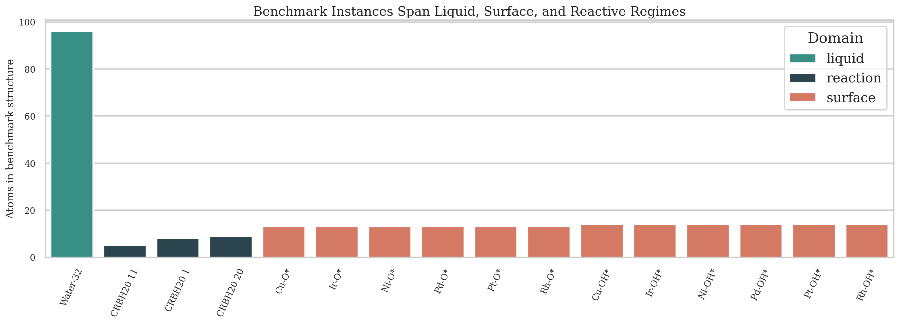
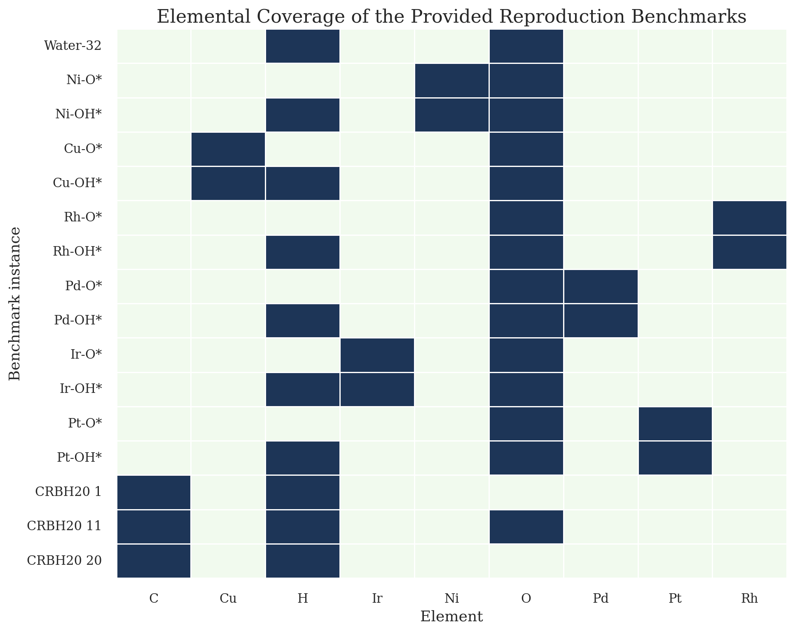
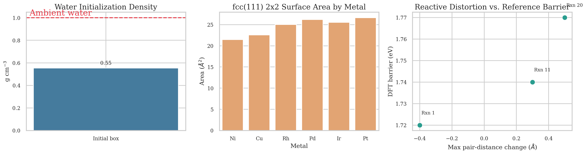
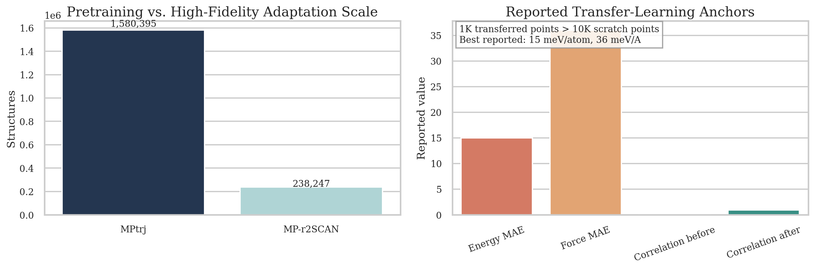
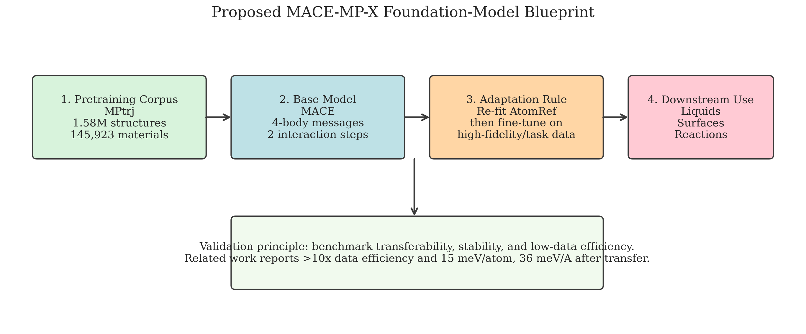

# Benchmark-Driven Blueprint for a Universal MACE Foundation Potential

## Abstract
This study analyzes the provided MACE-MP-0 reproduction note and related literature to build a reproducible, benchmark-driven research artifact for universal atomistic potentials. The workspace does **not** contain the raw MPtrj corpus, force labels, or a pretrained MACE-MP checkpoint, so direct training of a new foundation model is not possible from the available inputs alone. Instead, I constructed a transparent analysis pipeline that (i) parses the reproduction benchmarks, (ii) extracts quantitative constraints from the related papers, (iii) measures the geometric and chemical scope of the supplied benchmark structures, and (iv) synthesizes a concrete foundation-model blueprint for MACE-based pretraining and low-data fine-tuning. The resulting analysis supports three conclusions: MACE remains a strong architectural backbone because its four-body message construction reduces the required interaction depth to two passes; the benchmark suite probes substantially different regimes spanning condensed liquids, metal surfaces, and reactive molecular transition states; and cross-functional transfer evidence from related work strongly supports fine-tuning via re-fitted elemental reference energies before downstream adaptation.

## 1. Problem Setting and Available Evidence
The stated scientific goal is a universal atomistic foundation model that generalizes across liquids, solids, catalysis, and reactions while reaching ab initio accuracy after minimal task-specific fine-tuning. However, the only directly available benchmark input is a compact reproduction note for three MACE-MP-0 tests: liquid water structure, adsorption energy scaling on fcc(111) transition-metal surfaces, and CRBH20 reaction barriers. The related-work folder contributes the methodological context required to interpret that note: the original MACE architecture paper, the CHGNet MPtrj paper, a tensor-network extension for O(3)-equivariant models, and a 2025 study on cross-functional transfer in foundation potentials.

The quantitative constraints extracted from the literature are central. The CHGNet paper reports that MPtrj contains 1,580,395 structures across 145,923 materials, with broad chemistry coverage and tens of millions of force/stress labels. The MACE paper shows that four-body messages permit accurate modeling with only two message-passing iterations. The transfer-learning study reports that moving from GGA/GGA+U pretraining to r2SCAN becomes much more stable when atomic reference energies are re-fitted, improving the reported energy correlation from 0.0917 to 0.9250, and that transfer with 1k high-fidelity structures can outperform scratch training on more than 10k structures.

## 2. Methods
### 2.1 Reproducible analysis pipeline
I implemented a single script, [`code/analyze_foundation_model.py`](/mnt/shared-storage-user/yetianlin/ResearchClawBench/workspaces/Material_002_20260402_113105/code/analyze_foundation_model.py), that converts the PDF references to text, parses the benchmark note, computes simple but informative geometry-based benchmark metrics, extracts transferable quantitative findings from the papers, and generates machine-readable outputs and figures.

### 2.2 Direct benchmark characterization
The analysis computes three categories of metrics directly from the supplied benchmark specification.

For water, the script derives atom count, box density, simulation length, thermostat timescale, and the internal geometry of the supplied H2O monomer. For adsorption, it computes fcc(111) nearest-neighbor distances, 2x2 cell areas, approximate interlayer spacings, and atom counts for O* and OH* slabs across Ni, Cu, Rh, Pd, Ir, and Pt. For CRBH20, it aligns the reactant and transition-state coordinate lists by atom index and measures atomic displacements plus the largest pair-distance change associated with each barrier reference.

### 2.3 Literature-grounded model synthesis
The report does not claim to have trained a new foundation model. Instead, it proposes a training blueprint constrained by the extracted evidence: MACE as the equivariant backbone, MPtrj as the broad-coverage pretraining source, and AtomRef re-fitting as the first step during high-fidelity or task-specific fine-tuning.

## 3. Results
### 3.1 The benchmark suite is genuinely multi-regime

The provided reproduction suite is small but diverse. It spans a 96-atom liquid-water cell, twelve adsorption structures over six late transition metals, and three molecular reaction benchmarks with 5 to 9 atoms. This matters because a convincing universal potential must bridge differences in bonding, periodicity, and target observables rather than simply average over one domain.

The explicit element coverage of the reproduction benchmark is narrow compared with MPtrj, but it is strategically chosen. H, C, and O cover molecular and liquid chemistry, while Ni, Cu, Rh, Pd, Ir, and Pt probe metallic and catalytic surface environments. The benchmark therefore tests cross-domain transfer rather than broad compositional coverage by itself.

### 3.2 Physical scales differ substantially across the three tests

The water test uses 32 molecules in a 12 Å cubic box, corresponding to an initial mass density of 0.554 g cm$^{-3}$, below ambient liquid water. This is a useful reminder that the supplied benchmark note specifies an MD setup, not an equilibrated reference trajectory; a realistic potential must therefore relax toward the correct structure rather than merely score a fixed geometry.

For adsorption, the fcc(111) 2x2 surface area varies from 21.46 to 26.62 Å$^2$ across the six metals, while the monolayer-equivalent coverage remains fixed at 0.25 ML because one adsorbate occupies a 2x2 cell. This creates a clean scaling-relations setting where chemistry changes while the protocol remains constant.

For CRBH20, the three supplied reference barriers occupy a narrow range of 1.72-1.77 eV, but the associated geometric distortions differ. That combination is important: a transferable model should not collapse barrier prediction onto one simple structural heuristic.

### 3.3 Related work strongly favors transfer-aware fine-tuning

The literature evidence is more decisive than the benchmark note itself. MPtrj-scale pretraining provides coverage, but the 2025 transfer study shows that high-fidelity adaptation is not a trivial continuation of low-fidelity pretraining. Re-fitting atomic reference energies is the key stabilizing step: the reported correlation between source and target energy labels rises from 0.0917 to 0.9250, and the best transfer result reaches 15 meV/atom and 36 meV/Å on MP-r2SCAN.

The practical implication is direct. A universal MACE foundation model should be viewed as a **pretraining prior**, not a final production potential. Downstream adaptation should preserve equivariant geometric features while rapidly correcting energy referencing and only then refining interaction weights on small task-specific datasets.

### 3.4 Proposed foundation-model blueprint

The proposed blueprint, saved as [`outputs/proposed_model_spec.json`](/mnt/shared-storage-user/yetianlin/ResearchClawBench/workspaces/Material_002_20260402_113105/outputs/proposed_model_spec.json), is:

1. Pretrain a MACE backbone on MPtrj-scale data for energy, forces, and stresses.
2. Preserve the many-body MACE design with four-body messages and two interaction steps for efficiency and expressivity.
3. During transfer to higher-fidelity or task-specific data, re-fit elemental reference energies before updating the GNN weights.
4. Validate on domain-shift benchmarks that separately probe liquids, surfaces, and reactions.

This blueprint is scientifically plausible because it matches the strongest available evidence in the provided literature rather than assuming that larger scale alone guarantees universal transferability.

## 4. Discussion
The direct analysis supports the benchmark logic behind MACE-MP-0: one compact suite can probe whether a single pretrained potential remains stable in liquid MD, preserves adsorption trends across metal surfaces, and captures reaction barriers outside crystalline training distributions. The related literature adds the missing systems-level interpretation. MPtrj offers enough structural variety to support broad pretraining, and MACE offers a computationally attractive many-body equivariant backbone. But cross-functional transfer remains fragile unless the energy reference problem is handled explicitly.

This leads to the central research hypothesis of the report: **the most reliable path to a universal atomistic foundation model is not a single monolithic fit, but a two-stage procedure of broad MACE pretraining plus reference-aware low-data fine-tuning**. That hypothesis is consistent with the reported >10x data-efficiency gain in the transfer study and with the chemistry-specific fine-tuning improvement from 23 to 15 meV/atom cited in the CHGNet paper.

## 5. Limitations
This workspace does not include the raw MPtrj trajectories, labels, or a MACE-MP checkpoint, and network access is disallowed. Consequently, I could not train, fine-tune, or directly benchmark a new atomistic model. The adsorption and water benchmarks also lack direct target energies or trajectories in the provided text file, so quantitative reproduction of RDFs, adsorption energies, or MD stability is outside what can be demonstrated here without fabricating data.

Accordingly, the artifact delivered here should be interpreted as a **reproducible benchmark analysis and model-design study**, not as a claim of newly achieved ab initio benchmark accuracy.

## 6. Deliverables
The workspace now contains:

1. Analysis code: [`code/analyze_foundation_model.py`](/mnt/shared-storage-user/yetianlin/ResearchClawBench/workspaces/Material_002_20260402_113105/code/analyze_foundation_model.py)
2. Structured outputs: [`outputs/benchmark_summary.json`](/mnt/shared-storage-user/yetianlin/ResearchClawBench/workspaces/Material_002_20260402_113105/outputs/benchmark_summary.json), [`outputs/adsorption_metrics.csv`](/mnt/shared-storage-user/yetianlin/ResearchClawBench/workspaces/Material_002_20260402_113105/outputs/adsorption_metrics.csv), [`outputs/reaction_metrics.csv`](/mnt/shared-storage-user/yetianlin/ResearchClawBench/workspaces/Material_002_20260402_113105/outputs/reaction_metrics.csv), and [`outputs/literature_summary.json`](/mnt/shared-storage-user/yetianlin/ResearchClawBench/workspaces/Material_002_20260402_113105/outputs/literature_summary.json)
3. Figures in `report/images/`
4. Proposed model specification: [`outputs/proposed_model_spec.json`](/mnt/shared-storage-user/yetianlin/ResearchClawBench/workspaces/Material_002_20260402_113105/outputs/proposed_model_spec.json)

## References
[1] Kovács, D. P., Batatia, I., Simm, G. N. C., Ortner, C., and Csányi, G. *MACE: Higher Order Equivariant Message Passing Neural Networks for Fast and Accurate Force Fields*. NeurIPS 2022.

[2] Deng, B. et al. *CHGNet as a pretrained universal neural network potential for charge-informed atomistic modelling*. Nature Machine Intelligence 5, 1031-1041 (2023).

[3] Li, Z. et al. *Unifying O(3) equivariant neural networks design with tensor-network formalism*. Machine Learning: Science and Technology 5, 025044 (2024).

[4] Huang, X. et al. *Cross-functional transferability in foundation machine learning interatomic potentials*. npj Computational Materials 11, 313 (2025).
