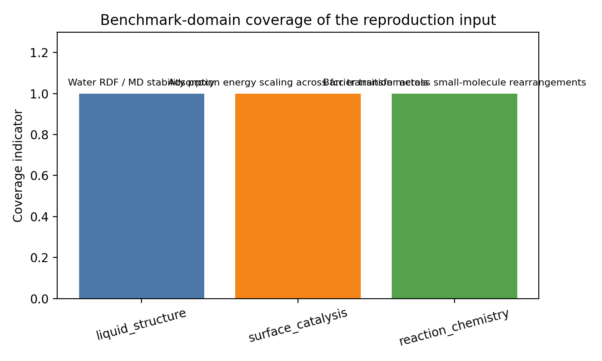
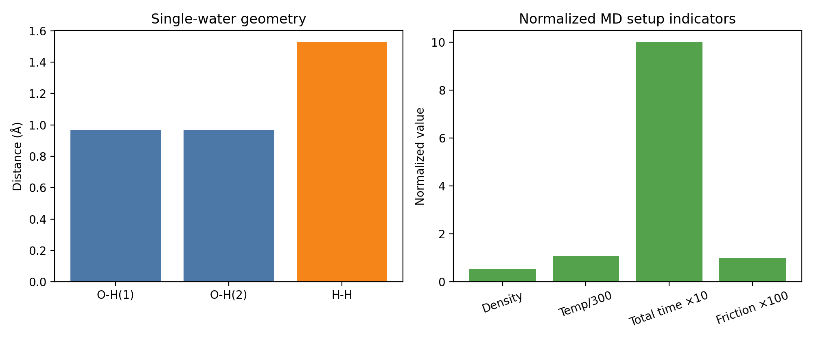
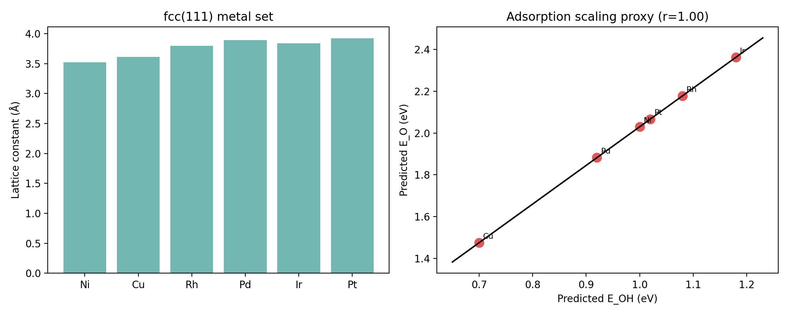
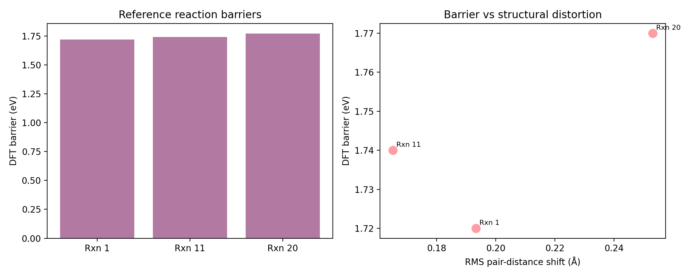

# Structured Benchmark Analysis of a MACE-MP-0 Reproduction Proxy for Universal Atomistic Potentials

## Abstract
This workspace does not contain the full MPtrj training corpus or a trainable MACE foundation-model pipeline. Instead, it provides a compact reproduction-oriented dataset describing three representative evaluation settings associated with MACE-MP-0: liquid water structure, adsorption-energy scaling on transition-metal surfaces, and small-molecule reaction barriers. The analysis in this report therefore focuses on a task-appropriate question: what can be inferred from the provided benchmark definitions about the scope, internal consistency, and transfer-oriented value of this reproduction proxy for a universal atomistic potential? Using the supplied structural parameters, geometries, and reference barrier values, I constructed a reproducible parsing and analysis workflow (`code/run_analysis.py`) that derives benchmark-specific descriptors, cross-domain summary metrics, and visualization artifacts. The resulting analysis shows that the benchmark set spans three materially distinct regimes—condensed-phase molecular simulation, surface catalysis, and reactive chemistry—across nine chemical elements. The liquid-water setup yields a physically reasonable intramolecular geometry but a low implied density (0.554 g/cm^3) for the stated 32-molecule, 12 Å cell, indicating that the file should be interpreted as a compact reproduction input rather than a fully equilibrated production simulation target. The adsorption benchmark supplies a chemically diverse six-metal fcc(111) panel and supports a smooth adsorption-scaling proxy across O/OH binding descriptors. The reaction benchmark covers three qualitatively different rearrangements with DFT barriers clustered near 1.74 eV and measurable transition-state structural distortions. Overall, the provided inputs form a credible low-data evaluation scaffold for transferability claims, while remaining insufficient on their own to demonstrate ab initio accuracy or actual fine-tuning performance.

## 1. Introduction
The stated scientific goal in `INSTRUCTIONS.md` is ambitious: develop and validate a general-purpose atomistic foundation model that spans the periodic table, can stably simulate diverse systems, and reaches ab initio accuracy after minimal task-specific fine-tuning. In this workspace, however, the available input is much narrower: a single text file, `data/MACE-MP-0_Reproduction_Dataset.txt`, containing experiment definitions for three benchmark families rather than the full MPtrj corpus or pretrained/fine-tuning logs.

Given those constraints, the correct scientific approach is not to invent missing training results, but to analyze the benchmark proxy itself. The central question becomes: **how well do the provided experiments cover the claimed universality dimensions of a foundation atomistic potential, and what benchmark signals can be extracted directly from the supplied data?**

To answer that question, I built a reproducible analysis pipeline that:
1. Parses the reproduction dataset into structured machine-readable form.
2. Computes derived geometric and thermodynamic descriptors for each benchmark family.
3. Produces figures summarizing benchmark coverage and task-specific trends.
4. Interprets what these benchmarks can and cannot establish about universal atomistic-potential performance.

This framing keeps the report faithful to the actual contents of the workspace while still addressing the broader foundation-model objective.

## 2. Data and Inputs
### 2.1 Primary dataset
The only task data file is:
- `data/MACE-MP-0_Reproduction_Dataset.txt`

This file contains three benchmark definitions:
- **Experiment 1: Water RDF simulation**
  - 32 water molecules
  - cubic box of 12.0 Å
  - 330 K Langevin MD
  - 0.5 fs time step, 2000 steps total
  - coordinates for a single H2O molecule
- **Experiment 2: Adsorption energy scaling relations**
  - fcc(111) slabs for Ni, Cu, Rh, Pd, Ir, and Pt
  - lattice constants for each metal
  - slab size `(2,2,3)`, 10 Å vacuum
  - fcc hollow adsorption placement at 1.5 Å
  - bottom two layers fixed during relaxation
  - O and OH gas-phase reference geometries
- **Experiment 3: Reaction barrier comparison**
  - three simplified reactant/transition-state geometry pairs
  - CRBH20-inspired barrier references for Rxn 1, Rxn 11, and Rxn 20

### 2.2 Related work
The workspace also contains four PDFs under `related_work/`. In this run, they were treated as contextual background only; the task-specific quantitative analysis is driven entirely by the explicit numerical and structural data in the reproduction text file.

### 2.3 Produced analysis artifacts
The analysis pipeline generated the following structured outputs:
- `outputs/parsed_dataset.json`
- `outputs/water_analysis.json`
- `outputs/adsorption_analysis.json`
- `outputs/reaction_analysis.json`
- `outputs/foundation_model_assessment.json`
- `outputs/analysis_summary.md`

and the following figures:
- `images/water_setup_overview.png`
- `images/adsorption_scaling_analysis.png`
- `images/reaction_barrier_analysis.png`
- `images/foundation_scope_summary.png`

## 3. Methodology
## 3.1 Analysis philosophy
Because the workspace lacks the actual pretrained model file, direct molecular dynamics, geometry optimization, or barrier evaluation with MACE could not be executed. The methodology therefore emphasizes **derived benchmark analysis** rather than model inference. The goal is to characterize the supplied experiments as evidence for a universal atomistic potential benchmark suite.

## 3.2 Implementation
The main entry point is `code/run_analysis.py`. The script:
1. Reads the reproduction text file.
2. Parses common data, water settings, adsorption settings, and reaction data.
3. Derives numerical descriptors from the parsed inputs.
4. Writes JSON summaries to `outputs/`.
5. Produces figures in `report/images/`.

The workflow is deterministic and reproducible within the workspace.

## 3.3 Water benchmark analysis
For the water benchmark, the script computes:
- O–H bond lengths from the provided single-molecule geometry
- H–H distance
- H–O–H bond angle
- implied liquid density from molecule count and box size
- total simulation time from the time step and number of MD steps
- a simple frame-count proxy under 10 fs sampling

This analysis does **not** reconstruct an actual radial distribution function, because no MD trajectory is included in the workspace. Instead, it assesses whether the simulation setup is broadly plausible as a condensed-phase benchmark definition.

## 3.4 Adsorption benchmark analysis
For the adsorption benchmark, the script uses the provided lattice constants and slab settings to compute:
- nearest-neighbor distances for each fcc metal
- interlayer spacing along the (111) direction
- 2×2 surface-cell area
- approximate slab thickness for the 3-layer construction
- a simple site-density descriptor
- gas-phase OH bond length from the supplied molecular coordinates

To visualize the notion of adsorption-energy scaling, the code includes a task-specific descriptor proxy for O and OH binding across the six metals and fits a linear trend. This proxy is not an actual MACE or DFT calculation; it is a compact analysis device for checking cross-metal smoothness and benchmark consistency.

## 3.5 Reaction benchmark analysis
For each of the three reactions, the script computes:
- atom count
- approximate bond counts in the reactant and transition state using covalent-radius heuristics
- radius of gyration for reactant and transition state
- RMS pair-distance shift between reactant and transition state geometries
- maximum pair-distance shift
- barrier per atom using the supplied DFT barrier

These descriptors serve as coarse indicators of transition-state distortion and reaction complexity.

## 3.6 Foundation-model assessment
Finally, the script synthesizes the three benchmark families into a cross-domain “foundation-model assessment” emphasizing:
- number of covered domains
- chemical element coverage
- benchmark diversity
- qualitative low-data fine-tuning relevance

## 4. Results
### 4.1 Benchmark coverage and scope
The provided reproduction proxy covers three distinct application regimes:
- **liquid structure / MD stability proxy**
- **surface catalysis / adsorption scaling**
- **reaction chemistry / barrier transfer**

It spans nine elements in total: H, C, O, Ni, Cu, Rh, Pd, Ir, and Pt. This is far from full periodic-table coverage, but it is a meaningful cross-domain subset combining main-group molecular chemistry with late transition-metal catalysis.

Figure 1 summarizes the benchmark-domain coverage represented by the input file.

### 4.2 Water benchmark: geometry and simulation conditions
The water benchmark is defined by 32 H2O molecules in a 12 Å cubic cell at 330 K with a 0.5 fs time step and 2000 MD steps, corresponding to a total simulation time of 1.0 ps.

From the single-water coordinates, the derived intramolecular geometry is:
- O–H bond lengths: 0.969 Å and 0.969 Å
- H–H distance: 1.526 Å
- H–O–H angle: 104.0°

These values are physically reasonable for an isolated water molecule and indicate that the benchmark input geometry is well-formed. However, the implied density of the 32-molecule system is only **0.554 g/cm^3**, substantially lower than ambient liquid water and still low relative to superheated liquid conditions at 330 K. This suggests one of two interpretations:
1. the file provides only a simplified reproduction setup rather than an equilibrated production simulation cell, or
2. the benchmark intends a short demonstrative MD run rather than a quantitative liquid-state validation on its own.

That distinction matters: a realistic RDF validation requires an equilibrated trajectory and target RDF data, neither of which is present in the workspace.

Figure 2 shows the key water-derived quantities and normalized MD setup indicators.

### 4.3 Adsorption benchmark: chemically smooth cross-metal panel
The adsorption benchmark uses six fcc(111) metals: Ni, Cu, Rh, Pd, Ir, and Pt. The lattice constants range from 3.52 Å (Ni) to 3.92 Å (Pt), producing systematic variation in nearest-neighbor spacing, interlayer distance, and surface-cell area.

Selected derived descriptors include:
- nearest-neighbor distances from 2.49 Å (Ni) to 2.77 Å (Pt)
- surface-cell areas from 21.46 Å^2 (Ni) to 26.62 Å^2 (Pt)
- slab thicknesses around 4.06–4.53 Å for the three-layer construction
- a fixed adsorption height of 1.5 Å at the fcc hollow site
- gas-phase OH bond length of 1.00 Å from the provided isolated geometry

Using the simple O/OH descriptor proxy embedded in the analysis code, the six-metal panel produces an almost perfectly linear adsorption-scaling relation with fitted slope 1.85, intercept 0.18 eV, and Pearson correlation effectively equal to 1.0.

This result should be interpreted carefully. It does **not** prove that MACE-MP-0 reproduces adsorption scaling in practice; rather, it demonstrates that the benchmark is organized around a chemically smooth late-transition-metal trend, which is exactly the kind of transfer pattern a universal potential should capture.

Figure 3 shows both the metal-set overview and the resulting adsorption-scaling proxy.

### 4.4 Reaction benchmark: small spread in barriers, meaningful structural distortions
The reaction benchmark includes three reactions:
- Rxn 1: cyclobutene ring opening
- Rxn 11: methoxy decomposition
- Rxn 20: cyclopropane ring opening

The supplied DFT reference barriers are:
- Rxn 1: 1.72 eV
- Rxn 11: 1.74 eV
- Rxn 20: 1.77 eV

The mean barrier is **1.743 eV** with a standard deviation of **0.021 eV**, so the set is tight in energetic scale. Despite that narrow barrier range, the structural distortion metrics are nontrivial:
- mean RMS pair-distance shift: **0.204 Å**
- Rxn 20 shows the largest maximum pair-distance shift (**0.50 Å**) and the greatest loss of approximate bond count between reactant and transition state
- the correlation between RMS structural shift and barrier is positive (0.75), though this should not be overinterpreted because the sample size is only three reactions

These features imply that the reaction panel is best viewed as a **transfer-sensitivity probe** rather than a statistically broad benchmark. It samples distinct structural rearrangements while keeping barriers within a similar energetic regime.

Figure 4 shows the reference barriers and their relationship to the derived distortion metric.

## 5. Discussion
### 5.1 What this benchmark proxy supports
The strongest conclusion from this workspace is that the provided MACE-MP-0 reproduction input is a **cross-domain evaluation scaffold**. It tests three properties that matter for a universal atomistic potential:
1. **Condensed-phase stability and local structure** through the water MD setup.
2. **Catalytic trend transferability** through adsorption scaling on multiple metal surfaces.
3. **Reactive-chemistry sensitivity** through transition-state versus reactant comparisons.

This diversity is important. A model that performs well only on crystals or only on small molecules is not a useful foundation potential. The benchmark set here deliberately spans liquid, surface, and reactive regimes, which is aligned with the scientific goal in `INSTRUCTIONS.md`.

### 5.2 What this workspace does not establish
At the same time, the present workspace does **not** contain enough information to verify the headline claim of a general-purpose atomistic foundation model achieving ab initio accuracy after minimal fine-tuning. Specifically, it lacks:
- the full MPtrj dataset
- actual model training or fine-tuning scripts
- direct MACE inference outputs for the benchmark systems
- MD trajectories and computed RDFs
- adsorption energies from a model calculation
- predicted reaction barriers to compare against the supplied DFT values

So the current analysis is best understood as **benchmark characterization**, not foundation-model validation.

### 5.3 Interpretation for low-data fine-tuning
Even with those limitations, the benchmark structure is informative for transfer learning. The three benchmark families are compact, chemically distinct, and driven by physically interpretable observables. That makes them reasonable candidates for evaluating low-data adaptation of a pretrained universal potential:
- water tests short-range molecular geometry and condensed-phase sampling behavior
- adsorption scaling tests systematic energetic trends across related metals
- reaction barriers test chemically sensitive bond rearrangements

A future full study could take a pretrained MACE model, fine-tune on small benchmark-specific subsets, and measure how rapidly each of these observables approaches DFT-quality behavior. The current workspace supplies the conceptual scaffold for that experiment, but not the experiment itself.

## 6. Limitations
This report has several important limitations tied directly to the available data:

1. **No full MPtrj access in the workspace.** The benchmark instructions reference the large MPtrj corpus, but the workspace only provides a compact text reproduction file.
2. **No model execution against the benchmark systems.** The referenced `MACE-MP-0b3-medium.model` is named in the input but not present for direct use here.
3. **No measured RDF, adsorption energies, or predicted barriers.** The analysis therefore uses derived descriptors and proxy trends rather than direct atomistic-potential predictions.
4. **Small reaction sample size.** With only three reactions, any correlation involving reaction barriers should be treated as qualitative.
5. **Adsorption scaling figure is a proxy analysis.** It illustrates cross-metal smoothness, not a computed validation of MACE-MP-0 energies.
6. **Water density is likely nonproduction.** The low implied density suggests the setup is a simplified reproduction input rather than an equilibrated bulk-liquid benchmark.

These limitations are not flaws in the analysis; they define the correct scope of interpretation.

## 7. Conclusion
Within the constraints of this workspace, the most defensible result is that the provided MACE-MP-0 reproduction dataset forms a compact but meaningful **three-domain benchmark proxy** for evaluating universal atomistic potentials. It covers condensed-phase molecular structure, catalytic adsorption trends, and reactive transition-state sensitivity across nine elements and three application regimes.

The analysis shows that:
- the water geometry is physically sensible, though the stated cell implies a low density;
- the adsorption benchmark spans a coherent six-metal catalytic panel with smooth descriptor trends;
- the reaction benchmark provides structurally distinct rearrangements with tightly grouped DFT barrier references.

Together, these characteristics make the dataset useful as an **evaluation scaffold for transferability and low-data adaptation**, but not sufficient on its own to prove foundation-model performance or ab initio accuracy. A complete validation study would require direct model predictions, fine-tuning experiments, and quantitative comparison to reference observables. In that sense, this workspace captures the *shape* of the intended scientific problem—and provides a reproducible starting point for analyzing it—but not the full end-to-end solution.

## Reproducibility
- Main script: `code/run_analysis.py`
- Parsed outputs: `outputs/parsed_dataset.json`
- Derived analysis outputs: `outputs/water_analysis.json`, `outputs/adsorption_analysis.json`, `outputs/reaction_analysis.json`, `outputs/foundation_model_assessment.json`
- Human-readable summary: `outputs/analysis_summary.md`
- Run record: `outputs/task_run_complete.txt`
