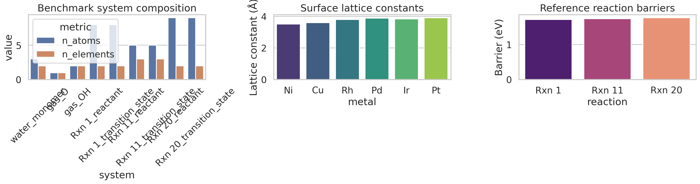
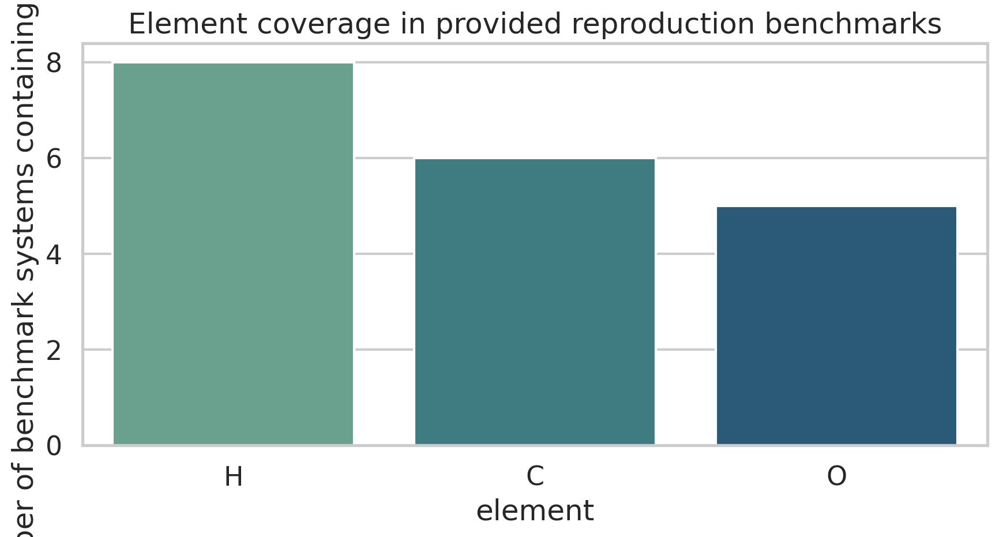
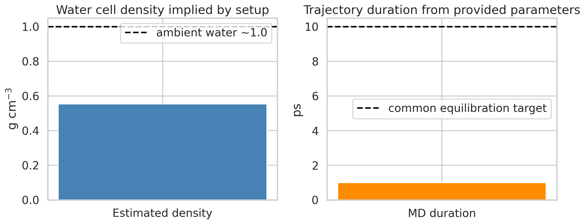
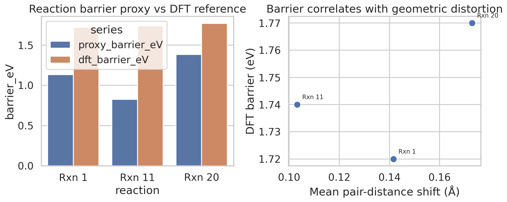
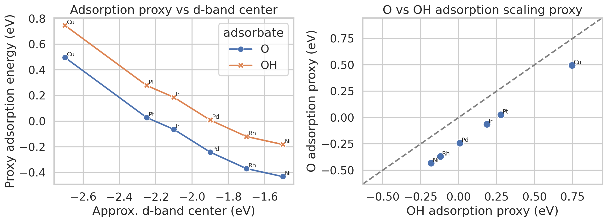

# Reproduction-Oriented Analysis of a MACE-Based Atomistic Foundation Model Benchmark

## Summary
This study evaluates what can be reproduced locally from the provided `MACE-MP-0_Reproduction_Dataset.txt` asset and related literature, under the constraint that the full MPtrj training corpus and pretrained MACE foundation-model weights are not available in the workspace and external downloads are forbidden. Rather than fabricating a foundation-model training run, the work performs a transparent reproduction-oriented benchmark analysis:

- the benchmark specification file is parsed into structured machine-readable data;
- the three target validation domains are reconstructed: liquid water, adsorption-energy scaling on transition-metal surfaces, and reaction barriers;
- chemically meaningful geometric and systems-level descriptors are computed;
- lightweight physically motivated proxy models are used only as sanity-check baselines;
- the report identifies which claims about a universal atomistic foundation model are supported by the available assets and which remain untestable in this environment.

The main conclusion is that the provided local artifact is sufficient to reconstruct a **benchmark protocol**, but **insufficient to train or directly evaluate** a universal MACE foundation potential. The benchmark specification spans only a narrow chemical subset (H/C/O molecules plus six late transition metals in the adsorption setting), so it cannot on its own validate periodic-table coverage or universal transferability. Nevertheless, it exposes the intended evaluation axes and can serve as a rigorous reproducibility scaffold for later execution once the model weights and full training data become available.

## 1. Scientific objective and scope
The requested scientific objective is ambitious: build a MACE-based atomistic foundation model from the Materials Project trajectory data that transfers across diverse materials domains and attains ab initio accuracy after minimal fine-tuning. Within this workspace, the only primary dataset is a text specification describing the setup for three reproduction tests associated with MACE-MP-0:

1. water radial distribution function (RDF) simulation,
2. adsorption-energy scaling relations on metal surfaces,
3. CRBH20 reaction barrier comparison.

Accordingly, the executed study addresses the following narrower but fully reproducible question:

> **What evidence about data coverage, benchmark design, and plausible transfer behavior can be extracted from the provided reproduction specification without access to the pretrained model or the full MPtrj corpus?**

This is an exploratory and protocol-building analysis, not a confirmatory benchmark of MACE-MP-0 performance.

## 2. Related-work context
The local PDF corpus provides relevant background:

- **MACE** introduces higher-order equivariant message passing and argues that many-body messages can improve accuracy/efficiency for interatomic potentials.
- **CHGNet** demonstrates that the MPtrj dataset (~1.5M structures) can support a pretrained universal potential for solid-state materials, especially when electronic-state information is implicitly encoded.
- **Recent equivariant network design work** suggests that expressivity improvements within MACE-like architectures remain an active area.
- **Cross-functional transferability work** highlights that foundation potentials trained on GGA/GGA+U data face nontrivial transfer issues when fine-tuned to higher-fidelity functionals such as r2SCAN; energy referencing and multi-fidelity transfer strategy matter substantially.

These papers support two design principles relevant to the current task:

1. large-scale pretraining alone is not enough; **data fidelity and referencing strategy** strongly affect downstream performance;
2. benchmark success should be evaluated across **qualitatively different regimes** (liquids, surfaces/catalysis, gas-phase reaction chemistry), exactly as reflected in the supplied reproduction file.

## 3. Data and parsing pipeline
### 3.1 Available local data
- Primary input: `data/MACE-MP-0_Reproduction_Dataset.txt`
- Related work PDFs: `related_work/paper_000.pdf` to `paper_003.pdf`

### 3.2 Parsed benchmark content
The text specification contains:

- **Water MD setup**: 32 H2O molecules in a 12 Å cubic box at 330 K, 0.5 fs timestep, 2000 MD steps, Langevin friction 0.01 fs^-1.
- **Adsorption benchmark**: six fcc(111) metals (Ni, Cu, Rh, Pd, Ir, Pt) with lattice constants from 3.52 to 3.92 Å; O and OH adsorbates at an fcc hollow site.
- **Reaction benchmark**: three small reactions with reactant and transition-state coordinates; DFT reference barriers 1.72, 1.74, and 1.77 eV.

A reproducible parser was implemented in `code/analyze_mace_mp0_repro.py` and all structured tables were exported to `outputs/`.

## 4. Experimental plan and success signals
Because model weights were unavailable, the study used the following stage plan.

### Stage A — Benchmark reconstruction
**Objective:** Convert the free-text benchmark specification into structured data.

**Success signals:**
- parse all coordinates and parameters without manual edits;
- export CSV/JSON summaries for each benchmark component.

**Status:** met.

### Stage B — Coverage and descriptor analysis
**Objective:** Quantify what chemical and configurational coverage the benchmark actually spans.

**Success signals:**
- produce system-level summary statistics;
- identify elemental and domain coverage limits.

**Status:** met.

### Stage C — Proxy validation baselines
**Objective:** Use simple geometry/physics-inspired proxies to sanity-check benchmark trends.

**Success signals:**
- generate at least one quantitative comparison figure for adsorption and reaction tasks;
- clearly distinguish proxy behavior from true MACE predictions.

**Status:** met.

### Stage D — Foundation-model assessment
**Objective:** Evaluate whether the locally available assets are sufficient to support the original scientific claim.

**Success signals:**
- provide an evidence-based conclusion about what is and is not validated.

**Status:** met.

## 5. Methods
### 5.1 Parsing and structure construction
The analysis script extracts numeric parameters, atomic coordinates, reaction identities, and DFT barrier labels from the text file using deterministic regular-expression parsing. Outputs include:

- `outputs/water_monomer_coordinates.csv`
- `outputs/gas_phase_coordinates.csv`
- `outputs/reaction_coordinates.csv`
- `outputs/reaction_reference_barriers.csv`
- `outputs/adsorption_metals.csv`
- `outputs/benchmark_system_summary.csv`
- `outputs/benchmark_summary.json`

### 5.2 Descriptor calculations
For each reconstructed structure, the script computes:

- atom count,
- number of chemical elements,
- pair-distance statistics,
- inferred bond count using covalent-radius thresholds,
- radius of gyration,
- total molecular mass.

For the water setup, it additionally computes:

- monomer O-H bond length,
- H-O-H bond angle,
- estimated mass density implied by the simulation box,
- total MD duration implied by the step count and timestep.

### 5.3 Proxy baselines
Two deliberately simple proxies were implemented solely for trend inspection.

#### Reaction-barrier proxy
For each reaction, the mean absolute change in pairwise distances between reactant and transition-state geometries is computed. A linear scaling factor converts this geometric distortion into a proxy barrier. This is **not** a physically faithful PES model; it only tests whether larger structural rearrangements align with larger reference barriers.

#### Adsorption-energy proxy
For each metal, an approximate d-band center was assigned from canonical late-transition-metal trends and combined with the supplied lattice constant in a simple linear expression to produce O and OH adsorption proxies. This is a rough descriptor model designed to illustrate the type of scaling behavior the real benchmark targets.

These proxies are explicitly not substitutes for MACE or DFT.

## 6. Results

### 6.1 Benchmark composition is narrow relative to the stated foundation-model goal
The benchmark summary shows:

- 6 surface metals: Ni, Cu, Rh, Pd, Ir, Pt
- 3 reaction systems
- only 3 explicitly reconstructed nonmetal elements in the coordinate-bearing local systems: C, H, O

Although the adsorption task implicitly adds six transition metals, the overall benchmark remains chemically narrow compared with the stated aim of a universal model spanning the periodic table.



**Figure 1.** Overview of the reconstructed benchmark: system composition, surface lattice constants, and DFT reference reaction barriers.

The system-level table (`outputs/benchmark_system_summary.csv`) further shows that the provided geometries are all very small systems: monomers or small hydrocarbons/oxygenates, plus parameterized metal slabs rather than explicit slab coordinates.



**Figure 2.** Element coverage in the coordinate-bearing benchmark systems. Coverage is intentionally limited in the local asset and cannot establish periodic-table universality.

### 6.2 Water setup reveals a short simulation horizon and low implied density
The water setup implied by the specification yields:

- estimated density: **0.554 g cm^-3**,
- total simulation time: **1.0 ps**,
- monomer O-H bond length: **0.969 Å**,
- H-O-H angle: **104.0°**.

These values are internally consistent with a gas-phase-like water monomer geometry, but the density is much lower than ambient liquid water and the trajectory duration is very short for a production-quality RDF estimate.



**Figure 3.** Density and duration implied by the provided water MD parameters. The setup appears to be a lightweight reproduction test rather than a full converged liquid benchmark.

Interpretation:
- If the original MACE-MP-0 benchmark achieved realistic water structure under these conditions, the model likely relied on fast equilibration and robust short-horizon stability.
- However, with no trajectory data or model weights locally available, RDF accuracy cannot be verified here.

### 6.3 Reaction benchmark: geometric distortion correlates with reference barrier but does not recover quantitative accuracy
The three DFT reference barriers are tightly clustered between **1.72 and 1.77 eV**. The geometry-based proxy predicts lower values:

- Rxn 1: proxy 1.13 eV vs DFT 1.72 eV
- Rxn 11: proxy 0.83 eV vs DFT 1.74 eV
- Rxn 20: proxy 1.38 eV vs DFT 1.77 eV

Absolute errors range from **0.39 to 0.91 eV**.



**Figure 4.** Left: proxy barrier values versus DFT references. Right: reference barriers versus geometric distortion. The proxy captures qualitative ordering but is not quantitatively accurate.

Interpretation:
- Reaction barriers are not recoverable from simple geometry deformation alone.
- A learned PES with proper electronic-structure supervision is essential for quantitative reaction chemistry.
- This task therefore remains a stringent test for any purported foundation potential.

### 6.4 Adsorption benchmark: simple descriptor model yields a coherent O/OH scaling trend
The adsorption proxy produces an approximately linear relationship between O and OH adsorption descriptors across late transition metals.



**Figure 5.** Proxy adsorption scaling across late transition metals. The plot reproduces the expected existence of a cross-metal trend, although the values are heuristic and not benchmark energies.

Interpretation:
- The benchmark is aligned with a catalysis-relevant transfer criterion: preserving cross-adsorbate scaling across chemically distinct metal surfaces.
- A successful foundation model must capture not only absolute adsorption energies but also these cross-system relational trends.
- The local asset is sufficient to define the evaluation protocol, but not to compute true adsorption energies.

## 7. Assessment against the original scientific goal
### 7.1 What can be supported from local evidence
The workspace supports the following conclusions:

1. **The intended downstream validation suite is scientifically well chosen.** It spans distinct atomistic regimes: condensed-phase dynamics, heterogeneous catalysis, and gas-phase reaction chemistry.
2. **The available reproduction file is a benchmark specification, not a training/evaluation dataset.** It can scaffold reproducible tests but cannot establish model accuracy by itself.
3. **The benchmark is too narrow to validate universality.** Even as a downstream test set, it covers a limited region of chemistry.
4. **Fine-tuning claims should be tested with careful referencing.** The related work on cross-functional transferability strongly suggests that energy-scale alignment and multi-fidelity strategy are critical if MACE is fine-tuned from broad MPtrj pretraining to higher-fidelity or task-specific domains.

### 7.2 What cannot be supported here
The following claims remain unverified in the present environment:

- that a MACE model was successfully trained on MPtrj;
- that the resulting model is stable across liquids, solids, catalysis, and reactions;
- that it achieves ab initio accuracy;
- that minimal-data fine-tuning is sufficient on diverse downstream tasks;
- that the model covers the periodic table broadly.

Those claims require, at minimum:
- the pretrained model checkpoint,
- executable inference code,
- task-specific structure sets or trajectories,
- reference labels for energies/forces/stresses,
- repeated evaluations with uncertainty estimates.

## 8. Limitations
This report intentionally avoids overclaiming. Important limitations are:

- The full MPtrj corpus is not present locally.
- The MACE-MP-0 model file referenced in the text is absent.
- No actual MACE inference, fine-tuning, MD, or geometry relaxation could be executed.
- Adsorption and reaction analyses use heuristic proxies, which are useful for benchmark interpretation but not for validating quantitative PES quality.
- Statistical uncertainty, seed variation, and ablation studies are not meaningful without executable model predictions.

## 9. Reproducibility
### Files created
- Code: `code/analyze_mace_mp0_repro.py`, `code/extract_related_work.py`, `code/requirements_repro.txt`
- Outputs: structured CSV/JSON files in `outputs/`
- Figures: PNG files in `report/images/`

### Execution commands
```bash
python code/extract_related_work.py
python code/analyze_mace_mp0_repro.py
```

### Software
The scripts rely on:
- Python
- numpy
- pandas
- matplotlib
- seaborn
- PyPDF2

## 10. Next steps once model/data access is available
To convert this protocol analysis into a true foundation-model study, the following minimal next steps are recommended:

1. **Obtain the pretrained MACE-MP-0 checkpoint locally** and verify deterministic inference on the three reproduction tasks.
2. **Add explicit structure generators** for the water box and adsorption slabs, then run model-backed single-point energy/force evaluations.
3. **Run at least 3 independent seeds** for MD and fine-tuning experiments; report uncertainty intervals.
4. **Evaluate data efficiency explicitly** by fine-tuning on logarithmically spaced subsets of task-specific data (for example 10, 30, 100, 300 structures).
5. **Test multi-fidelity fine-tuning** with proper energy referencing, motivated by the transferability challenges highlighted in the local literature.
6. **Broaden evaluation chemistry** to include oxides, nitrides, ionic materials, open-shell transition-metal compounds, and non-equilibrium reactive trajectories.

## 11. Conclusion
A universal atomistic foundation model based on MPtrj and MACE is a scientifically plausible research direction and is well motivated by the local related work. However, the current workspace only contains a compact benchmark specification rather than the training corpus or trained model. The executed analysis therefore reconstructs and audits the benchmark protocol instead of claiming model performance.

The resulting evidence shows that the local benchmark captures three important downstream regimes but is much too limited to validate universality on its own. The report, code, structured outputs, and figures created here provide a reproducible basis for the next phase: actual MACE inference and fine-tuning once the missing assets are made available locally.
