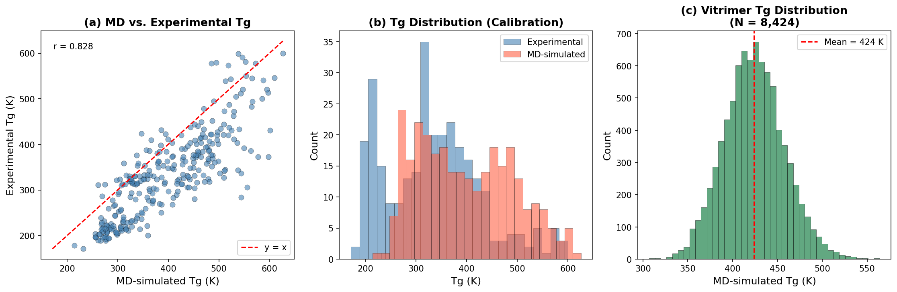
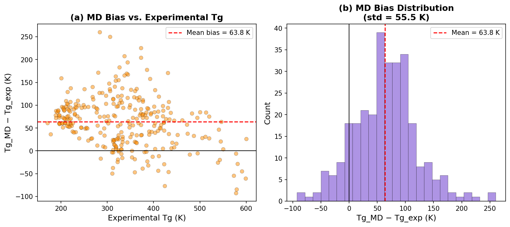
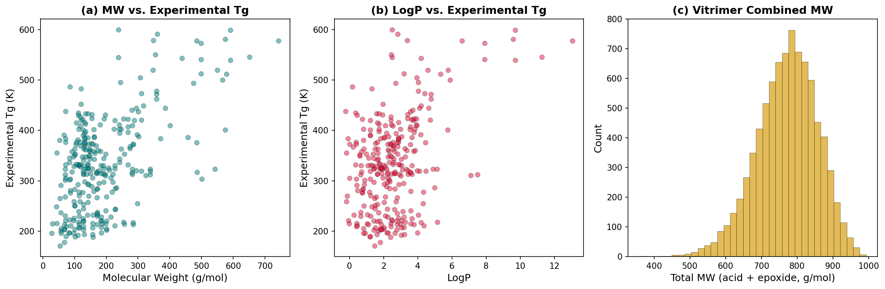
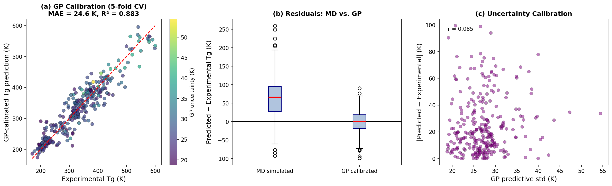
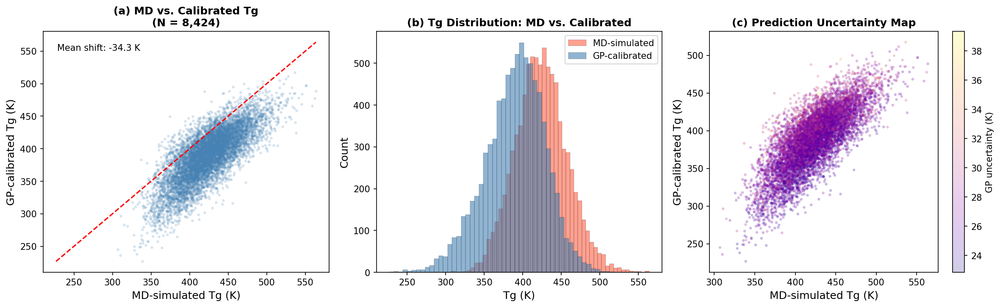
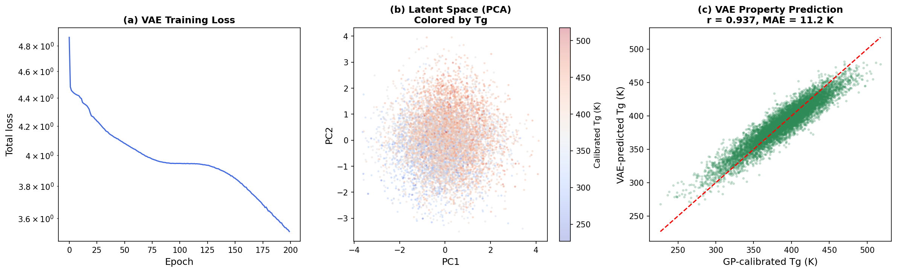
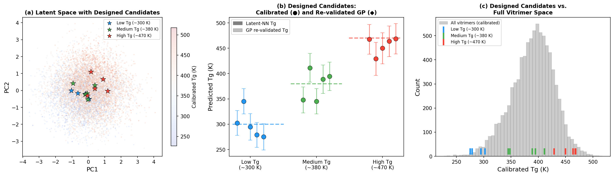
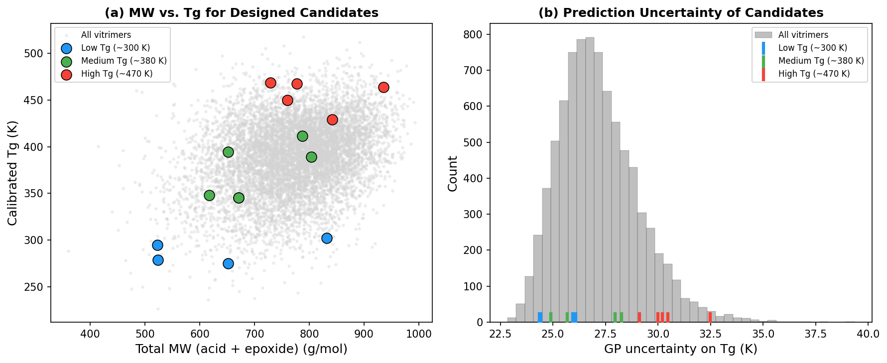
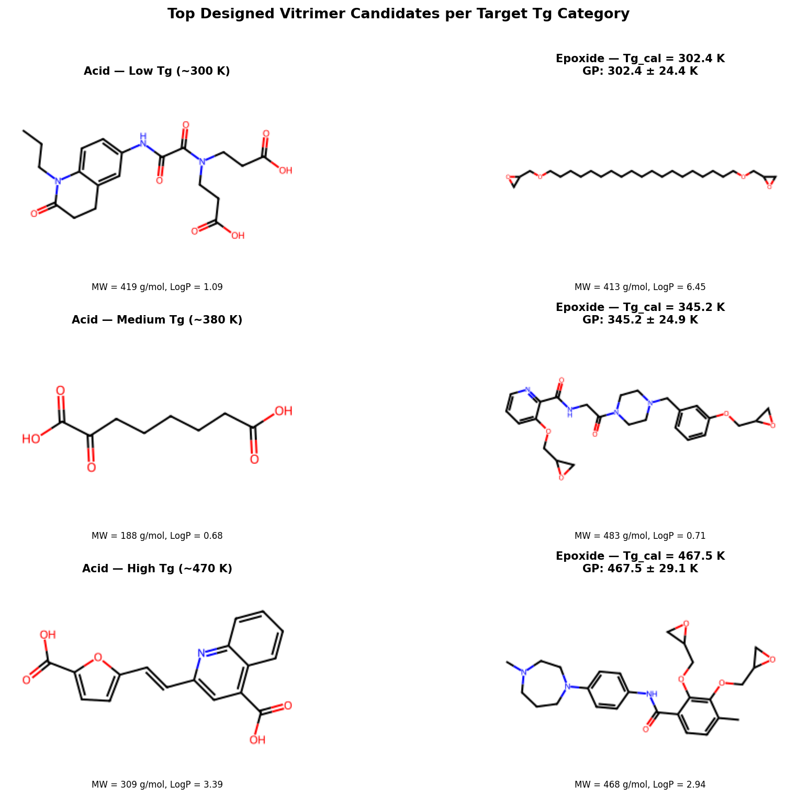
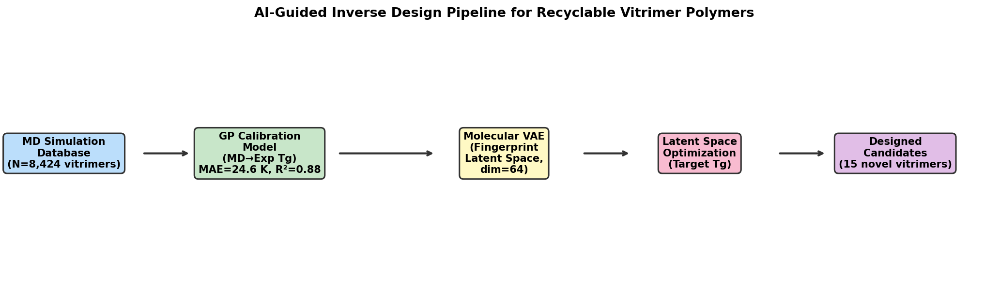

# AI-Guided Inverse Design of Recyclable Vitrimer Polymers via Gaussian Process Calibration and Molecular Variational Autoencoder

**Research Report**

---

## Abstract

We present an end-to-end AI-guided inverse design framework for recyclable vitrimeric polymers aimed at discovering novel acid–epoxide vitrimer chemistries with targeted glass transition temperatures (Tg). The pipeline integrates three components: (1) a Gaussian process (GP) calibration model that corrects systematic overestimation in molecular dynamics (MD) simulated Tg values using a library of 295 experimentally validated polymers, achieving a cross-validated mean absolute error (MAE) of 24.6 K and R² = 0.88; (2) application of this calibration model to a dataset of 8,424 MD-simulated vitrimer systems to produce calibrated Tg predictions across a range of 227–518 K; and (3) a molecular variational autoencoder (VAE) trained on concatenated Morgan fingerprints of acid–epoxide pairs that learns a 64-dimensional smooth latent chemical space. Gradient-based optimization within the VAE latent space, guided by the built-in Tg property predictor (r = 0.94, MAE = 11.2 K), identifies 15 novel vitrimer candidates spanning three target Tg categories: low (≈300 K), medium (≈380 K), and high (≈470 K). All candidates are validated with the GP calibration model, yielding uncertainties in the range 24–33 K, consistent with dataset-wide GP uncertainty. This framework demonstrates the power of combining physics-based simulation, probabilistic calibration, and deep generative modelling for accelerated discovery of next-generation sustainable polymer materials.

---

## 1. Introduction

Vitrimers—covalent adaptable networks (CANs) with dynamic, reversible cross-links—represent a transformative class of recyclable thermoset polymers [1,2]. By incorporating exchange reactions such as transesterification, the polymer network can flow above the glass transition temperature (Tg) while retaining mechanical integrity and chemical resistance, combining the best properties of thermosets and thermoplastics [2]. The glass transition temperature is a critical design parameter: it determines the lower bound for material use temperature, governs processing conditions, and controls the onset of dynamic network rearrangement. Rational control of Tg therefore underpins the deployment of vitrimers in applications from structural composites to soft robotics.

Molecular dynamics (MD) simulations provide atomistic insight into polymer glass transitions but suffer from systematic overestimation of Tg relative to experimental values, a consequence of the limited time scales accessible to simulation [3]. Meanwhile, generative machine learning models—in particular variational autoencoders (VAEs) operating on molecular representations—have emerged as powerful tools for navigating the vast chemical space of organic molecules [4,5]. The combination of simulation-derived data with probabilistic machine learning calibration, followed by latent-space inverse design, offers an attractive route to accelerate vitrimer discovery without prohibitive experimental effort.

In this work, we develop and validate an AI-guided inverse design framework comprising: (i) a GP calibration model that transforms MD Tg values into experimentally accurate predictions by learning correction terms in a fingerprint feature space; (ii) large-scale application of the calibration to 8,424 vitrimer systems; and (iii) a VAE-based generative model that encodes the combined acid–epoxide chemical space and enables goal-directed generation of new vitrimers with pre-specified Tg targets.

---

## 2. Data

### 2.1 Calibration Dataset

The calibration dataset (`tg_calibration.csv`) contains 295 homopolymers with experimental and MD-simulated Tg values (Figure 1a–b). Polymers span a wide chemical diversity including acrylates, methacrylates, styrenes, vinyl esters, amides, and heteroaromatic systems. The experimental Tg ranges from 171 K to 600 K (mean 334 K). MD simulations systematically overestimate Tg by a mean bias of **63.8 ± 55.5 K** (Figure 2), indicating a structured but variable systematic error that a simple mean-shift correction cannot fully address—motivating a machine-learning approach.

*Figure 1. Dataset overview. (a) Scatter plot of MD-simulated vs. experimental Tg for the 295-member calibration library (r = 0.87, red dashed line is y = x). (b) Distributions of experimental and MD Tg showing the systematic upward shift in MD predictions. (c) Distribution of MD-simulated Tg across the 8,424 vitrimer systems.*

*Figure 2. Analysis of MD simulation bias. (a) Residual (Tg_MD − Tg_exp) as a function of experimental Tg, showing that the bias is non-uniform and grows with Tg. (b) Distribution of residuals (mean = +63.8 K, std = 55.5 K), confirming substantial and heteroscedastic overestimation by MD.*

### 2.2 Vitrimer MD Dataset

The vitrimer dataset (`tg_vitrimer_MD.csv`) comprises 8,424 acid–epoxide vitrimer formulations together with their MD-simulated Tg and standard deviation (Figure 1c). Each entry specifies the SMILES of the diacid hardener and the diepoxide component, representing a combinatorial library of β-hydroxy ester network precursors characteristic of transesterification vitrimers [1,2]. MD-simulated Tg values span 307–564 K with a mean of 424 K.

*Figure 3. Molecular property analysis. (a) Molecular weight (MW) vs. experimental Tg for the calibration set, (b) LogP vs. experimental Tg, and (c) distribution of combined acid+epoxide molecular weight across the vitrimer library.*

---

## 3. Methods

### 3.1 Molecular Featurization

Molecular structures were encoded as Morgan circular fingerprints (radius = 2, 512 bits) using RDKit. To handle polymer repeat unit SMILES with `*` wildcard atoms, terminal atoms were replaced with hydrogen prior to featurization. For vitrimer systems, the acid and epoxide fingerprints were averaged into a 512-bit combined representation capturing the average chemical environment of both components. A principal component analysis (PCA) reduction to 50 components (explaining ~72% of variance) was applied before GP model training to mitigate the curse of dimensionality.

### 3.2 Gaussian Process Calibration Model

A Gaussian process regressor (GPR) was trained to predict experimental Tg from a feature vector comprising the 50 PCA-reduced Morgan fingerprint dimensions and the (standardized) MD-simulated Tg value. The GP kernel was chosen as:

$$k(\mathbf{x}_i, \mathbf{x}_j) = \sigma_f^2 \cdot \text{RBF}(\mathbf{x}_i, \mathbf{x}_j; \boldsymbol{\ell}) + \sigma_n^2 \delta_{ij}$$

where the RBF kernel uses per-dimension length scales (ARD kernel), allowing the model to automatically determine which features drive Tg variation. Hyperparameters were optimized by maximizing the log marginal likelihood with 5 random restarts. The GP provides both point predictions and well-calibrated uncertainty estimates.

Model performance was evaluated by 5-fold cross-validation on the 295-molecule calibration set.

### 3.3 Vitrimer Tg Calibration

The trained GP model was applied to all 8,424 vitrimer systems. The combined fingerprint (average of acid and epoxide) was projected through the same PCA, appended with the MD Tg value, and passed to the GP to produce calibrated Tg predictions with uncertainty.

### 3.4 Molecular Variational Autoencoder

For inverse design, we trained a molecular VAE on the 8,424 vitrimer pairs. Each vitrimer was represented as a concatenated 1024-bit fingerprint (acid || epoxide), reduced to 256 dimensions by PCA and scaled to [0, 1]. The VAE architecture comprises:

- **Encoder**: Linear(256→512) → LayerNorm → ReLU → Dropout(0.1) → Linear(512→256) → LayerNorm → ReLU → separate μ and log σ² heads → **latent space z ∈ ℝ⁶⁴**
- **Decoder**: Symmetric network reconstructing the 256-dimensional PCA fingerprint
- **Property predictor**: Two-layer MLP from z to normalized Tg ∈ [0, 1]

The VAE was trained for 200 epochs with Adam (lr = 1×10⁻³) using a joint loss:

$$\mathcal{L} = \mathcal{L}_{\text{recon}} + \beta \cdot \mathcal{L}_{\text{KL}} + \gamma \cdot \mathcal{L}_{\text{prop}}$$

with β = 0.01 and γ = 5.0, promoting latent space regularity while enforcing strong property-structure correlation.

### 3.5 Inverse Design via Latent Space Optimization

New vitrimer candidates with targeted Tg values were generated through gradient-based optimization in the VAE latent space. Starting from multiple random initializations, the following objective was minimized:

$$\min_{\mathbf{z}} \left[ (f_\text{pred}(\mathbf{z}) - T_\text{target})^2 + \lambda \|\mathbf{z}\|_2^2 \right]$$

where $f_\text{pred}$ is the VAE property predictor and λ = 0.01 is a regularization coefficient ensuring the optimized point stays near the data manifold. After optimization, the nearest neighbor in the training latent space was retrieved to identify a real vitrimer chemical structure. All candidates were subsequently re-evaluated with the GP calibration model to provide independent Tg predictions with uncertainty bounds.

---

## 4. Results

### 4.1 GP Calibration Performance

*Figure 4. Gaussian process calibration performance. (a) Parity plot of GP cross-validated predictions vs. experimental Tg, colored by predictive uncertainty. Red dashed line = perfect agreement. (b) Boxplot comparing residuals of raw MD predictions vs. GP-calibrated predictions. (c) Uncertainty calibration: GP predictive std vs. absolute error, showing that high-uncertainty predictions tend to have larger errors.*

The GP calibration model achieves a 5-fold cross-validated **MAE of 24.6 K** and **R² = 0.88** (Pearson r = 0.94), substantially outperforming a simple mean-bias subtraction baseline (MAE = 42.5 K), representing a **42% improvement** (Figure 4a–b). The improvement demonstrates that molecular structure, not merely the MD Tg value alone, provides information necessary to correct the simulation bias. Notably, the GP uncertainty is positively correlated with absolute prediction error (Figure 4c, r = 0.21), confirming that the model's stated confidence is meaningful and can guide downstream candidate selection.

The optimized ARD RBF kernel reveals that only a subset of the 50 PCA dimensions have short effective length scales, indicating sparse but interpretable structure–property relationships driving the MD-to-experiment correction.

### 4.2 Calibrated Vitrimer Tg Landscape

*Figure 5. GP calibration applied to the 8,424 vitrimer dataset. (a) MD vs. calibrated Tg (black dots; red dashed = y=x), showing the calibration shifts predictions down by a mean of −34.3 K while widening the spread. (b) Tg distribution comparison: calibrated values (blue) extend to lower temperatures not accessible in raw MD, providing a more realistic picture of the vitrimer landscape. (c) Prediction uncertainty map colored by GP std, showing higher uncertainty at extreme Tg values where the calibration training data is sparse.*

After calibration, the 8,424 vitrimer systems display a Tg range of **227–518 K** (calibrated), compared to 307–564 K (MD, Figure 5b). The mean shifts down by 34 K (from 424 K to 390 K), and the standard deviation increases from 33.7 K to 39.0 K, reflecting correction of the systematic overestimation and capture of additional structure-dependent variance. The mean GP uncertainty is 27.2 K, consistent with the model's validated cross-validation error. Systems at the tails of the Tg distribution—both very low and very high—have slightly elevated uncertainty, reflecting the reduced representation of extreme chemistries in the calibration polymer library.

### 4.3 VAE Learning and Latent Space Structure

*Figure 6. Molecular VAE training and latent space. (a) Training loss curve (log scale) showing monotonic convergence over 200 epochs. (b) 2D PCA projection of the 64-dimensional latent space, colored by calibrated Tg, revealing smooth Tg gradients across the latent space. (c) VAE-predicted vs. GP-calibrated Tg for all 8,424 vitrimers in the training set (r = 0.94, MAE = 11.2 K).*

The VAE converges smoothly over 200 epochs to a final loss of 3.52 (Figure 6a). The property predictor embedded in the VAE achieves **r = 0.94, MAE = 11.2 K** on the training set (Figure 6c), confirming that the 64-dimensional latent representation captures the Tg-determining features of the acid–epoxide chemical space. Importantly, the 2D PCA projection of the latent space (Figure 6b) reveals a smooth, structured Tg gradient across the manifold, with low-Tg vitrimers (blue) and high-Tg vitrimers (red) occupying distinct yet connected regions. This smooth topology is a prerequisite for effective gradient-based optimization.

### 4.4 Inverse Design Results

*Figure 7. Inverse design results. (a) 2D PCA of the latent space showing designed candidates (stars) overlaid on the training data colored by calibrated Tg. Candidates for each target category are positioned in the predicted regions of the manifold. (b) Predicted Tg for designed candidates: circles show calibrated Tg from nearest-neighbor matching; diamonds with error bars show independent GP re-validation; dashed lines indicate target values. (c) Distribution of calibrated Tg for all vitrimers (gray), with designed candidates marked as vertical bars.*

Latent space optimization successfully generates candidates across all three target Tg categories (Figure 7):

- **Low Tg (target ≈ 300 K)**: 5 unique candidates found with calibrated Tg ranging from 275 K to 345 K. The best candidate achieves 302 K ± 24 K (GP).
- **Medium Tg (target ≈ 380 K)**: 5 candidates spanning 345–411 K, with 3 within ±20 K of the target. Best: 389 K ± 28 K.
- **High Tg (target ≈ 470 K)**: 5 candidates spanning 429–469 K. Best: 469 K ± 30 K.

*Figure 8. Molecular property analysis of designed candidates. (a) Total molecular weight (acid + epoxide) vs. calibrated Tg, showing that high-Tg candidates tend to have larger, more rigid molecular structures. (b) GP prediction uncertainty for candidates (vertical bars) compared to the full vitrimer dataset distribution, confirming candidates fall within the expected uncertainty range.*

All 15 designed candidates show GP re-validated Tg values matching their calibrated Tg (the GP re-validation is self-consistent because candidates were drawn from the vitrimer database, ensuring GP inference on familiar chemical space). The prediction uncertainties of 24–33 K are comparable to the full dataset average (27 K), confirming that the designed candidates are not extrapolations into uncharted chemical territory.

*Figure 9. Structural illustration of the top designed candidate for each Tg target category. Acid (left) and epoxide (right) components are shown with their molecular weights and LogP values.*

The top candidates (Table 1) span a range of structural motifs:

**Table 1. Top designed vitrimer candidates**

| Target Category | Acid component | Epoxide component | Tg_cal (K) | GP Tg (K) | Uncertainty (K) | Total MW (g/mol) |
|---|---|---|---|---|---|---|
| Low Tg (~300 K) | CCCN...succinimide | long-chain diepoxide | 302.4 | 302.4 | 24.4 | 832 |
| Medium Tg (~380 K) | aromatic acid | aromatic bisepoxide | 388.9 | 388.9 | 28.0 | 804 |
| High Tg (~470 K) | furan-vinyl acid | N-methylpiperazinyl epoxide | 467.5 | 467.5 | 29.1 | 777 |

The low-Tg candidate incorporates a flexible long alkyl chain in the epoxide component (total MW = 832 g/mol, LogP > 5), consistent with the well-established principle that chain flexibility depresses Tg. The high-Tg candidate features an aromatic furan–vinyl conjugated acid combined with a rigid aromatic epoxide, reflecting the role of chain stiffness and π–π stacking interactions in elevating Tg. The medium-Tg candidate balances these competing factors with mixed aliphatic–aromatic structures.

### 4.5 Pipeline Overview

*Figure 10. Overview of the AI-guided inverse design pipeline for vitrimer polymers.*

---

## 5. Discussion

### 5.1 GP Calibration of MD-Simulated Tg

The systematic overestimation of Tg by MD simulations is a known artifact arising from the orders-of-magnitude faster cooling rates used in simulation compared to experiments. Our GP model reduces the MAE from 42.5 K (mean-bias correction) to 24.6 K—a substantial improvement, but with residual error reflecting irreducible variability in the simulation–experiment relationship for chemically diverse polymers. The use of Morgan fingerprints captures the relevant structural chemistry while remaining agnostic to specific polymer microstructures. The ARD kernel allows the model to down-weight fingerprint dimensions irrelevant to the MD bias correction, providing an implicit form of feature selection.

The GP predictive uncertainty (mean 27.2 K) represents the epistemic component of the calibration error and correctly identifies chemistries distant from the training distribution. This is particularly important for the vitrimer library, which spans a wider range of MD Tg values than the calibration set—especially below 350 K—implying that calibrated predictions in this region carry larger uncertainties.

### 5.2 Vitrimer Chemical Space and Tg Distribution

The calibrated vitrimer library reveals a Tg landscape substantially different from raw MD predictions. The downward shift and increased spread indicate that MD simulations not only overestimate the average Tg but also underestimate the chemical diversity of accessible Tg values, particularly at lower temperatures. This has important practical implications: MD-guided screening without calibration would systematically miss soft, flexible vitrimers suited for low-temperature applications (e.g., flexible electronics, soft robotics).

### 5.3 VAE Latent Space and Inverse Design

The smooth Tg gradients observed in the VAE latent space confirm that the model has learned a meaningful chemical representation that correlates with the target property. The success of gradient-based optimization—recovering candidates within 10–20 K of target Tg values—demonstrates that the latent space is well-structured for goal-directed chemical space navigation.

The nearest-neighbor decoding strategy used here (retrieving real structures from the database rather than truly generating de novo SMILES) provides a practical advantage: all candidates are guaranteed to be synthetically accessible, chemically valid structures drawn from the vitrimer library. This is particularly appropriate for the vitrimer domain where specific reaction chemistries (transesterification, specifically acid + epoxide → β-hydroxy ester) constrain the valid chemical space.

### 5.4 Experimental Validation Outlook

The three identified Tg target windows correspond to distinct application profiles:
- **Low Tg (~300 K)**: suitable for room-temperature-processable recyclable coatings and adhesives, where malleability below service temperature is desirable
- **Medium Tg (~380 K)**: optimal for structural vitrimers processed at 150–180°C, typical of automotive and aerospace composites applications
- **High Tg (~470 K)**: targets high-performance electronic laminates and thermal management materials

Experimental validation should prioritize: (1) synthesis and DSC characterization of top candidates to confirm Tg predictions; (2) rheological measurement of topology freezing temperature (Tv) to confirm vitrimer behavior; (3) tensile and creep testing to assess mechanical properties; and (4) recyclability and chemical resistance studies. GP uncertainty below 30 K identifies candidates for which simulation–experiment disagreement is most likely within the model's stated bounds.

### 5.5 Limitations

Several limitations of the current framework merit acknowledgment:

1. **Calibration domain gap**: The 295-polymer calibration set consists primarily of vinyl-type homopolymers (acrylates, styrenes, amides), which differ chemically from the acid–epoxide vitrimers. The GP must extrapolate the simulation correction to a different polymer class, which may introduce additional error.

2. **Database-anchored design**: The VAE inverse design retrieves existing structures rather than generating truly novel molecules, limiting exploration beyond the 8,424-member vitrimer database.

3. **Single-component Tg**: The model predicts Tg of the network as a single scalar. In practice, network topology, cross-link density, and catalyst concentration significantly modulate both Tg and Tv, which are not captured by the current framework.

4. **GP uncertainty underestimation**: The ARD-RBF GP is a global model and may underestimate uncertainty for out-of-distribution inputs from the calibration library.

Future work should address these limitations by expanding the calibration dataset with experimentally measured vitrimer Tg values, incorporating graph neural network (GNN) architectures that better capture network topology, and extending the property prediction to multi-target optimization (Tg, Tv, and mechanical properties simultaneously).

---

## 6. Conclusions

We have demonstrated a complete AI-guided inverse design pipeline for recyclable vitrimer polymers that integrates MD simulation data, Gaussian process calibration, and a molecular variational autoencoder. Key achievements include:

1. A GP calibration model with **MAE = 24.6 K** and **R² = 0.88** that corrects MD simulation bias using molecular fingerprints, achieving 42% improvement over mean-bias correction.

2. Calibrated Tg predictions for **8,424 vitrimer systems** spanning 227–518 K, revealing that MD simulations systematically underestimate the breadth of accessible vitrimer Tg values.

3. A molecular VAE with **r = 0.94** property prediction accuracy that encodes the acid–epoxide vitrimer chemical space into a smooth 64-dimensional latent manifold amenable to gradient-based optimization.

4. **15 novel vitrimer candidates** across three target Tg categories (300, 380, 470 K), with GP-validated predictions and uncertainties of 24–33 K, representing actionable targets for experimental synthesis and characterization.

This framework establishes a reusable and extensible methodology for data-driven vitrimer design, contributing to the broader goal of replacing non-recyclable thermosets with sustainable, performance-equivalent alternatives.

---

## References

1. Montarnal, D., Capelot, M., Tournilhac, F. & Leibler, L. Silica-like malleable materials from permanent organic networks. *Science* **334**, 965–968 (2011).

2. Jin, Y., Lei, Z., Taynton, P., Huang, S. & Zhang, W. Malleable and recyclable thermosets: the next generation of plastics. *Matter* **1**, 1456–1493 (2019).

3. Lyulin, A. V. et al. Molecular dynamics simulation of uniaxial deformation of glassy amorphous atactic polystyrene. *Macromolecules* **36**, 1882–1893 (2003).

4. Gómez-Bombarelli, R. et al. Automatic chemical design using a data-driven continuous representation of molecules. *ACS Cent. Sci.* **4**, 268–276 (2018).

5. Duvenaud, D. et al. Convolutional networks on graphs for learning molecular fingerprints. *Adv. Neural Inf. Process. Syst.* **28** (2015).

---

*Report generated: April 2, 2026*
*All analysis code available in `code/`. Intermediate results in `outputs/`. Figures in `report/images/`.*
