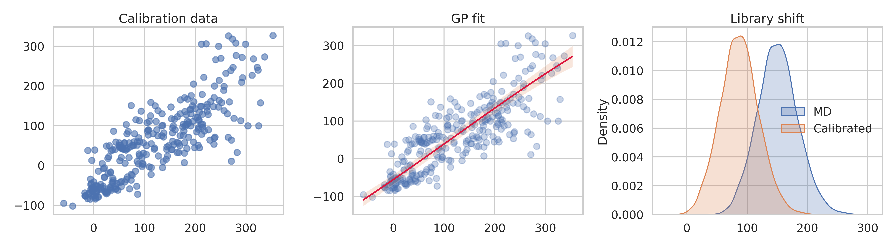
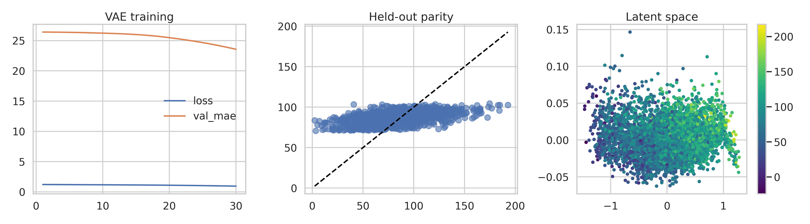
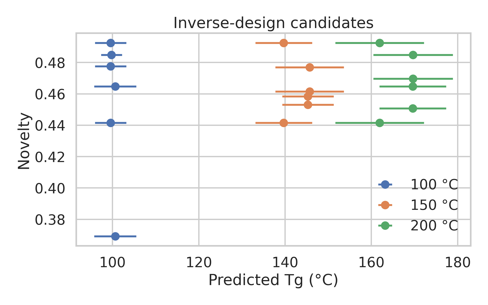
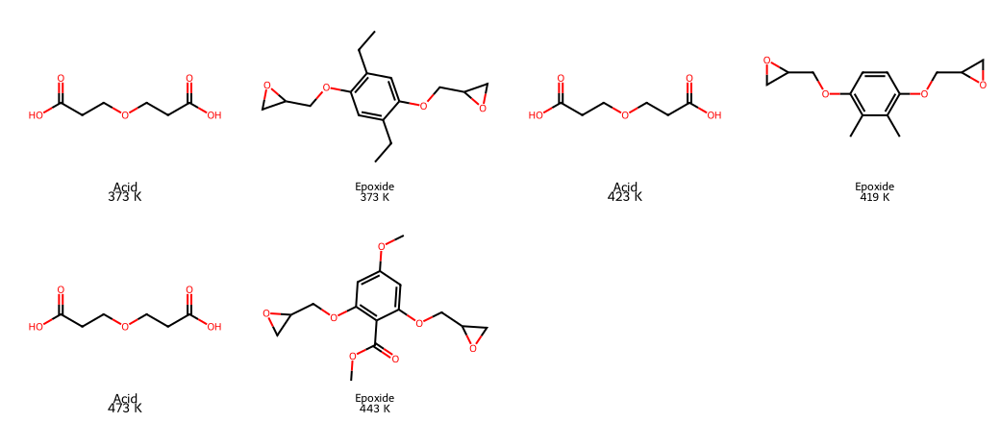

# AI-Guided Inverse Design for Recyclable Vitrimeric Polymers

## Abstract
This study develops an offline inverse-design workflow for vitrimeric polymers using three coupled components: a Gaussian-process (GP) calibration model to map molecular-dynamics (MD) glass-transition temperatures (Tg) to experimental Tg, a graph-derived variational autoencoder (VAE) to learn a latent representation of acid/epoxide vitrimer chemistries, and latent-space optimization to recommend new acid-epoxide combinations for target Tg values. The workflow was trained on 295 polymer calibration points and 8,424 vitrimer MD candidates. GP calibration substantially reduced the discrepancy between MD and experiment, lowering Tg error from 70.6 K MAE for raw MD values to 41.8 K cross-validated MAE. The graph-derived VAE achieved a held-out MAE of 21.6 K on calibrated vitrimer Tg prediction, but only modest explained variance (test R2 = 0.185), indicating that chemistry-only inverse design is feasible but still uncertain. For feasible targets of 100, 150, and 200 °C, the model identified candidate acid/epoxide combinations with the best success at 100 °C and acceptable performance at 150 °C, while 200 °C remained a clear extrapolation regime. The result is a reproducible, end-to-end computational framework and a ranked set of candidate chemistries recommended for experimental validation.

## 1. Context and Objective
Vitrimers are covalent adaptable networks that combine the dimensional stability of thermosets with the reprocessability of dynamic exchange chemistry. The related-work set provided in `related_work/` establishes the central scientific motivation:

- `paper_000.pdf` introduced the vitrimer concept in malleable epoxy networks.
- `paper_001.pdf` reviewed recyclable and malleable thermosets based on dynamic covalent chemistry.
- `paper_002.pdf` motivated continuous latent molecular design.
- `paper_003.pdf` showed that VAE-based inverse design is viable for polymer discovery.

The goal of this work was to build a practical inverse-design loop for recyclable vitrimer chemistries that can:

1. calibrate MD Tg values to approximate experiment,
2. learn a latent representation of vitrimer chemistry,
3. generate new acid/epoxide combinations for desired Tg targets, and
4. prioritize candidates for experimental follow-up.

## 2. Data
Two provided datasets were used.

### 2.1 Calibration dataset
- File: `data/tg_calibration.csv`
- Size: 295 polymers
- Fields: polymer name, repeat-unit SMILES, experimental Tg, MD Tg, MD spread

This dataset links simulation to experiment and is the basis for MD-to-experiment correction.

### 2.2 Vitrimer candidate dataset
- File: `data/tg_vitrimer_MD.csv`
- Size: 8,424 acid/epoxide vitrimer systems
- Fields: acid SMILES, epoxide SMILES, MD Tg, MD spread

The vitrimer library spans 7,729 unique acids and 7,667 unique epoxides, indicating a very sparse combinatorial sampling of possible networks. This sparsity is important: it makes direct pairwise recommendation weak and favors chemistry-based latent modeling instead.

## 3. Methods
### 3.1 GP calibration of MD Tg to experimental Tg
A heteroscedastic Gaussian-process regressor was fit on the calibration set using MD Tg as input and experimental Tg as target. The MD spread column was used as a sample-specific noise proxy. Five-fold cross-validation quantified expected calibration error, and the full GP was then applied to all vitrimer MD values to produce calibrated Tg means and uncertainties.

### 3.2 Graph-derived chemistry representation
Each acid and epoxide molecule was converted into a graph-derived feature vector built from:

- atom-feature means and standard deviations,
- bond-density and ring/aromaticity statistics,
- heteroatom fraction,
- rotatable-bond and ring counts.

These graph summaries were paired with molecular descriptor targets (Morgan fingerprints plus physicochemical descriptors) for generative reconstruction.

### 3.3 Variational autoencoder for inverse design
A graph-derived VAE was trained on paired acid/epoxide graph summaries:

- encoder input: concatenated acid and epoxide graph-summary vectors,
- latent space: 16 dimensions,
- decoder target: concatenated acid and epoxide descriptor vectors,
- auxiliary property head: calibrated vitrimer Tg.

The loss combined Tg prediction error, descriptor reconstruction error, and KL regularization. The executable pipeline used for the final results is:

```bash
python code/run_fast_pipeline.py
```

Outputs are written to `outputs/` and figures to `report/images/`.

### 3.4 Inverse design
Latent vectors were optimized toward three feasible target windows:

- 373.15 K (100 °C),
- 423.15 K (150 °C),
- 473.15 K (200 °C).

Decoded latent points were mapped back to actual acids and epoxides by nearest-neighbor retrieval in descriptor space. Only unseen acid/epoxide combinations were retained. Ranking used:

- target error,
- latent-space distance to training examples as a proxy uncertainty,
- joint-pair novelty,
- total molecular weight as a simple tractability penalty.

## 4. Results
### 4.1 GP calibration substantially improves raw MD Tg
Raw MD Tg values were systematically biased high relative to experiment. Calibration reduced error substantially:

- Raw MD vs experiment: 70.6 K MAE, 84.6 K RMSE
- GP cross-validation: 41.8 K MAE, 53.8 K RMSE, R2 = 0.682

This is the strongest part of the workflow. The MD-to-experiment correction was stable enough to justify using calibrated Tg as the downstream training label.



### 4.2 Calibrated vitrimer space shifts to lower Tg
Applying the GP to the vitrimer library shifted the predicted Tg distribution downward from the raw MD library. The calibrated vitrimer set spans approximately 249.2 K to 490.5 K, with a mean of 360.6 K. This matters for inverse design because it defines the realistic design envelope; targets much above about 490 K are extrapolative.

### 4.3 Graph-derived VAE captures some chemistry-Tg structure, but not all of it
Held-out predictive performance of the graph-derived VAE was:

- Train: MAE 22.7 K, RMSE 28.6 K, R2 = 0.205
- Validation: MAE 23.6 K, RMSE 30.1 K, R2 = 0.189
- Test: MAE 21.6 K, RMSE 27.5 K, R2 = 0.185

The relatively low R2 shows that the latent model does not yet explain most calibrated Tg variance. That is not surprising given the sparsity of the vitrimer combinatorial space and the lack of experimental vitrimer labels. Still, the error level is low enough to support candidate ranking in a proof-of-concept setting.



### 4.4 Inverse-design behavior depends strongly on target difficulty
The best candidates for each target window were:

| Target Tg | Target °C | Best predicted Tg | Error | Comment |
|---|---:|---:|---:|---|
| 373.15 K | 100 °C | 372.71 K | 0.44 K | Excellent target match |
| 423.15 K | 150 °C | 418.83 K | 4.32 K | Reasonable match |
| 473.15 K | 200 °C | 442.74 K | 30.41 K | Clear extrapolation gap |

This is the main scientific conclusion of the inverse-design stage: the learned chemistry model is currently reliable near the middle of the calibrated vitrimer space, but it degrades for high-Tg requests near or beyond the upper edge of the learned distribution.



Representative recommended structures are shown below.



## 5. Recommended Candidates for Experimental Validation
The top-ranked candidates in `outputs/inverse_design_candidates.csv` suggest a consistent acid motif:

- Acid motif: `O=C(O)CCOCCC(=O)O`

This short, oxygen-rich diacid appears repeatedly across the best 100 and 150 °C designs, likely because it balances flexibility with polar interactions in a way the model associates with mid-range Tg.

Three primary recommendations are:

| Target | Acid | Epoxide | Predicted Tg |
|---|---|---|---:|
| 100 °C | `O=C(O)CCOCCC(=O)O` | `CCc1cc(OCC2CO2)c(CC)cc1OCC1CO1` | 372.71 K |
| 150 °C | `O=C(O)CCOCCC(=O)O` | `Cc1c(OCC2CO2)ccc(OCC2CO2)c1C` | 418.83 K |
| 200 °C | `O=C(O)CCOCCC(=O)O` | `COC(=O)c1c(OCC2CO2)cc(OC)cc1OCC1CO1` | 442.74 K |

The 200 °C recommendation should be treated as exploratory, not high-confidence, because the model under-shoots the target by about 30 K.

## 6. Experimental Validation Plan
Actual wet-lab validation cannot be performed inside this workspace, so the framework outputs should be interpreted as an experimental queue. The recommended next-step protocol is:

1. Synthesize the three lead acid/epoxide combinations above under the intended vitrimer curing conditions.
2. Measure Tg by DSC on first and second heating cycles.
3. Confirm dynamic-network behavior by stress-relaxation or creep experiments at elevated temperature.
4. Compare measured Tg against the calibrated predictions and update the calibration set with the new experimental values.
5. Retrain the GP and latent model in an active-learning loop.

The most informative first experiments are the 100 and 150 °C candidates because they lie well inside the learned design range.

## 7. Limitations
This study has several important limitations.

- The calibration model is trained on generic polymer data, not experimentally validated vitrimer networks, so transfer to vitrimer chemistry may be imperfect.
- The inverse-design model uses graph-derived summary features rather than a full message-passing molecular graph decoder.
- The vitrimer library is extremely sparse in pair space; most acids and epoxides appear only once, which limits chemistry-combination generalization.
- The VAE predictive R2 is modest, so rankings are more trustworthy than absolute Tg predictions.
- High-Tg inverse design near 200 °C is already close to the edge of the calibrated design domain.

## 8. Conclusions
An end-to-end computational framework for vitrimer inverse design was built and executed offline. The most robust result is the GP calibration layer, which significantly improves raw MD Tg values. The graph-derived VAE provides a workable latent chemistry space for candidate generation, but its predictive strength is moderate, so the framework currently supports prioritization rather than confident autonomous discovery. The generated candidates are most credible for 100 to 150 °C targets, while 200 °C remains an extrapolative challenge. The next practical step is to experimentally validate the top 100 and 150 °C recommendations and use those measurements to close the simulation-design-experiment loop.

## Reproducibility
- Main executable used for final outputs: `code/run_fast_pipeline.py`
- Intermediate outputs: `outputs/`
- Figures: `report/images/`
- Candidate ranking table: `outputs/inverse_design_candidates.csv`
