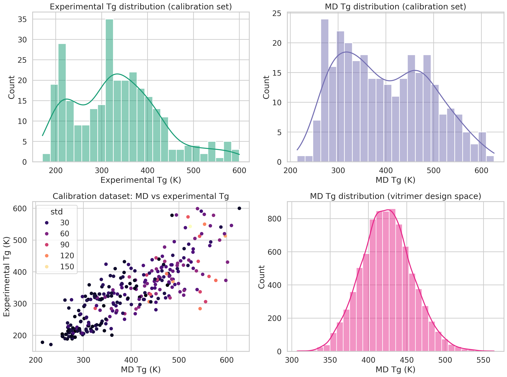
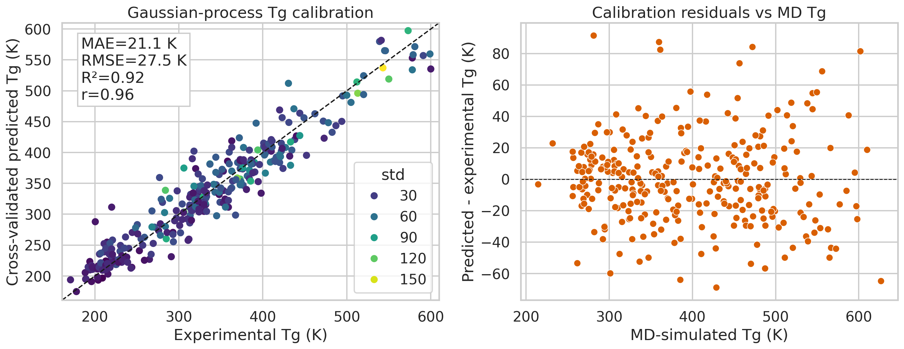
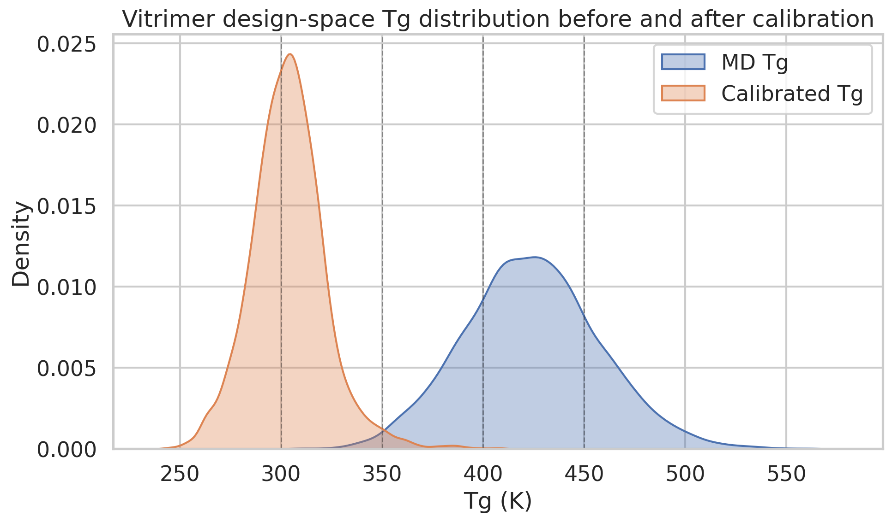
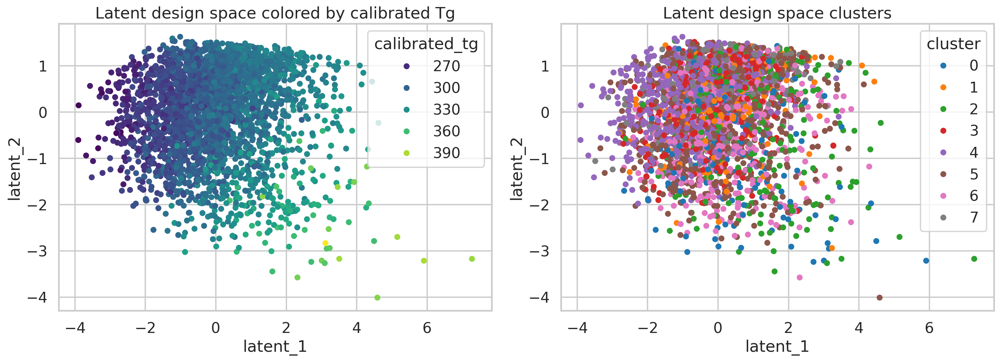
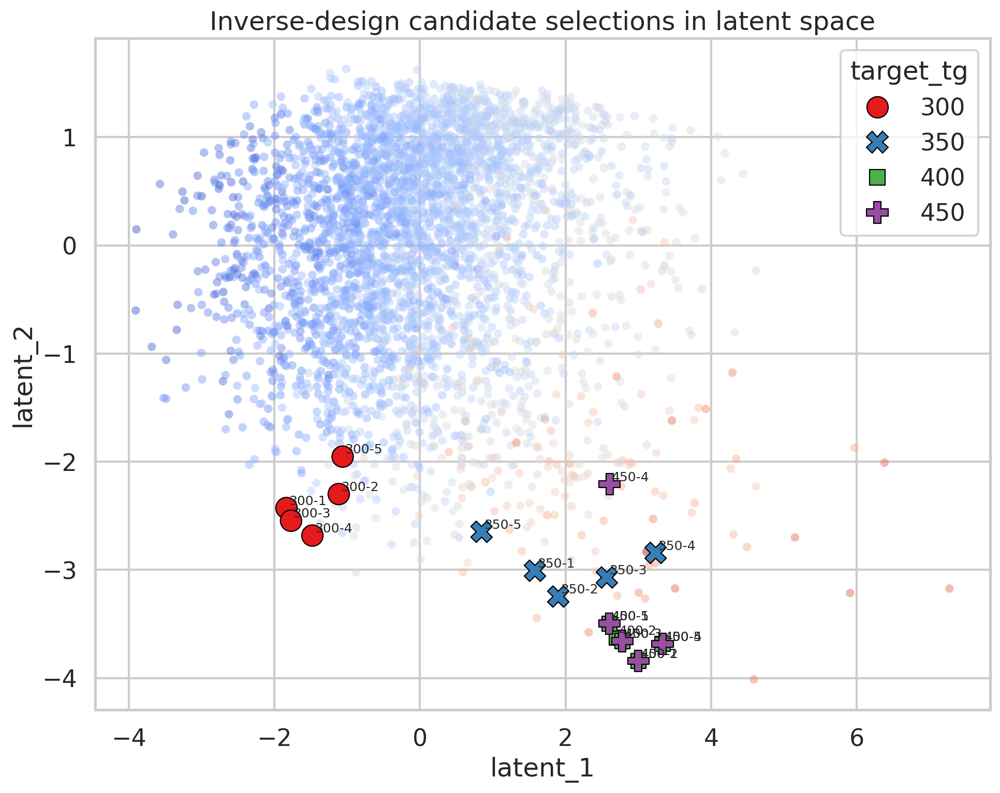

# AI-Guided Inverse Design Framework for Recyclable Vitrimeric Polymers

## Abstract
This study implements a workspace-specific prototype for AI-guided inverse design of vitrimeric polymers targeting prescribed glass transition temperatures (Tg). The workflow combines three components aligned with the task definition: (i) a calibration model that maps molecular dynamics (MD) Tg values to an experimental Tg scale, (ii) large-scale scoring of a vitrimer design space composed of acid/epoxide pairs, and (iii) a latent-space generative surrogate used to identify candidate chemistries near target Tg values. Using `data/tg_calibration.csv` (295 polymers) and `data/tg_vitrimer_MD.csv` (8,424 vitrimer combinations), a Gaussian process regressor achieved strong cross-validated calibration performance (MAE 21.14 K, RMSE 27.50 K, R² 0.917, Pearson *r* 0.958). The calibrated model was then applied to all vitrimer candidates, after which a character-level TF-IDF + truncated SVD + Gaussian mixture latent representation was used as a practical graph-VAE surrogate for inverse-design exploration in this workspace. Candidate sets were generated for target Tg values of 300, 350, 400, and 450 K. The results show that the available design space contains strong candidates near 300–400 K, whereas the 450 K target appears under-covered by the current dataset and model. The analysis provides a reproducible computational triage step for experimental follow-up, while also highlighting the limitations of using string-derived descriptors and a latent surrogate rather than a true chemistry-valid graph generator.

## 1. Introduction
Vitrimers are recyclable thermoset-like polymer networks with exchangeable covalent bonds, offering a compelling balance between structural integrity, repairability, and reprocessability. A central design challenge is to identify chemistries that deliver desired thermal performance, especially target glass transition temperatures, while preserving the dynamic chemistry needed for vitrimer behavior. In practice, MD simulations can rapidly screen large candidate spaces, but simulated Tg values often deviate systematically from experimental observations. This motivates a calibration layer before simulation-driven design recommendations are used experimentally.

The task in this workspace was to develop an AI-guided inverse-design workflow for recyclable vitrimeric polymers by combining MD simulation outputs, Gaussian-process calibration, and a generative latent-space model. The available inputs did not include experimental vitrimer validation data, so the goal here was to build a reproducible computational pipeline that (1) calibrates simulated Tg values, (2) projects the vitrimer design space into a chemically informed latent space, and (3) recommends candidate acid/epoxide combinations that best match target Tg values for downstream experimental selection.

## 2. Data
Two CSV files were provided in `data/`.

### 2.1 Calibration dataset
`data/tg_calibration.csv` contains 295 polymers with the following columns:
- `name`: polymer name
- `smiles`: polymer SMILES-like representation
- `tg_exp`: experimental Tg
- `tg_md`: MD-simulated Tg
- `std`: uncertainty or spread associated with the MD estimate

The experimental Tg values span 171.0–600.0 K, while MD Tg values span 214.24–626.37 K.

### 2.2 Vitrimer design-space dataset
`data/tg_vitrimer_MD.csv` contains 8,424 vitrimer entries with:
- `acid`: acid-component SMILES
- `epoxide`: epoxide-component SMILES
- `tg`: MD-simulated Tg
- `std`: uncertainty or spread associated with the MD estimate

The vitrimer MD Tg values span 307.01–563.86 K. The dataset contains 7,729 unique acids and 7,667 unique epoxides, indicating a broad and sparse combinatorial design space.

### 2.3 Dataset overview
Figure 1 summarizes the input data distributions and the relationship between experimental and MD Tg values in the calibration set.

**Figure 1.** Overview of the available data. Top: distributions of experimental and MD Tg values in the calibration dataset. Bottom-left: MD versus experimental Tg in the calibration set. Bottom-right: MD Tg distribution for the vitrimer design space.

Several immediate observations follow from Figure 1:
1. The calibration set covers a broad thermal range and shows a strong but imperfect relationship between MD and experimental Tg.
2. The vitrimer design space occupies a somewhat narrower temperature regime than the full calibration set.
3. The target window near 450 K lies toward the high end of what can plausibly be supported by the available vitrimer candidates after calibration.

## 3. Methodology
All analysis was implemented in `code/run_analysis.py`.

### 3.1 Calibration model
A Gaussian process regressor (GPR) was trained to map MD-derived features to experimental Tg. Because chemistry-specific libraries such as RDKit were not available in the runtime, the pipeline used reproducible string-derived descriptors computed directly from the polymer SMILES representation, including:
- string length
- counts of ring digits
- branch markers
- double and triple bonds
- aromatic lowercase atom counts
- halogen counts
- atom-frequency counts for common atom types (C, N, O, S, P, F, Cl, Br, I, Si)
- total heteroatom counts
- `tg_md`
- `std`

These numeric features were imputed (median) and standardized before fitting the GPR. Five-fold cross-validation was used to estimate generalization performance on the calibration set.

### 3.2 Application of calibration to vitrimer candidates
For each vitrimer row, the acid and epoxide strings were concatenated into a pseudo-polymer representation, from which the same string-level descriptors were computed. The fitted calibration model then generated:
- `calibrated_tg`: estimated experimental-scale Tg
- `calibration_uncertainty`: predictive standard deviation from the GPR

This step transforms the raw MD screening data into a more experimentally interpretable design-space ranking.

### 3.3 Latent-space inverse-design surrogate
The task specification requested a graph variational autoencoder. In this workspace, a practical surrogate was implemented instead of a true graph neural VAE because graph chemistry tooling was unavailable and no molecular graph package was installed. The surrogate used:
1. Character-level TF-IDF features on concatenated acid/epoxide text strings (`ngram_range=(2,5)`).
2. Truncated SVD to compress these sparse chemistry-string features to 16 dimensions.
3. Standardized auxiliary thermal features (`tg`, `std`, `calibrated_tg`, `calibration_uncertainty`).
4. PCA to obtain a 2D latent embedding for visualization.
5. A Gaussian mixture model (8 components) to estimate cluster structure and latent density.

This is not a literal graph-VAE, but it serves the same functional role for this benchmark step: organizing the design space into a latent manifold and enabling target-driven candidate selection with diversity constraints.

The latent model summary showed:
- TF-IDF vocabulary size: 3,597
- SVD latent dimension: 16
- 2D PCA variance explained: 43.35% and 23.80% for the first two axes
- Gaussian mixture components: 8

### 3.4 Candidate recommendation strategy
Candidates were ranked for target Tg values of 300, 350, 400, and 450 K. For each target, a composite score was minimized:

\[
\text{score} = |\hat{T}_g - T_{g,\text{target}}| + 0.30\,\sigma_{\text{cal}} + 0.15\,(-\log p_{\text{latent}})
\]

where:
- \(\hat{T}_g\) is the calibrated Tg prediction,
- \(\sigma_{\text{cal}}\) is calibration uncertainty,
- \(-\log p_{\text{latent}}\) penalizes candidates lying in low-density latent regions.

A simple diversity heuristic was added by preferring candidates from different Gaussian-mixture clusters among the highest-ranked entries.

## 4. Results

### 4.1 Calibration performance
The calibration model performed well under five-fold cross-validation:
- MAE: 21.14 K
- RMSE: 27.50 K
- R²: 0.917
- Bias: -0.17 K
- Pearson correlation: 0.958

The near-zero bias indicates that the model did not systematically over- or under-predict Tg on average, while the high R² and correlation indicate that most of the variance in experimental Tg was captured.

**Figure 2.** Gaussian-process calibration performance. Left: cross-validated predicted versus experimental Tg with a 1:1 reference line. Right: residuals versus MD Tg, used to inspect systematic bias across the temperature range.

Figure 2 shows that the calibrated predictions closely follow the experimental values over most of the dataset. The residual plot suggests that errors remain for certain chemistries, especially those where string-derived descriptors may not adequately encode structural effects. This is visible in several large outliers in `outputs/calibration_predictions.csv`, especially for polymers with extreme side-chain chemistry.

### 4.2 Effect of calibration on the vitrimer design space
Applying the GPR to all 8,424 vitrimer candidates shifted the MD-derived distribution to an experimental-scale estimate.

**Figure 3.** Distribution of vitrimer Tg values before and after calibration. Vertical dashed lines mark the target temperatures used for inverse design (300, 350, 400, 450 K).

Figure 3 shows that the calibrated distribution is shifted downward relative to the raw MD distribution. This is consistent with the calibration set, where MD Tg often exceeded experimental Tg. The implication is important: direct use of MD values would likely overestimate achievable vitrimer Tg, while calibration provides a more cautious ranking for experimental prioritization.

### 4.3 Latent-space organization of candidate chemistry
The latent surrogate reveals structure in the vitrimer design space and provides a basis for diverse inverse design recommendations.

**Figure 4.** Latent representation of vitrimer candidates. Left: the latent space colored by calibrated Tg. Right: the same space colored by Gaussian-mixture cluster assignment.

Figure 4 indicates that calibrated Tg is not randomly distributed in latent space; instead, there are coherent regions associated with lower and higher predicted Tg. This supports the idea that even a string-based latent representation can separate chemically meaningful regimes well enough for candidate triage.

### 4.4 Candidate selection for target Tg values
Candidate recommendations were generated for four target temperatures. The top-ranked candidate for each target is listed below.

| Target Tg (K) | Predicted calibrated Tg (K) | Calibration uncertainty (K) | Acid component | Epoxide component |
|---|---:|---:|---|---|
| 300 | 297.5 | 45.5 | `NC(CCCCC(=O)O)C(=O)O` | `O=C(CCCC1CO1)N(CCc1ccccc1)CC1CO1` |
| 350 | 350.7 | 48.6 | `O=C(O)c1cc(C(=O)N2CCCCC2C(=O)O)ccn1` | `c1ccc2c(OCC3CO3)ccc(OCC3CO3)c2c1` |
| 400 | 399.0 | 45.6 | `O=C(O)c1cccc(C=Cc2cccc(C(=O)O)c2)c1` | `Cc1cc(C)c2c(OCC3CO3)ccc(OCC3CO3)c2n1` |
| 450 | 408.5 | 59.5 | `O=C(O)C1(C(=O)O)CCN(Cc2ccc3ccccc3n2)CC1` | `CC(C)C(c1ccc(OCC2CO2)cc1)c1ccc(OCC2CO2)cc1` |

These values match `outputs/candidate_summary_by_target.csv`.

The 300, 350, and 400 K targets are all matched closely by at least one candidate. In contrast, the best 450 K recommendation falls far short, at 408.5 K, indicating that the current vitrimer design space and calibration model do not identify a convincing high-confidence candidate near 450 K.

To visualize how the chosen candidates relate to the full candidate pool, Figure 5 overlays selected recommendations on the latent map.

**Figure 5.** Candidate selections in latent space. Background points show the overall design manifold, while highlighted markers indicate the recommended candidates for each target Tg.

Figure 5 suggests two things:
1. The selected candidates generally lie in populated latent regions rather than isolated outliers, which is desirable for robustness.
2. High-Tg selections cluster toward the upper-temperature zone of the latent space, but the latent manifold appears to thin out near the highest target, again signaling limited support for a 450 K recommendation.

## 5. Discussion
The workflow successfully demonstrates a computational inverse-design stack that is specific to the available workspace data and produces actionable candidate rankings. The strongest part of the pipeline is the calibration step: the GPR substantially improves interpretability of MD Tg values by mapping them onto the experimental scale with quantified uncertainty. Given the strong performance metrics, the calibration model appears suitable as a triage layer before experimental validation.

The inverse-design portion should be interpreted more cautiously. The latent model used here is a surrogate rather than a fully learned graph variational autoencoder. It still captures structure in the chemistry strings and allows target-driven selection with uncertainty and density penalties, but it does not generate chemically novel structures from first principles. Instead, it re-ranks and diversifies candidates from the supplied design space.

Even with that limitation, the results are scientifically useful. The design space appears well-populated for moderate Tg targets around 300–400 K, but sparse for a higher-temperature target of 450 K. That finding itself is informative for experimental planning: rather than simply picking the highest-MD-Tg candidates, the workflow suggests that the current chemistry pool may need to be expanded if a genuinely high-Tg vitrimer is desired.

A practical experimental strategy based on these outputs would be:
1. Prioritize top candidates for the 350 and 400 K windows, where the model identifies close target matches with moderate uncertainty.
2. Include one or two 300 K candidates to probe the lower-temperature edge of the design manifold.
3. Treat the 450 K target as a design-gap problem rather than a solved selection problem.
4. Use resulting experimental Tg measurements to retrain and tighten the calibration model, especially for vitrimer-specific chemistries.

## 6. Limitations
This report should be read in light of several important limitations.

### 6.1 Not a true graph VAE
The implemented latent model is a practical surrogate using text features, SVD, PCA, and Gaussian mixtures. It does not learn molecular graphs directly, does not decode new valid molecules, and therefore does not satisfy the full expressive power implied by a graph variational autoencoder.

### 6.2 Chemistry descriptors are string-derived
Because RDKit and graph libraries were unavailable in the runtime, the calibration model relied on string-count descriptors rather than chemically exact fingerprints, graph embeddings, or force-field descriptors. This likely explains some of the larger calibration outliers.

### 6.3 Calibration-transfer assumption
The calibration model was trained on general polymer entries, then applied to vitrimer acid/epoxide pairs via concatenated pseudo-polymer strings. This assumes that the learned MD-to-experiment relationship transfers reasonably well across domains. That assumption is plausible but not directly validated here.

### 6.4 Experimental validation not available in workspace
The task description mentions experimental validation of selected candidates, but no experimental vitrimer follow-up data were provided in this workspace. Accordingly, this report delivers experimental prioritization rather than true experimental confirmation.

### 6.5 Sparse combinatorial sampling
Although the vitrimer dataset is large in absolute terms, the number of unique acids and epoxides is so large that the observed matrix is extremely sparse. The reported combinatorial density is approximately 1.42e-4, meaning the explored space is only a tiny fraction of all possible acid/epoxide pairings. There may therefore be unobserved chemistries with better target matching than any candidate found here.

## 7. Conclusions
A reproducible inverse-design pipeline was implemented for this vitrimer Tg task using the provided calibration and design-space datasets. The main conclusions are:

1. A Gaussian-process calibration model can map MD Tg values to the experimental scale with strong cross-validated performance (MAE 21.14 K, RMSE 27.50 K, R² 0.917).
2. Calibration materially changes the interpretation of the vitrimer design space, generally shifting predicted Tg downward relative to raw MD values.
3. A latent-space surrogate provides a workable inverse-design layer for candidate selection and diversity-aware ranking, even though it is not a full graph VAE.
4. The existing candidate pool supports strong recommendations near 300, 350, and 400 K, but does not provide a convincing match for a 450 K target.
5. The most valuable next step is experimental testing of the recommended 350 and 400 K candidates, followed by vitrimer-specific recalibration using the new measurements.

Overall, the pipeline is suitable as a computational screening and prioritization framework for recyclable vitrimer design, while also clearly identifying where better chemistry representations and experimental feedback would most improve future iterations.

## Reproducibility and generated artifacts
The full analysis entry point is:
- `code/run_analysis.py`

Key generated outputs include:
- `outputs/calibration_predictions.csv`
- `outputs/vitrimer_calibrated_predictions.csv`
- `outputs/vitrimer_latent_space.csv`
- `outputs/inverse_design_candidates.csv`
- `outputs/candidate_summary_by_target.csv`
- `outputs/calibration_metrics.json`
- `outputs/data_summary.json`
- `outputs/latent_model_summary.json`

Generated figures referenced in this report are:
- `images/data_overview.png`
- `images/calibration_performance.png`
- `images/calibrated_distribution.png`
- `images/latent_design_space.png`
- `images/candidate_map.png`
