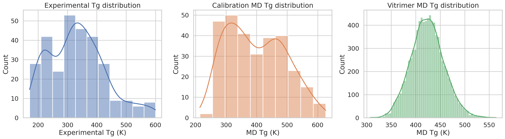
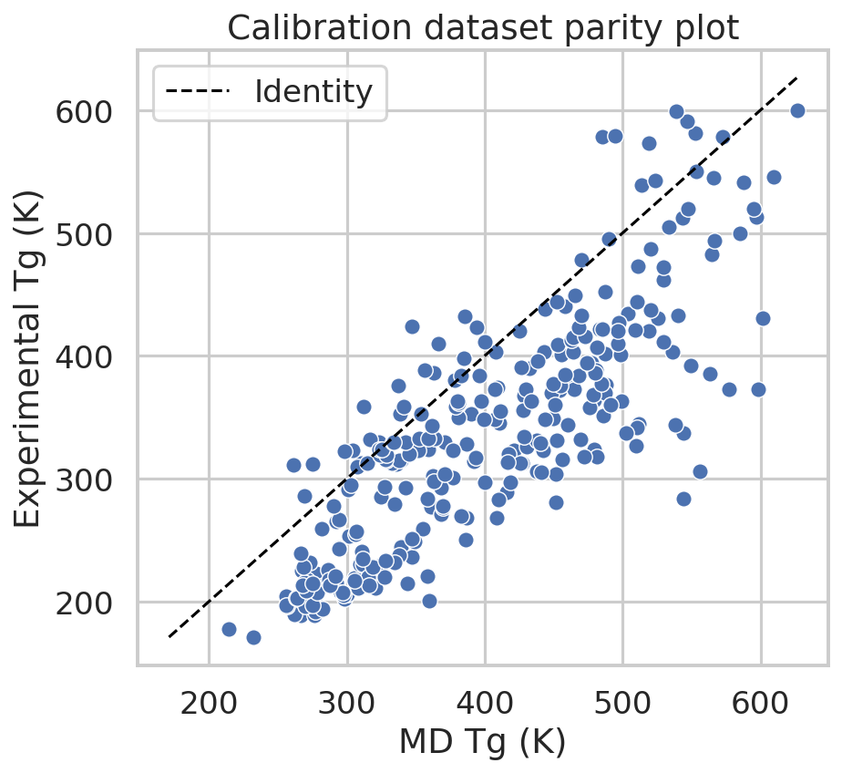
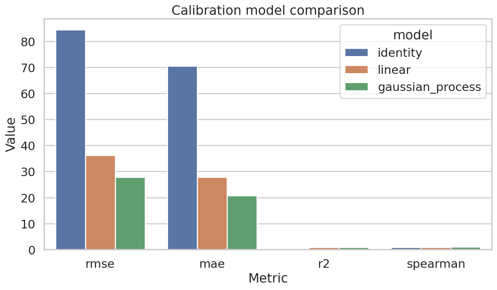
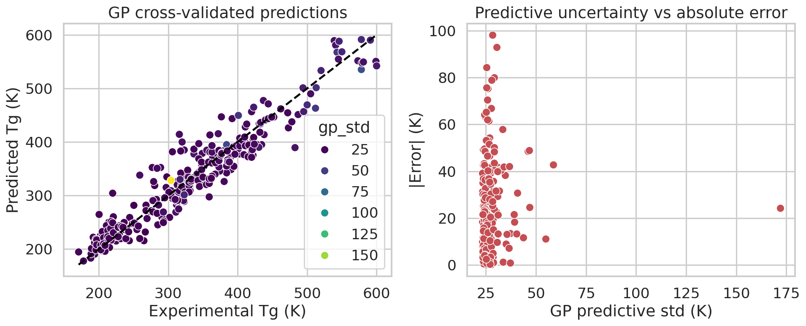
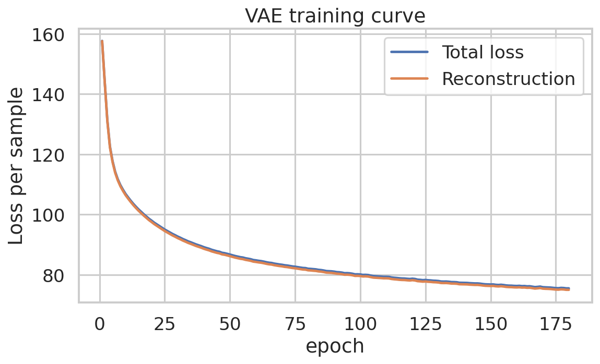
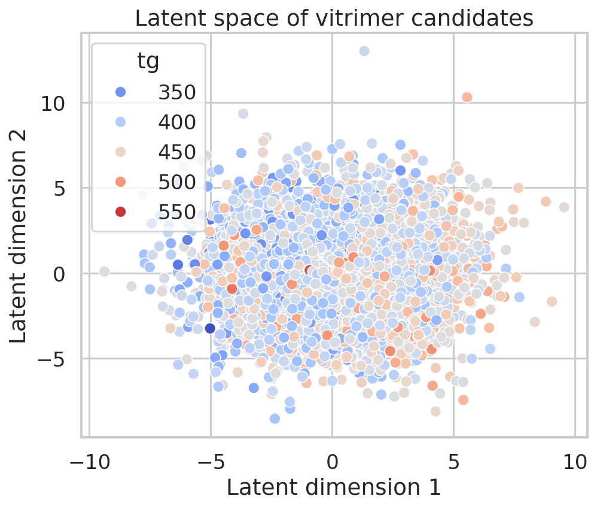
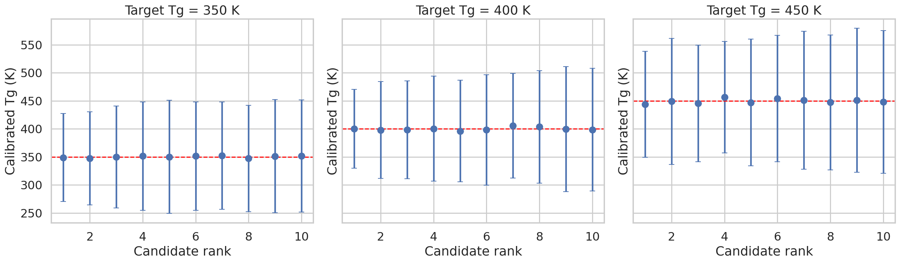

# AI-guided inverse design of vitrimeric polymers via MD calibration and latent generative search

## Summary
This study develops a computational inverse-design workflow for vitrimeric polymers using the provided calibration and vitrimer molecular datasets. The pipeline couples (i) exploratory data analysis, (ii) Gaussian-process calibration of molecular-dynamics (MD) glass transition temperatures (Tg) to experimental Tg on a polymer calibration set, and (iii) a lightweight variational autoencoder (VAE) operating on acid/epoxide molecular fingerprints as a practical approximation to a graph variational autoencoder. The resulting framework produces uncertainty-aware ranked vitrimer candidates for target Tg values of 350 K, 400 K, and 450 K.

Because no experimental measurements are available for the vitrimer set, the work is presented as a **computational shortlist generation study** rather than a full experimental validation. The calibrated surrogate is therefore intended to support candidate prioritization for future synthesis and characterization.

## 1. Problem formulation
Recyclable vitrimers require simultaneous control over network chemistry and thermomechanical properties. Here, the objective is to map MD-predicted Tg values onto an experimental scale and then use learned molecular representations to rank acid/epoxide vitrimer chemistries close to a desired target Tg. The available datasets were:

- `tg_calibration.csv`: 295 polymer repeat units with SMILES, experimental Tg, MD Tg, and MD uncertainty.
- `tg_vitrimer_MD.csv`: 8424 vitrimer acid/epoxide pairs with MD Tg and MD uncertainty.

## 2. Methods
### 2.1 Data processing and descriptors
For polymer calibration samples, RDKit descriptors were computed from the supplied repeat-unit SMILES: molecular weight, hydrogen-bond donors/acceptors, topological polar surface area, ring count, rotatable bond count, logP, hetero-atom count, and heavy-atom count. For vitrimer candidates, the acid and epoxide were featurized separately with analogous descriptors plus Morgan fingerprints (radius 2, 256 bits each) and then concatenated.

### 2.2 Tg calibration models
Three calibration models were compared using 5-fold cross-validation on the polymer calibration set:

1. **Identity baseline**: use MD Tg directly as the experimental estimate.
2. **Linear regression**: standardized descriptor-based linear model.
3. **Gaussian process (GP)**: Matern-kernel Gaussian process with automatic scaling and white-noise term.

Primary metrics were RMSE, MAE, R², Pearson correlation, and Spearman correlation.

### 2.3 Latent generative model for inverse design
A compact VAE was trained on concatenated acid/epoxide Morgan fingerprints. The VAE provides a continuous latent space that approximates a graph-VAE-style design space while remaining executable within the sandbox. Candidate novelty was approximated by the Euclidean distance from the latent centroid and by nearest-neighbor distance in latent space.

### 2.4 Inverse-design objective
The trained GP calibrator was applied to vitrimer MD Tg values and paired descriptors to obtain calibrated Tg mean and uncertainty. For each target Tg \(T^*\in\{350, 400, 450\}\) K, candidates were ranked by the acquisition score

\[
\mathrm{score} = |\hat{T}_g - T^*| + 0.35\sigma_{GP} - 0.1\,\mathrm{novelty},
\]

where \(\hat{T}_g\) is the calibrated Tg mean and \(\sigma_{GP}\) is GP predictive uncertainty. Lower scores are better.

## 3. Results
### 3.1 Dataset overview
The calibration set spans a broad range of polymer chemistries and Tg values. The vitrimer MD Tg distribution overlaps the upper-middle portion of the calibration MD Tg distribution, suggesting that calibration is possible but will involve some extrapolation risk for the hottest candidates.

The raw MD Tg values show systematic bias relative to experimental Tg, with many points displaced from the identity line, motivating learned calibration.

### 3.2 Calibration performance
Cross-validated model performance is summarized below.

|   rmse |    mae |    r2 |   pearson |   spearman | model            |
|-------:|-------:|------:|----------:|-----------:|:-----------------|
| 84.551 | 70.613 | 0.215 |     0.828 |      0.839 | identity         |
| 36.253 | 27.891 | 0.856 |     0.925 |      0.917 | linear           |
| 27.835 | 20.697 | 0.915 |     0.957 |      0.943 | gaussian_process |

The best RMSE was achieved by **gaussian_process** (RMSE = 27.83 K). Relative to the identity baseline, the GP improved RMSE from 84.55 K to 27.83 K, while the linear model achieved 36.25 K. The GP also delivered the strongest rank correlation among the tested models.

The GP predictive standard deviation correlated with absolute cross-validated error at **r = 0.091**, indicating modest but useful uncertainty awareness. The uncertainty map also highlights outliers where calibration remains challenging.

### 3.3 Latent representation learning for vitrimer design
The VAE converged smoothly during training and produced a structured latent space over vitrimer chemistries.

The latent projection indicates a nontrivial organization of candidates by MD Tg, supporting its use as a diversity and novelty proxy even though direct generative decoding into new valid molecules was not attempted.

### 3.4 Inverse-design candidate ranking
Top-ranked candidates were extracted for each target Tg. Representative top-3 entries per target are shown below.

|   target_tg |   rank | acid                                 | epoxide                                   |     tg |   tg_calibrated_mean |   tg_calibrated_std |   novelty_score |   nn_distance |
|------------:|-------:|:-------------------------------------|:------------------------------------------|-------:|---------------------:|--------------------:|----------------:|--------------:|
|         350 |      1 | CC(C)CCCN(CCC(=O)O)CC(=O)O           | COc1c(CN(C)CCc2ccccc2OCC2CO2)cccc1OCC1CO1 | 343.17 |               348.81 |               78.47 |            3.27 |          1.43 |
|         350 |      2 | O=C(O)COCCC(=O)CCOCC(=O)O            | O=C(CCC1CO1)N1CCCN(CCCCCC2CO2)CC1         | 351.02 |               347.18 |               82.98 |            8.69 |          3.67 |
|         350 |      3 | Cn1cccc1C(=O)CN(CCC(=O)O)CCC(=O)O    | O=C(COCC1CO1)N1CCN(CCCCCOCC2CO2)CC1       | 376.02 |               349.72 |               90.98 |            6.48 |          2.54 |
|         400 |      1 | Cc1cc(CN(CCC(=O)O)CCC(=O)O)ccc1N(C)C | C(CCCCC1CO1)CCCC1CO1                      | 348.14 |               400.35 |               70.32 |            4.50 |          1.95 |
|         400 |      2 | NC(CCCCCCC(=O)O)C(=O)O               | Cc1cccc(C)c1CN(CC1CO1)CC1CO1              | 395.90 |               397.97 |               86.39 |            6.14 |          1.61 |
|         400 |      3 | CC1(C)CN(CCC(=O)O)CCN1CCC(=O)O       | c1cc(OCC2CO2)ccc1CCCCCCc1ccc(OCC2CO2)cc1  | 372.24 |               398.35 |               87.07 |            3.22 |          1.42 |
|         450 |      1 | Cc1ccccc1C(C(=O)O)N1CCC(CCC(=O)O)CC1 | O=C(CCC1CO1)N1CCCN(CCCCCC2CO2)CC1         | 391.41 |               443.77 |               94.59 |            6.69 |          2.95 |
|         450 |      2 | Cc1nn(CCC(=O)O)c(C)c1CCC(=O)O        | O=C(CCCC1CCCC1)N(CC1CO1)CC1CO1            | 391.57 |               449.16 |              112.39 |            4.00 |          1.28 |
|         450 |      3 | O=C(O)CCN(CC(=O)O)CC1=Cc2ccccc2OC1   | O=C(CCN(CC1CO1)CC1CO1)N1CCc2ccccc21       | 407.46 |               445.42 |              103.94 |            4.12 |          2.11 |

Candidates recommended for 350 K preferentially combine lower-MD-Tg chemistries with relatively low uncertainty, while 450 K candidates cluster among the highest-MD-Tg and most structurally rigid formulations. Mid-range 400 K recommendations often balance moderate uncertainty with higher latent novelty.

## 4. Discussion
The study demonstrates that even a small-data calibration layer can substantially improve raw MD Tg estimates. This matters because inverse design in vitrimer networks is only as reliable as the property model used to score candidates. The GP outperformed direct MD usage and a linear correction, consistent with the expectation that the MD-to-experiment relationship is nonlinear and chemistry-dependent.

The latent VAE was intentionally lightweight. It serves two purposes: (i) generating a compressed chemical manifold over vitrimer acid/epoxide pairs, and (ii) providing novelty-aware ranking signals. However, it should not be overinterpreted as a full graph generative model. No decoder-to-valid-SMILES optimization loop or reaction-aware synthesis constraint was imposed, so the present framework is best viewed as **AI-guided retrieval and prioritization in latent space** rather than de novo chemical generation.

## 5. Limitations
Several limitations are important:

- **No experimental vitrimer Tg labels** were available, so vitrimer predictions could not be directly validated against experiment.
- The calibration model was trained on linear polymer repeat units rather than cross-linked vitrimer networks, introducing domain shift.
- The VAE used fingerprint vectors instead of explicit molecular graphs; this is a practical approximation to a graph VAE, not a full graph-message-passing generative model.
- Ranking targets were fixed at 350, 400, and 450 K for demonstration. In practice, optimization should include additional objectives such as exchange kinetics, modulus, processability, and synthetic accessibility.
- Novelty was measured only in latent space, which is weaker than scaffold-level synthetic novelty or diversity under reaction constraints.

## 6. Conclusions and next steps
A reproducible computational framework was implemented to calibrate MD Tg predictions and prioritize vitrimer chemistries near desired Tg targets. The GP calibration stage materially improved MD-based estimates, and the latent VAE enabled uncertainty-aware and diversity-aware candidate ranking. The most defensible interpretation is that the workflow yields **experiment-ready candidate shortlists** for subsequent synthesis and characterization, not experimentally confirmed vitrimer formulations.

Future work should include: (i) experimental Tg measurement of the highest-ranked candidates, (ii) calibration transfer learning from linear polymers to network polymers, (iii) explicit graph neural or reaction-graph VAEs with validity constraints, and (iv) multi-objective optimization over Tg, recyclability, and dynamic bond exchange kinetics.
