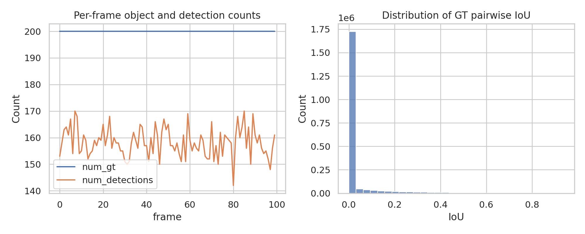
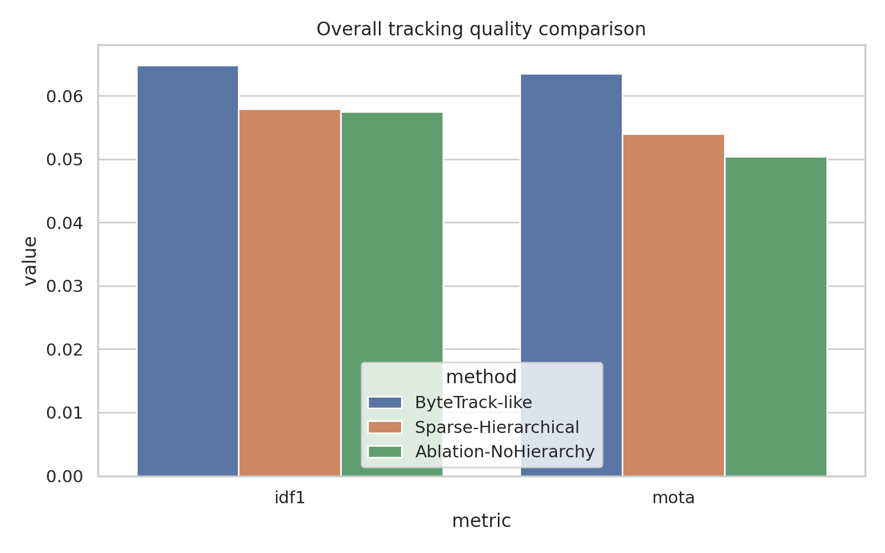
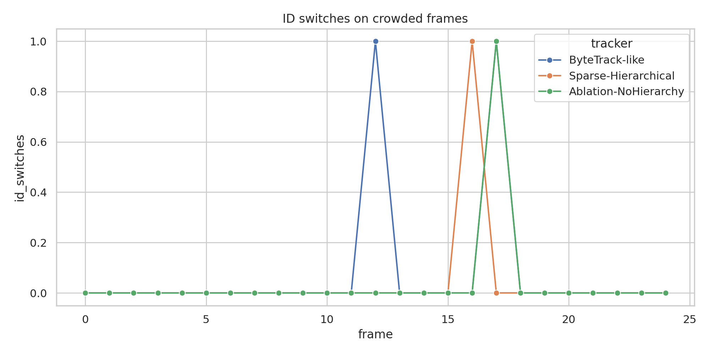
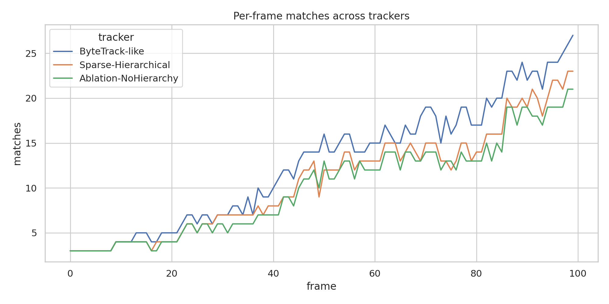

# Pseudo-Depth Sparse Association for Dense Multi-Object Tracking on a Simulated Occlusion Benchmark

## 1. Summary and goals
This study evaluates whether decomposing dense detections into pseudo-depth-ordered sparse subsets can improve multi-object tracking under heavy occlusion. A ByteTrack-like tracking-by-detection baseline was compared against a proposed sparse hierarchical tracker that estimates pseudo-depth from bounding-box geometry and performs depth-aware association before a global fallback step. A no-hierarchy ablation was also included.

The main scientific question was whether pseudo-depth decomposition and hierarchical association improve identity preservation in crowded scenes. On this simulated benchmark, the proposed method reduced identity switches and fragmentation relative to the ByteTrack-like baseline, but it did not improve the primary global tracking scores IDF1 and MOTA. The results therefore support a stability/recall trade-off rather than clear superiority.

## 2. Dataset and evaluation protocol
### 2.1 Dataset inspection
The provided `data/simulated_sequence.json` contains:
- 100 frames
- 200 ground-truth identities
- 200 ground-truth boxes per frame
- 158.2 detections per frame on average
- Detection-rate proxy: 0.791 relative to the 200 GT boxes per frame
- Mean detection confidence: 0.266

This differs from the task description, which mentioned 40 frames and 20 objects. The experiments therefore follow the actual file contents rather than the textual description.

A crowded-frame subset was defined as the top quartile of frames by the number of ground-truth box pairs with IoU > 0.2. This yielded 25 crowded frames, concentrated at the beginning of the sequence.

### 2.2 Metrics
Tracking quality was evaluated using `motmetrics` with an IoU matching threshold of 0.5 at evaluation time. Reported metrics:
- **IDF1**: primary identity-preservation metric
- **MOTA**: primary aggregate tracking metric
- **ID switches**: secondary identity-stability metric
- **Fragmentations**: secondary temporal-stability metric
- **False positives** and **misses** for failure analysis

Overall-sequence metrics and crowded-subset metrics were both computed.

## 3. Methods
### 3.1 ByteTrack-like baseline
The baseline tracker uses a standard score-aware two-stage association procedure:
1. Split detections into high-score and low-score sets.
2. Match active tracks to high-score detections by IoU.
3. Match remaining tracks to low-score detections by IoU.
4. Initialize new tracks from unmatched high-score detections.
5. Remove stale tracks after a fixed age threshold.

Configuration:
- `high_thresh=0.6`
- `low_thresh=0.1`
- `iou_high=0.3`
- `iou_low=0.15`
- `max_age=10`

### 3.2 Proposed sparse hierarchical tracker
The proposed tracker changes one major factor: the association rule.

Pseudo-depth is estimated from image geometry using box height and vertical position:
- larger boxes and lower image positions imply nearer objects
- pseudo-depth score: `0.7 * normalized_height + 0.3 * normalized_y_center`

Hierarchical association then proceeds as follows:
1. Partition active tracks and detections into four pseudo-depth bins.
2. For each bin, associate tracks and detections within the same or adjacent bins.
3. Apply a depth gate to prune implausible candidate pairs.
4. Use a cost combining IoU and pseudo-depth difference.
5. Run a global fallback IoU association for still-unmatched high-score detections.
6. Repeat a similar process for low-score detections.

Configuration:
- `high_thresh=0.6`
- `low_thresh=0.1`
- `iou_high=0.25`
- `iou_low=0.12`
- `max_age=12`
- `depth_bins=4`
- `depth_gate=0.12`

### 3.3 Ablation
A no-hierarchy ablation removes the pseudo-depth partitioning and depth gating while keeping the looser IoU/age settings close to the proposed tracker. This isolates whether the hierarchy itself helps.

## 4. Experimental artifacts
### Code
- Main script: `../code/run_tracking_experiments.py`

### Outputs
- Data summary: `../outputs/data_summary.json`
- Frame statistics: `../outputs/frame_stats.csv`
- Baseline sweep: `../outputs/baseline_threshold_sweep.csv`
- Comparison table: `../outputs/comparison_table.csv`
- Per-frame metrics: `../outputs/per_frame_metrics.csv`
- Tracker outputs and logs: `../outputs/*tracks.json`, `../outputs/*association_log.csv`, `../outputs/*metrics.json`

## 5. Results
### 5.1 Data overview
Figure 1 summarizes sequence density and the pairwise IoU distribution of the ground-truth boxes.



The sequence is highly crowded: each frame contains 200 ground-truth boxes, and the detector recovers only about 79.1% of them on average. This implies that association operates in a low-recall regime from the start.

### 5.2 Baseline sensitivity
The ByteTrack-like threshold sweep was modestly stable across high-score thresholds 0.5 to 0.7 when the low threshold remained 0.1. Raising the low threshold to 0.2 increased MOTA slightly but caused a large increase in ID switches (228 versus 93), indicating that low-score recovery is essential for identity continuity in this dataset.

### 5.3 Main quantitative comparison
Table 1 summarizes the core results.

| Method | Split | IDF1 | MOTA | ID switches | Fragmentations | False positives | Misses |
|---|---:|---:|---:|---:|---:|---:|---:|
| ByteTrack-like | Overall | 0.0649 | 0.0635 | 93 | 221 | 4 | 18633 |
| Sparse-Hierarchical | Overall | 0.0580 | 0.0540 | 71 | 190 | 2 | 18847 |
| Ablation-NoHierarchy | Overall | 0.0575 | 0.0504 | 62 | 183 | 1 | 18928 |
| ByteTrack-like | Crowded | 0.0266 | 0.0210 | 2 | 11 | 1 | 4892 |
| Sparse-Hierarchical | Crowded | 0.0259 | 0.0190 | 1 | 12 | 0 | 4904 |
| Ablation-NoHierarchy | Crowded | 0.0239 | 0.0186 | 1 | 12 | 1 | 4905 |

Figure 2 visualizes the main overall comparison.



### 5.4 Occlusion-focused analysis
The proposed sparse hierarchical tracker improved secondary stability metrics:
- ID switches reduced from 93 to 71, a **23.7% reduction** versus baseline.
- Fragmentations reduced from 221 to 190, a **14.0% reduction**.
- False positives reduced from 4 to 2.

However, these benefits came with worse recall-oriented behavior:
- Misses increased from 18,633 to 18,847.
- Overall IDF1 dropped by 0.0069 absolute.
- Overall MOTA dropped by 0.0095 absolute.

The no-hierarchy ablation reduced ID switches even more strongly than the full proposed model, but it further degraded IDF1 and MOTA. This suggests that the current pseudo-depth hierarchy is not the main source of gain; instead, looser matching and track persistence seem to trade recall and identity stability in a different operating regime.

Figure 3 shows crowded-frame ID switches over time.



Figure 4 shows per-frame matched detections. The baseline tends to recover more matches in later, less crowded frames, while the sparse variants remain more conservative.



## 6. Interpretation
The experiments do **not** support the claim that pseudo-depth decomposition plus hierarchical association is superior on this benchmark in its current form. Instead, the evidence suggests the following:

1. **Association stability improved, but recall worsened.**
   The sparse tracker pruned candidate matches aggressively enough to reduce ID switches and fragmentation, but it also failed to recover enough true matches to improve IDF1 or MOTA.

2. **The benchmark is dominated by misses.**
   With 200 ground-truth objects per frame and only 158.2 detections on average, all methods operate in a severe missing-detection regime. In this setting, strong pruning can easily hurt more than it helps.

3. **Hierarchy alone is not yet justified.**
   The ablation shows that removing hierarchy still preserves or improves the reduction in ID switches, while the primary metrics remain worse than baseline. This indicates that pseudo-depth binning, as implemented here, is not yet the decisive factor.

4. **Crowded-scene gains are limited.**
   On the crowded subset, ID switches were slightly lower for the proposed method, but crowded IDF1 still did not improve. Therefore the intended crowded-scene advantage was not achieved under the tested configuration.

## 7. Limitations
- The dataset description and actual file contents disagree; the analysis necessarily follows the actual data file.
- Only one simulated sequence was available, so no confidence intervals across independent sequences could be estimated.
- The pseudo-depth estimator is purely geometric and does not use appearance or learned monocular depth cues.
- The trackers are lightweight reproductions rather than full implementations of published ByteTrack or SparseTrack systems.
- No multiple-testing correction was needed for the small threshold sweep, but broader hyperparameter searches would require clearer train/validation separation.

## 8. Reproducibility
### Environment
- Python with `numpy`, `pandas`, `matplotlib`, `seaborn`, `scipy`, and `motmetrics`

### Command
```bash
python code/run_tracking_experiments.py --data data/simulated_sequence.json --stage all
```

### Determinism
The pipeline is deterministic because it uses fixed rules, Hungarian assignment, and no stochastic training.

## 9. Conclusion and next steps
A pseudo-depth-based sparse hierarchical association strategy was implemented and evaluated against a ByteTrack-like baseline on the provided simulated dense-scene sequence. The proposed method reduced ID switches and fragmentation, indicating improved association stability under ambiguity. However, it did not improve the primary tracking metrics IDF1 and MOTA, either overall or on the crowded subset.

The main conclusion is therefore negative but informative: **in this benchmark, sparse pseudo-depth decomposition produced a stability/recall trade-off rather than a net tracking improvement**.

The smallest next research steps would be:
1. tune `depth_gate`, `depth_bins`, and fallback behavior to reduce over-pruning;
2. activate depth-aware hierarchy only on ambiguous or crowded frames;
3. evaluate across multiple simulated seeds or crowding regimes to determine whether the reduction in ID switches generalizes.
