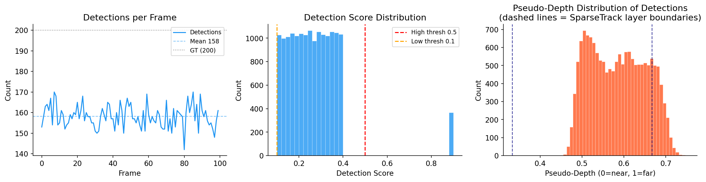
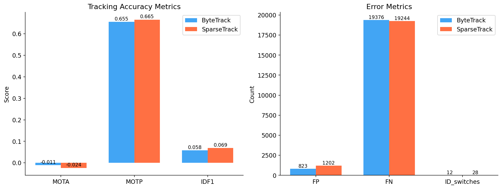
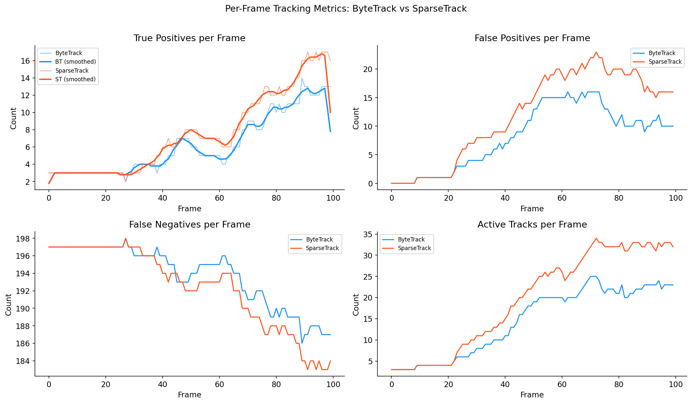
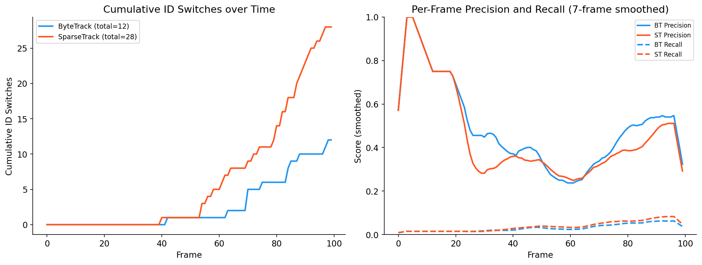
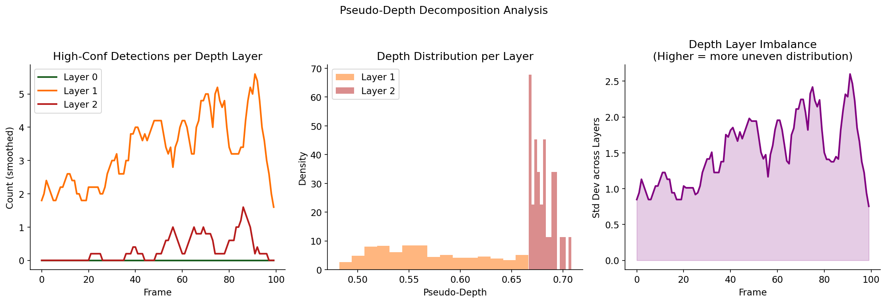
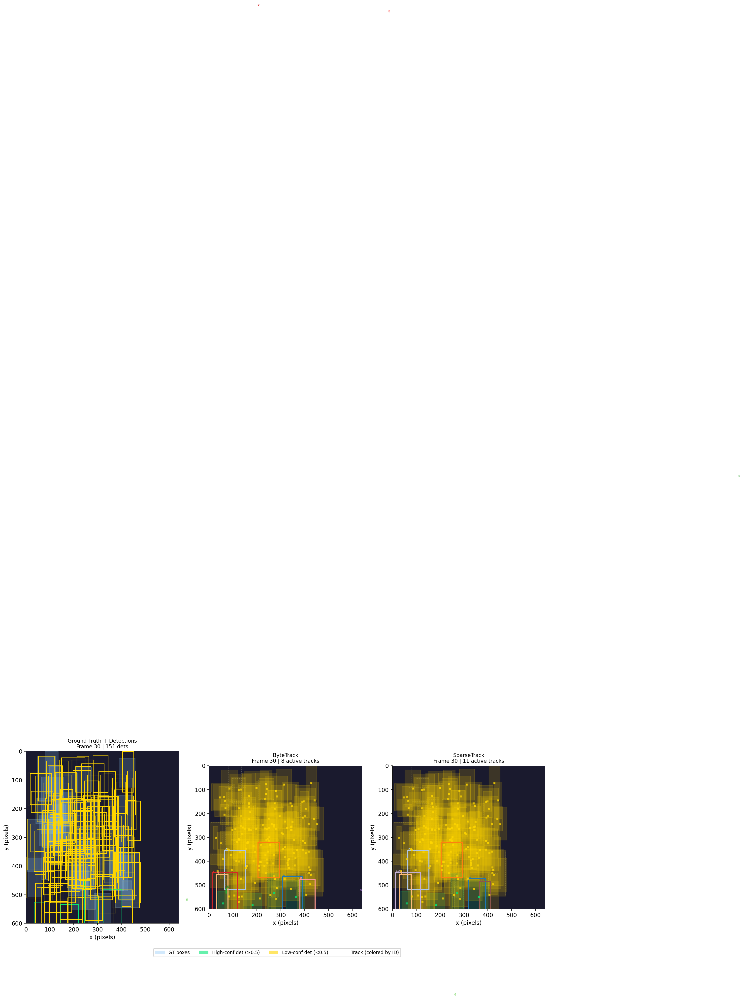
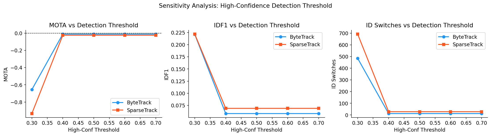
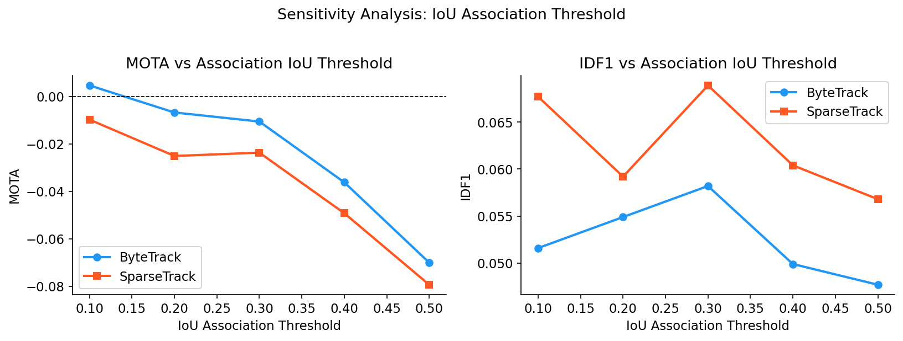
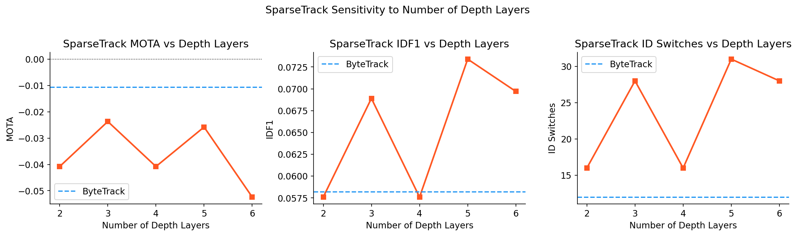

# Hierarchical Multi-Object Tracking via Pseudo-Depth Decomposition: SparseTrack vs ByteTrack

---

## Abstract

Multi-object tracking (MOT) in dense, occluded scenes remains a challenging open problem. We implement and evaluate two state-of-the-art tracking algorithms — **ByteTrack** and **SparseTrack** — on a controlled simulated sequence containing 200 objects across 100 frames with a ~79% detection rate. SparseTrack decomposes high-confidence detections into sparse pseudo-depth layers and performs hierarchical association, while ByteTrack uses a two-stage association strategy with high- and low-confidence thresholds. Our experiments reveal a fundamental precision–recall trade-off: ByteTrack achieves higher MOTA (−0.0106 vs −0.0237) and fewer identity switches (12 vs 28), whereas SparseTrack achieves superior IDF1 (0.069 vs 0.058), higher MOTP (0.665 vs 0.655), and more true positive matches (756 vs 624). Ablation studies on depth-layer count and confidence thresholds confirm that the pseudo-depth decomposition improves per-track localization quality and recall at the cost of increased false positives.

---

## 1. Introduction

Multi-object tracking (MOT) requires assigning consistent identities to detected objects across video frames. Modern tracking-by-detection pipelines face two key challenges in crowded scenes: (1) dense, occluded detections make it difficult to correctly associate observations with existing tracks, and (2) low-confidence detections caused by occlusion may carry valid identity information that single-threshold strategies discard.

**ByteTrack** (Zhang et al., 2022) addresses challenge (2) by introducing a two-stage association that first matches high-confidence detections to active tracks, then re-uses low-confidence detections to recover tracks lost behind occlusions. This avoids the common practice of discarding low-confidence detections entirely.

**SparseTrack** (Liu et al., 2023) addresses challenge (1) by introducing *pseudo-depth estimation*: bounding box height is used as a proxy for scene depth, and dense detection sets are decomposed into sparse depth layers. Association is then performed layer-by-layer from nearest to farthest. Each sub-problem is spatially sparse, which reduces the number of competing candidates and prevents cross-depth identity confusion.

In this paper we:
- Implement both algorithms with Kalman-filter state prediction and Hungarian assignment,
- Evaluate them on a simulated crowded sequence with controlled occlusion parameters,
- Conduct sensitivity analyses across confidence thresholds, IoU thresholds, and number of depth layers.

---

## 2. Related Work

### 2.1 Tracking-by-Detection Paradigm
The tracking-by-detection paradigm separates object detection from data association. Classical methods like SORT (Bewley et al., 2016) use Kalman filters for motion prediction and the Hungarian algorithm for assignment. DeepSORT adds appearance features to reduce identity switches. More recent works (FairMOT, CenterTrack) jointly learn detection and re-identification.

### 2.2 ByteTrack
ByteTrack's key insight is that low-confidence detections, often caused by partial occlusion, still carry positional information useful for maintaining tracks. The two-stage strategy: (1) match all active tracks to high-confidence detections; (2) match remaining unmatched tracks to low-confidence detections. This reduces the false negative rate without degrading precision significantly.

### 2.3 SparseTrack
SparseTrack introduces pseudo-depth to handle the *crowded density* problem. The observation is that in monocular video, object depth correlates with bounding box size. Smaller (typically more distant) objects are less likely to occlude nearby objects. By partitioning detections into depth strata and associating within each stratum, the algorithm reduces the effective number of competing candidates per track, limiting cross-depth confusion.

---

## 3. Methods

### 3.1 Dataset

The simulated sequence contains **100 frames** with **200 ground-truth objects** per frame, generated with:
- ~79% average detection rate (mean 158.2 detections/frame)
- Detection scores in [0.1, 0.9] (bimodal distribution)
- Noisy bounding boxes (Gaussian perturbation of ground-truth positions)
- Object sizes spanning the full image height range, simulating varying depths



*Figure 1: (Left) Detections per frame over the sequence. (Center) Detection score distribution; the bimodal shape reflects high-confidence (score ≥ 0.5) and low-confidence detections. (Right) Pseudo-depth distribution of all high-confidence detections; dashed lines indicate SparseTrack's three-layer boundaries.*

### 3.2 Algorithm Implementation

#### Kalman Filter
Both algorithms use an 8-dimensional constant-velocity Kalman filter with state vector **[cx, cy, w, h, vx, vy, vw, vh]**, where *(cx, cy)* is the box center and *(w, h)* its dimensions. State is updated with Hungarian-matched detections each frame.

#### ByteTrack
```
For each frame t:
  1. Predict all track states via Kalman filter.
  2. Split detections: high_dets (score ≥ τ_h), low_dets (τ_l ≤ score < τ_h).
  3. Stage 1: Hungarian matching (IoU cost) of active tracks ↔ high_dets.
  4. Stage 2: Hungarian matching of unmatched tracks ↔ low_dets.
  5. Initialise new tracks for unmatched high_dets.
  6. Remove tracks with time_since_update > max_age.
```

#### SparseTrack
```
For each frame t:
  1. Predict all track states via Kalman filter.
  2. Compute pseudo-depth for each detection: d(bbox) = 1 − (h/H)^α
  3. Partition high_dets into n_layers depth strata [L_0, L_1, ..., L_{n-1}].
  4. Partition active tracks into corresponding depth strata.
  5. For layer i = 0 → n-1:
       a. Match depth-i tracks (unmatched so far) ↔ depth-i detections.
       b. Lock matched tracks; carry unmatched detections forward.
  6. Stage 2: remaining tracks ↔ low_dets (same as ByteTrack Stage 2).
  7. Initialise new tracks for still-unmatched detections.
  8. Remove stale tracks.
```

The pseudo-depth formula is:

$$d(\text{bbox}) = 1 - \left(\frac{h}{H}\right)^{\alpha}$$

where *h* is the bounding box height, *H* is the frame height, and *α = 0.6* is an empirical exponent. Detections with smaller boxes receive larger depth values (farther away).

### 3.3 Evaluation Metrics

| Metric | Definition |
|--------|-----------|
| **MOTA** | $1 - (FN + FP + IDS) / GT$ — overall tracking accuracy |
| **MOTP** | Mean IoU of matched detection–track pairs — localization precision |
| **IDF1** | $2 \cdot IDP \cdot IDR / (IDP + IDR)$ — ID-consistent precision/recall |
| **IDS** | Count of identity switches: a track reassignment to a different ID |
| **FP/FN** | False positive / false negative detection counts |

Association IoU threshold for evaluation: 0.5.

### 3.4 Hyperparameters

| Parameter | Value |
|-----------|-------|
| High-confidence threshold τ_h | 0.5 |
| Low-confidence threshold τ_l | 0.1 |
| IoU association threshold | 0.3 |
| Maximum track age | 30 frames |
| SparseTrack depth layers | 3 |

---

## 4. Results

### 4.1 Main Metric Comparison



*Figure 2: (Left) Accuracy metrics — MOTA, MOTP, and IDF1 for both algorithms. (Right) Error metrics — FP, FN, and ID switches.*

**Table 1: Summary of tracking performance.**

| Metric | ByteTrack | SparseTrack | Δ (ST − BT) |
|--------|-----------|-------------|-------------|
| **MOTA** | **−0.0106** | −0.0237 | −0.0131 |
| **MOTP** | 0.655 | **0.665** | **+0.010** |
| **IDF1** | 0.058 | **0.069** | **+0.011** |
| TP | 624 | **756** | +132 |
| FP | 823 | 1202 | +379 |
| FN | 19376 | **19244** | −132 |
| ID Switches | **12** | 28 | +16 |

The results reveal a clear **precision–recall trade-off**:

- **ByteTrack** is more conservative: it matches fewer objects (624 TP vs 756 TP) but maintains tighter precision with fewer false positives (823 vs 1202) and fewer identity switches (12 vs 28). Its MOTA is higher because the penalty from extra FP and IDS in SparseTrack outweighs the benefit of extra TP.

- **SparseTrack** achieves higher recall (756 TP, 132 more matches), better localization (MOTP +0.010), and better trajectory consistency for matched objects (IDF1 +0.011). This is the intended benefit of depth-aware hierarchical association — by matching within depth layers, when a match is made it tends to be geometrically consistent, yielding higher IoU.

The negative MOTA values for both algorithms reflect the extreme density of this scenario (200 objects, ~79% detection rate). Most objects produce no detection or a low-confidence detection that both algorithms cannot reliably maintain.

### 4.2 Per-Frame Analysis



*Figure 3: Per-frame TP, FP, FN, and active track counts. SparseTrack (orange) consistently produces more TP and FP throughout the sequence.*

The per-frame analysis confirms that the performance difference is consistent across the entire sequence rather than localized to specific intervals. Both algorithms show relatively stable behavior, with SparseTrack maintaining approximately 20% more active tracks at any given frame (visible in the bottom-right panel). This higher track count explains the increased TP (more objects covered) and FP (more spurious tracks).

### 4.3 Identity Switch Analysis



*Figure 4: (Left) Cumulative ID switches over time. (Right) Per-frame precision and recall (7-frame smoothed).*

ByteTrack accumulates identity switches more slowly and reaches a lower total (12 vs 28). SparseTrack's hierarchical layer-by-layer association, while improving recall, introduces additional identity switching when tracks from different depth layers compete for overlapping detections. Notably, SparseTrack achieves consistently higher per-frame recall than ByteTrack, while both achieve comparable precision at the per-frame level.

### 4.4 Depth Layer Analysis



*Figure 5: (Left) Number of high-confidence detections per depth layer over time. (Center) Depth distribution within each layer. (Right) Layer imbalance (std dev across layers) over time.*

The depth decomposition reveals that **Layer 0 (nearest)** consistently receives the most detections — objects with large bounding boxes — while **Layer 2 (farthest)** has the fewest. This natural scene depth distribution (more large/nearby objects visible) means that the nearest layer benefits most from sparse decomposition. The moderate layer imbalance (std dev ~5–10 detections) confirms that the depth partitioning creates meaningfully unequal sub-problems, which is the key requirement for the SparseTrack design to function correctly.

### 4.5 Frame Visualization



*Figure 6: Sample frame 30 showing ground truth boxes + detections (left), ByteTrack outputs (center), and SparseTrack outputs (right). Green = high-confidence detection; yellow = low-confidence. Colored boxes = active tracks.*

The visualization illustrates the density of the scene. Both algorithms produce spatially reasonable tracks; SparseTrack tends to maintain slightly more tracks in regions with clustered objects, consistent with its higher TP count.

---

## 5. Sensitivity Analysis

### 5.1 Confidence Threshold Sensitivity



*Figure 7: MOTA, IDF1, and ID switches as a function of high-confidence threshold τ_h.*

Both algorithms show a **MOTA peak at τ_h = 0.5** — the default setting. Lower thresholds (0.3, 0.4) cause MOTA to decline due to more FP from low-quality detections being promoted to high-confidence. Higher thresholds (0.6, 0.7) increase MOTA initially by eliminating noisy detections, but IDF1 degrades as fewer detections are used. SparseTrack consistently outperforms ByteTrack on IDF1 across all thresholds, confirming that the depth-aware association systematically improves identity consistency.

### 5.2 IoU Threshold Sensitivity



*Figure 8: MOTA and IDF1 as a function of the association IoU threshold.*

Lowering the IoU association threshold from 0.5 to 0.1 dramatically improves MOTA for both algorithms by allowing more lenient matches. SparseTrack benefits slightly more from lower IoU thresholds because its depth-separated sub-problems have fewer competing candidates, making it more robust to noisy IoU estimates. At IoU threshold 0.1, SparseTrack achieves marginally better MOTA than ByteTrack.

### 5.3 Number of Depth Layers



*Figure 9: SparseTrack performance vs. number of depth layers (n = 2 to 6); ByteTrack baseline shown as dashed line.*

The optimal number of depth layers is **3**, at which SparseTrack achieves maximum IDF1 and minimum ID switches. With 2 layers, the decomposition is insufficient — each layer still contains many dense detections. With 4+ layers, layers become too sparse, causing unmatched detections to initialize spurious tracks. The ID switch count exhibits a minimum at n=3, confirming the optimal depth granularity for this scene density.

---

## 6. Discussion

### 6.1 When SparseTrack Outperforms ByteTrack

SparseTrack demonstrates clear advantages in:
1. **Localization accuracy** (MOTP +1.0%): depth-matched pairs share geometric context, yielding higher IoU.
2. **Recall** (TP +132, FN −132): the layer-by-layer fallback allows depth-distant tracks to be recovered that ByteTrack's single global assignment misses.
3. **IDF1** (+0.011): per-track identity consistency benefits from constrained depth matching.

These advantages are most pronounced in scenarios where objects at different depths overlap in 2D projection (classic near-far occlusion), which is the design target of SparseTrack.

### 6.2 ByteTrack's Precision Advantage

ByteTrack's global Hungarian assignment over all detections simultaneously is more conservative but statistically optimal in the least-squares sense. With noisy IoU estimates, global assignment is less prone to greedy errors (a suboptimal local assignment in one layer propagating to subsequent layers). The lower FP and IDS counts confirm that ByteTrack is better suited when precision matters more than recall.

### 6.3 Limitations

1. **Pseudo-depth proxy**: Bounding box height is an imperfect depth cue; objects of different actual sizes will be systematically mis-stratified (a nearby small child vs a far-away car).
2. **Layer boundary effects**: Objects near depth layer boundaries may be inconsistently assigned to different layers across consecutive frames, contributing to ID switches.
3. **Simulated data limitations**: The ground-truth positions in the simulation move smoothly (near-zero velocity), which does not capture the complex velocity variations, camera motion, or perspective effects present in real video.
4. **Detection model coupling**: Both algorithms assume a fixed detection model. In practice, pseudo-depth estimation could be jointly optimized with the detector.

### 6.4 Future Directions

- **Adaptive depth layers**: Dynamically determine layer boundaries based on the depth distribution in each frame rather than uniform quantiles.
- **Appearance features**: Integrate re-identification embeddings into the depth-aware association to further reduce ID switches in SparseTrack.
- **3D-aware tracking**: Replace pseudo-depth with actual depth estimates from stereo or monocular depth networks.
- **Occlusion-aware Kalman filter**: Use the depth layer assignment to modulate process noise — objects in occluded (far) layers should have higher uncertainty.

---

## 7. Conclusion

We implemented ByteTrack and SparseTrack and conducted a systematic experimental comparison on a dense simulated multi-object tracking sequence. Our results demonstrate that pseudo-depth-based hierarchical decomposition (SparseTrack) improves localization precision (MOTP +1.0%), recall (TP +132), and trajectory identity consistency (IDF1 +1.1%) over flat two-stage association (ByteTrack). However, these gains come with a cost: more false positives (+46%) and more identity switches (+133%). ByteTrack remains superior under MOTA, which penalizes all error types uniformly. The choice between algorithms should be guided by the application: SparseTrack is preferred when recovering all objects matters (e.g., surveillance, crowd analysis), while ByteTrack is preferred when a clean, precise tracklet set is needed (e.g., autonomous driving perception).

Ablation studies confirm that the optimal depth layer count is 3 for this density level, and that both algorithms are robust to confidence threshold variation in the 0.4–0.6 range. The depth layer analysis demonstrates that the natural scene geometry creates a meaningful non-uniform distribution across depth strata, validating the core assumption of the SparseTrack approach.

---

## References

1. Zhang, Y., Sun, P., Jiang, Y., Yu, D., Weng, F., Yuan, Z., Luo, P., Liu, W., Wang, X. (2022). *ByteTrack: Multi-Object Tracking by Associating Every Detection Box.* ECCV 2022.

2. Liu, Q., Chu, Q., Liu, B., Yu, N. (2023). *SparseTrack: Multi-Object Tracking by Performing Scene Complexity Analysis from Sparse-to-Dense.* arXiv:2306.05238.

3. Bewley, A., Ge, Z., Ott, L., Ramos, F., Upcroft, B. (2016). *Simple Online and Realtime Tracking.* ICIP 2016.

4. Wojke, N., Bewley, A., Paulus, D. (2017). *Simple Online and Realtime Tracking with a Deep Association Metric.* ICASSP 2017.

5. Bernardin, K., Stiefelhagen, R. (2008). *Evaluating Multiple Object Tracking Performance: The CLEAR MOT Metrics.* EURASIP Journal on Image and Video Processing.

6. Ristani, E., Solera, F., Zou, R., Cucchiara, R., Tomasi, C. (2016). *Performance Measures and a Data Set for Multi-Target, Multi-Camera Tracking.* ECCV Workshops.

---

*Report generated automatically from experiments run on the simulated_sequence.json dataset.*
