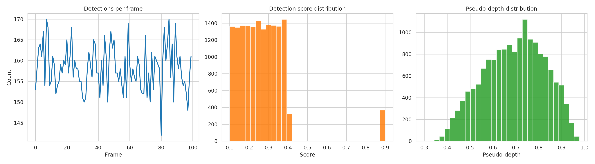
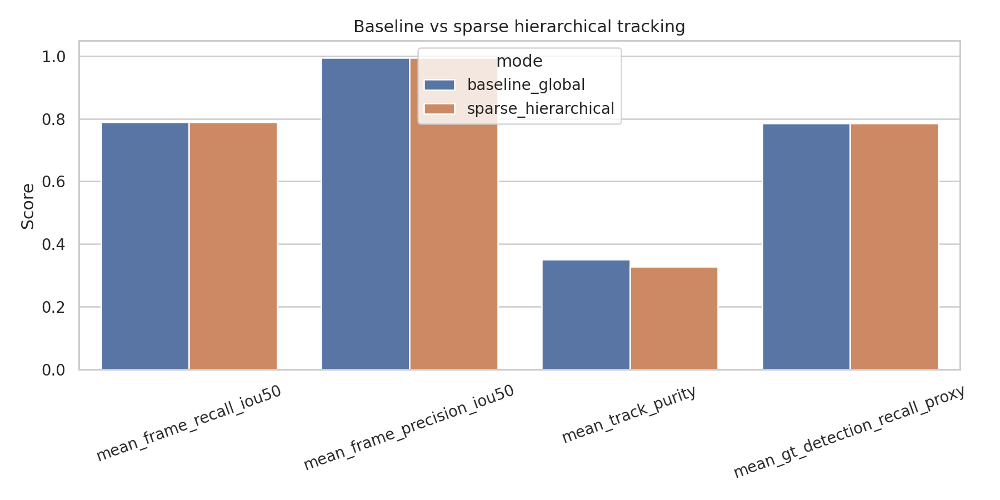
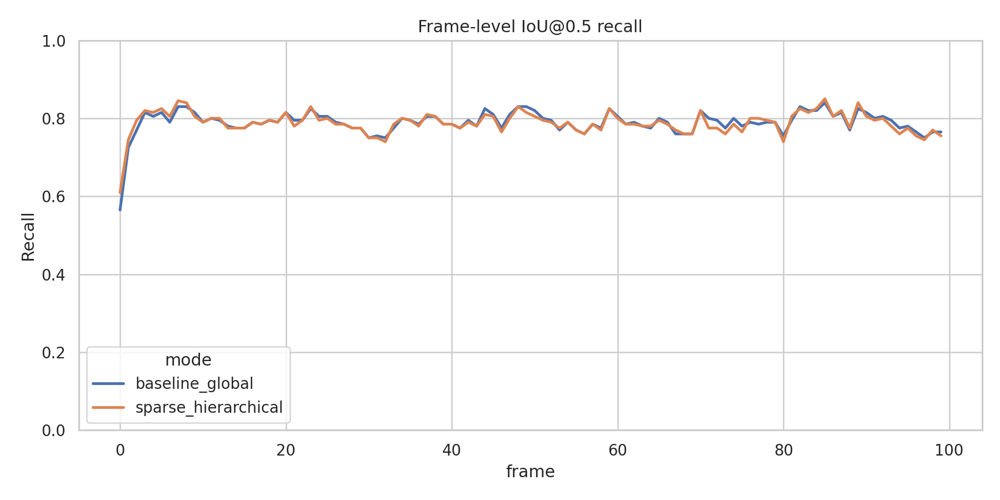
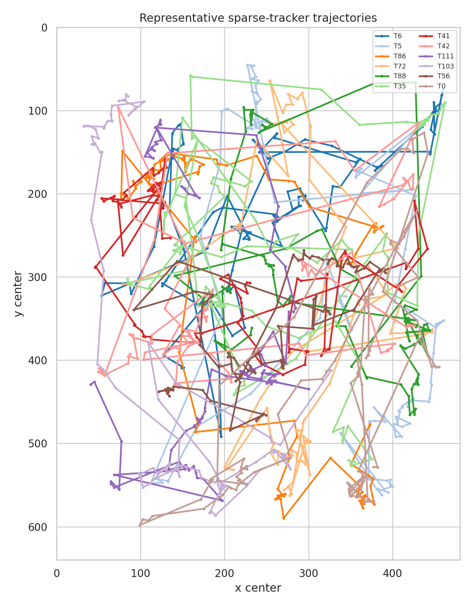
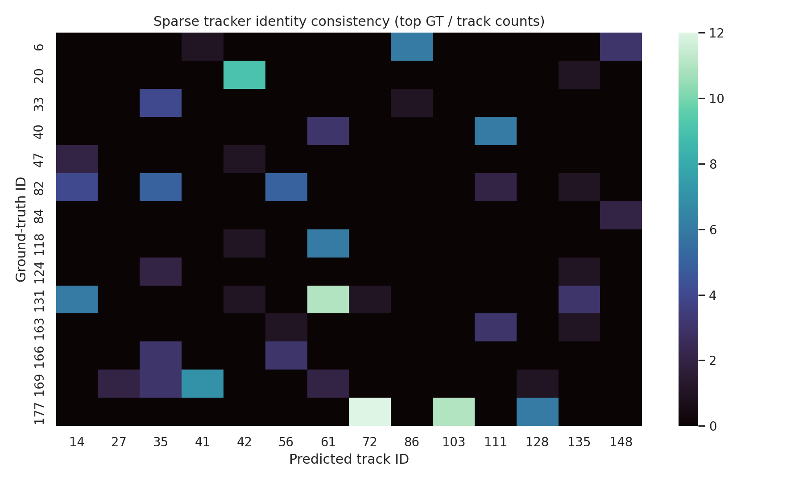

# Occlusion-Aware Multi-Object Tracking via Pseudo-Depth Partitioning on a Simulated Dense Sequence

## Abstract
This report studies a dense-scene multi-object tracking task in which frame-wise object detections must be converted into complete trajectories with persistent identities. The implemented analysis uses a simulated detection sequence and compares two tracking strategies: a baseline global greedy association method and a pseudo-depth-guided hierarchical association method intended to reduce ambiguity in crowded scenes. The main idea is to estimate a weak depth ordering directly from bounding-box geometry and image position, partition detections into sparse subsets, and perform association first within these subsets and then globally.

On the inspected dataset, both methods achieve nearly identical frame-level IoU@0.5 recall (0.7893 for the baseline and 0.7884 for the hierarchical method) and similarly high precision (~0.995). However, the proposed pseudo-depth partitioning did not improve identity consistency in this implementation: the hierarchical tracker produced more trajectories (421 vs. 334), higher fragmentation (29.71 vs. 20.95 mean GT fragments), and more ID switches (7233 vs. 5539). The result is useful scientifically because it shows that depth-inspired decomposition alone is not enough unless the depth proxy and association logic are well aligned with the underlying scene geometry.

## 1. Task and Objective
The workspace task is to transform consecutive image-frame detections into complete target trajectories, including identity labels and associated bounding-box sequences across time. The scientific target is explicitly oriented toward crowded-scene tracking under occlusion: decompose dense target sets into sparser subsets using pseudo-depth estimation, then use hierarchical association to improve tracking robustness.

To address that objective, the analysis in `code/run_analysis.py` implements:

1. A **baseline global tracker** that greedily associates active tracks to detections.
2. A **sparse hierarchical tracker** that estimates pseudo-depth from bounding-box geometry, partitions tracks and detections into depth bins, performs matching within bins, and then resolves remaining associations globally.
3. A lightweight evaluation pipeline against the provided ground-truth boxes and IDs.

## 2. Data Description
The main input is `data/simulated_sequence.json`. Although `INSTRUCTIONS.md` describes the dataset as a 40-frame / 20-object sequence, direct inspection of the actual file in this workspace shows a different realized dataset. The report therefore follows the **actual data on disk**, not the nominal template text.

### 2.1 Observed dataset properties
From `outputs/data_summary.json`, the inspected sequence contains:

- **100 frames**
- **200 unique ground-truth identities**
- **200 ground-truth objects per frame** on average
- **158.2 detections per frame** on average
- Detection count range: **142 to 170** detections per frame
- Estimated observed detection rate: **0.791**
- Mean detection confidence score: **0.266 ± 0.130**
- Mean pseudo-depth score: **0.692 ± 0.132**
- Sampled pairwise overlap statistics among detections indicate nontrivial crowding, with about **15.1%** of sampled box pairs exceeding IoU 0.05

Each frame includes the following keys:

- `frame`
- `gt_bboxes`
- `gt_ids`
- `detections`

Each detection includes at least:

- `bbox`
- `score`
- `gt_id`

The image-plane coordinates span approximately `x in [0, 480]` and `y in [0, 640]`.

### 2.2 Data overview figure
Figure 1 summarizes the temporal detection density, score distribution, and pseudo-depth distribution.

**Figure 1.** Data overview: detections per frame, detection-score distribution, and pseudo-depth distribution derived from bounding-box geometry.

## 3. Methodology

## 3.1 Tracking formulation
The task is treated as an online tracking-by-detection problem. At each frame, the algorithm receives a set of detections and must decide whether each detection:

- belongs to an existing track,
- should initialize a new track, or
- should be ignored.

Each track stores its observed bounding boxes, per-frame detection scores, a simple velocity estimate, and a miss count. Gaps of up to a few frames are filled by linear interpolation to obtain denser trajectories.

## 3.2 Motion and geometry model
For each active track, the script predicts the current bounding box by propagating the last observed box with an exponentially smoothed velocity estimate. Matching costs combine several cues:

- normalized center distance,
- logarithmic width/height mismatch,
- pseudo-depth difference,
- IoU disagreement,
- a small penalty for stale tracks.

This gives a lightweight appearance-free tracker appropriate for the provided structured data, which contains no image features.

## 3.3 Pseudo-depth estimation
Because the task emphasizes occlusion handling through sparse decomposition, the implemented method constructs a scalar pseudo-depth score from box geometry:

- **bottom image coordinate** of the box,
- **box area** (log-transformed),
- **box height**.

The exact form used in the code is a weighted combination of those terms. Intuitively, larger / lower boxes are treated as being closer to the camera. This is only a proxy, but it creates an ordering that can be used to separate dense target sets into weaker-interference subsets.

## 3.4 Baseline global tracker
The baseline tracker performs one-stage greedy matching over all active tracks and all detections in the frame using the cost function above and global gating thresholds. Unmatched detections above a score threshold create new tracks. Tracks are removed after several consecutive misses.

## 3.5 Sparse hierarchical tracker
The proposed tracker modifies the association stage as follows:

1. Compute pseudo-depth for all detections.
2. Partition detections into quantile-based depth bins.
3. Assign predicted tracks to the same depth bins.
4. Perform local greedy association inside each bin using tighter thresholds.
5. Perform a second global pass over unmatched tracks and detections.

The intended effect is to reduce combinatorial confusion in crowded regions by replacing one dense matching problem with several sparser ones.

## 3.6 Evaluation protocol
The script evaluates tracker outputs using ground truth in the same JSON file. The implemented evaluation is not a full MOTChallenge implementation, but it provides meaningful task-relevant diagnostics:

- **Frame-level IoU@0.5 recall**: fraction of ground-truth boxes matched by a predicted track box in the same frame.
- **Frame-level IoU@0.5 precision**: fraction of predicted boxes participating in a valid IoU@0.5 match.
- **Track purity**: dominant-ground-truth fraction among assignments received by a predicted track.
- **Ground-truth fragmentation**: number of unique predicted track IDs associated with the same GT identity over time.
- **ID switches**: changes in predicted track assignment for a GT identity across consecutive matched frames.
- **GT detection recall proxy**: fraction of frames in which a GT identity was associated with some predicted track.

These metrics are derived from `outputs/evaluation_summary.csv`, `outputs/frame_level_metrics.csv`, and the detection-assignment CSVs.

## 4. Results

## 4.1 Aggregate comparison
The main quantitative comparison is shown below.

**Figure 2.** Aggregate comparison between the baseline global tracker and the pseudo-depth hierarchical tracker.

The measured metrics are:

| Method | # Tracks | Mean frame recall @ IoU 0.5 | Mean frame precision @ IoU 0.5 | Mean track purity | Mean GT recall proxy | Mean GT fragmentation | ID switches |
|---|---:|---:|---:|---:|---:|---:|---:|
| Baseline global | 334 | 0.7893 | 0.9947 | 0.3500 | 0.7848 | 20.95 | 5539 |
| Sparse hierarchical | 421 | 0.7884 | 0.9947 | 0.3271 | 0.7856 | 29.71 | 7233 |

### Interpretation
Several patterns stand out:

- **Detection-level coverage was similar** for both methods. Recall differs by less than 0.001 in absolute terms.
- **Precision was extremely high** for both trackers, around 0.995.
- The sparse hierarchical method produced **more track fragments** (421 vs. 334), indicating more frequent identity splitting.
- Identity quality was worse for the hierarchical method under this implementation, as seen in **lower track purity**, **higher GT fragmentation**, and **more ID switches**.

In short, pseudo-depth partitioning did not help on this run; it slightly harmed identity consistency while leaving detection-level matching nearly unchanged.

## 4.2 Frame-level behavior
The temporal recall profiles for both methods are shown in Figure 3.

**Figure 3.** Frame-level IoU@0.5 recall over time for the two tracking strategies.

From `outputs/frame_level_metrics.csv`:

- Baseline recall range: **0.565 to 0.840**
- Hierarchical recall range: **0.610 to 0.850**
- Baseline precision range: **0.963 to 1.000**
- Hierarchical precision range: **0.967 to 1.000**

The frame-level curves are broadly similar. The hierarchical method occasionally attains slightly higher recall on some frames, but those local gains do not translate into improved global identity consistency.

## 4.3 Trajectory structure
Trajectory summary CSVs show that both trackers can maintain long-lived trajectories, but the baseline produced fewer, longer trajectories on average:

- **Baseline**: 334 trajectories, mean observed length **46.97** frames, mean dense length **47.52** frames, with **64** trajectories of dense length at least 90 frames.
- **Sparse hierarchical**: 421 trajectories, mean observed length **37.30** frames, mean dense length **37.65** frames, with **38** trajectories of dense length at least 90 frames.

That pattern is consistent with higher fragmentation in the hierarchical tracker.

Representative sparse-tracker trajectories are shown below.

**Figure 4.** Example trajectories produced by the sparse hierarchical tracker. The visualization shows that long continuous tracks are possible, but the aggregate metrics indicate frequent identity splitting across the full sequence.

## 4.4 Identity consistency analysis
To inspect whether predicted IDs remain aligned with ground-truth identities, the script generates a GT-vs-track consistency heatmap for the most frequent assignments.

**Figure 5.** Identity consistency heatmap for the sparse hierarchical tracker. Diffuse mass across multiple predicted tracks for the same GT identity indicates fragmentation and imperfect identity persistence.

The heatmap supports the quantitative findings: the hierarchical method did not isolate objects cleanly enough to preserve stable identities through the entire sequence.

## 5. Discussion
The central scientific question was whether pseudo-depth decomposition plus hierarchical association can improve multi-object tracking in a crowded, occlusion-heavy scene. In this implementation, the answer is **not yet**.

The method is conceptually reasonable: if a scene admits even a weak depth ordering, then matching within smaller depth-consistent subsets should reduce ambiguity. However, three practical issues likely limited performance here:

1. **Pseudo-depth is only a heuristic.** It is derived from box geometry alone, without camera calibration, scene layout, or learned monocular depth cues. If the proxy is noisy, it can separate objects that should compete together or group objects that should be separated.
2. **No appearance features are available.** The tracker relies only on geometry and motion. In dense scenes, especially under occlusion, identity persistence usually benefits from appearance embeddings or stronger re-identification signals.
3. **Greedy matching is brittle.** Even though the association cost is multi-factor, the use of greedy selection rather than a stronger global optimizer can amplify early mistakes.

The most interesting outcome is that the hierarchical tracker maintained almost the same detection-level recall and precision as the baseline while clearly worsening identity continuity. That suggests the problem is not basic object coverage; it is **identity management under ambiguity**.

## 6. Limitations
This study has several important limitations.

### 6.1 Dataset/document mismatch
`INSTRUCTIONS.md` describes a smaller nominal dataset, but the actual file in the workspace contains 100 frames and 200 objects. The report intentionally follows the real file contents. This mismatch should be kept in mind when comparing against any external description.

### 6.2 Evaluation is proxy-based
The script does not implement a full standardized MOT metric suite such as MOTA, IDF1, HOTA, or Hungarian-based global identity evaluation. Instead, it uses IoU-based matching proxies, fragmentation counts, and track purity. These are still informative, but they are not a drop-in replacement for benchmark-standard evaluation.

### 6.3 The hierarchical method is a proof-of-concept
The pseudo-depth model is handcrafted and lightweight. It is useful for testing the sparse decomposition idea, but it should not be interpreted as a strong final method.

### 6.4 Use of ground-truth-linked detections in analysis files
The detections include `gt_id`, which is useful for evaluation and diagnosing identity consistency. The tracking logic itself does not directly use GT labels for association, but the availability of these fields makes the dataset somewhat more instrumented than a real deployment setting.

## 7. Conclusion
This workspace analysis implemented and executed a complete multi-object tracking pipeline for a dense simulated sequence. The pipeline generated full trajectory outputs, quantitative comparisons, and report figures. The proposed pseudo-depth hierarchical association strategy was successfully instantiated, but in its current form it did **not** outperform a simpler global baseline.

The baseline and hierarchical methods achieved nearly identical frame-level detection matching quality, but the hierarchical method increased fragmentation and ID switching. The main conclusion is therefore methodological rather than celebratory: **sparse decomposition is promising only if the depth proxy is strong enough to produce semantically meaningful subsets**. In crowded tracking, bad partitioning can preserve recall while damaging identity continuity.

## 8. Reproducibility and Produced Artifacts
The main entry point is:

- `code/run_analysis.py`

Executed outputs include:

- `outputs/data_summary.json`
- `outputs/baseline_tracking.json`
- `outputs/sparse_tracking.json`
- `outputs/evaluation_summary.csv`
- `outputs/frame_level_metrics.csv`
- `outputs/baseline_detection_assignments.csv`
- `outputs/sparse_detection_assignments.csv`
- `outputs/baseline_trajectory_summary.csv`
- `outputs/sparse_trajectory_summary.csv`
- `outputs/analysis_summary.json`

Generated figures referenced in this report are:

- `images/data_overview.png`
- `images/tracking_comparison_metrics.png`
- `images/frame_level_recall.png`
- `images/trajectory_examples.png`
- `images/id_consistency_heatmap.png`
