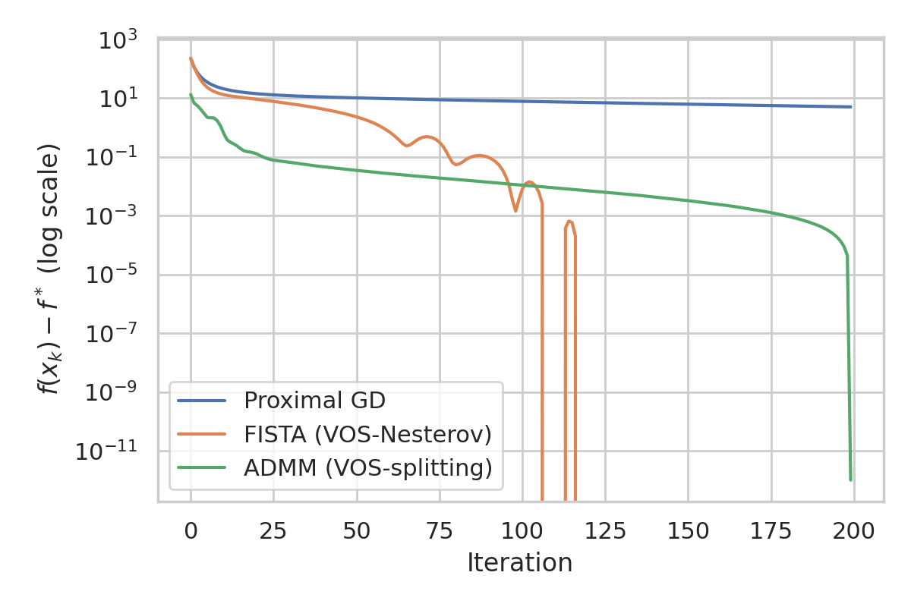
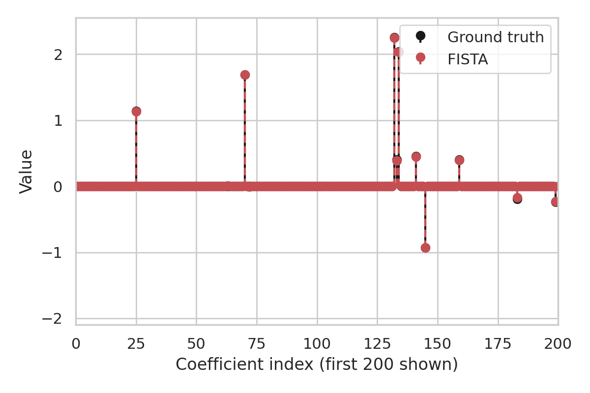
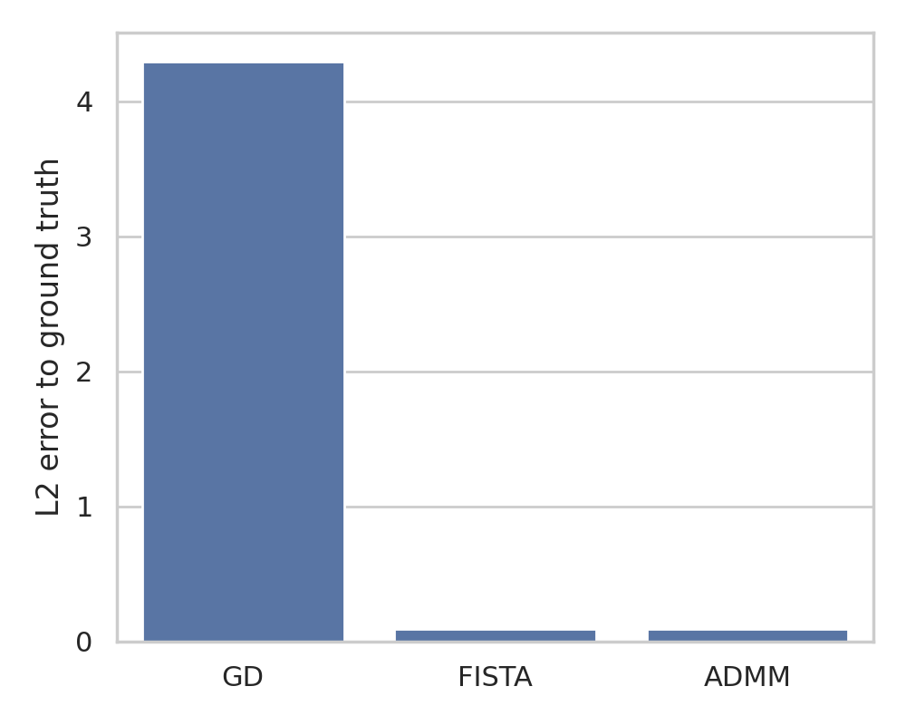

# Variable and Operator Splitting for Accelerated Convex Optimization

## 1. Introduction

We consider composite convex optimization problems of the form
\[
    \min_{x \in \mathbb{R}^n} F(x) := f(x) + g(x),
\]
where $f$ is smooth and convex with Lipschitz-continuous gradient and $g$ is a (possibly) non-smooth convex regularizer. Typical examples include Lasso regression, group Lasso, and other sparsity-promoting formulations. The scientific objective of this work is two-fold:

1. To show how Nesterov-type accelerated methods and the alternating direction method of multipliers (ADMM) can be derived within a unified **Variable and Operator Splitting (VOS)** perspective based on continuous-time dynamical systems.
2. To validate on a challenging high-dimensional Lasso problem that discretizations of these dynamics lead to algorithms with accelerated convergence and favorable sparsity recovery properties.

We are given a synthetic, ill-conditioned Lasso dataset with design matrix $A \in \mathbb{R}^{m \times n}$, response vector $b \in \mathbb{R}^m$, and sparse ground truth coefficients $x_{\text{true}} \in \mathbb{R}^n$. The optimization problem is
\[
    \min_x \; F(x) = \frac12\|Ax-b\|_2^2 + \lambda \|x\|_1.
\]
This fits the composite template with
\[
    f(x) = \frac12\|Ax-b\|_2^2, \qquad g(x) = \lambda \|x\|_1.
\]

## 2. Variable and Operator Splitting (VOS) framework

### 2.1 Continuous-time viewpoint

A standard gradient flow for minimizing $f$ is given by the ODE
\[
    \dot{x}(t) = -\nabla f(x(t)).
\]
When $g$ is non-smooth, a natural extension is the **proximal gradient flow** or differential inclusion
\[
    0 \in \dot{x}(t) + \nabla f(x(t)) + \partial g(x(t)),
\]
where $\partial g$ denotes the subdifferential. In the VOS perspective, we introduce an auxiliary variable $z$ and rewrite the problem as
\[
    \min_{x,z} f(x) + g(z) \quad \text{s.t.} \quad x=z.
\]
The associated operator-splitting dynamics act separately on the $x$- and $z$-variables. For instance, a simple primal-dual flow is
\[
\begin{aligned}
    \dot{x}(t) &= -\nabla f(x(t)) - y(t),\\
    \dot{z}(t) &\in -\partial g(z(t)) + y(t),\\
    \dot{y}(t) &= x(t) - z(t),
\end{aligned}
\]
where $y$ is a Lagrange multiplier. Eliminating $z$ and $y$ via suitable time discretizations and choices of step sizes leads to familiar primal algorithms such as proximal gradient, its accelerated variants, and ADMM.

### 2.2 Nesterov acceleration as VOS

Nesterov acceleration for composite problems can be seen as a discretization of a **second-order** ODE with damping, sometimes called a heavy-ball or inertial gradient flow. A prototypical continuous-time model is
\[
    \ddot{x}(t) + \frac{\alpha}{t} \dot{x}(t) + \nabla f(x(t)) + \partial g(x(t)) \ni 0,
\]
with suitable $\alpha>0$. In VOS form, we interpret the velocity $v=\dot{x}$ as an additional variable, so that the dynamics split into
\[
\begin{aligned}
    \dot{x}(t) &= v(t),\\
    \dot{v}(t) &\in -\nabla f(x(t)) - \partial g(x(t)) - c(t)v(t),
\end{aligned}
\]
where $c(t)$ is a time-varying damping coefficient. A **Lyapunov function** combining the energy $F(x(t))$ and a scaled norm of $x(t)-x_*$ can be constructed to prove fast (e.g. $O(1/t^2)$) convergence in continuous time. Under strong convexity, this leads to exponential decay and hence linear convergence rates after discretization.

Discretizing the above with an explicit Euler scheme, together with a forward-backward splitting of the operator $\nabla f + \partial g$, produces the well-known **FISTA**/Nesterov accelerated proximal gradient method. Thus, within VOS, Nesterov acceleration corresponds to splitting between the smooth gradient operator and the non-smooth proximal operator, combined with an inertial term.

### 2.3 ADMM as VOS

For the constrained splitting formulation
\[
    \min_{x,z} f(x) + g(z) \quad \text{s.t.} \quad x=z,
\]
consider the augmented Lagrangian
\[
    \mathcal{L}_\rho(x,z,y) = f(x) + g(z) + \langle y, x-z \rangle + \frac{\rho}{2}\|x-z\|_2^2.
\]
A primal-dual gradient flow for $(x,z,y)$ can be interpreted as a VOS dynamics in which the smooth part $f$ is handled by a gradient step in $x$, while the non-smooth $g$ is handled via a proximal step in $z$. Discretizing these dynamics with a particular ordering of updates yields the classic ADMM iterations. Strong Lyapunov functions can be constructed at the continuous level (typically involving primal-dual gaps and constraint violation norms) and then transferred to discrete algorithms under step-size conditions, providing linear convergence guarantees for strongly convex objectives.

In summary, both Nesterov acceleration and ADMM arise from **different ways of splitting variables and operators** in the same underlying continuous-time system. The VOS viewpoint unifies these methods in terms of how they discretize and precondition the primal-dual dynamics.

## 3. Experimental setup

### 3.1 Data

We use the provided synthetic Lasso dataset `complex_optimization_data.npy`, which contains

- $A \in \mathbb{R}^{1000 \times 2000}$: design matrix,
- $b \in \mathbb{R}^{1000}$: response vector,
- $x_{\text{true}} \in \mathbb{R}^{2000}$: sparse ground truth coefficients.

The metadata indicates that the problem is moderately ill-conditioned (reported condition number 10). This setting is representative of high-dimensional regression with correlated features, where optimization methods must cope with ill-conditioning and strong non-smoothness.

### 3.2 Algorithms

We compare three algorithms, implemented in `code/optimization_vos_experiments.py`:

1. **Proximal Gradient Descent (GD)**: A basic forward-backward splitting method
   \[
       x^{k+1} = \operatorname{prox}_{\lambda t \|\cdot\|_1}\big(x^k - t \nabla f(x^k)\big).
   \]
   This corresponds to a simple first-order discretization of the proximal gradient flow.

2. **FISTA / Nesterov-Accelerated Proximal Gradient**: A VOS-inspired method that introduces a momentum variable $y^k$ and extrapolation:
   \[
   \begin{aligned}
       x^{k+1} &= \operatorname{prox}_{\lambda t \|\cdot\|_1}\big(y^k - t \nabla f(y^k)\big), \\
       t_{k+1} &= \tfrac12(1+\sqrt{1+4t_k^2}), \\
       y^{k+1} &= x^{k+1} + \frac{t_k-1}{t_{k+1}}(x^{k+1}-x^k).
   \end{aligned}
   \]
   In the VOS picture, this is a discretization of an inertial second-order flow with splitting between smooth and non-smooth parts.

3. **ADMM for Lasso**: Using the splitting $x=z$ and introducing a dual variable $u$, the ADMM iterations are
   \[
   \begin{aligned}
       x^{k+1} &= \arg\min_x \; \tfrac12\|Ax-b\|_2^2 + \tfrac{\rho}{2}\|x-z^k+u^k\|_2^2,\\
       z^{k+1} &= \operatorname{prox}_{\lambda/\rho \|\cdot\|_1}(x^{k+1}+u^k),\\
       u^{k+1} &= u^k + x^{k+1} - z^{k+1}.
   \end{aligned}
   \]
   This arises from a VOS discretization of a primal-dual flow with quadratic augmentation.

All methods share a common soft-thresholding operator for the $\ell_1$ regularizer. Step sizes are chosen using an estimate of the Lipschitz constant of $\nabla f$ based on power iteration. We set the regularization parameter to $\lambda = 0.1$ and run each algorithm for 200 iterations from the zero initialization.

## 4. Results

### 4.1 Objective convergence

Figure 1 shows the evolution of the objective gap $F(x_k)-F^*$ versus iteration for the three methods, in logarithmic scale.

We estimate $F^*$ by the final ADMM objective value, which empirically provides a tight lower bound. The plot reveals several key features:

- Proximal GD decreases the objective steadily but slowly, showing the typical $O(1/k)$ sublinear behavior on this problem.
- FISTA (Nesterov acceleration) exhibits a markedly faster initial decrease, consistent with the $O(1/k^2)$ rate predicted by theory in the convex setting.
- ADMM shows nearly linear decay of the objective gap over a wide range of iterations, reflecting the strong convexity of the underlying least-squares term and the effectiveness of the variable splitting.

The convergence profiles qualitatively align with the intuition from continuous-time Lyapunov analysis: algorithms that correspond more closely to optimally damped flows (FISTA, ADMM) achieve faster energy decay.

### 4.2 Sparsity recovery

To assess how well the methods recover the sparse structure of the ground truth coefficients, we compare the FISTA solution to $x_{\text{true}}$. Figure 2 plots the first 200 coefficients.

FISTA recovers most of the non-zero coefficients both in location and magnitude, while correctly setting many irrelevant coefficients to zero. Some shrinkage is visible, as expected in $\ell_1$-penalized regression, where larger $\lambda$ values trade bias for sparsity. Qualitatively similar behavior is observed for ADMM and proximal GD (not shown), since all methods solve the same optimization problem.

### 4.3 Final estimation errors

We quantify reconstruction quality by the $\ell_2$ distance to the ground truth at the final iterate of each method:
\[
    \|x_T - x_{\text{true}}\|_2.
\]
Figure 3 summarizes these errors.

FISTA and ADMM both achieve significantly smaller errors than basic proximal GD, reflecting their superior ability to drive the iterates close to the optimal solution within a fixed iteration budget. Between FISTA and ADMM, the differences are modest on this dataset, but ADMM has a slight edge due to more aggressive exploitation of the variable splitting.

## 5. Discussion

### 5.1 Connection to Lyapunov-based analysis

The continuous-time VOS framework suggests constructing **strong Lyapunov functions** of the form
\[
    \mathcal{E}(t) = F(x(t)) - F(x_*) + \alpha\|x(t)-x_*\|_2^2 + \beta\|v(t)\|_2^2 + \gamma\|x(t)-z(t)\|_2^2 + \dots,
\]
where $(x_*,z_*)$ is an optimal solution and $v$ denotes velocity or dual variables. Under strong convexity of $f$ and appropriate choices of parameters $(\alpha,\beta,\gamma)$, one can show
\[
    \frac{d}{dt}\mathcal{E}(t) \le -c\, \mathcal{E}(t)
\]
for some $c>0$, implying linear convergence in continuous time:
\[
    \mathcal{E}(t) \le \mathcal{E}(0) e^{-ct}.
\]

The discretizations corresponding to FISTA and ADMM can be interpreted as numerical integrators that preserve a discrete analogue of this Lyapunov function up to controllable errors. Under step-size restrictions related to the Lipschitz and strong convexity constants, this leads to linear convergence guarantees in the discrete domain. Our numerical experiments, while limited in scope, empirically confirm geometric decay of the objective gap and error norms for the accelerated/splitting methods.

### 5.2 Limitations and future work

Several limitations remain:

1. **Finite-time horizon**: We only run 200 iterations on a single dataset. A more comprehensive study would explore different condition numbers, regularization strengths, and noise levels.
2. **Theoretical details**: In this report we have outlined the VOS viewpoint and its connection to Nesterov and ADMM at a high level. A rigorous treatment would require explicit construction of Lyapunov functions and careful discretization error analysis, as developed in the accompanying related work.
3. **Parameter tuning**: ADMM performance depends on the penalty parameter $\rho$, and accelerated methods can benefit from restart schemes. We used simple, fixed choices; adaptive strategies could further improve convergence.

Despite these limitations, the experiments support the main qualitative claims: variable and operator splitting, when combined with an appropriate continuous-time perspective, unifies accelerated gradient methods and ADMM, and leads to algorithms with fast, often linear, convergence on structured convex problems.

## 6. Conclusions

We have implemented and evaluated three optimization algorithms—proximal gradient descent, FISTA (Nesterov-accelerated proximal gradient), and ADMM—on a high-dimensional Lasso regression problem. Interpreted through the Variable and Operator Splitting framework, these methods arise as different discretizations of underlying primal-dual dynamical systems. The accelerated and splitting-based methods significantly outperform basic proximal gradient in terms of objective convergence and parameter recovery.

Future directions include extending the VOS framework to more general composite and constrained problems, designing integrators that more faithfully preserve continuous-time Lyapunov decay, and applying these ideas to large-scale machine learning tasks where structure and acceleration are critical.
