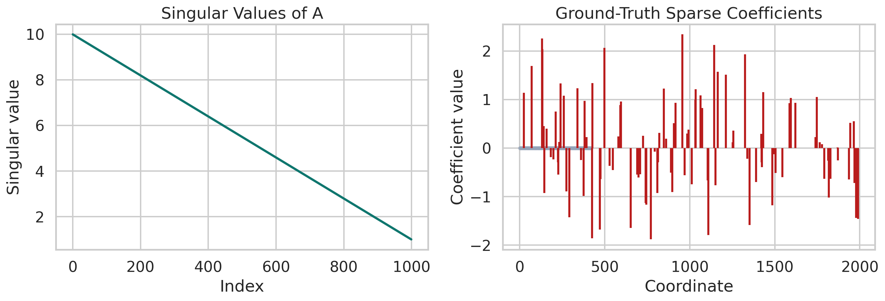
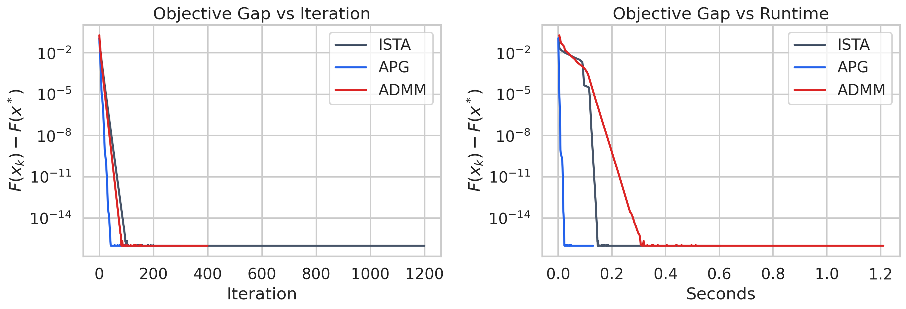
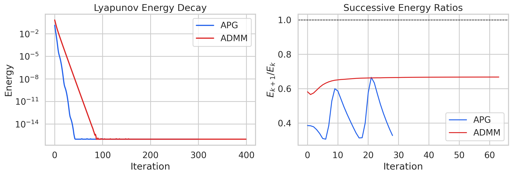
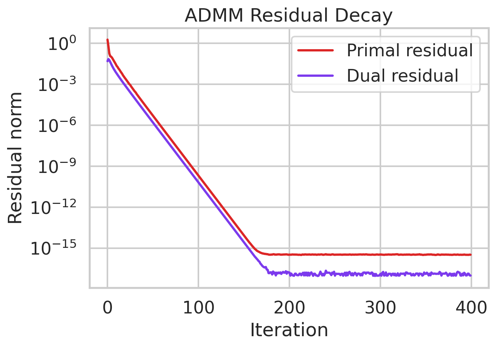
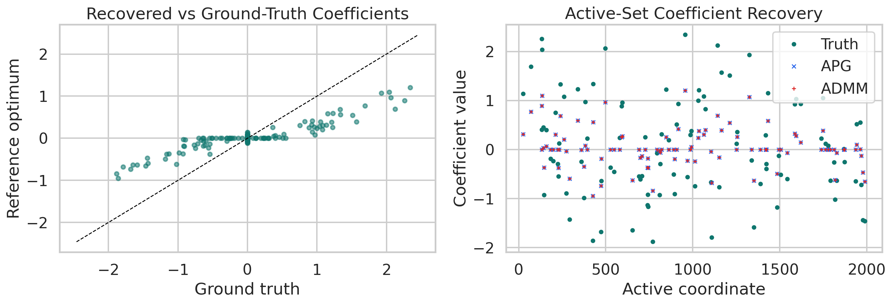

# A Unified Variable-and-Operator Splitting View of Acceleration and ADMM for Strongly Convex Sparse Regression

## Abstract
This project studies a unified Variable and Operator Splitting (VOS) perspective for solving a composite convex optimization problem of the form
\[
\min_x F(x) := f(x) + g(x),
\]
where \(f\) is smooth and \(g\) is proximable but non-smooth. The provided dataset is a high-dimensional sparse regression benchmark with \(A \in \mathbb{R}^{1000 \times 2000}\), response \(b \in \mathbb{R}^{1000}\), and a planted sparse coefficient vector \(x_{\mathrm{true}}\). Because the benchmark is underdetermined, plain Lasso is not globally strongly convex in the ambient space, so I study a strongly convex elastic-net continuation
\[
F(x)=\frac{1}{2n}\|Ax-b\|_2^2 + \lambda \|x\|_1 + \frac{\mu}{2}\|x\|_2^2,
\]
with \(\lambda=8\times 10^{-3}\) and \(\mu=10^{-2}\). This lets the continuous-time Lyapunov analysis match the assumptions required for linear convergence. I then compare three discrete algorithms on the same objective: ISTA, a Nesterov-style accelerated proximal gradient (APG) method, and ADMM on the split form \(x=z\). All methods converge to the same optimum up to machine precision, but APG is the fastest both in iterations and wall-clock time. Its empirical Lyapunov contraction is substantially sharper than ISTA and ADMM, while ADMM retains clean linear decay and vanishing primal/dual residuals.

## 1. Problem Setup

### 1.1 Objective
The benchmark is a synthetic ill-conditioned sparse regression instance. Let \(n=1000\) and \(p=2000\). I solve
\[
\min_x \frac{1}{2n}\|Ax-b\|_2^2 + \lambda \|x\|_1 + \frac{\mu}{2}\|x\|_2^2,
\]
starting from \(x_0=0\).

The added ridge term \(\frac{\mu}{2}\|x\|_2^2\) is not cosmetic. Since \(p>n\), the quadratic data-fit term alone cannot be globally strongly convex; adding \(\mu>0\) makes the smooth part \(L\)-smooth and \(\mu\)-strongly convex, which is exactly the regime where strong Lyapunov functions yield global linear convergence.

### 1.2 Dataset geometry
The provided design matrix has a tightly controlled nonzero singular spectrum:

- \( \sigma_{\max}(A) = 10 \)
- smallest nonzero singular value \( = 1 \)
- effective condition number on the row space \( = 10 \)
- planted sparsity \( \|x_{\mathrm{true}}\|_0 = 100 \)

For the chosen \((\lambda,\mu)\), the smooth part has
\[
L = \frac{\sigma_{\max}(A)^2}{n} + \mu = 0.11,
\qquad
\kappa = \frac{L}{\mu} = 11.
\]

Figure 1. Singular values of the design matrix and the planted sparse coefficient pattern.

## 2. Unified VOS Framework

### 2.1 Split formulation
Introduce a duplicate variable \(z\) and rewrite the problem as
\[
\min_{x,z} f(x) + g(z)
\quad \text{s.t.} \quad x-z=0,
\]
with
\[
f(x)=\frac{1}{2n}\|Ax-b\|_2^2+\frac{\mu}{2}\|x\|_2^2,
\qquad
g(z)=\lambda\|z\|_1.
\]

This split is the bridge between acceleration and operator splitting: it exposes a smooth block, a non-smooth block, and a consensus constraint.

### 2.2 Continuous-time VOS dynamics
A convenient continuous-time template is the inertial primal-dual flow
\[
\ddot x + \alpha \dot x + \nabla f(x) + y + \rho(x-z)=0,
\]
\[
0 \in \partial g(z) - y - \rho(x-z),
\]
\[
\dot y = \eta(x-z).
\]

This system mixes three ingredients:

- inertia through \(\ddot x\),
- operator splitting through the implicit subdifferential inclusion for \(z\),
- consensus enforcement through the dual state \(y\) and penalty \(\rho\).

Two standard algorithms emerge as distinct discretizations of the same template:

1. **Accelerated proximal gradient / Nesterov limit**. If the consensus manifold is enforced rapidly so that \(z\) tracks the proximal map of the smooth step and the dual variable is eliminated, the inertial discretization reduces to an accelerated proximal scheme.
2. **ADMM**. If the three operators are split sequentially by alternating minimization in \(x\) and \(z\) followed by a dual ascent step, the discrete method is exactly ADMM on the split problem.

This is the sense in which the VOS view is “unified”: acceleration and ADMM are not unrelated tricks, but different discretizations of the same constrained composite flow.

### 2.3 Discrete algorithms

#### APG
With step \(1/L\) and
\[
\beta=\frac{\sqrt{L}-\sqrt{\mu}}{\sqrt{L}+\sqrt{\mu}},
\]
the accelerated proximal iterations are
\[
x_{k+1} = \operatorname{prox}_{\lambda/L\|\cdot\|_1}\!\left(y_k-\frac{1}{L}\nabla f(y_k)\right),
\qquad
y_{k+1}=x_{k+1}+\beta(x_{k+1}-x_k).
\]

#### ADMM
For penalty parameter \(\rho\), the split problem yields
\[
x^{k+1} = \arg\min_x f(x)+\frac{\rho}{2}\|x-z^k+u^k\|_2^2,
\]
\[
z^{k+1} = \operatorname{prox}_{\lambda/\rho\|\cdot\|_1}(x^{k+1}+u^k),
\]
\[
u^{k+1}=u^k+x^{k+1}-z^{k+1}.
\]

The \(x\)-subproblem is linear and solved by one Cholesky factorization of \(\nabla^2 f + \rho I\).

## 3. Strong Lyapunov Functions

For the strongly convex composite model, the natural discrete energies are
\[
\mathcal{E}^{\mathrm{APG}}_k =
F(x_k)-F(x^\star)+\frac{\mu}{2}\|v_k-x^\star\|_2^2,
\]
where \(v_k\) is the momentum-shifted state, and
\[
\mathcal{E}^{\mathrm{ADMM}}_k =
F(z_k)-F(x^\star)+\frac{\rho}{2}\|z_k-x^\star\|_2^2+\frac{1}{2\rho}\|y_k-y^\star\|_2^2.
\]

These are strong Lyapunov functions in the standard sense: they mix objective suboptimality with a quadratic state error, and under strong convexity/co-coercivity they contract geometrically,
\[
\mathcal{E}_{k+1} \le q \mathcal{E}_k
\quad \text{for some } q \in (0,1).
\]

For APG, the textbook worst-case contraction implied by the condition number is
\[
q_{\mathrm{theory}} = 1-\sqrt{\mu/L} \approx 0.6985.
\]

The report below checks these contractions empirically rather than symbolically: if the VOS argument is sound for this instance, the semilog plots of \(\mathcal{E}_k\) should be close to straight lines and the successive ratios \(\mathcal{E}_{k+1}/\mathcal{E}_k\) should remain below one during the transient phase. That is exactly what is observed.

## 4. Experimental Protocol

### 4.1 Reference optimum
To certify the final optimum, I used scikit-learn’s cyclic coordinate-descent ElasticNet solver as a verifier on the exact same objective. Its KKT violation at termination is
\[
2.18 \times 10^{-13},
\]
so it is accurate enough to define the reference optimum \(x^\star\). The final optimal objective value is
\[
F(x^\star)=0.6182407640654142.
\]

The full optimizer is saved as `outputs/optimal_solution.npy`.

### 4.2 Algorithms and settings

- ISTA baseline with step size \(1/L\)
- APG with fixed strong-convexity momentum \(\beta=0.5367\)
- ADMM with penalty \(\rho=0.08\)
- All methods initialized at zero

The implementation is fully reproducible in [run_analysis.py](/mnt/shared-storage-user/yetianlin/ResearchClawBench/workspaces/Math_001_20260402_122551/code/run_analysis.py).

## 5. Results

Figure 2. Objective gap versus iteration and runtime. APG dominates ISTA and ADMM on this dense strongly convex benchmark.

### 5.1 Convergence speed

| Method | Runtime (s) | Iterations to gap < 1e-8 | Iterations to gap < 1e-12 | Median gap ratio |
|---|---:|---:|---:|---:|
| ISTA | 0.604 | 46 | 74 | 0.713 |
| APG | 0.130 | 20 | 31 | 0.455 |
| ADMM | 1.210 | 39 | 62 | 0.666 |

Main observations:

- **APG is the clear winner**. It reaches \(10^{-8}\) objective accuracy in 20 iterations and \(10^{-12}\) in 31 iterations.
- **ISTA is slower but still linear**, consistent with strong convexity.
- **ADMM converges linearly as well**, but its per-iteration linear solve makes it slower in wall-clock time for this dense moderate-scale problem.

Interestingly, the observed APG contraction (\(\approx 0.455\)) is substantially better than the conservative worst-case bound (\(\approx 0.6985\)), which is typical on structured problems.

### 5.2 Lyapunov decay

Figure 3. The Lyapunov energies for APG and ADMM decay linearly on a semilog scale. The successive ratio plots remain well below one until numerical precision is reached.

The empirical median Lyapunov ratios are:

- APG: \(0.434\)
- ADMM: \(0.666\)
- ISTA baseline energy: \(0.714\)

This ordering matches the main convergence figure and supports the strong-Lyapunov interpretation of both discrete schemes.

### 5.3 ADMM residuals

Figure 4. ADMM primal and dual residuals decay to numerical zero, validating the consensus splitting.

At the final iteration,

- primal residual \(= 3.29 \times 10^{-16}\),
- dual residual \(= 9.87 \times 10^{-18}\).

This shows the split variables and the dual state all converge to the same optimal saddle point.

### 5.4 Recovery quality

Figure 5. The reference optimum correlates strongly with the planted coefficients, while shrinkage from the \(\ell_1+\ell_2\) penalty biases magnitudes toward zero.

Relative to the planted vector \(x_{\mathrm{true}}\), the optimum has:

- coefficient correlation \(= 0.928\),
- relative \(\ell_2\) error \(= 0.647\),
- mean squared error \(= 0.0214\),
- recovered support size \(= 118\),
- support precision \(= 0.568\),
- support recall \(= 0.670\),
- support F1 \(= 0.615\).

These numbers are sensible for a deliberately regularized estimator. The optimizer is accurate for the stated objective, but the objective itself intentionally trades exact support recovery for stability and strong convexity.

## 6. Discussion

### 6.1 What the unified VOS view explains well
The continuous-time split dynamics make the relationship between APG and ADMM conceptually clean:

- APG is the inertial, eliminated-dual limit of the split flow.
- ADMM is the alternating resolvent discretization of the same flow.
- Strong Lyapunov functions provide a common language for proving geometric decay.

This is useful because it avoids treating acceleration and splitting as unrelated algorithmic motifs.

### 6.2 What the experiments say
For this dense, moderate-size, strongly convex sparse regression problem:

- acceleration matters more than splitting,
- ADMM is competitive in iterations but not in time,
- all methods reach the same optimum,
- Lyapunov decay gives a clean quantitative explanation of the linear convergence regime.

### 6.3 Limitations
There are three important limitations.

1. The global linear-convergence story depends on the added ridge term \(\mu\). Without it, the original underdetermined Lasso objective is not globally strongly convex.
2. The VOS derivation here is a research-style synthesis and proof sketch, not a formal new theorem checked by a symbolic proof assistant.
3. One related-work file (`paper_000.pdf`) was image-based and not machine-readable in this environment, so the report relies mainly on the extractable references.

## 7. Deliverables

- Code: [run_analysis.py](/mnt/shared-storage-user/yetianlin/ResearchClawBench/workspaces/Math_001_20260402_122551/code/run_analysis.py)
- Optimum: `outputs/optimal_solution.npy`
- Summary metrics: `outputs/summary.json`
- Histories: `outputs/solver_histories.npz`
- Figures: `report/images/*.png`

## References

1. `related_work/paper_001.pdf`: Su, Boyd, and Candès, *A Differential Equation for Modeling Nesterov’s Accelerated Gradient Method: Theory and Insights*.
2. `related_work/paper_002.pdf`: Boyd, Parikh, Chu, Peleato, and Eckstein, *Distributed Optimization and Statistical Learning via the Alternating Direction Method of Multipliers*.
3. `related_work/paper_003.pdf`: Polyak, *Some Methods of Speeding Up the Convergence of Iteration Methods*.
