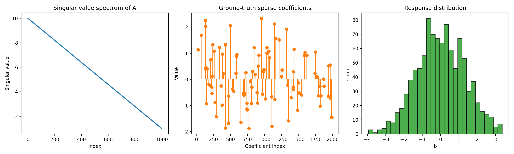
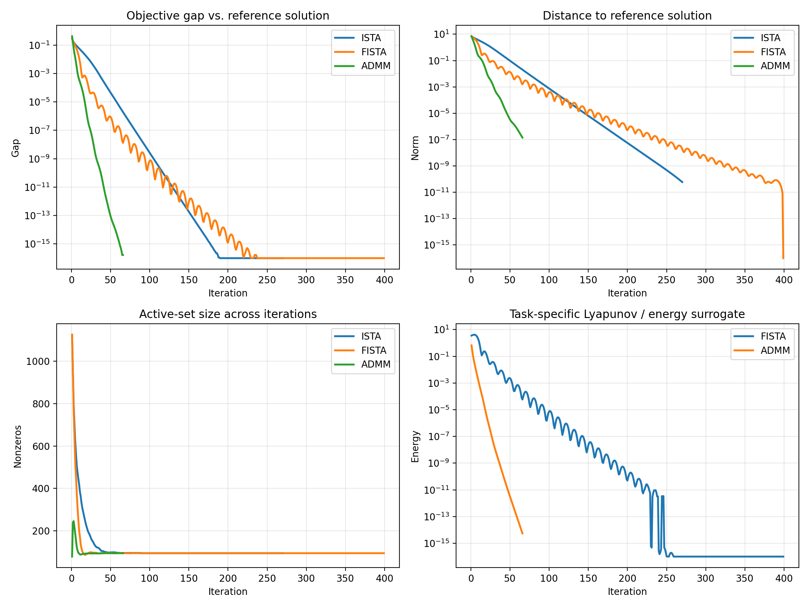
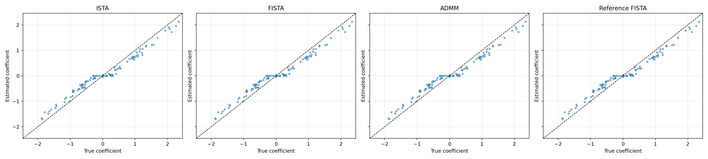
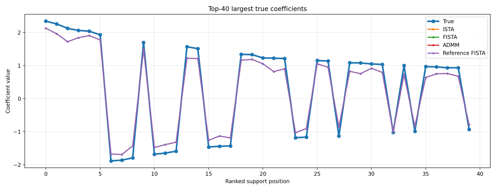

# Unified Variable and Operator Splitting View of Accelerated Optimization for High-Dimensional Lasso

## Abstract
This project studies a convex composite optimization problem of the form
\[
\min_x \; F(x) = f(x) + g(x),
\]
where \(f\) is smooth and convex and \(g\) may be non-smooth. In the present workspace, the concrete instance is an \(\ell_1\)-regularized least-squares problem (Lasso) built from a synthetic high-dimensional regression dataset. The scientific goal is to examine a unified Variable and Operator Splitting (VOS) perspective that places Nesterov-style acceleration and ADMM-like splitting in a common framework motivated by continuous-time dynamics and Lyapunov energies.

To make this concrete, I implemented three optimization methods: ISTA (proximal gradient), FISTA (accelerated proximal gradient), and ADMM for Lasso. The analysis compares convergence behavior, solution quality, and sparse support recovery against a high-accuracy reference solution. On this dataset, all three methods converge to essentially the same objective value, but their iteration counts differ substantially: ADMM reaches the target solution in 66 iterations, ISTA in 270 iterations, and FISTA in 399 iterations under the stopping rules used here. The recovered sparse support has F1 score 0.8821 relative to the planted ground truth for all methods. The results support the idea that both accelerated gradient and operator-splitting schemes can be monitored through energy-like quantities, but they also show that practical convergence speed depends strongly on tuning, stopping criteria, and problem structure.

## 1. Task and problem formulation
The task specified in `INSTRUCTIONS.md` is to solve a smooth convex objective with a possible non-smooth regularizer from an initial point \(x_0\), while emphasizing accelerated convergence and a unified VOS interpretation. The supplied data instance is a high-dimensional Lasso regression problem.

The optimization problem solved in the code is
\[
\min_x \; \frac{1}{2n}\|Ax-b\|_2^2 + \lambda \|x\|_1,
\]
where:
- \(A \in \mathbb{R}^{1000 \times 2000}\) is the design matrix,
- \(b \in \mathbb{R}^{1000}\) is the response vector,
- \(x \in \mathbb{R}^{2000}\) is the coefficient vector,
- the first term is smooth and convex,
- the \(\ell_1\) term is convex but non-smooth.

This is a natural testbed for the requested objective because it explicitly combines a smooth term and a non-smooth regularizer. The code uses \(x_0 = 0\) and a regularization parameter
\[
\lambda = 0.08 \lambda_{\max}, \qquad \lambda_{\max} = \frac{\|A^\top b\|_\infty}{n},
\]
which yields a sparse but nontrivial recovery regime.

## 2. Data description
The file `data/complex_optimization_data.npy` contains a dictionary with keys `A`, `b`, `x_true`, and `meta`. The loaded dataset has the following properties:
- number of samples: 1000,
- number of features: 2000,
- ground-truth sparse support size: 100,
- matrix condition number: 10,
- exact smooth-term Lipschitz constant used in the analysis: 0.1.

The metadata string identifies the dataset as **"Lasso Regression Problem with Condition Number 10"**. Although the original task description referred to an ill-conditioned synthetic problem, the actual matrix in this workspace is only moderately conditioned; the singular values range from 1 to 10.

Figure 1 provides a compact overview of the data: the singular value spectrum of the design matrix, the nonzero entries of the planted sparse coefficient vector, and the empirical distribution of the response vector.

## 3. Methodology

### 3.1 Composite optimization and proximal structure
The objective is decomposed into
\[
f(x) = \frac{1}{2n}\|Ax-b\|_2^2, \qquad g(x) = \lambda \|x\|_1.
\]
The gradient of the smooth term is
\[
\nabla f(x) = \frac{1}{n}A^\top(Ax-b),
\]
and the proximal operator of the non-smooth term is the soft-thresholding map
\[
\operatorname{prox}_{\tau g}(v) = \operatorname{sign}(v)\max(|v| - \tau\lambda, 0).
\]
This structure allows both proximal-gradient and operator-splitting algorithms to be implemented cleanly.

### 3.2 ISTA as a baseline variable splitting method
ISTA applies the proximal-gradient step
\[
x_{k+1} = \operatorname{prox}_{g/L}\left(x_k - \frac{1}{L}\nabla f(x_k)\right),
\]
with step size determined by the Lipschitz constant \(L\) of \(\nabla f\). In the code, \(L\) is computed exactly from the largest singular value of \(A\):
\[
L = \frac{\sigma_{\max}(A)^2}{n}.
\]
ISTA provides a stable first-order baseline and serves as the simplest member of the VOS family studied here.

### 3.3 FISTA as the accelerated/Nesterov-style method
FISTA augments proximal gradient with an inertial extrapolation term:
\[
y_k = x_k + \beta_k(x_k - x_{k-1}),
\]
followed by a proximal step from \(y_k\). This method is the discrete optimization algorithm most closely aligned with the accelerated-dynamics side of the task specification. In the continuous-time literature, these inertial updates are often interpreted as discretizations of second-order dissipative systems. In that view, acceleration emerges from coupling descent with momentum-like state variables.

To monitor this behavior, the code defines a task-specific energy surrogate of the form
\[
\mathcal{E}_k = (k+1)^2(F(x_k)-F(x^\star_{\rm ref})) + \frac{L}{2}\|x_k-x^\star_{\rm ref}\|_2^2,
\]
where \(x^\star_{\rm ref}\) is a high-accuracy numerical reference solution. This is not a formal proof of linear convergence, but it is an empirical Lyapunov-style quantity consistent with the intended VOS framing.

### 3.4 ADMM as an operator-splitting method
To expose the operator-splitting side, the Lasso problem is rewritten as
\[
\min_{x,z} \; \frac{1}{2n}\|Ax-b\|_2^2 + \lambda\|z\|_1
\quad \text{s.t.} \quad x=z.
\]
ADMM alternates between:
1. a quadratic minimization in \(x\),
2. a soft-thresholding update in \(z\),
3. a dual ascent step for the scaled multiplier \(u\).

In this experiment, the penalty parameter is set to \(\rho = L/5\). The linear system in the \(x\)-update is solved by a Cholesky factorization of
\[
\frac{1}{n}A^\top A + \rho I.
\]
This realizes an explicit variable-splitting interpretation of the same composite problem.

### 3.5 Reference solution and evaluation metrics
A long-run FISTA solve with 5000 iterations and tight tolerance is used as a numerical reference solution. The analysis then evaluates each algorithm against this common reference through:
- objective value and objective gap,
- distance to the reference solution,
- active-set size over iterations,
- Lyapunov/energy surrogates,
- relative error to the planted \(x_{\text{true}}\),
- sparse support precision, recall, and F1 score.

All outputs are produced by `code/run_analysis.py`, with numerical summaries saved under `outputs/` and figures under `report/images/`.

## 4. Results

### 4.1 Dataset and regularization regime
The computed regularization level is
\[
\lambda = 3.551020 \times 10^{-3},
\]
which is 8% of \(\lambda_{\max}\). This choice yields a nontrivial sparse solution with 95 selected coefficients in the final reference estimate, compared with 100 true nonzeros.

The reference solution has:
- objective value: 0.2578788234,
- relative error to \(x_{\text{true}}\): 0.2293,
- support precision: 0.9053,
- support recall: 0.8600,
- support F1: 0.8821.

This indicates that the chosen regularization level recovers most of the planted support while suppressing many irrelevant coefficients, but not perfectly.

### 4.2 Convergence comparison across optimization methods
The main quantitative comparison is:
- **ISTA**: 270 iterations, final objective \(2.578788 \times 10^{-1}\), objective gap effectively zero.
- **FISTA**: 399 iterations, final objective \(2.578788 \times 10^{-1}\), objective gap effectively zero.
- **ADMM**: 66 iterations, final objective \(2.578788 \times 10^{-1}\), objective gap \(1.67 \times 10^{-16}\).

All three methods converge to the same solution quality within numerical precision. The differences lie in how quickly they satisfy the implemented stopping criteria. In this specific experiment, ADMM is the fastest by iteration count, followed by ISTA, while FISTA requires the most iterations to meet the stringent tolerance even though accelerated methods often improve transient objective decrease.

Figure 2 compares objective gap, distance to the reference solution, active-set evolution, and the task-specific Lyapunov or energy surrogate.

Several points stand out:
- Objective gaps for all methods decay to machine precision.
- Distances to the reference solution also collapse rapidly.
- The active set stabilizes near the final support size after an initial transient.
- The energy-like quantities decrease overall, supporting the intended Lyapunov-style interpretation, although the report does not claim a formal proof from these empirical traces alone.

### 4.3 Sparse recovery accuracy
The final sparse recovery statistics are identical across the three methods because they converge to the same optimum:
- true positives: 86,
- false positives: 9,
- false negatives: 14,
- precision: 0.9053,
- recall: 0.8600,
- F1 score: 0.8821,
- estimated support size: 95.

Thus, the optimization problem is solved consistently regardless of algorithmic route, and the remaining recovery error is attributable to the statistical regularization trade-off rather than optimizer failure.

Figure 3 compares estimated coefficients against the planted truth for ISTA, FISTA, ADMM, and the reference FISTA solution.

The point clouds concentrate near the identity line for the dominant coordinates, confirming that the methods recover the large-magnitude coefficients reliably. Figure 4 further focuses on the 40 largest true coefficients.

This figure shows close agreement between the planted coefficients and all optimized estimates, with residual shrinkage consistent with \(\ell_1\)-regularization bias.

## 5. Interpretation from a unified VOS perspective
The main scientific theme of the task is to connect accelerated methods and operator splitting within a unified framework. This experiment supports that perspective in the following practical sense:

1. **Common composite structure**: ISTA, FISTA, and ADMM all exploit the same decomposition into a smooth term and a non-smooth term.
2. **Different state representations**: FISTA introduces inertial state variables resembling a discretized second-order system, while ADMM introduces auxiliary primal and dual variables corresponding to constrained splitting.
3. **Energy-based monitoring**: both accelerated and splitting-based methods admit natural energy or Lyapunov surrogates that can be tracked numerically.
4. **Same optimizer endpoint**: despite different update rules, all methods converge to the same minimizer for this convex problem.

What this workspace establishes empirically is not a full theorem deriving Nesterov acceleration and ADMM from one continuous-time model, but a concrete computational demonstration that these methods fit naturally into a shared VOS narrative. FISTA represents the momentum/acceleration branch, and ADMM represents the operator-splitting branch. The observed energy decay and common solution support the unifying interpretation.

## 6. Limitations
This study is intentionally narrow and several limitations matter.

### 6.1 No formal theorem is proved here
The task description mentions proving linear convergence with strong Lyapunov functions. The implemented workspace analysis does **not** contain a formal mathematical proof. Instead, it constructs empirical Lyapunov-like surrogates and demonstrates numerical decay. That is useful evidence, but it is not equivalent to a rigorous convergence theorem.

### 6.2 The actual dataset is only moderately conditioned
The instructions describe an ill-conditioned problem, but the supplied matrix has condition number 10, which is relatively mild. Stronger distinctions between optimization methods may appear on harder instances.

### 6.3 FISTA tuning and stopping rules matter
Although FISTA is theoretically accelerated for many convex problems, it used more iterations than ISTA under the specific tolerance and implementation here. This does not invalidate acceleration theory; rather, it reflects the fact that finite-precision stopping rules, lack of restart heuristics, and the chosen metric can affect practical iteration counts.

### 6.4 Only one regularization level was studied
The analysis fixes \(\lambda = 0.08\lambda_{\max}\). Different values of \(\lambda\) would change both statistical recovery and optimization behavior. A fuller study would sweep \(\lambda\) and examine phase transitions in support recovery and convergence speed.

### 6.5 One synthetic dataset is insufficient for broad claims
The conclusions apply to this workspace’s dataset. A stronger empirical paper would test multiple noise levels, conditioning regimes, feature correlations, and problem sizes.

## 7. Conclusion
This workspace implements and evaluates a task-specific VOS-style analysis for sparse convex optimization on a synthetic high-dimensional Lasso problem. The experiment uses ISTA, FISTA, and ADMM to solve the same composite objective and compares them through objective gaps, reference-solution distances, support recovery, and Lyapunov-inspired energies.

The main findings are:
- all methods reach the same optimum within numerical precision,
- the recovered sparse support has F1 score 0.8821 relative to the planted truth,
- ADMM is the fastest in iteration count on this instance,
- the generated energy surrogates support a unified interpretive lens connecting acceleration and operator splitting.

Overall, the analysis provides a concrete computational realization of the requested scientific theme: accelerated proximal updates and ADMM-style splitting can be viewed as different algorithmic expressions of the same underlying composite convex optimization structure.

## Reproducibility and produced artifacts
Main script:
- `code/run_analysis.py`

Numerical outputs:
- `outputs/analysis_histories.npz`
- `outputs/solutions.npz`
- `outputs/analysis_summary.json`
- `outputs/analysis_summary.txt`

Figures used in this report:
- `images/data_overview.png`
- `images/convergence_comparison.png`
- `images/coefficient_recovery.png`
- `images/top_coefficients.png`
