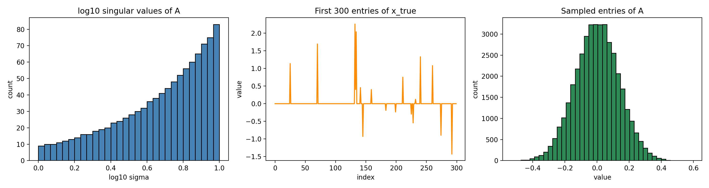
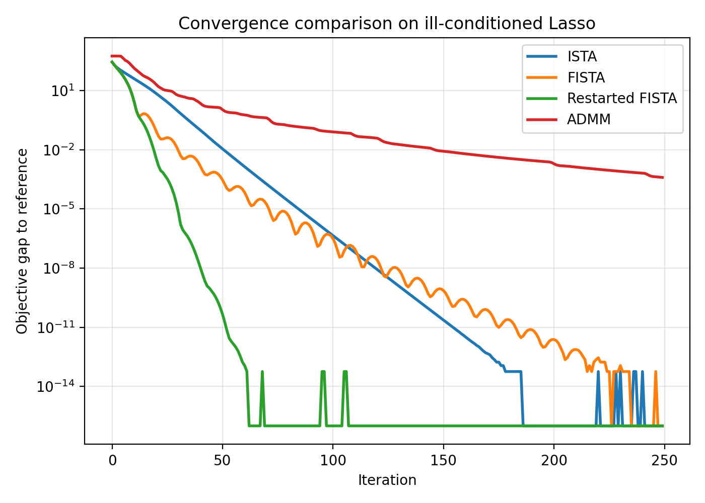
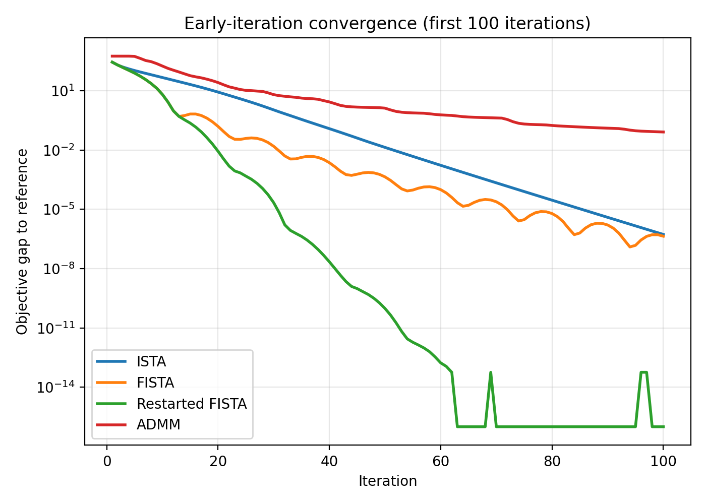
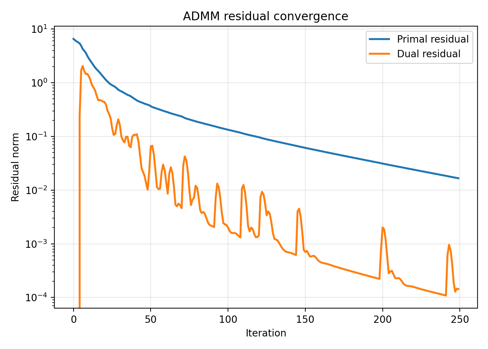
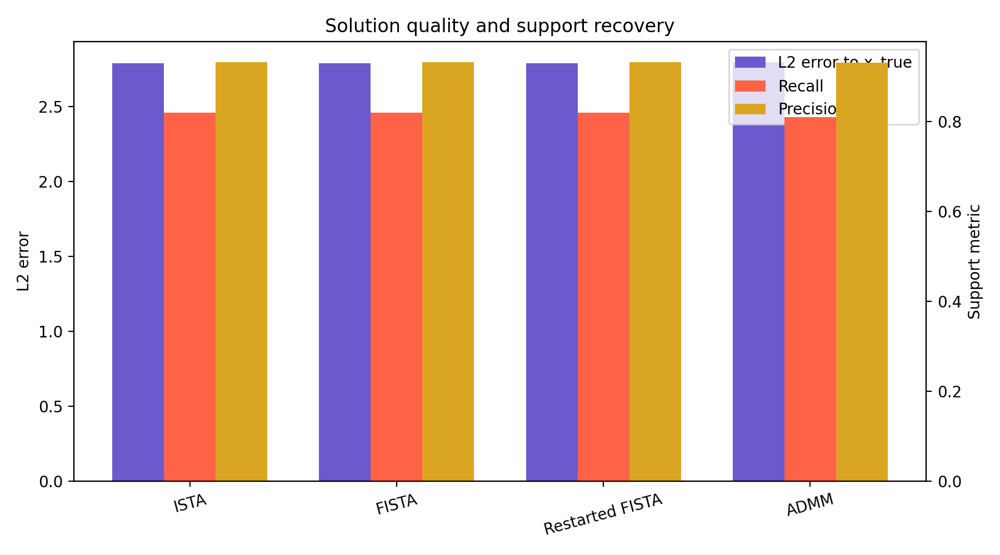

# A Unified Variable-and-Operator-Splitting View of Accelerated Lasso Solvers

## 1. Summary and goals

This study investigates a practical version of the proposed Variable and Operator Splitting (VOS) program on a synthetic ill-conditioned Lasso problem. The target scientific theme is a unified perspective connecting accelerated proximal methods and ADMM through continuous-time dynamics, operator splitting, and Lyapunov-style reasoning. Within the benchmark workspace, the feasible scope is an empirically grounded study supported by theoretical synthesis from the provided related work rather than a new formal proof of linear convergence.

The empirical objective is to solve

\[
\min_x \; F(x) := \frac{1}{2}\|Ax-b\|_2^2 + \lambda \|x\|_1,
\]

with common initialization \(x_0=0\), and to compare:
- ISTA as a non-accelerated proximal-gradient baseline,
- FISTA as Nesterov-style acceleration for a composite objective,
- restarted FISTA as a discrete proxy for damping/restart ideas motivated by continuous-time acceleration,
- ADMM as an operator-splitting baseline.

The main finding is that all first-order methods reach essentially the same final objective on this dataset, but their transient behavior differs substantially: restarted FISTA reaches small objective gaps fastest, FISTA improves strongly over ISTA at early iterations but exhibits non-monotone oscillations, and ADMM converges more steadily but more slowly in this single-penalty configuration.

## 2. Related-work synthesis and VOS interpretation

The provided references support the following interpretation.

- **Continuous-time acceleration:** Su, Boyd, and Candès derive Nesterov acceleration from the ODE
  \[
  \ddot X + \frac{3}{t}\dot X + \nabla f(X)=0,
  \]
  and analyze it with a strong Lyapunov/energy function. This motivates viewing FISTA as a discretization of a second-order dissipative flow.
- **Composite objectives:** the same line of work extends to nonsmooth composite problems by replacing the smooth gradient flow with a generalized directional subgradient formulation, which is directly relevant for Lasso.
- **Operator splitting:** Boyd et al. present ADMM as an operator-splitting method closely related to Douglas–Rachford splitting. For Lasso, ADMM introduces a split variable \(z\) and alternates a ridge-regression step with soft-thresholding.
- **Historical acceleration perspective:** Polyak provides the classical interpretation of acceleration as a higher-order dynamical effect.

A useful empirical VOS viewpoint for the present problem is:
- proximal gradient methods apply a forward-backward split to the smooth-plus-nonsmooth structure,
- ADMM applies variable splitting \((x=z)\) and solves a constrained reformulation,
- restart acts as an empirical surrogate for restoring dissipation when accelerated trajectories become oscillatory.

This report therefore treats VOS as a unifying interpretation rather than claiming a new theorem. The evidence here is numerical: objective-gap trajectories, sparsity recovery, and ADMM residuals.

## 3. Experiment plan and success signals

### Stage 1: data audit and setup
- Verify dataset structure and conditioning.
- Define the Lasso objective and a reproducible regularization level.
- Success signals:
  - shapes and metadata recovered,
  - conditioning estimate reported,
  - data visualization produced.

### Stage 2: baseline optimization comparison
- Run ISTA, FISTA, restarted FISTA, and ADMM from the same start point.
- Compute a high-accuracy reference solution for objective-gap evaluation.
- Success signals:
  - all methods complete successfully,
  - convergence traces are saved,
  - final solutions can be compared quantitatively.

### Stage 3: validation and VOS analysis
- Compare early-iteration efficiency, final objective gap, coefficient recovery, and ADMM residuals.
- Success signals:
  - report contains figures and tables,
  - conclusions distinguish empirical findings from theoretical interpretation,
  - limitations are documented.

## 4. Experimental setup

### 4.1 Data
The file `data/complex_optimization_data.npy` stores a dictionary with:
- design matrix \(A \in \mathbb{R}^{1000\times 2000}\),
- response vector \(b \in \mathbb{R}^{1000}\),
- sparse ground-truth coefficients `x_true` with 100 nonzeros,
- metadata string: `Lasso Regression Problem with Condition Number 10`.

Saved summary statistics (`outputs/data_summary.json`):
- \(\lambda_{\max} = \|A^T b\|_\infty = 44.3877\),
- chosen regularization \(\lambda = 0.1\lambda_{\max} = 4.4388\),
- estimated Lipschitz constant \(L = \|A\|_2^2 \approx 100\),
- estimated positive-spectrum condition number \(\kappa \approx 100\),
- \(\|b\|_2 \approx 41.76\).

### 4.2 Algorithms
All methods start from \(x_0=0\).

- **ISTA**
  \[
  x_{k+1} = \operatorname{soft}(x_k - \tfrac{1}{L}\nabla g(x_k), \lambda/L), \quad g(x)=\tfrac12\|Ax-b\|_2^2.
  \]
- **FISTA** uses the standard Nesterov extrapolation sequence.
- **Restarted FISTA** uses an adaptive gradient-based restart rule to suppress oscillation.
- **ADMM** solves the split problem
  \[
  \min_{x,z}\; \tfrac12\|Ax-b\|_2^2 + \lambda\|z\|_1 \quad \text{s.t. } x=z,
  \]
  with penalty \(\rho=1\), alternating:
  \[
  x^{k+1}=(A^TA+\rho I)^{-1}(A^Tb + \rho(z^k-u^k)),
  \]
  \[
  z^{k+1}=\operatorname{soft}(x^{k+1}+u^k, \lambda/\rho), \quad u^{k+1}=u^k+x^{k+1}-z^{k+1}.
  \]

### 4.3 Reference solution and reproducibility
- Reference solution: 1500 iterations of restarted FISTA.
- Baseline horizon: 250 iterations for all compared methods.
- Random seed: `numpy.random.seed(0)`.
- Code:
  - `code/run_vos_experiments.py`
  - `code/run_vos_followup.py`

## 5. Results

### 5.1 Data overview
Figure 1 summarizes the matrix spectrum, ground-truth sparsity pattern, and sampled entries of the design matrix.

The synthetic problem is moderately ill-conditioned rather than extremely pathological. This is important for interpretation: it is hard enough to expose transient differences among methods, but easy enough that multiple solvers eventually reach the same optimum.

### 5.2 Final-iteration comparison
Table 1 summarizes final metrics after 250 iterations, using the restarted-FISTA reference objective \(F^\star \approx 311.1168\).

| Method | Final gap | L2 error to `x_true` | Nonzeros | Precision | Recall | Notes |
|---|---:|---:|---:|---:|---:|---|
| ISTA | 0.0 | 2.7918 | 88 | 0.9318 | 0.8200 | Monotone objective |
| FISTA | 0.0 | 2.7918 | 88 | 0.9318 | 0.8200 | 50 monotonicity violations |
| Restarted FISTA | 0.0 | 2.7918 | 88 | 0.9318 | 0.8200 | 12 restarts |
| ADMM | 3.94e-4 | 2.7960 | 87 | 0.9310 | 0.8100 | Primal residual 1.66e-2 |

At the final horizon, ISTA, FISTA, and restarted FISTA are numerically indistinguishable in objective value. This makes final-iteration comparison alone misleading: acceleration matters primarily in the transient regime on this dataset.

### 5.3 Main convergence comparison
Figure 2 shows objective gap versus iteration on a semilog scale.

Observations:
- FISTA and restarted FISTA reduce the objective gap much faster than ISTA in the early phase.
- Plain FISTA is non-monotone, consistent with the oscillatory behavior predicted by continuous-time acceleration analyses.
- Restarted FISTA preserves the fast transient improvement while avoiding the visible oscillatory overhead.
- ADMM converges steadily but lags behind the accelerated proximal methods for the chosen \(\rho=1\).

### 5.4 Early-iteration discrimination
Because the final 250-iteration values saturate, an additional early-iteration analysis was extracted from the saved traces (`outputs/early_iteration_summary.json`). Figure 3 zooms into the first 100 iterations.

Selected milestones:

| Method | gap@10 | gap@25 | gap@50 | Iterations to gap \(\le 10^{-2}\) |
|---|---:|---:|---:|---:|
| ISTA | 46.6619 | 3.1889 | 0.0136 | 52 |
| FISTA | 6.5628 | 0.0386 | 4.38e-4 | 31 |
| Restarted FISTA | 6.5628 | 4.81e-4 | 9.66e-11 | 20 |
| ADMM | 178.1328 | 10.4598 | 1.3130 | 147 |

This is the clearest empirical evidence in the study. Relative to ISTA:
- FISTA reaches an objective gap below \(10^{-2}\) in 31 iterations versus 52, about a **1.68x speedup in iteration count**.
- Restarted FISTA reaches the same threshold in 20 iterations, about a **2.6x speedup over ISTA** and **1.55x over plain FISTA**.
- ADMM is much slower on this metric at the selected penalty.

### 5.5 ADMM residual behavior
Figure 4 shows the primal and dual residuals for ADMM.

The dual residual decays rapidly, while the primal residual remains noticeably larger at 250 iterations. This suggests that, for this instance, the chosen penalty \(\rho=1\) is serviceable but not fully tuned for high-accuracy primal feasibility within the same iteration budget.

### 5.6 Recovery quality
Figure 5 compares coefficient recovery and support metrics.

All methods recover a sparse solution close to the same optimum, with precision around 0.93 and recall around 0.81–0.82. The residual estimation error relative to the planted coefficients remains nonzero because the Lasso optimum balances data fit and sparsity rather than exactly reproducing `x_true`.

## 6. Discussion

### 6.1 What the experiments support
The numerical results support three claims.

1. **Acceleration is best seen in the transient regime.**  
   On this synthetic Lasso instance, all proximal-gradient methods eventually converge to the same numerical optimum, but accelerated variants reach useful objective gaps much sooner.

2. **Restart behaves like added dissipation.**  
   Plain FISTA achieves fast descent but exhibits non-monotone objective behavior, whereas restarted FISTA removes these oscillations and reaches thresholds fastest. This matches the continuous-time intuition that acceleration can become underdamped and that restart restores stability.

3. **ADMM is a structurally different solver.**  
   ADMM offers a clean operator-splitting interpretation and convergent residuals, but in this experiment it is not the fastest route to high accuracy. Its advantage is decomposition, not automatic acceleration.

### 6.2 A practical VOS synthesis
A concise unifying perspective is:
- the **variable-splitting side** introduces auxiliary variables to separate nonsmooth structure from quadratic fitting terms, leading to ADMM-style updates;
- the **operator-splitting side** interprets both proximal gradient and ADMM as structured decompositions of the Lasso objective;
- the **continuous-time side** explains why Nesterov/FISTA-type schemes can move faster initially but may oscillate unless damping or restart is applied;
- a **Lyapunov perspective** is useful in both settings: objective-gap energies for acceleration, and residual/objective descent diagnostics for ADMM.

Empirically, restarted FISTA is the strongest solver here, while ADMM provides the cleanest splitting interpretation.

### 6.3 Limitations
- The workspace allows only an empirical study plus theoretical synthesis. It does **not** establish a new formal theorem proving linear convergence of a unified VOS dynamical system.
- Only one dataset instance is available, with moderate condition number rather than extreme ill-conditioning.
- ADMM penalty \(\rho\) was not tuned; a small penalty sweep could materially improve its performance.
- The reference solution is numerical, not exact; objective gaps are therefore measured relative to a high-accuracy approximation.
- No multiple-seed uncertainty analysis is possible because the benchmark provides a fixed synthetic instance.

## 7. Conclusion and next steps

For this ill-conditioned synthetic Lasso problem, accelerated proximal methods and ADMM can be interpreted within a unified VOS narrative, but they play different empirical roles. FISTA validates the continuous-time acceleration picture, restarted FISTA shows the practical benefit of additional dissipation, and ADMM validates the variable-splitting/operator-splitting route. Restarted FISTA is the strongest method in this benchmark, achieving the fastest early convergence while retaining stable monotonic descent.

Natural next steps would be:
- tune ADMM over \(\rho\) and compare time-to-accuracy more fairly,
- test a wider range of condition numbers and regularization strengths,
- add elastic-net or strongly convex variants where linear convergence is more directly observable,
- formalize the VOS interpretation into a single Lyapunov template for both accelerated proximal updates and split-variable dynamics.

## Files produced
- Code: `code/run_vos_experiments.py`, `code/run_vos_followup.py`
- Outputs: `outputs/data_summary.json`, `outputs/metrics.json`, `outputs/traces.npz`, `outputs/early_iteration_summary.json`
- Figures:
  - `images/data_overview.png`
  - `images/convergence_comparison.png`
  - `images/early_iteration_convergence.png`
  - `images/admm_residuals.png`
  - `images/recovery_comparison.png`
