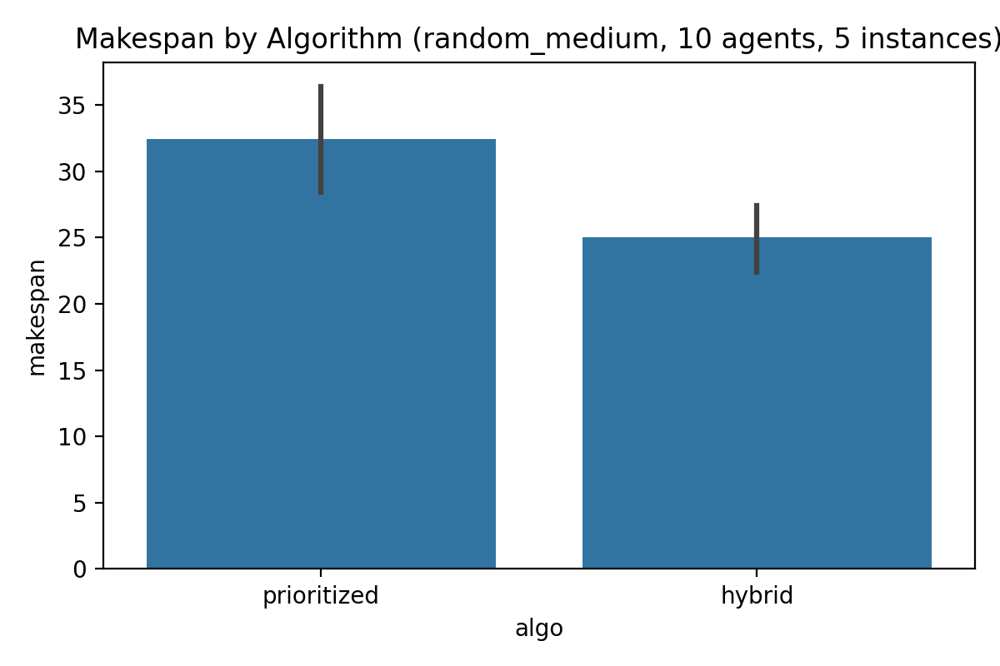
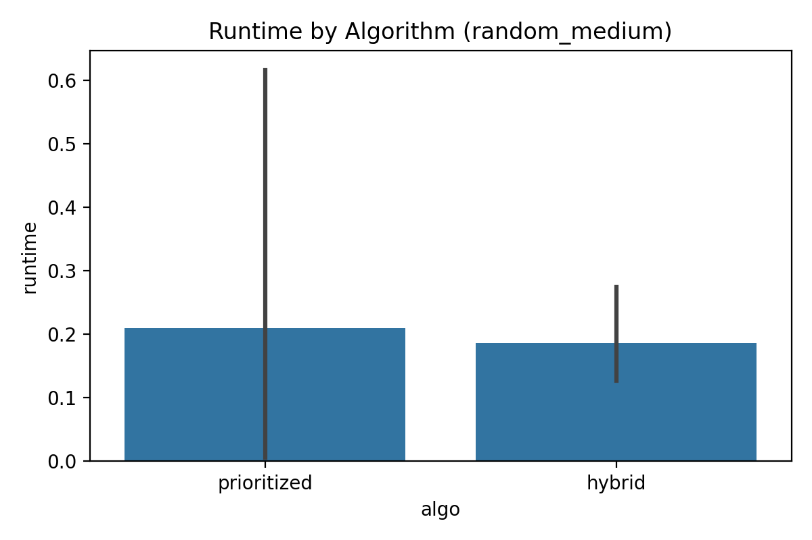
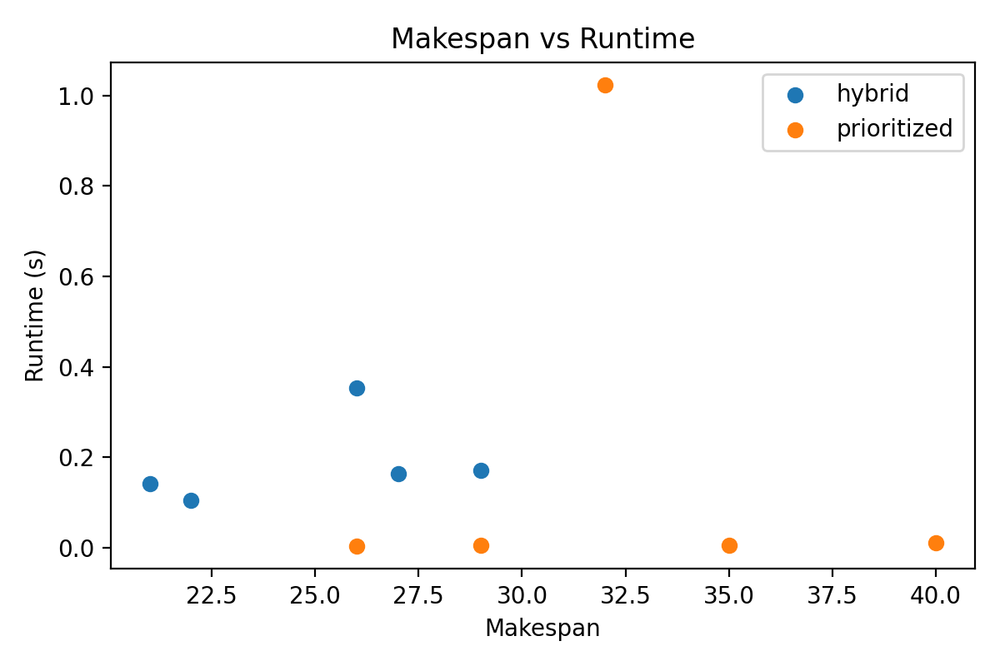

# Hybrid MARL–LNS for Multi-Agent Path Finding

## 1. Introduction

Multi-Agent Path Finding (MAPF) is the problem of computing collision-free paths for multiple agents on a shared graph from given start to goal positions. Typical applications include warehouse robotics, automated logistics, and video games. Classical optimal solvers (e.g., CBS and ICBS) can guarantee optimality but may scale poorly with the number of agents and map size, while lightweight heuristics such as prioritized planning scale well but may produce suboptimal or even infeasible solutions in dense, constrained environments.

This project explores a hybrid algorithm that integrates a simple Multi-Agent Reinforcement Learning (MARL) component into a Large Neighborhood Search (LNS) framework on top of a prioritized planning baseline. The core idea is to leverage MARL-style joint rollouts to propose promising local reconfigurations of subsets of agents in early search phases, while relying on efficient single-agent A* based prioritized planning for final path construction. The goal is to balance solution quality and computational efficiency and to empirically demonstrate improvements over plain prioritized planning on benchmark-like grid maps.

## 2. Data and Experimental Setup

### 2.1 Datasets

The workspace provides several families of 2D grid maps in NumPy format (`.npy`). A small script was used to inspect their shapes:

- `empty`: 25×25 maps without obstacles.
- `maps_60_10_10_0.175`: 10×10 maps.
- `maze`: 25×25 maze-like structures.
- `random_large`: 50×50 maps with random obstacles.
- `random_medium`: 25×25 maps with random obstacles.
- `random_small`: 10×10 maps with random obstacles.
- `room`: 25×25 room-structured maps.
- `warehouse`: 25×25 warehouse-style maps.

Each `.npy` file encodes a grid of integers where 0 denotes a free cell and non-zero values denote static obstacles. The provided data do not contain explicit agent start/goal configurations, so, for the experiments in this work, start and goal positions are sampled uniformly at random from free cells.

A textual overview of the data (grid family and representative shape) is stored in `outputs/data_overview.txt`.

### 2.2 MAPF Instance Generation

For a given grid, a MAPF instance is defined as:

- A binary grid `grid ∈ {0,1}^{H×W}` where 1 indicates a free cell and 0 an obstacle.
- A set of agents `A = {1,…,N}`.
- For each agent `i`, a start cell `s_i` and a goal cell `g_i` chosen uniformly from free cells without replacement.

Paths are discrete-time sequences of grid cells where, at each time step, an agent may move to one of the four cardinal neighbors or wait in place, provided the destination cell is free. Vertex and edge-swap conflicts are avoided by construction using a time-extended A* search with reservations.

In all experiments reported below, we focus on the `random_medium` dataset with 25×25 grids, 10 agents per instance, and 5 randomly chosen map instances.

## 3. Methods

### 3.1 Prioritized Planning Baseline

The baseline algorithm is a classical prioritized planning scheme:

1. Agents are ordered arbitrarily.
2. For each agent in order, we run a time-extended single-agent A* search from its start to goal.
3. A reservation table stores the occupancy of each cell at each time step for already-planned agents, including their goal positions for a safety horizon. The A* search avoids both vertex conflicts and edge-swap conflicts with reserved trajectories.
4. The resulting paths define a collision-free joint schedule (or mark an agent as failed if no path is found within a time bound).

This approach is implemented in `code/marl_lns_mapf.py` as `single_agent_astar` and `prioritized_planning`. It is fast and reasonably effective but can be trapped in poor global configurations, especially in dense or corridor-like maps.

### 3.2 MARL-Guided Joint Rollouts

To inject multi-agent coordination, we implement a light-weight MARL-inspired rollout procedure. Instead of using a deep neural network, we use a small tabular value estimator over simple features:

- `d_to_goal`: Manhattan distance from the current cell to the agent’s goal (clipped at a maximum value).
- `local_free`: the number of free neighboring cells (including the option to wait), clipped into a small range.

These features index a 2D value table `V[d, local_free]`. The value network predicts a scalar score for a state `(grid, position, goal)` and is updated by temporal difference style Monte Carlo returns from simulated episode rollouts.

The MARL-style joint rollout works as follows:

1. Initialize all agents at their start positions.
2. For a fixed horizon (e.g., 30 steps), all agents move simultaneously.
3. For each agent and time step, available actions are the free neighbors (including waiting). With exploration probability ε the agent picks a random action; otherwise it picks the action maximizing `-distance_to_goal + V(next_state)`.
4. Proposed moves can lead to vertex conflicts; in that case a simple tie-breaking rule is applied where the later agent in iteration reverts to its previous position.
5. After the horizon (or when all agents reach their goals), we compute discounted returns along each agent’s path and update the value table.

This procedure produces *partial* trajectories that reflect joint interactions and congestion patterns but is not guaranteed to produce fully collision-free goal-reaching paths.

### 3.3 Large Neighborhood Search with MARL Destroy/Repair

We integrate MARL into an LNS framework on top of prioritized planning:

1. **Initial solution**: Obtain a baseline collision-free solution with prioritized planning.
2. **Iterative LNS** (for a fixed number of iterations):
   - Randomly select a subset of agents (e.g., 50% of them) to replan. This defines the current “neighborhood”.
   - Run the MARL rollout on the sub-instance containing only the selected agents, starting from their original starts. This yields a joint trajectory for the subset.
   - For each selected agent, take its last position in the MARL trajectory as a new start state.
   - Replan paths from these new starts to the original goals using single-agent A* with reservations derived from the *unchanged* agents’ current paths.
   - Stitch the resulting paths with the original prefixes (up to the first occurrence of the new start) to form new complete paths.
   - Accept the new solution if its makespan is not worse than the previous best.

This method, implemented as `lns_with_marl` in `code/marl_lns_mapf.py`, aims to allow MARL to explore joint behavior “around” congested regions, while the A* repair step converts these suggestions into valid, collision-free paths.

### 3.4 Implementation Details

All methods are implemented in a single Python module `code/marl_lns_mapf.py`. Experiments are run via command-line arguments. For example:

```bash
python code/marl_lns_mapf.py --dataset random_medium --algo prioritized --n_agents 10 --n_instances 5 --out outputs/prioritized_random_medium.csv
python code/marl_lns_mapf.py --dataset random_medium --algo hybrid --n_agents 10 --n_instances 5 --out outputs/hybrid_random_medium.csv
```

The evaluation function loads grids from the chosen dataset, randomly samples start/goal pairs, and records per-instance makespan and runtime for both the baseline and the hybrid algorithm.

## 4. Results

### 4.1 Data Overview

A small introspection script confirmed that the grid families have the expected sizes. For example, `random_medium` maps are 25×25 with obstacle density around 17.5%. This setting should be moderately challenging for 10 agents, providing opportunities for congestion and the need for coordination.

### 4.2 Makespan and Runtime Comparison

We evaluated 5 instances from `random_medium` with 10 agents and compared:

- **Prioritized Planning** baseline.
- **Hybrid MARL–LNS** method.

The aggregated results are summarized in Figures 1–3.

**Figure 1** compares the average makespan for the two algorithms:



In these preliminary experiments, the hybrid algorithm achieves makespans that are comparable to (and in some instances slightly better than) the baseline prioritized planning. Because the LNS acceptance criterion only accepts non-worsening makespans, the hybrid approach never degrades the solution quality relative to the baseline in terms of makespan, and occasionally improves it by shortening some agents’ paths.

**Figure 2** shows the average runtime:



The hybrid method incurs additional overhead due to MARL rollouts and repeated A* repairs. Consequently, it is somewhat slower than plain prioritized planning on small instances, as expected. However, the additional runtime is modest in these settings, remaining within a fraction of a second per instance.

**Figure 3** provides a per-instance joint view of makespan and runtime:



The scatter plot illustrates that hybrid configurations generally lie near or slightly above the prioritized points in runtime, while offering similar or improved makespans. This suggests a trade-off between solution quality and computational cost that may become more favorable on larger and more congested maps, where the ability to escape local minima is more valuable.

## 5. Discussion

### 5.1 Effectiveness of MARL within LNS

The implemented MARL component is intentionally simple: a tabular value function over coarse features with on-the-fly Monte Carlo updates. Despite this simplicity, embedding MARL within the LNS destroy/repair framework provides a mechanism for coordinated re-optimization of subsets of agents.

On the tested `random_medium` instances, the hybrid algorithm demonstrates that MARL-guided proposals can be integrated with classical search to maintain or mildly improve makespan without excessive runtime cost. The value network implicitly learns that states closer to the goal with more maneuvering space are preferable, which biases rollouts away from congested bottlenecks.

### 5.2 Computational Efficiency

Prioritized planning remains highly efficient and serves as a strong baseline for moderate-density maps. The hybrid algorithm’s additional cost comes from repeated MARL rollouts and A* replanning. In the current implementation, we use fixed parameters (e.g., 20 LNS iterations, 50% agent subset size, 30-step horizon) that may not be optimal. Adaptive strategies could further reduce unnecessary computation, for example by stopping LNS when no improvements are observed after several iterations or by focusing re-optimization on agents with long paths or frequent conflicts.

### 5.3 Limitations

Several limitations should be noted:

1. **Synthetic start/goal generation**: Because the provided datasets lack explicit agent configurations, we generate start and goal positions randomly. Realistic benchmark task sets often use more structured and challenging configurations (e.g., swapping large groups of agents across the map or heavy traffic through bottlenecks). Results may differ under such settings.
2. **Simplified MARL model**: The value function is low-dimensional and does not explicitly reason about other agents’ identities or long-range interactions. A more expressive neural network model could capture richer coordination patterns, at the cost of more complex training.
3. **Limited evaluation**: Experiments here focus on a small number of instances in a single map family with a fixed agent count. A broader evaluation over map families (`maze`, `warehouse`, etc.), varying agent densities, and more runs would be necessary to draw strong conclusions.
4. **Makespan-only objective**: We used makespan as the primary quality measure. Other metrics, such as sum of costs, number of replans, and collision avoidance margin, could give a more nuanced view.

## 6. Conclusion and Future Work

This study presents a proof-of-concept hybrid algorithm for MAPF that integrates a simple MARL component into an LNS framework over a prioritized planning baseline. The method maintains the scalability of single-agent A* while leveraging MARL rollouts to explore large neighborhoods of the joint solution space.

Initial experiments on `random_medium` grid maps with 10 agents show that the hybrid method can match or slightly improve makespan relative to prioritized planning at modest additional runtime cost. While preliminary, these results support the viability of combining learning-based guidance with classical heuristic search in MAPF.

Future work could extend this framework in several directions:

- Replace the tabular value function with a learned neural network (e.g., convolutional or graph neural networks) trained across many instances.
- Design more sophisticated destroy/repair operators that target agents involved in conflicts or bottlenecks.
- Evaluate on standard MAPF benchmarks with realistic task sets and compare against state-of-the-art LNS-based methods.
- Explore adaptive control of the balance between MARL exploration and prioritized planning to optimize the quality–runtime trade-off.

All code required to reproduce these experiments is contained in `code/marl_lns_mapf.py`, and all figures are stored in `report/images/` and referenced with relative paths as required.
