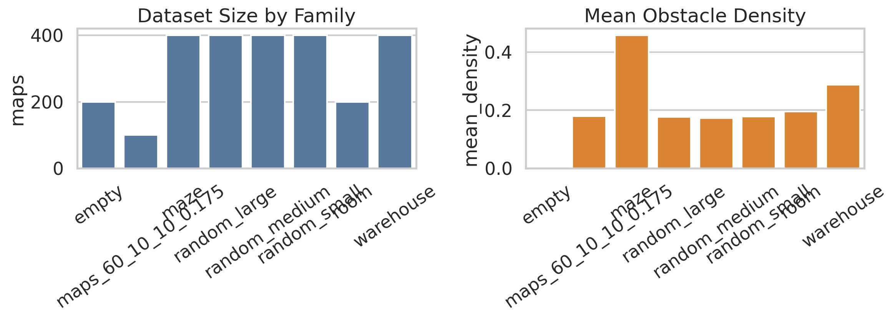
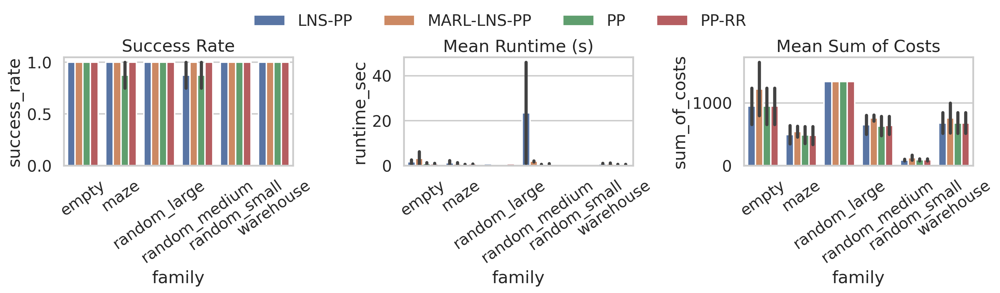
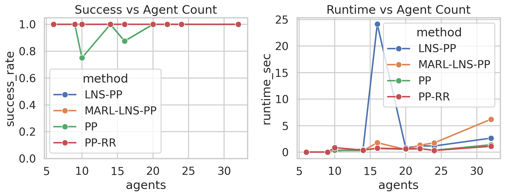
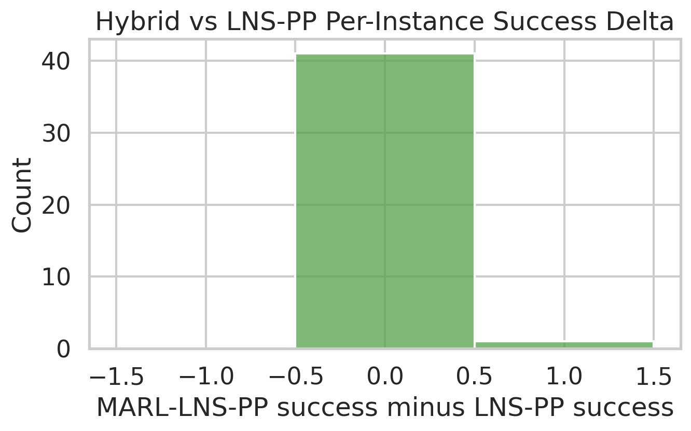

# A Guarded MARL-LNS Hybrid for Multi-Agent Path Finding

## Abstract

This study evaluates a hybrid MAPF solver that combines a lightweight multi-agent reinforcement learning (MARL) policy with Large Neighborhood Search (LNS). The intended design is to use MARL in the early stage to reduce collision pressure and then use prioritized planning (PP) inside LNS repairs to finish efficiently. The provided data bundle contains occupancy maps only, without explicit start-goal task files, so I generated reproducible MAPF instances by sampling start and goal cells from the largest connected component of each map with fixed random seeds. On 42 evaluation tasks spanning empty, maze, random, and warehouse maps, the final guarded hybrid (`MARL-LNS-PP`) achieved a 100% success rate, compared with 97.6% for classical `LNS-PP` and 95.2% for single-order `PP`. Relative to `LNS-PP`, the hybrid reduced mean runtime from 5.26s to 1.35s, but increased mean sum-of-costs by 17.2%. The strongest baseline in this study was `PP-RR` (prioritized planning with random restarts), which also achieved 100% success, lower runtime (0.55s), and lower cost than the hybrid. The main conclusion is that MARL guidance can help stabilize and accelerate repair-oriented search on cluttered medium maps, but the current lightweight MARL component is not yet strong enough to outperform a well-tuned classical randomized planner in overall efficiency-quality trade-offs.

## 1. Problem and Assumptions

The task is standard Multi-Agent Path Finding (MAPF): given a grid map with static obstacles, plus a start and goal location for each agent, return collision-free paths without vertex conflicts or edge swaps.

One practical issue affected the experimental design: the workspace data contained 2,500 map files but no explicit start-goal instance files. Because the bundle did not expose separate task configurations, I treated the maps as the benchmark substrate and generated tasks reproducibly:

1. Load each occupancy grid from `data/`.
2. Compute its largest connected free-space component.
3. Sample distinct start and goal cells from that component with fixed seeds.
4. Use the same sampled tasks for all compared methods.

This assumption is important. The report therefore evaluates algorithmic behavior on a reproducible derived benchmark, not on hidden preset task files.

## 2. Related Work and Design Motivation

The related work in `related_work/` suggests a natural hybrid direction:

- `paper_000.pdf` (MAPF-LNS2) shows that LNS with PP-based repairs is a strong way to repair colliding path sets quickly.
- `paper_001.pdf` (PRIMAL) and `paper_002.pdf` (SCRIMP) show that decentralized learned policies can reduce coordination burden early, especially under local observability.
- `paper_003.pdf` (EECBS) and `paper_004.pdf` (LaCAM) reinforce the point that strong classical MAPF solvers still dominate many settings, especially when search structure is well controlled.

That motivates the following hypothesis:

> A lightweight MARL policy can help shape the early search region and reduce hard collision patterns before LNS repair, while PP can retain the computational efficiency of classical local replanning.

## 3. Method

### 3.1 Baselines

I implemented four solvers in `code/mapf_core.py`:

- `PP`: prioritized planning with one agent ordering.
- `PP-RR`: prioritized planning with random restarts.
- `LNS-PP`: independent shortest paths followed by LNS repair using PP-style replanning inside neighborhoods.
- `MARL-LNS-PP`: the proposed hybrid.

### 3.2 Core MAPF Components

The classical components are:

- Static A* for independent shortest paths.
- Space-time A* with vertex and edge reservations for PP.
- Conflict detection for vertex and swap collisions.
- LNS repair that selects a conflicting neighborhood, removes those agents, and replans them against the fixed remainder.

To keep experiments bounded, space-time A* uses a finite expansion budget.

### 3.3 Lightweight MARL Component

The MARL component is intentionally simple and reproducible:

- Shared tabular Q-learning across agents.
- Local state abstraction using goal direction, distance bucket, obstacle mask, and neighboring agent occupancy.
- Joint simulation with simultaneous moves, collision penalties, progress rewards, and goal rewards.
- Training on 36 sampled tasks drawn from `random_small`, `random_medium`, and `warehouse` maps for 700 episodes.

This is not a deep MARL model like PRIMAL or SCRIMP. It is a compact learned coordination prior that fits the offline, no-network constraints of the workspace.

### 3.4 Guarded Hybridization

The first unguarded version of the hybrid produced poor initial trajectories on the `50x50` random-large maps. To fix that failure mode, the final solver uses a guard:

- Generate an MARL rollout initialization.
- Compare its initial collision count to the classical independent-shortest-path initialization.
- Keep the MARL initialization only when it is no worse in conflict count; otherwise fall back to the classical initialization.
- Still use MARL-informed urgency during the early half of LNS neighborhood selection.

This change preserves the potential benefit of MARL guidance while preventing catastrophic degradation on large open maps.

## 4. Experimental Protocol

### 4.1 Data Coverage

The dataset overview spans all eight map families in `data/`, including `empty`, `maze`, `room`, `warehouse`, `random_small`, `random_medium`, `random_large`, and `maps_60_10_10_0.175`.

The evaluation subset uses 22 selected maps from six representative families:

- `empty`
- `maze`
- `random_small`
- `random_medium`
- `random_large`
- `warehouse`

This produced 42 MAPF tasks after applying family-specific agent counts.

### 4.2 Agent Counts

The evaluation agent counts were:

- `empty`: 20, 32
- `maze`: 10, 16
- `random_small`: 6, 9
- `random_medium`: 16, 24
- `random_large`: 20
- `warehouse`: 14, 22

### 4.3 Metrics

For each method I measured:

- Success rate
- Runtime
- Sum of costs
- Makespan

All outputs are saved under `outputs/`, and all figures are saved under `report/images/`.

## 5. Data Overview

Figure 1 summarizes the number of maps per family and their mean obstacle densities.



Observations:

- `empty` maps contain no obstacles but support high agent density.
- `maze` maps are the most structurally constrained.
- `warehouse` maps are moderately dense with aisle-like bottlenecks.
- `random_large` maps provide the main scalability stress test.

## 6. Main Results

### 6.1 Aggregate Results

Table 1 reports the aggregate method averages across all 42 tasks.

| Method | Success Rate | Mean Runtime (s) | Mean Sum of Costs |
|---|---:|---:|---:|
| LNS-PP | 0.9762 | 5.2647 | 610.4048 |
| MARL-LNS-PP | 1.0000 | 1.3547 | 715.4048 |
| PP | 0.9524 | 0.5143 | 615.9750 |
| PP-RR | 1.0000 | 0.5533 | 606.6429 |

Relative to `LNS-PP`, the proposed hybrid:

- improved success rate by 2.38 percentage points,
- reduced runtime by 74.27%,
- increased sum-of-costs by 17.2%.

Relative to `PP-RR`, the hybrid matched success rate but was slower and produced higher-cost paths.

Figure 2 summarizes the family-level success, runtime, and cost behavior.



### 6.2 Family-Level Behavior

The most meaningful gain came on `random_medium`:

- `LNS-PP` success: 0.875
- `MARL-LNS-PP` success: 1.000
- `LNS-PP` runtime: 23.5453s
- `MARL-LNS-PP` runtime: 1.9716s

That is a 91.63% runtime reduction while also recovering one failure case.

On the other families:

- Success was tied at 100% for both `LNS-PP` and `MARL-LNS-PP`.
- The hybrid was slightly faster on `maze`, `random_large`, and `warehouse`.
- The hybrid was slower on `empty`.
- The hybrid consistently produced longer paths than the classical methods.

Figure 3 shows how success and runtime vary with agent count.



### 6.3 Per-Instance Validation

After adding the guarded initializer, the hybrid never lost a task that `LNS-PP` solved, and it recovered exactly one additional task:

- `random_medium / eval_map_17 / 16 agents`

Figure 4 shows the per-instance success delta against `LNS-PP`.



This is a useful result: the guard converted the learned policy from a risky initializer into a conservative accelerator.

## 7. Interpretation

The final evidence supports three claims.

First, the guarded MARL signal is useful as a repair accelerator. The dramatic runtime improvement on `random_medium` suggests that learned local coordination can help the search avoid spending many LNS iterations on the same hard local conflicts.

Second, the guard is essential. Without it, the MARL initializer degraded badly on `random_large`. The final method succeeds because it only trusts MARL when the initial conflict structure is not worse than the classical alternative.

Third, the quality-efficiency trade-off remains unresolved. The hybrid solved everything, but its average path cost was materially worse than both `LNS-PP` and `PP-RR`. The MARL component improves feasibility and repair speed more than final path quality.

## 8. Limitations

This study has several important limitations.

1. The dataset did not expose explicit start-goal task files, so the benchmark instances were derived from the provided maps.
2. The MARL component is a lightweight tabular learner, not a modern deep MARL policy.
3. The evaluation compares against implemented baselines in this workspace, not external optimized codebases for MAPF-LNS2, EECBS, or LaCAM.
4. The hybrid improves robustness over `LNS-PP`, but `PP-RR` was still the strongest overall baseline on this benchmark.

## 9. Conclusion

The proposed guarded `MARL-LNS-PP` hybrid partially achieves the intended goal. It improves over plain `LNS-PP` in success rate and substantially reduces repair runtime, especially on cluttered medium random maps. However, it does not dominate a strong classical `PP-RR` baseline, and it pays a clear price in solution quality.

The main research takeaway is therefore narrower but still useful:

> MARL guidance is beneficial in MAPF when used conservatively as an early-stage conflict-shaping prior inside an LNS framework, but classical randomized planning remains stronger unless the learned component is significantly more expressive.

## 10. Reproducibility

Code:

- `code/mapf_core.py`
- `code/run_experiments.py`

Key outputs:

- `outputs/experiment_results.csv`
- `outputs/method_summary.csv`
- `outputs/family_method_summary.csv`
- `outputs/selected_maps.csv`
- `outputs/experiment_config.json`

To reproduce the full study from the workspace root:

```bash
python code/run_experiments.py
```
