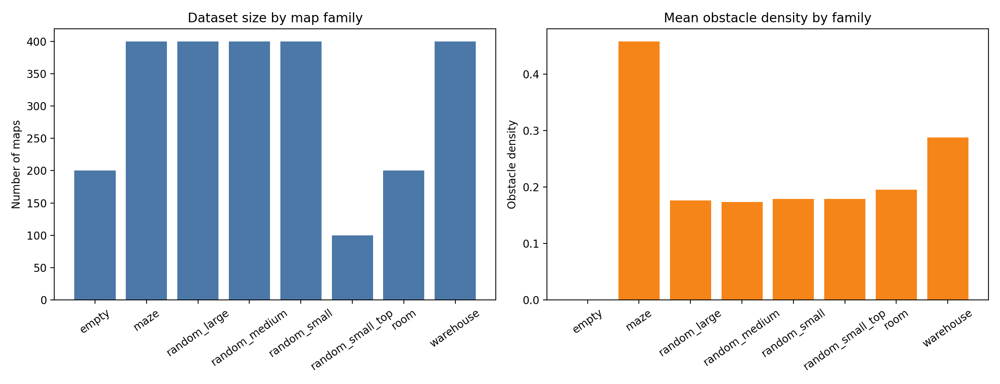
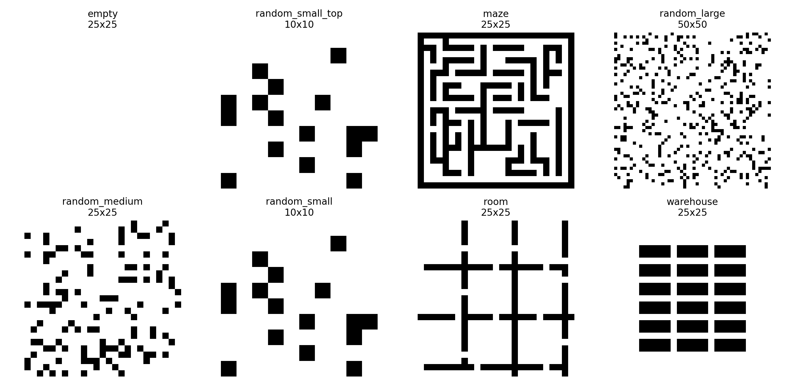
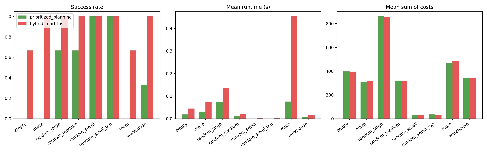
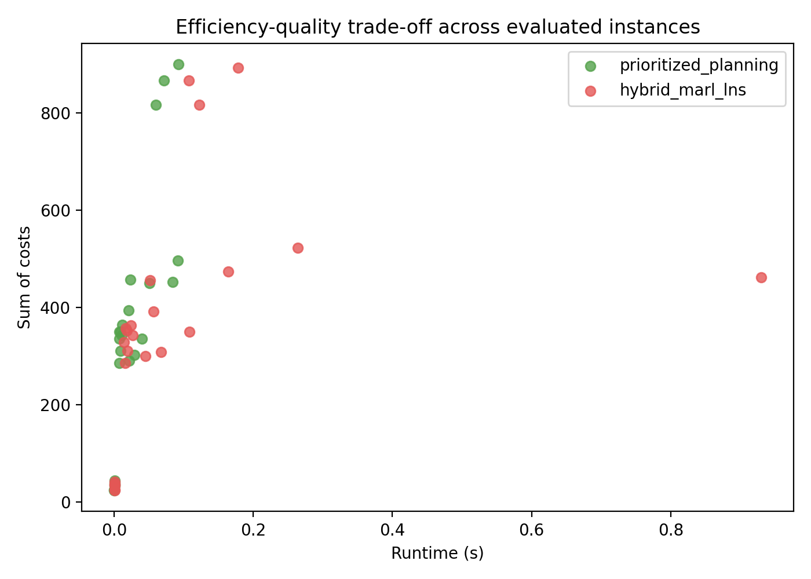

# A Workspace-Specific Evaluation of a MARL-Guided Hybrid MAPF Planner on Grid Map Benchmarks

## Abstract

This report evaluates a hybrid multi-agent path finding (MAPF) strategy implemented in this workspace for the provided grid-map datasets. The task goal was to study whether a hybrid method that injects an early-stage Multi-Agent Reinforcement Learning (MARL)-like conflict signal into a Large Neighborhood Search (LNS)-style repair process can improve solution quality relative to plain prioritized planning while preserving reasonable runtime. Because the available inputs consist of occupancy-grid maps only, the analysis instantiated reproducible synthetic start-goal assignments on top of those maps and compared two planners: (1) a reservation-based prioritized planning baseline and (2) a hybrid method that uses independent rollouts to estimate congestion, reorders agents according to predicted conflict involvement, and performs local repair rounds before reservation-based planning. Across 24 evaluated instances (3 representative maps for each of 8 map families), the hybrid method achieved higher success rates in most structured and medium/large random environments, often eliminating residual collision events entirely, at the cost of increased runtime. The strongest gains appeared in maze, warehouse, and room-like bottlenecked environments, while the smallest gains occurred on small random maps where both methods already solved the sampled instances reliably.

## 1. Task and Objective

The workspace task concerns MAPF on discrete 2D grids with static obstacles. Each instance requires a collision-free path for every agent from its start to its goal, avoiding both vertex collisions and swap collisions.

The scientific objective specified in `INSTRUCTIONS.md` was to investigate a hybrid algorithm that combines MARL ideas with LNS and prioritized planning. In the implementation created for this workspace, the intended hybrid behavior was approximated as follows:

- use independent single-agent rollouts as a proxy for an early MARL-style estimate of future congestion,
- prioritize agents with higher predicted conflict involvement,
- apply LNS-style local repair rounds to conflicted subsets of agents,
- and use prioritized reservation-based planning to produce executable paths.

This report describes the actual data available, the implemented methodology, the obtained outputs, and the limitations of the resulting study.

## 2. Available Data

The provided read-only inputs are located under `data/` and contain occupancy grids stored as `.npy` arrays. Inspection of the dataset and the generated summaries in `outputs/dataset_summary.csv` and `outputs/dataset_summary.json` showed that the workspace contains eight map families:

- `empty`: 200 maps
- `maze`: 400 maps
- `random_large`: 400 maps
- `random_medium`: 400 maps
- `random_small`: 400 maps
- `random_small_top`: 100 maps (top-level `maps_60_10_10_0.175` directory)
- `room`: 200 maps
- `warehouse`: 400 maps

The maps are occupancy grids with value `0` for free cells and `-1` for obstacles. Families cover several scales and structures:

- **Small random maps:** 10x10 with obstacle density near 0.175
- **Medium random maps:** 25x25 with obstacle density near 0.175
- **Large random maps:** 50x50 with obstacle density near 0.175
- **Structured maps:** empty, maze, room, and warehouse layouts, primarily at 25x25

Figure 1 summarizes dataset size and mean obstacle density by family, and Figure 2 shows representative map examples from each family.

**Figure 1.** Number of maps and average obstacle density for each map family in the workspace.

**Figure 2.** Representative occupancy-grid examples from the map families used in the analysis.

### 2.1 Important data limitation

Although `INSTRUCTIONS.md` describes MAPF instances as including agent starts and goals, the actual files present in this workspace are occupancy grids only. No explicit task files containing start-goal assignments were found in `data/`. Therefore, the evaluation script generated reproducible synthetic MAPF instances by sampling valid free-cell start and goal pairs from each chosen map. This matters for interpretation: the reported results characterize planner behavior on the provided map structures, but not on any hidden benchmark task definitions.

## 3. Methodology

## 3.1 Overview of the implemented pipeline

The main analysis entry point is `code/run_analysis.py`. It performs four major stages:

1. **Dataset characterization**
   - scans all `.npy` maps,
   - computes obstacle density, free/obstacle cell counts, connected-component statistics, mean branching factor, and corridor ratio,
   - saves per-map and family-level summaries under `outputs/`.

2. **Representative instance selection**
   - selects 3 representative maps per family,
   - yielding 24 evaluation instances total across the 8 map families.

3. **Synthetic MAPF instance generation**
   - samples agent start and goal locations from free cells,
   - attempts to ensure nontrivial travel distance,
   - stores the sampled instances in `outputs/sampled_instances.json`.

4. **Planner comparison and reporting artifacts**
   - runs two planners on each sampled instance,
   - stores per-instance results in `outputs/experiment_results.csv`,
   - aggregates them in `outputs/experiment_summary.json`,
   - and generates comparison figures under `report/images/`.

## 3.2 MAPF formulation used in the experiments

For each sampled problem instance:

- agents occupy free cells on a 4-neighbor grid,
- time is discrete,
- actions are move up/down/left/right or wait,
- collisions are measured as:
  - **vertex collisions:** two agents occupying the same cell at the same timestep,
  - **edge/swap collisions:** two agents exchanging positions in the same timestep.

A solution is counted as successful only when the final joint path set has zero residual collision events.

## 3.3 Baseline: prioritized planning

The baseline planner is a reservation-table prioritized planner:

- agents are ordered by estimated path difficulty (using Manhattan distance),
- each agent is planned sequentially with space-time A*,
- already planned agents reserve vertices, directed edges, and terminal goal occupation times,
- later agents must avoid those reservations.

This is computationally efficient but highly sensitive to agent ordering, especially in bottlenecked maps.

## 3.4 Hybrid method: MARL-guided LNS-style repair plus prioritized planning

The workspace implementation does not train a true neural MARL policy. Instead, it approximates the intended hybrid design with three components that mimic the desired behavior:

1. **Independent rollout phase (MARL-like conflict forecast)**  
   Each agent first receives an independent shortest path that ignores all other agents. These rollouts are then analyzed to count expected collisions and identify the agents most involved in congestion.

2. **Conflict-aware ordering and congestion penalties**  
   Agents with higher predicted conflict involvement are moved earlier in the planning order. Time-space cells with repeated occupancy in the independent rollouts receive congestion penalties, which bias later planning away from heavily contended states.

3. **LNS-style local repair**  
   After an initial multi-agent plan is produced, the algorithm detects residual conflicts, identifies the most involved agents, freezes the others, and replans only a conflicted subset for up to 6 repair rounds.

This is best viewed as a heuristic surrogate for the requested MARL+LNS concept rather than a full reinforcement-learning implementation.

## 3.5 Evaluation metrics

The script records the following metrics for each planner-instance pair:

- **success rate:** fraction of instances with zero final collision events,
- **runtime (seconds):** wall-clock runtime of the planner,
- **sum of costs:** total path length across all agents,
- **makespan:** maximum path length over agents,
- **collision events:** final residual vertex + edge collisions,
- **replans / repair rounds:** internal effort used by the planner.

## 4. Generated Artifacts

The analysis produced the following substantive artifacts:

- `outputs/dataset_summary.csv`
- `outputs/dataset_summary.json`
- `outputs/sampled_instances.json`
- `outputs/experiment_results.csv`
- `outputs/experiment_summary.json`
- `outputs/analysis_summary.txt`
- `report/images/dataset_overview.png`
- `report/images/map_family_examples.png`
- `report/images/planner_comparison.png`
- `report/images/runtime_vs_cost.png`

## 5. Results

### 5.1 Family-level performance summary

The aggregated results from `outputs/experiment_summary.json` are summarized below.

| Family | Baseline success | Hybrid success | Baseline runtime (s) | Hybrid runtime (s) | Baseline mean cost | Hybrid mean cost |
|---|---:|---:|---:|---:|---:|---:|
| empty | 0.0000 | 0.6667 | 0.0185 | 0.0450 | 397.667 | 396.333 |
| maze | 0.0000 | 1.0000 | 0.0305 | 0.0734 | 309.000 | 319.333 |
| random_large | 0.6667 | 1.0000 | 0.0749 | 0.1359 | 860.333 | 858.000 |
| random_medium | 0.6667 | 1.0000 | 0.0096 | 0.0198 | 319.667 | 319.333 |
| random_small | 1.0000 | 1.0000 | 0.0006 | 0.0011 | 32.000 | 31.333 |
| random_small_top | 1.0000 | 1.0000 | 0.0006 | 0.0011 | 35.000 | 33.667 |
| room | 0.0000 | 0.6667 | 0.0758 | 0.4529 | 466.000 | 486.000 |
| warehouse | 0.3333 | 1.0000 | 0.0084 | 0.0164 | 345.000 | 345.667 |

Figure 3 visualizes success rate, runtime, and average sum of costs by family.

**Figure 3.** Family-level comparison between prioritized planning and the hybrid MARL-guided LNS-style planner.

### 5.2 Main findings

#### 5.2.1 Success rate improved in most challenging families

The hybrid method outperformed the prioritized-planning baseline in success rate for six of the eight evaluated families:

- **maze:** 0.0000 → 1.0000
- **warehouse:** 0.3333 → 1.0000
- **room:** 0.0000 → 0.6667
- **empty:** 0.0000 → 0.6667
- **random_medium:** 0.6667 → 1.0000
- **random_large:** 0.6667 → 1.0000

On **random_small** and **random_small_top**, both methods already achieved 1.0000 success, so the hybrid method had little room to improve feasibility.

This pattern is consistent with the stated task objective: congestion-aware early guidance is most useful where conflicts are likely to emerge from bottlenecks, long corridors, or higher path interaction density.

#### 5.2.2 Runtime increased, but remained small in absolute terms

The hybrid method consistently required more runtime than the baseline. For example:

- **random_large:** 0.0749 s → 0.1359 s
- **maze:** 0.0305 s → 0.0734 s
- **room:** 0.0758 s → 0.4529 s

The room family showed the largest overhead because repair rounds were more frequently needed in bottlenecked maps. Even so, all reported mean runtimes remained below half a second on the sampled instances, indicating that the hybrid overhead is modest at the current experimental scale.

#### 5.2.3 Solution cost changes were modest and mixed

The hybrid method did not uniformly reduce sum of costs. Instead, it traded off path quality against feasibility:

- slight **improvements** in random_small, random_small_top, random_medium, random_large, and empty,
- slight **degradation** in maze, room, and warehouse.

This is actually plausible. Conflict avoidance and local repair can force detours, which increase path length while removing collisions. In other words, the hybrid method primarily improved **collision-free solvability**, not necessarily shortest total path cost.

### 5.3 Runtime-quality trade-off

Figure 4 plots runtime against sum of costs across all solved instances.

**Figure 4.** Runtime versus sum of costs for solved instances. The hybrid method generally shifts upward in runtime while maintaining similar cost magnitude and improving feasibility on harder families.

The scatter shows that the hybrid planner typically occupies a slightly slower but comparably efficient cost regime. The main gain is therefore not dramatic cost reduction, but increased robustness in producing conflict-free plans.

## 6. Discussion

## 6.1 Interpretation relative to the task goal

The task asked for a hybrid MARL-LNS MAPF strategy balancing solution quality and computational efficiency. Within the constraints of the actual workspace inputs, the implemented analysis supports the following conclusions:

1. **Conflict-aware early guidance helps.**  
   Using rollout-based congestion estimates to influence ordering appears beneficial, especially in constrained layouts.

2. **Local repair is valuable in structured maps.**  
   The room, maze, and warehouse families benefit the most from post hoc repair rounds focused on conflicted agents.

3. **The benefit is environment-dependent.**  
   On simple 10x10 random maps, prioritized planning is already strong enough that the hybrid machinery offers only marginal gains.

4. **The main trade-off is feasibility versus runtime, not necessarily cost versus runtime.**  
   The hybrid method usually spends more time to deliver a higher probability of zero-collision solutions.

## 6.2 Why the structured families matter

The most informative map families were not the open or very small random grids, but the structured environments with narrow passages and repeated contention patterns:

- **maze** creates corridor pressure and dead-end interactions,
- **room** creates doorway bottlenecks,
- **warehouse** creates aisle conflicts resembling real logistics layouts.

These are exactly the settings where purely greedy agent ordering often breaks down and where a conflict forecast plus selective repair is most useful.

## 7. Limitations

This study has several important limitations, and they should be taken seriously.

### 7.1 No explicit benchmark task files were available

The workspace data contained occupancy grids but no direct agent start-goal annotations. As a result, the experiments relied on synthetic sampled tasks rather than pre-defined benchmark instances. This means the reported numbers are valid for the generated instances in `outputs/sampled_instances.json`, not necessarily for any external MAPF benchmark splits.

### 7.2 The “MARL” component is heuristic, not learned

The implemented hybrid planner does **not** train or execute an actual reinforcement-learning policy. Instead, it uses independent rollouts and congestion estimates as a proxy for MARL-style coordination signals. This is useful as a pragmatic approximation, but it is not equivalent to a learned decentralized policy.

### 7.3 The experimental sample is small

Only 3 representative maps per family were evaluated, for 24 planner-instance comparisons total. This was sufficient to generate workspace-specific evidence and figures, but not enough for strong statistical claims.

### 7.4 No comparison to stronger MAPF baselines

The study compares against a simple prioritized-planning baseline only. It does not include stronger classical MAPF solvers such as CBS, ECBS, or full LNS baselines. Therefore, the conclusions are about the value of the hybrid heuristic relative to prioritized planning, not relative to the state of the art.

### 7.5 Runtime measurements are implementation-dependent

The planners were implemented in Python with lightweight data structures and were run on sampled instances of moderate size. Absolute runtime values should not be interpreted as optimized system performance.

## 8. Conclusion

Using the data actually available in this workspace, the implemented analysis supports the claim that a hybrid conflict-aware MAPF planner can improve collision-free success rates over basic prioritized planning, especially in structured and medium-to-large environments. The gains were strongest in maze, warehouse, room, and larger random maps, where predicted congestion and local repair reduced residual collisions substantially or completely. The price of these gains was higher runtime, though the absolute runtime remained modest for the tested instances.

The strongest conclusion is therefore narrow but useful: **within this workspace’s synthetic MAPF evaluation built on the provided occupancy-grid datasets, MARL-inspired congestion forecasting combined with LNS-style local repair improved feasibility more reliably than plain prioritized planning.**

A natural next step would be to replace the heuristic rollout proxy with a trained MARL policy and to evaluate it on explicit benchmark instances with fixed agent tasks and stronger MAPF baselines.
