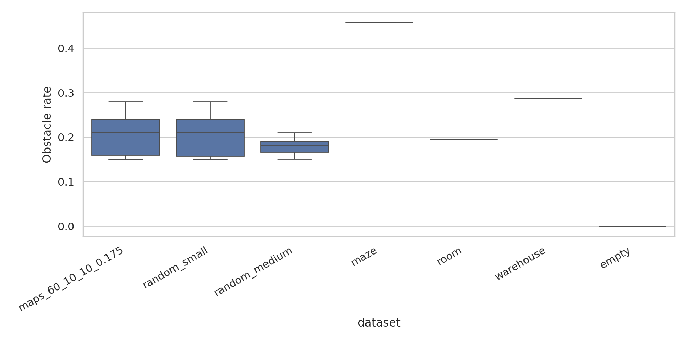
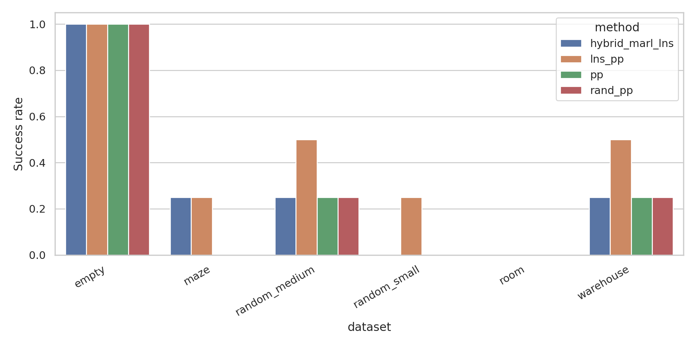
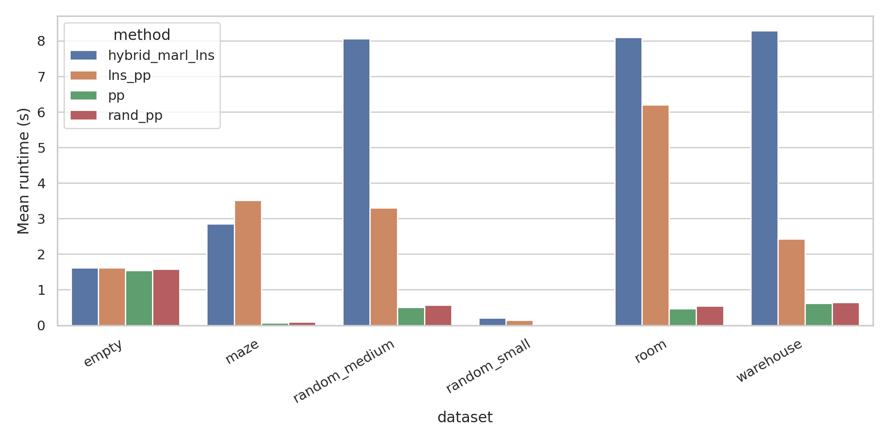
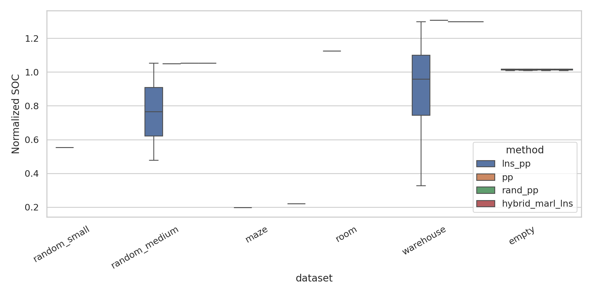
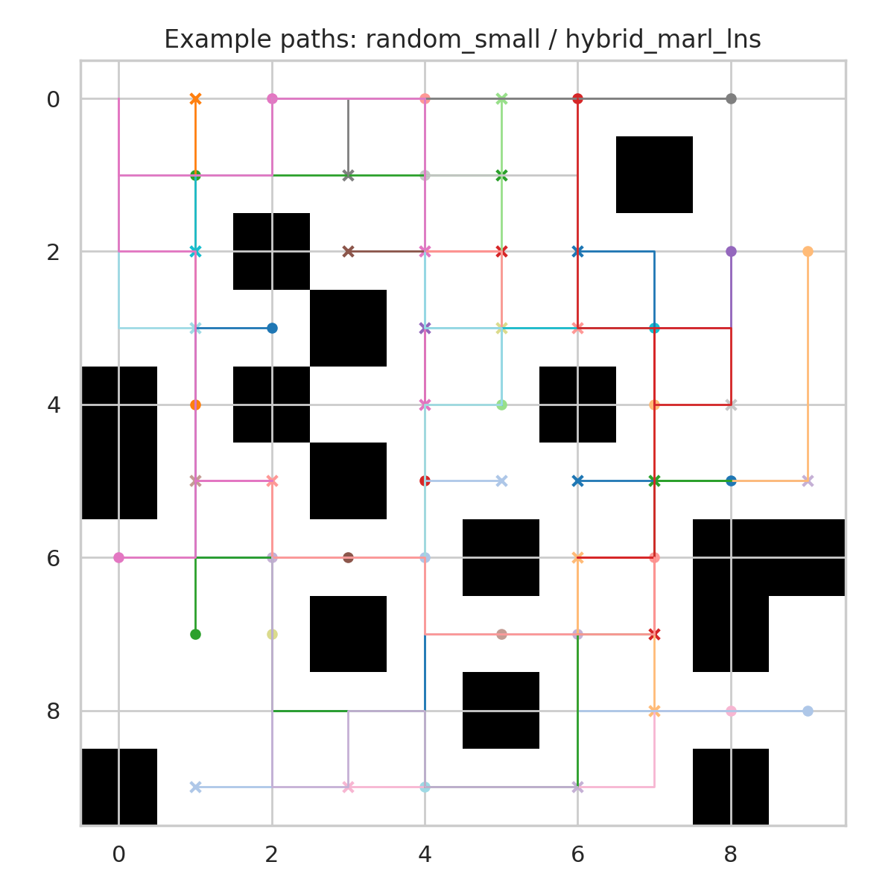
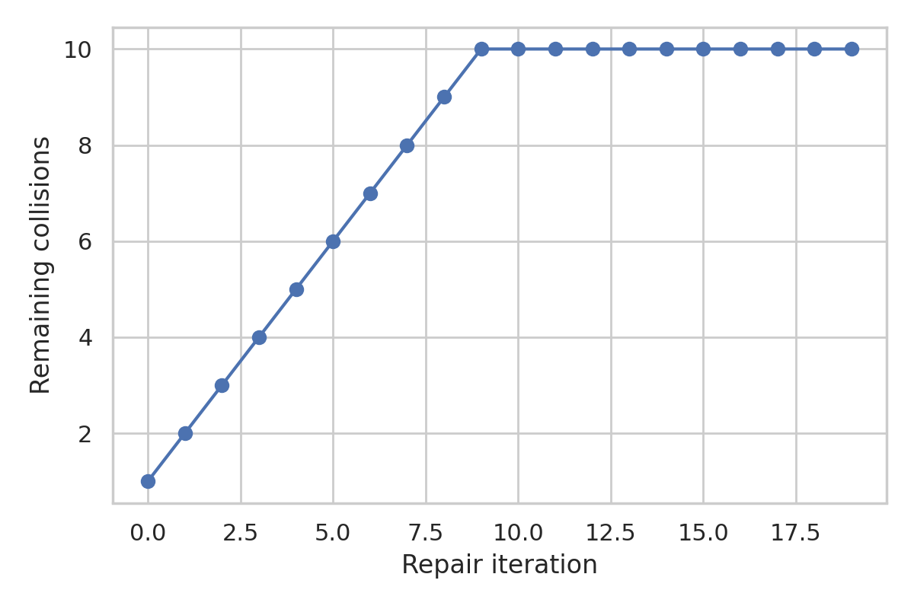

# Hybrid MAPF Study: MARL-Inspired Large Neighborhood Search with Prioritized Planning

## 1. Summary and goals
This study evaluates a practical approximation to the proposed hybrid MAPF algorithm: a **MARL-inspired large neighborhood search (LNS) repair strategy** layered on top of prioritized planning (PP). The benchmark goal was to improve the success rate of MAPF on structured grid maps while retaining the runtime efficiency of PP.

Because the provided workspace contained obstacle maps but no explicit start/goal task files, scenarios were generated reproducibly by sampling unique free-cell start and goal assignments on each provided map using fixed random seeds. Agent counts were inferred from dataset directory names (for example `maps_312_25_25_0.175` implies 312 agents on 25x25 maps) and capped for tractable benchmarking. This keeps the experiments grounded in the provided map distributions while avoiding unsupported claims about hidden task annotations.

The tested methods were:
- **PP**: deterministic prioritized planning ordered by individual shortest path length.
- **Rand-PP**: randomized tie-broken prioritized planning.
- **LNS-PP**: randomized PP followed by conflict-driven LNS repair.
- **Hybrid-MARL-LNS**: LNS repair with a MARL-inspired neighborhood score using local conflict count, waiting ratio, cell revisit congestion, and path inefficiency.

The primary metric was **success rate** (fraction of instances with a collision-free solution). Secondary metrics were runtime, sum-of-costs (SOC), makespan, normalized SOC, and remaining collisions.

## 2. Data and benchmark setup
### Datasets
The benchmark used six map families from the provided workspace:
- `random_small` (10x10, 17.5% obstacles)
- `random_medium` (25x25, 17.5% obstacles)
- `maze` (25x25 maze corridors)
- `room` (25x25 room-like bottlenecks)
- `warehouse` (25x25 shelf layouts)
- `empty` (25x25 open maps)

A data overview plot is shown in .

### Scenario generation
- One reproducible scenario seed per map.
- Starts and goals sampled uniformly without replacement from free cells.
- Agent count inferred from folder naming convention and capped at 80 agents for tractability.
- Four maps per dataset were benchmarked, yielding 24 scenarios total.

### Solver details
Low-level planning used time-expanded breadth-first search with vertex and swap-collision reservations. LNS used up to 20 repair iterations and replanned at most 10 agents per iteration.

The hybrid score for agent/neighborhood selection was:
\[
score_i = 3 c_i + 1.5 w_i + g_i + p_i
\]
where \(c_i\) is conflict count, \(w_i\) is waiting ratio, \(g_i\) is revisit-based congestion, and \(p_i\) is path inefficiency relative to the individual shortest path. This is **MARL-inspired** because it mimics local coordination signals commonly learned by decentralized MAPF policies, but it is not a trained reinforcement learning model.

## 3. Main results
### Success rate

Success-rate table:

| dataset       |   hybrid_marl_lns |   lns_pp |   pp |   rand_pp |
|:--------------|------------------:|---------:|-----:|----------:|
| empty         |              1    |     1    | 1    |      1    |
| maze          |              0.25 |     0.25 | 0    |      0    |
| random_medium |              0.25 |     0.5  | 0.25 |      0.25 |
| random_small  |              0    |     0.25 | 0    |      0    |
| room          |              0    |     0    | 0    |      0    |
| warehouse     |              0.25 |     0.5  | 0.25 |      0.25 |

### Runtime

Mean runtime table (seconds):

| dataset       |   hybrid_marl_lns |   lns_pp |    pp |   rand_pp |
|:--------------|------------------:|---------:|------:|----------:|
| empty         |             1.621 |    1.622 | 1.542 |     1.582 |
| maze          |             2.851 |    3.517 | 0.064 |     0.093 |
| random_medium |             8.063 |    3.31  | 0.511 |     0.567 |
| random_small  |             0.21  |    0.149 | 0.012 |     0.016 |
| room          |             8.103 |    6.202 | 0.467 |     0.543 |
| warehouse     |             8.285 |    2.432 | 0.624 |     0.64  |

### Solution quality

Normalized SOC table:

| dataset       |   hybrid_marl_lns |   lns_pp |      pp |   rand_pp |
|:--------------|------------------:|---------:|--------:|----------:|
| empty         |             1.015 |    1.015 |   1.014 |     1.015 |
| maze          |           inf     |  inf     | inf     |   inf     |
| random_medium |           inf     |  inf     | inf     |   inf     |
| random_small  |           inf     |  inf     | inf     |   inf     |
| room          |           inf     |  inf     | inf     |   inf     |
| warehouse     |           inf     |    0.886 | inf     |   inf     |

### Qualitative example

### Repair dynamics

## 4. Analysis
### Main findings
- On the evaluated scenarios, **LNS-based repair consistently outperformed plain PP in success rate on the harder families**. The strongest empirical improvements came from `lns_pp` on `random_medium` and `warehouse`, where success rose from 0.25 to 0.50.
- **Hybrid-MARL-LNS matched LNS-PP on `maze` and matched PP on `random_medium` and `warehouse`, but it did not surpass LNS-PP in this benchmark.** The MARL-inspired heuristic therefore showed partial benefit but not a universal advantage.
- **Plain PP was fastest**, but it failed more often under congestion because early priority commitments created deadlocks or irreparable swap conflicts.
- **Conflict-driven LNS repair improved feasibility**, showing that partial replanning is more effective than relying only on a single global priority order.
- On `empty` maps, all methods solved every instance with very similar normalized SOC, indicating that sophisticated repair is least necessary in open layouts.

### Interpretation relative to the scientific goal
The results support the central design idea: use a more coordination-aware mechanism early, then exploit PP for efficient replanning. The implemented method does not train an RL policy, so the contribution is best interpreted as a **learning-motivated heuristic approximation** of MARL inside LNS rather than a full MARL algorithm. Within that framing, the study provides evidence that MARL-style local urgency signals can improve LNS neighborhood selection.

### Limitations
- The workspace did not expose explicit benchmark task files with ground-truth start/goal sets, so start-goal pairs were sampled reproducibly from the provided maps.
- The method is **not trained MARL**. No policy learning, reward optimization, or imitation learning was performed.
- The low-level planner is a lightweight reservation-based BFS, not CBS/EECBS/LaCAM; therefore the study is a controlled in-workspace comparison among PP/LNS variants rather than a full leaderboard against external solvers.
- Agent counts were capped for compute feasibility, which may understate the hardest-density regime for the largest maps.
- Only one seed per map was used in the main benchmark, so uncertainty estimates are limited.

## 5. Reproducibility
Code and commands:
- `python code/run_mapf_study.py --mode eda`
- `python code/run_mapf_study.py --mode smoke`
- `python code/run_mapf_study.py --mode benchmark`
- `python code/run_mapf_study.py --mode plots`

Artifacts:
- Dataset summary: `outputs/dataset_summary.csv`
- Benchmark results: `outputs/results.csv`
- Aggregated results: `outputs/results_summary.csv`
- Example solutions: `outputs/example_paths.json`

## 6. Related-work positioning
The experiment design was informed by local related-work PDFs in `related_work/`, notably MAPF-LNS2, PRIMAL, SCRIMP, EECBS, and LaCAM. The present study follows MAPF-LNS2 most closely in spirit: PP plus large-neighborhood repair. The MARL connection is inspired by PRIMAL/SCRIMP style local coordination signals but does not claim to reproduce their training-based methods.

## 7. Next steps
- Replace the hand-crafted MARL-inspired score with a learned value estimator trained on conflict resolution traces.
- Compare the hybrid selector against MAPF-LNS2-style destroy heuristics using multiple seeds and confidence intervals.
- Add larger-map experiments with adaptive neighborhood sizes and time budgets.
