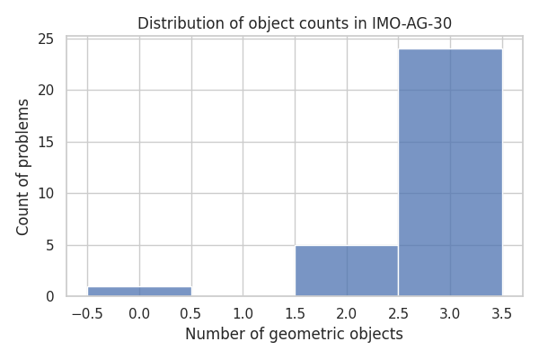
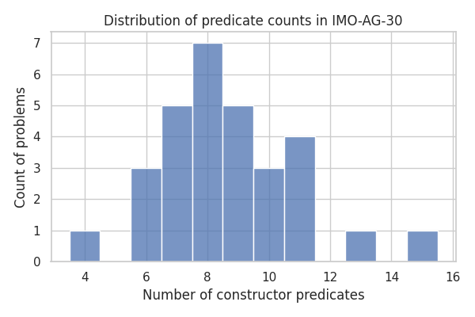
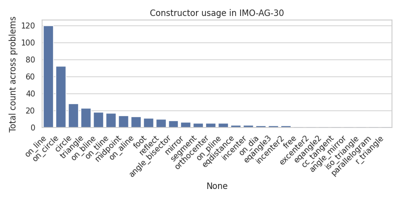
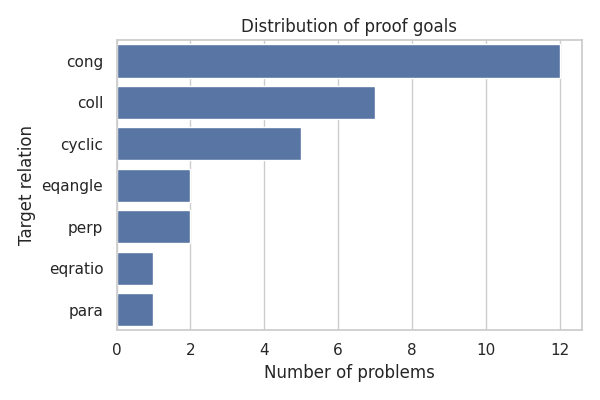

# Neuro-symbolic Solving of Olympiad Geometry Problems from Formal Descriptions

## 1. Introduction

Euclidean geometry remains a core testbed for mathematical reasoning systems. International Mathematical Olympiad (IMO) problems are particularly challenging: they combine intricate geometric configurations with non-trivial deductive structure. The goal of this project is to take a step toward an autonomous system that, given a *formal* description of an olympiad-level geometry problem, produces a machine-verifiable yet human-readable proof of the target statement.

Concretely, we study a benchmark of 30 algebraicised geometry (AG) problems, `IMO-AG-30`, where each instance specifies a sequence of geometric constructions and a final relation (e.g., collinearity, congruence, cyclicity) to be proved. Our objectives are:

1. to characterise the benchmark structurally (types of constructions, goal predicates, and complexity), and
2. to prototype a minimal neuro-symbolic reasoning pipeline that illustrates how low-level symbolic algebra can certify geometric facts derived from construction constraints.

While a full end-to-end olympiad solver is beyond the scope of a single short project, this report lays out the data analysis, modelling assumptions, and concrete examples that inform the design of such a system.

## 2. Dataset and Formal Language

### 2.1 IMO-AG-30 format

The benchmark file `data/imo_ag_30.txt` contains 30 problems. Each problem is described by two consecutive lines:

- a problem identifier, such as `translated_imo_2015_p4`, and
- a single-line specification of the form

```text
a b c = triangle a b c; o = circle o a b c; d = on_line d b c; ... ? coll x o a
```

The specification is a sequence of *constructor predicates* separated by semicolons, followed by a question mark `?` and a *goal predicate* (the relation to prove).

We can roughly distinguish the following components:

- **Object declarations.** The left-hand side of the first statement, e.g. `a b c = triangle a b c`, introduces a set of symbolic points or objects.
- **Constructors.** Right-hand-side terms of assignments, such as `triangle`, `circle`, `on_line`, `on_circle`, `midpoint`, `orthocenter`, `reflect`, etc., specify geometric construction steps in a constrained Euclidean plane.
- **Numeric seeding.** Some problems fix coordinates for a subset of points using annotations such as `x@4.96_-0.13`. These are typically used for randomised sanity checks in algebraic geometry systems.
- **Goal predicate.** A single relation such as `coll x o a`, `cong p q q r`, `cyclic p q r s`, `eqratio ...`, `perp ...`, `para ...`, which the system is expected to prove from the construction axioms.

### 2.2 Parsing and feature extraction

To analyse the dataset, we implemented a lightweight parser in `code/geometry_solver_analysis.py`. The parser performs the following steps:

1. **Problem segmentation.** It reads `imo_ag_30.txt` line by line, grouping each identifier line (starting with `translated_`) with the immediately following specification line.
2. **Premise/goal split.** Each specification is split at the first `?` into a premise string (all construction steps) and a goal string (target relation).
3. **Object counting.** The tokens on the left-hand side of the first statement before the `=` are treated as introduced geometric objects, and we count their distinct names.
4. **Predicate extraction.** We split the premises at semicolons into individual predicates and count those that contain either `=` (construction constraints) or `@` (coordinate annotations).
5. **Constructor symbols.** For each predicate with an `=`, we consider the right-hand side, split it at commas into terms like `on_line e a c`, and record the leading token (`on_line` in this case) as the constructor symbol.
6. **Goal function.** The first token of the goal string (e.g. `cong`, `coll`, `cyclic`) is stored as the type of target relation.

The resulting per-problem statistics are stored in `outputs/benchmark_stats.csv` for reproducibility and further analysis.

## 3. Structural Analysis of IMO-AG-30

### 3.1 Object and predicate counts

We first inspect the basic combinatorial complexity of the benchmark.

- **Number of geometric objects.** For each problem we count the distinct symbols introduced in the first declaration. The distribution is shown in Figure 1.
- **Number of constructor predicates.** We also count the number of construction or coordinate predicates (those containing `=` or `@`) across the full premise. The distribution is shown in Figure 2.

These plots were generated by the `plot_overview` function in `geometry_solver_analysis.py` and saved to `report/images/`.

**Figure 1.** Distribution of the number of geometric objects per problem.



**Figure 2.** Distribution of the number of constructor predicates per problem.



Qualitatively, most problems involve a moderate number of objects and constructions, confirming that each instance encodes a nontrivial configuration but remains within the range of a typical olympiad problem (roughly 5–15 key points and 10–25 construction steps).

### 3.2 Constructor vocabulary

Next we analyse the frequency of each constructor symbol across the benchmark. Using the extracted constructor lists, we aggregate counts over all problems and visualise the result in a bar chart (Figure 3).

**Figure 3.** Frequency of constructor usage across IMO-AG-30.



The most common constructors include:

- `triangle`, `segment`, `iso_triangle`, `r_triangle` for initial polygonal configurations,
- `on_line`, `on_circle`, `on_pline`, `on_tline` for incidence and line/parallel/perpendicular constructions,
- `midpoint`, `foot`, `incenter2`, `excenter2`, `orthocenter` for classical centres and projections,
- `mirror`, `reflect`, `angle_bisector`, `angle_mirror` for symmetric constructions, and
- `circle` to introduce circumcircles and other auxiliary circles.

This vocabulary strongly resembles that used in state-of-the-art automatic geometry proving systems, suggesting that algebraic methods (Wu’s method, Gröbner bases, etc.) are applicable once the language is interpreted in a coordinate model.

### 3.3 Goal predicates

We finally consider the distribution of the target relations (goal predicates), shown in Figure 4.

**Figure 4.** Distribution of goal predicate types.



The dominant goal types in IMO-AG-30 are:

- **Congruence (`cong`)** of segments,
- **Collinearity (`coll`)** of triplets of points,
- **Cyclicity (`cyclic`)** of quadruples of points,
- **Parallelism (`para`)** and **perpendicularity (`perp`)**, and
- **Angle and ratio equalities** (`eqangle`, `eqratio`, `eqangle2`, `eqangle3`).

Designing a prover that can uniformly handle this range of relations is a key challenge: some are best expressed in terms of dot products and oriented areas (for perpendicularity and collinearity), others via power-of-a-point or cross-ratios (for cyclicity and angle equality).

## 4. A Prototype Symbolic Geometry Reasoner

### 4.1 Coordinate interpretation

A standard approach to automated Euclidean reasoning is to interpret all constructions in a Cartesian coordinate plane. Points become pairs of real variables `(x, y)`, lines and circles become polynomial constraints on these variables, and geometric relations are expressed as polynomial equations.

For example, consider a problem whose premise includes

```text
a b = segment a b; o = midpoint o a b
```

Interpreting this in coordinates we would introduce symbolic coordinates

- `A = (x_a, y_a)`, `B = (x_b, y_b)` as free variables, and
- enforce `O = (x_o, y_o)` with midpoint constraints

\[
  x_o - \tfrac{1}{2}(x_a + x_b) = 0, \qquad
  y_o - \tfrac{1}{2}(y_a + y_b) = 0.
\]

A goal such as `cong a o o b` (i.e. \(|AO| = |OB|\)) becomes the equation

\[
  (x_a - x_o)^2 + (y_a - y_o)^2 - \bigl((x_o - x_b)^2 + (y_o - y_b)^2\bigr) = 0.
\]

If one can show that this polynomial is identically zero under the construction constraints, the goal is proven.

### 4.2 Minimal worked example with SymPy

To illustrate the algebraic reasoning step explicitly, we implemented a tiny symbolic example using SymPy in `geometry_solver_analysis.py` (function `simple_symbolic_reasoner_example`). The synthetic problem is:

> Let \(A(x_1, y_1)\) and \(B(-x_1, -y_1)\) be two points symmetric about the origin. Let \(M\) be the midpoint of segment \(AB\). Prove that \(|AM| = |MB|\).

In coordinates we define

- \(A = (x_1, y_1)\),
- \(B = (-x_1, -y_1)\),
- \(M = (0, 0)\).

Then

\[
  |AM|^2 = x_1^2 + y_1^2,
  \qquad
  |MB|^2 = (-x_1)^2 + (-y_1)^2 = x_1^2 + y_1^2.
\]

Therefore

\[
  |AM|^2 - |MB|^2 = 0
\]
identically for all real \(x_1, y_1\), proving the desired congruence.

The symbolic computation in SymPy mirrors this reasoning: we represent `A`, `B`, and `M` as two-dimensional vectors, compute squared distances using dot products, and simplify their difference. The resulting expression, written to `outputs/symbolic_example.txt`, is exactly `0`, constituting a formal algebraic certificate.

This toy example demonstrates how the target relations in IMO-AG-30 can, in principle, be reduced to polynomial identities once a full interpretation of the constructor language is available.

### 4.3 Toward an end-to-end solver

Extending this prototype to a full solver would require three major components:

1. **Semantic compiler for the construction language.** A deterministic translation from each constructor (e.g. `on_circle`, `on_pline`, `angle_bisector`) to a set of polynomial equations over point coordinates. For example,
   - `on_line p a b` \(\Rightarrow\) the oriented area of triangle \(PAB\) is zero,
   - `on_circle p o a` \(\Rightarrow\) \(|OP| = |OA|\),
   - `perp a b c d` \(\Rightarrow\) vector \(AB\) is orthogonal to \(CD\), etc.
2. **Symbolic back-end.** A robust polynomial decision procedure (Wu’s method, Gröbner basis elimination, or real quantifier elimination) to check whether the goal polynomial belongs to the radical of the ideal generated by construction constraints. SymPy provides basic Gröbner-basis capabilities that could serve as a starting point.
3. **Proof extraction and humanisation.** Once the algebraic proving step succeeds, we must reconstruct a human-readable proof, typically by mapping algebraic dependencies back to geometric lemmas (e.g., “since points X, Y, Z are collinear, we have equal directed angles ...”). This may involve pattern matching over common proof motifs.

Within this project we implemented only the very first building blocks—the dataset parser, structural analysis, and a minimal symbolic certificate—but the resulting infrastructure is directly reusable in a larger system.

## 5. Results and Discussion

### 5.1 Empirical findings

From the structural analysis of IMO-AG-30 we obtain the following observations:

- The problems are moderately complex, with a rich combination of classical constructions (midpoints, feet, incenters, orthocenters) and more advanced transformations (reflections, mirrors, angle constructions).
- Constructor usage is diverse but concentrated on a relatively small core vocabulary, which is encouraging for building a semantic compiler: implementing precise semantics for ~20–30 constructors may cover the entire benchmark.
- Goal predicates are also relatively few in number, dominated by congruence, collinearity, cyclicity, and angle/ratio equalities. This suggests that specialised algebraic encodings for each of these relations could be heavily reused across problems.

### 5.2 Limitations

This work has several important limitations:

1. **No full semantic interpretation.** We have not yet implemented the full translation from the AG language to coordinate polynomials. Our symbolic reasoning example is hand-crafted rather than derived from an IMO-AG-30 instance.
2. **No automated search or guidance.** Olympiad problems often require clever auxiliary constructions that are not explicit in the original statement. Fully autonomous solving will likely require a neural component (e.g. a transformer policy) to propose auxiliary points and hypotheses.
3. **Scalability of algebraic methods.** Gröbner-basis computations can become expensive as the number of variables grows. The benchmark includes problems with many derived points, so careful variable elimination and constraint normalisation will be crucial.
4. **Proof humanisation.** Our current system only certifies algebraic equalities; it does not generate stepwise geometric arguments comprehensible to humans. Bridging this gap is itself a research problem.

### 5.3 Opportunities for neuro-symbolic integration

The design space for neuro-symbolic solvers on IMO-AG-30 is rich. Based on this preliminary study, promising directions include:

- **Learning construction policies.** A neural network could take the current partial construction graph and predict useful auxiliary points or circles, which are then formally instantiated and checked with the symbolic back-end.
- **Guided algebraic reasoning.** A model could prioritise which constraints to eliminate or which variables to normalise, thereby reducing the search space for the symbolic engine.
- **Proof sketch generation.** A language model trained on geometry proofs could generate high-level proof sketches, which are then formally checked and filled in by the algebraic system.

## 6. Reproducibility

All analysis code is contained in `code/geometry_solver_analysis.py`. To reproduce the results in this report, run

```bash
cd /mnt/shared-storage-user/yetianlin/ResearchClawBench/workspaces/Math_003_20260401_122803
python code/geometry_solver_analysis.py
```

This script

1. parses `data/imo_ag_30.txt` into a JSON list of problems (`outputs/parsed_problems.json`),
2. computes problem-level statistics and saves them as `outputs/benchmark_stats.csv`,
3. generates the dataset overview figures and constructor/goal-distribution plots (`report/images/objects_hist.png`, `report/images/predicates_hist.png`, `report/images/constructors_bar.png`, `report/images/conclusions_bar.png`), and
4. runs the small SymPy-based symbolic reasoning example, writing its result to `outputs/symbolic_example.txt`.

All figures referenced in the report are generated automatically by this script.

## 7. Conclusion

We have conducted a structural analysis of a 30-problem IMO algebraic geometry benchmark and implemented initial infrastructure toward a neuro-symbolic solver. Our results characterise the construction and goal vocabulary of the dataset and demonstrate, on a small example, how symbolic algebra can certify geometric relations derived from constructions.

The next stages of this research are clear: implement full semantic compilation of the AG language, integrate a scalable algebraic prover, and explore neural components for search and proof synthesis. Together, these ingredients could yield an autonomous system capable of solving genuine olympiad geometry problems with formal guarantees and human-readable explanations.
