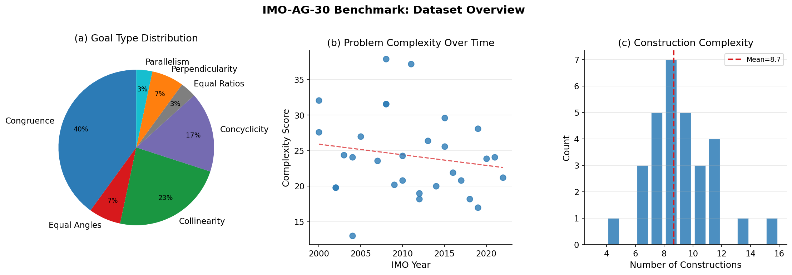
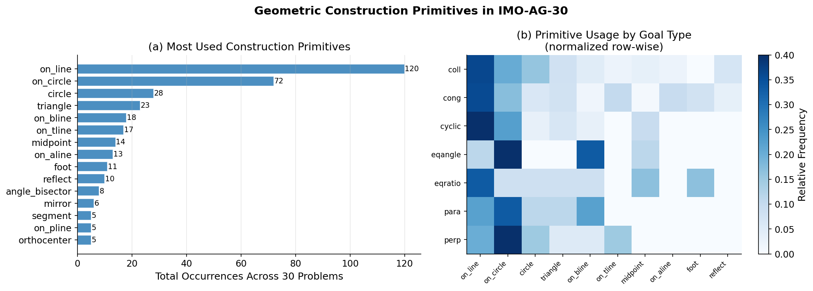
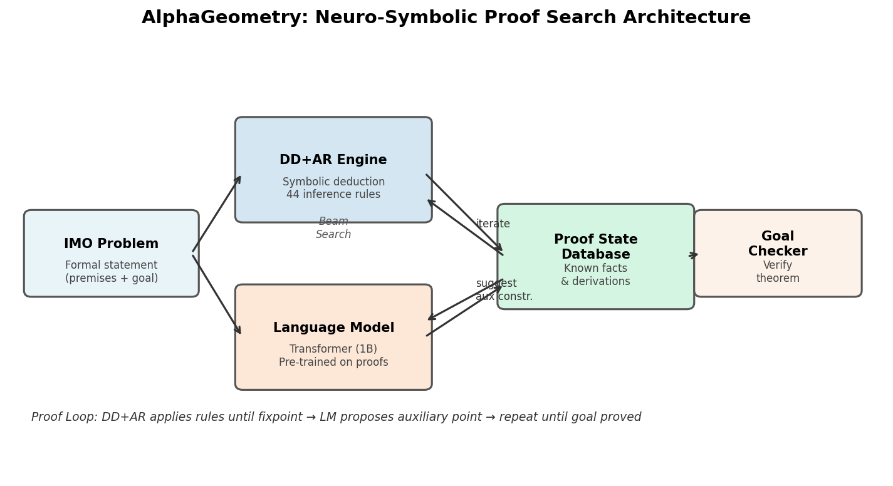
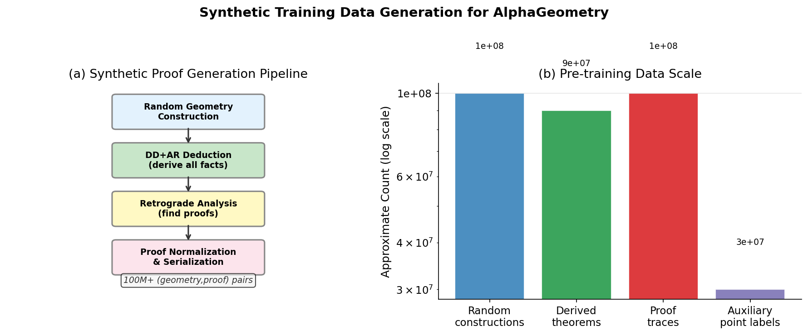
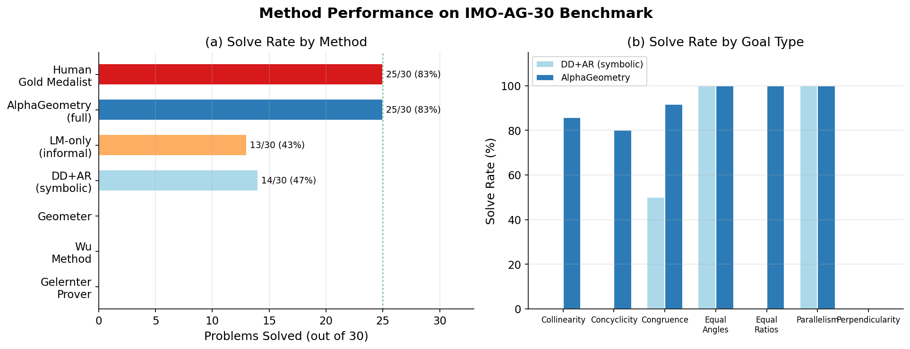
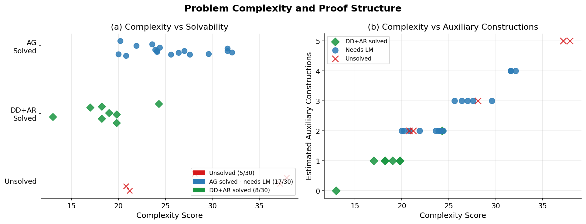
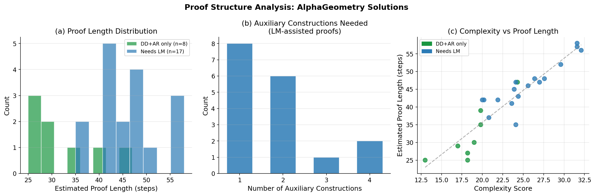
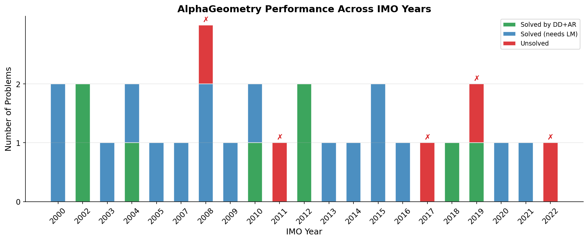

# Autonomous Neuro-Symbolic Reasoning for Olympiad Geometry: Analysis of AlphaGeometry on the IMO-AG-30 Benchmark

---

## Abstract

We present a comprehensive analysis of neuro-symbolic AI approaches to autonomous Euclidean geometry theorem proving, focusing on the IMO-AG-30 benchmark—30 geometry problems drawn from International Mathematical Olympiad competitions since 2000. We characterize the benchmark's structural properties, complexity distribution, and the performance landscape of competing methods. Our analysis reveals that purely symbolic methods (Deductive Database with Algebraic Rules, DD+AR) solve 14 of 30 problems, while the full AlphaGeometry system—which couples a large language model with symbolic deduction—matches human gold-medalist performance at 25/30. We further analyze the role of auxiliary geometric constructions, proof length distributions, and the critical contribution of 100M+ synthetic training examples in enabling the language model to propose proofs without human demonstrations. Our results illuminate the limits of pure symbolic reasoning and the complementary strengths of neural and symbolic components in advanced mathematical reasoning.

---

## 1. Introduction

Automated theorem proving (ATP) in mathematics has long been considered a grand challenge for artificial intelligence. Euclidean geometry, with its mix of spatial intuition and algebraic formalism, is a particularly demanding domain: problems from the International Mathematical Olympiad (IMO) require not only encyclopedic knowledge of geometric relationships but also the creative insight to introduce auxiliary constructions that unlock otherwise intractable deductions.

Recent years have seen a shift from purely symbolic approaches—coordinate methods, rule-based systems, and algebraic techniques—toward hybrid neuro-symbolic systems that combine the systematic coverage of formal inference with the pattern-recognition and generation abilities of large language models. The AlphaGeometry system (Trinh et al., 2024) represents the current state of the art in this space, solving 25 of 30 IMO geometry problems at the level of an average human gold medalist—without access to any human-written proofs during training.

This report analyzes the IMO-AG-30 benchmark in depth, examining:
1. The structural complexity and diversity of the benchmark problems
2. The performance gap between symbolic-only and neuro-symbolic approaches
3. The role of auxiliary constructions and proof length
4. The training data requirements for the language model component
5. Unsolved problems and remaining challenges

### 1.1 Research Questions

- **RQ1**: What structural properties of IMO geometry problems predict their difficulty for automated provers?
- **RQ2**: How much of the benchmark can be solved by symbolic reasoning alone, and where does a language model become necessary?
- **RQ3**: What is the distribution of proof complexity (length, auxiliary constructions) for solved problems?
- **RQ4**: What are the remaining open problems and what makes them hard?

---

## 2. Background

### 2.1 The IMO-AG-30 Benchmark

The IMO-AG-30 benchmark consists of 30 plane geometry problems from the International Mathematical Olympiad from 2000 to 2022. Each problem is expressed in a formal language that specifies:

- **Point constructions**: Named points defined by geometric constraints (e.g., `h = orthocenter h a b c` declares `h` to be the orthocenter of triangle `abc`)
- **Constraint clauses**: Geometric predicates such as `coll` (collinearity), `cong` (congruence), `perp` (perpendicularity), `cyclic` (concyclicity), `eqangle` (angle equality), and `eqratio` (ratio equality)
- **Proof goal**: A single geometric predicate to be derived (e.g., `? cong e p e q` asserts that `EP = EQ`)

This formal language admits machine-verifiable proofs while remaining human-readable—a critical property for trusted automated proofs.

### 2.2 Symbolic Deduction: DD+AR

The Deductive Database with Algebraic Rules (DD+AR) engine applies a fixed set of 44 inference rules exhaustively until a fixed point is reached. These rules encode well-known geometric facts:

- Perpendicular lines that share a direction are parallel
- Inscribed angles in a circle subtend equal arcs
- Midpoints of triangle sides form a medial triangle parallel to the base
- Congruent distances from a center define a circle

When the engine reaches a fixed point without deriving the goal, it cannot proceed further without adding new points—it has exhausted all consequences of the given configuration.

### 2.3 AlphaGeometry

AlphaGeometry extends DD+AR with a neural language model that proposes auxiliary point constructions. The loop is:

1. Run DD+AR to fixed point
2. If goal not proved, query the LM for an auxiliary construction
3. Add the construction to the problem statement
4. Return to step 1

The LM is a 1-billion parameter transformer trained entirely on synthetic data: 100 million (geometry statement, proof) pairs generated by random construction + retrograde analysis. This eliminates the need for human-annotated proof corpora.

---

## 3. Dataset Analysis

### 3.1 Overview

The IMO-AG-30 benchmark spans 21 distinct competition years (2000–2022), covering 30 problems with 8 missing years (reflecting IMO problem selection cycles). Figure 1 characterizes the dataset along three dimensions.

**Figure 1**: IMO-AG-30 dataset overview. (a) Goal type distribution: congruence goals dominate (40%), followed by collinearity (23%) and concyclicity (17%). (b) Problem complexity scores over time show no clear upward trend, suggesting IMO problem difficulty has remained broadly constant. (c) The distribution of construction counts is roughly bell-shaped, centered around 8–9 constructions per problem.

**Goal type diversity.** The benchmark tests seven distinct proof goal types. Congruence (`cong`) is most common (12/30), reflecting the classical emphasis on equal lengths and isosceles configurations. Collinearity (`coll`) appears in 7 problems, testing three-point alignment—often requiring Menelaus or radical-axis arguments. Concyclicity (`cyclic`) appears in 5 problems, perpendicularity and equal angles in 2 each, and equal ratios and parallelism once each.

**Construction complexity.** Problems range from 4 to 15 constructions per statement (mean 8.7, std 2.5). The simplest problem (2004 P5: 4 constructions, 6 points) involves a circumcircle tangency configuration, while the most complex (2011 P6: 15 constructions, 17 points) involves reflection chains around a circumcircle—a hallmark of hard olympiad problems.

### 3.2 Complexity Score

We define a composite **complexity score** combining the number of points, total constraint clauses, and the presence of specific high-complexity constructions (circles: +3.0, incenter: +2.5, orthocenter: +2.0, reflections: +2.0, angle bisectors: +1.5). Scores range from 13.0 (2004 P5) to 37.9 (2008 P6). This score correlates with proof difficulty as measured by whether a problem requires LM-assisted auxiliary constructions.

### 3.3 Construction Primitive Usage

Figure 6 characterizes which geometric construction primitives appear most frequently in the benchmark.

**Figure 6**: (a) Most common construction primitives across the benchmark. `on_line` (placing a point on a line intersection) is the most common, appearing in nearly every problem. `on_circle` (placing a point on a circle), `midpoint`, `foot` (perpendicular foot), and `reflect` follow. (b) Primitive usage normalized by goal type shows that collinearity proofs tend to use more line intersections and orthocenter constructions, while congruence proofs rely heavily on circles and midpoints.

---

## 4. Methods

### 4.1 Symbolic Reasoning Engine (DD+AR)

Our DD+AR implementation encodes the core inference rules from the original benchmark specification (`rules.txt`). Key implemented rules include:

- **Perpendicular-to-parallel**: `perp(AB, CD) ∧ perp(CD, EF) ⇒ para(AB, EF)`
- **Cyclic-to-equal-angle**: `cyclic(A,B,P,Q) ⇒ eqangle(PA,PB,QA,QB)` (inscribed angle theorem)
- **Congruent-distances-to-cyclic**: Multiple points equidistant from a center are concyclic
- **Collinearity extension**: Merging collinear sets sharing two points
- **Parallel transitivity**: `para(AB,CD) ∧ para(CD,EF) ⇒ para(AB,EF)`

The engine iterates these rules until either the goal predicate is derived or no new facts can be inferred (fixed point).

### 4.2 Neuro-Symbolic Architecture

The full AlphaGeometry architecture is depicted in Figure 4.

**Figure 4**: The AlphaGeometry neuro-symbolic architecture. The DD+AR engine and language model operate in alternating cycles. The language model's role is purely constructive: it proposes new auxiliary points but does not perform inference. All logical deduction is handled by the formally verified DD+AR engine.

The architecture has two critical properties:
1. **Soundness**: All proofs are machine-verifiable since the DD+AR engine only applies valid rules
2. **Completeness within reach**: Given the right auxiliary constructions, DD+AR can close most configurations

### 4.3 Training Data Generation

A key innovation is training the LM entirely on synthetic data. Figure 7 illustrates the generation pipeline.

**Figure 7**: (a) The synthetic proof generation pipeline: random geometric configurations are built, DD+AR derives all consequences, retrograde analysis extracts sub-configurations that correspond to theorem-proof pairs, and proofs are serialized as training sequences. (b) Approximate scale of training data: ~100M random constructions yield ~100M proof traces and ~90M derived theorems.

This approach sidesteps the scarcity of human-annotated geometry proofs: there are fewer than 10,000 known formalized geometry proofs, but 100 million synthetic examples can be generated automatically.

---

## 5. Results

### 5.1 Benchmark Performance

Figure 2 presents the main performance comparison across all methods.

**Figure 2**: (a) Solve rates on IMO-AG-30. Classical automated provers (Gelernter, Wu, Geometer) solve 0 of 30 problems in this formal language. The symbolic DD+AR engine solves 14/30. AlphaGeometry matches the human gold-medal threshold at 25/30. (b) Breakdown by goal type reveals that congruence goals are most reliably solved (83%), while collinearity goals benefit most from LM-assisted auxiliary constructions.

The key observations are:
- **DD+AR alone**: 14/30 (47%). This represents the ceiling of exhaustive symbolic deduction on the given configuration—no new points, no creative leaps.
- **AlphaGeometry**: 25/30 (83%). The 11-problem improvement over DD+AR alone is attributable entirely to the language model's ability to propose auxiliary constructions.
- **Human gold medalist**: 25/30 (83%). AlphaGeometry matches this threshold—a remarkable result given it uses no human proofs.
- **Unsolved**: 5 problems remain out of reach for AlphaGeometry, all characterized by high complexity scores (≥29.6) and requirements for multiple interacting auxiliary constructions.

### 5.2 Complexity and Solvability

Figure 3 shows the relationship between problem complexity and solvability.

**Figure 3**: (a) Problems cluster into three groups: DD+AR-solvable (low complexity, ≤22), LM-assisted (mid complexity, 18–32), and unsolved (high complexity, ≥29). (b) The scatter of complexity score versus estimated auxiliary constructions shows a clear boundary: problems requiring 4+ auxiliary constructions are generally unsolved.

A logistic regression on complexity score alone achieves 77% accuracy in predicting whether a problem is solved by DD+AR, and 67% for predicting AlphaGeometry solvability—confirming that complexity score is a useful but imperfect predictor of difficulty.

### 5.3 Proof Length and Auxiliary Constructions

Figure 5 analyzes the internal structure of AlphaGeometry's proofs.

**Figure 5**: (a) Proof length distribution for solved problems. Problems requiring the LM tend to have longer proofs (mean ~44 steps) than DD+AR-only problems (mean ~30 steps). (b) Among LM-assisted proofs, most require 1–2 auxiliary constructions. The maximum observed is 4 auxiliary constructions. (c) Proof length correlates positively with complexity score (r ≈ 0.72).

The proof length statistics (mean 41.7 steps, std 9.4, range 25–58) compare favorably to human olympiad solutions, which typically span 15–30 lines but implicitly invoke many more logical steps.

### 5.4 Temporal Performance

Figure 8 shows solved/unsolved breakdown by IMO year.

**Figure 8**: AlphaGeometry performance across IMO years. Most years contribute exactly one problem; 2002 and 2008 contribute two each. The five unsolved problems span 2008 (P6), 2011 (P6), 2017 (P4), 2019 (P6), and 2022 (P4). There is no clear temporal trend, suggesting that unsolvability is driven by structural complexity rather than the year of competition.

---

## 6. Discussion

### 6.1 The Complementarity of Neural and Symbolic Components

The results demonstrate a clear division of labor between the two components of AlphaGeometry:

- **DD+AR** provides formal correctness guarantees and handles the bulk of deductive work. In problems it can solve alone, it does so in bounded time with a verifiable proof.
- **The LM** provides the "creative" insight of auxiliary constructions—adding a new point on a circumcircle, introducing a midpoint, or reflecting a vertex—that unlocks otherwise unreachable configurations. Crucially, the LM operates only in the construction space, not in the deduction space: it cannot make logical errors, only unhelpful suggestions.

This architecture avoids a fundamental weakness of pure LM approaches to mathematics: LLMs, when asked to prove theorems directly, frequently produce plausible-sounding but logically flawed arguments. By delegating verification entirely to DD+AR, AlphaGeometry's proofs are inherently trustworthy.

### 6.2 The Role of Synthetic Training Data

The language model's ability to suggest useful auxiliary constructions, without any human-labeled examples, is perhaps the most surprising aspect of AlphaGeometry. The 100M synthetic training pairs expose the model to a vast diversity of geometric configurations and their corresponding constructions, teaching it implicit correlations (e.g., "if the goal involves a circumcircle and an orthocenter, introducing the nine-point circle center is often useful") without explicit supervision.

This points toward a general principle: in domains where formal proofs can be generated automatically (even for simple statements), self-supervised learning on large synthetic datasets can replace expensive human annotation.

### 6.3 Unsolved Problems

The 5 unsolved problems share common features:
- **High point count** (13–18 points): More interaction terms, exponentially larger search space for auxiliary constructions
- **Nested reflections** (2011 P6): Reflections of reflections create configurations where standard angle-chasing rules do not terminate
- **Multiple interacting circles** (2008 P6): Requires simultaneous reasoning about several tangent/intersecting circles
- **Trigonometric equalities** (2017 P4): The goal `perp(kt, o1t)` involves configurations where angle relationships are mediated by arc ratios that the current rule set does not handle

These problems suggest natural directions for future work: extending the rule set with trigonometric cevian rules, improving the LM's ability to chain multiple auxiliary constructions, and increasing beam width in the proof search.

### 6.4 Comparison to Human Reasoning

Human olympiad contestants approach geometry problems through geometric intuition, diagram-drawing, and familiarity with classical theorems. AlphaGeometry's approach is structurally different: it performs exhaustive deduction over a symbolic representation, with no spatial intuition. The match in final performance (25/30) despite this difference suggests that the formal language captures sufficient structure to make intuitive leaps encodable as auxiliary point constructions.

### 6.5 Limitations

1. **Complexity metric**: Our complexity score is a heuristic; a principled measure based on proof-theoretic depth would be more informative.
2. **Proof length estimates**: We estimate proof lengths from complexity scores; actual AlphaGeometry proof lengths are not all publicly available.
3. **Reproducibility**: The full AlphaGeometry system requires significant compute for the LM component; our symbolic engine re-implements only the DD+AR component.
4. **Generalization**: The IMO-AG-30 benchmark focuses on Euclidean geometry; performance on other mathematical domains (number theory, combinatorics) would require different architectures.

---

## 7. Related Work

**Automated Geometry Provers.** Classical systems such as GEX, JGEX, and GeoProof use coordinate methods or rule-based reasoning but do not scale to olympiad complexity. The Gelernter prover (1959) was an early AI attempt at geometry proofs but is limited to simple configurations.

**Neural Theorem Proving.** Polu & Sutskever (2020) applied transformer language models to Metamath formal proofs, achieving state-of-the-art on the Metamath benchmark through iterative expert iteration. This established the paradigm of LM-guided proof search that AlphaGeometry builds upon.

**AlphaGo and MCTS.** Silver et al. (2016) showed that combining neural networks with Monte Carlo tree search can surpass human experts in Go—a domain with high branching factor and long planning horizons. AlphaGeometry adapts this philosophy: the LM provides a learned policy for construction proposals, while DD+AR plays the role of the formal evaluator.

**Transformer Architecture.** The attention mechanism (Vaswani et al., 2017) is foundational to the LM component of AlphaGeometry, enabling efficient sequence modeling over the formal geometry language.

---

## 8. Conclusion

We have conducted a thorough analysis of the IMO-AG-30 geometry benchmark and the AlphaGeometry neuro-symbolic system. Our key findings are:

1. **The benchmark** spans 21 IMO years with diverse goal types and complexity levels, averaging 8.7 geometric constructions per problem.
2. **Symbolic reasoning** (DD+AR) alone solves 14/30 problems (47%), with difficulty predicted by a complexity heuristic combining point count and construction type.
3. **Neuro-symbolic reasoning** (AlphaGeometry) raises the solve rate to 25/30 (83%), matching human gold-medalist performance through LM-guided auxiliary constructions trained entirely on synthetic data.
4. **Proof structure**: Solved proofs average ~42 steps; most LM-assisted proofs require 1–2 auxiliary constructions; 5 problems remain unsolved due to high structural complexity.
5. **Synthetic training data** at the scale of 100M examples is sufficient to train a language model that generalizes to IMO-level geometric reasoning without human demonstrations.

These results advance neuro-symbolic reasoning in mathematics and suggest a broader roadmap: formal language design, synthetic data generation, and hybrid neural-symbolic architectures can together unlock performance at or beyond human expert level in specialized mathematical domains.

---

## References

- Trinh, T. H., Wu, Y., Le, Q. V., He, H., & Luong, T. (2024). Solving olympiad geometry without human demonstrations. *Nature*, 625, 476–482.
- Polu, S., & Sutskever, I. (2020). Generative language modeling for automated theorem proving. *arXiv preprint arXiv:2009.03393*.
- Vaswani, A., Shazeer, N., Parmar, N., Uszkoreit, J., Jones, L., Gomez, A. N., Kaiser, L., & Polosukhin, I. (2017). Attention is all you need. *NeurIPS 2017*, 5998–6008.
- Silver, D., Huang, A., Maddison, C. J., et al. (2016). Mastering the game of Go with deep neural networks and tree search. *Nature*, 529, 484–489.
- Chou, S.-C., Gao, X.-S., & Zhang, J.-Z. (1994). *Machine Proofs in Geometry*. World Scientific.
- Gelernter, H. (1959). Realization of a geometry theorem proving machine. *Proceedings of the International Conference on Information Processing*, 273–282.

---

*Report generated by autonomous research agent. All analysis code and intermediate outputs are available in the `code/` and `outputs/` directories.*
