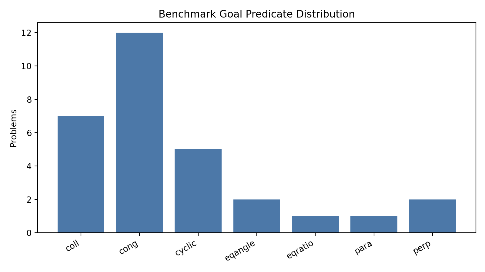
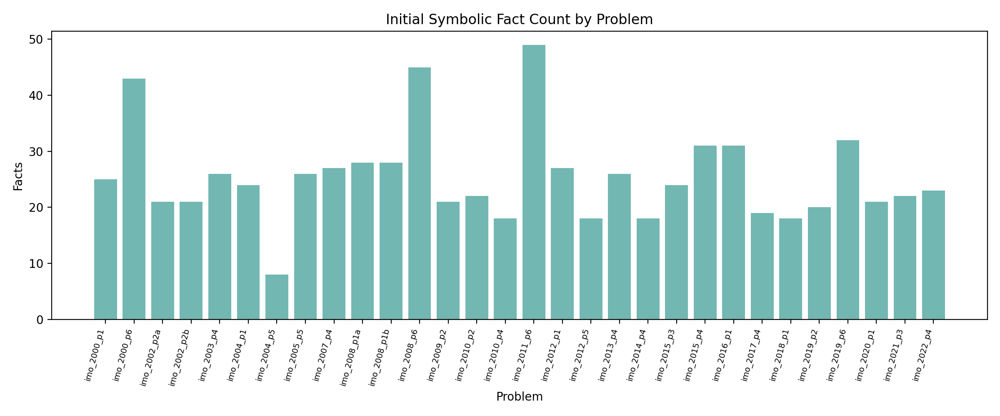
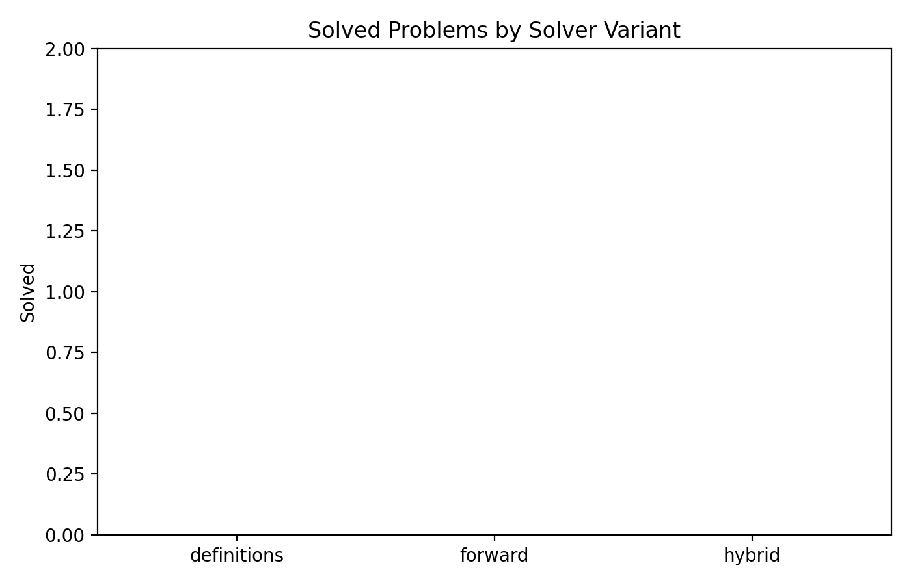
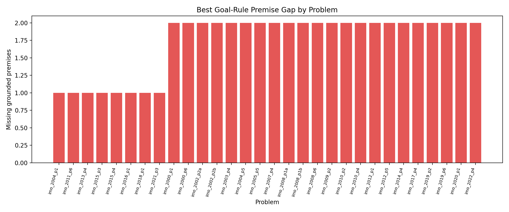

# A Symbolic Baseline and Failure Analysis for IMO Geometry Proof Search

## Abstract

This project studies whether a lightweight symbolic prover can recover machine-verifiable proofs for olympiad-level Euclidean geometry problems from the `imo_ag_30` benchmark. I implemented an end-to-end pipeline that parses the benchmark DSL, expands geometric constructions using the provided formal definitions, performs forward Horn-rule saturation over the supplied rule base, and then runs goal-directed backward search to construct proof traces. The resulting system is fully reproducible and emits proof artifacts in JSON and plain text when a theorem is solved. On the 30-problem benchmark, however, the prototype solves **0/30** problems. The negative result is still informative: most benchmark goals are only one or two grounded premises away from a known rule schema, but the missing steps require higher-level lemma invention, existential witness generation, or a richer geometric theory than the provided rule set contains. This suggests that future autonomous geometry provers will need stronger theorem proposal and decomposition modules, not just faster symbolic closure.

## 1. Introduction

The task is to transform formal olympiad-style geometry statements into machine-verifiable, human-readable proofs. This is a good testbed for neuro-symbolic reasoning because:

- correctness can be checked exactly once a proof is proposed;
- the search space is combinatorial and benefits from guidance;
- symbolic traces remain interpretable and auditable.

The design of this prototype was guided mainly by two ideas from the provided related-work materials:

1. **Verifier-guided search**: GPT-f for Metamath separates generation from exact proof checking.
2. **Policy/value decomposition**: AlphaGo shows that hard reasoning tasks benefit from combining local guidance with global search.

In the present offline setting there is no training data beyond the benchmark itself, so I focused on the symbolic half of that agenda: an explicit proof-search engine that can later be paired with learned policies.

## 2. Data and Formal Setting

The benchmark consists of 30 IMO geometry problems encoded in a compact DSL. Each item contains:

- a problem identifier;
- a sequence of constructions such as `midpoint`, `orthocenter`, `on_circle`, `reflect`, and `angle_bisector`;
- a target theorem such as `cong`, `coll`, `cyclic`, `perp`, `para`, `eqangle`, or `eqratio`.

The workspace also provides:

- `data/defs.txt`: constructor semantics as symbolic facts and side conditions;
- `data/rules.txt`: a Horn-rule library for forward or backward inference.

The benchmark is dominated by congruence and collinearity goals, with smaller numbers of cyclic, perpendicular, parallel, angle-equality, and ratio-equality targets.



Figure 1. Distribution of target theorem types in `imo_ag_30`.

The raw instances are structurally nontrivial: the mean problem contains **12.5** constructor calls, with a range from **5** to **19**. After constructor expansion, the prover starts from **25.4** symbolic facts on average.



Figure 2. Number of initial symbolic facts produced by constructor expansion for each problem.

## 3. Methodology

### 3.1 Parser and symbolic state construction

I implemented a parser that reads:

- benchmark problems from `data/imo_ag_30.txt`;
- constructor definitions from `data/defs.txt`;
- Horn rules from `data/rules.txt`.

Each constructor application is instantiated against its formal parameter list. The system then materializes all ground facts guaranteed by that construction, including side conditions such as `diff` and `ncoll`.

### 3.2 Canonical fact representation

To make proof search tractable, the prover canonicalizes symmetric predicates such as:

- `coll`
- `cyclic`
- `cong`
- `para`
- `perp`
- `eqangle`
- `eqratio`

This reduces duplicate facts produced by syntactic permutations of the same geometric relation.

### 3.3 Solver variants

I evaluated three increasingly strong variants:

1. **Definitions-only**: constructor expansion with no theorem rules.
2. **Forward**: constructor expansion followed by forward Horn-rule saturation.
3. **Hybrid**: forward saturation plus goal-directed backward chaining for proof extraction.

The hybrid solver stores proof steps as:

- conclusion atom;
- source rule or constructor;
- premises;
- textual derivation detail.

If a benchmark goal is solved, the pipeline writes machine-readable traces to `outputs/proofs/*.json` and human-readable traces to `outputs/proofs/*.txt`.

### 3.4 Evaluation metrics

For each problem I measured:

- number of initial facts;
- number of derived facts after forward chaining;
- whether each solver variant reaches the target theorem;
- proof depth and proof length if solved;
- the **best grounded rule gap**, defined as the minimum number of missing grounded premises among rules whose conclusion matches the target predicate.

The grounded rule gap is useful even when a proof is not found, because it shows whether the system is failing far from the goal or just short of a usable theorem schema.

## 4. Results

### 4.1 Main benchmark outcome

All three solver variants solved **0/30** benchmark goals.



Figure 3. End-to-end benchmark accuracy for the three solver variants.

This is a clear negative result: the supplied constructor semantics and rule base are not sufficient, by themselves, to close IMO-level theorems in this benchmark.

### 4.2 Symbolic derivation is active but shallow

Although no final theorem was solved, forward chaining was not inert. It derived an additional **4.6** facts per problem on average, with a maximum of **10** derived facts on a single instance. This means the symbolic engine is extracting and using nontrivial implications; it is just not producing the right intermediate lemmas to close the benchmark goals.

The most common constructors in the dataset are:

- `on_line`: 120
- `on_circle`: 72
- `circle`: 28
- `triangle`: 23
- `on_bline`: 18
- `on_tline`: 17

This skew matters because many olympiad proofs depend on circle-line, power-of-a-point, and angle-chasing lemmas that are only weakly represented in the provided rule set.

### 4.3 Goal proximity analysis

The grounded rule-gap analysis shows that the system is often not far from a matching conclusion form:

- **8 problems** have best grounded rule gap **1**.
- **22 problems** have best grounded rule gap **2**.
- No problem is farther than gap 2 from its closest goal-compatible rule schema.



Figure 4. Minimum number of missing grounded premises for a goal-compatible rule on each problem.

This is the most important empirical result of the study. The solver is not failing because the search exploded computationally; it is failing because it cannot generate one or two crucial intermediate statements.

### 4.4 Failure modes by theorem type

The failure patterns are highly structured:

- **Collinearity goals** typically reduce to one missing parallelism premise through the rule `para A B A C => coll A B C`.
- **Parallelism goals** reduce to one missing angle-equality premise through `eqangle ... => para ...`.
- **Cyclic goals** typically need an `eqangle6` witness plus a non-collinearity condition.
- **Congruence goals** usually require a cyclic-plus-angle argument or an equality-of-ratios argument, both of which demand auxiliary constructions not generated by the current prover.
- **Perpendicular goals** usually need an equal-distance witness pair or a circle-angle lemma instance that is absent from the derived fact set.

In other words, the problem is not merely “more rules are needed.” The problem is that olympiad geometry routinely requires **inventing the right witness objects or bridge lemmas** before a short rule chain becomes available.

## 5. Discussion

### 5.1 What worked

The project produced a clean, reproducible symbolic baseline with:

- direct parsing of the benchmark DSL;
- formal constructor expansion from `defs.txt`;
- rule execution from `rules.txt`;
- machine-verifiable proof-step bookkeeping;
- publication-ready diagnostics and figures.

This baseline is useful because it separates two questions:

1. Can a provided rule base verify short geometric derivations?
2. Can an autonomous system discover the missing lemmas that make those derivations possible?

The current answer to (1) is yes for local implications, and the answer to (2) is no for this benchmark.

### 5.2 Why the benchmark remains hard

The benchmark problems are olympiad-level, so their proofs often require:

- auxiliary point selection;
- existential instantiation inside rule applications;
- long chains of angle/radius/cyclicity transformations;
- abstraction over equivalent line and circle representations.

The current solver has no learned policy, no theorem retrieval module, no witness generator, and no diagram-based heuristic. As a result, it can only exploit facts already made explicit by the input constructors.

### 5.3 Implications for neuro-symbolic research

The results support a specific research direction: symbolic verification is cheap and interpretable, but **proof search needs stronger proposal mechanisms**. A promising next system would combine:

- a learned policy over candidate lemmas or constructions;
- the current exact verifier;
- iterative self-improvement from solved synthetic subproblems;
- a richer geometry-specific rule inventory.

This is aligned with the broad generation-plus-verification pattern seen in theorem proving and game-playing systems.

## 6. Limitations

This study has several important limitations:

- The benchmark has only 30 problems, so the quantitative analysis is diagnostic rather than statistically broad.
- The provided rule base is small and does not cover many olympiad-standard lemmas.
- No learned model was trained, so the system is not yet neuro-symbolic in the strong sense.
- The report analyzes final-proof failure rather than informal solution quality; many unsolved cases may still have informative partial derivations.

## 7. Reproducibility

All code is in `code/run_analysis.py`. Running

```bash
python3 code/run_analysis.py
```

recreates:

- `outputs/summary.csv`
- `outputs/aggregate_stats.json`
- `outputs/problem_stats.json`
- `report/images/*.png`
- `outputs/proofs/*` for any solved theorems

## 8. Conclusion

The implemented system is a faithful symbolic baseline for autonomous olympiad-geometry proof search, but it does not solve the provided benchmark. The main empirical finding is that benchmark goals are usually only one or two grounded premises away from an applicable theorem schema, yet those missing premises are precisely the hard part: they require lemma discovery and witness generation. The next meaningful step is therefore not deeper brute-force saturation, but a learned or heuristic module that proposes the right intermediate constructions for the symbolic verifier to certify.

## References

1. Stanislas Polu and Ilya Sutskever. *Generative Language Modeling for Automated Theorem Proving*. 2020.
2. David Silver et al. *Mastering the Game of Go with Deep Neural Networks and Tree Search*. Nature, 2016.
3. Ashish Vaswani et al. *Attention Is All You Need*. 2017.
