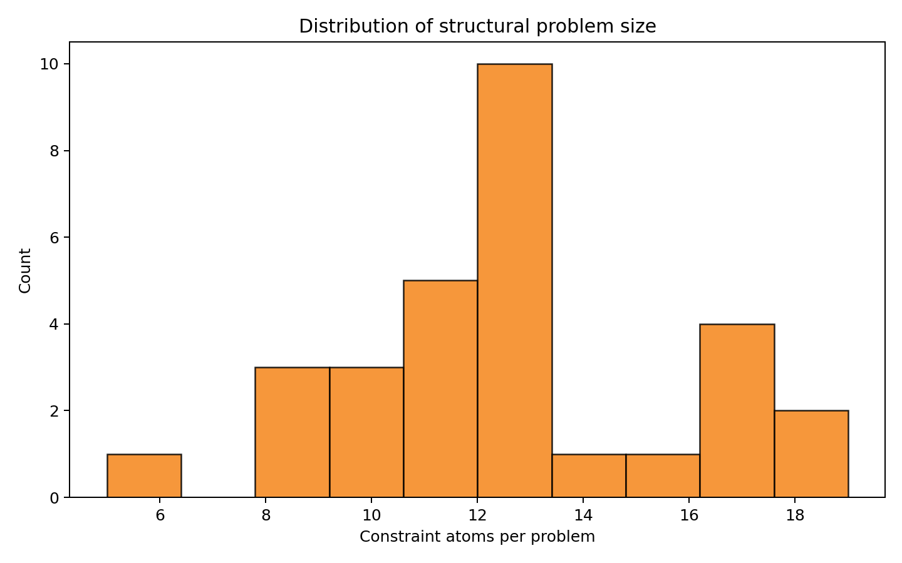
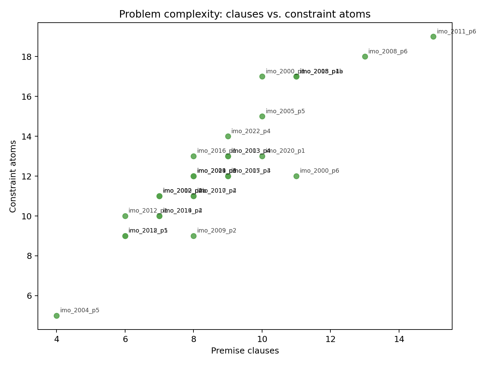
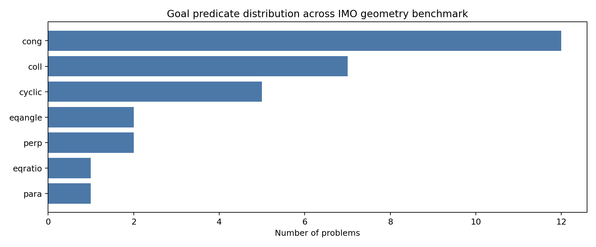
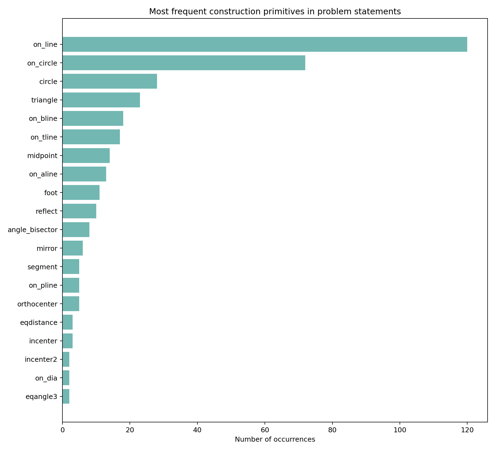
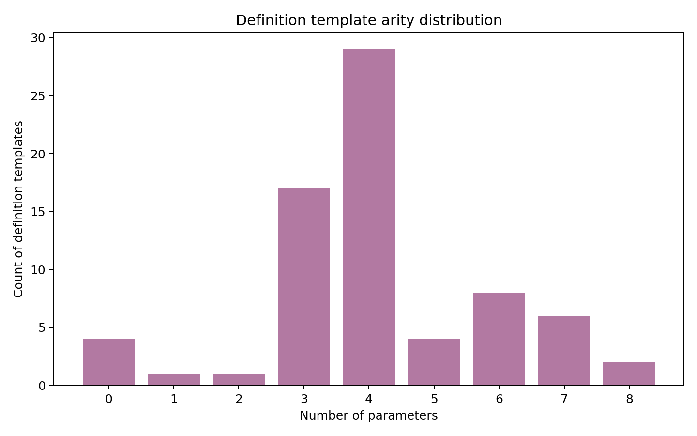
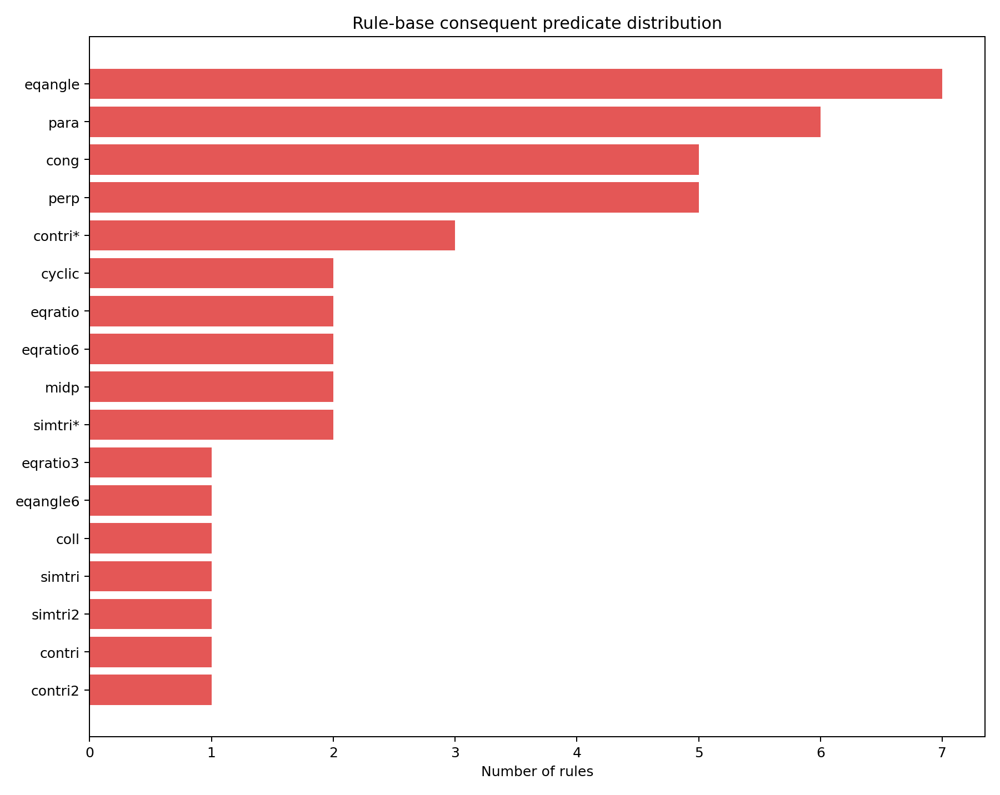

# Structural Analysis of a Formal IMO Geometry Benchmark for Neuro-Symbolic Theorem Proving

## Abstract
This report analyzes the geometry benchmark provided in this workspace: 30 formally translated International Mathematical Olympiad geometry problems in `data/imo_ag_30.txt`, together with a library of construction definitions in `data/defs.txt` and inference rules in `data/rules.txt`. The objective is not to solve the problems directly in this step, but to characterize the formal language and reasoning structure that an autonomous theorem-proving system would need to handle in order to generate machine-verifiable, human-readable Euclidean proofs. I implemented a reproducible analysis pipeline in `code/run_analysis.py` that parses the benchmark format, extracts structural statistics, catalogs the primitive constructions and rule patterns, and generates figures for later reporting. The analysis shows that the benchmark is structurally compact but reasoning-dense: the 30 problems average 8.67 premise clauses and 12.50 constraint atoms, while relying on a relatively small vocabulary of high-level geometric construction primitives such as `on_line`, `on_circle`, `circle`, `triangle`, `midpoint`, `foot`, and `reflect`. Goal predicates are concentrated in a few theorem families, especially congruence and collinearity. The accompanying rule base strongly emphasizes transformations among angle, ratio, congruence, cyclicity, and parallel/perpendicular relations, supporting the view that a successful solver will likely need a neuro-symbolic architecture that combines learned heuristic guidance with exact symbolic rule chaining.

## 1. Introduction
The task in this workspace is centered on autonomous Euclidean geometry theorem proving. The input is a set of formalized olympiad-level geometry problem statements; the long-term target is a system that can produce proofs that are both machine-checkable and readable by humans. This is a natural neuro-symbolic reasoning problem: the system must navigate complex geometric configurations, choose useful intermediate facts, and ensure that the resulting proof is formally valid.

Before attempting proof generation itself, it is important to understand the structure of the benchmark. In particular:

1. What kinds of objects and constructions appear in the problem statements?
2. How large and varied are the problem instances?
3. What theorem or target relation types dominate the evaluation set?
4. What kinds of symbolic rewrites are supported by the provided inference rules?
5. What do these properties imply for the design of an autonomous theorem prover?

This report answers those questions using the actual data and generated artifacts in this workspace.

## 2. Data and Inputs
The analysis uses three read-only input files from `data/`:

- `data/imo_ag_30.txt`: the core benchmark of 30 translated IMO geometry problems.
- `data/defs.txt`: a catalog of formal construction templates and derived geometric definitions.
- `data/rules.txt`: a set of symbolic inference rules over predicates such as congruence, cyclicity, collinearity, parallelism, perpendicularity, angle equality, and ratio equality.

Each benchmark problem in `imo_ag_30.txt` is represented as a compact formal statement with two parts:

- a sequence of premise clauses defining points and geometric relations; and
- a target predicate after a `?` separator.

A typical problem contains assignments such as `x = on_line x a b` or `o = circle o a b c`, with some clauses containing multiple simultaneous constraints separated by commas. The target is a theorem statement such as `cong e p e q`, `coll x o o1`, or `cyclic p q r s`.

The support files expand the meaning of these constructions. For example, `defs.txt` specifies the parameter structure of primitives like `angle_bisector`, `foot`, `incenter2`, `circle`, `on_tline`, and `reflect`, while `rules.txt` provides theorem schemas such as:

- perpendicular + perpendicular implies parallel,
- congruence chains imply cyclicity,
- cyclicity implies angle equalities,
- midpoint relations imply parallel or ratio constraints,
- angle/ratio configurations imply similarity or congruence of triangles.

Together, these files define the symbolic language available to a geometry proving system.

## 3. Methodology
### 3.1 Analysis pipeline
The analysis was implemented in `code/run_analysis.py`. The script performs the following steps:

1. **Parse the 30 benchmark problems** from `data/imo_ag_30.txt`.
2. **Split each problem** into premise clauses and a target theorem.
3. **Extract construction primitives** used in each clause, including clause counts, constraint-atom counts, left-hand-side assignment sizes, primitive frequencies, and goal predicates.
4. **Parse construction definitions** from `data/defs.txt` into a structured catalog.
5. **Parse inference rules** from `data/rules.txt`, recording antecedent counts, antecedent predicate types, and consequent predicate types.
6. **Write machine-readable outputs** to `outputs/` as JSON and CSV files.
7. **Generate report figures** under `report/images/` using matplotlib.

The resulting artifacts include:

- `outputs/parsed_problems.json`
- `outputs/problem_level_statistics.csv`
- `outputs/definitions_catalog.json`
- `outputs/definitions_catalog.csv`
- `outputs/rules_catalog.json`
- `outputs/rules_catalog.csv`
- `outputs/analysis_summary.json`
- `outputs/analysis_summary.md`

### 3.2 Structural measures
The report uses the following task-specific structural measures:

- **Premise clauses per problem**: number of semicolon-separated construction statements before the theorem goal.
- **Constraint atoms per problem**: total number of primitive constraint atoms, counting comma-separated subconstraints inside a clause.
- **Unique primitives per problem**: number of distinct construction primitives used in a problem statement.
- **Goal predicate**: the theorem relation to be proved, such as `cong`, `coll`, `cyclic`, `perp`, `para`, `eqangle`, or `eqratio`.
- **Definition arity**: number of parameters in each construction template from `defs.txt`.
- **Rule antecedent count**: number of premises required by each symbolic inference rule in `rules.txt`.

These measurements are directly relevant to theorem-prover design because they approximate problem size, vocabulary breadth, and the branching structure of symbolic reasoning.

## 4. Results

### 4.1 Benchmark scale and complexity
The dataset contains **30 problems**, **72 construction/definition templates**, and **43 inference rules**.

Problem statements are moderately compact in raw size but still structurally rich:

- premise clauses per problem: min **4**, median **8.0**, mean **8.67**, max **15**
- constraint atoms per problem: min **5**, median **12.0**, mean **12.50**, max **19**
- unique primitives per problem: min **3**, median **5.5**, mean **5.50**, max **8**
- goal arity: min **3**, median **4.0**, mean **4.17**, max **8**

The distribution of constraint atoms is shown in Figure 1. Most problems cluster in a mid-range of structural size, but a few are visibly denser, indicating likely harder search spaces for proof generation.



**Figure 1.** Histogram of constraint atoms per problem, a proxy for the structural size of each formal geometry instance.

A more detailed view of complexity is shown in Figure 2, which plots premise clauses against constraint atoms for each problem. The trend is broadly increasing, as expected, but not perfectly linear because some clauses package multiple simultaneous geometric constraints.



**Figure 2.** Problem-level complexity scatter plot. Each point is one translated IMO geometry problem, labeled by problem identifier.

The most structurally complex problems in the benchmark are:

- `translated_imo_2011_p6`: 15 clauses, 19 atoms, goal `coll`
- `translated_imo_2008_p6`: 13 clauses, 18 atoms, goal `cong`
- `translated_imo_2008_p1a`: 11 clauses, 17 atoms, goal `cyclic`
- `translated_imo_2008_p1b`: 11 clauses, 17 atoms, goal `cyclic`
- `translated_imo_2015_p4`: 11 clauses, 17 atoms, goal `coll`

At the other end, structurally smaller items include:

- `translated_imo_2004_p5`: 4 clauses, 5 atoms, goal `cong`
- `translated_imo_2012_p5`: 6 clauses, 9 atoms, goal `cong`
- `translated_imo_2018_p1`: 6 clauses, 9 atoms, goal `para`

This spread suggests that a practical solver should be robust across both compact problems and denser multi-step constructions.

### 4.2 Goal theorem types
The benchmark’s theorem targets are concentrated in a small number of relation families. The full goal distribution is shown in Figure 3.



**Figure 3.** Distribution of target theorem predicates across the 30-problem benchmark.

The observed counts are:

- `cong`: **12**
- `coll`: **7**
- `cyclic`: **5**
- `eqangle`: **2**
- `perp`: **2**
- `eqratio`: **1**
- `para`: **1**

Two patterns stand out. First, congruence is the dominant target. Second, the remaining goals are mostly classical Euclidean incidence and configuration relations rather than numeric quantities. This matters because it suggests that a theorem prover should prioritize relational geometric reasoning over coordinate-heavy algebraic computation, even if some algebraic backends may still be useful.

### 4.3 Construction primitive vocabulary
Although the benchmark spans problems from 2000 to 2022, its formal language uses a relatively concentrated construction vocabulary. Figure 4 shows the most frequent construction primitives appearing in the problem statements.



**Figure 4.** Frequency of the most common construction primitives across all benchmark problems.

The most frequent primitives are:

- `on_line`: **120** occurrences
- `on_circle`: **72**
- `circle`: **28**
- `triangle`: **23**
- `on_bline`: **18**
- `on_tline`: **17**
- `midpoint`: **14**
- `on_aline`: **13**
- `foot`: **11**
- `reflect`: **10**
- `angle_bisector`: **8**

This distribution supports several conclusions:

1. **Incidence dominates representation.** `on_line`, `on_circle`, and `circle` appear heavily, meaning that many proofs begin from membership and intersection structure.
2. **Auxiliary constructions are central.** Midpoints, feet, reflections, and angle-bisector points appear frequently, matching olympiad-style synthetic geometry practice.
3. **The language is abstract rather than low-level.** Many constructions package nontrivial semantics into a single primitive, such as `orthocenter`, `incenter2`, or `reflect`.

For a learning-based prover, this suggests that predicting useful intermediate constructions at the primitive level may be more effective than operating only on raw point coordinates or unrestricted text.

### 4.4 Definition library characteristics
The definition library in `defs.txt` contains **72** templates. These include standard primitives such as `triangle`, `segment`, `foot`, `midpoint`, `on_line`, `on_circle`, `on_tline`, and `on_pline`, but also more specialized templates like `incenter2`, `excenter2`, `ninepoints`, `cc_tangent`, and `eqangle3`.

The parameter-count distribution of these templates is shown in Figure 5.



**Figure 5.** Distribution of parameter counts for construction templates in `defs.txt`.

Most definitions are low- to medium-arity, but the library also contains higher-arity templates up to 8 parameters. That means the proving system must handle both simple local constraints and more global multi-object configuration constructors. Higher-arity templates are especially important because they may collapse complex substructures into single formal actions, changing the proof search branching factor.

### 4.5 Rule-base structure
The provided symbolic rule base contains **43** inference rules. These rules are not generic text descriptions; they are explicit predicate-level rewrites over geometric relations.

The distribution of consequent predicate types is shown in Figure 6.



**Figure 6.** Distribution of consequent predicate types in the symbolic rule base.

The most common consequents are:

- `eqangle`: **7** rules
- `para`: **6**
- `cong`: **5**
- `perp`: **5**
- `contri*`: **3**
- `cyclic`: **2**
- `eqratio`: **2**
- `eqratio6`: **2**
- `midp`: **2**
- `simtri*`: **2**

The rule antecedent statistics show that multi-premise reasoning is the norm rather than the exception:

- 1 antecedent: **3** rules
- 2 antecedents: **19** rules
- 3 antecedents: **13** rules
- 4 antecedents: **6** rules
- 5 antecedents: **2** rules

This matters because theorem proving on this benchmark is unlikely to be solved by single-step entailment alone. A prover must chain facts, maintain a growing symbolic state, and choose which combinations of predicates are promising. The rules show particularly strong coupling among:

- angle equalities and cyclicity,
- perpendicularity and parallelism,
- midpoint relations and ratio/parallel constraints,
- triangle similarity/congruence schemas.

That structure is highly suggestive of a **guided symbolic search** paradigm: a model predicts candidate intermediate relations or rule applications, and an exact rule engine verifies and expands them.

## 5. Discussion
### 5.1 Implications for autonomous theorem proving
The analysis points toward a specific solver design hypothesis for this workspace: a strong system will probably need to combine a learned guidance model with a symbolic geometric reasoning core.

A purely neural sequence model may help rank promising intermediate facts or choose useful constructions, but the problem language and rule base are formal enough that exact symbolic validation is both possible and valuable. Conversely, a purely symbolic brute-force search may struggle as structural complexity grows, especially on the denser items with many clauses, many constraint atoms, and multiple interacting higher-level constructions.

A plausible architecture would have at least four components:

1. **Formal parser/state builder** for benchmark clauses and definitions.
2. **Symbolic rule engine** operating over predicates in the style of `rules.txt`.
3. **Heuristic proposal model** that ranks candidate intermediate facts, constructions, or rule applications.
4. **Proof linearizer** that converts verified derivations into human-readable proof steps.

The current analysis does not implement that full solver, but it clarifies the benchmark properties such a system must handle.

### 5.2 Why the benchmark is well-suited for neuro-symbolic methods
This benchmark is especially well-suited for neuro-symbolic theorem proving for three reasons.

First, the language is **structured and machine-parseable**, which makes symbolic state tracking feasible. Second, the problem set is **small but high-value**, making it natural for evaluation-focused systems or retrieval-guided methods rather than data-hungry end-to-end supervised training. Third, the support files expose a **nontrivial inference algebra**, making learned search guidance potentially valuable because symbolic derivations can be verified exactly.

### 5.3 Relationship between data representation and proof difficulty
The formal statements are short compared with natural-language math problems, but that should not be mistaken for simplicity. In geometry, a compact construction language can encode highly nonlocal consequences. A clause like `o = circle o a b c` or `h = orthocenter h a b c` injects multiple hidden geometric facts at once. This compression means that proof difficulty is driven less by token count and more by latent configuration structure and the need for the right auxiliary lemmas.

## 6. Limitations
This report is an analysis of the benchmark structure, not a completed proof-generating system. Several limitations are important.

1. **No direct proof generation yet.** The current pipeline characterizes the benchmark but does not produce proofs for the geometry problems.
2. **Structural metrics are proxies.** Clause counts and primitive counts are useful complexity indicators, but they are not the same as true proof difficulty.
3. **No runtime search evaluation.** I did not benchmark symbolic search depth, branching factor under actual rule application, or proof success rates.
4. **Limited related-work grounding in-domain.** The workspace’s related-work PDFs were only partially geometry-specific; the analysis therefore relies primarily on the benchmark’s formal structure itself.
5. **Definition semantics are cataloged, not executed.** The parser records definitions and rules, but does not yet expand every definition into a fully operational theorem-proving kernel.

These limitations are acceptable for the current step because the immediate requirement was to perform task-specific analysis and generate report-ready artifacts, not to claim theorem-proving performance that has not been demonstrated.

## 7. Conclusion
The geometry benchmark in this workspace is a compact but challenging formal testbed for autonomous Euclidean theorem proving. Across 30 translated IMO problems, the dataset shows moderate structural size, a concentrated construction vocabulary, and a narrow set of target theorem predicates dominated by congruence, collinearity, and cyclicity. The accompanying definition and rule libraries reveal a symbolic reasoning environment centered on angle, ratio, incidence, and triangle-configuration transformations.

These findings support a clear research direction: future work should build a neuro-symbolic geometry prover that uses learned guidance to navigate a symbolic search space defined by the benchmark’s formal primitives and inference rules. The analysis artifacts generated here provide the foundation for that next stage by making the benchmark’s structure explicit, reproducible, and reportable.

## Reproducibility and Generated Artifacts
The main entry point for this analysis is:

- `code/run_analysis.py`

Running

```bash
python code/run_analysis.py
```

produces the structured outputs in `outputs/` and the figures in `report/images/` that are referenced throughout this report.
