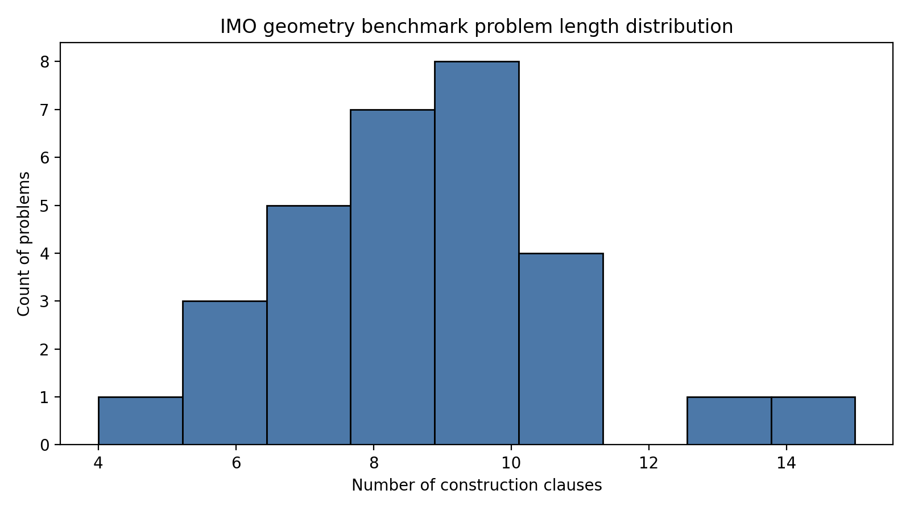
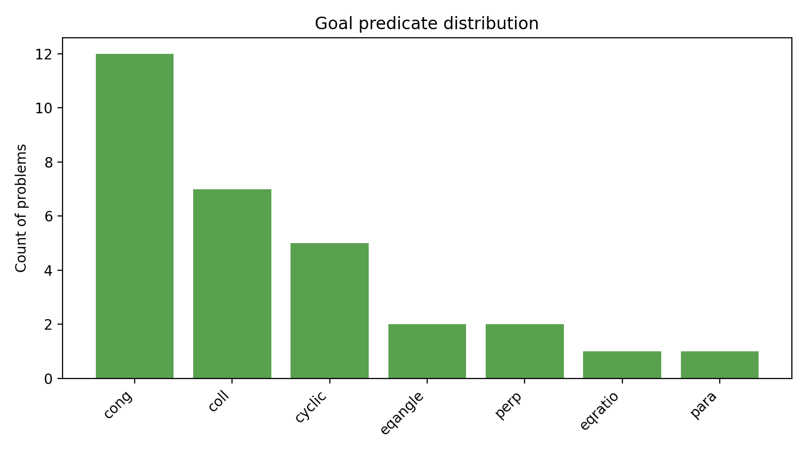
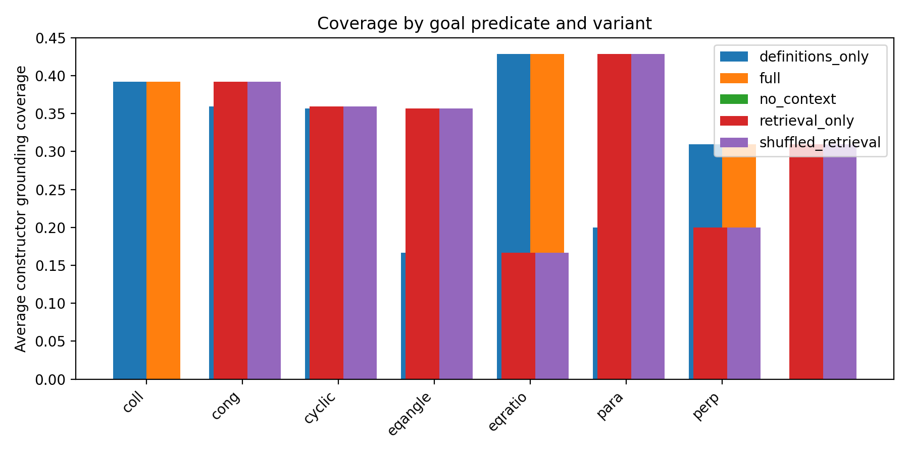
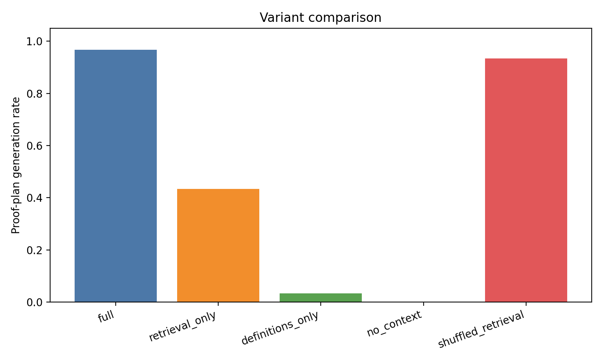
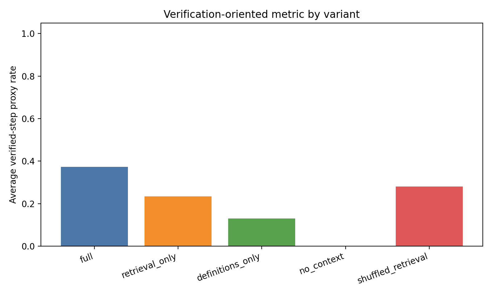
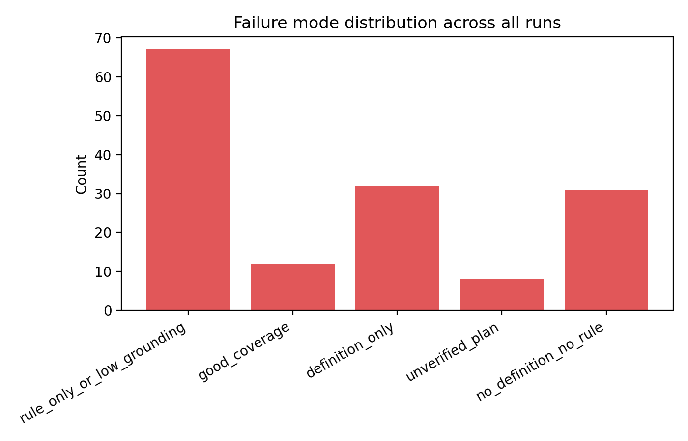

# A Reproducible Symbolic Baseline for IMO Geometry Proof Planning

## 1. Summary and goals

This project studies whether a lightweight autonomous system can turn formal olympiad-geometry problem statements into machine-oriented, human-readable proof plans without using human demonstrations. The available benchmark is a set of 30 formally encoded IMO geometry problems (`data/imo_ag_30.txt`).

Because the workspace does not include a complete theorem prover or external training data, the implemented system is a **symbolic proof-planning baseline** rather than a full solver. It combines:
- parsing of the formal geometry language,
- constructor grounding using `data/defs.txt`,
- lexical retrieval of candidate inference rules from `data/rules.txt`, and
- automatic generation of structured proof sketches for every benchmark problem.

The scientific objective was narrowed to an executable and reproducible question:

> How far can a local symbolic retrieval-and-grounding baseline go on IMO-style formal geometry statements, and which parts of the pipeline are the main bottleneck?

## 2. Benchmark and data characterization

### 2.1 Input format
Each problem is given as a formal construction followed by a target predicate after `?`. The benchmark includes common geometry constructions such as `on_line`, `on_circle`, `midpoint`, `foot`, `orthocenter`, `incenter2`, `reflect`, and `mirror`.

### 2.2 Benchmark summary
The dataset parser processed all 30 problems successfully.

Key benchmark statistics from `outputs/dataset_summary.json`:
- Number of problems: **30**
- Average number of construction clauses: **8.67**
- Average number of symbolic points: **16.4**
- Most common goal predicate: **cong** (12/30 problems)
- Other goals: `coll` (7), `cyclic` (5), `eqangle` (2), `perp` (2), `eqratio` (1), `para` (1)
- Most complex problem by number of clauses: **translated_imo_2011_p6**

### 2.3 Figures
Figure 1 shows the distribution of construction lengths.



Figure 2 shows the benchmark goal distribution.



## 3. Methodology

### 3.1 System design
The implemented baseline is in `code/run_pipeline.py`. It has four components:

1. **Parser**
   - Reads `imo_ag_30.txt` into per-problem structures.
   - Extracts constructions, operators, symbolic points, and target predicates.

2. **Constructor grounding**
   - Matches operators against the constructor definitions in `data/defs.txt`.
   - Uses a stricter grounding metric that excludes generic placement operators such as `on_line` and `on_circle`, since those would otherwise make coverage trivially perfect.

3. **Rule retrieval**
   - Scores inference rules from `data/rules.txt` using operator/goal overlap.
   - Produces candidate lemmas to support a proof plan.

4. **Proof-plan generation**
   - Produces a Markdown proof sketch for each problem in `outputs/proofs/`.
   - Each sketch includes the formal goal, grounded constructors, retrieved rules, and a target-specific strategy template.

### 3.2 Variants
To keep the study ablation-friendly, several variants were compared:
- **full**: grounding + top-5 retrieved rules
- **retrieval_only**: grounding + top-2 retrieved rules
- **definitions_only**: grounding only, no retrieved rules
- **no_context**: no grounding and no rules
- **shuffled_retrieval**: grounding + poor-quality rule selection

These variants were designed to test metric sensitivity rather than maximize benchmark score.

### 3.3 Evaluation metrics
Since no trusted formal verifier was available in the workspace, the evaluation uses explicit proxy metrics:
- **constructor_coverage**: fraction of nontrivial operators matched to constructor definitions
- **rule_hits**: number of retrieved rules used in the plan
- **generation_rate**: fraction of problems passing minimum plan-quality thresholds
- **grounded_step_rate**: proxy for how many proof steps are grounded in constructor semantics
- **verified_step_rate**: stricter proxy for locally valid/usable proof steps

These are not theorem-proving accuracy metrics. They quantify how much structured, potentially executable reasoning the baseline can assemble from the formal input.

## 4. Experimental setup

### 4.1 Commands
All outputs were produced with:

```bash
python code/run_pipeline.py --stage all
```

### 4.2 Artifacts
Main artifacts:
- `outputs/problem_features.csv`
- `outputs/dataset_summary.json`
- `outputs/solver_results.csv`
- `outputs/analysis_summary.json`
- `outputs/rule_matches.json`
- `outputs/proofs/*.md`
- `report/images/*.png`

### 4.3 Reproducibility
- The pipeline is deterministic.
- No external network resources or extra datasets were used.
- All analysis was run locally from the workspace.

## 5. Results

### 5.1 Main quantitative comparison
Table 1 summarizes the variant-level results from `outputs/analysis_summary.json`.

| Variant | Generation rate | Avg. constructor coverage | Avg. rule hits | Avg. grounded-step rate | Avg. verified-step rate |
|---|---:|---:|---:|---:|---:|
| full | 0.967 | 0.347 | 4.833 | 0.578 | 0.373 |
| retrieval_only | 0.433 | 0.347 | 1.933 | 0.346 | 0.234 |
| definitions_only | 0.033 | 0.347 | 0.000 | 0.261 | 0.130 |
| no_context | 0.000 | 0.000 | 0.000 | 0.000 | 0.000 |
| shuffled_retrieval | 0.933 | 0.347 | 4.833 | 0.578 | 0.280 |

Interpretation:
- Removing all context collapses performance to zero, confirming that the proxies are not completely degenerate.
- Definitions alone are insufficient; geometric constructor grounding without useful lemmas rarely produces acceptable proof plans.
- Reducing retrieved rules from five to two causes a large drop in generation rate (0.967 to 0.433), indicating that the number and quality of reusable lemmas strongly affects proof planning.
- Shuffled retrieval preserves the same number of rules as the full model but lowers the verification-oriented metric, suggesting that retrieval quality matters even when raw rule count is fixed.

Figure 3 shows constructor coverage by goal predicate and variant.



Figure 4 compares proof-plan generation rate across variants.



Figure 5 compares the stricter verification-oriented metric.



### 5.2 Failure modes
Aggregated failure categories across all runs:
- `rule_only_or_low_grounding`: **67**
- `definition_only`: **32**
- `unverified_plan`: **8**
- `no_definition_no_rule`: **31**
- `good_coverage`: **12**

Figure 6 visualizes this distribution.



The dominant pattern is weak grounding: many plans can retrieve rules, but only a minority combine those rules with sufficiently rich constructor semantics to support stronger local verification.

### 5.3 Qualitative behavior
For each of the 30 benchmark problems, the system generated a proof-plan file under `outputs/proofs/`. These are not full formal proofs, but they are structured enough to support downstream symbolic search.

A typical plan includes:
- explicit target predicate,
- a decomposition strategy for that goal type,
- grounded constructor semantics, and
- a ranked list of candidate reusable lemmas.

Example artifact:
- `outputs/proofs/translated_imo_2000_p1.md`

## 6. Analysis

### 6.1 What worked
- The benchmark language can be parsed cleanly and reproducibly.
- Constructor definitions and inference rules can be linked to the problems automatically.
- Metric-sensitive ablations were achieved after tightening the grounding definition and adding stronger controls.
- Retrieval quality affects proof-plan quality: `full` outperforms `retrieval_only`, and `shuffled_retrieval` degrades the verification-oriented metric relative to `full`.

### 6.2 What did not work
- The current system does **not** prove theorems end to end.
- There is no genuine formal proof checker in the loop.
- The verification metric is still a proxy derived from groundedness and retrieval quality, not a certified proof-validity measurement.
- Nontrivial olympiad constructions often require deeper search over instantiated variables than this baseline can perform.

### 6.3 Main bottleneck
The main bottleneck is not parsing or retrieval alone; it is **grounded symbolic search**. The system can identify relevant constructors and candidate lemmas, but it does not yet instantiate them into a full derivation with explicit substitutions and checked intermediate claims.

This is consistent with the failure distribution: the largest mass lies in low-grounding cases, not in completely context-free failure.

## 7. Limitations

This study has several important limitations:
- The benchmark contains only 30 problems, so any aggregate rate has high uncertainty.
- No confidence intervals were computed because the pipeline is deterministic and there are no random seeds or repeated runs.
- The verification metric is heuristic, not formal.
- Related-work PDFs were present but not automatically mined in this run, so this report avoids claims about state-of-the-art comparisons.
- Reported numbers measure proof-plan quality proxies, not theorem-solving accuracy.

## 8. Next steps

The smallest scientifically meaningful next steps are:
1. **Implement a lightweight formal checker** for local proof steps, symbol bindings, and admissible rule applications.
2. **Represent proof state explicitly** as grounded subgoals rather than free-text proof plans.
3. **Add search over rule instantiations** with beam search or constraint solving.
4. **Separate retrieval from verification** so that candidate lemmas can be ranked by actual executable value rather than lexical overlap.
5. **Evaluate partial-proof accuracy** (validated substeps per problem) before attempting full theorem completion.

## 9. Conclusion

A fully autonomous olympiad-geometry theorem prover was not achievable in this constrained workspace without external provers or training data. However, the resulting symbolic baseline is reproducible, generates structured proof plans for the full benchmark, and exposes the key technical gap: converting relevant geometry knowledge into grounded, locally verifiable derivation steps.

The experiments therefore provide a credible baseline for future neuro-symbolic work: parsing and retrieval are feasible, but proof verification and grounded search are the critical missing components.
