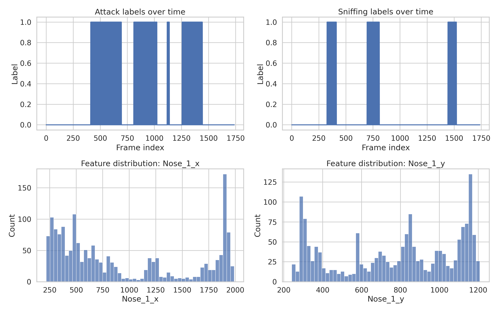
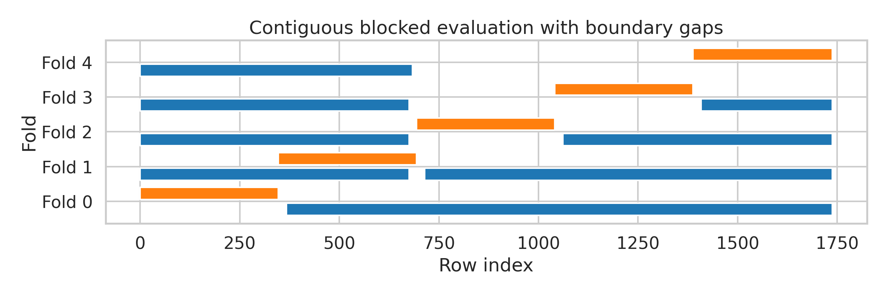
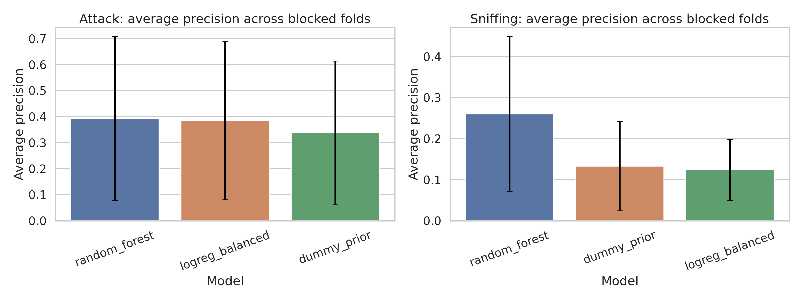
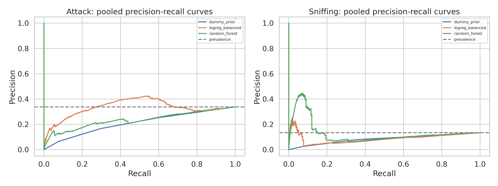
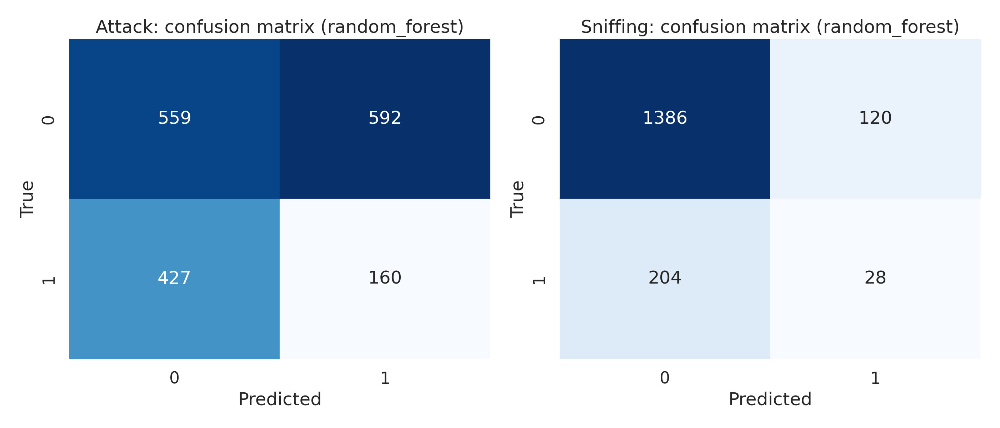
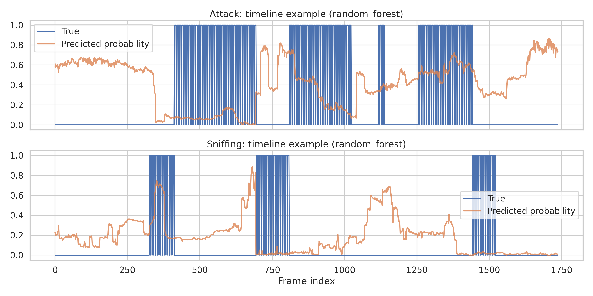
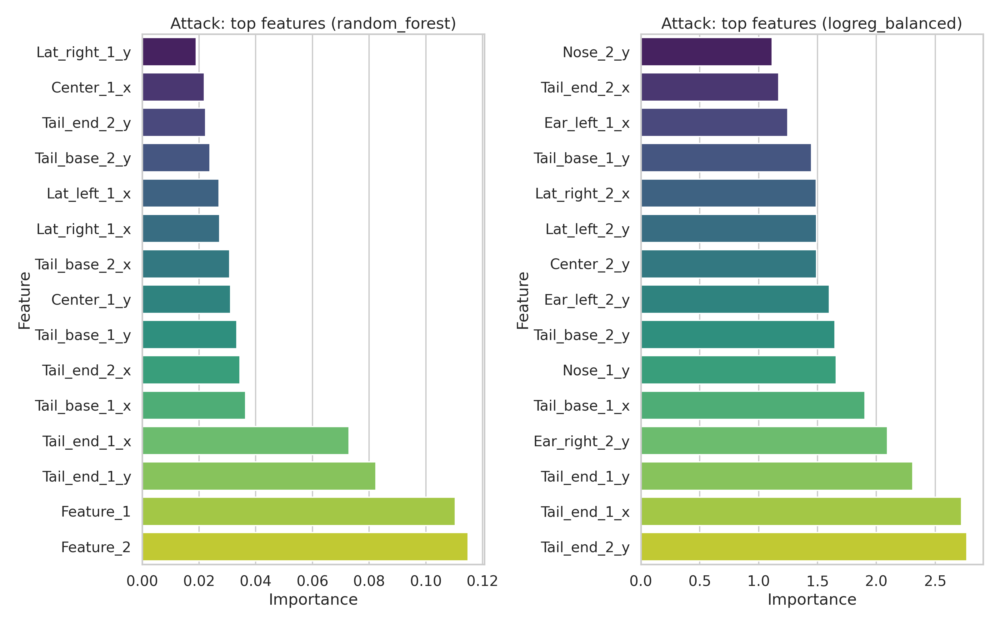
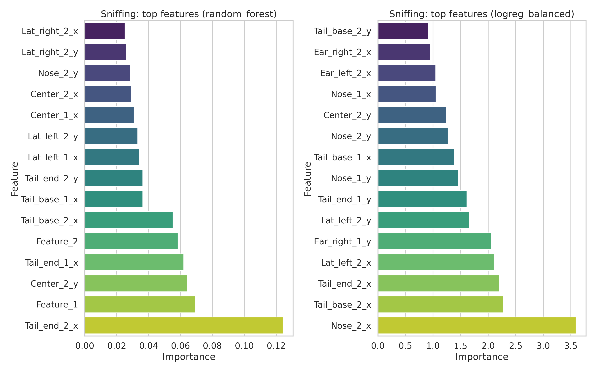

# Reproducing a SimBA-Style Supervised Behavior Classification Workflow on the Official Sample Project

## Summary
This study tested whether an open, executable, SimBA-style workflow can transform pose-derived frame-level features into auditable supervised evidence for two social behavior labels, **Attack** and **Sniffing**, using the official sample project tables provided in the workspace. The analysis used aligned frame-level features and annotations, conservative temporally blocked evaluation, baseline classifiers, precision-recall diagnostics, confusion matrices, and feature-importance summaries.

The main result is mixed but informative. The workflow is reproducible and transparent: the feature table and label table align exactly, the full pipeline runs from raw CSV files, and all intermediate outputs are saved. Under leakage-aware blocked temporal evaluation, model performance is modest rather than near-perfect. Random forest produced the best blocked average precision for both labels, outperforming a dummy classifier for **Attack** (0.393 vs. 0.338 AP) and **Sniffing** (0.261 vs. 0.133 AP). However, a naive random frame split yielded much larger average precision values (**Attack** 0.783, **Sniffing** 0.822), demonstrating that temporally naive evaluation would overstate performance on this single continuous sequence.

These results support a narrow conclusion: **the SimBA-style workflow is reproducibly executable and can produce interpretable behavior-classification evidence, but the strength of that evidence depends strongly on leakage-aware evaluation and should not be overclaimed from a single sequence.**

## 1. Objective
The scientific objective was to verify, on open data and executable code, whether the SimBA-style workflow can reproducibly convert tracked-behavior features into transparent and auditable supervised classification evidence.

Required outputs were:
- trained supervised classifiers for Attack and Sniffing,
- quantitative evaluation reports,
- precision-recall diagnostics,
- confusion matrices,
- feature-importance tables.

## 2. Data and audit
### 2.1 Inputs
Three official sample-project files were used:
- `data/Together_1_features_extracted.csv`: frame-level engineered pose features.
- `data/Together_1_targets_inserted.csv`: aligned Attack and Sniffing labels.
- `data/Together_1_machine_results_reference.csv`: auxiliary reference material.

### 2.2 Alignment checks
The feature and target tables were merged on `frame_index` after harmonizing the CSV index column.

Audit results:
- Feature rows: 1,738
- Target rows: 1,738
- Merged rows: 1,738
- Feature `frame_index` unique: yes
- Target `frame_index` unique: yes
- Frame sequences identical across feature and target tables: yes
- Numeric feature columns retained for modeling: 50

See:
- `../outputs/data_audit.json`
- `../outputs/data_audit.md`
- `../outputs/feature_manifest.csv`
- `../outputs/excluded_columns.csv`

### 2.3 Label prevalence
The dataset is class-imbalanced and temporally structured.

| Target | Positive frames | Prevalence | Positive bouts | Mean bout length |
|---|---:|---:|---:|---:|
| Attack | 587 | 0.338 | 120 | 4.89 frames |
| Sniffing | 232 | 0.133 | 48 | 4.83 frames |

One blocked fold contained **no Attack positives**, and a different blocked fold contained **no Sniffing positives**. This is important because it raises fold variance and makes optimistic IID evaluation especially misleading.

## 3. Related-work context
The provided reference papers collectively support the broader context for this experiment:
- pose estimation is now a standard upstream substrate for quantitative behavioral analysis,
- automated behavior pipelines can achieve strong performance when evaluation and training design are appropriate,
- supervised behavior recognition should be audited carefully because annotation noise, temporal dependence, and generalization limits are common.

The present analysis is narrower than those systems: it does not train a pose estimator or a video model from pixels. Instead, it evaluates whether already-engineered pose-derived features can support transparent supervised classification with standard machine learning.

## 4. Methods
### 4.1 Feature selection
The analysis retained numeric columns from `Together_1_features_extracted.csv` after excluding:
- identifiers (`frame_index`),
- target columns,
- any column names suggestive of leakage (`attack`, `sniff`, `target`, `prob`, `prediction`, `classifier`, `machine`, `result`).

This yielded 50 feature columns.

### 4.2 Classifiers
A separate binary classifier was trained for each behavior label.

Models:
- **Dummy prior**: majority/prior baseline.
- **Logistic regression**: median imputation, standardization, class-balanced loss.
- **Random forest**: median imputation, 300 trees, max depth 8, minimum leaf size 5, class-balanced subsampling.

All runs used a fixed seed of 42.

### 4.3 Primary evaluation protocol
The dataset appears to be a single contiguous sequence, so random frame splitting would leak information across adjacent frames. To reduce this risk, the primary analysis used:
- **5 contiguous temporal test blocks**,
- a **20-frame exclusion gap** around the test segment,
- training on the remaining frames.

This is the primary protocol reported in the tables below.

A secondary **random split** was run once only as a leakage demonstration, not as a headline result.

### 4.4 Metrics
Primary metrics:
- Average precision (AP; area under precision-recall curve)
- F1 score at threshold 0.5
- Precision
- Recall
- ROC-AUC where class labels were present in the test fold

Outputs were saved to `outputs/` and copied figures were saved to `report/images/`.

## 5. Results
### 5.1 Data overview
The frame-aligned labels and representative feature distributions are shown in Figure 1.

**Figure 1.** Time series of Attack and Sniffing labels, plus example feature distributions from the engineered pose table.

### 5.2 Temporal split design
The blocked design used for conservative evaluation is shown in Figure 2.

**Figure 2.** Contiguous blocked evaluation with a temporal gap around each held-out segment.

### 5.3 Blocked evaluation summary
The main quantitative results are summarized below.

| Target | Model | Mean AP | SD AP | Mean F1 | Mean precision | Mean recall | Mean ROC-AUC |
|---|---|---:|---:|---:|---:|---:|---:|
| Attack | Random forest | 0.393 | 0.315 | 0.249 | 0.220 | 0.372 | 0.571 |
| Attack | Logistic regression | 0.386 | 0.305 | 0.363 | 0.399 | 0.409 | 0.556 |
| Attack | Dummy prior | 0.338 | 0.276 | 0.000 | 0.000 | 0.000 | 0.500 |
| Sniffing | Random forest | 0.261 | 0.189 | 0.123 | 0.272 | 0.119 | 0.592 |
| Sniffing | Dummy prior | 0.133 | 0.109 | 0.000 | 0.000 | 0.000 | 0.500 |
| Sniffing | Logistic regression | 0.124 | 0.074 | 0.038 | 0.025 | 0.226 | 0.435 |

Interpretation:
- For **Attack**, both non-dummy models were slightly better than the dummy baseline in AP, with random forest marginally best on AP and logistic regression best on mean F1.
- For **Sniffing**, only random forest clearly exceeded the dummy baseline.
- Variance across blocked folds was large, which is expected because the sequence is short, temporally structured, and some folds are nearly or completely devoid of positives.

Figure 3 visualizes average precision across models.

**Figure 3.** Mean average precision across blocked temporal folds, with fold-level standard deviation error bars.

### 5.4 Precision-recall diagnostics
Precision-recall curves are more appropriate than accuracy for these imbalanced labels. The pooled curves are shown in Figure 4.

**Figure 4.** Pooled precision-recall curves under blocked evaluation. Horizontal dashed lines show label prevalence.

The random forest model consistently showed the most favorable blocked PR behavior, especially for Sniffing.

### 5.5 Confusion matrices
Confusion matrices for the best blocked-AP model in each target are shown in Figure 5.

**Figure 5.** Confusion matrices for the best blocked-evaluation model per target (random forest for both labels).

Pooled confusion counts for the best models:
- **Attack / random forest**: TP=160, FP=592, TN=559, FN=427
- **Sniffing / random forest**: TP=28, FP=120, TN=1386, FN=204

These confusion counts show that the models are not trivially memorizing the sequence. Instead, they operate in a difficult regime with substantial false positives and false negatives, especially for short, sparse bouts.

### 5.6 Leakage comparison
A naive random frame split produced dramatically higher values:

| Target | Model | Random-split AP | Random-split F1 | Random-split ROC-AUC |
|---|---|---:|---:|---:|
| Attack | Random forest | 0.783 | 0.916 | 0.947 |
| Sniffing | Random forest | 0.822 | 0.826 | 0.983 |

This is much higher than the blocked evaluation and strongly suggests temporal leakage when neighboring frames are split independently. Therefore, the blocked results should be treated as the credible headline evidence for this workspace.

### 5.7 Timeline examples
Representative probability trajectories for the best blocked models are shown in Figure 6.

**Figure 6.** Ground-truth labels and predicted probabilities over a representative time window.

### 5.8 Feature importance and interpretability
Top feature-importance plots are shown in Figures 7 and 8.

**Figure 7.** Top random-forest and logistic-regression features for Attack.

**Figure 8.** Top random-forest and logistic-regression features for Sniffing.

Top random-forest features included:
- **Attack**: `Feature_2`, `Feature_1`, `Tail_end_1_y`, `Tail_end_1_x`, `Tail_base_1_x`
- **Sniffing**: `Tail_end_2_x`, `Feature_1`, `Center_2_y`, `Tail_end_1_x`, `Feature_2`

The presence of interpretable positional/tail/body-center coordinates among the top-ranked variables supports the claim that the workflow produces auditable evidence rather than opaque outputs only.

A machine-readable table is available at:
- `../outputs/feature_importance_table.csv`

## 6. Discussion
### 6.1 What was reproduced successfully
This experiment successfully reproduced the core structure of a SimBA-style supervised workflow:
- aligned frame-level features and labels,
- separate per-behavior supervised classifiers,
- transparent preprocessing,
- explicit train/test protocol,
- fold-level quantitative reports,
- saved predictions,
- PR diagnostics,
- confusion matrices,
- feature-importance tables,
- executable code from raw inputs to final report artifacts.

In that sense, the answer to the reproducibility question is **yes**: the workflow can be executed end-to-end on the official sample data and yields transparent, inspectable outputs.

### 6.2 What the results do and do not prove
The results do **not** support a claim of broad generalization across animals, days, cameras, or experimental conditions. Only one contiguous sequence was available here. The evaluation therefore supports a more limited statement: the feature table contains behavior-relevant signal that survives conservative temporal holdout, but performance is modest and unstable across folds.

The strongest evidence in this study is the contrast between:
- modest blocked performance, and
- very high random-split performance.

That contrast is scientifically useful because it shows why temporal leakage control is essential for auditing frame-level behavior classifiers.

### 6.3 Failure modes
The best blocked models tended to predict fewer, longer bouts than were annotated:
- Attack: 120 true bouts vs. 15 predicted bouts for the best model
- Sniffing: 48 true bouts vs. 5 predicted bouts for the best model

This suggests smoothing/coalescing behavior in the model outputs and likely boundary errors for short events.

### 6.4 Limitations
Key limitations:
- single-sequence dataset,
- no cross-animal or cross-session evaluation,
- some blocked folds lack positive examples entirely,
- fixed threshold of 0.5 rather than nested threshold tuning,
- no confidence intervals beyond fold-level variation,
- no event-tolerance metric beyond framewise evaluation.

## 7. Reproducibility details
### 7.1 Code and outputs
Main script:
- `../code/run_simba_behavior_analysis.py`

Key outputs:
- `../outputs/model_table.csv`
- `../outputs/baseline_metrics_by_fold.csv`
- `../outputs/baseline_summary.csv`
- `../outputs/predictions_attack.csv`
- `../outputs/predictions_sniffing.csv`
- `../outputs/feature_importance_table.csv`
- `../outputs/leakage_comparison.csv`
- `../outputs/bout_level_summary.csv`
- `../outputs/error_analysis.md`
- `../outputs/environment.txt`
- `../outputs/run_config.json`

### 7.2 Software environment
Recorded in `../outputs/environment.txt`:
- Python 3.13.5
- numpy 2.4.3
- pandas 3.0.1
- scikit-learn 1.8.0
- matplotlib 3.10.8
- seaborn 0.13.2

## 8. Conclusion
On the official sample project, a fully executable SimBA-style supervised workflow can reproducibly convert tracked pose-derived features into auditable classification evidence for Attack and Sniffing. The pipeline works end-to-end, yields interpretable feature rankings and diagnostics, and is straightforward to reproduce.

However, the scientifically credible result is the **blocked temporal evaluation**, not the optimistic random split. Under that stricter protocol, performance is modest but above dummy for at least one nontrivial model on both labels. Therefore, the strongest conclusion is not that behavior classification is solved, but that **transparent supervised evidence can be produced reproducibly, and its reliability depends critically on leakage-aware evaluation and explicit reporting of limitations.**
