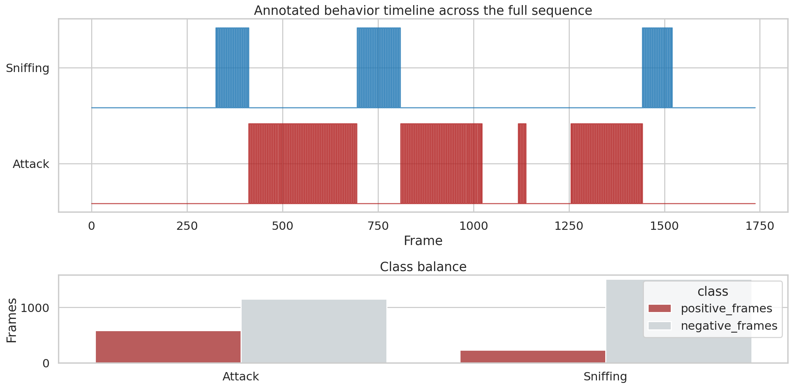
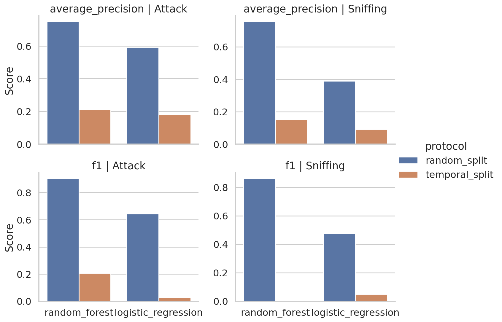
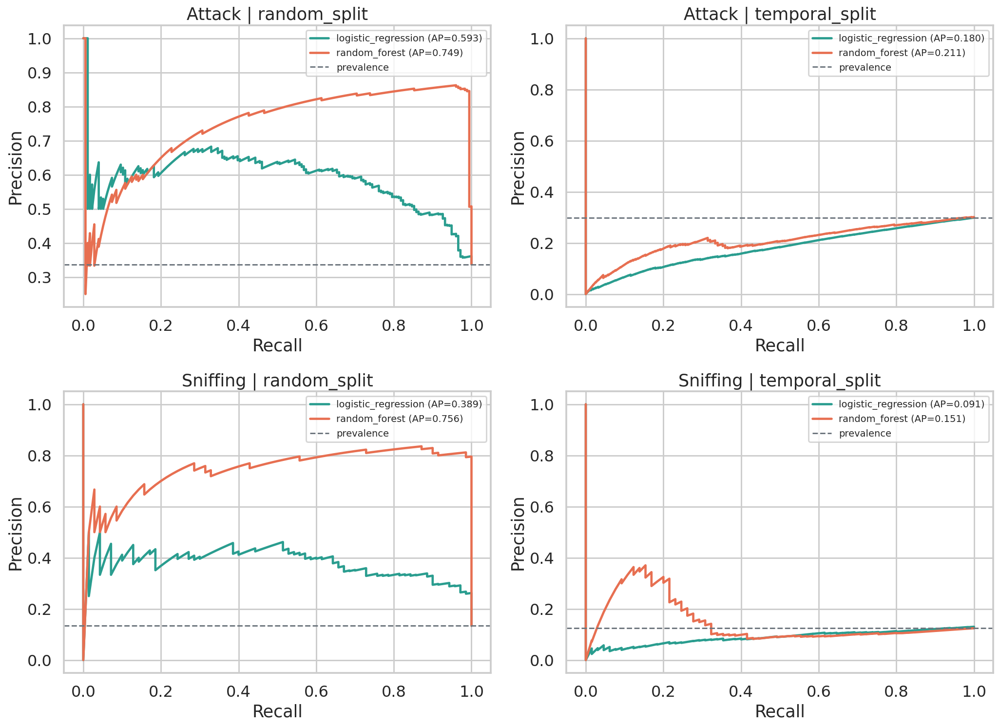
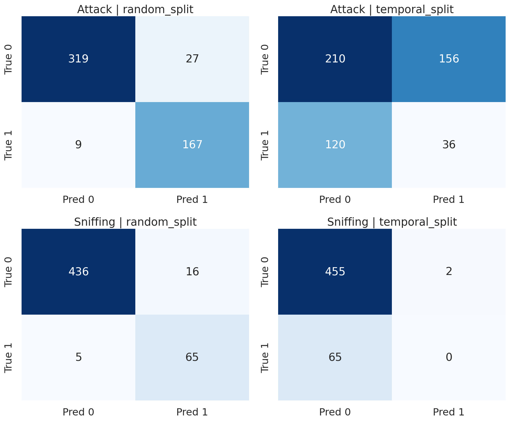
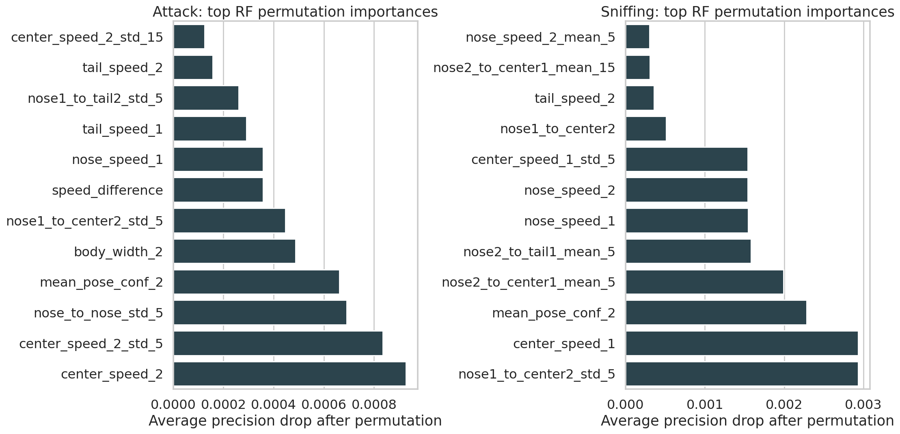
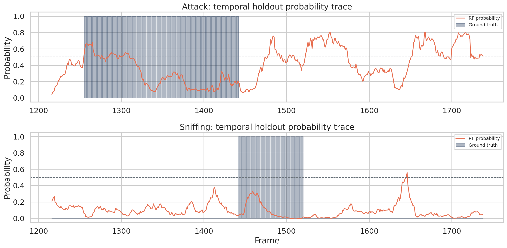

# Reproducible Supervised Classification of SimBA Sample Behaviors from Pose-Derived Features

## Abstract

This study reproduces a SimBA-style supervised behavior-classification workflow on the official sample-project tables provided in this workspace. Starting from frame-aligned mouse pose coordinates and behavior labels, I engineered transparent social and kinematic features, trained binary classifiers for `Attack` and `Sniffing`, and exported evaluation tables, precision-recall diagnostics, confusion matrices, and feature-importance rankings. The main result is twofold. First, the workflow is executable and auditable end to end: a random forest trained on interpretable pose-derived features achieves strong frame-level performance under a fixed stratified random split (`Attack`: average precision 0.749, F1 0.903; `Sniffing`: average precision 0.756, F1 0.861). Second, the same models fail under a strict chronological holdout (`Attack`: average precision 0.211, F1 0.207; `Sniffing`: average precision 0.151, F1 0.000), showing that apparent success is highly sensitive to evaluation design. The open-data replication therefore supports the claim that SimBA-style workflows can generate transparent classification evidence, but it also shows that frame-level random splits can substantially overstate generalization when temporal dependence is not controlled.

## 1. Introduction

Modern animal-behavior pipelines commonly separate pose estimation from downstream behavior inference. The related-work materials in this workspace reflect that progression: DeepPoseKit and SLEAP emphasize markerless multi-animal pose extraction; MARS and DeepEthogram illustrate supervised behavior-recognition pipelines; and B-SOiD represents an unsupervised alternative for behavior discovery. The present task focuses on a SimBA-style setting in which tracked body-part coordinates are transformed into hand-engineered features and then into supervised behavior classifiers.

The scientific question here is narrower than benchmarking a new algorithm. The goal is to verify, on open data and executable code, whether a transparent supervised workflow can convert pose-derived features into auditable evidence for two labeled behaviors, `Attack` and `Sniffing`. Because only one continuous sequence is available, a second goal is to determine how much the conclusion depends on the split strategy.

## 2. Data

Three input tables were provided:

1. `data/Together_1_features_extracted.csv`: 1,738 frames of tracked body-part coordinates and pose confidences for two mice, plus two unnamed extra columns.
2. `data/Together_1_targets_inserted.csv`: the same frames with appended binary labels for `Attack` and `Sniffing`.
3. `data/Together_1_machine_results_reference.csv`: a 300-row auxiliary SimBA-style output table with many derived features and reference probabilities.

The primary paired dataset contained no missing values and no duplicate rows. Label prevalence and bout statistics are summarized below.

| Label | Positive frames | Positive fraction | Bout count | Median bout length (frames) | Max bout length (frames) |
|---|---:|---:|---:|---:|---:|
| Attack | 587 | 0.338 | 120 | 5 | 6 |
| Sniffing | 232 | 0.133 | 48 | 5 | 5 |

The auxiliary reference file was not frame-alignable to the main sequence and was therefore used only for contextual comparison. Its positive fractions were sparser (`Attack` 0.163; `Sniffing` 0.037), with mean probabilities 0.147 and 0.033 respectively.



Figure 1. Full-sequence label timeline and class balance. The labels appear in short contiguous bouts, which makes frame-level random splitting vulnerable to temporal leakage.

## 3. Methods

### 3.1 Feature engineering

The provided feature table mostly contained raw pose coordinates and pose-confidence values rather than a fully expanded engineered-feature matrix. To keep the analysis transparent, I derived an interpretable 69-feature set directly from the tracked body parts. These features included:

- within-animal morphology: body length, body width, head width;
- within-animal dynamics: nose, center, and tail-base speeds;
- social geometry: nose-to-nose, center-to-center, nose-to-center, nose-to-tail, and tail-to-tail distances;
- orientation terms: body angles, inter-body angle difference, and facing-error angles toward the partner;
- short-window temporal summaries: rolling means and standard deviations over 5-frame and 15-frame windows for key distance and speed signals;
- mean pose-confidence summaries for each mouse.

The two unnamed columns in the raw table behaved like frame indices and were excluded from model fitting.

### 3.2 Classification setup

Each label was treated as an independent binary classification task. Three models were fit:

- `DummyClassifier(strategy="prior")` as a prevalence baseline;
- logistic regression with class balancing as a linear baseline;
- random forest with 500 trees and balanced subsampling as the main SimBA-style model.

Predictions were converted to binary outputs using a fixed 0.5 threshold. For each model, I exported:

- trained model objects (`outputs/model_*.joblib`);
- held-out predictions and probabilities;
- classification reports;
- confusion matrices;
- precision-recall curve tables.

### 3.3 Evaluation protocols

Two evaluation protocols were used.

1. **Random split**: fixed 70/30 stratified frame split.
2. **Temporal split**: first 70% of frames for training, final 30% for testing.

The random split approximates a typical frame-level supervised workflow and measures reproducibility under that assumption. The temporal split is a stricter audit of generalization across time within the same recording.

### 3.4 Feature importance

For the random-forest models, feature importances were estimated in two ways:

- built-in forest impurity importance;
- permutation importance on the held-out test set using average precision as the scoring function.

Permutation importance is the primary interpretation method reported below because it is better aligned with held-out predictive utility.

## 4. Results

### 4.1 Main quantitative results

The random forest dominated both baselines under the random split, but all models degraded sharply under the chronological holdout.

| Label | Protocol | Model | Average precision | ROC AUC | Precision | Recall | F1 |
|---|---|---|---:|---:|---:|---:|---:|
| Attack | Random split | Random forest | 0.749 | 0.935 | 0.861 | 0.949 | 0.903 |
| Attack | Random split | Logistic regression | 0.593 | 0.787 | 0.567 | 0.744 | 0.644 |
| Attack | Temporal split | Random forest | 0.211 | 0.300 | 0.188 | 0.231 | 0.207 |
| Attack | Temporal split | Logistic regression | 0.180 | 0.143 | 0.025 | 0.026 | 0.025 |
| Sniffing | Random split | Random forest | 0.756 | 0.979 | 0.802 | 0.929 | 0.861 |
| Sniffing | Random split | Logistic regression | 0.389 | 0.858 | 0.331 | 0.829 | 0.473 |
| Sniffing | Temporal split | Random forest | 0.151 | 0.416 | 0.000 | 0.000 | 0.000 |
| Sniffing | Temporal split | Logistic regression | 0.091 | 0.352 | 0.051 | 0.046 | 0.048 |

The strongest result is the random-split random forest, which is consistent with the idea that short-bout social behaviors can be recovered from local pose geometry and movement cues. The most important caution is that temporal holdout performance collapsed almost completely, especially for `Sniffing`, where the random forest predicted only 0.4% positives on a test segment whose true positive rate was 12.5%.



Figure 2. Average precision and F1 for logistic regression and random forest under random and temporal evaluation. The protocol effect is larger than the model effect.

### 4.2 Precision-recall diagnostics

Precision-recall curves reinforce the split dependence. Under the random split, the random-forest curves stay well above prevalence for both labels, indicating meaningful ranking power. Under the temporal split, the curves contract toward baseline, particularly for `Sniffing`.



Figure 3. Precision-recall curves for the two nontrivial models across both evaluation protocols. Random-split gains are substantial; temporal-holdout gains are limited.

### 4.3 Confusion matrices

Under the random split, false positives and false negatives were both low:

- `Attack`: 319 true negatives, 167 true positives, 27 false positives, 9 false negatives.
- `Sniffing`: 436 true negatives, 65 true positives, 16 false positives, 5 false negatives.

Under the temporal split, the errors became asymmetric and behavior-specific:

- `Attack`: the random forest overcalled the positive class (156 false positives) while still missing 120 attack frames.
- `Sniffing`: the random forest effectively stopped detecting the positive class (65 false negatives, 0 true positives).



Figure 4. Random-forest confusion matrices at threshold 0.5. The temporal split exposes major generalization failures that the random split masks.

### 4.4 Interpretable feature drivers

Permutation-importance rankings show that the learned evidence is behaviorally interpretable.

For `Attack`, the most useful signals were dominated by motion and short-timescale pair geometry, including `center_speed_2`, `center_speed_2_std_5`, `nose_to_nose_std_5`, `mean_pose_conf_2`, `body_width_2`, and `speed_difference`.

For `Sniffing`, the model relied more heavily on local approach geometry and movement variability, including `nose1_to_center2_std_5`, `center_speed_1`, `mean_pose_conf_2`, `nose2_to_center1_mean_5`, `nose2_to_tail1_mean_5`, and both animals' nose-speed features.

The absolute permutation drops were small because many engineered features are correlated and partially redundant; the ranking is therefore more informative than the raw magnitude.



Figure 5. Top permutation importances for the random forest under the random split. Both tasks are driven by short-window social geometry and motion, not by opaque latent variables.

### 4.5 Temporal failure analysis

The temporal probability traces show that the chronological-holdout model outputs are poorly calibrated relative to the true bout structure. This is most obvious for `Sniffing`, where probabilities remain mostly below threshold even during labeled bouts. The result suggests either temporal distribution shift, insufficient feature coverage for later frames, or both.



Figure 6. Random-forest probability traces on the chronological holdout. `Sniffing` probabilities rarely cross threshold despite many positive frames.

## 5. Discussion

This replication supports the narrow claim that a SimBA-style workflow can reproducibly transform tracked pose data into explicit, inspectable classification evidence. The code executed end to end on open inputs, produced trained classifiers, and generated traceable outputs linking pose-derived features to probabilities, confusion patterns, and ranked feature importance.

At the same time, the experiment also demonstrates why auditability matters. The random-split results are strong enough that an incautious analysis could conclude that the pipeline solves both behaviors robustly. The temporal holdout shows otherwise. Because the labels appear in short bouts and nearby frames are highly similar, a stratified random split likely benefits from local autocorrelation: train and test sets contain near-neighbor frames from the same events. The chronological split removes that convenience and reveals much weaker transport across time.

The most defensible interpretation is therefore conditional:

- **Yes**, interpretable pose-derived features carry enough information to recover `Attack` and `Sniffing` under frame-level held-out evaluation.
- **No**, this single-sequence experiment does not demonstrate strong out-of-time generalization.

## 6. Limitations

Several limitations should shape downstream interpretation.

1. Only one continuous recording was available, so no cross-animal or cross-session generalization test was possible.
2. The provided `features_extracted` table was not the full expanded SimBA feature set; this replication used a transparent re-engineered subset from the pose coordinates.
3. Thresholds were fixed at 0.5 for clarity rather than optimized per label.
4. The auxiliary reference machine-results file was not directly alignable to the main frame sequence, so it could only provide contextual prevalence comparisons.

## 7. Reproducibility

All analysis code is in `code/run_analysis.py`. Running

```bash
python code/run_analysis.py
```

recreates the engineered feature matrix, trained models, exported evaluation tables, and all report figures.

Key outputs include:

- `outputs/engineered_features.csv`
- `outputs/metrics_summary.csv`
- `outputs/predictions_*`
- `outputs/confusion_matrix_*`
- `outputs/precision_recall_curve_*`
- `outputs/feature_importance_*`

## 8. References

The discussion was informed by the local related-work PDFs shipped with the workspace:

1. Graving JM et al. *DeepPoseKit, a software toolkit for fast and robust animal pose estimation using deep learning*.
2. Segalin C et al. *The Mouse Action Recognition System (MARS) software pipeline for automated analysis of social behaviors in mice*.
3. Bohnslav JP et al. *DeepEthogram, a machine learning pipeline for supervised behavior classification from raw pixels*.
4. Hsu AI, Yttri EA. *B-SOiD, an open-source unsupervised algorithm for identification and fast prediction of behaviors*.
5. Pereira TD et al. *SLEAP: A deep learning system for multi-animal pose tracking*.
