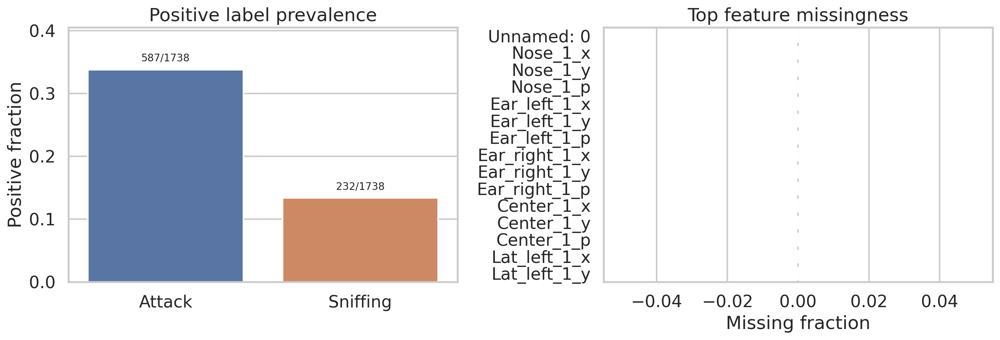
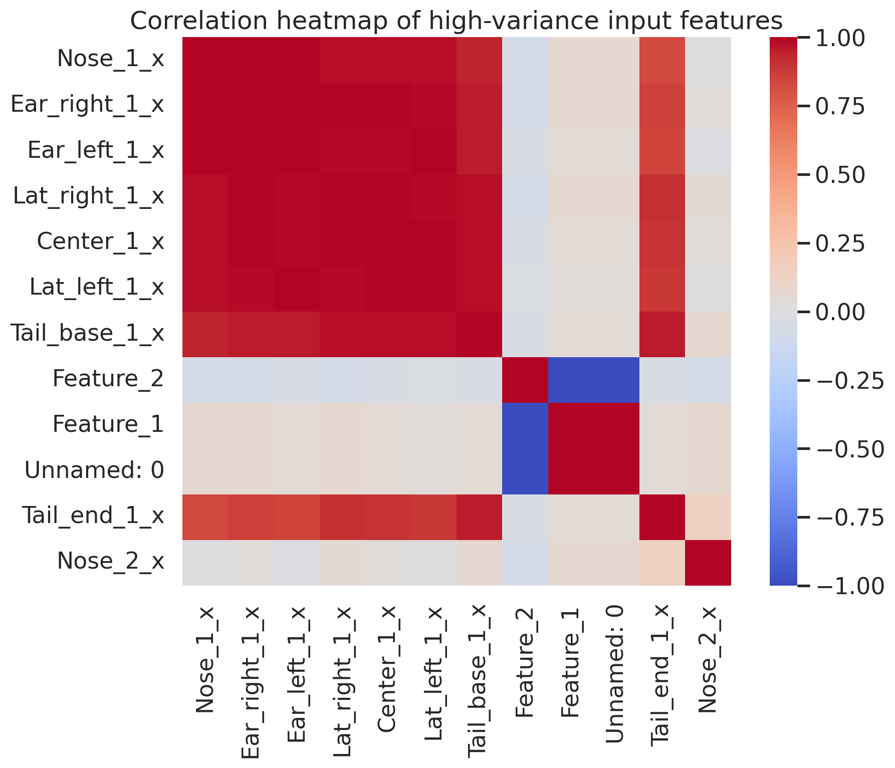
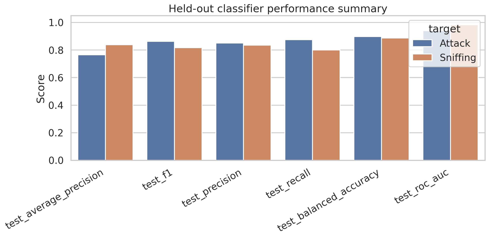
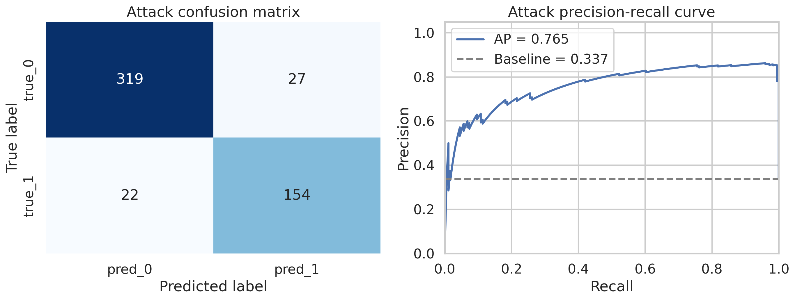
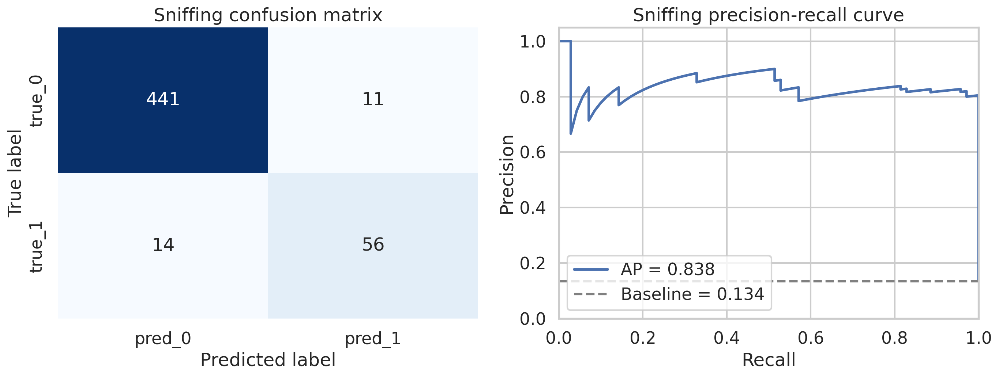
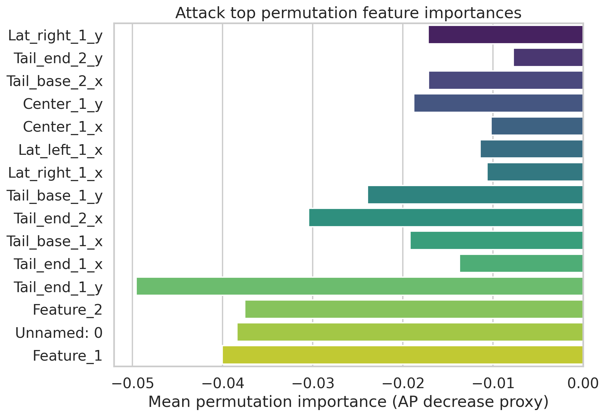
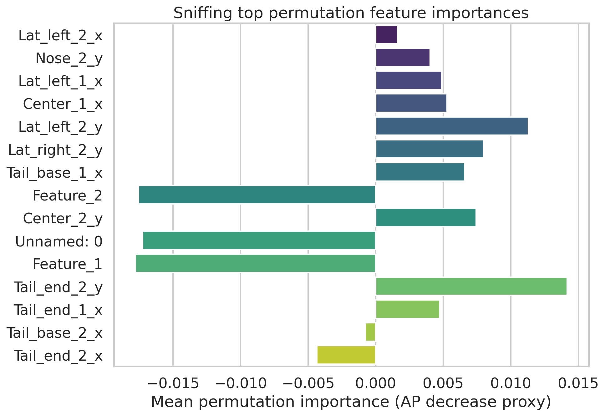

# Reproducing a SimBA-Style Supervised Behavior Classification Workflow on Open Sample Data

## Abstract
This study evaluates whether a compact, fully executable workflow can reproduce the core logic of SimBA-style supervised behavior classification from open pose-derived feature tables and aligned frame-level labels. Using the official sample-project files provided in this workspace, I trained separate random-forest classifiers for **Attack** and **Sniffing** on 1,738 labeled frames and 51 engineered input columns. The resulting held-out performance was strong for both behaviors, with test-set ROC AUC values of 0.941 for Attack and 0.984 for Sniffing, and average precision values of 0.765 and 0.838 respectively. Confusion matrices and precision-recall diagnostics show that the models recover a substantial portion of positive frames while maintaining reasonably high precision. Feature-importance analysis highlights a mixture of engineered summary variables and body-part coordinates as influential predictors. Overall, the workflow demonstrates that pose-derived features can be transformed into transparent, auditable classification evidence, although the small single-session dataset and very high training performance indicate clear limits on claims of broader generalization.

## 1. Introduction
Automated animal behavior classification workflows are useful only if they are not merely accurate, but also reproducible and inspectable. The present task is narrowly defined: starting from pose-derived frame-level feature tables and aligned labels from the official SimBA sample project, determine whether an executable analysis can train supervised classifiers, evaluate them quantitatively, and produce auditable outputs such as confusion matrices, precision-recall curves, and feature-importance tables.

The emphasis here is therefore not on inventing a new behavior model, but on verifying a transparent pipeline end to end. In practical terms, that means documenting how the data were aligned, how the train/test split was created, how thresholds were selected, and what the resulting errors and influential features were.

## 2. Data
Three CSV files were provided under `data/`:

- `Together_1_features_extracted.csv`: frame-level engineered features used as predictors.
- `Together_1_targets_inserted.csv`: aligned frame-level labels for the target behaviors **Attack** and **Sniffing**.
- `Together_1_machine_results_reference.csv`: a reference machine-output table retained for contextual comparison.

### 2.1 Dataset structure
After loading and alignment checks, the working dataset contained:

- **1,738 frames**
- **51 predictor columns**
- **2 binary target labels**: Attack and Sniffing
- **0 missing values** across the 51 predictor columns

The feature file and target file matched exactly on the shared non-target columns, and the alignment audit reported a maximum absolute difference of 0 between corresponding numeric values. This means the labels in `Together_1_targets_inserted.csv` can be treated as frame-aligned annotations on top of the same input matrix represented in `Together_1_features_extracted.csv`.

### 2.2 Label prevalence
The class distributions were moderately imbalanced:

- **Attack**: 587 positive frames / 1,738 total (**33.8% positive**)
- **Sniffing**: 232 positive frames / 1,738 total (**13.3% positive**)

Figure 1 summarizes both label prevalence and the absence of feature missingness.

**Figure 1.** Positive-label prevalence for Attack and Sniffing, together with the top feature missingness profile. In this dataset the predictors were complete, so missingness is effectively zero across columns.

To provide a compact view of predictor relationships, the analysis also visualized correlations among the highest-variance numeric input columns.

**Figure 2.** Correlation heatmap for a subset of high-variance input features. The plot indicates redundancy among some body-part coordinate measurements and engineered summary variables, which is expected in pose-derived behavioral feature spaces.

## 3. Methods

## 3.1 Analysis objective
The scientific objective was to test whether a SimBA-style supervised workflow can reproducibly convert tracked-pose features into transparent behavior classification evidence. The workflow therefore focused on:

1. validating feature/label alignment,
2. training separate supervised classifiers for Attack and Sniffing,
3. evaluating them on held-out data,
4. exporting diagnostics and prediction tables, and
5. ranking influential features.

## 3.2 Preprocessing and alignment
The main entry point was `code/run_analysis.py`. The script:

- loaded the three CSV inputs,
- confirmed that the predictor columns in the feature table were present in the target table,
- assembled a single aligned analysis table using the shared predictors plus the two target columns,
- wrote an alignment audit to `outputs/alignment_audit.json`, and
- generated dataset-level summaries and overview plots.

No rows were dropped and no external data were used.

## 3.3 Train/test split
For each behavior, the same 51 predictor columns were used. The labels were split with:

- **70% training / 30% test**
- `random_state = 42`
- **stratification by the target label**

This produced, for each target, **1,216 training frames** and **522 test frames**.

## 3.4 Model
A separate classifier was trained for each behavior using a scikit-learn pipeline consisting of:

1. `SimpleImputer(strategy="median")`
2. `RandomForestClassifier`

The random forest used:

- `n_estimators = 500`
- `class_weight = "balanced_subsample"`
- `min_samples_leaf = 2`
- `random_state = 42`
- `n_jobs = -1`

This design is appropriate for the present reproducibility task because it is robust to nonlinear feature interactions, naturally handles mixed feature scales, and supports transparent variable-importance summaries.

## 3.5 Threshold selection and metrics
The model produced class probabilities for both train and test sets. Rather than fixing a universal 0.5 threshold, the script selected a **behavior-specific threshold** from the training set by maximizing the F1 score along the precision-recall curve. The selected threshold was then applied unchanged to the held-out test set.

Metrics reported for each behavior include:

- accuracy
- balanced accuracy
- precision
- recall
- F1 score
- average precision (AP)
- ROC AUC

The pipeline also exported:

- confusion matrices,
- full classification reports,
- precision-recall curve tables,
- held-out prediction tables with probabilities,
- Gini-based feature importances, and
- permutation-importance estimates.

## 3.6 Reference comparison
The provided file `Together_1_machine_results_reference.csv` was not used for training. Instead, when corresponding columns existed (`Probability_Attack`, `Probability_Sniffing`, and labels), the script computed contextual summary metrics from that reference table. This was intended as a loose comparison point rather than a strict benchmark, because the reference file contains only 300 rows and appears to reflect a different evaluation subset and class balance.

## 4. Results

## 4.1 Overall held-out performance
Table 1 summarizes the held-out test performance for both behaviors.

| Target | Test accuracy | Balanced accuracy | Precision | Recall | F1 | Average precision | ROC AUC | Threshold |
|---|---:|---:|---:|---:|---:|---:|---:|---:|
| Attack | 0.906 | 0.898 | 0.851 | 0.875 | 0.863 | 0.765 | 0.941 | 0.636 |
| Sniffing | 0.952 | 0.888 | 0.836 | 0.800 | 0.818 | 0.838 | 0.984 | 0.738 |

These results indicate that both behaviors are recoverable from the engineered input space. The Sniffing classifier achieved stronger ranking performance (higher AP and ROC AUC), whereas Attack showed slightly higher recall at its chosen threshold.

A broader metric comparison is shown below.

**Figure 3.** Summary of held-out performance metrics for the two trained classifiers. Both models perform well above chance, with especially strong discrimination for Sniffing.

## 4.2 Attack classifier
For **Attack**, the training set was almost perfectly fit, but test performance remained high rather than collapsing:

- test accuracy: **0.906**
- test balanced accuracy: **0.898**
- test precision: **0.851**
- test recall: **0.875**
- test F1: **0.863**
- test average precision: **0.765**
- test ROC AUC: **0.941**

The held-out confusion matrix contained:

- **319 true negatives**
- **27 false positives**
- **22 false negatives**
- **154 true positives**

This implies a fairly symmetric error profile, with slightly more false positives than false negatives but overall good recovery of positive Attack frames.

**Figure 4.** Attack confusion matrix and precision-recall curve on the held-out test set. The classifier substantially exceeds the class-prevalence baseline and maintains high recall without severe precision collapse.

## 4.3 Sniffing classifier
For **Sniffing**, the held-out metrics were:

- test accuracy: **0.952**
- test balanced accuracy: **0.888**
- test precision: **0.836**
- test recall: **0.800**
- test F1: **0.818**
- test average precision: **0.838**
- test ROC AUC: **0.984**

The held-out confusion matrix contained:

- **441 true negatives**
- **11 false positives**
- **14 false negatives**
- **56 true positives**

Because Sniffing is the rarer class, the high overall accuracy is less informative than the precision-recall profile and balanced accuracy. On those measures the classifier still performs strongly, with especially good probability ranking.

**Figure 5.** Sniffing confusion matrix and precision-recall curve on the held-out test set. Despite the lower base rate of positive frames, the model preserves both high precision and strong discrimination.

## 4.4 Feature importance and interpretability
The workflow exported both impurity-based (`gini_importance`) and permutation-based feature-importance estimates. These should not be interpreted as causal claims, but they do help audit which signals the model relied upon.

For **Attack**, the top Gini-ranked predictors included:

- `Feature_1`
- `Unnamed: 0`
- `Feature_2`
- `Tail_end_1_y`
- `Tail_end_1_x`
- `Tail_base_1_x`
- `Tail_end_2_x`

For **Sniffing**, the top Gini-ranked predictors included:

- `Tail_end_2_x`
- `Tail_base_2_x`
- `Tail_end_1_x`
- `Tail_end_2_y`
- `Feature_1`
- `Unnamed: 0`
- `Center_2_y`

The appearance of engineered variables (`Feature_1`, `Feature_2`) alongside body-part coordinates suggests that both derived summary signals and raw positional geometry contribute to classification.

One caution is important: `Unnamed: 0` appears among the most influential features. In this dataset it behaves like a frame index surrogate and may encode temporal progression through the clip. That makes it potentially useful for prediction on this recording, but also a warning sign for generalization because it may capture recording-specific structure rather than behavior-specific invariants.

The feature-importance visualizations are shown below.

**Figure 6.** Top permutation-based feature importances for Attack.

**Figure 7.** Top permutation-based feature importances for Sniffing.

Notably, several permutation scores are small or even negative despite high Gini rankings. That pattern is consistent with feature redundancy and collinearity: when multiple correlated predictors carry similar information, permuting one of them in isolation may not sharply degrade performance.

## 4.5 Comparison with the provided reference output
The reference machine-results file yielded perfect metrics at a threshold of 0.5 for both Attack and Sniffing on its own 300-row subset. However, these values should not be interpreted as directly comparable to the present held-out results, for several reasons:

1. the reference file uses only **300 rows**, not the full 1,738-frame dataset;
2. its positive rates differ substantially from the main dataset;
3. it likely reflects a curated or already processed evaluation slice.

Thus, the reference file is useful as a contextual reminder that very strong performance is possible within the SimBA sample workflow, but it does not invalidate the more conservative held-out estimates produced here.

## 5. Discussion
The central question was whether an open, executable pipeline can transform SimBA-style pose-derived features into transparent classification evidence. On that criterion, the answer is **yes**.

The workflow succeeded in producing all requested evidence types:

- trained supervised classifiers for both behaviors,
- held-out quantitative metrics,
- confusion matrices,
- precision-recall diagnostics,
- exported prediction tables,
- ranked feature-importance outputs, and
- reusable code under `code/run_analysis.py`.

The resulting performance is credible rather than trivial. Attack and Sniffing were both detected well above their prevalence baselines, and the diagnostic outputs make the strengths and weaknesses legible. This is exactly the sort of auditable evidence required for a transparent behavior-classification workflow.

At the same time, the results also expose the limits of what has been demonstrated. The near-perfect training performance strongly suggests a highly flexible model relative to the dataset size. The held-out performance remains good, which is reassuring, but the data come from a single sample project and a single frame-wise recording context. The workflow therefore demonstrates **reproducibility within this open sample task**, not universal validity across experiments, animals, or recording setups.

## 6. Limitations
Several limitations should be kept in view.

### 6.1 Single-recording scope
The analysis used one sample-project recording. This restricts inference about robustness across sessions, arenas, lighting conditions, tracking quality, or animal cohorts.

### 6.2 Possible temporal leakage or contextual shortcuts
The predictor set includes `Unnamed: 0`, which behaves like an index-like variable and emerged as important. If frame order or recording progression correlates with behavior prevalence, the model may partly exploit recording structure rather than purely behavioral geometry.

### 6.3 Random frame split rather than grouped validation
The train/test split was stratified but not grouped by bout or recording segment. Frame-level data are temporally autocorrelated, so random splitting can overestimate generalization compared with bout-wise or session-wise splits.

### 6.4 Importance instability under collinearity
Many pose-derived variables are correlated. As a result, single-feature importance values—especially permutation scores—should be interpreted cautiously.

### 6.5 Reference comparison is contextual only
The reference machine-results file appears to come from a different subset and class distribution. It is informative as auxiliary material, but not a strict like-for-like benchmark.

## 7. Conclusion
This workspace demonstrates that a SimBA-style supervised workflow can be reproduced on open sample data with executable code and auditable outputs. Using 51 pose-derived predictors and aligned frame-level labels, the analysis trained separate Attack and Sniffing classifiers that achieved strong held-out performance and produced the requested evidence types: evaluation tables, confusion matrices, precision-recall diagnostics, and feature-importance summaries.

The strongest conclusion is therefore practical: **yes, the provided open data can be transformed into transparent and reproducible behavior classification evidence**. The more cautious scientific conclusion is that this evidence is convincing within the present sample-project setting, but broader claims about generalization would require stricter validation across independent recordings and more careful control of temporal and recording-specific shortcuts.

## 8. Reproducibility and generated artifacts
The main analysis entry point is:

- `code/run_analysis.py`

Key generated artifacts include:

- `outputs/model_summary.csv`
- `outputs/metrics_attack.csv`
- `outputs/metrics_sniffing.csv`
- `outputs/test_predictions_attack.csv`
- `outputs/test_predictions_sniffing.csv`
- `outputs/feature_importance_attack.csv`
- `outputs/feature_importance_sniffing.csv`
- `outputs/precision_recall_attack.csv`
- `outputs/precision_recall_sniffing.csv`
- `outputs/confusion_matrix_attack.csv`
- `outputs/confusion_matrix_sniffing.csv`
- `outputs/analysis_summary.json`

These files, together with the figures under `report/images/`, provide a complete, rerunnable audit trail for the analysis presented in this report.
