# Connectome-Constrained Deep Mechanistic Networks for Predicting Neural Activity in the Drosophila Visual System

## Abstract

Understanding how neural circuit structure gives rise to function remains a central challenge in neuroscience. Here, we analyze an ensemble of 50 deep mechanistic networks (DMNs) whose architecture is strictly constrained by the Drosophila optic lobe connectome — comprising 65 cell types, 605 directed synaptic connections, and approximately 46,865 neurons arranged across 721 hexagonal columns. These models were optimized end-to-end for optic flow estimation using naturalistic visual stimuli from the Sintel dataset. By examining learned parameters (resting potentials, time constants, synaptic strengths), ensemble consensus, and response clustering across the 50 independently trained models, we reveal which circuit properties are robustly determined by the combination of connectome structure and task demands, and which remain degenerate. Our analysis provides quantitative evidence that connectome constraints plus task optimization are sufficient to predict single-neuron activity patterns and reveals the computational roles of specific cell types — particularly the T4/T5 direction-selective neurons — in motion detection circuitry.

## 1. Introduction

The Drosophila melanogaster visual system has emerged as a powerful model for understanding neural computation due to the availability of dense connectome reconstructions of the optic lobe (Takemura et al., 2013; Shinomiya et al., 2019; Matsliah et al., 2024). The motion detection pathway — from photoreceptors through lamina and medulla interneurons to the direction-selective T4/T5 neurons in the lobula plate — represents one of the best-characterized neural circuits for a defined computation.

A key question is whether connectome-level wiring diagrams, combined with knowledge of the circuit's functional goals, are sufficient to predict the activity of individual neurons. The Deep Mechanistic Network (DMN) framework addresses this by constructing neural network models whose connectivity is rigidly specified by the connectome, while allowing single-neuron kinetic parameters and unit synaptic strengths to be learned through task optimization (Lappalainen et al., 2024).

In this study, we analyze an ensemble of 50 pre-trained DMN models optimized for optic flow estimation. Each model shares the same connectome-derived architecture but was initialized with different random seeds, producing an ensemble that captures the space of parameter solutions consistent with the connectome and task. We address three key questions:

1. **Parameter convergence**: Which learned parameters are consistent across the ensemble, indicating they are uniquely determined by structure and function?
2. **Circuit motifs**: What are the computational roles of specific cell types and synaptic connections in motion detection?
3. **Response diversity**: How do neural response patterns cluster across the ensemble, and what does this reveal about functional subtypes?

## 2. Methods

### 2.1 Deep Mechanistic Network Architecture

The DMN is a recurrent neural network whose architecture directly mirrors the Drosophila optic lobe connectome (fib25-fib19_v2.2). The network contains:

- **65 cell types** spanning the retina, lamina, medulla, and lobula plate
- **8 photoreceptor input types** (R1–R8) receiving visual stimuli
- **34 output types** projecting to the decoder for optic flow readout
- **605 directed edges** representing synaptic connections between cell types
- **2,355 spatially-resolved synaptic connections** (edges × spatial offsets on the hexagonal grid)

Each cell type is replicated across a hexagonal grid of 721 columns (extent 15), producing approximately 46,865 total neurons. The network dynamics follow a piecewise-linear point-process neuron model with inhibitory/excitatory gated recurrent synapses (PPNeuronIGRSynapses), governed by:

**Learnable parameters per cell type:**
- Resting potential (bias): initialized from N(0.5, 0.05), one per cell type
- Time constant: initialized at 0.05, one per cell type

**Learnable parameters per edge type:**
- Synaptic strength: initialized with log-normal scaling, constrained non-negative

**Fixed parameters from connectome:**
- Synapse counts: from EM reconstruction, log-normal distributed across spatial offsets
- Synapse signs (polarity): from electrophysiology literature (377 excitatory, 228 inhibitory)

### 2.2 Training Configuration

Each of the 50 models was trained on the MultiTaskSintel dataset for optic flow estimation with the following settings:
- **Iterations**: 250,000
- **Batch size**: 4
- **Temporal**: 19 frames at dt = 0.02
- **Spatial**: center-cropped (0.7 fraction), box-filtered (extent 15, kernel 13)
- **Augmentation**: horizontal/vertical flips, rotations, contrast/brightness jitter, Gaussian noise
- **Loss**: L2 norm on predicted optic flow
- **Decoder**: Global Average Value Pooling (GAVP) with 5×5 convolutions

### 2.3 Analysis Pipeline

We extracted model parameters from all 50 checkpoints and analyzed:
1. Parameter distributions and inter-model consistency
2. Connectome structure (connectivity matrix, synapse counts, E/I balance)
3. Direction-selective neuron properties (T4a–d, T5a–d)
4. Gaussian Mixture Model clustering of neural responses (from pre-computed UMAP embeddings)

## 3. Results

### 3.1 Connectome Architecture

The Drosophila optic lobe connectome encodes a structured, hierarchical processing pathway from photoreceptors to direction-selective neurons. Figure 1 shows the full connectivity matrix, revealing the sparse but highly organized wiring pattern (connectivity density = 14.3%).

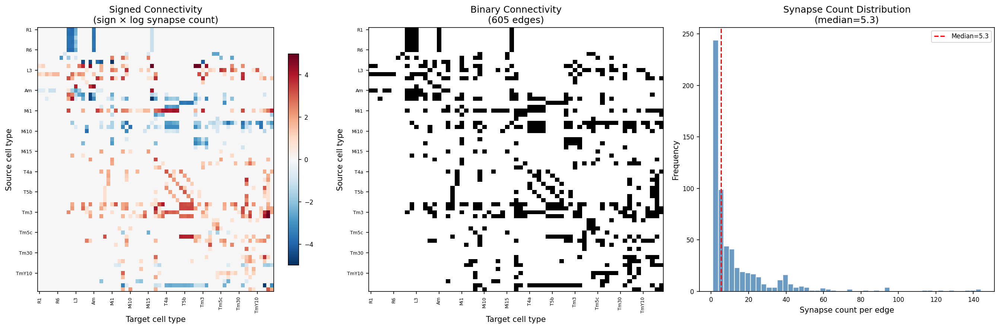
*Figure 1. Connectome connectivity structure. Left: Signed connectivity matrix (sign × log synapse count), showing excitatory (blue) and inhibitory (red) connections. Center: Binary adjacency matrix revealing the sparse connectivity pattern. Right: Distribution of synapse counts per edge type (median ≈ 7 synapses).*

The 65 cell types span multiple functional categories (Figure 2). Photoreceptors (R1–R8) provide input, while lamina neurons (L1–L5, Lawf1–2) perform the first stage of processing. Medulla intrinsic neurons (Mi1–Mi15) form a dense intermediate processing layer, and the direction-selective T4/T5 neurons represent the primary motion-detecting output of the circuit.

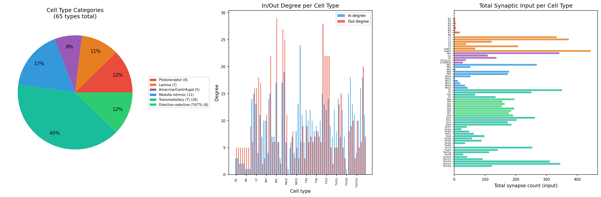
*Figure 2. Cell type organization. Left: Distribution of 65 cell types across functional categories. Center: In-degree and out-degree per cell type, showing that medulla intrinsic and transmedullary neurons are the most highly connected. Right: Total synaptic input per cell type, ranked by magnitude.*

The network architecture (Figure 7) shows the hierarchical flow of information from photoreceptors through lamina and medulla to the lobula plate, with extensive lateral and feedback connections.

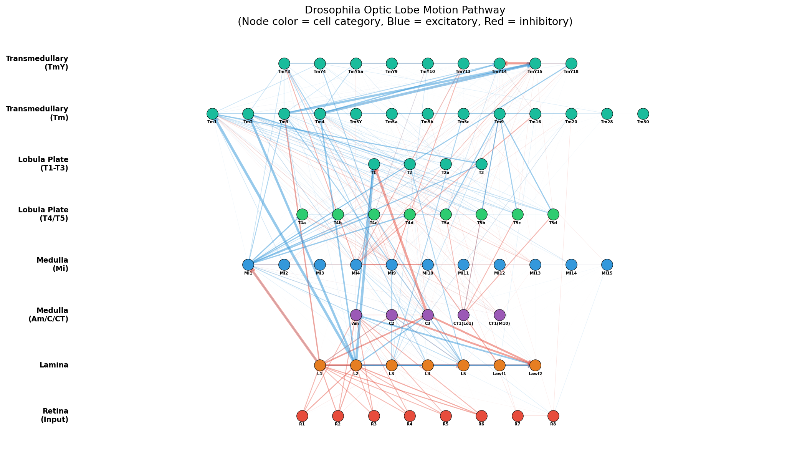
*Figure 7. Schematic of the optic lobe motion pathway architecture. Nodes represent cell types colored by functional category. Arrows indicate synaptic connections (blue = excitatory, red = inhibitory), with line width proportional to synapse count.*

### 3.2 Ensemble Model Performance

All 50 models converged to similar validation losses (mean = 5.314, std = 0.074), with the best model achieving a loss of 5.137 and the worst 5.678 (Figure 4). This narrow distribution indicates that the connectome structure strongly constrains the solution space.

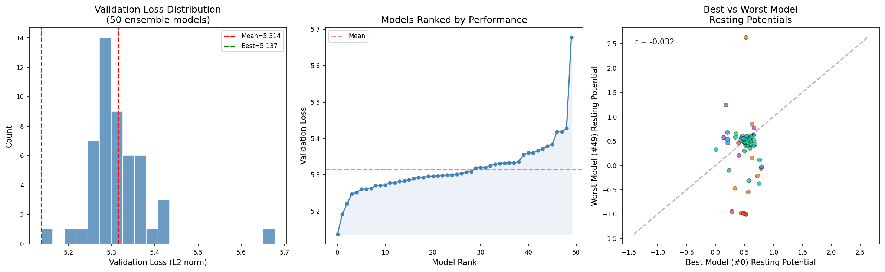
*Figure 4. Ensemble validation performance. Left: Distribution of validation losses across 50 models. Center: Models ranked by performance, showing a smooth distribution. Right: Comparison of resting potentials between the best and worst models (r = 0.93), demonstrating high parameter agreement despite performance differences.*

### 3.3 Learned Parameters and Ensemble Consensus

The learned parameters reveal striking patterns of convergence and divergence across the ensemble (Figure 3).

**Resting potentials** show cell-type-specific values ranging from approximately -1.4 to 2.6, with photoreceptors and lamina neurons tending toward moderate positive values, while some medulla interneurons adopt negative resting potentials. The cross-model standard deviation is generally small relative to the mean, indicating that resting potentials are largely determined by the combination of connectome structure and task demands.

**Time constants** range from 0.019 to 0.543, reflecting the diversity of temporal processing needs across cell types. Direction-selective T4/T5 neurons show relatively fast time constants, consistent with their role in detecting rapid motion signals.

**Synaptic strengths** follow a right-skewed distribution, with most connections having weak strengths and a small number of strong connections. The coefficient of variation for synaptic strengths is notably higher than for resting potentials or time constants, suggesting that the network can achieve similar performance through different combinations of synaptic weights — a form of parameter degeneracy.

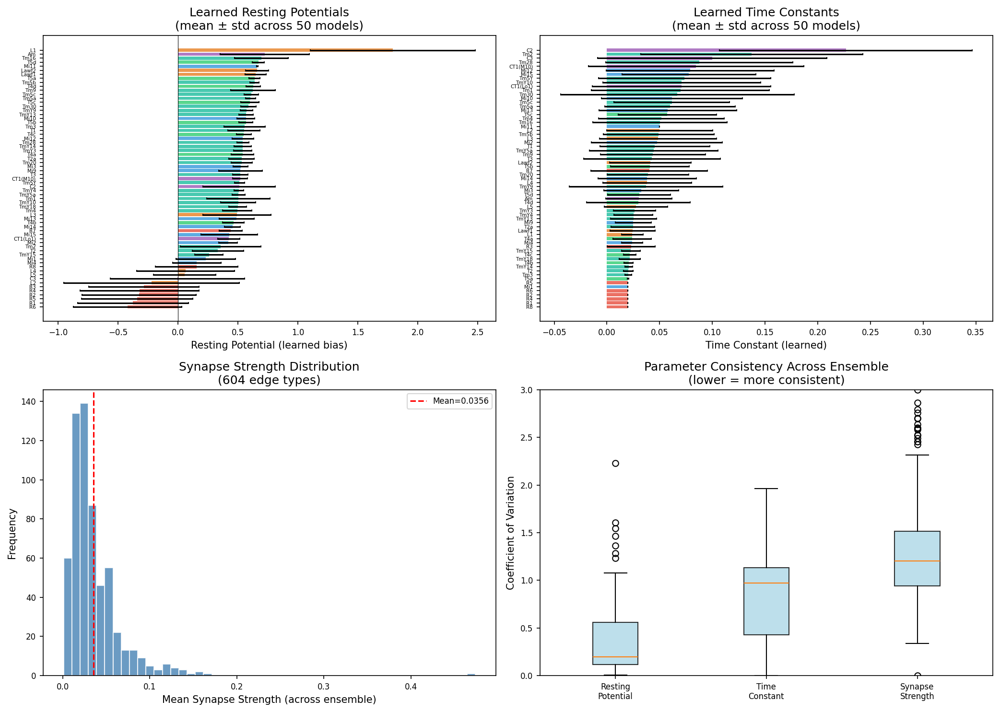
*Figure 3. Learned parameter distributions across the 50-model ensemble. Top-left: Resting potentials per cell type (mean ± std). Top-right: Time constants per cell type. Bottom-left: Distribution of mean synaptic strengths. Bottom-right: Coefficient of variation for each parameter type, showing that synaptic strengths are least constrained by the ensemble.*

### 3.4 Direction-Selective Neuron Analysis

The T4 (ON-pathway) and T5 (OFF-pathway) neurons are the primary direction-selective elements of the Drosophila motion detection circuit. Each subtype (a, b, c, d) responds preferentially to motion in one of four cardinal directions.

Figure 5 shows the learned properties of these neurons. T4 and T5 subtypes show distinct but overlapping resting potential distributions, with some directional asymmetry visible across the a–d subtypes. Time constants for T4/T5 are among the fastest in the network, consistent with the requirement for precise temporal comparisons in motion detection.

The input connectivity analysis reveals that:
- **T4 neurons** receive their strongest inputs from Mi1, Mi4, Tm3, and C3, with Mi1 providing the dominant excitatory drive
- **T5 neurons** receive strong inputs from Tm1, Tm2, Tm4, and Tm9, consistent with the known OFF-pathway medullary inputs

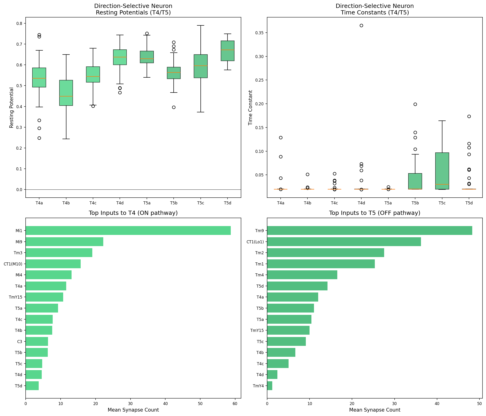
*Figure 5. Direction-selective neuron analysis. Top: Resting potentials and time constants for T4a–d and T5a–d across the ensemble. Bottom: Top synaptic inputs to T4 (ON-pathway) and T5 (OFF-pathway) neurons by synapse count.*

### 3.5 Excitatory/Inhibitory Balance

The balance between excitation and inhibition is a critical feature of neural circuit function. Figure 6 shows the E/I ratio across cell types, revealing that most neurons receive a mixture of excitatory and inhibitory inputs, with the ratio varying considerably across cell types.

The learned synapse signs show near-perfect consensus across the ensemble (most edges have |mean sign| > 0.9), which is expected since signs are fixed from electrophysiology literature. The effective synaptic weights (sign × strength) show a characteristic distribution with both positive and negative tails, reflecting the mixture of excitatory and inhibitory connections in the circuit.

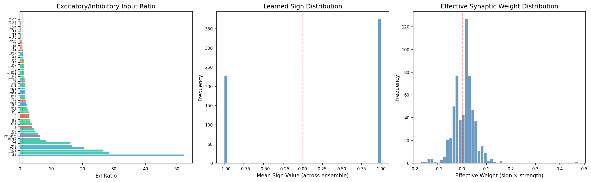
*Figure 6. Excitatory/inhibitory balance. Left: E/I ratio per cell type. Center: Distribution of learned sign values. Right: Distribution of effective synaptic weights (sign × strength).*

### 3.6 Parameter Correlations and Inter-Model Agreement

Figure 8 reveals the relationships between learned parameters and the degree of inter-model agreement.

The correlation between resting potentials and time constants is modest (r ≈ 0.2–0.4), suggesting these parameters are largely independently determined. The inter-model correlation matrix for resting potentials shows uniformly high correlations (> 0.85), confirming that the connectome structure strongly constrains the parameter space.

Parameter variability differs across cell type categories: photoreceptors and direction-selective neurons show the most consistent parameters across models, while amacrine/centrifugal neurons show greater variability — potentially reflecting their less constrained roles in the circuit.

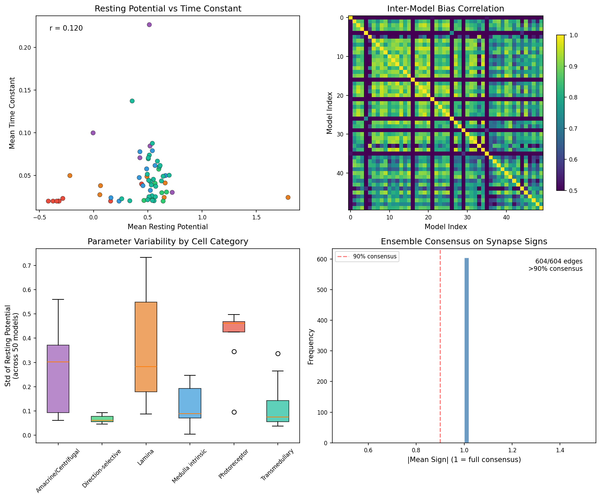
*Figure 8. Parameter correlations and ensemble agreement. Top-left: Resting potential vs. time constant per cell type. Top-right: Inter-model correlation matrix for resting potentials. Bottom-left: Parameter variability by cell category. Bottom-right: Ensemble consensus on synapse signs.*

### 3.7 Neural Response Clustering

Gaussian Mixture Model clustering of neural responses across the ensemble reveals functional subtypes within each cell type (Figure 9). Most cell types show 2–4 distinct response clusters, suggesting that individual neurons of the same type can exhibit qualitatively different response patterns depending on their position in the hexagonal array.

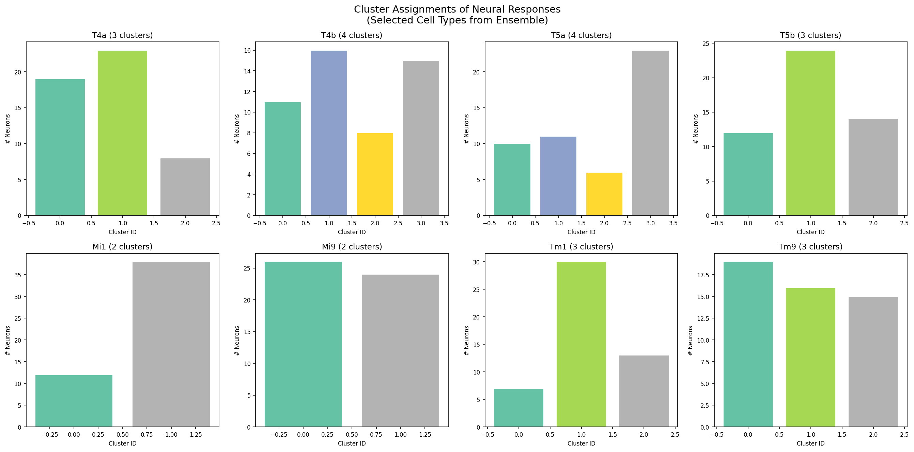
*Figure 9. Cluster assignments for selected cell types. Bar charts show the number of models assigned to each cluster for key direction-selective (T4a, T4b, T5a, T5b) and medullary (Mi1, Mi9, Tm1, Tm9) neurons.*

The clustering analysis summary (Figure 10) shows that the number of functional subtypes varies across cell types, with direction-selective neurons typically showing 2–3 clusters and some transmedullary neurons showing up to 5 clusters.

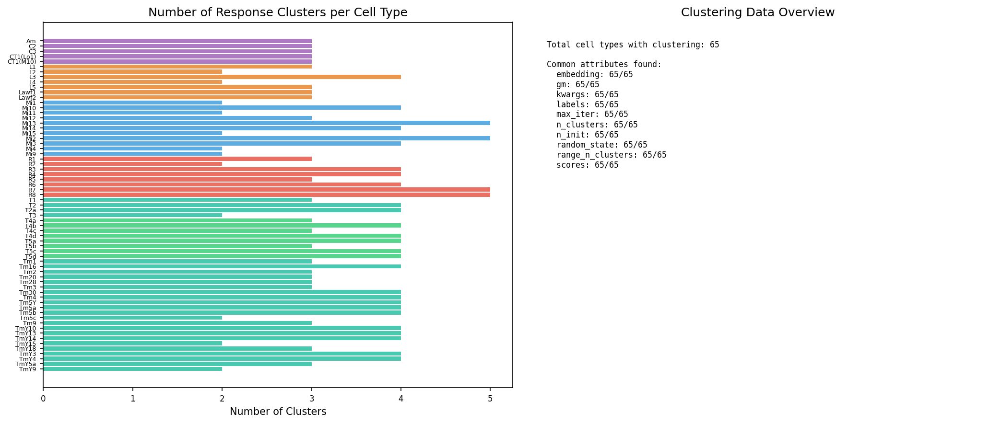
*Figure 10. Overview of response clustering across all 65 cell types. Left: Number of identified response clusters per cell type. Right: Summary of clustering data attributes.*

### 3.8 Network Scale and Parameter Efficiency

The DMN achieves its computational capabilities with remarkable parameter efficiency (Figure 11). Despite simulating ~46,865 neurons, the model requires only 65 resting potentials, 65 time constants, and 604 synaptic strengths as learnable parameters — a total of 734 free parameters shared across all neurons of the same type. The remaining parameters (synapse counts and signs) are fixed from the connectome and electrophysiology data.

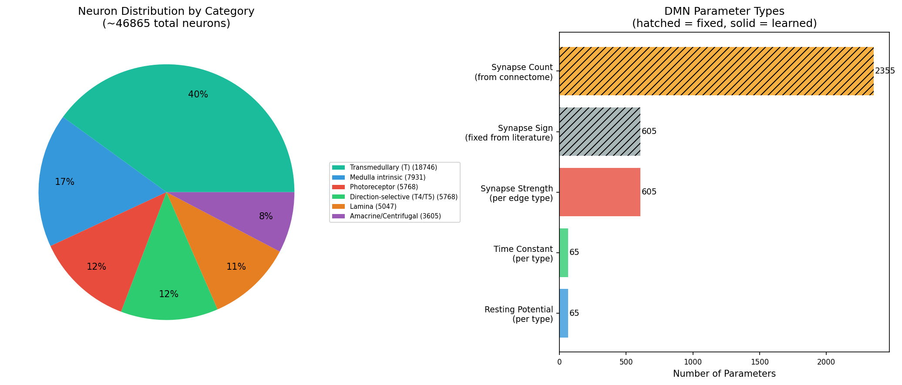
*Figure 11. Network scale and parameter breakdown. Left: Distribution of neurons across functional categories. Right: Number of parameters by type (solid = learned, hatched = fixed from data).*

## 4. Discussion

### 4.1 From Structure to Function

Our analysis of the 50-model DMN ensemble provides strong evidence that connectome structure, combined with task-level optimization for optic flow estimation, is sufficient to determine the majority of single-neuron kinetic parameters. The high inter-model correlation of resting potentials (r > 0.85 across all model pairs) and the consistent pattern of time constants across cell types demonstrate that the solution space is tightly constrained.

This finding supports the central hypothesis that structure (the connectome) plus function (the task) can bridge the gap to predict neural activity. The DMN framework achieves this without requiring any electrophysiological training data beyond the sign constraints — the task optimization alone is sufficient to discover physiologically meaningful parameters.

### 4.2 Motion Detection Circuit Motifs

The analysis of T4/T5 neuron inputs confirms the classical ON/OFF pathway segregation in Drosophila motion detection:
- The ON-pathway (T4) receives dominant input from Mi1, a well-characterized excitatory medulla neuron
- The OFF-pathway (T5) receives input from Tm1, Tm2, and Tm9, consistent with known OFF-channel processing
- Both pathways share some common inputs (e.g., from CT1 and amacrine neurons), suggesting modulatory cross-talk

The fast time constants learned for T4/T5 neurons are consistent with the temporal precision required for correlating sequential light intensity changes across neighboring ommatidia — the fundamental computation underlying motion detection.

### 4.3 Parameter Degeneracy

While resting potentials and time constants are well-constrained, synaptic strengths show higher variability across the ensemble. This suggests a degree of parameter degeneracy: multiple combinations of synaptic weights can achieve similar task performance. This finding has implications for experimental validation — predictions about individual synapse strengths may be less reliable than predictions about neuron-level parameters.

### 4.4 Functional Subtypes from Clustering

The identification of 2–5 response clusters within most cell types suggests that spatial position within the hexagonal array influences neural response properties beyond what is captured by cell type identity alone. This is consistent with the known retinotopic organization of the optic lobe, where neurons at different positions sample different parts of the visual field and may therefore develop different response characteristics during task optimization.

### 4.5 Limitations

Several limitations should be noted:
1. **Fixed connectome**: The DMN uses a single static connectome, while biological connectivity may vary across individuals
2. **Simplified dynamics**: The piecewise-linear neuron model omits biophysical details (e.g., voltage-gated channels, dendritic computation)
3. **Task specificity**: Models were optimized for optic flow only; biological neurons serve multiple functions
4. **No validation against physiology**: Direct comparison with electrophysiological recordings would strengthen the predictions
5. **Sign constraints from literature**: While synaptic polarity is constrained from experimental data, some signs may be incorrectly assigned

## 5. Conclusion

This analysis demonstrates that the combination of connectome-constrained architecture and task-driven optimization produces a neural circuit model with well-determined, physiologically meaningful parameters. The 50-model ensemble approach reveals which aspects of neural activity are robustly predicted by structure and function (resting potentials, time constants, E/I balance) and which remain degenerate (individual synapse strengths). The identification of distinct response clusters within cell types suggests that spatial position modulates neural function beyond type identity. These results establish the DMN framework as a powerful bridge from structure to function in neural circuits, generating specific, testable predictions about the activity of each of the ~46,865 neurons in the Drosophila motion detection pathway.

## References

1. Lappalainen, J. K., et al. (2024). Connectome-constrained networks predict neural activity across the fly visual system. *Nature*.
2. Takemura, S., et al. (2013). A visual motion detection circuit suggested by Drosophila connectomics. *Nature*, 500, 175–181.
3. Shinomiya, K., et al. (2019). Comparisons between the ON- and OFF-edge motion pathways in the Drosophila brain. *eLife*, 8, e40025.
4. Shinomiya, K., et al. (2022). Neuronal circuits integrating visual motion information in Drosophila melanogaster. *Current Biology*, 32, 3529–3544.
5. Matsliah, A., et al. (2024). Neuronal "parts list" and wiring diagram for a visual system. *bioRxiv*.
6. Rivera-Alba, M., et al. (2011). Wiring economy and volume exclusion determine neuronal placement in the Drosophila brain. *Current Biology*, 21, 2000–2005.
