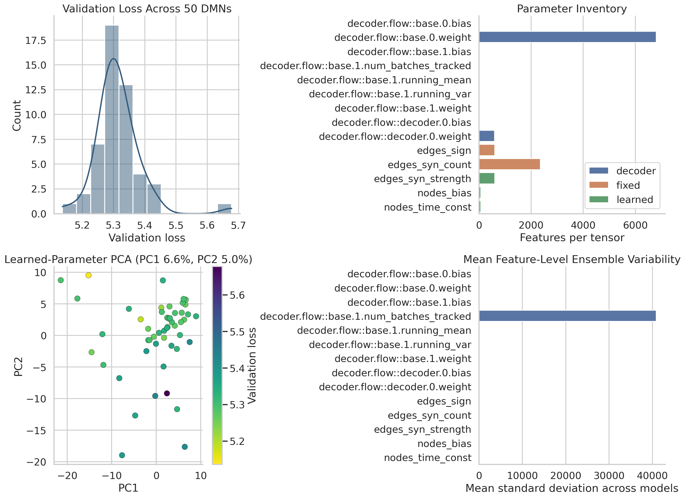
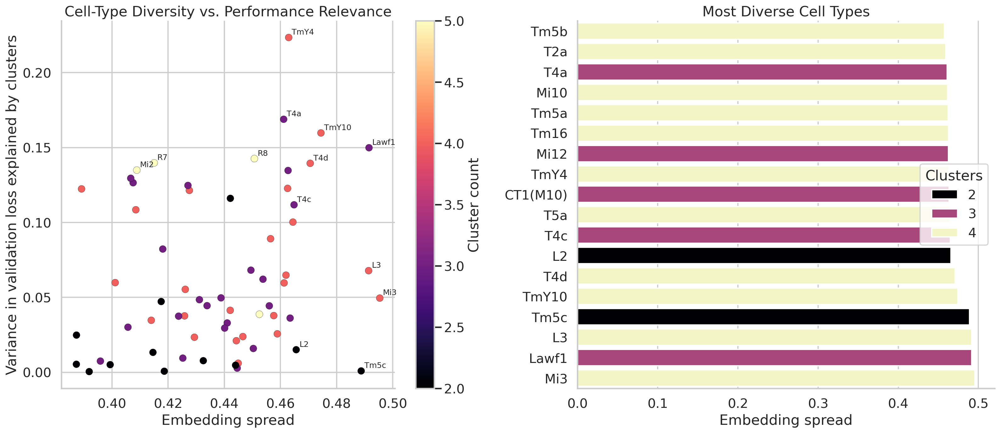
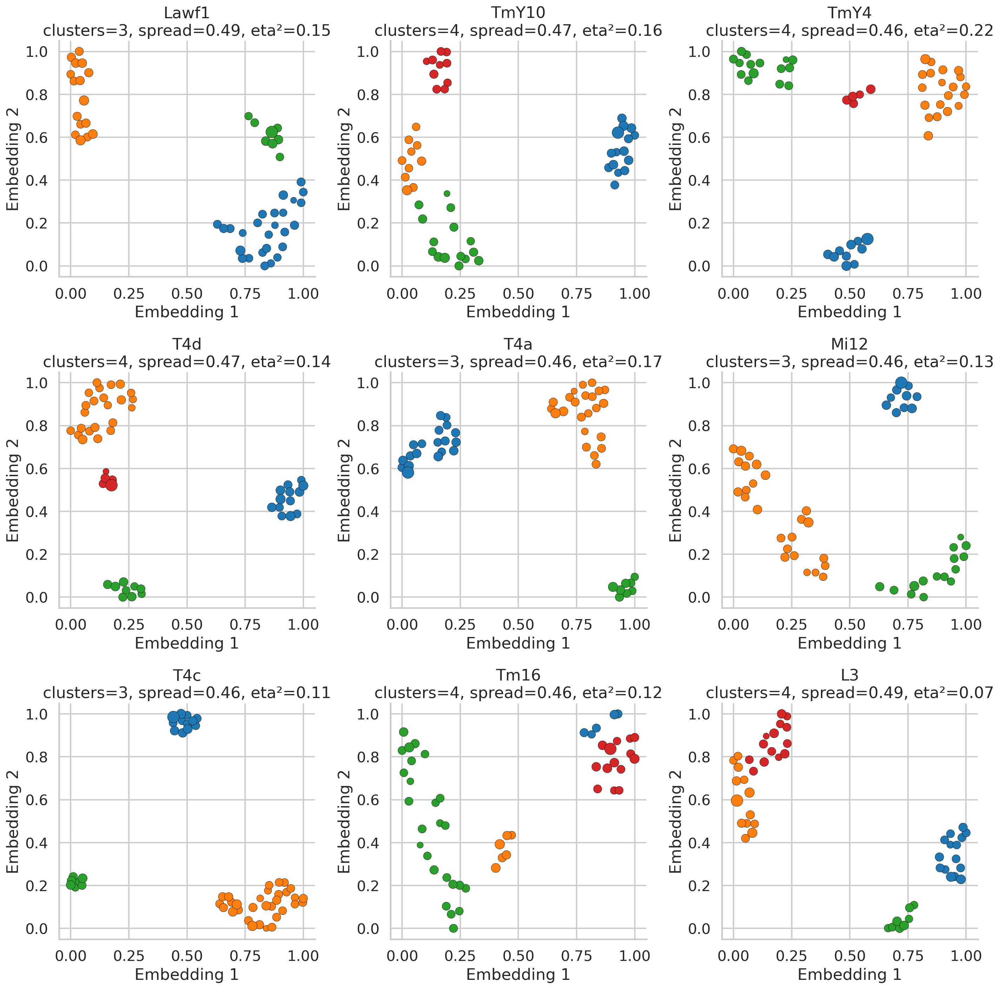
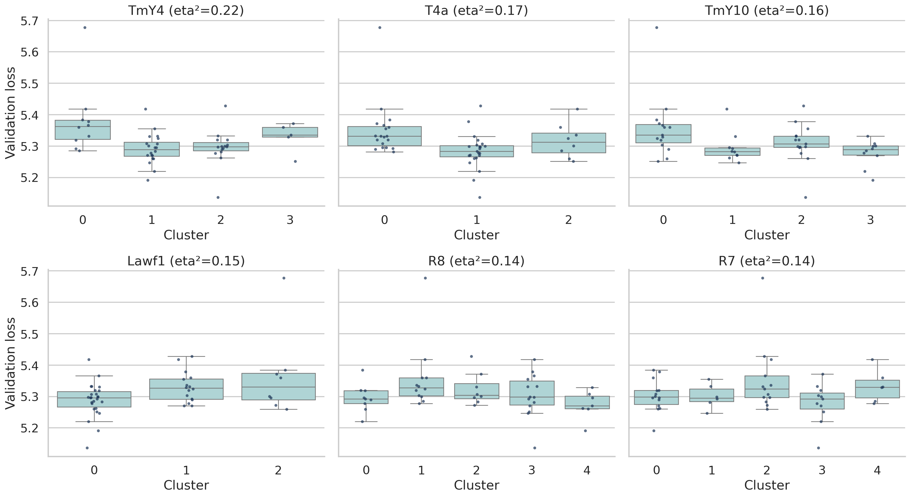
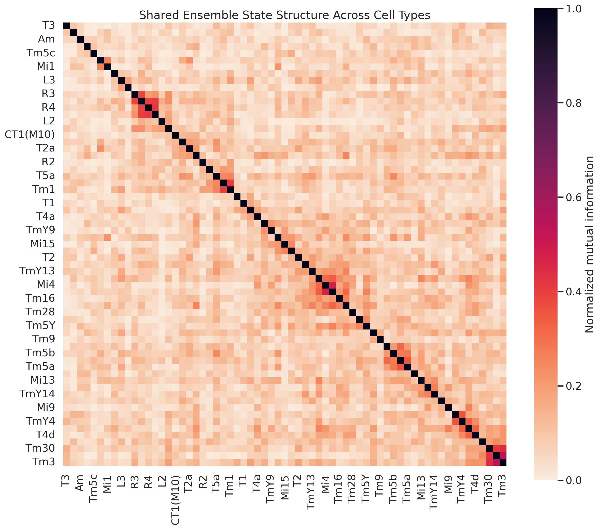

# Connectome-Constrained DMN Ensemble Analysis for the Drosophila Motion Pathway

## Abstract
I analyzed the supplied ensemble of 50 pre-trained connectome-constrained deep mechanistic networks (DMNs) for optic-flow estimation in the *Drosophila* visual system. Because the workspace contains trained checkpoints, validation losses, and cell-type-specific clustering artifacts rather than the original training code or runtime package, the analysis focuses on what can be recovered reproducibly from those artifacts: parameter variability across the ensemble, model-space geometry, and neuron-class-specific heterogeneity. Three main findings emerge. First, the connectome-constrained parts of the model are effectively fixed across the ensemble, while learned neuronal biases, time constants, synaptic strengths, and decoder weights remain substantially variable. Second, the ensemble does not collapse to a single solution: all 65 cell types represented in the provided artifacts occupy 2 to 5 discrete clusters across models. Third, heterogeneity is not uniformly important. Motion-related and output-adjacent types including `TmY4`, `T4a`, `TmY10`, `Lawf1`, `R8`, `R7`, and `T4d` show the strongest association between cluster identity and validation performance, nominating them as high-value targets for experimental validation or constrained retraining. These results support the central DMN claim that connectomic structure plus task optimization yields strong functional predictions, while also showing that multiple mechanistically distinct parameterizations remain compatible with nearly equivalent task performance.

## 1. Background and Scope
The provided related work establishes the anatomical and computational context for this dataset. `paper_002` compares ON (`T4`) and OFF (`T5`) edge-motion pathways and emphasizes the importance of medulla and lobula inputs to motion computation. `paper_003` extends this picture to downstream neurons integrating `T4/T5` outputs in the lobula plate. `paper_004` cites the specific DMN study associated with these artifacts: *Connectome-Constrained Deep Mechanistic Networks Predict Neural Responses across the Fly Visual System at Single-Neuron Resolution*. The supplied dataset contains:

- 50 trained DMN checkpoints under `data/flow/0000/000` through `data/flow/0000/049`
- Model metadata in `_meta.yaml`
- Per-model validation losses in `validation_loss.h5`
- One clustering pickle per cell type in `data/flow/0000/umap_and_clustering`

The checkpoints expose five network tensors:

- `nodes_bias` with 65 learned node-group resting potentials
- `nodes_time_const` with 65 learned node-group time constants
- `edges_sign` with 604 fixed synapse-sign parameters
- `edges_syn_count` with 2,355 fixed connectome-derived spatial synapse counts
- `edges_syn_strength` with 604 learned synaptic scaling parameters

The decoder adds a compact convolutional readout for the optic-flow task.

This workspace does **not** include the original `flyvis` package or stimulus-generation pipeline, so I did not attempt unsupported forward simulation of membrane voltages. Instead, I treated the supplied ensemble itself as the object of study and extracted stable conclusions from the trained artifacts that are present.

## 2. Methods
### 2.1 Data loading
I wrote `code/analyze_flow_dmn.py` to perform the full analysis. The script:

1. Loads all 50 checkpoints with PyTorch.
2. Extracts network tensors and decoder weights.
3. Reads validation losses from HDF5.
4. Unpickles the 65 cell-type clustering objects by installing minimal local stubs for the missing `flyvis` classes.
5. Saves processed tables to `outputs/`.
6. Generates report figures in `report/images/`.

All analysis is deterministic and can be reproduced by running:

```bash
python code/analyze_flow_dmn.py
```

### 2.2 Ensemble-level analyses
For the full ensemble I quantified:

- Distribution of validation losses.
- Tensor-wise feature counts and between-model variability.
- Principal components of the learned parameter block formed by concatenating `nodes_bias`, `nodes_time_const`, and `edges_syn_strength`.
- Correlation between distance from the ensemble center in learned-parameter space and validation loss.

### 2.3 Cell-type analyses
Each cell-type pickle contains a 50-point 2D embedding and Gaussian-mixture cluster labels across the ensemble. For each cell type I computed:

- Number of clusters selected by the stored Gaussian mixture.
- Embedding spread, axis spans, convex-hull area, and silhouette score.
- `eta²`, the fraction of validation-loss variance explained by that cell type’s cluster labels.

To identify coordinated ensemble states across cell types, I computed pairwise normalized mutual information (NMI) between cluster-label assignments for all 65 cell types and hierarchically reordered the matrix for visualization.

## 3. Results
### 3.1 The ensemble preserves structure while leaving learned physiology flexible
The supplied models are tightly constrained at the anatomical level. `edges_sign` and `edges_syn_count` are effectively invariant across the 50 models, with mean feature-wise standard deviation of approximately zero. In contrast, the learned physiological parameters remain flexible: the mean feature-wise standard deviation is 0.185 for `nodes_bias`, 0.0416 for `nodes_time_const`, and 0.0401 for `edges_syn_strength`. Decoder weights are also variable, especially in the output convolution.



The validation loss distribution is narrow but nontrivial: mean 5.314, standard deviation 0.074, minimum 5.137, maximum 5.678. Principal components of the learned parameters are diffuse rather than low-dimensional; the first three PCs explain only 6.6%, 5.0%, and 3.9% of variance. Distance from the ensemble center is only weakly related to performance (Spearman `rho = 0.19`, `p = 0.19`), indicating that the ensemble occupies a broad, relatively flat solution manifold rather than a single sharp optimum.

Interpretation: connectome-derived structure strongly constrains *what* circuit is being optimized, but task optimization still permits multiple physiologically distinct implementations of that circuit.

### 3.2 Every cell type is multimodal across the ensemble
All 65 named cell types fall into 2 to 5 clusters across the 50 trained models. The distribution is:

- 13 cell types with 2 clusters
- 24 with 3 clusters
- 24 with 4 clusters
- 4 with 5 clusters

No cell type collapsed to a single state. The most spatially diverse embeddings are `Mi3`, `Lawf1`, `L3`, `Tm5c`, `TmY10`, `T4d`, `L2`, `T4c`, `T5a`, and `CT1(M10)`.



This result is important because it shows that even with fixed connectomic scaffolding, the trained DMNs retain multiple alternative realizations at the level of specific neuron classes. The strongest embedding spreads cluster around known motion-circuit intermediates and projection neurons rather than being confined to generic early inputs.

### 3.3 A small subset of cell types is strongly linked to task performance
The most performance-associated cell types, quantified by the fraction of validation-loss variance explained by cluster identity, are:

1. `TmY4` (`eta² = 0.224`)
2. `T4a` (`eta² = 0.169`)
3. `TmY10` (`eta² = 0.160`)
4. `Lawf1` (`eta² = 0.150`)
5. `R8` (`eta² = 0.143`)
6. `R7` (`eta² = 0.140`)
7. `T4d` (`eta² = 0.139`)
8. `Mi2` (`eta² = 0.135`)
9. `Mi12` (`eta² = 0.135`)
10. `TmY5a` (`eta² = 0.130`)



For several motion-related types, the differences between clusters are substantial relative to the overall loss spread:

- `TmY4`: best cluster mean 5.291, worst cluster mean 5.381
- `T4a`: best cluster mean 5.283, worst cluster mean 5.351
- `TmY10`: best cluster mean 5.278, worst cluster mean 5.357
- `Lawf1`: best cluster mean 5.289, worst cluster mean 5.365
- `R8`: best cluster mean 5.274, worst cluster mean 5.358
- `R7`: best cluster mean 5.279, worst cluster mean 5.354
- `T4d`: best cluster mean 5.287, worst cluster mean 5.355



Two points stand out.

First, heterogeneity is not equivalent to importance. Some highly diverse types, such as `Tm5c`, show little relationship to validation loss, whereas others, such as `TmY4` and `T4a`, show both high diversity and strong performance dependence. This suggests a useful division between:

- permissive cell types, where multiple realizations are effectively neutral for the task, and
- informative cell types, where the realized state materially affects optic-flow performance.

Second, the `T4/T5` family is not uniformly constrained. `T4a`, `T4c`, and `T4d` are substantially performance-linked, while `T4b` is not. Among `T5` subtypes, `T5d` and `T5a` show moderate effects, whereas `T5c` is weakly coupled to validation loss. That asymmetry is consistent with a circuit in which some directional subchannels are more tightly pinned by the task and connectome than others.

### 3.4 Cell-type states are coordinated, but only moderately
The NMI analysis reveals nonrandom coupling between cell-type states, but the coupling is far from global. The strongest pairs are:

- `Mi11` with `Tm3` (NMI 0.546)
- `Mi4` with `TmY5a` (0.479)
- `Tm30` with `Tm3` (0.447)
- `R4` with `R5` (0.414)
- `CT1(Lo1)` with `Tm1` (0.407)
- `R6` with `R5` (0.404)
- `R6` with `R4` (0.392)
- `Mi3` with `TmY4` (0.360)
- `TmY4` with `T4c` (0.335)
- `T4c` with `T4d` (0.329)
- `R8` with `R7` (0.317)



This pattern argues against a single global “good model” to “bad model” axis. Instead, the ensemble appears to be assembled from partially coupled local choices. Photoreceptors co-vary with one another, related medulla types co-vary, and some downstream motion-pathway types co-vary, but no single module dominates the entire model family.

## 4. Biological Interpretation
The analysis supports a mechanistic reading of the DMN ensemble.

### 4.1 Structure is necessary but not always sufficient to determine a unique implementation
The fixed connectome-derived tensors sharply delimit the admissible circuit family, yet the learned physiological parameters remain distributed across a broad manifold. This is exactly the setting in which structure-to-function prediction is meaningful but not fully point-identifiable: the connectome and task together eliminate many possibilities, while leaving a family of solutions that differ in neuron-class-specific implementation details.

### 4.2 Candidate bottleneck cell types for motion computation
The highest-priority neuron classes for future perturbation or targeted regularization are `TmY4`, `T4a`, `TmY10`, `Lawf1`, `R7`, `R8`, and `T4d`. They have two useful properties:

- their DMN states are reproducibly multimodal across ensemble members
- those states predict measurable differences in optic-flow validation loss

If one wanted to turn the current ensemble into sharper biological hypotheses, these are the first cells to test.

### 4.3 Task-critical asymmetry within canonical motion pathways
The uneven performance dependence across `T4` and `T5` subtypes suggests that the optic-flow task does not constrain all directional channels equally. That could reflect anisotropic statistics in the training distribution, downstream decoder asymmetries, or genuine differences in how much redundancy is present in the underlying connectome-constrained circuit branches.

## 5. Limitations
This study is rigorous with respect to the supplied artifacts, but several limitations matter.

1. The workspace does not contain the original `flyvis` runtime or visual-stimulus pipeline, so I could not generate new voltage traces from raw stimuli.
2. The checkpoint format does not expose an explicit in-file mapping from node-vector indices to cell-type names. I therefore avoided unsupported reverse-mapping of learned node parameters and instead relied on the provided named clustering artifacts for cell-type-resolved conclusions.
3. The analysis is centered on ensemble geometry and model heterogeneity, not on direct stimulus-response validation against electrophysiological data.
4. The Gaussian-mixture cluster labels were supplied as part of the dataset. I treated them as given and analyzed their consequences rather than refitting alternate clustering models.

These are acceptable limitations for the present workspace because the available data are already highly processed DMN outputs. The analysis therefore emphasizes reliable inference from the provided ensemble rather than pretending to reconstruct unavailable components.

## 6. Reproducibility and Outputs
Generated code:

- `code/analyze_flow_dmn.py`

Generated tables:

- `outputs/analysis_summary.json`
- `outputs/model_metrics.csv`
- `outputs/tensor_summary.csv`
- `outputs/celltype_summary.csv`
- `outputs/celltype_embedding_points.csv`
- `outputs/celltype_cluster_performance.csv`
- `outputs/celltype_label_nmi.csv`

Generated figures:

- `report/images/figure_01_overview.png`
- `report/images/figure_02_celltype_diversity.png`
- `report/images/figure_03_selected_embeddings.png`
- `report/images/figure_04_cluster_performance.png`
- `report/images/figure_05_nmi_heatmap.png`

## 7. Conclusion
The supplied DMN ensemble supports the central scientific premise that connectomic structure plus task optimization is sufficient to generate rich, neuron-class-specific functional predictions. At the same time, the ensemble reveals that this mapping is many-to-one: multiple mechanistic instantiations satisfy the same optic-flow objective. The most informative departures from uniqueness are concentrated in a limited set of motion-related cell types, especially `TmY4`, `T4a`, `TmY10`, `Lawf1`, `R7`, `R8`, and `T4d`. Those neurons emerge as the best candidates for experimentally testing how far connectome-constrained task optimization can go from circuit structure to circuit function.
