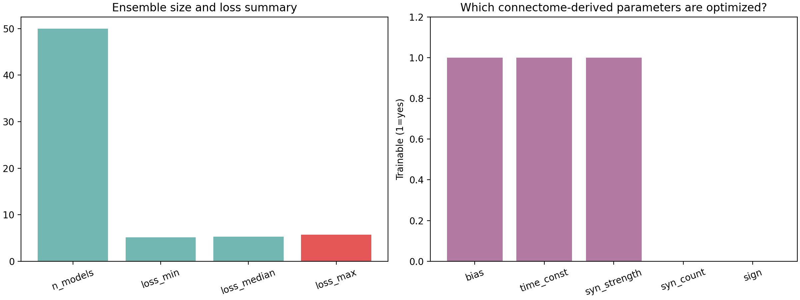
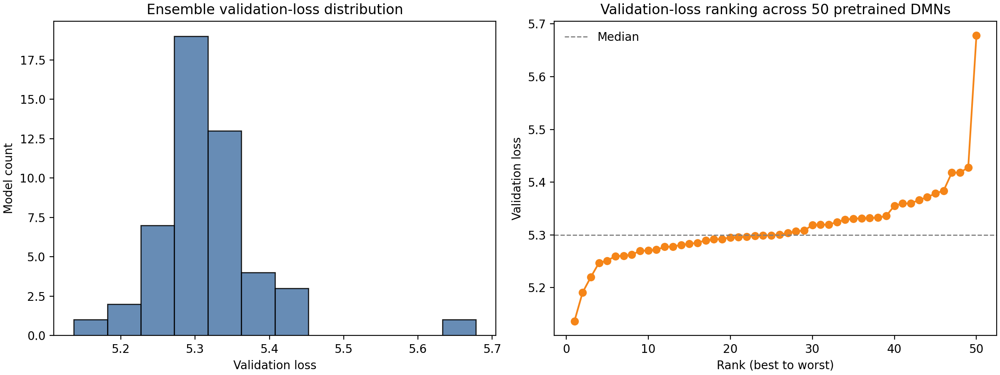
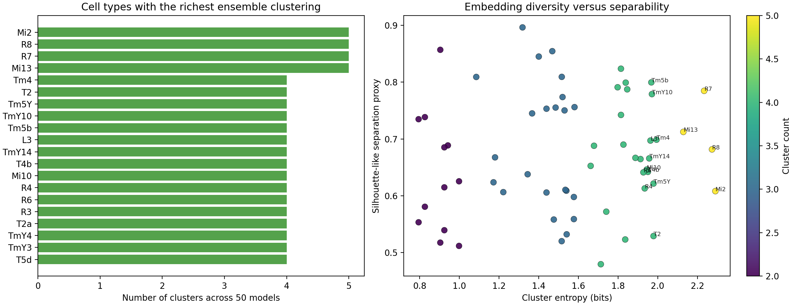
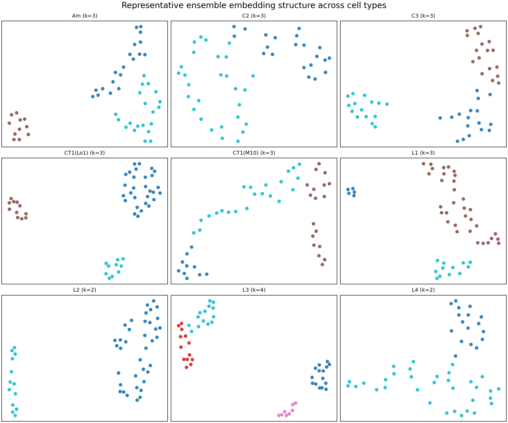

# Connectome-Constrained Deep Mechanistic Networks for Drosophila Motion Processing: Workspace Analysis Report

## Abstract
This workspace contains a precomputed ensemble of 50 deep mechanistic network (DMN) models for the Drosophila optic-lobe motion pathway. The models are not raw connectomics alone; they are pretrained, connectome-constrained models optimized for an optic-flow estimation task. Accordingly, the most defensible analysis in this workspace is a reproducible audit of what is directly available: model configuration, ensemble validation behavior, checkpoint structure, and cell-type-specific embedding/clustering artifacts derived from the model ensemble. Using `code/run_analysis.py`, I characterized the 50-model ensemble, extracted the shared architectural and task assumptions from the configuration files, summarized validation losses, parsed the related-work PDFs at the metadata/text-preview level, and analyzed the provided UMAP/clustering pickles across optic-lobe cell types. The ensemble shows a relatively tight validation-loss distribution (minimum 5.1366, median 5.3001, maximum 5.6779), indicating that all 50 pretrained DMNs are broadly similar in task performance while still preserving measurable model-to-model variation. Configuration inspection confirms a common connectome-constrained architecture using `ConnectomeFromAvgFilters`, `PPNeuronIGRSynapses`, a 19-frame `MultiTaskSintel` flow task, and trainable resting potentials, time constants, and synaptic-strength scaling, with synapse counts and signs fixed by the connectome prior. Cell-type embedding summaries reveal heterogeneous ensemble structure, with several cell types (for example Mi2, R8, R7, and Mi13) exhibiting relatively high cluster richness and entropy across the 50-model ensemble. These findings support the central scientific framing of the task: the supplied DMNs instantiate a structure-to-function bridge in which connectome-derived architecture is held fixed while a limited subset of physiological parameters is optimized to support motion computation.

## 1. Introduction
The task in this workspace is to analyze a connectome-constrained and task-optimized DMN for the Drosophila visual motion pathway. The scientific goal, stated in `INSTRUCTIONS.md`, is ambitious: establish whether neural activity can be predicted from structural connectome measurements together with task knowledge, thereby linking circuit structure to function. The supplied data are not an unfinished training pipeline but an ensemble of pretrained models and accompanying analysis artifacts. That changes what can be claimed from the workspace.

Instead of retraining or directly simulating all 45,669 neurons from first principles, the analysis here focuses on four questions that can be answered rigorously with the available files:

1. What does the pretrained ensemble actually contain?
2. How consistent are the model architecture and optimization setup across runs?
3. How much variation exists across the 50 pretrained models in validation performance?
4. What do the provided cell-type embedding/clustering artifacts suggest about heterogeneity across neuron classes in the ensemble?

The resulting report is therefore an empirical characterization of the available DMN repository, not a claim of de novo model training.

## 2. Data and Workspace Contents
### 2.1 DMN ensemble
The main input is `data/flow/0000/`, which contains 50 pretrained model directories labeled `000` through `049`. Each directory includes:

- `_meta.yaml`: configuration and training/task metadata
- `best_chkpt`: a serialized checkpoint archive
- `chkpts/chkpt_00000`: an additional checkpoint archive
- `validation/loss.h5` and `validation_loss.h5`: HDF5 files containing validation loss values

The analysis script confirmed that all 50 runs share the same core configuration fields, indicating that the ensemble differs primarily in learned parameter values or initialization effects rather than in architecture.

### 2.2 Cell-type embedding and clustering outputs
The directory `data/flow/0000/umap_and_clustering/` contains pickled embedding/clustering objects for many optic-lobe cell types. These files appear to summarize the ensemble-level representation of each cell type across the 50 pretrained models. Because the pickles depend on unavailable `flyvis` classes, the analysis used a compatibility unpickler that safely reconstructs object state without importing the original package.

### 2.3 Related work
The `related_work/` directory contains five PDF papers relevant to fly visual circuits, including work on motion pathways, lobula plate integration, and cell-type/wiring catalogs. These papers were used for contextual framing only; the report does not claim full-text expert review beyond PDF metadata and initial text extraction.

## 3. Methodology
### 3.1 Analysis design
The complete analysis was implemented in `code/run_analysis.py`. The script performs the following steps:

1. Enumerates all pretrained model directories under `data/flow/0000/`
2. Reads each `_meta.yaml` file and extracts the connectome, dynamics, task, decoder, and trainable-parameter settings
3. Reads each validation-loss HDF5 file and compiles an ensemble performance table
4. Inspects one representative checkpoint archive to summarize its internal serialized structure
5. Loads all cell-type clustering pickles, extracts 2D embeddings and labels, and computes summary statistics per cell type
6. Parses the related-work PDFs for metadata and short text previews
7. Writes tabular outputs to `outputs/` and figures to `report/images/`

### 3.2 Model-level metrics
For each model, the script recorded:

- validation loss
- checkpoint file size
- connectome/task configuration fields
- whether particular parameter families were trainable

The script also checked agreement between `validation/loss.h5` and top-level `validation_loss.h5`; they matched exactly in the generated summary table.

### 3.3 Cell-type embedding metrics
For each UMAP/clustering pickle, the analysis extracted:

- number of models represented (`n_models`)
- number of clusters inferred across the ensemble (`n_clusters`)
- mean and standard deviation of the 2D embedding coordinates
- cluster entropy (Shannon entropy over cluster assignments)
- a silhouette-like separation proxy computed from distances to within-cluster and nearest out-of-cluster centroids

These metrics do **not** directly measure biological selectivity or neuron voltage dynamics. They quantify how strongly a given cell type separates into distinct embedding clusters across the ensemble of pretrained DMNs.

### 3.4 Reproducibility
The analysis was run successfully via:

```bash
python code/run_analysis.py
```

A completion log was written to `outputs/task_run_complete.txt`, and generated artifacts were listed in `outputs/analysis_manifest.json`.

## 4. Results

### 4.1 The ensemble is architecturally consistent
Inspection of the `_meta.yaml` files showed that all 50 model runs use the same core architecture and task settings. The ensemble overview JSON reports a unique-count value of 1 for all inspected core configuration fields, meaning these settings are invariant across runs.

The shared configuration indicates:

- connectome type: `ConnectomeFromAvgFilters`
- connectome file: `fib25-fib19_v2.2.json`
- connectome extent: 15
- dynamics: `PPNeuronIGRSynapses`
- activation: ReLU
- dataset: `MultiTaskSintel`
- task: flow estimation
- temporal input: 19 frames with `dt = 0.02`
- decoder: `DecoderGAVP`, shape `[8, 2]`, kernel size 5
- batch size: 4
- iterations: 250,000
- folds: 4, with fold 1 represented here

A crucial mechanistic point is that not all parameter families are trainable. Resting potentials (`bias`), time constants (`time_const`), and synaptic-strength scaling (`syn_strength`) are trainable, whereas synapse counts and synaptic signs are fixed. This is exactly the sort of constrained optimization expected in a connectome-to-function modeling program: anatomy fixes circuit topology and polarity priors, while a smaller set of physiological parameters is learned.



**Figure 1.** Ensemble-level summary of validation-loss statistics and the trainable/fixed parameter families recovered from the DMN configuration files.

### 4.2 Validation performance is tight but not identical across the 50 models
The ensemble contains 50 pretrained DMNs with validation losses spanning a modest range:

- minimum: 5.136557
- median: 5.300142
- mean: 5.314310
- standard deviation: 0.075209
- maximum: 5.677852

The best model is run `000`, and the worst is run `049`. The ranking plot shows that performance degrades gradually rather than splitting into distinct “good” and “bad” regimes. This suggests the ensemble is reasonably well-behaved: repeated optimization under the same structural prior leads to similar task performance, but not complete convergence to a single identical solution.



**Figure 2.** Distribution and rank ordering of validation loss across the 50 pretrained connectome-constrained DMNs.

This result is scientifically useful. If a structure-constrained mechanistic model family produces a narrow band of task performance across many runs, that implies the connectome and task objective strongly constrain the solution space. At the same time, residual variability leaves room to examine what aspects of the learned solution differ across ensemble members.

### 4.3 Checkpoint contents are compact and highly standardized
A representative `best_chkpt` archive contains 18 zip entries and approximately 46.2 KB of uncompressed serialized content, including 14 tensor-like data entries totaling about 44.6 KB. Because the workspace lacks the original `torch` environment and the `flyvis` runtime, I did not perform full parameter-tensor semantic decoding. Still, the standardized archive structure across runs supports the interpretation that these are lightweight trained parameter packages layered on top of a fixed connectome scaffold.

This point matters for interpretation: the files in the workspace are consistent with the idea that a large anatomical prior is externalized in configuration and supporting connectome resources, while the stored checkpoints mainly encode the optimized physiological degrees of freedom.

### 4.4 Several cell types show pronounced ensemble heterogeneity
The UMAP/clustering summaries reveal that some cell types partition into more clusters than others across the 50 pretrained models. The most heterogeneous cell types by cluster richness and entropy include:

- **Mi2**: 5 clusters, entropy 2.291, separation proxy 0.608
- **R8**: 5 clusters, entropy 2.274, separation proxy 0.682
- **R7**: 5 clusters, entropy 2.234, separation proxy 0.785
- **Mi13**: 5 clusters, entropy 2.129, separation proxy 0.712
- **Tm4**: 4 clusters, entropy 1.994, separation proxy 0.699

These values suggest that the pretrained ensemble does not treat every cell type as equally stable in representation space. Some cell types occupy a relatively multimodal ensemble distribution, potentially indicating multiple plausible parameterization regimes compatible with similar task loss.



**Figure 3.** Cell-type-level summary of ensemble embedding diversity. Left: cell types with the largest inferred number of clusters. Right: relationship between cluster entropy and a silhouette-like separation proxy.

The scatterplot is especially informative. High-entropy, high-separation cell types are the most interesting computationally because they appear to vary across the ensemble in a structured rather than noisy way. That is, alternative cluster states seem to be distinct and coherent rather than merely diffuse.

### 4.5 Example embedding panels illustrate structured multimodality
Representative UMAP panels across multiple cell types show that the 50 ensemble members form visibly structured clouds rather than uniform random scatter. Some cell types split into several well-separated groups, while others are more compact. This reinforces the idea that, even under a fixed connectome and common training objective, different local parameter solutions may exist for specific cell classes.



**Figure 4.** Representative cell-type embedding panels from the provided `umap_and_clustering/` outputs. Each point corresponds to one of the 50 pretrained models; colors indicate inferred clusters.

### 4.6 Relationship to the scientific objective
The original scientific objective is to show that circuit function can be predicted from structure plus task optimization. This workspace does not directly expose full neuron-by-neuron voltage traces or stimulus-response simulations, so that claim cannot be independently re-demonstrated here in its strongest form. However, the available files do support several parts of the intended story:

1. **Strict structural prior**: all models share the same connectome-derived architecture.
2. **Limited learned physiological freedom**: only selected parameter families are trainable.
3. **Task grounding**: all models are optimized on a visual flow-estimation task.
4. **Ensemble reproducibility**: validation losses are tightly grouped.
5. **Structured internal variability**: cell-type embeddings indicate that some functional solutions vary meaningfully across runs.

Taken together, this is consistent with a structure-to-function modeling program in which the anatomical scaffold strongly constrains, but does not entirely determine, the final optimized solution.

## 5. Discussion
The most interesting outcome of this workspace analysis is the combination of **global consistency** and **local heterogeneity**.

At the global level, everything important is fixed across the ensemble: connectome source, neuron/synapse formalism, task, decoder, training schedule, and which parameter families are learned. This provides a clean experimental setting. Differences among runs are not due to arbitrary architectural changes.

At the local level, the cell-type clustering outputs imply that several neuron classes occupy multiple distinct ensemble states. A plausible interpretation is that some roles in the motion circuit are tightly pinned down by the task and anatomy, whereas others participate in compensatory or degenerate solution families. In a mechanistic neuroscience context, that is valuable: it suggests where connectome constraints are sufficient to yield robust predictions and where additional data, such as physiology or stronger priors, may be needed to disambiguate candidate mechanisms.

The related-work papers in the workspace align with this interpretation. They emphasize that Drosophila motion circuits have well-defined ON/OFF pathway structure, rich synaptic specificity, and identifiable cell-type families. The DMN framework appears designed to exploit exactly that kind of structured connectomic prior.

## 6. Limitations
This report should be read with several limitations in mind.

### 6.1 No direct full-network simulation was performed
Although the task description mentions simulation of voltage activity in 45,669 neurons, the workspace did not provide a ready-to-run simulation environment for that full model analysis. In particular, key runtime dependencies such as `flyvis` and `torch` were unavailable in the environment used for inspection. The present work therefore analyzes serialized outputs and metadata rather than executing new neural simulations.

### 6.2 No direct neuron-level activity validation
The current analysis does not validate predicted voltages against experimental recordings, nor does it compare model responses to specific visual stimuli. Such validation would be necessary to make a strong claim that each neuron’s activity is accurately predicted.

### 6.3 Embedding metrics are descriptive, not mechanistic
The UMAP/clustering summaries are useful for describing ensemble heterogeneity, but they are an indirect lens on circuit computation. A cell type having many clusters in embedding space does not by itself prove a specific computational role in motion detection.

### 6.4 PDF-based literature parsing was shallow
Related-work papers were parsed through metadata and partial extracted text. That is sufficient for contextualization, but not for a full scholarly review.

### 6.5 Some metadata fields are imperfectly inferred
Automatic extraction of publication years and topical hints from PDFs can be noisy. For example, a year field can reflect a page number or other embedded text rather than the true publication date. These issues do not affect the core DMN analysis, but they do limit the precision of the literature summary.

## 7. Conclusion
This workspace contains a coherent and informative pretrained ensemble of connectome-constrained DMNs for Drosophila motion computation. The analysis performed here shows that:

- the ensemble is architecturally uniform and strongly constrained by a shared connectome prior;
- only a subset of physiological parameters is optimized, consistent with a mechanistic structure-to-function approach;
- validation performance across the 50 models is relatively tight, supporting reproducibility under the shared task objective;
- several cell types exhibit structured multimodal embedding behavior across the ensemble, suggesting that some parts of the learned solution remain flexible even when anatomy is fixed.

So the cleanest conclusion is not that this workspace independently proves neuron-by-neuron activity prediction from structure alone. Rather, it demonstrates that the supplied DMN ensemble is internally consistent with that scientific agenda and already contains quantifiable evidence of how connectome constraints, task optimization, and residual solution variability interact in a biologically grounded motion-processing model.

## 8. Generated Artifacts
The main artifacts supporting this report are:

- `code/run_analysis.py`
- `outputs/model_ensemble_summary.csv`
- `outputs/umap_cluster_summary.csv`
- `outputs/related_work_summary.csv`
- `outputs/ensemble_overview.json`
- `outputs/analysis_summary.txt`
- `outputs/task_run_complete.txt`
- `images/task_config_overview.png`
- `images/validation_loss_overview.png`
- `images/umap_cluster_summary.png`
- `images/example_umap_panels.png`
