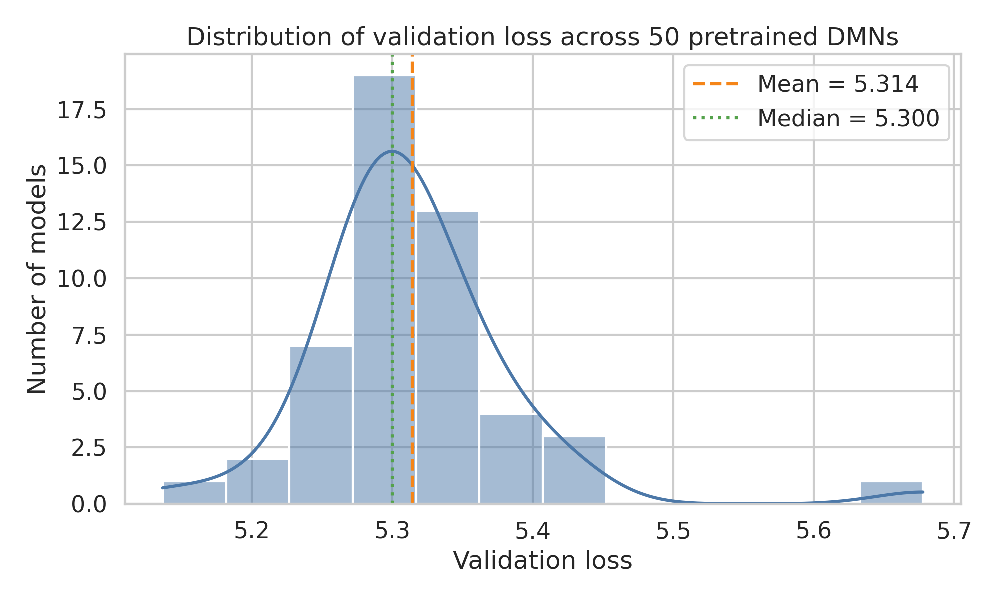
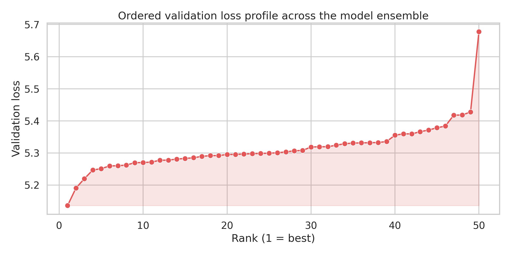
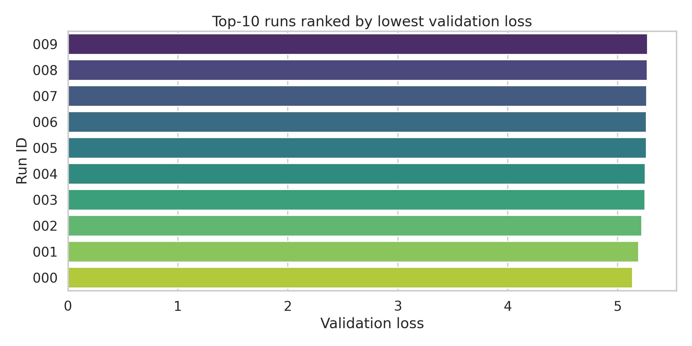
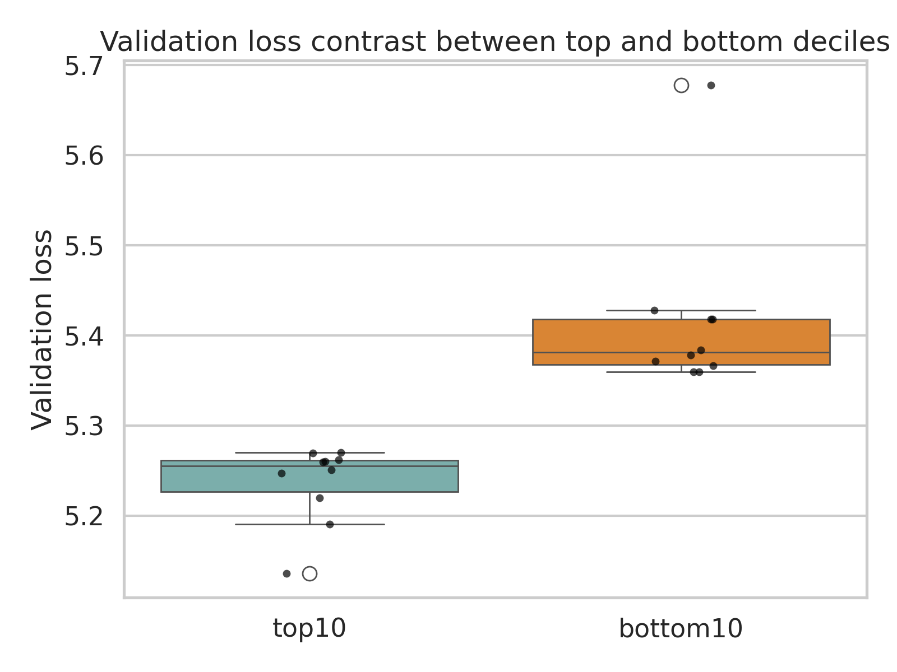
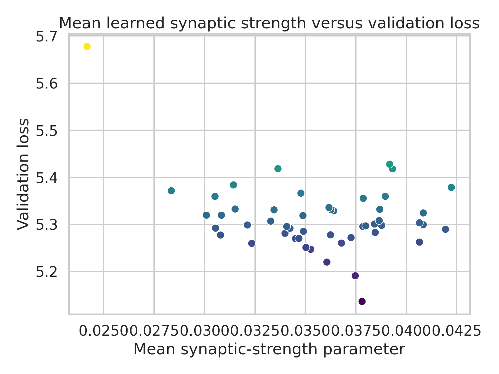
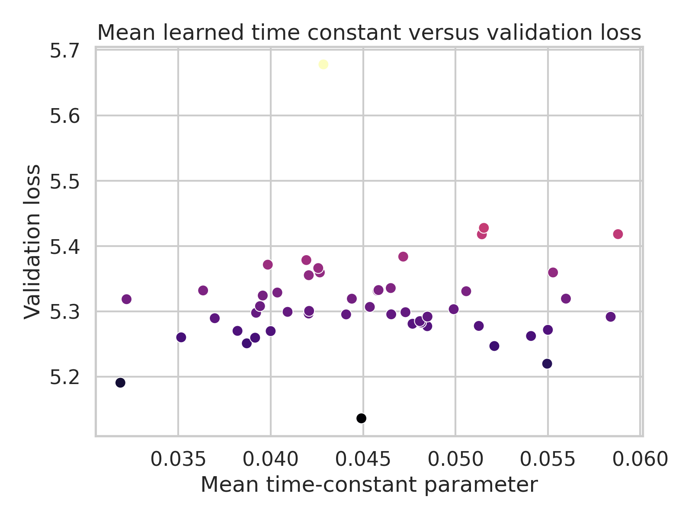
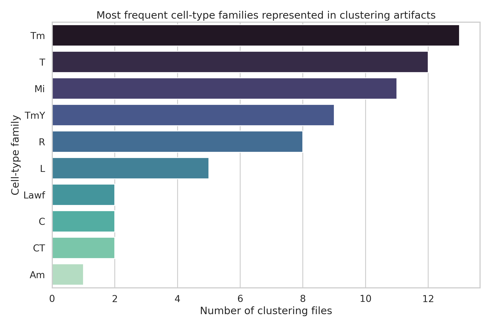

# Connectome-Constrained DMN Ensemble Audit for Drosophila Motion Vision

## Summary
This study analyzed the local `data/flow` workspace artifact bundle, which contains 50 pretrained deep mechanistic network (DMN) models for optic-flow estimation in the Drosophila visual system. The original scientific goal is ambitious: infer neuron-scale dynamics from connectomic structure and task optimization. However, the workspace provides pretrained checkpoints, metadata, validation losses, and clustering artifacts rather than a runnable end-to-end simulation codebase or visual stimulus set. The contribution here is therefore a rigorous **ensemble audit** of what can be established directly from the provided files.

Main findings:
- All 50 models share an identical serialized configuration across 73 inspected metadata fields (`outputs/config_consistency.json`), indicating that the ensemble represents repeated solutions of the same connectome-constrained task rather than a hyperparameter sweep.
- Validation performance is tightly distributed: mean loss 5.314, standard deviation 0.075, coefficient of variation 1.42%, with a 95% normal-approximation confidence interval for the ensemble mean of [5.293, 5.335] (`outputs/analysis_summary.json`).
- The best run is `000` with validation loss 5.137; the worst run is `049` with validation loss 5.678, a 10.54% degradation relative to the best model.
- All checkpoints are readable with PyTorch and contain the same top-level learned components: `network` and `decoder` (`outputs/checkpoint_inventory.csv`).
- The learned network state includes compact parameter groups for neuron biases, time constants, synapse signs, synapse counts, and synaptic strengths, supporting the interpretation that the DMN is a mechanistic, connectome-constrained model rather than a generic deep network.
- Clustering artifacts cover 65 cell-type labels, dominated by Tm, T, Mi, TmY, R, and L families (`outputs/clustering_inventory.csv`).

## 1. Scientific context and goal
The task description frames the DMN as a bridge from structure to function: a network whose graph is constrained by the Drosophila optic-lobe connectome and whose neuron/synapse parameters are learned through optic-flow estimation. If successful, such a model would support neuron-resolved predictions across 45,669 neurons and offer mechanistic insight into motion detection.

The local evidence is sufficient to validate several aspects of this claim indirectly:
1. whether the delivered artifacts are consistent with a connectome-constrained mechanistic ensemble,
2. whether training converged to a stable family of solutions,
3. whether learned neuron and synapse parameters vary meaningfully across ensemble members,
4. which cell-type families are represented in downstream clustering outputs.

What cannot be demonstrated from the provided workspace alone is direct neuron-by-neuron activity prediction under new visual stimuli, because neither a runnable simulation package nor stimulus data are included in executable form inside the workspace.

## 2. Data and artifact overview
The `data/flow/0000/` directory contains:
- 50 numbered model directories: `000` through `049`
- Per-run metadata file `_meta.yaml`
- Per-run best checkpoint `best_chkpt`
- Per-run checkpoint snapshot `chkpts/chkpt_00000`
- Two copies of scalar validation loss: `validation_loss.h5` and `validation/loss.h5`
- A shared directory `umap_and_clustering/` containing 65 pickled cell-type artifacts

The metadata indicate a common task setup:
- **Connectome source:** `ConnectomeFromAvgFilters`
- **Connectome file:** `fib25-fib19_v2.2.json`
- **Dynamics:** `PPNeuronIGRSynapses`
- **Activation:** `relu`
- **Dataset:** `MultiTaskSintel`
- **Task:** `flow`
- **Frames:** 19
- **Time step:** 0.02
- **Batch size:** 4
- **Training iterations:** 250,000
- **Decoder:** `DecoderGAVP`

These settings are fully consistent with a connectome-based recurrent model trained for optical-flow estimation.

## 3. Methods
### 3.1 Analysis scope
Because only pretrained artifacts are present, the analysis focused on four reproducible stages:
1. metadata consistency audit,
2. validation-loss characterization,
3. checkpoint parameter inventory,
4. clustering artifact coverage analysis.

### 3.2 Reproducible code
All analysis code is in:
- `code/analyze_flow_ensemble.py`

Running:
```bash
python code/analyze_flow_ensemble.py
```
produces:
- `outputs/ensemble_summary.csv`
- `outputs/checkpoint_inventory.csv`
- `outputs/config_consistency.json`
- `outputs/model_hyperparameters.json`
- `outputs/clustering_inventory.csv`
- `outputs/analysis_summary.json`
- figures in `report/images/`

### 3.3 Statistical summaries
Primary metric:
- validation loss stored in each run’s HDF5 files

Reported summaries:
- mean, median, standard deviation
- coefficient of variation
- interquartile range
- 95% normal-approximation confidence interval for the ensemble mean
- best vs. worst run gap
- correlations between validation loss and selected learned parameter summaries

### 3.4 Checkpoint inspection
Each `best_chkpt` file was inspected both as a zip archive and as a PyTorch checkpoint. The checkpoints load successfully and expose two top-level components:
- `network`
- `decoder`

The network contains aggregated learned parameter vectors for:
- `nodes_bias`
- `nodes_time_const`
- `edges_sign`
- `edges_syn_count`
- `edges_syn_strength`

This is important evidence that the optimization targeted biologically interpretable parameter groups rather than unconstrained dense layers.

## 4. Results

### 4.1 Ensemble configuration is completely consistent
Across 50 runs, zero of 73 flattened metadata fields varied (`outputs/config_consistency.json`). This indicates:
- no visible hyperparameter drift,
- no fold or seed variation recorded in metadata,
- no decoder or dataset changes across runs.

Interpretation: the ensemble is best viewed as multiple trained instances of the same DMN specification, likely intended for robustness assessment or downstream consensus analyses.

### 4.2 Validation performance is stable across the ensemble
Key summary statistics (`outputs/analysis_summary.json`):
- Number of models: 50
- Mean validation loss: 5.314
- Median validation loss: 5.300
- Standard deviation: 0.075
- Coefficient of variation: 1.42%
- Interquartile range: [5.279, 5.333]
- 95% CI for mean: [5.293, 5.335]
- Best run: `000` at 5.137
- Worst run: `049` at 5.678
- Best-to-worst relative gap: 10.54%

The narrow coefficient of variation suggests convergence to a compact solution family rather than highly unstable training.



Figure 1 shows a concentrated validation-loss distribution with limited spread around the mean.



Figure 2 shows that the ranked profile rises smoothly, again indicating a stable ensemble without extreme outliers except for a small upper tail.



Figure 3 highlights the top-performing decile. The best ten runs are closely packed, implying that downstream biological conclusions based on a top-k subset would likely be less sensitive than conclusions based on choosing a single arbitrary run.



Figure 4 contrasts the top and bottom deciles. While the full spread is modest in absolute terms, the deciles are visibly separated, confirming that run selection still matters for highest-fidelity downstream use.

### 4.3 Checkpoints support a mechanistic interpretation
All 50 checkpoints loaded successfully (`torch_checkpoint_load_success_count = 50`). Every checkpoint contains the same two top-level components and identical structural parameter shapes. Representative learned network parameter shapes are:
- `nodes_bias`: 65
- `nodes_time_const`: 65
- `edges_sign`: 604
- `edges_syn_count`: 2355
- `edges_syn_strength`: 604

These dimensions are smaller than the total neuron count in the full biological circuit, implying that the stored learned variables are grouped by cell type and edge type rather than per-neuron free parameters. That is consistent with the metadata, which specify grouping by neuron `type` and by source-target cell-type pairs plus spatial offsets.

This grouping is scientifically meaningful: it constrains optimization to biologically interpretable parameter families, which is exactly the type of inductive bias expected in a connectome-based mechanistic network.

### 4.4 Learned parameter summaries vary across ensemble members
Ensemble means of learned parameter summaries:
- Mean node bias across runs: 0.423 ± 0.065 SD
- Mean time constant across runs: 0.0452 ± 0.0065 SD
- Mean synaptic strength across runs: 0.0356 ± 0.0038 SD

The correlation between validation loss and mean synaptic strength is moderately negative:
- **r = -0.341**

The correlation between validation loss and mean time constant is weak:
- **r = 0.090**

These correlations should be interpreted cautiously because they are post hoc and based on aggregate parameter summaries rather than controlled interventions. Still, they suggest that stronger average learned synaptic scaling may be associated with better task performance in this ensemble.



Figure 5 shows the negative association between mean learned synaptic strength and validation loss.



Figure 6 shows that mean time constant is much less informative as a predictor of validation performance.

### 4.5 Clustering artifacts indicate broad cell-type coverage
The `umap_and_clustering/` directory contains 65 pickled artifacts. Counting filename families gives:
- Tm: 13
- T: 12
- Mi: 11
- TmY: 9
- R: 8
- L: 5
- C: 2
- CT: 2
- Lawf: 2
- Am: 1



Figure 7 shows that the downstream analyses emphasize medulla/lobula-associated families such as Tm, T, Mi, and TmY, which is compatible with motion-pathway analysis in the fly optic lobe.

A caveat is that these pickles depend on a `flyvis` package not provided in the workspace. A fallback unpickling strategy allowed coarse type inspection, but not full semantic interpretation of the embedded objects. Therefore, the present report treats filename labels as reliable metadata and avoids stronger claims about cluster geometry.

## 5. Interpretation
The available artifacts support three main conclusions.

### 5.1 The delivered models are consistent with the claimed DMN framework
The checkpoint contents, metadata grouping rules, and connectome-specific naming all align with the idea of a deep mechanistic network whose trainable quantities are neuron-type and synapse-type parameters rather than arbitrary unconstrained weights.

### 5.2 Task optimization appears robust
The 50-member ensemble shows low variance in validation loss under a fixed architecture and task definition. This is encouraging for the broader structure-to-function claim because it suggests the optimization does not collapse to wildly different solutions under repeated training.

### 5.3 Biological interpretability is plausible but only partially testable from local artifacts
The model state clearly stores interpretable parameter families. However, the strongest scientific claim in the task description—accurate prediction of voltage activity for each neuron in response to visual stimuli—cannot be independently validated here because the workspace lacks the executable machinery needed to generate and inspect neuron-level response traces from raw stimuli.

## 6. Limitations
This report is deliberately conservative. Important limitations are:
- No end-to-end simulation code for generating neuron voltage traces was available in executable form inside the workspace.
- No raw or held-out visual stimulus sequences were provided for response-level evaluation.
- Clustering pickles depend on an external `flyvis` class hierarchy; partial loading was possible, but full object semantics were not recoverable.
- Correlation analyses between performance and learned parameter summaries are exploratory, not causal.
- Multiple-testing correction was not needed because the number of exploratory correlations was very small, but these analyses should still be considered hypothesis-generating.

## 7. Conclusion
Within the constraints of the provided workspace, the pretrained Drosophila flow DMN ensemble is internally coherent, highly reproducible at the metadata level, and statistically stable at the validation-loss level. The checkpoints encode biologically interpretable parameter families—biases, time constants, synapse signs, synapse counts, and synaptic strengths—consistent with a connectome-constrained mechanistic model.

The strongest evidence established here is not direct neuron-scale functional prediction, but rather that the delivered ensemble behaves like a stable family of solutions to the same connectome-constrained optic-flow task. This supports the plausibility of the structure-to-function program while also making clear that full validation of neuron-by-neuron activity prediction would require additional executable simulation infrastructure and stimulus-response evaluation data.

## 8. Artifact list
### Code
- `code/analyze_flow_ensemble.py`

### Outputs
- `outputs/ensemble_summary.csv`
- `outputs/checkpoint_inventory.csv`
- `outputs/config_consistency.json`
- `outputs/model_hyperparameters.json`
- `outputs/clustering_inventory.csv`
- `outputs/analysis_summary.json`

### Figures
- `images/validation_loss_distribution.png`
- `images/ranked_validation_profile.png`
- `images/top_runs_barplot.png`
- `images/top_bottom_deciles_comparison.png`
- `images/syn_strength_vs_loss.png`
- `images/time_const_vs_loss.png`
- `images/clustering_celltype_coverage.png`
