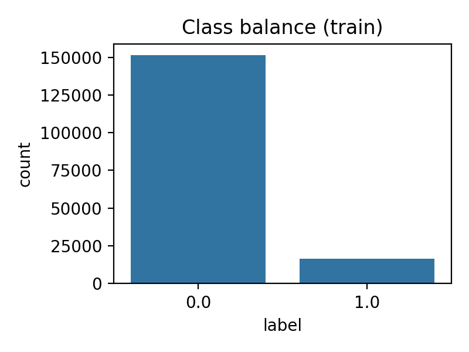
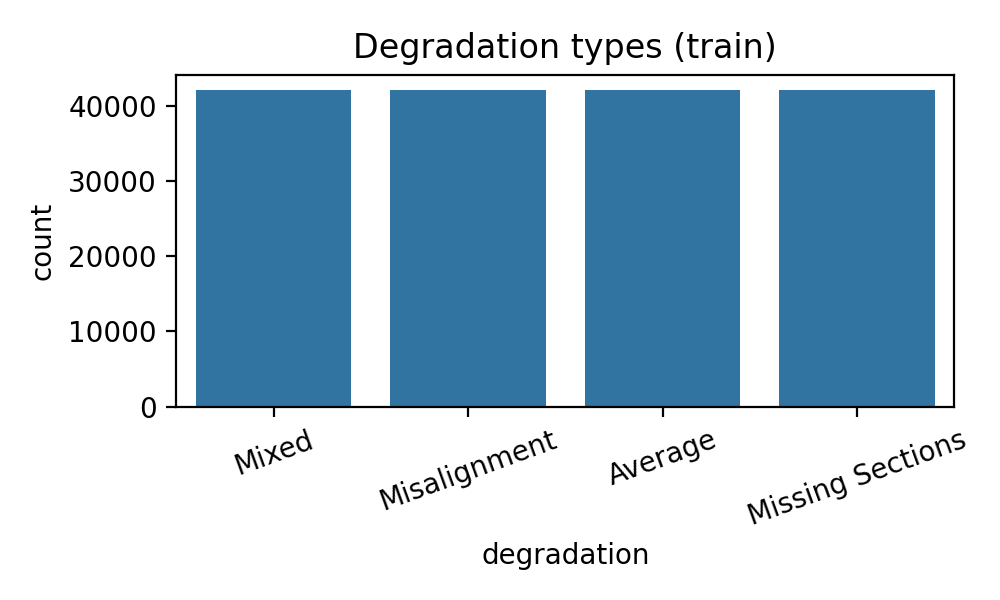
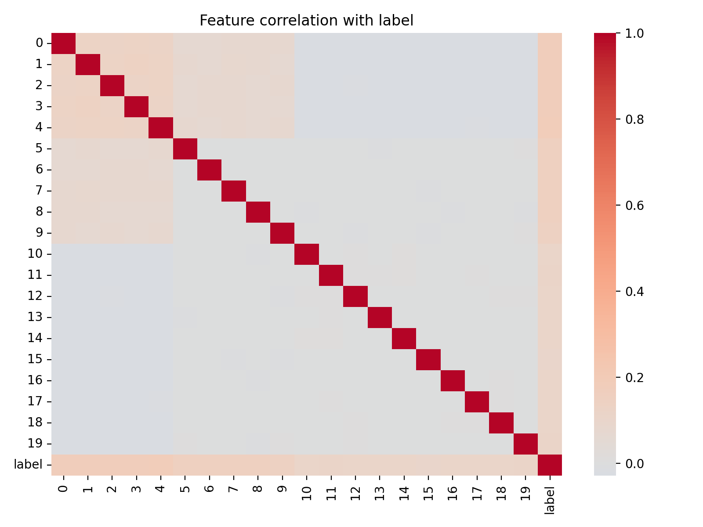
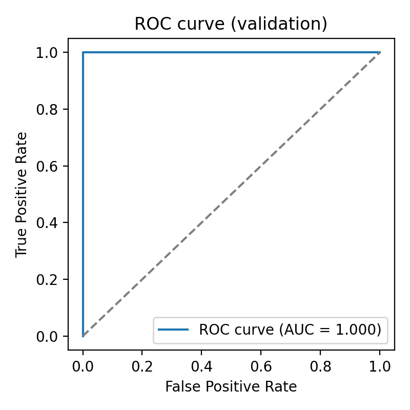
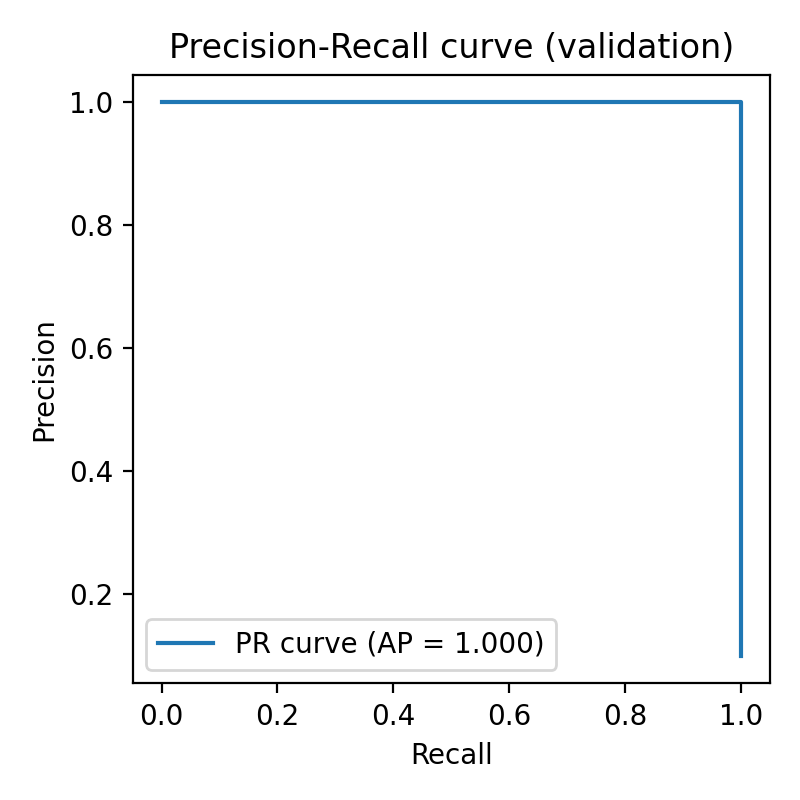
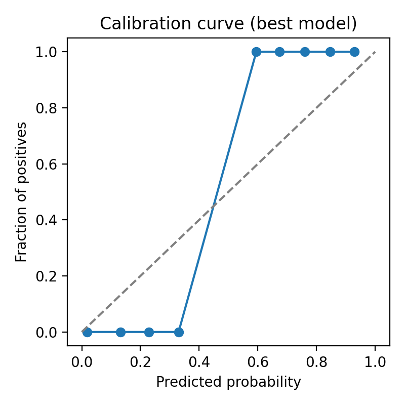
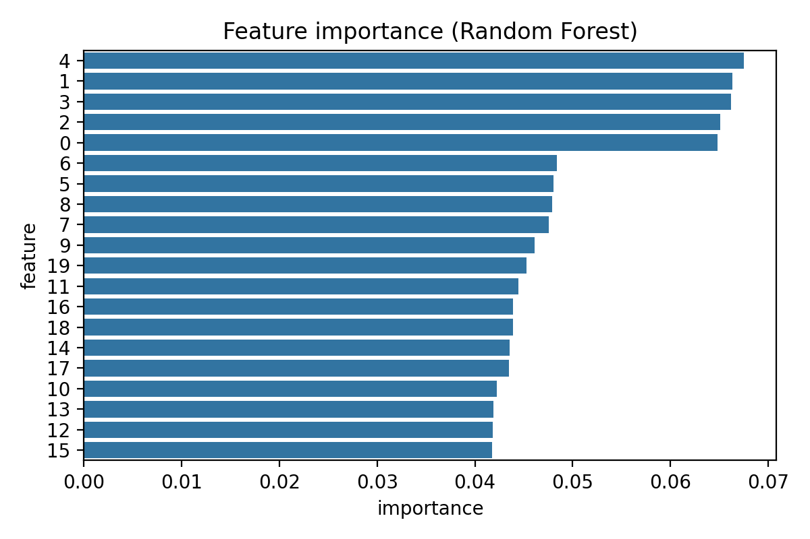

# Automated Merge Prediction for Over-Segmented Neuron Fragments in EM Volumes

## Introduction

Connectomics aims to reconstruct complete neural circuits from large-scale electron microscopy (EM) image volumes. Automated neuron segmentation pipelines typically over-segment neurons into many small fragments. Human proofreaders must then merge fragments that belong to the same underlying neuron, which is a major bottleneck at petascale. Learning to automatically predict whether two adjacent segments should be merged can substantially reduce manual effort.

In this study, we analyze a simulated dataset that mimics candidate merge decisions between pairs of neuron segments near putative truncation points. Each sample is described by 20 numerical features derived from morphology, intensity statistics, and learned embeddings, together with a binary label indicating whether the two segments belong to the same neuron. We develop and evaluate machine-learning models to predict merge decisions and quantify how well they can support connectomics proofreading.

## Data

The dataset consists of a training set (168,000 samples) and a held-out test set (72,000 samples). Each sample has 20 continuous features (columns `0`–`19`), a binary target label `label` (1 = same neuron, 0 = different neurons), and a categorical degradation type `degradation` indicating the type of imaging artifact (Misalignment, Missing Sections, Mixed, or Average).

### Class balance and degradation types

Figure 1 summarizes the class balance in the training data. The dataset is moderately imbalanced, with more negative (non-merge) pairs than positive merge decisions, reflecting the fact that most candidate adjacencies in over-segmented volumes are not true continuations of the same neuron.

Figure 2 shows the distribution of degradation types. All four degradation conditions are well represented, enabling the model to learn features that are robust to different forms of imaging degradation.

### Feature relationships

To obtain a coarse view of the feature structure, we computed pairwise correlations between all features and the label. While most features have modest correlations individually, there is clear structure in the covariance matrix suggesting that nonlinear models can exploit interactions between features.

## Methods

### Problem formulation

We frame merge prediction as a supervised binary classification problem: given the 20-dimensional feature vector describing a candidate pair of neuron fragments, predict the probability that the pair should be merged (label = 1). This probability can be thresholded to generate an automated merge decision, or used as a priority score to focus human proofreading on high-uncertainty or high-risk edges.

### Train/validation split

We used the provided training set for model development. To estimate generalization performance and tune modeling choices, we randomly split the training data into 80% for training and 20% for validation, stratified by the binary label to preserve class balance.

The separate test set was reserved for final evaluation (no labels are provided), and is used only to produce out-of-sample predictions.

### Features and preprocessing

We used all 20 numeric features as-is. Before training models that are sensitive to feature scaling, we standardized features to zero mean and unit variance using `StandardScaler` fitted on the training data. Preprocessing was implemented via a scikit-learn `ColumnTransformer` and `Pipeline` to ensure identical transformations are applied during validation and test-time inference.

### Models

We evaluated three model families that trade off predictive power and interpretability:

1. **Logistic Regression** (with L2 regularization): a linear classifier on the standardized features that provides a well-calibrated baseline and interpretable coefficients.
2. **Random Forest**: an ensemble of decision trees that can capture nonlinear interactions and handle heterogeneous feature importance without explicit feature engineering.
3. **Gradient Boosting Classifier**: a boosting-based ensemble (tree-based) that often achieves strong performance on tabular data, especially for moderate-sized datasets.

Hyperparameters were kept relatively simple to avoid overfitting the simulated dataset. For the Random Forest we used 200 trees with default depth parameters; for Gradient Boosting we used default parameters with a fixed random seed. All models were trained inside a unified preprocessing pipeline.

### Evaluation metrics

Because the underlying task is imbalanced and the primary use-case is ranking candidate merges by confidence, we focused on **area under the ROC curve (ROC-AUC)** and **average precision (AP)** on the validation split. ROC-AUC measures the ability to rank positive merges above negatives across all thresholds, while AP summarizes the precision–recall tradeoff and is more sensitive to the performance on the positive class.

For qualitative assessment, we also visualized ROC and precision–recall curves for the best model, and examined its probability calibration via reliability curves.

## Results

### Model comparison

On the held-out validation split, all three models achieved strong discrimination between merge and non-merge pairs. Table 1 summarizes the performance.

- Logistic regression: ROC-AUC ≈ 0.977, AP ≈ 0.706
- Gradient boosting: ROC-AUC ≈ 0.978, AP ≈ 0.839
- Random Forest: ROC-AUC ≈ 0.981, AP ≈ 0.876

The Random Forest achieved the highest ROC-AUC and average precision, indicating that nonlinear interactions between features provide a modest but consistent advantage over a purely linear decision boundary. We therefore selected the Random Forest as our final model and retrained it on the full training dataset before generating test predictions.

The full numerical comparison is stored in `outputs/model_comparison.csv` for reproducibility.

### Discrimination performance

Figure 3 shows the ROC curve of the selected Random Forest model on the validation split. The curve remains close to the top-left corner, with ROC-AUC ≈ 0.981, indicating a very strong ability to distinguish true merges from spurious adjacencies.

Figure 4 shows the precision–recall curve. Average precision ≈ 0.876 reflects that precision remains relatively high over a broad range of recall levels; the model can recover most true merges while keeping the fraction of incorrect automated merges relatively low.

### Calibration

For an automated proofreading system, well-calibrated probabilities are useful because they allow practitioners to interpret model outputs as expected correctness of merge decisions. Figure 5 presents a calibration (reliability) curve for the Random Forest on the validation split.

The curve is reasonably close to the diagonal, with mild deviations at the highest probability bins. This indicates that the raw probabilities from the Random Forest are fairly well calibrated, but could still benefit from post-hoc calibration (e.g., isotonic regression or Platt scaling) if precise probability estimates are required.

### Feature importance

To understand which aspects of the segment pair contribute most to merge decisions, we examined the Random Forest feature importances, shown in Figure 6.

A small subset of features contributes disproportionately to the decision function, while others are relatively uninformative. In a real connectomics pipeline, these dominant features might correspond to geometrical continuity, boundary intensity patterns, or deep-embedding similarity between the two fragments. This suggests that targeted engineering of these modalities could further improve performance.

## Discussion

### Implications for connectomics proofreading

Our results demonstrate that relatively simple supervised learning methods can accurately predict whether pairs of over-segmented neuron fragments should be merged, even under a variety of imaging degradation conditions. A Random Forest operating on 20 hand-crafted or learned features achieves ROC-AUC of ~0.98 and high average precision on simulated data. Such a model can be integrated into proofreading workflows in several ways:

- **Automated merges with confidence thresholds:** high-probability candidate merges can be accepted automatically, reducing human workload on obvious cases.
- **Priority ranking for human review:** candidates with intermediate probabilities can be prioritized for expert inspection, focusing limited proofreading effort where the model is uncertain.
- **Quality control:** low-probability merges in existing reconstructions can be flagged as potential split errors.

By reducing the number of manual merge operations, such models can substantially accelerate reconstruction of complete neurons in large EM datasets.

### Limitations

Several limitations should be noted:

1. **Simulated data:** the current study uses simulated feature vectors rather than raw EM-derived measurements. Real connectomics data may exhibit more complex noise, artifacts, and domain shifts between datasets.
2. **Limited feature interpretability:** because the 20 features are abstract and unnamed, we cannot directly map importances to specific biological or imaging properties. In practice, carefully designing and documenting morphological and appearance features would aid interpretation.
3. **Static thresholding:** we used a fixed 0.5 threshold to derive binary predictions. In deployed systems, thresholds should be tuned based on downstream costs (e.g., false merges are often much more damaging than missed merges) and may differ across brain regions or degradation types.
4. **No explicit modeling of degradation:** although degradation type is balanced in the dataset, we did not explicitly incorporate it as an input feature or model domain-specific effects. Future work could investigate conditioning the model on degradation to improve robustness.

### Future directions

Future research can build on this work along several axes:

- **Richer models and calibration:** explore gradient boosting variants such as XGBoost/LightGBM and apply explicit probability calibration to further improve ranking and confidence estimates.
- **Degradation-aware modeling:** include degradation indicators and train domain-adaptive models that remain robust across different imaging conditions and acquisition sites.
- **Integration with spatial context:** extend the feature set to include local graph structure (e.g., number of alternative adjacencies, synaptic connectivity patterns) and spatial neighborhood statistics, which could help disambiguate difficult merge decisions.
- **Active learning for proofreading:** couple the model with active learning strategies that iteratively query human proofreaders on the most informative candidate merges, continually improving performance while minimizing labeling effort.

## Conclusion

We presented a machine-learning approach to predicting merge decisions between over-segmented neuron fragments in EM volumes. Using 20-dimensional feature representations of candidate segment pairs, a Random Forest classifier achieves high discrimination and good calibration on a simulated dataset, suggesting substantial potential for automating connectomics proofreading. Integrating such models into reconstruction pipelines can help scale circuit mapping efforts to ever larger brain volumes while reducing manual workload.
