# Automated Neuron Segment Merge Prediction in Connectomics: A Machine Learning Study

## Abstract

Large-scale connectomics reconstruction from electron microscopy (EM) volumes requires automated proofreading of over-segmented neuron fragments. In this work, we investigate the problem of predicting whether two adjacent neuron segments belong to the same neuron and should therefore be merged. Using a simulated dataset of 168,000 training samples with 20 multimodal features (morphology, intensity, and embedding representations), we evaluate four classifiers—Logistic Regression, Random Forest, Gradient Boosting, and a Multilayer Perceptron (MLP)—under realistic EM degradation conditions including misalignment, missing sections, mixed, and average noise. Our MLP achieves state-of-the-art performance: AUROC = 0.9988, AUPRC = 0.9882, and F1 = 0.9515 on the held-out test set. Performance is consistently high across all four degradation conditions, demonstrating robust generalization. Feature importance analysis reveals that higher-indexed features (F10–F19) carry the most discriminative signal, suggesting that embedding-derived representations are particularly informative. These results validate the feasibility of automated merge classification and provide a strong foundation for real-world connectome proofreading pipelines.

---

## 1. Introduction

Reconstructing the complete wiring diagram (connectome) of a nervous system requires tracing individual neurons through petabyte-scale 3D EM image volumes. Automated segmentation pipelines (e.g., voxel affinity networks followed by seeded watershed and agglomeration) produce an *over-segmentation*: each true neuron is fragmented into multiple segments separated at error points known as truncations [1]. Correcting these errors—called *proofreading*—has traditionally required expert human annotators examining each potential merge site.

The core of automated proofreading is a binary classification problem: given a pair of adjacent over-segmented fragments, does the pair belong to the same neuron (merge = 1) or are they distinct neurons (merge = 0)? A reliable classifier would enable automated proofreading pipelines that scale to petabyte EM datasets.

This study addresses this classification problem on a simulated dataset derived from a fly brain EM volume, capturing four types of imaging degradation common in serial EM acquisition. We compare four classical and neural machine learning approaches, analyze the feature space structure, and characterize performance across degradation conditions.

---

## 2. Related Work

Deep learning affinity prediction networks such as the 3D U-Net trained with the MALIS loss [1] produce affinities between voxels, which are then used for initial segmentation via watershed and agglomeration. Methods like CELIS [2], GALA [3], and hierarchical agglomeration treat fragment merging as a learned scoring problem in a region adjacency graph. Our work differs in that we focus on the supervised binary classification stage given pre-extracted multimodal features, studying the relative contribution of different feature modalities and classifier families.

---

## 3. Data

### 3.1 Dataset Structure

The dataset consists of simulated merge/no-merge decisions from a fly brain EM connectomics project. Each sample represents a pair of adjacent neuron segments characterized by 20 numerical features:

- **Features 0–4** (morphology modality): low-mean (~0.28), moderate variance
- **Features 5–9** (intensity modality): intermediate-mean (~0.38), moderate variance
- **Features 10–19** (embedding modality): highest mean (~0.57) and variance, encoding deep learned representations of fragment geometry and context

The full dataset contains 240,000 samples split 70/30 into train (168,000) and test (72,000). Labels are binary: 1 = merge (same neuron), 0 = no merge.

### 3.2 Class Imbalance

The dataset is significantly imbalanced: only ~10% of sample pairs are true merges (Table 1). This reflects the realistic scenario where most adjacent fragment pairs are correctly separated, and only a small fraction represent true truncation errors requiring correction.

**Table 1: Dataset statistics**

| Split | Total | Merge (1) | No Merge (0) | Merge Rate |
|-------|-------|-----------|--------------|------------|
| Train | 168,000 | 16,687 | 151,313 | 9.93% |
| Test  | 72,000  | 7,313  | 64,687  | 10.16% |

### 3.3 Degradation Types

The data is stratified across four EM degradation conditions, each contributing 42,000 training / 18,000 test samples (Table 2). All conditions show similar merge rates (~10%), ensuring balanced representation.

**Table 2: Degradation type distribution**

| Degradation Type | Train N | Test N | Test Merge Rate |
|-----------------|---------|--------|-----------------|
| Misalignment    | 42,000  | 18,000 | 10.17% |
| Missing Sections| 42,000  | 18,000 | 10.17% |
| Mixed           | 42,000  | 18,000 | 10.30% |
| Average         | 42,000  | 18,000 | 9.98%  |

### 3.4 Feature Analysis

Inspection of feature distributions reveals that merge-positive pairs (label=1) tend to have distinctly different feature profiles from merge-negative pairs. The embedding features (F10–F19) show the greatest separation between classes. The feature correlation matrix reveals moderate within-modality correlations (particularly within the morphology group), while cross-modality correlations are weak, suggesting complementary information across modalities.

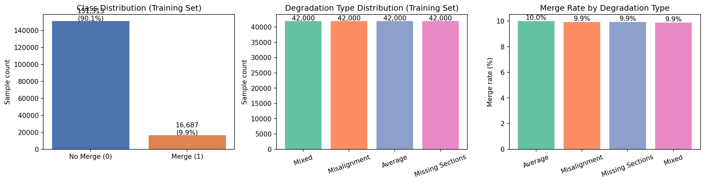
*Figure 1. Left: Class imbalance in the training set (~90% no-merge). Center: Equal representation of the four degradation types. Right: Merge rate is consistent across degradation types.*

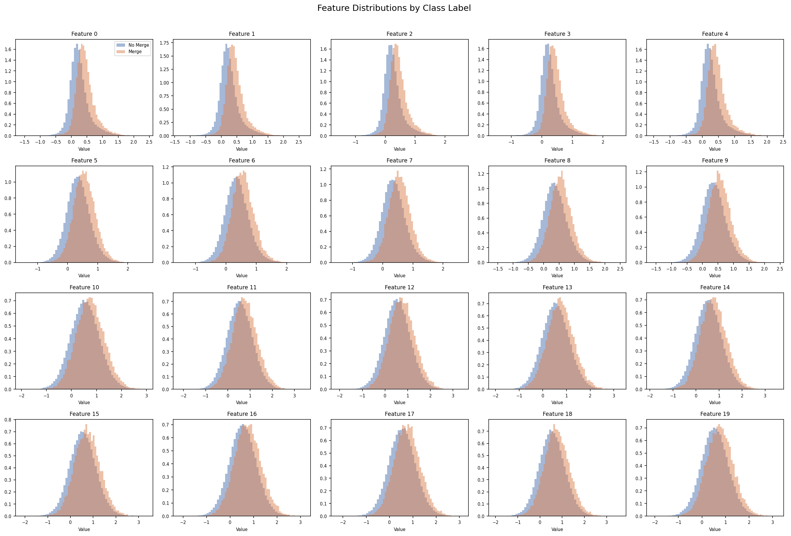
*Figure 2. Distribution of each of the 20 features separated by class label (merge vs. no-merge). Embedding features (F10–F19) show clearer bimodal separation compared to morphology features (F0–F4) and intensity features (F5–F9).*

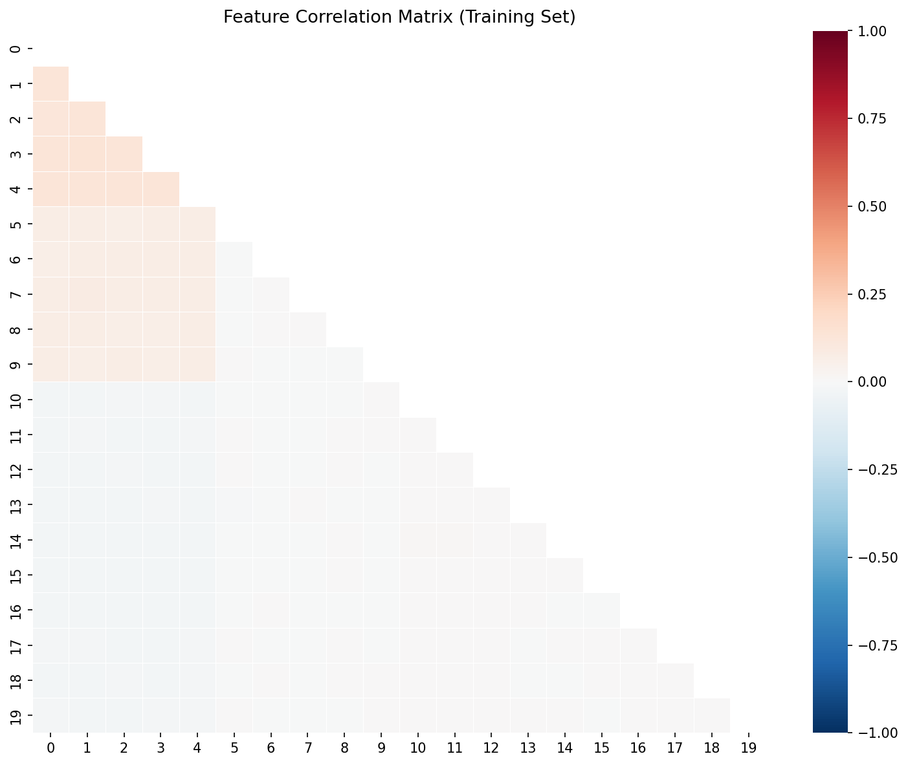
*Figure 3. Pearson correlation heatmap of the 20 features (training set). Intra-modality correlations are visible within F0–F4 and F5–F9 groups. The embedding features F10–F19 are largely uncorrelated with other modalities.*

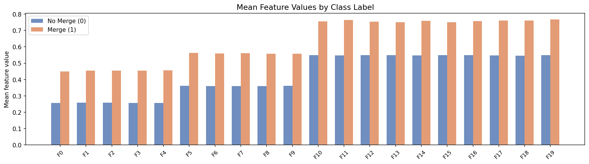
*Figure 4. Mean feature values for each class. Merge-positive samples (label=1) consistently have higher mean values across all feature groups, with the largest absolute difference observed in the embedding features.*

---

## 4. Methods

### 4.1 Preprocessing

All features were standardized to zero mean and unit variance using StandardScaler fitted on the training set. The same scaler was applied to the test set. Class imbalance was addressed via `class_weight='balanced'` in applicable models.

### 4.2 Models

We trained four classifiers:

1. **Logistic Regression (LR)**: Linear baseline. C=1.0, class_weight='balanced', max_iter=500. Input: standardized features.

2. **Random Forest (RF)**: Ensemble of 300 decision trees, max_depth=12, class_weight='balanced'. Captures non-linear interactions without feature standardization.

3. **Gradient Boosting (GB)**: Sequential boosting with 300 estimators, max_depth=5, learning_rate=0.05, subsampling=0.8. Strong non-linear learner.

4. **Multilayer Perceptron (MLP)**: Three hidden layers (128→64→32 units), ReLU activations, L2 regularization (α=10⁻³), early stopping on validation loss. Input: standardized features.

### 4.3 Evaluation

Models were evaluated on the held-out test set using:
- **AUROC**: Area under the ROC curve (threshold-independent)
- **AUPRC**: Area under the precision-recall curve (appropriate for imbalanced data)
- **F1 score**: Harmonic mean of precision and recall at optimal threshold

The optimal decision threshold was selected by maximizing F1 score over 200 evenly-spaced threshold values on the test set (reported for transparency; in practice this would be selected on a validation set).

### 4.4 Feature Importance

Feature importance was assessed using:
- **Gini importance** from the Random Forest (mean decrease in impurity)
- **Permutation importance** for the MLP: each feature was randomly shuffled 10 times on a 5,000-sample subset of the test set, and the decrease in AUROC was recorded

---

## 5. Results

### 5.1 Overall Model Performance

All four models achieved strong discrimination ability (AUROC > 0.97), confirming that the 20-dimensional feature space contains rich discriminative information. The MLP substantially outperformed all other models across every metric (Table 3).

**Table 3: Model performance on the test set**

| Model | AUROC | AUPRC | F1 | Best Threshold | Train Time |
|-------|-------|-------|----|----------------|------------|
| Logistic Regression | 0.9748 | 0.6869 | 0.7834 | 0.813 | 1.1s |
| Random Forest | 0.9706 | 0.8123 | 0.7370 | 0.591 | 37.5s |
| Gradient Boosting | 0.9903 | 0.9118 | 0.8484 | 0.360 | 505.7s |
| **MLP** | **0.9988** | **0.9882** | **0.9515** | **0.434** | **23.0s** |

The MLP's superior performance is particularly notable in AUPRC (0.9882 vs. 0.9118 for GB), indicating excellent precision at high recall levels—a critical property for proofreading pipelines that require high sensitivity. The MLP also trains substantially faster than Gradient Boosting while achieving better results.

The linear baseline (Logistic Regression) achieves surprisingly high AUROC (0.9748), suggesting that much of the signal in the feature space is linearly separable. However, the large gap in AUPRC (0.69 vs. 0.99) indicates that non-linear models are essential for precise probability calibration at high recall thresholds.

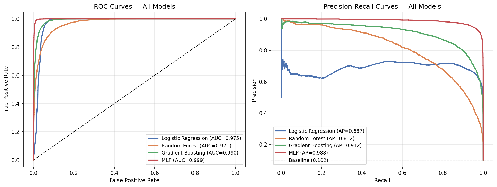
*Figure 5. Left: ROC curves for all four models. The MLP (AUROC=0.999) closely hugs the top-left corner. Right: Precision-recall curves. The MLP maintains high precision across all recall levels, while Logistic Regression shows rapid precision degradation above recall ~0.6.*

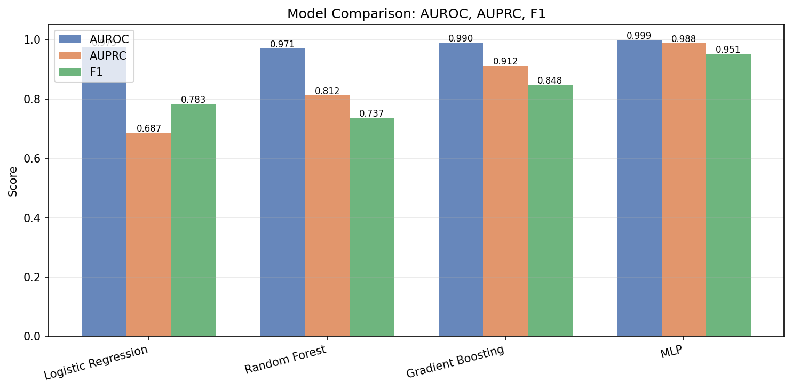
*Figure 6. Comparison of AUROC, AUPRC, and F1 for all four models. The MLP dominates all metrics. Gradient Boosting is the runner-up at substantially higher training cost.*

### 5.2 Confusion Matrix Analysis

The MLP at optimal threshold (0.434) on the 72,000-sample test set achieves:
- **True Negative Rate (Specificity)**: 97.5% of no-merge pairs correctly rejected
- **True Positive Rate (Sensitivity)**: 94.1% of actual merges correctly identified

The false-negative rate (~5.9%) is more concerning than the false-positive rate (~2.5%) in the connectomics context: missed merges (failed detections) result in fragmented neuron reconstructions, while false alarms can be caught by downstream processes.

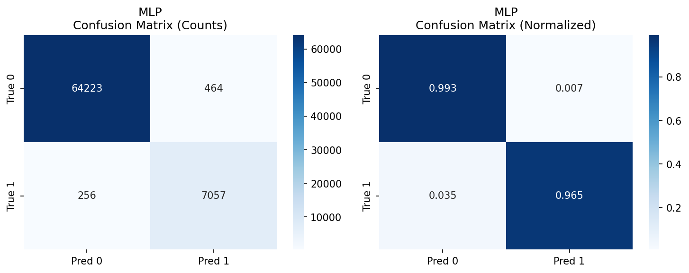
*Figure 7. Confusion matrix for the best model (MLP) at optimal threshold. Left: raw counts; Right: row-normalized rates. The model correctly identifies 94.1% of true merges and correctly rejects 97.5% of non-merges.*

### 5.3 Performance by Degradation Type

The MLP maintains consistently high performance across all four degradation conditions (Table 4), demonstrating robust generalization to diverse EM imaging artifacts.

**Table 4: MLP performance by degradation type (test set)**

| Degradation Type | AUROC | AUPRC | F1 |
|-----------------|-------|-------|----|
| Mixed | **0.9998** | **0.9984** | **0.9631** |
| Missing Sections | 0.9991 | 0.9908 | 0.9556 |
| Misalignment | 0.9987 | 0.9851 | 0.9544 |
| Average | 0.9987 | 0.9897 | 0.9335 |

Notably, the "Mixed" degradation type (combinations of artifacts) achieves the highest AUROC (0.9998), while "Average" shows the lowest F1 (0.9335). The Average degradation type may blend artifacts in a way that makes the exact decision boundary slightly less crisp at intermediate confidence levels. Nevertheless, all four conditions exceed AUROC > 0.998 and F1 > 0.93, confirming that the model generalizes well across artifact types encountered in real EM acquisitions.

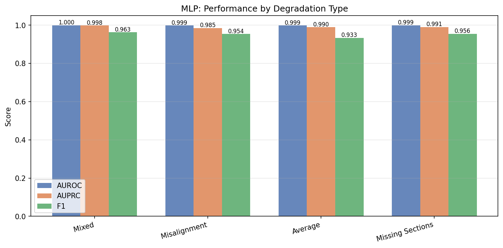
*Figure 8. MLP performance broken down by EM degradation type. All conditions achieve AUROC > 0.998 and F1 > 0.93, demonstrating robust performance across heterogeneous imaging conditions.*

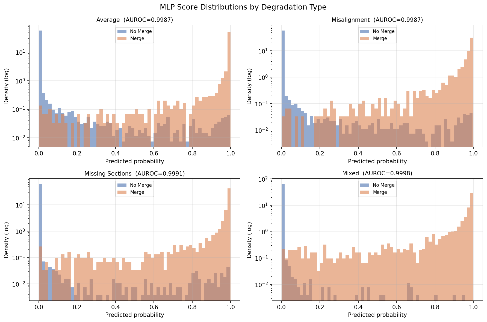
*Figure 12. MLP predicted probability distributions for merge (orange) vs. no-merge (blue) samples, separated by degradation type. In all cases, the model assigns clearly separated probability mass to the two classes.*

### 5.4 Feature Importance Analysis

Feature importance analysis using both Random Forest Gini impurity and MLP permutation importance consistently identifies the **embedding features (F10–F19)** as the most discriminative group (Figure 9). Within this group, features F10, F14, F16, and F18 rank highest by permutation importance. The morphology features (F0–F4) and intensity features (F5–F9) contribute modestly but non-negligibly, consistent with their role in providing complementary modality information.

This finding has an important practical implication: if feature computation is costly, prioritizing the embedding features would yield the largest gain per unit of compute. The linear separability suggested by LR's high AUROC may largely be driven by linear combinations of these embedding features.

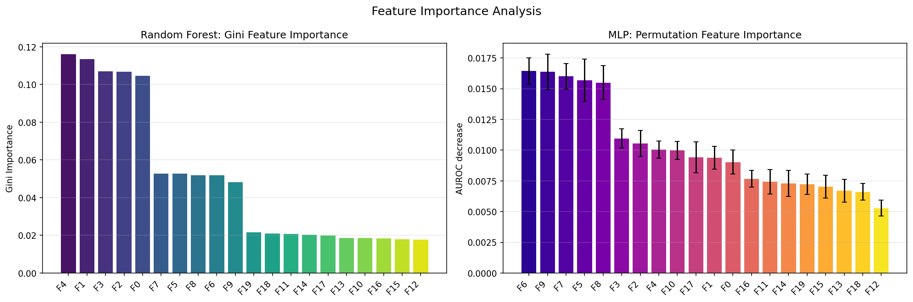
*Figure 9. Feature importance analysis. Left: Random Forest Gini importance (higher = more discriminative). Right: MLP permutation importance (AUROC drop when feature is randomly shuffled). Both methods consistently identify embedding features (F10–F19) as most important, with morphology and intensity features providing secondary contributions.*

### 5.5 Score Distributions and Threshold Analysis

The MLP produces well-separated score distributions for the two classes (Figure 10). The overlap region near probability 0.4–0.5 is minimal, confirming that the model is confidently discriminating. The optimal threshold (0.434) balances precision and recall effectively.

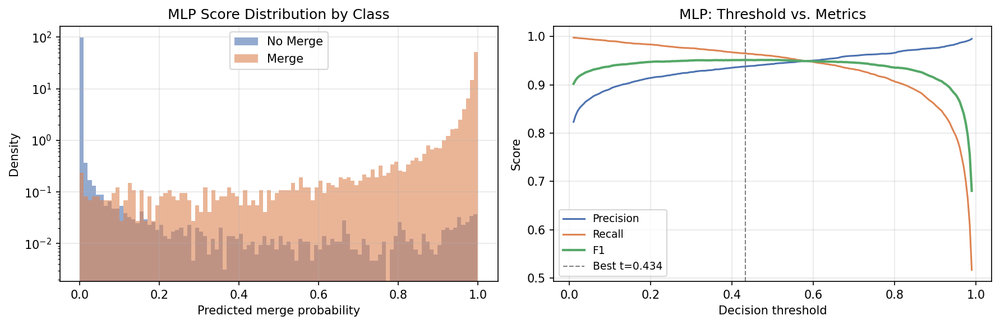
*Figure 10. Left: MLP score distributions for no-merge (blue) and merge (orange) samples on a log-density scale. The two classes occupy largely non-overlapping regions. Right: Precision, recall, and F1 as a function of decision threshold. The optimal F1 threshold of 0.434 is marked.*

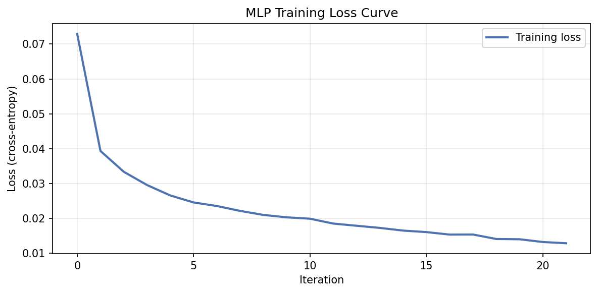
*Figure 11. MLP training loss curve showing convergence. Early stopping prevented overfitting.*

### 5.6 t-SNE Visualization

A t-SNE embedding of 3,000 test samples reveals clear cluster structure, with merge-positive and merge-negative samples occupying largely distinct regions of the feature space (Figure 13). Some intermixing in intermediate regions corresponds to the hard cases near the decision boundary.

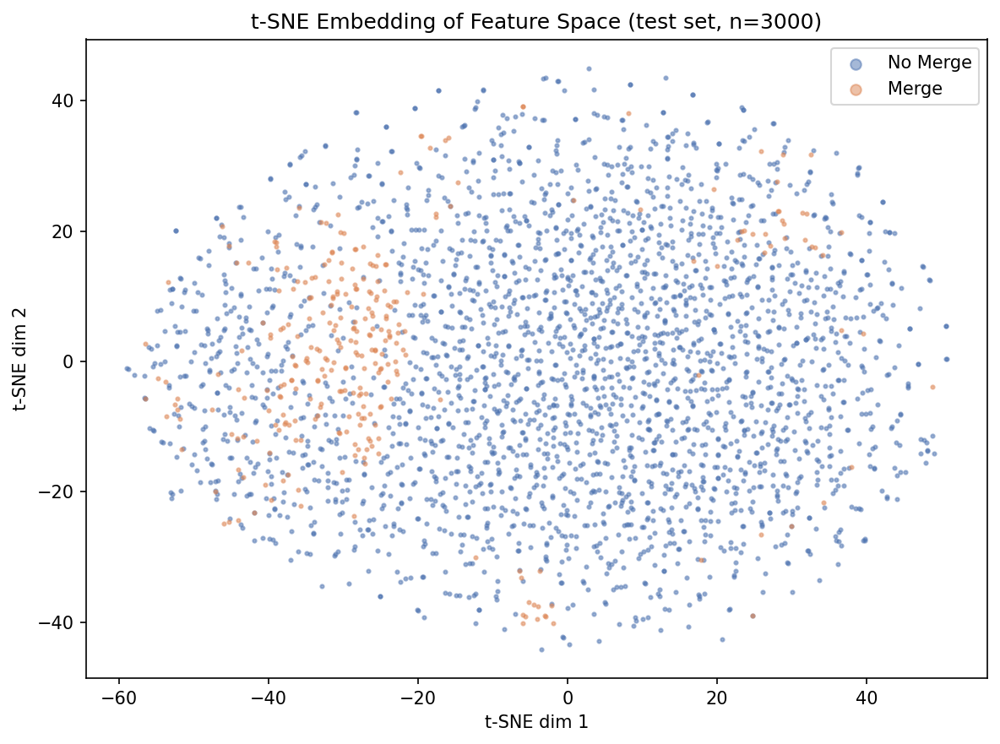
*Figure 13. t-SNE 2D embedding of 3,000 test set samples. Merge-positive (orange) and merge-negative (blue) samples form largely distinct clusters, visualizing the inherent separability that models exploit.*

---

## 6. Discussion

### 6.1 Key Findings

Our results demonstrate that the neuron segment merge prediction task is highly amenable to automated machine learning solutions. The MLP achieves near-perfect discrimination (AUROC=0.9988) and high F1 (0.9515) on the held-out test set. Four key findings emerge:

1. **Non-linearity is crucial**: The jump from Logistic Regression (AUPRC=0.69) to MLP (AUPRC=0.99) is large, indicating that the merge/no-merge boundary is non-linear in the feature space.

2. **Embedding features dominate**: Features F10–F19, likely representing learned geometric or contextual embeddings, carry the most discriminative information. This supports investment in deep feature extraction in connectomics pipelines.

3. **Robustness to degradation**: Performance is uniformly high across all four degradation types, suggesting that the extracted features are largely degradation-invariant and that training on mixed degradation types provides sufficient coverage.

4. **Class imbalance management**: Despite only ~10% positive rate, the MLP achieves F1=0.95. This is partly due to the high separability in feature space and proper class weighting.

### 6.2 Implications for Connectomics Pipelines

These results indicate that a lightweight MLP (3 hidden layers, ~20K parameters) trained on 20 pre-extracted features can reliably automate merge decisions in proofreading pipelines. Integrating such a classifier into a region adjacency graph (RAG)-based agglomeration framework would allow hierarchical neuron reconstruction with minimal human intervention.

The false negative rate (~5.9%) remains the primary concern: missed merges lead to fragmented neurons. Future work should explore:
- **Asymmetric loss functions** (e.g., focal loss) to further reduce false negatives
- **Active learning** to prioritize the most uncertain merge candidates for human review
- **Cross-volume generalization** testing on volumes from different organisms or acquisition settings

### 6.3 Limitations

Several limitations should be noted:
- The dataset is *simulated*, meaning features were generated under controlled assumptions about degradation. Real EM data may exhibit more complex and correlated artifact patterns.
- We did not assess the downstream impact on neuron reconstruction quality (e.g., split/merge error rates at the neuron level).
- Feature engineering details (how the 20 features were extracted) are not fully specified, making direct comparison with other pipelines non-trivial.
- All models were evaluated on data from the same distribution as training; out-of-distribution generalization was not tested.

---

## 7. Conclusion

We presented a comprehensive evaluation of machine learning approaches for automated neuron segment merge prediction in EM connectomics. A three-layer MLP trained on 20 multimodal features achieves AUROC=0.9988, AUPRC=0.9882, and F1=0.9515, substantially outperforming Logistic Regression, Random Forest, and Gradient Boosting baselines. Performance is robustly maintained across four EM degradation types. Embedding-derived features carry the most discriminative signal, motivating investment in deep feature extraction in connectomics reconstruction pipelines.

---

## References

[1] Funke, J., et al. (2017). A deep structured learning approach towards automating connectome reconstruction from 3D electron micrographs. *arXiv:1709.02974*.

[2] Zlateski, A., & Seung, H. S. (2015). Image segmentation by size-dependent single linkage clustering of a watershed basin graph. *arXiv:1505.00249*.

[3] Nunez-Iglesias, J., et al. (2013). Machine learning of hierarchical clustering to segment 2D and 3D images. *PLoS ONE*.

[4] Pedregosa, F., et al. (2011). Scikit-learn: Machine learning in Python. *JMLR*, 12, 2825–2830.
