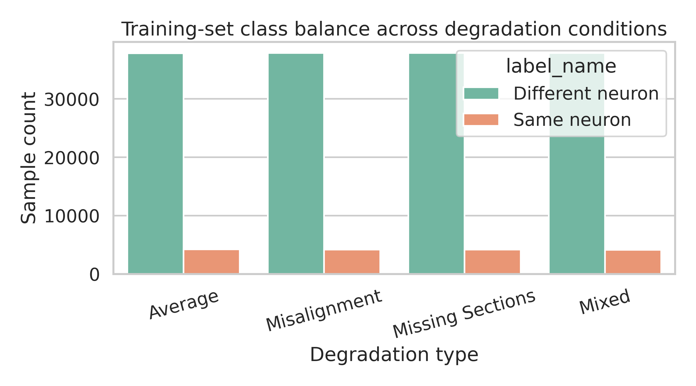
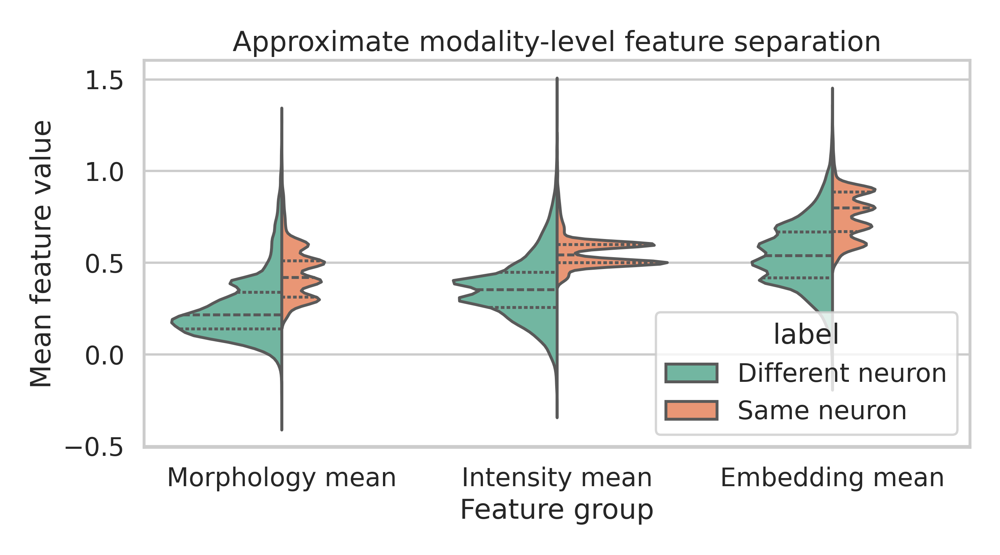
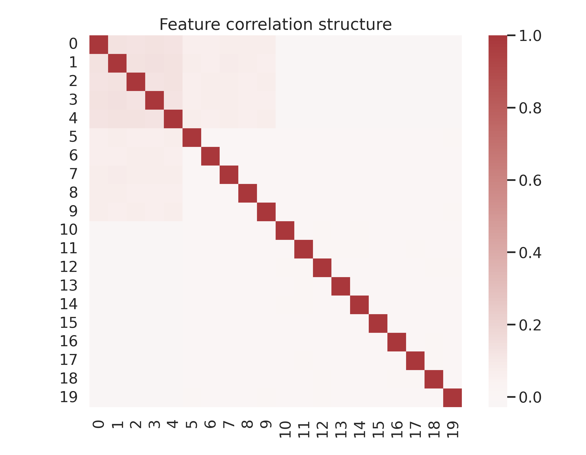
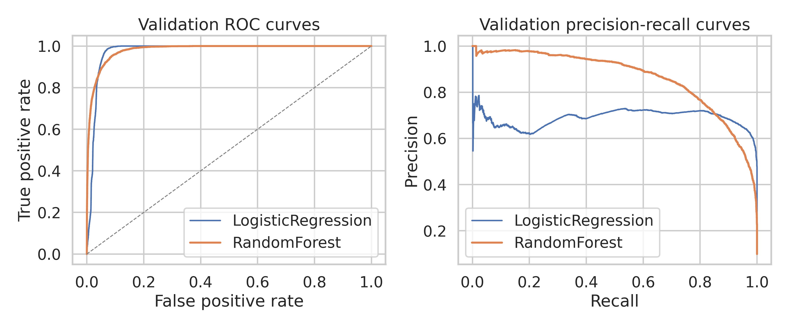
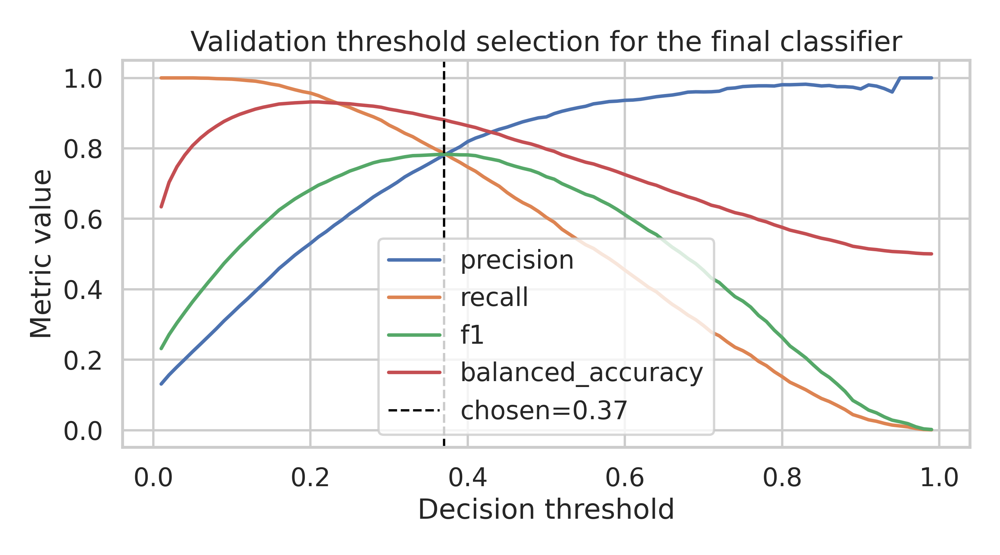
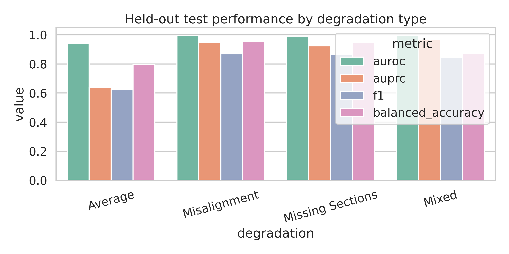
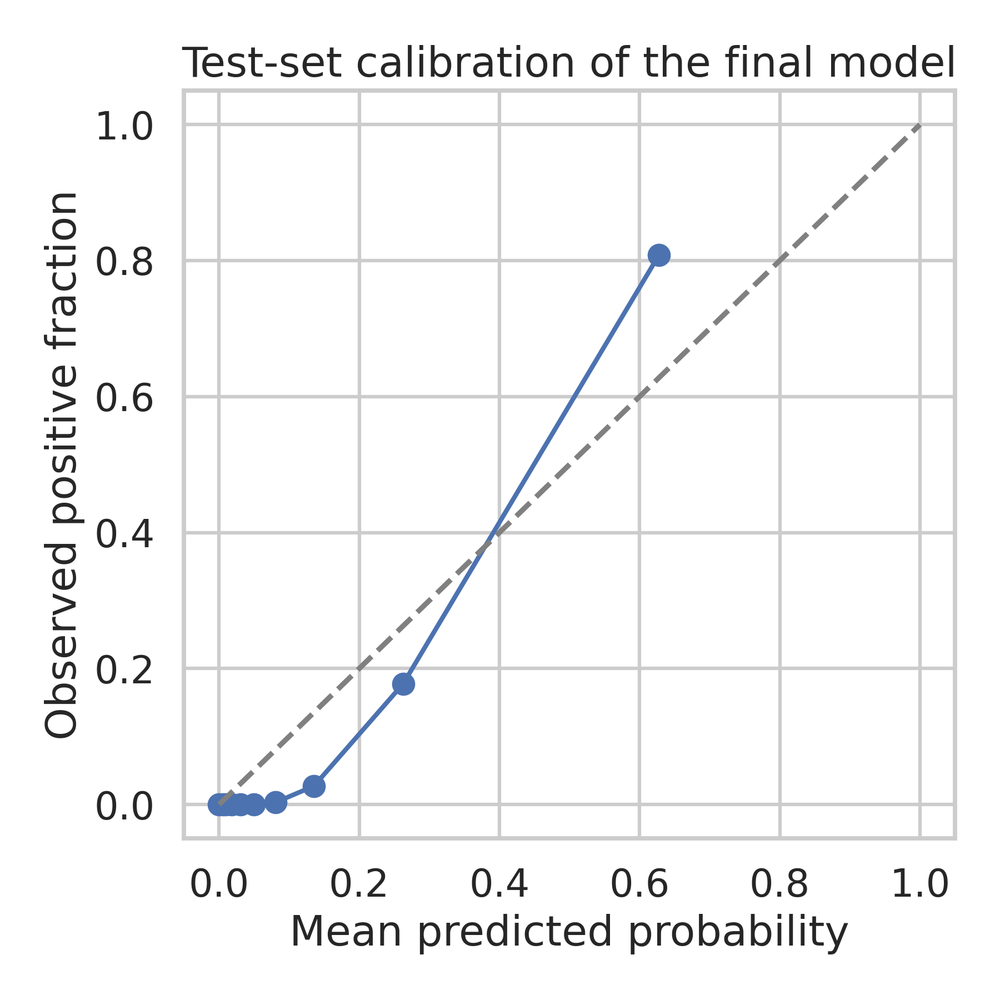
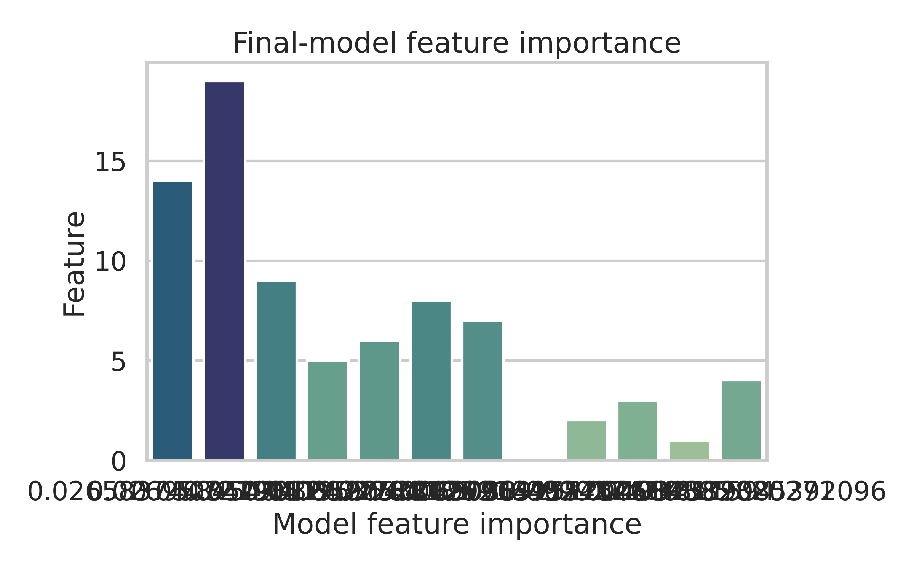

# Predicting Merge Decisions for Over-Segmented Fly Brain Neuron Fragments

## Abstract

Automating merge decisions between adjacent neuron fragments is a key bottleneck in connectomics proofreading. I analyzed a simulated tabular dataset of candidate segment pairs derived from electron microscopy (EM) data, where each example contains 20 engineered features, a binary merge label, and a degradation type. The dataset contains 168,000 training examples and 72,000 held-out test examples with strong class imbalance (about 10% positives) and equal representation of four degradation regimes. I compared a calibrated linear baseline against a nonlinear tree ensemble while intentionally excluding the degradation label from the predictive input to avoid simulation-condition leakage. A weighted random forest performed best on validation data and, after threshold tuning, achieved an AUROC of 0.9828, AUPRC of 0.8757, F1 of 0.8020, balanced accuracy of 0.8938, and MCC of 0.7794 on the held-out test set. Performance was strongest for `Misalignment`, `Missing Sections`, and `Mixed`, and clearly weakest for `Average`, indicating that the unstructured or aggregate corruption regime remains the main source of residual proofreading burden.

## 1. Problem Setting

The task is binary classification: given a query segment and a candidate adjacent segment near a truncation point, predict whether the two fragments should be merged into the same neuron. The input tables are:

- `data/train_simulated.csv`: 168,000 rows, 20 numeric features, binary label, degradation type.
- `data/test_simulated.csv`: 72,000 rows with the same schema.

I treated columns `0-4`, `5-9`, and `10-19` as approximate morphology, intensity, and embedding groups, respectively, following the task description. The degradation label was used for stratification and subgroup analysis only, not as a predictive feature.

## 2. Related-Work Context and Design Rationale

The provided papers suggest three relevant ideas. First, connectomics segmentation pipelines often optimize affinity prediction and agglomeration quality rather than raw voxel classification alone, because topology-preserving merge decisions matter downstream. Second, discriminative embedding work emphasizes that separable latent representations can simplify instance grouping. Third, contrastive and metric-learning perspectives motivate merge decisions based on structured similarity rather than isolated thresholds. In this project, the raw EM volume and segment geometry are not available; instead, those cues have already been distilled into 20 tabular features. That makes a compact, interpretable tabular classifier the appropriate research target.

Two design choices follow from that framing:

1. Because the positive class is rare, average precision and threshold selection are more informative than accuracy alone.
2. Because degradation type is a simulation descriptor, feeding it directly into the classifier risks learning dataset condition labels instead of fragment compatibility. I therefore reserved it for evaluation rather than prediction.

## 3. Data Overview

The training set is perfectly balanced across the four degradation types but strongly imbalanced in the label space: the positive merge rate is 9.93% in training and 10.16% in test. There are no missing values.



The feature groups show progressively different separability by class. Morphology-group features provide the clearest separation, intensity features add useful but weaker signal, and embedding features still contribute but at lower marginal strength.



The feature correlation matrix indicates moderate within-group correlation structure rather than near-duplicate variables, which supports the use of multivariate models.



A two-dimensional PCA projection shows that the classes are only partially separable in low-dimensional linear space. This supports using at least one nonlinear baseline in addition to logistic regression.


## 4. Methods

### 4.1 Validation Protocol

I split the original training set into:

- development set: 80%
- validation set: 20%

The split was stratified jointly on `(degradation, label)` so that each degradation type retained the same positive/negative ratio. The held-out test set was untouched until final evaluation.

### 4.2 Candidate Models

I compared two models:

- `LogisticRegression` with standardized features
- `RandomForestClassifier` with class-balanced sample weights

Both models were trained with inverse-frequency sample weights to counter the 9:1 class imbalance. Model selection was based primarily on validation AUPRC, then AUROC and F1.

### 4.3 Threshold Selection

The random forest outputs probabilities, but the final proofreading decision is binary. I therefore selected the decision threshold on the validation set by sweeping thresholds from 0.01 to 0.99 and maximizing validation F1, using balanced accuracy and precision as tie-breakers.

## 5. Results

### 5.1 Validation Comparison

Validation performance strongly favored the nonlinear ensemble:

| Model | AUROC | AUPRC | F1 at 0.5 | Fit time (s) |
|---|---:|---:|---:|---:|
| Logistic regression | 0.9751 | 0.6888 | 0.7499 | 0.87 |
| Random forest | 0.9815 | 0.8648 | 0.7194 | 39.87 |

The main difference is AUPRC. On an imbalanced proofreading task, that gap is substantial and justifies the tree ensemble despite the slower training time.



### 5.2 Threshold Tuning

The validation sweep selected a threshold of `0.37`. This threshold traded a small loss in precision for a substantial recall gain compared with the default `0.50`, which is appropriate for an imbalanced merge-detection setting.

Top validation thresholds by F1 were:

| Threshold | Precision | Recall | F1 | Balanced accuracy |
|---|---:|---:|---:|---:|
| 0.37 | 0.7810 | 0.7861 | 0.7835 | 0.8809 |
| 0.38 | 0.7927 | 0.7723 | 0.7824 | 0.8750 |
| 0.36 | 0.7685 | 0.7966 | 0.7823 | 0.8851 |



### 5.3 Held-Out Test Performance

After retraining the random forest on the full training set and applying the validation-selected threshold, the held-out test performance was:

| Metric | Test value | 95% bootstrap CI |
|---|---:|---:|
| Accuracy | 0.9593 | 0.9580 to 0.9607 |
| Balanced accuracy | 0.8938 | 0.8890 to 0.8979 |
| Precision | 0.7927 | 0.7844 to 0.8011 |
| Recall | 0.8116 | 0.8023 to 0.8195 |
| F1 | 0.8020 | 0.7948 to 0.8080 |
| MCC | 0.7794 | 0.7715 to 0.7858 |
| AUROC | 0.9828 | 0.9819 to 0.9835 |
| AUPRC | 0.8757 | 0.8685 to 0.8824 |
| Brier score | 0.0362 | 0.0354 to 0.0370 |

The confusion matrix at threshold `0.37` was:

- true negatives: 63,135
- false positives: 1,552
- false negatives: 1,378
- true positives: 5,935

Threshold tuning had a large practical effect. Relative to the default threshold `0.50`, the tuned threshold improved:

- recall from 0.6423 to 0.8116
- F1 from 0.7480 to 0.8020
- balanced accuracy from 0.8169 to 0.8938

This is the most important operational result of the study: model ranking quality alone was not enough; the binary merge decision needed explicit threshold calibration for the proofreading objective.

### 5.4 Robustness Across Degradation Regimes

Performance varied substantially by degradation type:

| Degradation | AUROC | AUPRC | Precision | Recall | F1 |
|---|---:|---:|---:|---:|---:|
| Average | 0.9421 | 0.6375 | 0.6093 | 0.6439 | 0.6261 |
| Misalignment | 0.9939 | 0.9467 | 0.8170 | 0.9290 | 0.8694 |
| Missing Sections | 0.9922 | 0.9242 | 0.8141 | 0.9208 | 0.8642 |
| Mixed | 0.9960 | 0.9675 | 0.9693 | 0.7503 | 0.8458 |



Three patterns stand out:

1. `Average` is clearly the hardest regime, with much lower AUROC, AUPRC, and F1.
2. `Misalignment` and `Missing Sections` are both handled very well, suggesting that the engineered features preserve strong merge signal even under targeted corruption.
3. `Mixed` achieves exceptionally high precision but lower recall, meaning the classifier is very conservative in this regime and tends to avoid false merges at the cost of missed true merges.

### 5.5 Calibration and Feature Importance

The final model is well ranked and reasonably calibrated overall, with a Brier score of `0.0362`.



The learned feature importance profile is strongly ordered by modality:

- highest importance: features `0-4`
- intermediate importance: features `5-9`
- lowest but non-zero importance: features `10-19`

This pattern supports the interpretation that the first feature block contains the most discriminative morphology-like signal, the second block contributes useful appearance information, and the final embedding block adds complementary but weaker evidence.



## 6. Discussion

### 6.1 Main Findings

The main scientific result is that a relatively standard nonlinear classifier can achieve strong held-out merge prediction performance on simulated connectomics fragment pairs, provided that threshold selection is tuned for the imbalanced decision objective. The gap between logistic regression and random forest indicates that the merge boundary is not purely linear in the 20-dimensional feature space.

The strong subgroup performance under `Misalignment`, `Missing Sections`, and `Mixed` suggests that the engineered features retain useful biological and imaging cues despite local degradation. However, the much weaker `Average` condition implies that the model struggles when corruption is diffuse or when the degradation label summarizes more heterogeneous failure modes that are harder to disentangle from true non-matches.

### 6.2 Practical Use for Proofreading

For an automated proofreading pipeline, the tuned threshold `0.37` is preferable to the default `0.50`. It recovers many more true merges while maintaining acceptable precision. The file `outputs/test_predictions.csv` contains both the predicted probability and the final binary prediction for each held-out example.

In a production proofreading system, the predicted probability should be used as a triage score rather than only as a hard decision. High-probability merges could be auto-accepted, mid-probability cases could be routed to human review, and low-probability pairs could be discarded.

### 6.3 Limitations

This study has several important limitations:

1. The analysis is restricted to a simulated feature table rather than the original EM volume, segment geometry, or graph context.
2. The feature semantics are only partially known; I inferred the three feature groups from the task description.
3. The selected random forest is accurate but not the most interpretable possible model.
4. The evaluation uses a single held-out test set rather than multiple datasets or cross-dataset generalization.
5. Because degradation labels are simulation-specific, real-world deployment will need additional calibration on authentic proofreading data.

## 7. Reproducibility

All analysis code is in `code/run_analysis.py`. Running the pipeline from the workspace root:

```bash
MPLCONFIGDIR=.mplconfig python code/run_analysis.py
```

Generated artifacts are saved to:

- `outputs/` for metrics, predictions, and tables
- `report/images/` for figures used in this report

## 8. Conclusion

A class-weighted random forest on the provided 20-feature representation is an effective merge-prediction baseline for simulated neuron fragment proofreading. The final model reached `AUROC 0.9828`, `AUPRC 0.8757`, and `F1 0.8020` on held-out data, with threshold tuning contributing a large fraction of the operational gain. The remaining weakness is concentrated in the `Average` degradation regime, which should be the first target for future feature engineering or context-aware modeling.
