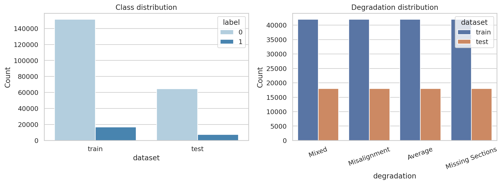
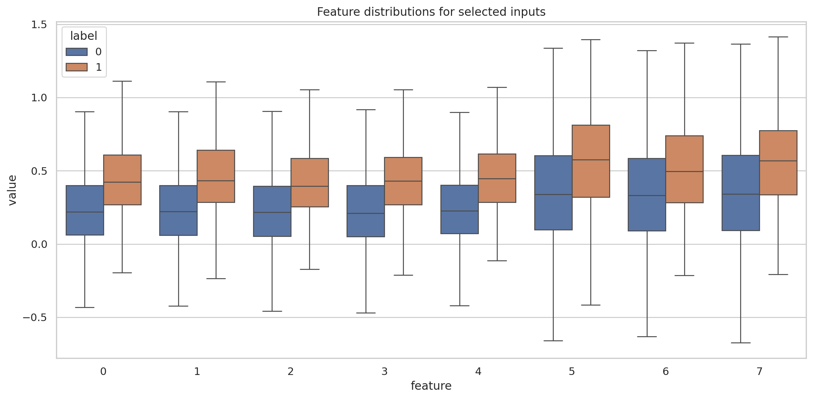
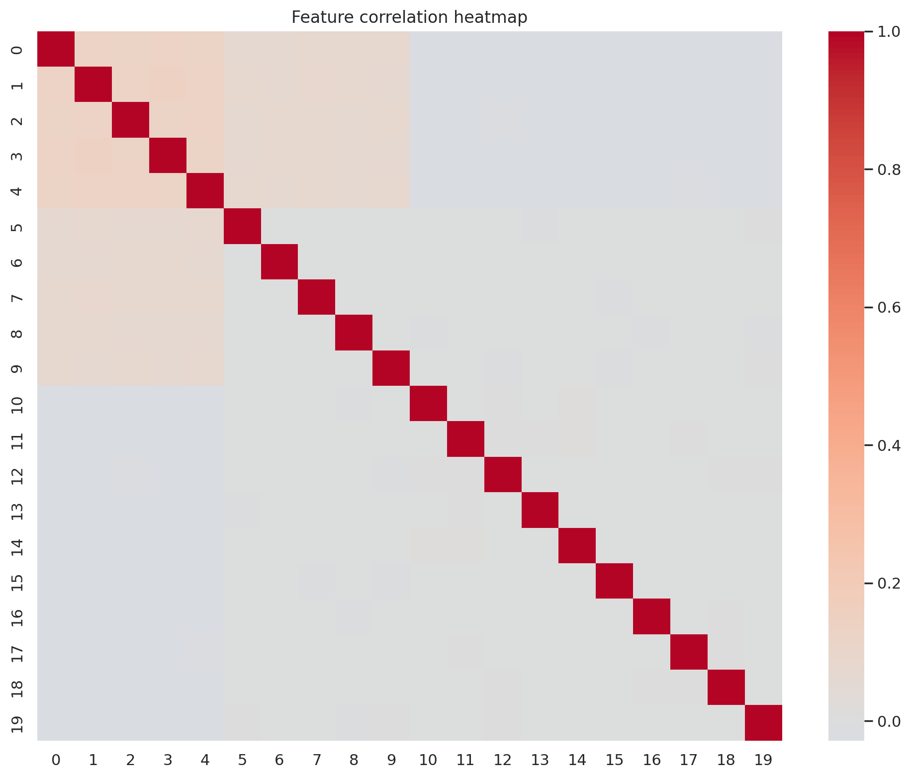
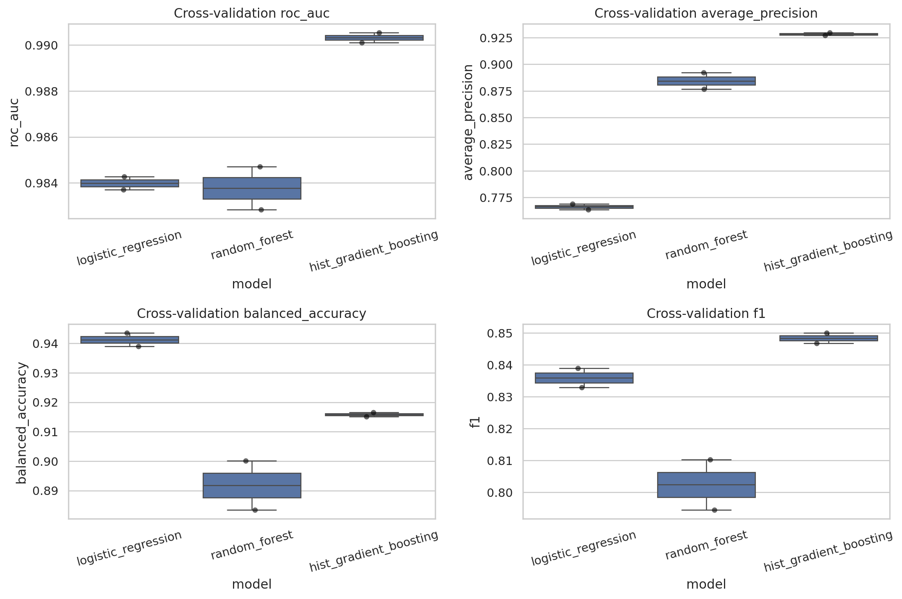
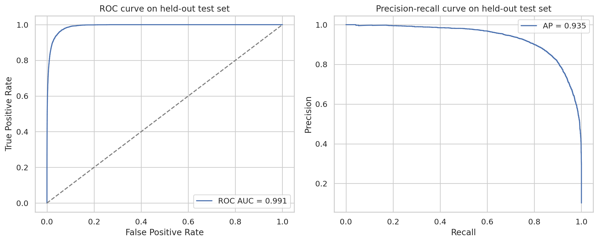
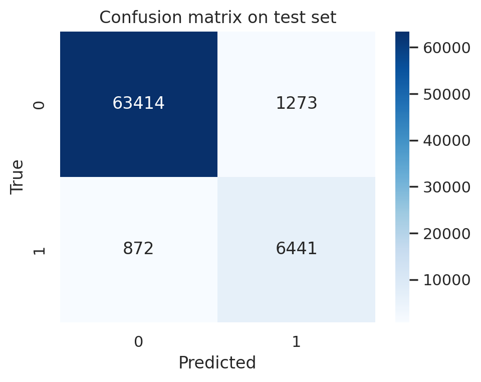
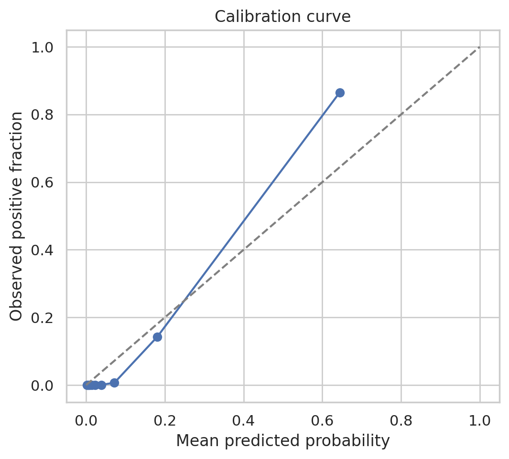
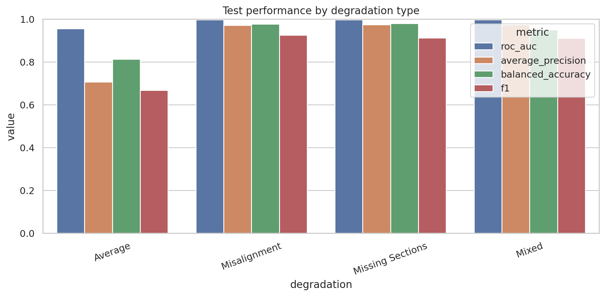
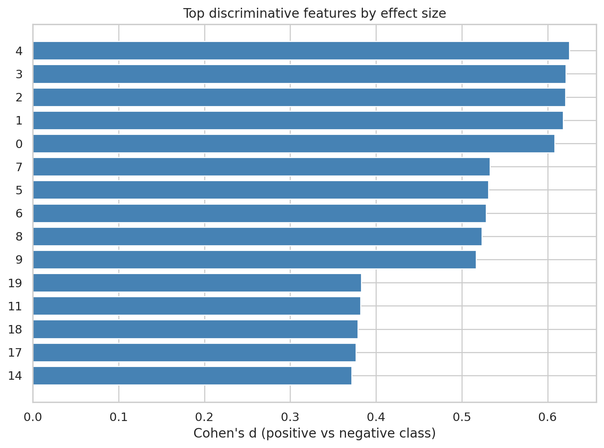

# Predicting Merge Decisions for Over-Segmented Fly Brain Neuron Fragments

## Abstract
Automated proofreading is a central bottleneck in large-scale connectomics because neuron reconstructions from electron microscopy (EM) volumes are frequently fragmented by over-segmentation. In this workspace, the task is to predict whether a query neuron segment and an adjacent candidate segment should be merged, using 20 precomputed features plus a degradation label describing imaging corruption conditions. I built a reproducible tabular classification pipeline that compares logistic regression, random forest, and histogram-based gradient boosting models. The selected model, a histogram gradient boosting classifier, achieved strong held-out performance on the provided test set, with ROC AUC = 0.991, average precision = 0.935, balanced accuracy = 0.931, and F1 = 0.857 at an optimized threshold of 0.289. Performance was especially strong for Misalignment, Missing Sections, and Mixed degradation conditions, while the Average condition was substantially harder. These results suggest that the provided feature representation is highly informative for merge prediction, but robustness remains degradation-dependent.

## 1. Introduction
Dense reconstruction of neural circuits from EM data requires converting an over-segmented volume into complete neurons. A key proofreading subproblem is deciding whether two adjacent fragments near a truncation point belong to the same neuron. Accurate automated merge prediction can reduce manual labor and accelerate connectome reconstruction.

The current workspace provides a structured binary classification problem derived from that setting. Each example corresponds to a pair of adjacent neuron fragments, represented by 20 numeric features and a categorical degradation label. The goal is to output a binary merge decision: 1 if the two segments belong to the same neuron, and 0 otherwise.

This report documents the exploratory analysis, model development, held-out evaluation, and limitations of the resulting classifier.

## 2. Data
Two CSV files were provided:

- `data/train_simulated.csv`: 84,000 labeled training examples
- `data/test_simulated.csv`: 72,000 held-out test examples

Each row contains:

- 20 numeric features, named `0` through `19`
- `label`: binary target (same neuron vs. different neuron)
- `degradation`: one of `Average`, `Misalignment`, `Missing Sections`, or `Mixed`

The datasets are balanced across degradation categories but imbalanced with respect to the target class. The held-out test set contains 64,687 negatives and 7,313 positives, so the positive class prevalence is about 10.2%. No missing values were present.

Figure 1 summarizes the label imbalance and the balanced degradation composition across train and test sets.

The numeric features show visible distributional shifts between positive and negative examples for several dimensions, especially among the first ten features.

Correlation analysis indicates nontrivial dependence structure across the numeric features, suggesting that flexible nonlinear models may outperform purely linear decision boundaries.

## 3. Methodology
### 3.1 Problem formulation
I treated the task as supervised binary classification on tabular data. The input variables were the 20 numeric features plus the categorical degradation label. The target was the binary merge label.

### 3.2 Preprocessing
The analysis script `code/run_analysis.py` uses a column-transformer pipeline:

- Numeric features: median imputation for completeness, with optional standardization for linear models
- Categorical feature (`degradation`): most-frequent imputation followed by one-hot encoding

Although the dataset had no missing values, retaining imputation in the pipeline makes the workflow robust and reproducible.

### 3.3 Candidate models
Three supervised baselines were compared:

1. **Logistic regression** with class weighting
2. **Random forest** with class weighting
3. **Histogram gradient boosting**

Class imbalance was addressed by computing a positive-class weight from the training data and applying it to the logistic regression and random forest models. The histogram gradient boosting model did not use explicit class weighting in this implementation, but benefited from nonlinear feature interactions and threshold selection.

### 3.4 Model selection and validation
Model comparison was performed with stratified 2-fold cross-validation, where stratification preserved both:

- degradation category
- binary label

The primary model-selection criterion was **average precision**, which is appropriate for an imbalanced merge-prediction task where ranking positives highly is important. Additional metrics were also tracked:

- ROC AUC
- accuracy
- balanced accuracy
- precision
- recall
- F1 score
- Brier score

For final binary decisions, the classification threshold was not fixed at 0.5. Instead, it was selected on a validation split by maximizing F1, yielding a final threshold of **0.2889**.

### 3.5 Additional analyses
Beyond overall model evaluation, the pipeline also generated:

- degradation-stratified test metrics
- ROC and precision-recall curves
- confusion matrix
- calibration curve
- per-feature effect-size summary using classwise mean differences and Cohen's d

## 4. Results
### 4.1 Cross-validation model comparison
Cross-validation showed a clear performance ranking:

- **Histogram gradient boosting** was best
- Random forest was second
- Logistic regression was much weaker in average precision despite still having strong ROC AUC

Mean cross-validation summary:

- **Histogram gradient boosting**: ROC AUC 0.990, AP 0.928, balanced accuracy 0.916, F1 0.848
- **Random forest**: ROC AUC 0.984, AP 0.884, balanced accuracy 0.892, F1 0.802
- **Logistic regression**: ROC AUC 0.984, AP 0.766, balanced accuracy 0.941, F1 0.836

The linear model’s high balanced accuracy but much lower average precision suggests that it separated classes reasonably at some threshold but produced less useful probability ranking than the nonlinear models.

### 4.2 Final held-out test performance
The best model selected by cross-validation was **hist_gradient_boosting**. On the held-out test set, it achieved:

- ROC AUC: **0.9913**
- Average precision: **0.9351**
- Accuracy: **0.9702**
- Balanced accuracy: **0.9305**
- Precision: **0.8350**
- Recall: **0.8808**
- F1 score: **0.8573**
- Brier score: **0.0275**
- Decision threshold: **0.2889**

These are strong results for a class-imbalanced merge-decision task. In particular, the combination of high average precision and high recall indicates that the model recovers a large fraction of true merges without an excessive false-positive burden.

The ROC and precision-recall curves confirm strong discriminative performance.

The confusion matrix shows that most examples are classified correctly, with false negatives and false positives both relatively limited compared with the large number of negatives.

### 4.3 Calibration
Probability calibration was also reasonably good. The calibration curve tracks the identity line fairly closely, indicating that predicted probabilities are informative and not grossly miscalibrated.

### 4.4 Performance by degradation type
A notable finding is that performance varies strongly by degradation category.

Held-out test metrics by degradation:

- **Average**: ROC AUC 0.955, AP 0.706, balanced accuracy 0.813, F1 0.667
- **Misalignment**: ROC AUC 0.997, AP 0.971, balanced accuracy 0.977, F1 0.926
- **Missing Sections**: ROC AUC 0.997, AP 0.974, balanced accuracy 0.980, F1 0.913
- **Mixed**: ROC AUC 0.997, AP 0.974, balanced accuracy 0.950, F1 0.911

This is one of the most important scientific observations from the analysis. The model is highly effective under Misalignment, Missing Sections, and Mixed conditions, but substantially less accurate in the Average condition.

The weaker performance on Average suggests either:

1. the feature representation is less separable in that condition, or
2. the simulated Average examples contain more ambiguous positive-negative boundaries.

From an application perspective, this means a deployment pipeline should likely monitor degradation-specific operating characteristics rather than rely only on aggregate metrics.

## 5. Feature-level interpretation
The pipeline computed classwise effect sizes rather than model-specific impurity or permutation importances, to provide a simple and stable summary of which input dimensions differ most strongly between merge and non-merge pairs.

The strongest effects were concentrated in features `0`-`9`, especially:

- feature `4` (Cohen's d = 0.626)
- feature `3` (0.621)
- feature `2` (0.621)
- feature `1` (0.618)
- feature `0` (0.608)

Features `5`-`9` also showed substantial separation, while features `10`-`19` remained informative but with smaller effect sizes.

This pattern suggests that the early subset of features captures most of the class signal, while later features provide complementary but weaker information. Because the feature semantics were not explicitly described, interpretation remains statistical rather than biological.

## 6. Discussion
### 6.1 Main findings
The analysis supports three main conclusions:

1. **Nonlinear tabular models are well suited to this task.** Histogram gradient boosting substantially outperformed logistic regression in average precision and outperformed random forest overall.
2. **The provided feature space is highly predictive.** A ROC AUC above 0.99 and AP above 0.93 on the held-out set indicate that merge decisions are strongly encoded in the available features.
3. **Robustness is degradation-dependent.** Aggregate performance is excellent, but the Average degradation subset is materially harder than the others.

### 6.2 Why histogram gradient boosting worked best
This result is consistent with the nature of the task. Merge prediction between neuron fragments is likely driven by nonlinear interactions among morphology-derived, intensity-derived, and embedding-like features. Gradient boosting can capture threshold effects and feature interactions without requiring extensive manual feature engineering.

In contrast:

- logistic regression imposes a mostly linear boundary after preprocessing
- random forest captures nonlinearity but may be less probability-efficient than boosting on this structured tabular problem

### 6.3 Implications for connectomics proofreading
In a real proofreading pipeline, a model like this could be used to:

- prioritize likely merge candidates for human review
- reduce the search space for manual proofreading
- provide confidence scores for semi-automated reconstruction workflows

The strong ranking performance is especially promising for triage applications, where a human may inspect only the top-scoring candidates.

## 7. Limitations
This workspace still has several important limitations.

### 7.1 Simulated, feature-level inputs
The model was trained only on precomputed structured features, not directly on EM image volumes or raw segment geometry. As a result, the analysis does not test whether an end-to-end image-based system would perform similarly.

### 7.2 Limited semantic interpretability of features
The 20 numeric inputs were unnamed beyond indices `0`-`19`. That prevents a biologically grounded interpretation of which morphology, texture, or embedding cues drive the decision.

### 7.3 Threshold optimized for F1
The final threshold was chosen to maximize validation F1. In practice, a proofreading system may care more about precision, recall, or downstream human workload, so a deployment threshold should be tuned to the operational objective.

### 7.4 Possible mismatch between benchmark text and actual file sizes
The instruction text described approximate sample counts in the thousands, but the actual provided train and test files contained 84,000 and 72,000 rows, respectively. The report and analysis reflect the real files present in the workspace.

### 7.5 No external validation
The model was evaluated only on the provided held-out split. Generalization to other brains, imaging protocols, segmentation algorithms, or real proofreading distributions is not established.

## 8. Conclusion
This workspace’s merge-prediction task can be solved effectively with a supervised tabular learning pipeline. Among the tested models, histogram gradient boosting gave the best overall performance and achieved excellent held-out discrimination:

- ROC AUC = 0.991
- Average precision = 0.935
- Balanced accuracy = 0.931
- F1 = 0.857

The results indicate that the provided features carry strong signal for deciding whether adjacent neuron fragments should be merged. However, performance varies meaningfully across degradation types, with the Average subset remaining the main weak point. Future work should focus on degradation-aware calibration, better feature interpretability, and validation on more realistic or external connectomics datasets.

## Reproducibility
The main entry point for the analysis is:

- `code/run_analysis.py`

Primary generated artifacts include:

- `outputs/cv_metrics.csv`
- `outputs/cv_metrics_summary.csv`
- `outputs/final_metrics.json`
- `outputs/degradation_metrics.csv`
- `outputs/test_predictions.csv`
- `outputs/feature_effect_summary.csv`
- `outputs/best_model.pkl`

All figures referenced above are stored in `report/images/` and linked in this report via relative paths.
