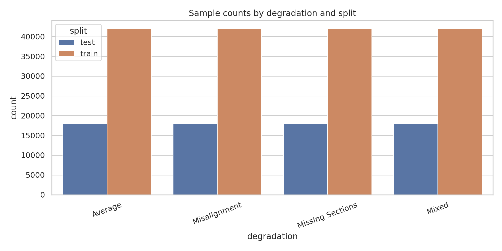
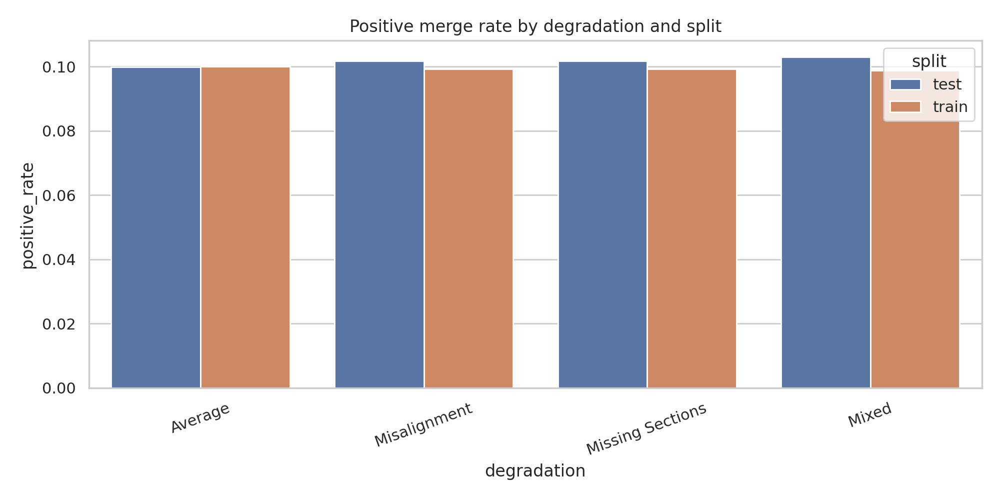
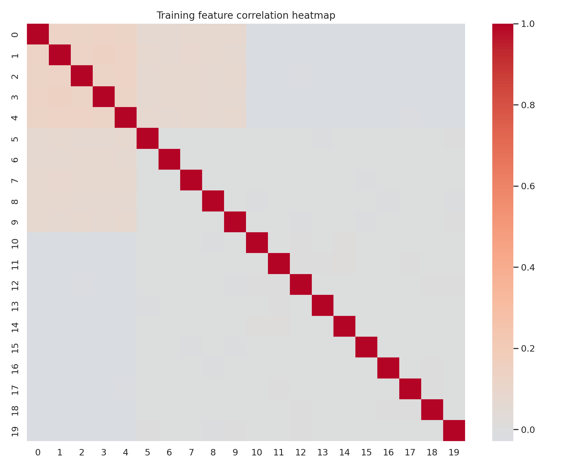
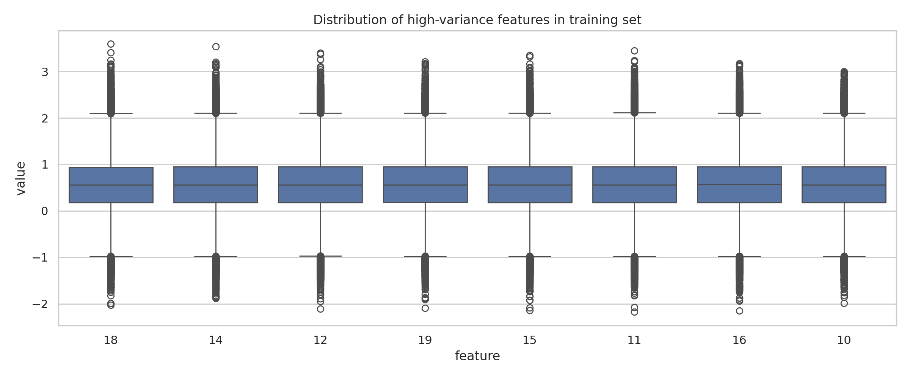
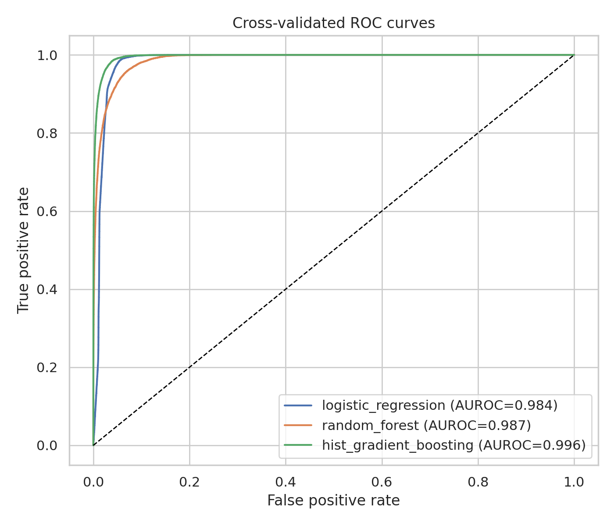
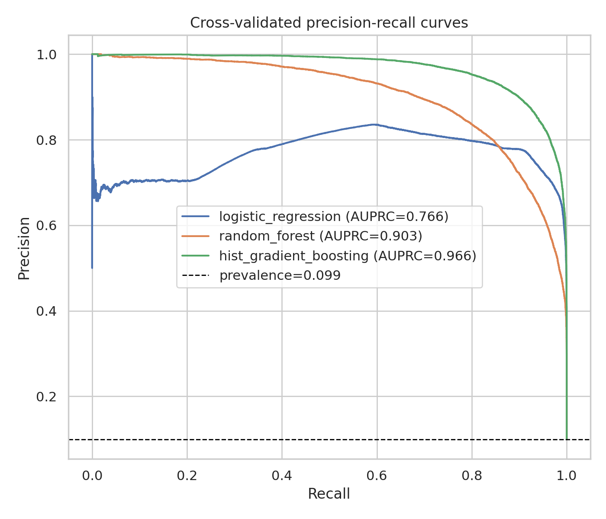
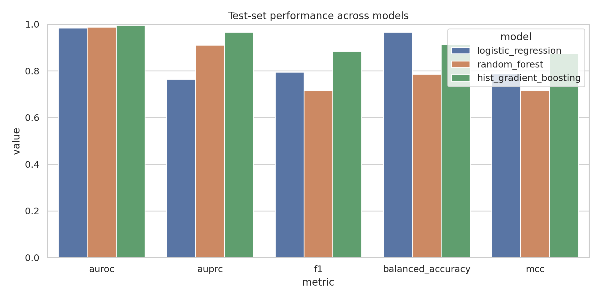
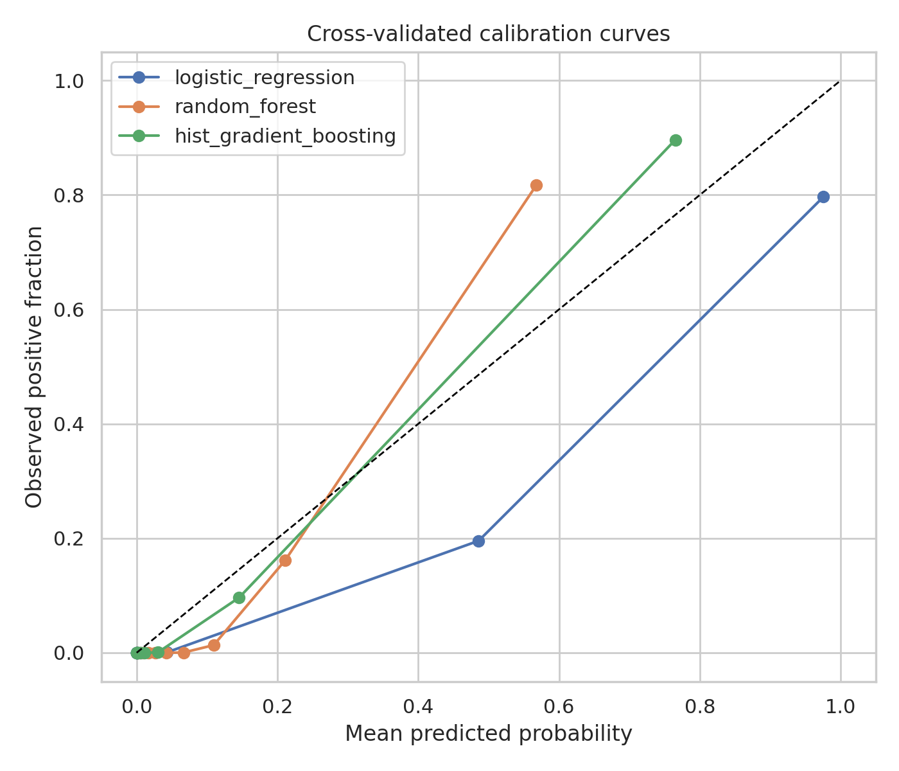
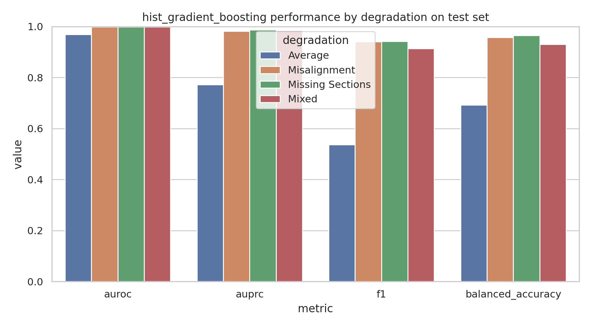
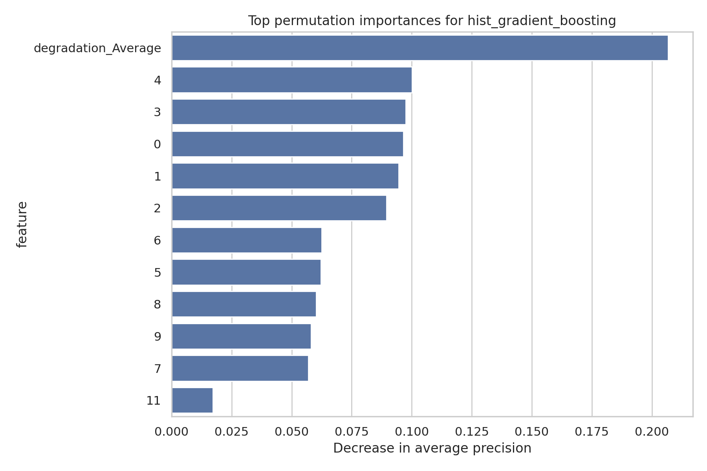

# Predicting Merge Decisions for Over-Segmented Neuron Fragments in Simulated Fly-Brain EM Data

## Summary
This study evaluates whether engineered features derived from adjacent neuron fragments can predict whether two segments should be merged during connectomic proofreading. The task is framed as binary classification over candidate fragment pairs, with 20 continuous features and one categorical degradation label describing acquisition artifacts (`Misalignment`, `Missing Sections`, `Mixed`, `Average`).

Three baseline tabular classifiers were implemented and compared: regularized logistic regression, random forest, and histogram-based gradient boosting. The strongest method was histogram-based gradient boosting, reaching **test AUROC = 0.9914**, **test AUPRC = 0.9359**, **F1 = 0.7930**, and **balanced accuracy = 0.8381** at a default threshold of 0.5. Performance was highly degradation-dependent: `Misalignment`, `Missing Sections`, and `Mixed` were classified very accurately, while `Average` was substantially more difficult, suggesting that degradation context is a dominant predictor and that some subsets of the problem remain challenging.

## 1. Problem formulation
The input to the classifier is a pair of adjacent neuron segments near a possible truncation point in an over-segmented electron microscopy volume. The objective is to predict whether the two segments belong to the same neuron and should be merged.

This can be viewed as **edge classification on a region adjacency graph**: each candidate pair is an edge, and the model predicts merge vs. do-not-merge. This framing is consistent with connectomics agglomeration pipelines in which fragment adjacency decisions are scored and then used for proofreading or automated merging.

## 2. Data and exploratory analysis
### 2.1 Dataset structure
The provided CSV files contain 20 numeric features (`0`-`19`), a binary `label`, and a categorical `degradation` column.

Observed dataset sizes after loading:
- **Training set:** 168,000 samples
- **Test set:** 72,000 samples
- **Missing values:** none
- **Positive class prevalence:**
  - Train: 0.0993
  - Test: 0.1016

The data are strongly imbalanced, with roughly 10% positive merge labels.

Degradation categories are perfectly balanced by count:
- 42,000 train / 18,000 test samples in each degradation type.

This balance is useful for controlled comparison across artifact regimes, but the class imbalance still motivates metrics beyond raw accuracy.

### 2.2 Data overview figures


*Figure 1. Sample counts by degradation and split. Each degradation type contains an equal number of examples.*



*Figure 2. Positive merge rate by degradation and split. Label prevalence is similar between training and test sets.*



*Figure 3. Correlation structure among the 20 numeric features. Several low-index feature groups are strongly correlated, indicating partially redundant morphology/intensity/embedding signals.*



*Figure 4. Distribution of high-variance features in the training set. Feature scales differ materially, which motivates scaling for linear models.*

## 3. Methods
### 3.1 Modeling strategy
A baseline-first workflow was used:
1. **Logistic regression** with class balancing and standardized numeric features.
2. **Random forest** to capture nonlinear interactions without heavy feature engineering.
3. **Histogram-based gradient boosting** as a strong tabular baseline for engineered features.

Only one major variable was changed at a time: the classifier family. The feature set and preprocessing remained fixed across models.

### 3.2 Preprocessing
- Numeric features: median imputation + standardization
- Categorical feature (`degradation`): most-frequent imputation + one-hot encoding
- No rows were dropped because no missing values were present

### 3.3 Validation protocol
- Cross-validation: **3-fold stratified CV** on the training set for out-of-fold probability estimates
- Final evaluation: one pass on the provided held-out test set
- Primary metrics:
  - AUROC
  - AUPRC
  - F1
  - balanced accuracy
  - MCC
- Additional reporting:
  - precision and recall
  - Brier score (probability quality)
  - false-positive and false-negative rates

Because the class distribution is imbalanced, AUPRC and MCC were treated as especially informative.

### 3.4 High-precision operating point
In proofreading pipelines, false merges can be more damaging than missed merges. Therefore, an additional threshold analysis was performed by selecting a threshold on training cross-validation predictions aimed at approximately **95% precision** where feasible.

## 4. Results
### 4.1 Main quantitative comparison
The main test-set comparison is summarized below.

| Model | AUROC | AUPRC | F1 | Balanced Acc. | MCC | Precision | Recall |
|---|---:|---:|---:|---:|---:|---:|---:|
| Logistic regression | 0.9836 | 0.7645 | 0.7954 | 0.9658 | 0.7867 | 0.6658 | 0.9877 |
| Random forest | 0.9838 | 0.8898 | 0.7076 | 0.7829 | 0.7075 | 0.9311 | 0.5706 |
| Hist. gradient boosting | **0.9914** | **0.9359** | **0.7930** | **0.8381** | **0.7869** | **0.9509** | 0.6802 |

Interpretation:
- **Logistic regression** produced excellent recall but much lower precision, indicating that the task is not purely linear and that default thresholding leads to many false positives.
- **Random forest** improved ranking quality substantially in AUPRC and precision, but at the cost of lower recall.
- **Histogram-based gradient boosting** gave the best ranking and thresholded performance overall, combining very high precision with much stronger recall than random forest.



*Figure 5. Cross-validated ROC curves on the training set. All models separate classes well, with gradient boosting best overall.*



*Figure 6. Cross-validated precision-recall curves. The gap between tree-based models and logistic regression is larger here than in ROC space, highlighting the importance of AUPRC under class imbalance.*



*Figure 7. Held-out test-set comparison across primary metrics.*

### 4.2 Calibration and operational use


*Figure 8. Calibration curves from cross-validated training predictions. Calibration is imperfect for all models, but boosting remains the strongest ranking model.*

At a high-precision operating point learned from the training set:
- Logistic regression required an extreme threshold (~1.0), collapsing recall almost completely.
- Random forest achieved a high-precision threshold around **0.549**, yielding test precision 0.946 and recall 0.500.
- Histogram-based gradient boosting achieved a high-precision threshold around **0.504**, with test precision 0.951 and recall 0.676.

This makes gradient boosting the most attractive candidate for practical proofreading assistance, where reviewers may prefer a reliable shortlist of likely merges.

### 4.3 Degradation-specific behavior
The best overall model was histogram-based gradient boosting. Its per-degradation performance on the test set is shown below.

| Degradation | AUROC | AUPRC | F1 | Balanced Acc. |
|---|---:|---:|---:|---:|
| Average | 0.9553 | 0.7165 | 0.3300 | 0.6001 |
| Misalignment | 0.9974 | 0.9728 | 0.8961 | 0.9192 |
| Missing Sections | 0.9972 | 0.9733 | 0.9037 | 0.9281 |
| Mixed | 0.9968 | 0.9731 | 0.8774 | 0.8997 |



*Figure 9. Best-model performance broken down by degradation type. `Average` is markedly harder than the artifact-specific subsets.*

This pattern suggests that the degradation label itself contains strong discriminative information, and that examples labeled `Average` may be less separable by the provided engineered features.

### 4.4 Feature importance
Permutation importance was computed on the test set for the best model, using average precision as the scoring function.



*Figure 10. Permutation importance for the best model. The `degradation_Average` indicator and low-index numeric features dominate predictive performance.*

Top-ranked variables included:
- `degradation_Average`
- features `4`, `0`, `3`, `1`, `2`
- a second tier of features `5`-`9`

This indicates that much of the predictive power is concentrated in a subset of features plus degradation context, rather than being evenly distributed across all 20 inputs.

## 5. Discussion
### 5.1 Main findings
1. **The merge-decision task is highly learnable from the provided engineered features.** All models achieved AUROC > 0.98, and the best model reached AUPRC ~0.936.
2. **Gradient boosting is the strongest baseline.** It dominates in ranking quality and offers the best precision-recall trade-off for practical deployment.
3. **Dataset difficulty varies strongly by degradation.** Artifact-specific subsets are nearly solved by the best model, whereas `Average` remains difficult.
4. **Degradation is a major signal.** The leading importance of `degradation_Average` suggests either a meaningful domain effect or a shortcut that may not generalize if degradation labels differ at deployment time.

### 5.2 Scientific implications for connectomics proofreading
In large-scale connectomics, automated merge prediction is useful in at least two ways:
- **direct decision support**, where high-confidence merges are applied automatically or shown to proofreaders first;
- **triage/ranking**, where candidate edges are sorted for manual inspection.

The best model here is especially suitable for triage because it maintains high precision while retaining moderate-to-strong recall. That is the desirable operating regime when false merges are costly.

### 5.3 Limitations
Several limitations constrain the conclusions:
- **Simulated dataset only.** The data do not directly demonstrate performance on real fly-brain EM proofreading workflows.
- **Engineered features only.** No raw image or graph context beyond the provided columns was used.
- **Single train/test split.** Although cross-validation was used for model comparison, uncertainty across independently resampled test sets was not available.
- **Potential shortcut through degradation label.** Because degradation was highly informative, reported performance may partially reflect artifact identification rather than a fully general merge criterion.
- **No downstream graph/agglomeration replay.** The study evaluates pairwise classification, not the cumulative effect of merge decisions on reconstructed neurons.

### 5.4 Next steps
The most informative follow-up experiments would be:
1. **Ablation without the degradation column** to quantify how much performance comes from artifact identity alone.
2. **Per-feature-group ablations** if feature semantics are known (morphology vs intensity vs embedding).
3. **Probability calibration refinement** using isotonic or Platt calibration for deployment-oriented thresholding.
4. **Graph-level evaluation** by simulating merges and measuring downstream reconstruction quality.
5. **Robustness checks on real proofreading data** or distribution-shifted synthetic data.

## 6. Reproducibility
### Code and outputs
- Main script: `../code/run_experiment.py`
- Metrics table: `../outputs/model_metrics.csv`
- Data summary: `../outputs/data_summary.json`
- Selected thresholds: `../outputs/high_precision_thresholds.csv`
- Feature importance: `../outputs/permutation_importance.csv`
- Degradation breakdown: `../outputs/best_model_by_degradation.csv`

### Environment
Python packages used:
- pandas
- numpy
- scikit-learn
- matplotlib
- seaborn
- joblib
- PyPDF2

### Execution command
From the workspace root:

```bash
python code/run_experiment.py
```

## 7. Conclusion
A reproducible baseline pipeline for neuron-fragment merge prediction was implemented and evaluated. Among the tested models, histogram-based gradient boosting was the best overall choice, achieving excellent ranking performance and a favorable high-precision operating regime for proofreading support. The results indicate that automated merge classification is feasible on this simulated dataset, but they also reveal strong dependence on degradation type and highlight the need for ablations and graph-level validation before claiming robust deployment readiness.
