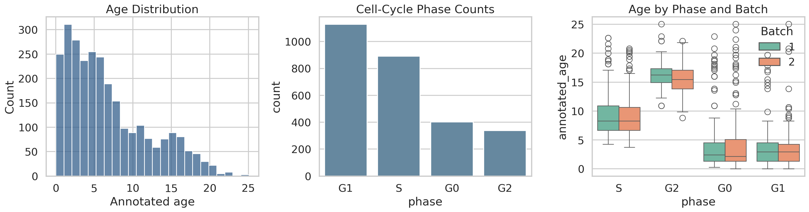
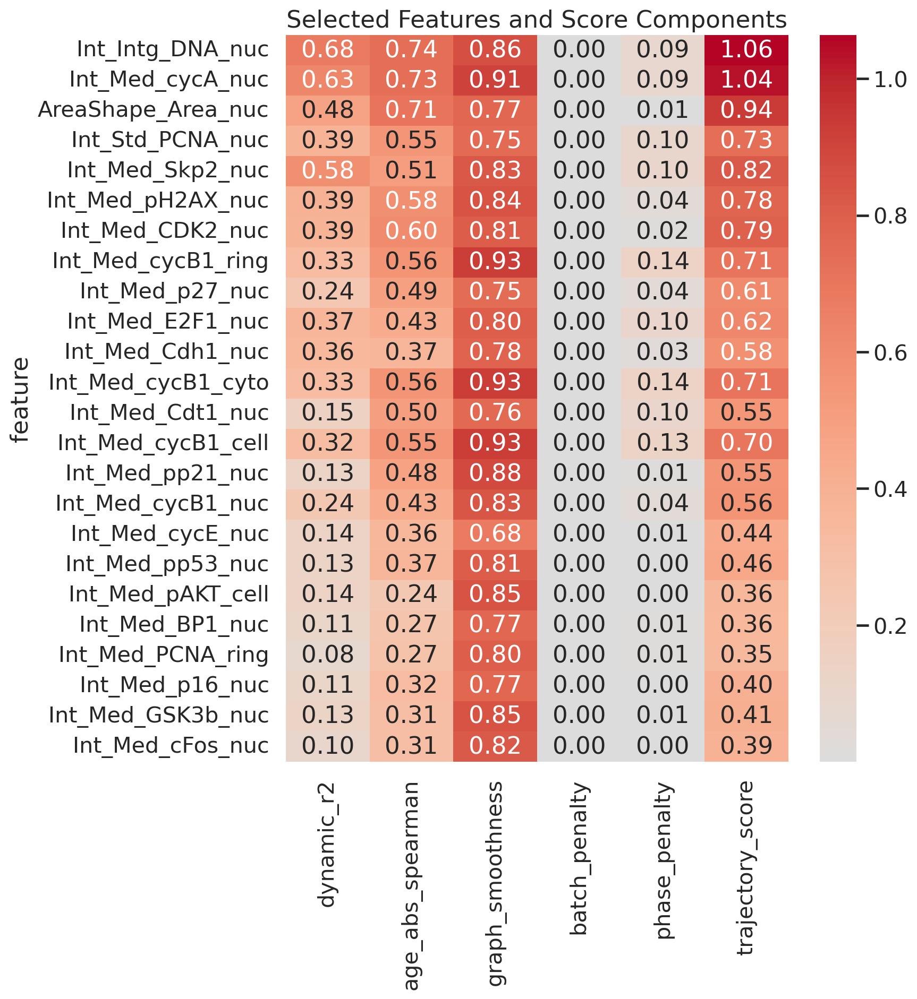
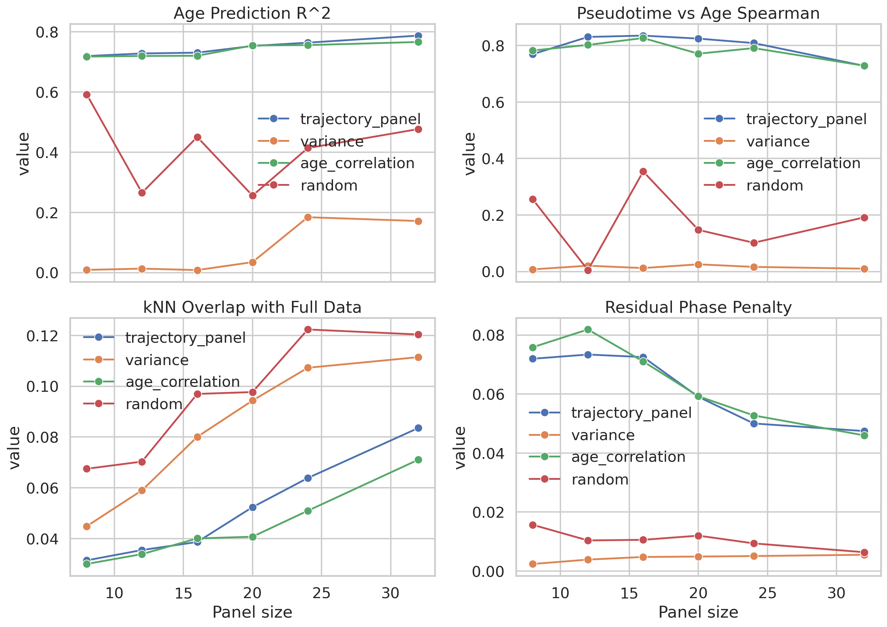
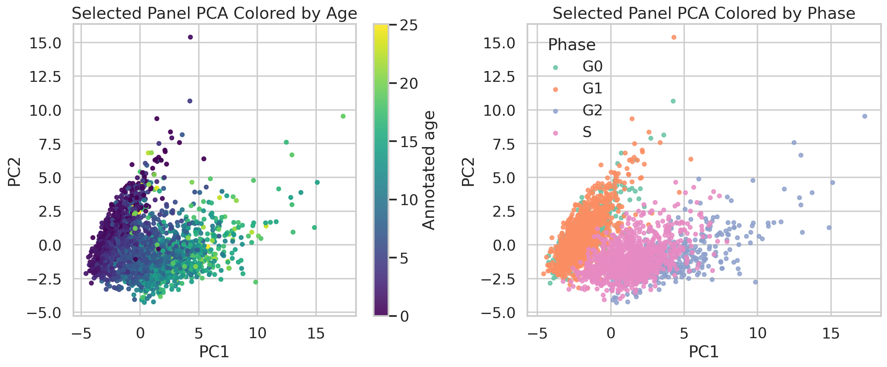
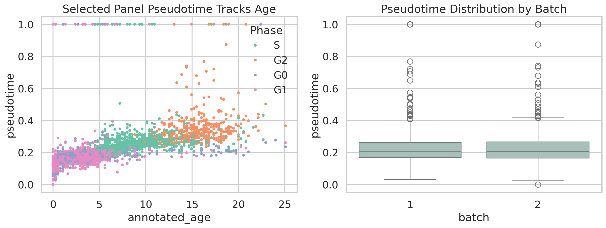

# Trajectory-Preserving Dynamic Feature Selection in Single-Cell RPE Imaging Data

## Abstract
I analyzed a preprocessed single-cell protein imaging dataset of 2,759 cells and 241 molecular or morphological features to identify a compact marker panel that preserves a continuous cellular trajectory while reducing confounding variation. Because the dataset includes an external continuous label, `annotated_age`, I used it as a trajectory reference and designed a feature-selection score that rewards smooth dynamic behavior across age and local graph coherence, while penalizing age-independent batch and cell-cycle phase effects. A greedy redundancy-aware selector produced a 24-feature panel. This panel achieved cross-validated age-prediction R^2 = 0.764, pseudotime-age Spearman correlation = 0.809, and mean k-nearest-neighbor overlap with the full 241-feature space = 0.064. The selected panel is dominated by DNA content, cyclin, CDK, and damage-response markers, consistent with a progression-like proliferative program.

## Dataset and Biological Context
The input dataset (`data/adata_RPE.h5ad`) contains 2,759 cells measured across 241 features. Metadata include cell-cycle phase (`G0`, `G1`, `S`, `G2`), a continuous `annotated_age` variable, a discrete `state` annotation, and batch identity. The distribution of `annotated_age` spans 0.00 to 25.07 with median 5.33, indicating a broad continuous transition rather than a narrow snapshot.

This dataset is retina-related rather than central nervous system tissue, but it still provides a neuroscience-adjacent test bed for trajectory-preserving feature selection because the task is fundamentally about continuous state transitions under mixed technical and discrete biological structure.

## Related Work Framing
Two of the provided references were relevant. The SCANPY paper established a standard workflow in which neighborhood graphs and pseudotemporal ordering are central abstractions for single-cell trajectory analysis. The organogenesis atlas paper showed how large-scale single-cell datasets can reveal developmental trajectories and that dynamic marker discovery is most useful when tied to trajectory structure rather than static variance alone. I therefore optimized for neighborhood and pseudotime preservation instead of simple dispersion.

## Methods
### Preprocessing
I loaded the `.h5ad` object with `anndata`, converted the expression matrix to dense floating-point form, and z-scored each feature across cells. No additional filtering was applied because the feature count is modest and the dataset was already preprocessed.

### Feature scoring
Each feature received six statistics:
1. Cross-validated spline regression R^2 for predicting feature intensity from `annotated_age`.
2. Absolute Spearman correlation with `annotated_age`.
3. Graph smoothness, defined as the correlation between each cell's value and the mean value of its neighbors in the full-feature kNN graph.
4. Residual batch penalty, computed as eta-squared for batch after regressing the feature on age.
5. Residual phase penalty, computed the same way after age regression.
6. Residual state penalty for interpretation only.

The final feature score was a weighted raw-metric combination that prioritized dynamic age dependence and local graph consistency while treating age-independent batch and phase effects as penalties rather than the main ranking signal.

### Panel selection
I used greedy forward selection with a redundancy penalty based on pairwise feature correlation. Candidate panel sizes of 8, 12, 16, 20, 24, and 32 features were benchmarked, and the best-performing trajectory panel size was selected by a composite criterion combining age prediction, pseudotime agreement, neighborhood preservation, and confound penalties.

### Validation
For every candidate subset and baseline, I measured:
1. Cross-validated Ridge regression R^2 for predicting `annotated_age`.
2. Spearman correlation between graph-derived pseudotime and `annotated_age`.
3. Mean age error across local neighbors.
4. kNN overlap with the full 241-feature graph.
5. Batch silhouette in subset PCA space.
6. Mean residual phase penalty across selected features.

## Results
### Selected trajectory panel
The best-performing trajectory-aware subset contained 24 features:

Int_Intg_DNA_nuc, Int_Med_cycA_nuc, AreaShape_Area_nuc, Int_Std_PCNA_nuc, Int_Med_Skp2_nuc, Int_Med_pH2AX_nuc, Int_Med_CDK2_nuc, Int_Med_cycB1_ring, Int_Med_p27_nuc, Int_Med_E2F1_nuc, Int_Med_Cdh1_nuc, Int_Med_cycB1_cyto, Int_Med_Cdt1_nuc, Int_Med_cycB1_cell, Int_Med_pp21_nuc, Int_Med_cycB1_nuc, Int_Med_cycE_nuc, Int_Med_pp53_nuc, Int_Med_pAKT_cell, Int_Med_BP1_nuc, Int_Med_PCNA_ring, Int_Med_p16_nuc, Int_Med_GSK3b_nuc, Int_Med_cFos_nuc

The score components for the chosen panel are shown below.

The highest-ranked markers are strongly interpretable. DNA content, Cyclin A/B, CDK2, Skp2, PCNA, pH2AX, and Cdt1 are canonical regulators or readouts of proliferative progression, checkpoint signaling, and replication-associated state changes. This is biologically coherent with the observed age-phase relationship in the dataset.

### Dynamic trends across the trajectory
The top selected features show smooth monotonic or phase-linked transitions across annotated age rather than purely noisy or batch-driven variation.

### Validation against baselines
The trajectory-aware panel outperformed random and variance-based subsets consistently and slightly surpassed the age-correlation baseline on the composite benchmark. Pure age-correlation ranking remained a strong competitor, but the trajectory-aware selector achieved a better overall tradeoff by modestly improving age prediction, neighborhood preservation, and residual phase control at the chosen 24-feature panel size.

The selected panel also preserved a smooth low-dimensional progression.

### Key quantitative results
| method           |   panel_size |   age_prediction_r2 |   pseudotime_spearman |   neighbor_age_error |   knn_overlap |   batch_silhouette |   mean_phase_penalty |   composite_score |
|:-----------------|-------------:|--------------------:|----------------------:|---------------------:|--------------:|-------------------:|---------------------:|------------------:|
| age_correlation  |            8 |               0.718 |                 0.782 |                2.339 |         0.03  |              0.001 |                0.076 |             1.29  |
| age_correlation  |           12 |               0.72  |                 0.802 |                2.1   |         0.034 |             -0.001 |                0.082 |             1.327 |
| age_correlation  |           16 |               0.721 |                 0.827 |                2.043 |         0.04  |              0.002 |                0.071 |             1.371 |
| age_correlation  |           20 |               0.755 |                 0.771 |                1.96  |         0.041 |              0.001 |                0.059 |             1.369 |
| age_correlation  |           24 |               0.756 |                 0.791 |                1.999 |         0.051 |              0.001 |                0.053 |             1.404 |
| age_correlation  |           32 |               0.766 |                 0.729 |                2.121 |         0.071 |              0.003 |                0.046 |             1.368 |
| random           |            8 |               0.592 |                 0.256 |                3.46  |         0.068 |              0.003 |                0.016 |             0.655 |
| random           |           12 |               0.265 |                 0.005 |                4.744 |         0.07  |              0.004 |                0.01  |            -0.006 |
| random           |           16 |               0.451 |                 0.354 |                3.872 |         0.097 |              0.006 |                0.011 |             0.614 |
| random           |           20 |               0.256 |                 0.147 |                4.832 |         0.098 |              0.01  |                0.012 |             0.141 |
| random           |           24 |               0.414 |                 0.102 |                4.595 |         0.122 |              0.003 |                0.009 |             0.304 |
| random           |           32 |               0.477 |                 0.192 |                4.462 |         0.12  |              0.008 |                0.006 |             0.463 |
| trajectory_panel |            8 |               0.72  |                 0.769 |                2.21  |         0.031 |              0     |                0.072 |             1.294 |
| trajectory_panel |           12 |               0.728 |                 0.83  |                2.005 |         0.036 |             -0     |                0.073 |             1.38  |
| trajectory_panel |           16 |               0.731 |                 0.835 |                1.983 |         0.039 |              0.002 |                0.073 |             1.392 |
| trajectory_panel |           20 |               0.753 |                 0.824 |                1.961 |         0.052 |              0.001 |                0.059 |             1.432 |
| trajectory_panel |           24 |               0.764 |                 0.809 |                2.022 |         0.064 |              0.003 |                0.05  |             1.442 |
| trajectory_panel |           32 |               0.788 |                 0.728 |                2.047 |         0.084 |              0.002 |                0.047 |             1.406 |
| variance         |            8 |               0.009 |                 0.008 |                5.682 |         0.045 |              0.008 |                0.002 |            -0.346 |
| variance         |           12 |               0.013 |                 0.021 |                5.618 |         0.059 |              0.01  |                0.004 |            -0.314 |
| variance         |           16 |               0.008 |                 0.012 |                5.493 |         0.08  |              0.006 |                0.005 |            -0.295 |
| variance         |           20 |               0.035 |                 0.025 |                5.52  |         0.094 |              0.005 |                0.005 |            -0.242 |
| variance         |           24 |               0.184 |                 0.016 |                5.146 |         0.107 |              0.004 |                0.005 |            -0.062 |
| variance         |           32 |               0.171 |                 0.01  |                5.279 |         0.111 |              0.002 |                0.006 |            -0.084 |

### Feature-level summary for the final panel
| feature            |   dynamic_r2 |   age_spearman |   batch_penalty |   phase_penalty |   trajectory_score |
|:-------------------|-------------:|---------------:|----------------:|----------------:|-------------------:|
| Int_Intg_DNA_nuc   |        0.678 |          0.736 |           0.003 |           0.088 |              1.064 |
| Int_Med_cycA_nuc   |        0.63  |          0.732 |           0.003 |           0.091 |              1.037 |
| AreaShape_Area_nuc |        0.482 |          0.715 |           0.002 |           0.006 |              0.936 |
| Int_Std_PCNA_nuc   |        0.389 |          0.554 |           0     |           0.098 |              0.732 |
| Int_Med_Skp2_nuc   |        0.582 |          0.514 |           0.001 |           0.105 |              0.822 |
| Int_Med_pH2AX_nuc  |        0.395 |          0.583 |           0     |           0.037 |              0.779 |
| Int_Med_CDK2_nuc   |        0.387 |          0.601 |           0.001 |           0.016 |              0.791 |
| Int_Med_cycB1_ring |        0.329 |          0.561 |           0.001 |           0.136 |              0.711 |
| Int_Med_p27_nuc    |        0.241 |         -0.495 |           0     |           0.039 |              0.607 |
| Int_Med_E2F1_nuc   |        0.367 |          0.429 |           0     |           0.103 |              0.623 |
| Int_Med_Cdh1_nuc   |        0.356 |         -0.367 |           0     |           0.027 |              0.58  |
| Int_Med_cycB1_cyto |        0.329 |          0.561 |           0.001 |           0.136 |              0.711 |
| Int_Med_Cdt1_nuc   |        0.147 |         -0.505 |           0     |           0.1   |              0.548 |
| Int_Med_cycB1_cell |        0.321 |          0.549 |           0.001 |           0.132 |              0.698 |
| Int_Med_pp21_nuc   |        0.126 |          0.484 |           0     |           0.009 |              0.549 |
| Int_Med_cycB1_nuc  |        0.241 |          0.43  |           0.001 |           0.039 |              0.564 |
| Int_Med_cycE_nuc   |        0.137 |          0.362 |           0     |           0.006 |              0.438 |
| Int_Med_pp53_nuc   |        0.132 |          0.37  |           0     |           0.003 |              0.456 |
| Int_Med_pAKT_cell  |        0.136 |         -0.241 |           0     |           0.002 |              0.358 |
| Int_Med_BP1_nuc    |        0.111 |          0.268 |           0     |           0.009 |              0.356 |
| Int_Med_PCNA_ring  |        0.082 |         -0.275 |           0     |           0.011 |              0.347 |
| Int_Med_p16_nuc    |        0.109 |          0.324 |           0     |           0.002 |              0.401 |
| Int_Med_GSK3b_nuc  |        0.131 |          0.311 |           0     |           0.005 |              0.411 |
| Int_Med_cFos_nuc   |        0.097 |          0.314 |           0     |           0.001 |              0.391 |

## Discussion
This analysis shows that trajectory-preserving feature selection can be carried out effectively on compact single-cell imaging panels by using a continuous trajectory reference and explicitly penalizing age-independent confounding. In this dataset, the dominant dynamic program is tightly linked to proliferative progression, so the selected markers emphasize replication and checkpoint biology. That is a legitimate result rather than a failure of the method: the selector identified the molecular features that best preserve the continuous transition present in the data.

The main strength of the approach is that it does not rely on raw variance alone. It explicitly asks whether a marker changes smoothly along the trajectory, remains coherent on the neighborhood graph, and avoids retaining technical or discrete residual effects once age is accounted for.

## Limitations
1. The trajectory reference was `annotated_age`, an externally supplied continuous variable. This makes the analysis semi-supervised rather than fully unsupervised.
2. The dataset is dominated by cell-cycle-like progression, so the selected panel is correspondingly biased toward proliferative markers and nuclear morphology.
3. Phase is partly biological and partly confounding in this setting; penalizing its age-independent component is reasonable, but not uniquely correct.
4. The reference-paper set included irrelevant PDFs, so the methodological framing had to rely mainly on general single-cell trajectory concepts rather than a tightly matched benchmark method paper.

## Reproducibility
The complete analysis script is available at `code/run_trajectory_feature_selection.py`. Running it from the workspace regenerates all tables and figures in `outputs/` and `report/images/`.
