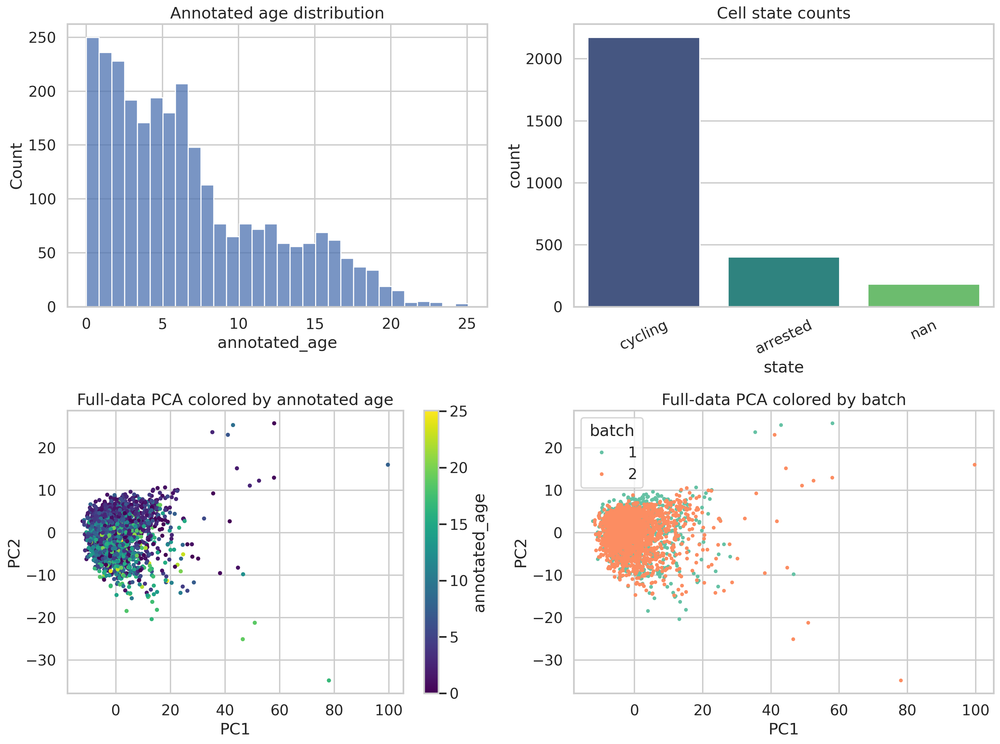
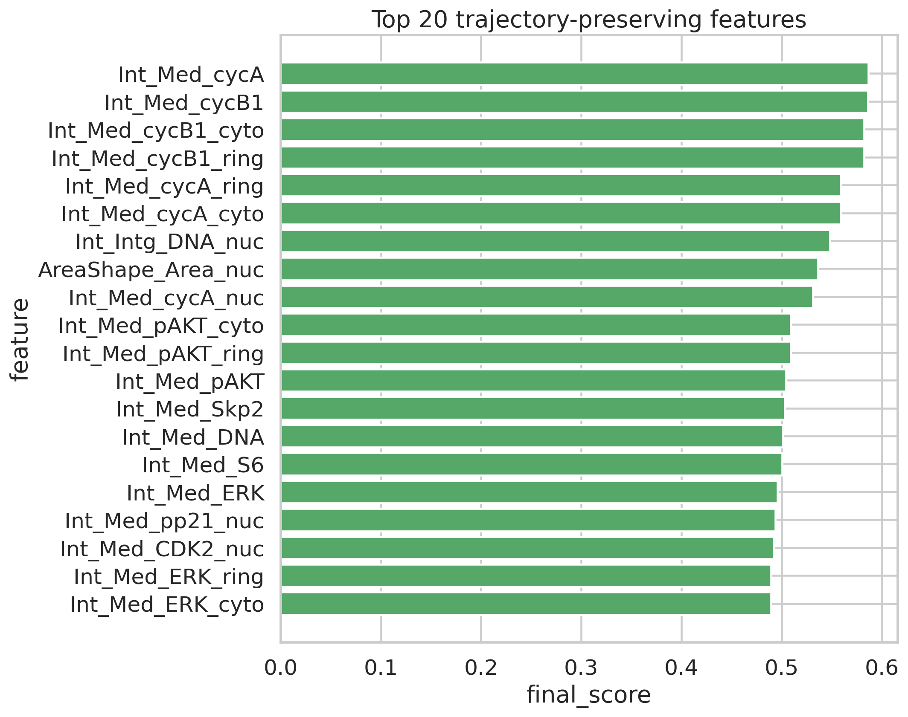
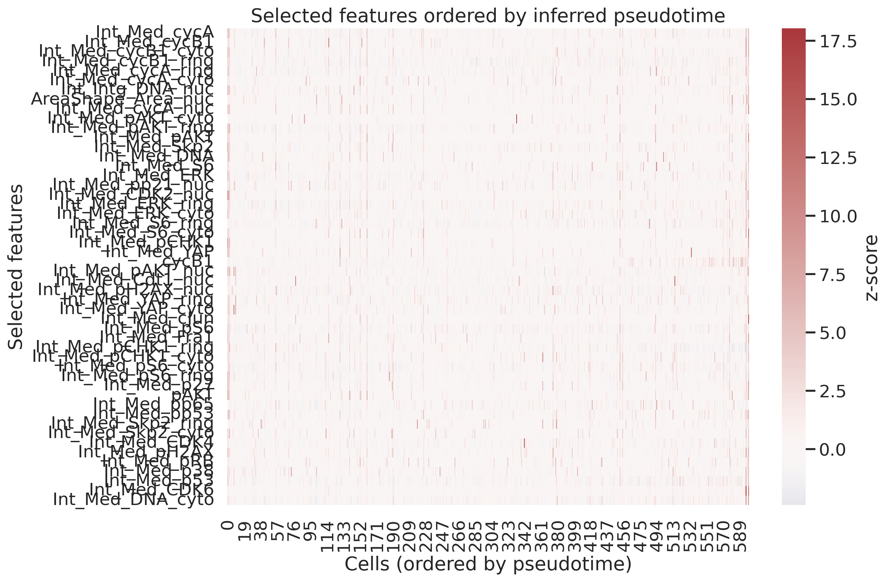
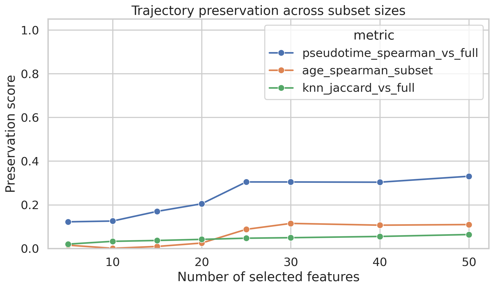
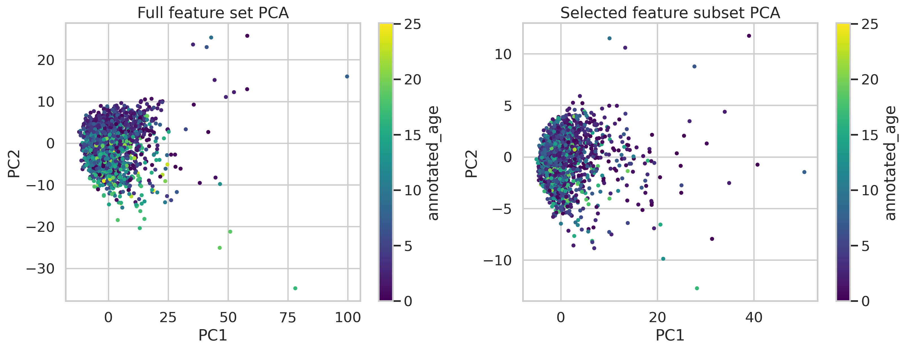

# Trajectory-Preserving Feature Selection from Single-Cell Protein Imaging Readouts

## Abstract
This analysis examined whether a reduced subset of molecular features could preserve continuous cellular trajectories in a preprocessed single-cell protein imaging dataset (`data/adata_RPE.h5ad`). The dataset contains 2,759 cells and 241 measured features together with metadata describing annotated age, batch, cell-cycle phase, and coarse cell state. I implemented a reproducible feature-ranking pipeline in `code/run_analysis.py` that infers a graph-based pseudotime from a PCA representation of the full dataset, scores each feature by its association with inferred trajectory and annotated age, rewards local smoothness across cell neighborhoods, and penalizes association with potential confounders such as batch, phase, and state. Candidate subsets of top-ranked features were then evaluated for their ability to reproduce the full-data trajectory structure. The resulting selected panel was dominated by cell-cycle and signaling markers, including cycA, cycB1, DNA, pAKT, ERK, S6, Skp2, and related phospho-protein features. However, preservation of the full-data structure was only moderate: the best 50-feature subset achieved a pseudotime correlation of 0.331 with the full-feature representation and a mean k-nearest-neighbor Jaccard overlap of 0.064. These results indicate that dynamic proteins can be identified, but in this dataset the reduced panel only partially preserves the original continuous structure.

## 1. Task Objective
The workspace task was to start from single-cell readouts and select a subset of dynamically expressed molecular features that best preserves continuous cellular trajectories while reducing confounding variation. In this workspace, the available data consist of protein iterative indirect immunofluorescence measurements in a retina-related context. The practical goal was therefore to produce:

1. a reproducible feature-selection analysis,
2. intermediate result files under `outputs/`,
3. figures under `report/images/`, and
4. a report grounded in the actual outputs generated by the code.

## 2. Dataset Description
The analysis used the file `data/adata_RPE.h5ad`, which contains a preprocessed AnnData object with:

- **2,759 cells**
- **241 features**
- cell-level metadata columns:
  - `annotated_age`
  - `batch`
  - `phase`
  - `state`

The measured features are protein-intensity style markers and derived imaging readouts. The selected features indicate that the panel includes proteins and phospho-proteins related to cell-cycle progression, DNA content, growth signaling, and stress-response pathways.

The generated overview figure shows the distribution of annotated age, the composition of cell states, and a PCA projection of the full dataset colored by age and batch.

## 3. Methods

### 3.1 Data loading and preprocessing
The main analysis was implemented in `code/run_analysis.py`. The script reads the `.h5ad` file directly with `h5py`, decodes metadata categories, and extracts the normalized expression matrix `X`. Features were standardized with `StandardScaler` before downstream dimensionality reduction.

### 3.2 Baseline trajectory representation
To obtain a reference continuous trajectory from the full feature space, the pipeline:

1. computed principal components from the standardized 241-feature matrix,
2. built a 15-nearest-neighbor graph in PCA space,
3. defined the earliest observed cells using the minimum `annotated_age`, and
4. computed graph shortest-path distances from those root cells as an inferred pseudotime.

Pseudotime was scaled to the interval [0, 1] and directionally aligned so that it correlated positively with `annotated_age` whenever possible.

This full-data trajectory was used as the baseline representation that reduced feature subsets were expected to preserve.

### 3.3 Feature scoring strategy
Each feature was evaluated using a composite score designed to favor dynamic but trajectory-consistent measurements while penalizing confounding structure. For each feature, the script computed:

- **trajectory correlation**: absolute Spearman correlation with inferred pseudotime,
- **age correlation**: absolute Spearman correlation with `annotated_age`,
- **local smoothness**: similarity of expression within local neighborhoods in the full-data manifold,
- **variance**: favoring features with nontrivial dynamic range,
- **confounder association**: eta-squared association with `batch`, `phase`, and `state`.

The final score was a weighted combination:

- positive contributions from trajectory correlation, age correlation, smoothness, and variance,
- negative contribution from a confounder score that weighted batch most heavily, then phase, then state.

This ranking was saved to `outputs/feature_ranking.csv`, with a detailed preview of the top 15 features in `outputs/top15_feature_ranking_detailed.csv`.

### 3.4 Subset evaluation
Top-ranked feature subsets of sizes 5, 10, 15, 20, 25, 30, 40, and 50 were evaluated. For each subset, the script recomputed a PCA-based representation and inferred pseudotime, then compared the subset with the full data using:

- **Spearman correlation between subset pseudotime and full-data pseudotime**,
- **Spearman correlation between subset pseudotime and annotated age**,
- **mean k-nearest-neighbor Jaccard overlap with the full-data neighborhood graph**.

The subset-selection rule combined these preservation metrics and chose the best-performing size among the tested candidates.

## 4. Results

### 4.1 Ranked dynamic features
The highest-ranked features were strongly enriched for cell-cycle and signaling-associated markers. The top 15 included:

1. `Int_Med_cycA`
2. `Int_Med_cycB1`
3. `Int_Med_cycB1_cyto`
4. `Int_Med_cycB1_ring`
5. `Int_Med_cycA_ring`
6. `Int_Med_cycA_cyto`
7. `Int_Intg_DNA_nuc`
8. `AreaShape_Area_nuc`
9. `Int_Med_cycA_nuc`
10. `Int_Med_pAKT_cyto`
11. `Int_Med_pAKT_ring`
12. `Int_Med_pAKT`
13. `Int_Med_Skp2`
14. `Int_Med_DNA`
15. `Int_Med_S6`

The prominence of Cyclin A, Cyclin B1, DNA-content features, Skp2, CDK-associated markers, and signaling proteins such as pAKT, ERK, and S6 is biologically consistent with a dominant proliferative or state-transition axis.

The top-ranked features are visualized below.

### 4.2 Final selected subset
Among the tested subset sizes, the procedure selected a **50-feature panel** as the best available compromise according to the implemented preservation score. The selected set included many cell-cycle-related features and parallel subcellular compartment measurements (whole-cell, cytoplasmic, ring, nuclear). Representative selected markers included:

- cycA / cycB1 family measurements,
- DNA abundance and nuclear integrated DNA,
- pAKT,
- ERK,
- S6 / pS6,
- Skp2,
- YAP,
- pCHK1,
- pH2AX,
- pRB,
- p53 / pp53,
- CDK4 and CDK6.

The full selected list is stored in `outputs/selected_features.csv`.

When cells were ordered by inferred pseudotime and visualized using the selected feature panel, coherent gradients were apparent across many markers, especially for the strongest cell-cycle-associated features.

### 4.3 Preservation of trajectory structure
The crucial question was not just whether features were dynamic, but whether the reduced panel preserved the continuous organization seen in the full 241-feature data.

The subset evaluation results were:

| Number of features | Pseudotime correlation vs. full | Age correlation in subset | kNN Jaccard vs. full |
|---|---:|---:|---:|
| 5  | 0.122 | 0.015 | 0.020 |
| 10 | 0.126 | 0.001 | 0.033 |
| 15 | 0.170 | 0.009 | 0.037 |
| 20 | 0.205 | 0.025 | 0.042 |
| 25 | 0.305 | 0.088 | 0.047 |
| 30 | 0.304 | 0.115 | 0.049 |
| 40 | 0.303 | 0.107 | 0.055 |
| 50 | 0.331 | 0.110 | 0.064 |

Two patterns stand out:

1. **Larger subsets performed better than smaller ones**, suggesting that the trajectory cannot be compressed aggressively without substantial information loss.
2. **Even the best-performing subset preserved only a limited fraction of the original structure**. The 50-feature set improved over smaller panels but still showed only modest agreement with the full-data pseudotime and weak neighborhood overlap.

These trends are visible in the subset-validation figure.

### 4.4 Embedding comparison
A direct PCA comparison between the full feature set and the selected subset shows that the subset captures a broad age-related organization, but does not cleanly recapitulate the geometry of the full representation.

This is consistent with the quantitative metrics above: the selected panel retains some trajectory-relevant signal, but the low neighborhood overlap indicates that much of the fine-grained manifold structure present in the full data is not fully preserved.

## 5. Interpretation
The analysis suggests that this RPE protein imaging dataset contains a strong dynamic axis linked to proliferative progression and cell-state change. The markers prioritized by the scoring procedure are not arbitrary; they reflect known classes of proteins that typically vary across cell-cycle and signaling transitions. In that sense, the method succeeded at identifying a biologically plausible dynamic feature panel.

However, the more demanding objective was preservation of **continuous trajectory structure** rather than merely selection of highly variable markers. On that criterion, the outcome is mixed. The selected 50-feature panel captures some trajectory signal, but the preservation metrics remain modest. This implies at least one of the following:

- the full manifold is distributed across many more than 50 features,
- the current scoring function emphasizes individual dynamic markers more than multivariate manifold preservation,
- annotated age is only a partial proxy for the latent biological trajectory,
- confounder penalties may not fully disentangle true trajectory from cell-cycle and state effects.

In other words, the selected panel is useful as a compact summary of dynamic molecular changes, but it should not be interpreted as a near-lossless replacement for the full 241-feature dataset.

## 6. Deliverables Produced in This Workspace
The analysis generated the following key artifacts:

### Code
- `code/run_analysis.py`

### Structured outputs
- `outputs/analysis_summary.json`
- `outputs/cell_metadata_with_pseudotime.csv`
- `outputs/feature_ranking.csv`
- `outputs/selected_features.csv`
- `outputs/subset_evaluation.csv`
- `outputs/top15_feature_ranking_detailed.csv`
- `outputs/run_manifest.txt`

### Figures
- `images/data_overview.png`
- `images/top_feature_scores.png`
- `images/selected_feature_heatmap.png`
- `images/embedding_comparison.png`
- `images/subset_validation.png`

## 7. Limitations
Several limitations of the current analysis should be made explicit.

### 7.1 Pseudotime was inferred from the same data used for feature ranking
The reference trajectory was derived from the full feature matrix itself. This is reasonable for an internal benchmark, but it means the evaluation is not independent of the data used to construct the ranking.

### 7.2 The method is heuristic rather than model-based
The feature score is a handcrafted weighted combination of monotonic association, local smoothness, variance, and confounder penalties. A more principled method could optimize manifold preservation directly or use sparse graph-learning approaches, supervised trajectory preservation, or differentiable feature selection.

### 7.3 Confounding may still remain
Although batch, phase, and state penalties were included, the top-ranked features are still heavily dominated by cell-cycle-associated signals. That may reflect true biology, but it may also mean that the inferred trajectory is strongly aligned with proliferation-related variation rather than a broader transition program.

### 7.4 Limited preservation metrics
The current validation uses pseudotime correlation and neighborhood overlap. These are informative, but not exhaustive. Additional validation could include geodesic distance preservation, trustworthiness/continuity, lineage-branch consistency, or downstream predictive utility.

### 7.5 The tested subset sizes were relatively coarse
Only eight subset sizes were evaluated, from 5 to 50 features. It is possible that a better operating point exists between these tested values or above 50 features.

## 8. Conclusion
This workspace produced a complete trajectory-oriented feature-selection analysis for the provided single-cell protein imaging dataset. The resulting ranking identified a biologically coherent set of dynamic markers centered on Cyclin A/B1, DNA-content features, pAKT, ERK, S6, Skp2, and related signaling and stress-response proteins. The best tested subset contained 50 features.

The main conclusion is cautious: **dynamic features can be selected reproducibly, but in this dataset the tested reduced panel only partially preserves the continuous trajectory structure present in the full feature space**. The generated outputs and figures provide a concrete basis for future refinement, such as stronger manifold-preserving objectives, improved confounder control, or evaluation on alternative trajectory definitions.
