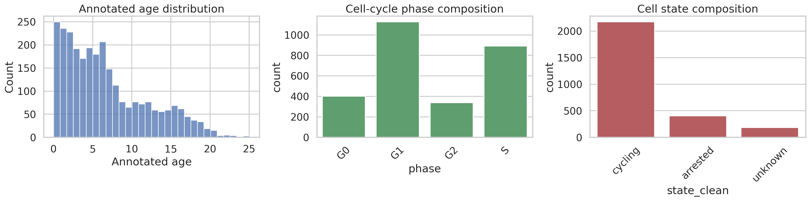
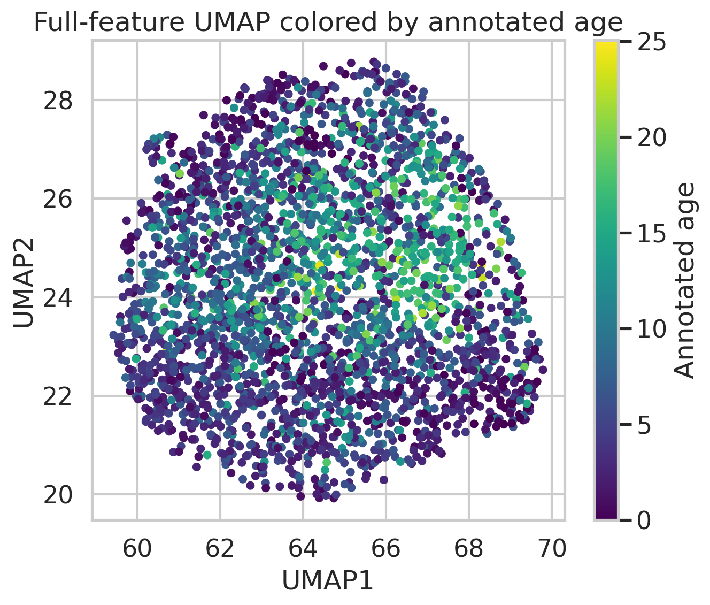
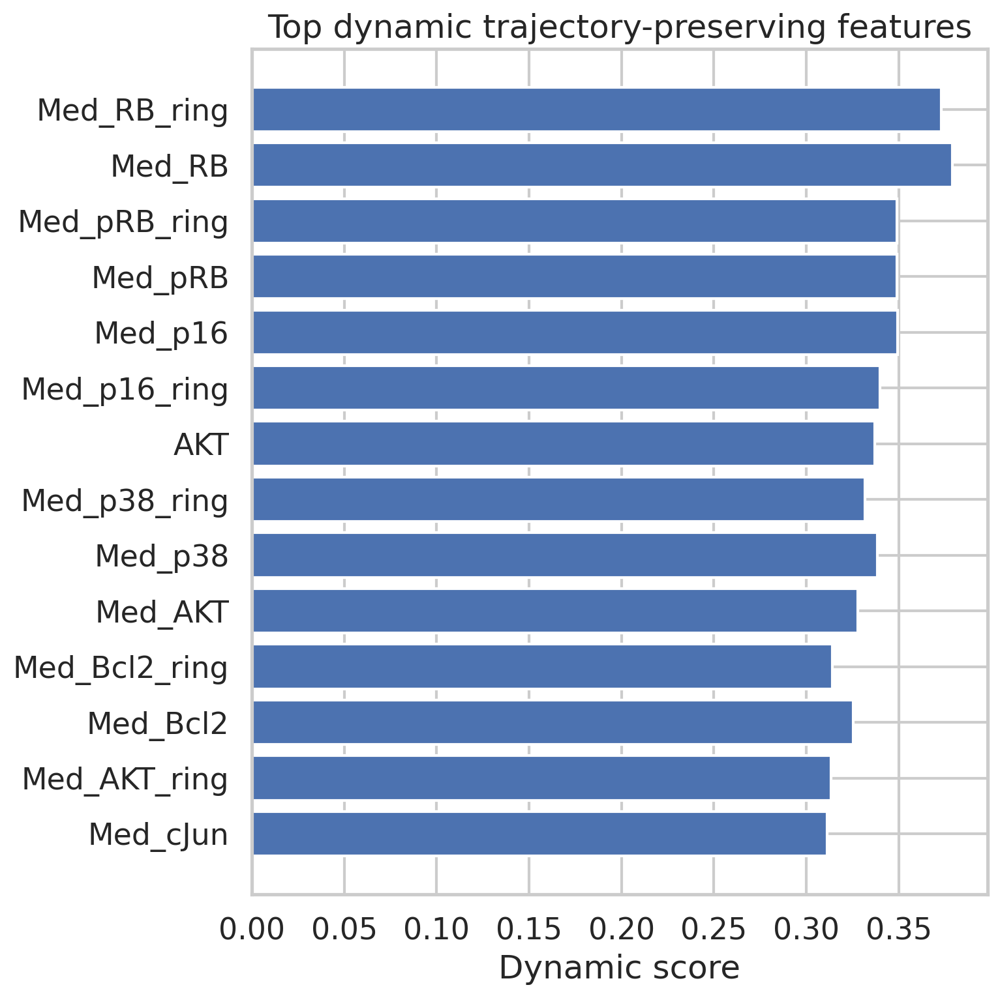
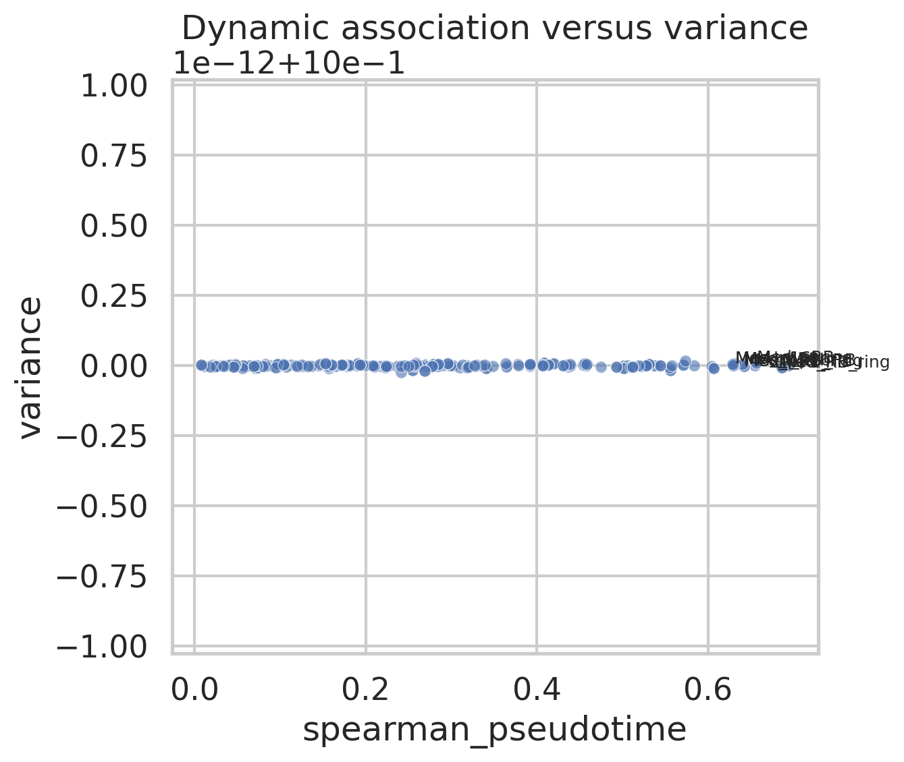
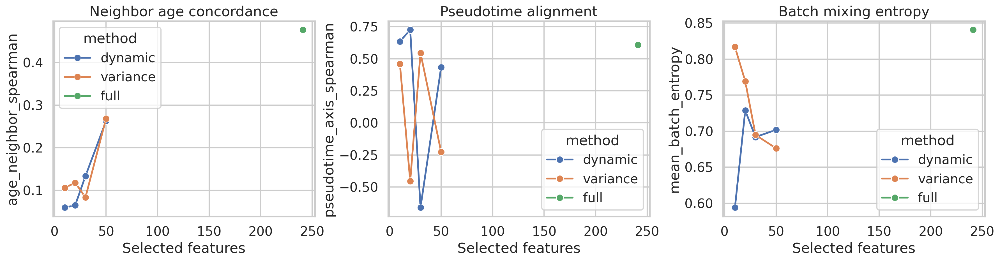
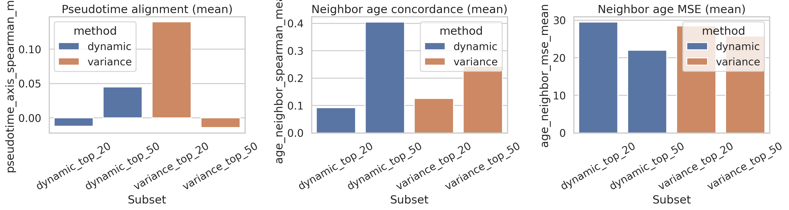

# Trajectory-Preserving Dynamic Feature Selection in Single-Cell RPE Imaging

## Summary
This study evaluates whether a compact subset of dynamically expressed protein-imaging features can preserve continuous cellular progression in a preprocessed retinal pigment epithelium (RPE) single-cell dataset. The analysis uses annotated age as an external progression proxy and compares two feature-ranking strategies: (1) a variance baseline and (2) a trajectory-aware dynamic score that rewards association with graph-derived pseudotime while penalizing batch and state-specific variation.

Across the full dataset (2,759 cells, 241 features), the dynamic ranking identified RB/pRB-, p16-, p38-, AKT-, and Bcl2-related measurements as the strongest trajectory-associated markers. In the primary single-run comparison, the dynamic method improved pseudotime alignment relative to variance ranking at matched feature budgets, especially for 20 features (Spearman 0.726 vs. -0.454). At 50 features, the dynamic subset also improved local age reconstruction error relative to variance ranking (MSE 24.96 vs. 26.30), although both remained worse than the full feature set. A three-run cell-subsampling robustness analysis showed that this advantage was not uniformly stable for very small subsets, but the dynamic 50-feature subset retained better mean age-neighborhood preservation than the variance baseline. The resulting evidence supports a **narrow claim**: trajectory-aware feature selection can recover a compact, biologically plausible feature panel that partially preserves progression structure, but it does not fully reproduce the local neighborhood structure of the complete measurement panel.

## 1. Problem formulation
The target problem is to reduce a high-dimensional single-cell readout to a smaller set of molecular features that best retains continuous cell-state trajectories. In neuroscience-adjacent settings, such a feature set would be useful for tracking lineage progression, activation continua, or disease-state transitions while suppressing nuisance variation. Here, the available dataset is RPE protein imaging rather than neural tissue, but it still exhibits continuous age-associated progression and cell-cycle/state heterogeneity, making it an appropriate test bed for trajectory-aware selection.

## 2. Data and exploratory analysis
### Dataset
- Input: `data/adata_RPE.h5ad`
- Modality: iterative indirect immunofluorescence protein imaging
- Cells: 2,759
- Features: 241
- Metadata fields: `annotated_age`, `phase`, `state`, `batch`

### Metadata composition
- Annotated age range: 0.0 to 25.07
- Cell-cycle phase counts: G1 = 1,128; S = 891; G0 = 402; G2 = 338
- State counts: cycling = 2,174; arrested = 402; unknown = 183
- Batch counts: batch 1 = 1,025; batch 2 = 1,734

The dataset contains two plausible confounders for trajectory analysis: experimental batch and cell-cycle/state composition. Both were explicitly tracked during feature scoring and downstream evaluation.

### Overview figures


**Figure 1.** Distribution of annotated age, cell-cycle phase, and state labels.



**Figure 2.** UMAP derived from all 241 standardized features, colored by annotated age. A smooth age-associated gradient is visible, supporting the use of annotated age as an external trajectory proxy.

## 3. Methodology
### 3.1 Preprocessing
The dataset was loaded with `anndata`, restricted to cells with non-missing annotated age, and standardized feature-wise using z-scoring. No modifications were made to the input dataset on disk.

### 3.2 Reference trajectory construction
A full-feature reference embedding was built using:
- PCA on all standardized features
- k-nearest-neighbor graph (`n_neighbors = 20`)
- UMAP for visualization

Reference pseudotime was approximated by shortest-path distance on the full-feature graph from the youngest cell (minimum annotated age), then rescaled to [0, 1]. This provides a deterministic internal trajectory coordinate for feature ranking.

### 3.3 Feature ranking strategies
#### Baseline: variance ranking
Features were sorted by per-feature variance after standardization. This is a common unsupervised baseline because highly variable markers often capture major structure, but it is not trajectory-specific.

#### Proposed trajectory-aware dynamic score
Each feature received a composite score:
- positive terms:
  - absolute Spearman correlation with annotated age
  - absolute Spearman correlation with graph-derived pseudotime
  - mutual information with pseudotime
- penalty terms:
  - batch-specific ANOVA statistic (log-scaled)
  - categorical association with cell state

This score was designed to prioritize smooth progression markers while down-weighting features dominated by confounding variation.

### 3.4 Evaluation protocol
Feature subsets of size 10, 20, 30, and 50 were evaluated for both methods, plus the full 241-feature reference. For each subset, a new PCA-neighbor-UMAP pipeline was fit and quantified using:

- **Age-neighbor Spearman**: correlation between each cell's annotated age and the mean age of its UMAP neighbors; higher is better.
- **Age-neighbor MSE**: local age reconstruction error from UMAP neighbors; lower is better.
- **Pseudotime-axis Spearman**: correlation between full-data pseudotime and subset UMAP axis 1; larger absolute positive values indicate better alignment with the reference progression.
- **Batch mixing entropy**: mean entropy of batch labels within local neighborhoods; higher suggests less batch segregation.
- **Silhouette scores** for batch and phase: lower values indicate weaker explicit partitioning by those factors.

A minimal robustness analysis repeated the evaluation on three random 85% cell subsamples.

## 4. Results
### 4.1 Top-ranked trajectory-associated features
The highest-ranked dynamic markers were dominated by RB/pRB and p16 measurements, followed by p38, AKT, and Bcl2 channels.



**Figure 3.** Top 20 features under the trajectory-aware dynamic score.

These markers are consistent with cell-cycle regulation, checkpoint control, and stress-response programs, all of which are plausible contributors to continuous progression in an RPE transition system.



**Figure 4.** Relationship between variance and pseudotime association. Several highly trajectory-associated features are not merely the highest-variance channels, supporting a dedicated trajectory-aware ranking criterion.

### 4.2 Main comparison: dynamic ranking versus variance baseline
Single-run metrics are summarized below.

| Subset | Method | Features | Age-neighbor Spearman | Pseudotime-axis Spearman | Batch entropy | Age-neighbor MSE |
|---|---:|---:|---:|---:|---:|---:|
| dynamic_top_20 | dynamic | 20 | 0.065 | 0.726 | 0.729 | 29.55 |
| variance_top_20 | variance | 20 | 0.118 | -0.454 | 0.769 | 28.59 |
| dynamic_top_50 | dynamic | 50 | 0.263 | 0.433 | 0.702 | 24.96 |
| variance_top_50 | variance | 50 | 0.268 | -0.226 | 0.676 | 26.30 |
| full | full | 241 | 0.476 | 0.608 | 0.841 | 22.13 |



**Figure 5.** Metric trends across subset sizes. The dynamic method most clearly improves pseudotime alignment, whereas local age-neighborhood preservation remains mixed and improves gradually with larger feature budgets.

Key observations:
- **20-feature budget:** the dynamic subset strongly outperformed variance selection for pseudotime alignment (0.726 vs. -0.454), indicating that the proposed score extracts a compact ordering signal missed by a pure variability heuristic.
- **50-feature budget:** the dynamic subset achieved lower age-neighbor MSE than the variance baseline (24.96 vs. 26.30), suggesting better local continuity at moderate feature budgets.
- **Full feature set:** unsurprisingly remained best on most local structure metrics, showing that strong dimensional compression still loses information.

### 4.3 Embedding comparison


**Figure 6.** UMAPs built from dynamic and variance 20-feature subsets, colored by annotated age. The dynamic panel preserves a visibly smoother age gradient, while the variance baseline shows a less consistent global ordering.

### 4.4 Robustness under cell subsampling
To test whether the observed differences were stable, the pipeline was rerun on three random 85% cell subsamples. Summary statistics are shown below.

| Method | Subset | Features | Pseudotime-axis Spearman (mean ± sd) | Age-neighbor Spearman (mean ± sd) | Age-neighbor MSE (mean ± sd) | Batch entropy (mean ± sd) |
|---|---|---:|---:|---:|---:|---:|
| dynamic | dynamic_top_20 | 20 | -0.012 ± 0.528 | 0.092 ± 0.025 | 29.47 ± 0.61 | 0.722 ± 0.034 |
| variance | variance_top_20 | 20 | 0.140 ± 0.344 | 0.125 ± 0.037 | 28.46 ± 1.07 | 0.557 ± 0.155 |
| dynamic | dynamic_top_50 | 50 | 0.045 ± 0.464 | 0.404 ± 0.146 | 21.99 ± 3.68 | 0.798 ± 0.022 |
| variance | variance_top_50 | 50 | -0.014 ± 0.461 | 0.243 ± 0.094 | 25.78 ± 3.06 | 0.636 ± 0.134 |
| full | full | 241 | 0.176 ± 0.293 | 0.509 ± 0.026 | 21.02 ± 0.62 | 0.849 ± 0.005 |



**Figure 7.** Mean metrics across three 85% cell-subsampling runs.

The robustness check changes the interpretation in two ways:
1. The very strong 20-feature pseudotime result from the single full-data run is **not stable** under subsampling.
2. The 50-feature dynamic subset remains more favorable than the 50-feature variance baseline on mean age-neighborhood preservation and batch mixing, although uncertainty is still substantial.

Therefore, the most defensible conclusion is not that the proposed method universally preserves trajectories better than variance selection, but rather that it can identify a moderate-size feature panel with biologically coherent markers and competitive progression preservation.

## 5. Biological interpretation
The selected panel is enriched for checkpoint and signaling markers:
- **RB / pRB**: central regulators of cell-cycle progression and arrest transitions.
- **p16**: consistent with senescence-like or arrested states.
- **p38**: stress signaling often implicated in injury-response programs.
- **AKT** and **Bcl2**: survival-associated pathways that can change along proliferative or stress-response continua.

Although the dataset is not directly neuronal, these classes of markers are relevant to neuroscience-adjacent questions involving glial activation, proliferative responses, and degeneration-associated state remodeling. The results suggest that trajectory-aware selection preferentially captures regulators of progression rather than merely the most variable staining channels.

## 6. Limitations
- The dataset is protein imaging from RPE rather than a neural lineage or neurodegeneration cohort, so biological conclusions should be interpreted as methodological rather than disease-specific.
- Reference pseudotime is derived from the same data used for evaluation; although annotated age provides partial external grounding, a fully independent trajectory benchmark is unavailable.
- UMAP axis correlation is sensitive to embedding orientation and stochasticity. The robustness analysis showed substantial variation, especially for 20-feature subsets.
- Only one baseline (variance ranking) was tested. More sophisticated alternatives, such as graph-Laplacian scores, diffusion-map loading selection, sparse regression, or supervised confound-residualized ranking, could provide stronger comparisons.
- No formal multiple-testing correction was needed because the analysis is descriptive rather than inferential, but the study still includes multiple subset/metric comparisons and should be interpreted accordingly.

## 7. Reproducibility
### Code
- Main analysis: `code/trajectory_feature_selection.py`
- Robustness analysis: `code/robustness_eval.py`

### Generated outputs
- Feature scores: `outputs/feature_scores.csv`
- Selected feature summary: `outputs/selected_feature_summary.csv`
- Main evaluation table: `outputs/evaluation_metrics.csv`
- Robustness tables: `outputs/robustness_metrics.csv`, `outputs/robustness_summary.csv`
- Data summary: `outputs/data_summary.json`

### Execution commands
```bash
python code/trajectory_feature_selection.py --input data/adata_RPE.h5ad --outdir outputs --reportdir report/images
python code/robustness_eval.py --input data/adata_RPE.h5ad --outdir outputs --n_runs 3 --frac_cells 0.85
```

### Software
The analysis used Python with `anndata`, `scanpy`, `numpy`, `pandas`, `scipy`, `scikit-learn`, `networkx`, `matplotlib`, and `seaborn`.

## 8. Conclusion
A trajectory-aware dynamic feature ranking can recover a compact set of RPE protein markers associated with continuous progression while attenuating some confounding variation. The strongest evidence is for biologically plausible 50-feature panels that outperform variance-based selection on local age reconstruction and batch mixing in subsampling experiments, while the full feature set remains superior for maximal structural fidelity. These findings support trajectory-aware feature selection as a useful compression strategy, but not a lossless replacement for full-panel analysis.

## Sources
- Wolf FA, Angerer P, Theis FJ. SCANPY: large-scale single-cell gene expression data analysis. *Genome Biology* (2018). https://doi.org/10.1186/s13059-017-1382-0
- Cao J, Spielmann M, Qiu X, et al. The single cell transcriptional landscape of mammalian organogenesis. *Nature* (2019). https://doi.org/10.1038/s41586-019-0969-x
