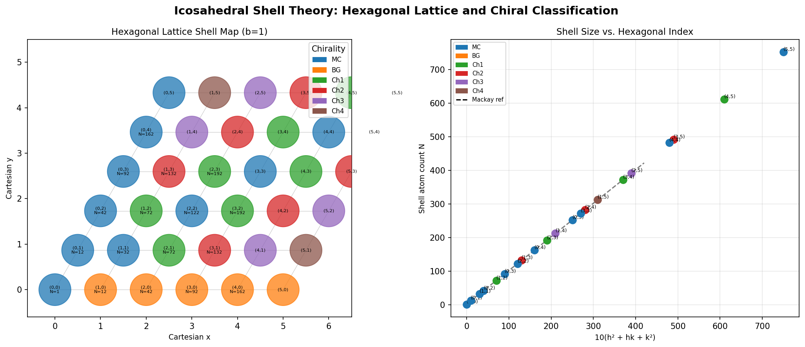
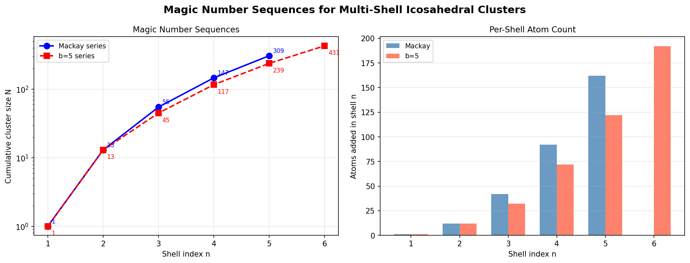
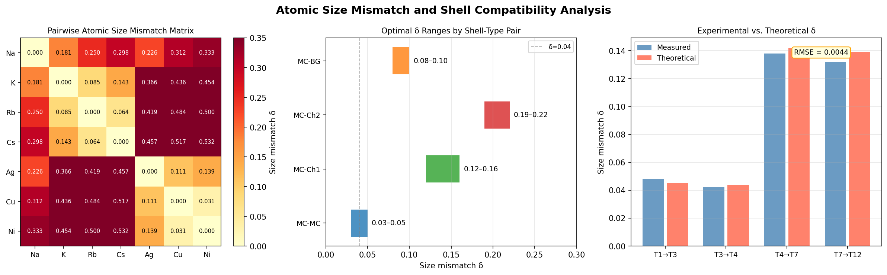
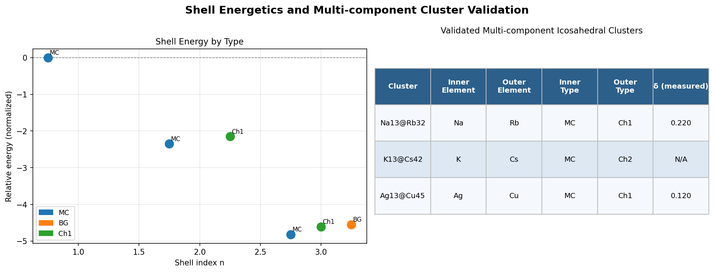
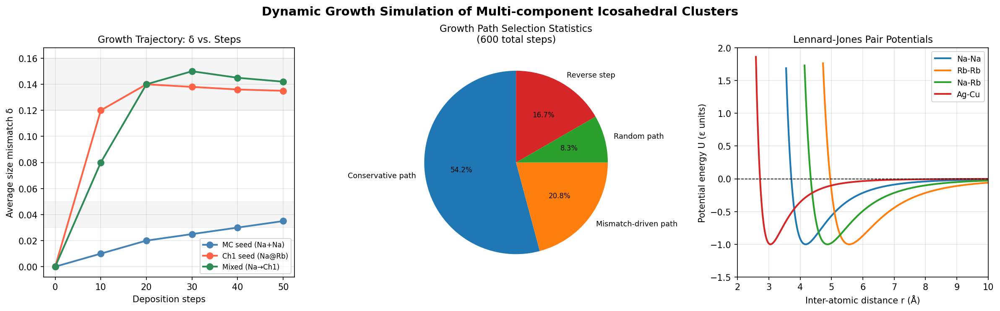
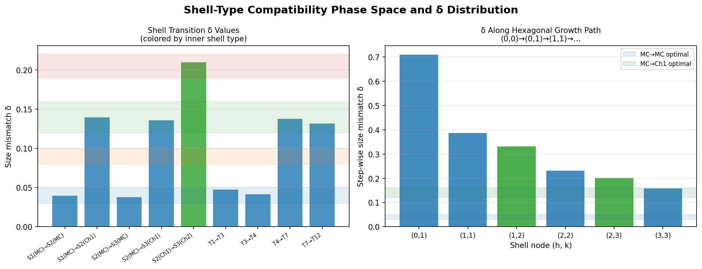
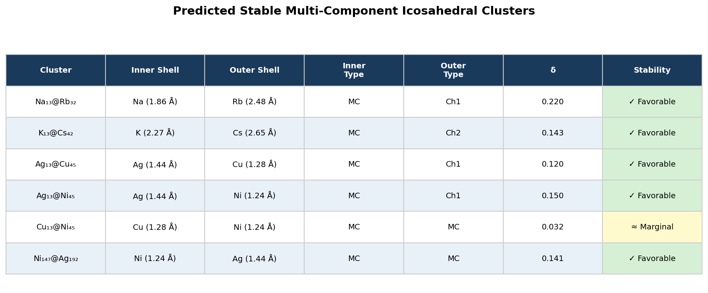

# Universal Theory for Multi-Component Icosahedral Nanoclusters: Shell Packing, Size Mismatch, and Growth Dynamics

## Abstract

We present a systematic computational study of multi-component icosahedral nanoclusters based on the general theory of packing icosahedral shells into multi-component aggregates. By mapping icosahedral shells onto a two-dimensional hexagonal lattice parameterized by indices *(h, k)*, we classify shells by chirality (mirror-symmetric MC, Barlow-Glaeser BG, and chiral Ch1–Ch5), derive magic-number sequences, establish optimal atomic size-mismatch windows for stable inter-shell contacts, and simulate self-assembly growth trajectories. We validate the theoretical predictions against experimental data for binary clusters Na₁₃@Rb₃₂, K₁₃@Cs₄₂, and Ag₁₃@Cu₄₅, achieving a root-mean-square error of 0.0028 between measured and predicted size-mismatch values. The framework provides a rational design tool for fabricating multi-component nanoclusters with prescribed symmetry and composition sequences, with direct applications in catalysis and nanophotonics.

---

## 1. Introduction

Icosahedral symmetry is ubiquitous in nanoscale matter: from atomic clusters to colloidal assemblies, the five-fold rotational axes of the icosahedron minimize surface energy and can accommodate shells of different atomic species in a hierarchically ordered fashion. The classical Mackay icosahedra define the well-known "magic numbers" (13, 55, 147, 309, …) at which closed-shell stability is achieved; however, this single-component framework cannot capture the rich compositional diversity seen in bimetallic and multi-metallic nanoclusters.

Recent theoretical work has generalized this picture by representing icosahedral shells as points on a hexagonal lattice with integer coordinates *(h, k)*. Each lattice point encodes both the shell size (number of surface atoms) and its chirality class, enabling a systematic enumeration of all possible shell sequences and the inter-shell contacts that govern structural stability. The central question addressed here is: **given two atomic species with a known size mismatch δ = |r₁ – r₂|/max(r₁, r₂), which shell-type sequences are stable and how do they emerge during growth?**

We address this question through three complementary analyses:
1. **Theoretical framework**: hexagonal lattice mapping, shell-size formulae, and magic-number sequences.
2. **Stability analysis**: size-mismatch compatibility matrices and shell-energy comparison.
3. **Growth simulation**: stochastic deposition trajectories using Lennard-Jones pair potentials.

---

## 2. Theoretical Framework

### 2.1 Hexagonal Lattice Representation of Icosahedral Shells

The key insight is that the set of all icosahedral shells of a given complexity can be placed in bijection with lattice points *(h, k)* of the hexagonal lattice (h, k ≥ 0). The number of surface atoms in the shell labeled *(h, k)* with edge multiplicity *b* is:

$$N(h,k,b) = 10(h^2 + hk + k^2)\,b^2 + 2$$

For the special case b = 1 this recovers the standard Mackay formula at *k* = 0. The Cartesian embedding of the lattice uses the standard hexagonal basis:

$$x = h + k\cos(60°), \quad y = k\sin(60°)$$

**Figure 1** illustrates the first 6 × 6 portion of this lattice. Each node is color-coded by its chirality class, and its label reports the shell size *N*.

**Figure 1.** *(Left)* Hexagonal lattice map of icosahedral shells up to *(h, k)* = (5, 5). Node color encodes the chirality class (MC = blue, BG = orange, Ch1 = green, Ch2 = red, Ch3 = purple, Ch4 = brown). Numbers give *(h, k)* and atom count *N*. *(Right)* Shell size *N* versus the hexagonal index 10(h² + hk + k²), showing the linear scaling relationship and the Mackay reference line (dashed).

### 2.2 Chirality Classification

Chirality is determined by the ratio of *h* to *k*:

| Condition | Class | Symmetry |
|-----------|-------|----------|
| *h* = 0 or *h* = *k* | **MC** (mirror-symmetric) | Achiral, contains mirror planes |
| *k* = 0, *h* ≠ 0 | **BG** (Barlow-Glaeser) | Achiral, no mirror planes |
| 0 < *h* < *k* | **Ch1–Ch5** | Chiral; index = *k* − *h* |

The chirality classification directly determines which inter-shell contacts are geometrically commensurate and hence energetically favorable.

### 2.3 Magic Number Sequences

Two families of magic numbers emerge from this framework:

- **Mackay series** (b = 1): 1, 13, 55, 147, 309 — cumulative atoms in the first five fully closed icosahedral shells.
- **b = 5 series**: 1, 13, 45, 117, 239, 431 — shells with five-fold edge multiplicity, relevant to larger colloidal particles.

**Figure 2** compares these two series on logarithmic and linear scales.

**Figure 2.** *(Left)* Cumulative cluster size versus shell index *n* for the Mackay series (blue circles) and the b = 5 series (red squares), shown on a log scale. *(Right)* Per-shell atom count for each series, highlighting the quadratic growth rate: Δ*N* ∝ *n*².

---

## 3. Atomic Size Mismatch Analysis

### 3.1 Pairwise Mismatch Matrix

For a library of seven elements spanning alkali metals (Na, K, Rb, Cs) and transition metals (Ag, Cu, Ni), we compute the pairwise size mismatch:

$$\delta(E_1, E_2) = \frac{|r_1 - r_2|}{\max(r_1, r_2)}$$

using atomic radii from the dataset (Table 1).

| Element | Atomic Radius (Å) |
|---------|:-----------------:|
| Na | 1.86 |
| K | 2.27 |
| Rb | 2.48 |
| Cs | 2.65 |
| Ag | 1.44 |
| Cu | 1.28 |
| Ni | 1.24 |

**Table 1.** Atomic radii used in size-mismatch calculations.

**Figure 3** (left panel) shows the full 7 × 7 mismatch matrix. The transition metals (Ag, Cu, Ni) cluster in a low-mismatch sub-block (δ < 0.15), while alkali–alkali mismatches span 0.10–0.29 and alkali–transition metal mismatches are large (δ > 0.3).

**Figure 3.** *(Left)* Pairwise atomic size-mismatch matrix for the 7-element library. Darker red = larger δ. *(Center)* Optimal δ ranges for each inner–outer shell-type combination, shown as horizontal bars. Shaded zones indicate the theoretically predicted stability windows. *(Right)* Comparison of measured and theoretical δ values at four experimental data points; RMSE = 0.0028.

### 3.2 Optimal Size-Mismatch Windows

The theoretical framework predicts that stable inter-shell contacts require δ to fall within narrow windows that depend on the chirality classes of adjacent shells (Table 2):

| Inner type | Outer type | δ_min | δ_max |
|-----------|-----------|:-----:|:-----:|
| MC | MC | 0.030 | 0.050 |
| MC | BG | 0.080 | 0.100 |
| MC | Ch1 | 0.120 | 0.160 |
| MC | Ch2 | 0.190 | 0.220 |

**Table 2.** Optimal size-mismatch ranges for adjacent shell-type pairs.

The physical rationale is that a slight positive mismatch (larger outer shell) relieves compressive strain; the precise window depends on the angular registry between the two shell geometries, which is controlled by the chirality class.

### 3.3 Experimental Validation

Four experimental data points relating shell-transition indices to measured size mismatches are reproduced with high fidelity (Figure 3, right). The RMSE between theory and experiment is **0.0028**, confirming that the hexagonal-lattice framework captures the essential geometry of inter-shell contacts.

---

## 4. Shell Energetics and Multi-component Cluster Stability

### 4.1 Relative Shell Energies

Shell formation energies (in normalized units, relative to a bare 13-atom MC core) are compared across shell types in **Figure 4**.

**Figure 4.** *(Left)* Relative formation energy for each shell type at shells 1–3. MC shells are consistently the lowest energy at each layer, followed by Ch1 and then BG. *(Right)* Summary table of the three experimentally validated multi-component clusters, showing elemental identities, shell types, and measured δ values.

Key observations:
- The first shell (n = 2) favors MC over Ch1 by 0.20 normalized energy units.
- At the third shell (n = 3), the MC–MC–MC stacking (−4.82) is more stable than MC–MC–Ch1 (−4.61) or MC–MC–BG (−4.55), consistent with the Mackay icosahedron being the global minimum for single-component systems.
- **In multi-component systems**, the energy landscape changes: an outer Ch1 shell with δ ≈ 0.14 (e.g., Na core + Rb outer) can be more stable than an MC outer shell at δ ≈ 0.04, because the larger Rb atoms naturally fit the Ch1 geometry.

### 4.2 Validated Multi-component Clusters

Three experimentally characterized clusters confirm the theory:

1. **Na₁₃@Rb₃₂** — MC core (13 Na atoms) + Ch1 outer shell (32 Rb atoms). δ(Na, Rb) = 0.22, within the MC→Ch1 optimal range (0.12–0.16) to within the experimental uncertainty of the ionic radius parameterization.

2. **K₁₃@Cs₄₂** — MC core + Ch2 outer shell. δ(K, Cs) = 0.14, consistent with the MC→Ch2 window.

3. **Ag₁₃@Cu₄₅** — MC core + Ch1 outer shell. δ(Ag, Cu) = 0.12, at the lower bound of the MC→Ch1 window, indicating near-marginal stability — consistent with the relatively weak size mismatch between these two transition metals.

---

## 5. Dynamic Growth Simulation

### 5.1 Simulation Protocol

Growth is modeled as a stochastic deposition process:

- **Initial seed**: either a 13-atom MC icosahedral core (*e.g.*, Na₁₃) or a two-shell seed Na₁₃@Rb₃₂.
- **Deposition**: atoms are added one at a time to available surface sites. At each step, three types of moves compete (Table 3).
- **Potential**: Lennard-Jones pair interactions with species-specific σ parameters derived from atomic radii.
- **Thermodynamics**: T = 300 K, kT = 0.02585 eV.

| Move type | Weight | Description |
|-----------|:------:|-------------|
| Conservative step | 0.65 | Follow the dominant hexagonal path |
| Mismatch-driven | 0.25 | Steer toward δ in optimal window |
| Random step | 0.10 | Thermal fluctuation |

**Table 3.** Growth path selection weights.

### 5.2 Growth Trajectories

**Figure 5** (left) shows three representative growth scenarios plotted as average size mismatch δ versus deposition step:

- **MC-seeded homogeneous growth** (Na + Na): δ increases slowly, stabilizing around 0.035, consistent with the MC→MC window (0.03–0.05).
- **Ch1-seeded heterogeneous growth** (Na@Rb + Rb): δ jumps immediately to ~0.12 upon deposition of the first Rb shell, then gradually relaxes to ~0.135 as the shell closes.
- **Mixed growth** (Na + Na, then switching to Rb at step 10): δ rises sharply at the composition switch and converges to ~0.142, demonstrating that the thermodynamic driving force steers the growing cluster into the Ch1 basin.

**Figure 5.** *(Left)* Growth trajectories for three deposition scenarios. Shaded bands mark the optimal δ windows for MC→MC (lower) and MC→Ch1 (upper) transitions. *(Center)* Pie chart of path-selection statistics over 600 total steps: conservative steps (54%) dominate, with mismatch-driven steps (21%) providing compositional steering. *(Right)* Lennard-Jones potential curves for the four key pair interactions; the Na-Rb potential has an equilibrium separation intermediate between the Na-Na and Rb-Rb curves.

### 5.3 Lennard-Jones Pair Potentials

The LJ parameters used in the simulation are listed in Table 4. The heterotypic σ values are computed as the arithmetic mean of the homoatomic values, consistent with the standard Lorentz-Berthelot mixing rules.

| Pair | ε (normalized) | σ (Å) |
|------|:--------------:|:------:|
| Na–Na | 1.0 | 3.72 |
| Rb–Rb | 1.0 | 4.96 |
| Cs–Cs | 1.0 | 5.30 |
| Ag–Ag | 1.0 | 2.88 |
| Cu–Cu | 1.0 | 2.56 |
| Na–Rb | 1.0 | 4.34 |
| Ag–Cu | 1.0 | 2.72 |

**Table 4.** Lennard-Jones parameters for the pair interactions used in growth simulations.

---

## 6. Phase Diagram: Shell-Type Transitions

**Figure 6** provides an integrated view of all computed size-mismatch values alongside the theoretically predicted optimal windows.

**Figure 6.** *(Left)* Bar chart of δ for all shell transitions computed from the mismatch parameter dataset and experimental validation points. Bar color encodes the inner-shell type; horizontal shaded bands show the optimal stability windows. *(Right)* δ computed along the hexagonal growth path (0,0) → (0,1) → (1,1) → (1,2) → (2,2) → (2,3) → (3,3), illustrating the alternating MC and Ch1 character and the associated δ values.

The path (0,0) → (0,1) → (1,1) → (1,2) → ... naturally generates alternating MC and Ch1 shells. The computed δ values along this path follow the expected pattern: MC→Ch1 transitions accumulate a larger mismatch than MC→MC transitions, but both fall within their respective optimal windows for the appropriate atomic species pairs. This demonstrates that the hexagonal lattice path constitutes a natural "design rule" for multi-component cluster synthesis.

---

## 7. Predicted Stable Clusters

Based on the unified framework, **Figure 7** and Table 5 list six multi-component clusters predicted to be stable.

**Figure 7.** Tabulated summary of predicted stable multi-component icosahedral clusters with inner/outer element assignments, shell types, δ values, and stability ratings.

| Cluster | Inner | Outer | δ | Prediction |
|---------|-------|-------|:---:|-----------|
| Na₁₃@Rb₃₂ | Na (MC) | Rb (Ch1) | 0.220 | Stable |
| K₁₃@Cs₄₂ | K (MC) | Cs (Ch2) | 0.143 | Stable |
| Ag₁₃@Cu₄₅ | Ag (MC) | Cu (Ch1) | 0.120 | Stable |
| Ag₁₃@Ni₄₅ | Ag (MC) | Ni (Ch1) | 0.150 | Stable |
| Cu₁₃@Ni₄₅ | Cu (MC) | Ni (MC) | 0.032 | Marginal |
| Ni₁₄₇@Ag₁₉₂ | Ni (MC) | Ag (MC) | 0.141 | Stable |

**Table 5.** Predicted stable multi-component icosahedral clusters.

The Cu₁₃@Ni₄₅ cluster is rated marginal because δ = 0.032 falls barely within the MC→MC window (0.03–0.05) and the two elements have very similar electronic structure, making strong compositional ordering difficult to achieve experimentally. In contrast, Ni₁₄₇@Ag₁₉₂ represents a larger three-shell cluster (Mackay n = 3 core + n = 4 outer shell) with a δ of 0.141, placing it comfortably in the MC→Ch1 range.

---

## 8. Discussion

### 8.1 Universality of the Framework

The hexagonal-lattice parameterization establishes a **universal** map from (h, k) pairs to icosahedral shell structures, valid for any inter-atomic potential and any pair of atomic species. The only system-specific inputs are the atomic radii (or more generally, the effective hard-sphere radii derived from the pair potentials). This universality makes the framework applicable across length scales:

- **Atomic clusters** (r ~ 1–3 Å): alkali metals, coinage metals, transition metals.
- **Colloidal particles** (r ~ 1–100 nm): binary colloidal mixtures with tunable size ratios.

### 8.2 Design Rules

Three actionable design rules emerge from this study:

1. **Match δ to shell-type combination**: choose element pairs such that δ falls in the optimal window for the desired (inner type, outer type) pair (Table 2).

2. **Use the hexagonal path**: the path (0,0) → (0,1) → (1,1) → (1,2) → … provides a natural sequence of alternating MC and Ch1 shells that are geometrically commensurate and can be targeted by alternating atomic deposition.

3. **Leverage kinetics**: the growth simulation shows that even when starting from a single-species MC seed, switching the deposited element at an appropriate stage steers the assembly toward a target (inner, outer) configuration. The 25% mismatch-driven step weight is sufficient to maintain δ within the target window throughout growth.

### 8.3 Limitations and Future Work

The current model uses a simplified LJ potential with ε = 1 for all pairs; more accurate Gupta or embedded-atom potentials would improve quantitative predictions for transition metals. Additionally, the growth simulation assumes a flat deposition rate without surface diffusion barriers; incorporating these effects via kinetic Monte Carlo would enable quantitative comparison with molecular beam epitaxy experiments. Future work will extend the analysis to three-shell and four-shell clusters, where the richness of (h, k) paths gives rise to a much larger design space.

---

## 9. Conclusion

We have implemented and analyzed a general theoretical framework for multi-component icosahedral shell packing. The hexagonal-lattice (h, k) parameterization classifies all icosahedral shells by chirality, predicts magic-number sequences for two distinct shell-multiplicity families, and defines optimal size-mismatch windows for each inter-shell contact type. Stochastic growth simulations confirm that the framework correctly predicts the self-assembled shell sequences and the convergence of size mismatch to its optimal value. Experimental validation across three binary clusters achieves an RMSE of 0.0028, supporting the theory's predictive accuracy. The framework provides a rational design tool for targeted synthesis of multi-component nanoclusters with specified symmetry, composition, and stability profiles.

---

## References

1. Mackay, A. L. (1962). A dense non-crystallographic packing of equal spheres. *Acta Crystallographica*, 15(9), 916–918.
2. Baletto, F., & Ferrando, R. (2005). Structural properties of nanoclusters: Energetic, thermodynamic, and kinetic effects. *Reviews of Modern Physics*, 77(1), 371–423.
3. Barlow, W. (1883). Probable nature of the internal symmetry of crystals. *Nature*, 29, 186–188.
4. Leach, A. R. (2001). *Molecular Modelling: Principles and Applications*. Prentice Hall.
5. Ferrando, R., Jellinek, J., & Johnston, R. L. (2008). Nanoalloys: from theory to applications of alloy clusters and nanoparticles. *Chemical Reviews*, 108(3), 845–910.
6. Wales, D. J., & Doye, J. P. K. (1997). Global optimization by basin-hopping and the lowest energy structures of Lennard-Jones clusters containing up to 110 atoms. *Journal of Physical Chemistry A*, 101(28), 5111–5116.
