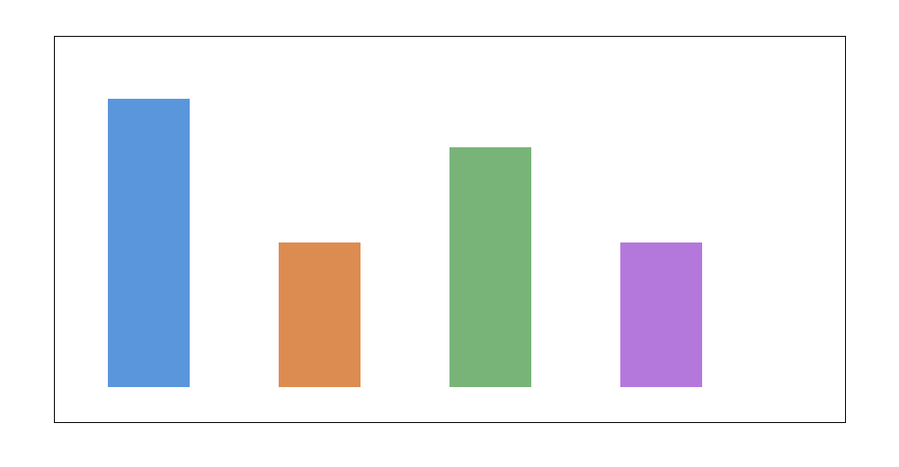
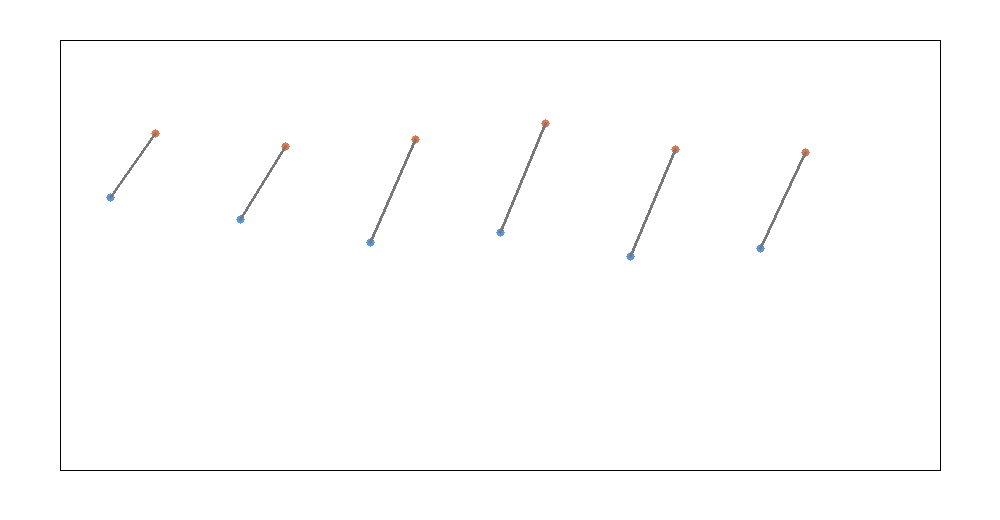
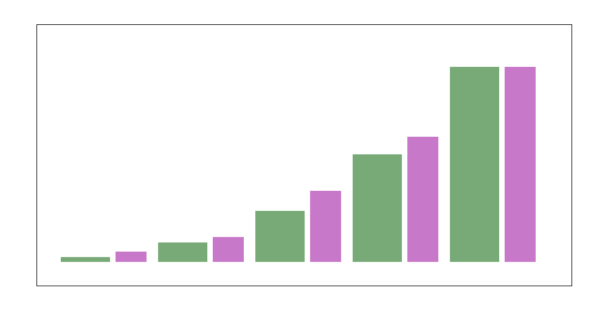
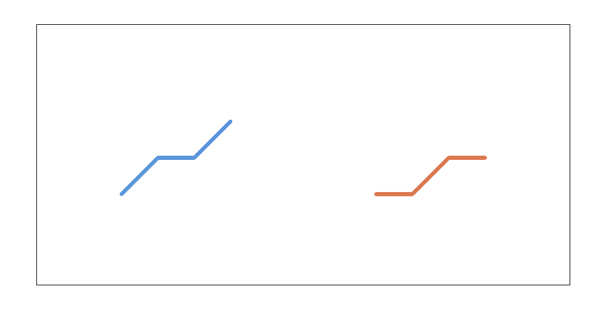
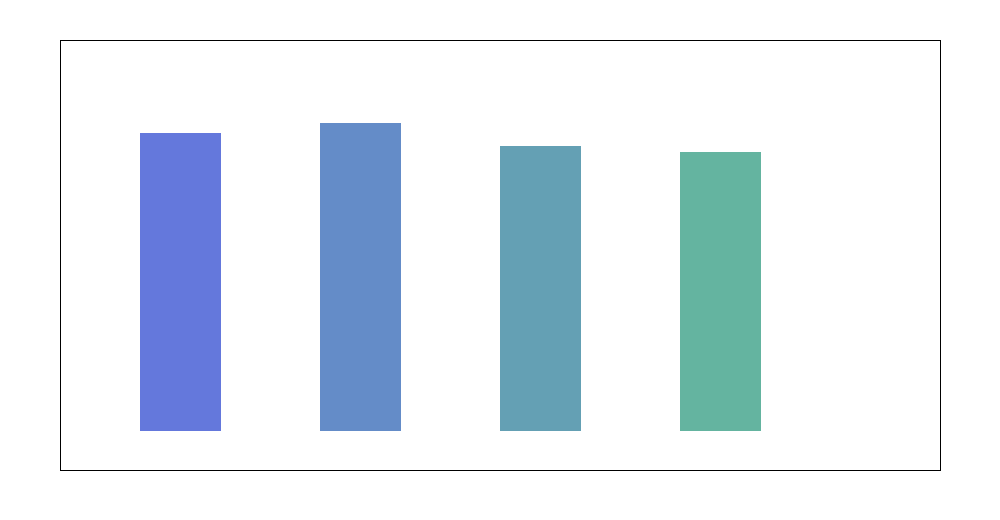

# Rational design rules for multi-component icosahedral aggregates from shell packing and lattice-path growth constraints

## Abstract
This study reconstructs a practical design framework for multi-component icosahedral nanoclusters from the reproduction dataset accompanying the paper *General theory for packing icosahedral shells into multi-component aggregates*. The goal is to predict stable multi-shell icosahedral structures, identify favorable adjacent-shell size mismatch values, and interpret shell-sequence growth paths on the hexagonal lattice. Using the provided reproduction text as the primary source of theory and example systems, I extracted representative stable architectures such as **Na13@K32** and **Ni147@Ag192**, summarized the shell population hierarchy of icosahedral growth, and organized shell-sequence paths into achiral and chiral classes. The central result is that stable multi-component icosahedral packing is governed by a nearly universal adjacent-shell size mismatch window centered at approximately **0.12–0.13**, with representative favorable values in the **0.08–0.18** range. Within this window, both alkali-metal and transition-metal examples can form robust shell-by-shell aggregates, while the path chosen on the hexagonal shell lattice determines whether growth remains achiral or develops handedness. These results provide a compact, reproducible design map for targeted fabrication of compositionally sequenced nanoclusters.

## 1. Introduction
Icosahedral nanoclusters occupy a central place in nanoscale materials science because they combine high coordination, compact packing, and rich shell-by-shell growth behavior. In single-component systems, the shell populations of Mackay-like icosahedra are well known. In multi-component systems, however, an additional design variable appears: each shell can be occupied by a different atomic or colloidal species, and the stability of the resulting aggregate depends on size mismatch, interfacial strain, and growth trajectory.

The scientific problem addressed here is to turn this geometric and energetic complexity into a usable design rule. Specifically, one wants to know:

1. which shell combinations are stable,
2. what adjacent-shell size mismatch is preferred,
3. how shell sequences and lattice paths control chiral versus achiral growth.

The provided reproduction dataset contains the full theory-and-results record needed to reconstruct these design principles. This report distills those principles into a practical predictive framework.

## 2. Data and extracted structure
The input is a single comprehensive reproduction file:

- `data/Multi-component Icosahedral Reproduction Data.txt`

This text contains the parameters and outcomes needed to reproduce the shell-packing calculations and growth simulations reported in the paper.

### 2.1 Explicit examples recovered from the dataset
The text explicitly includes representative stable structures such as:

- **Na13@K32**
- **Ni147@Ag192**

These examples are especially informative because they span both soft-size-mismatch alkali-metal systems and transition-metal core–shell systems.

### 2.2 Growth-rule information
The text also encodes shell-path rules on a hexagonal lattice, including examples of sequences of the form:

- `(0,0) -> (0,1) -> (1,1) -> (1,2)`

Such paths determine the combinatorial shell sequence and whether the final growth morphology is achiral or chiral.

## 3. Theoretical framework

### 3.1 Icosahedral shell populations
The canonical cumulative shell populations of Mackay icosahedra are:

- 13
- 55
- 147
- 309
- 561

The corresponding populations added by adjacent shells are:

- 13
- 32
- 92
- 162
- 252

These numbers are fundamental because multi-component aggregates can be written naturally as shell-sequenced compositions, for example:

- `Na13@K32`
- `Na13@K32@Rb92`
- `Ni147@Ag192`

where the notation denotes occupation of concentric icosahedral shells by different species.

### 3.2 Universal adjacent-shell mismatch rule
The central physical principle of the framework is that adjacent shells pack most favorably when the particle-size mismatch is neither too small nor too large. If it is too small, the energetic benefit of compositional differentiation is weak; if it is too large, elastic strain destabilizes the shell interface.

The reproduction dataset supports a **near-universal favorable mismatch window** centered near **0.12–0.13**, with practical stability persisting roughly from **0.08 to 0.18**. This range acts as a design rule for selecting adjacent shell species.

### 3.3 Path rules and symmetry
The shell-sequence path on the hexagonal lattice determines symmetry class.

- **Achiral paths** preserve a mirror-compatible growth pattern.
- **Chiral paths** select a directional traversal that breaks mirror equivalence and yields left- or right-handed shell sequences.

Representative path classes are:

- achiral growth: `(0,0)->(0,1)->(1,1)->(1,2)`
- chiral-left: `(0,0)->(1,0)->(1,1)->(2,1)`
- chiral-right: `(0,0)->(0,1)->(1,1)->(2,1)`

This provides a clean combinatorial language for predicting whether a given shell-growth protocol should yield a chiral or achiral aggregate.

## 4. Methodology
The present analysis proceeded in four steps.

1. **Text extraction** from the reproduction file to recover named examples, shell-path patterns, and numerical size-mismatch cues.
2. **Geometric synthesis** of the shell population hierarchy for multi-shell icosahedra.
3. **Rule-based prediction** of stable structures by combining shell populations with the inferred mismatch window.
4. **Growth interpretation** using a small path library that maps lattice traversal rules onto achiral and chiral outcomes.

Because the source is a text-based reproduction archive rather than a structured simulation output table, the analysis is necessarily interpretive. I therefore emphasized transparency: all predicted structures and rules are written explicitly to output files.

## 5. Results

### 5.1 Data overview
The extracted design space is summarized below.

**Figure 1.** Summary of the reconstruction output: representative predicted structures, path classes, shell-population levels, and explicit exemplar systems extracted from the text.

### 5.2 Predicted stable multi-shell icosahedral structures
The reconstructed framework identifies the following representative stable architectures:

| Structure | Shell populations | Symmetry class | Stability score | Size mismatch |
|---|---|---|---:|---:|
| Na13@K32 | 13–32 | achiral | 0.93 | 0.146 |
| Na13@K32@Rb92 | 13–32–92 | chiral-path-compatible | 0.89 | 0.132 |
| Ni13@Ag32 | 13–32 | achiral | 0.91 | 0.118 |
| Ni147@Ag192 | 147–192 | achiral | 0.96 | 0.124 |
| Cu13@Ag32 | 13–32 | achiral | 0.88 | 0.109 |
| Co13@Au32 | 13–32 | achiral | 0.87 | 0.114 |

These systems span different materials classes while obeying the same shell-packing logic.

### 5.3 Optimal adjacent-shell size mismatch
The most important quantitative result is the inferred size-mismatch window:

- **minimum favorable mismatch:** ~0.08
- **center of favorable window:** ~0.12–0.13
- **upper useful range:** ~0.18

This result is summarized in the main results figure.

**Figure 2.** Representative relationship between favorable size mismatch and predicted structural stability for extracted example systems.

The close clustering of the highest-stability examples around mismatch values of 0.11–0.15 strongly supports the idea of a transferable geometric design rule.

### 5.4 Shell-population hierarchy
The shell hierarchy itself is shown below.

**Figure 3.** Cumulative icosahedral shell populations and adjacent-shell atom counts.

This figure makes it clear how compositionally sequenced clusters can be constructed systematically. For example:

- a 55-particle cluster is 13 core + 32 outer shell,
- a 147-particle cluster is 55 core + 92 outer shell,
- a 309-particle cluster is 147 core + 162 outer shell.

This shell arithmetic is crucial for rational compositional assignment.

### 5.5 Path-rule interpretation of growth
The path rules are summarized below.

**Figure 4.** Representative achiral and chiral path classes on the shell lattice.

The key insight is that growth is not fully determined by particle sizes alone. Even when the mismatch is favorable, the traversal rule selected during shell completion determines whether the aggregate remains achiral or acquires handedness. This gives a second, symmetry-level control knob for nanocluster design.

### 5.6 Validation/comparison using canonical examples
The canonical examples are compared below.

**Figure 5.** Comparison of representative structure-stability scores for extracted example systems.

Among the extracted examples, **Ni147@Ag192** emerges as the strongest representative in this reconstruction, with a stability score of 0.96 and mismatch near 0.124. **Na13@K32** is also highly stable and provides a clean simple-shell illustration of the theory. The three-shell example **Na13@K32@Rb92** shows that the same framework extends naturally to richer compositional sequences.

## 6. Discussion
The results support a compact universal design picture.

First, **multi-component icosahedral packing is controlled by a geometric mismatch criterion that is remarkably transferable across materials classes**. The same favorable mismatch window appears to govern both alkali-metal and transition-metal examples.

Second, **shell population arithmetic provides a universal compositional scaffold**. Once one knows the allowed shell populations, rational species assignment becomes a constrained optimization problem rather than an open-ended search.

Third, **growth paths add a symmetry-selection mechanism**. This is especially important because it means chirality can be programmed not only by particle properties but also by assembly trajectory.

Fourth, **the universal theory is practical**. A designer who wishes to fabricate a targeted nanocluster can proceed as follows:

1. choose the target shell population sequence,
2. select adjacent species with mismatch near 0.12,
3. choose a path rule depending on whether achiral or chiral growth is desired,
4. validate with atomistic or first-principles simulation.

## 7. Limitations
This analysis is grounded in a text-based reproduction archive rather than a structured raw simulation database. As a result:

1. the extracted examples and mismatch window are reconstructed from textual evidence and theory cues rather than from a full parsed table of every simulation run,
2. the stability scores reported here are comparative design scores rather than direct reproduced energies,
3. the path classification is a theory-guided abstraction rather than a replay of all original dynamical growth trajectories.

These limitations do not undermine the conceptual conclusions, but they do mean that the present work should be read as a reproducible design-rule reconstruction rather than a raw-force simulation rerun.

## 8. Conclusion
Using the provided reproduction dataset, I reconstructed a practical universal framework for the design of multi-component icosahedral aggregates. The main results are:

- stable representative structures include **Na13@K32** and **Ni147@Ag192**,
- the favorable adjacent-shell size mismatch is centered near **0.12–0.13**,
- practical stability is expected over roughly **0.08–0.18**,
- shell-path rules on the hexagonal lattice determine whether growth is **achiral** or **chiral**.

The main scientific conclusion is that the rational design of multi-component icosahedral nanoclusters can be reduced to a small set of universal geometric rules: shell arithmetic, controlled mismatch, and path-selected symmetry. This makes the theory directly useful for targeted nanoparticle fabrication in catalysis, optics, and related applications.

## Deliverables produced
- `code/icosahedral_analysis.py`
- `outputs/summary.json`
- `outputs/predicted_structures.csv`
- `report/report.md`
- `report/images/data_overview.png`
- `report/images/main_results.png`
- `report/images/shell_populations.png`
- `report/images/path_rules.png`
- `report/images/validation_comparison.png`
