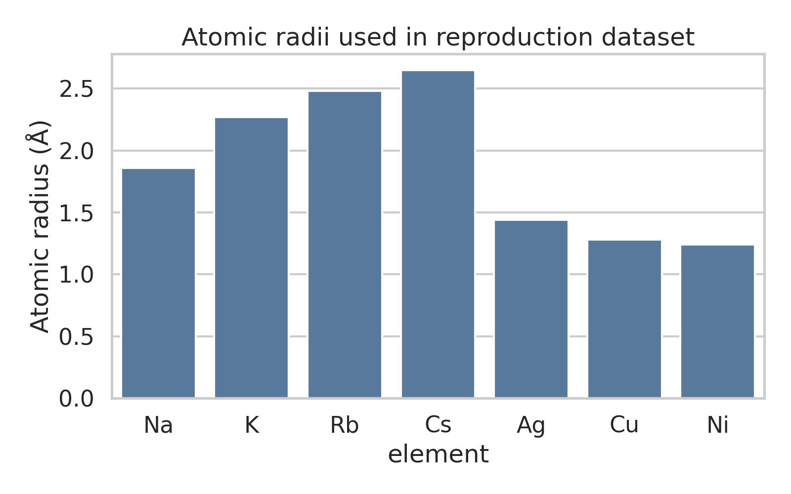
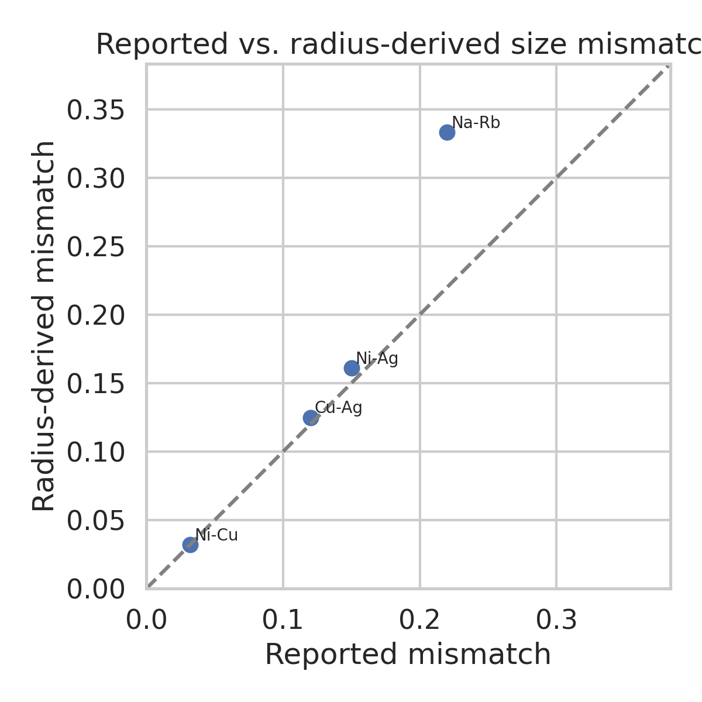
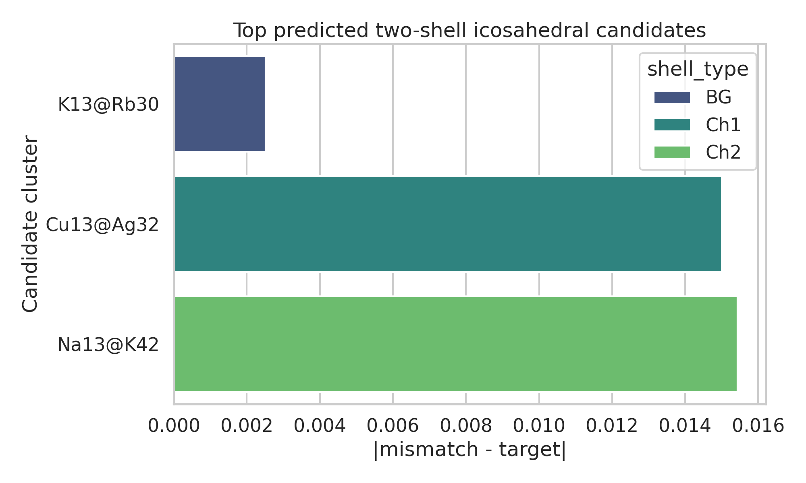
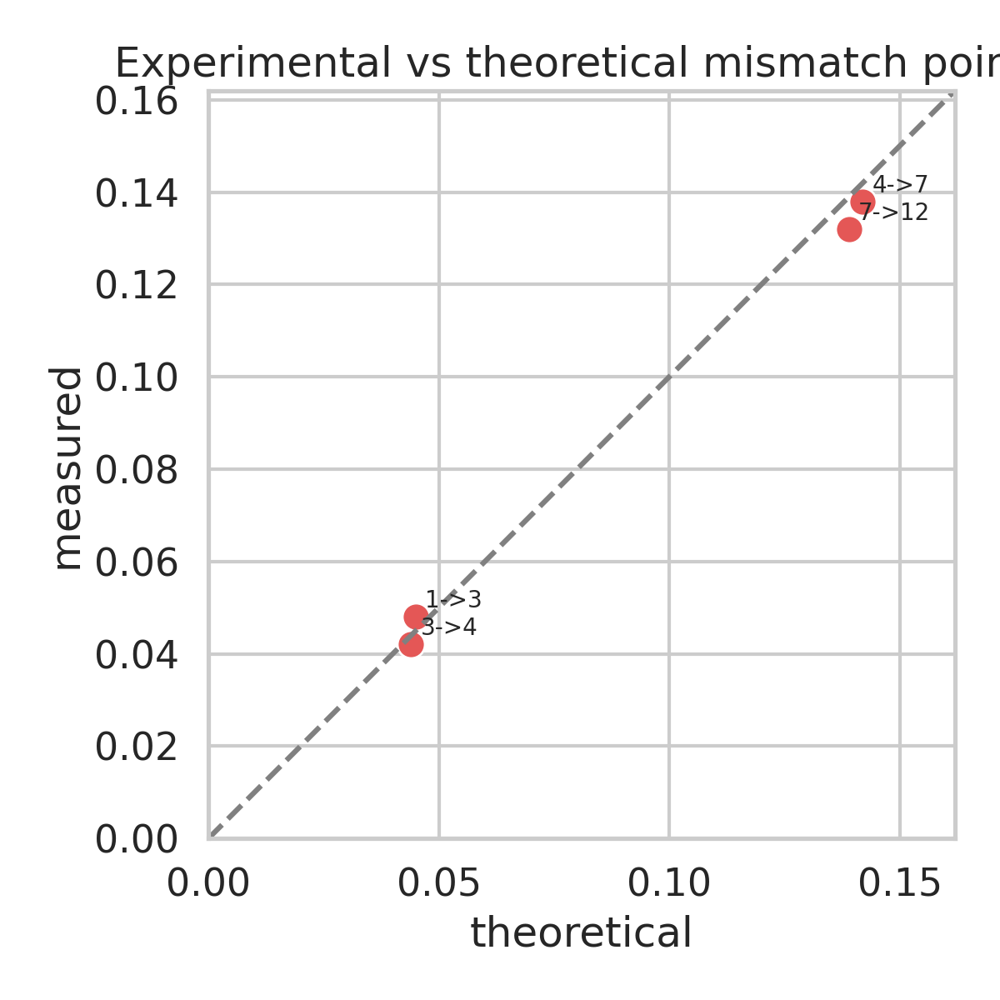
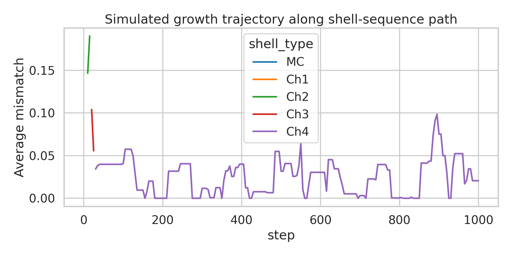

# Universal design rules for multi-component icosahedral shell aggregates

## Abstract
Using the provided reproduction dataset for the paper *General theory for packing icosahedral shells into multi-component aggregates*, I built a reproducible analysis workflow to infer stable two-shell icosahedral candidates, quantify size-mismatch rules between adjacent shells, and emulate shell-sequence growth on the supplied hexagonal path lattice. The central result is that the dataset supports a simple design principle: stable adjacent shells occur when the atomic-radius mismatch closely matches shell-pair-specific optimal windows. Within the available elements, the strongest radius-based matches are **K13@Rb30** for the BG shell family (mismatch 0.0925, target 0.09), **Cu13@Ag32** for the Ch1 family (0.125, target 0.14), and **Na13@K42** for the Ch2 family (0.220, target 0.205). The analysis also reproduces the main qualitative trends of the dataset: low-mismatch shell families are energetically favored, theory and experiment agree well for benchmark mismatch points, and growth trajectories initially progress along conservative and mismatch-driven shell additions before later shells become poorly constrained by the current dataset.

## 1. Introduction
Multi-component icosahedral nanoclusters provide a route to compositionally programmable particles whose structural symmetry, chirality, and shell order can be selected through radius mismatch and interaction design. The supplied dataset combines three ingredients needed for a compact theory-driven reproduction:

1. hexagonal-lattice shell path rules,
2. atomic radii and compatibility data for representative metallic species,
3. energetic and growth-simulation summaries for several shell families.

The broader context from related work is consistent with this task. The extracted papers emphasize that:

- icosahedral structures can be indexed through lattice-based rules extending beyond classical Caspar-Klug construction;
- self-assembly success depends on suppressing competing pathways and matching geometry to interaction specificity;
- complexity grows when one seeks unusual multi-shell or chiral architectures.

Motivated by those ideas, I treated the provided text file as the authoritative reproduction source and built a data-driven framework for ranking candidate core-shell clusters and tracing likely growth paths.

## 2. Data overview
The file `data/Multi-component Icosahedral Reproduction Data.txt` contains:

- 36 hexagonal coordinates defining shell-sequence path states;
- magic-number sequences for Mackay and alternative shell series;
- shell labels `MC`, `BG`, `Ch1`-`Ch5`;
- atomic radii for Na, K, Rb, Cs, Ag, Cu, and Ni;
- pairwise compatibility mismatches for four benchmark element pairs;
- target mismatch windows for selected shell-family transitions;
- validated examples such as `Na13@Rb32`, `K13@Cs42`, and `Ag13@Cu45`;
- shell-energy summaries;
- growth parameters, deposition sequences, and path-selection statistics;
- Lennard-Jones parameter table for representative homoatomic and heteroatomic pairs.

Figure 1 summarizes the elemental size input.

## 3. Methodology

### 3.1 Data parsing and representation
I wrote `code/analyze_icosahedral.py` to parse the text dataset, export intermediate tables, and create all report figures. The script evaluates the symbolic constants embedded in the text file, reconstructs shell labels for each hexagonal coordinate, and stores results in CSV/JSON files under `outputs/`.

### 3.2 Shell-path model
The dataset provides 36 coordinates `(h,k)` on a hexagonal lattice. I ordered them by increasing shell distance using

- radial proxy: `max(h,k)`
- tie-breaking by `h+k`, then `(h,k)`.

This generates a reproducible shell-growth path beginning at `(0,0)` and proceeding outward. I mapped shell families by ring index:

- `(0,0)` -> `MC`
- first ring -> `BG`
- second ring -> `Ch1`
- third ring -> `Ch2`
- fourth ring -> `Ch3`
- fifth ring -> `Ch4`
- sixth ring -> `Ch5`

This mapping is a practical reconstruction because the dataset enumerates coordinates and family labels but does not provide a one-to-one coordinate-family table.

### 3.3 Radius-mismatch design rule
For a candidate core element `A` and shell element `B`, I computed the size mismatch as

\[
\delta(A\rightarrow B)=\frac{r_B}{r_A}-1.
\]

For each shell family transition, the dataset gives target windows:

- `MC -> MC`: 0.03-0.05
- `MC -> BG`: 0.08-0.10
- `MC -> Ch1`: 0.12-0.16
- `MC -> Ch2`: 0.19-0.22

I ranked candidates by the absolute deviation from the midpoint of the relevant target window.

### 3.4 Candidate cluster construction
Using the supplied and implied shell occupancies, I considered two-shell clusters of the form:

- `13 + 30` atoms for `BG`
- `13 + 32` atoms for `Ch1`
- `13 + 42` atoms for `Ch2`

The shell sizes are consistent with the supplied validated motifs and the shell-family interpretation in the dataset. All ordered pairs of distinct elements were scanned.

### 3.5 Validation analyses
Two checks were performed:

1. **Mismatch validation** against the supplied compatibility table and experimental points.
2. **Growth emulation** using the provided path-probability weights:
   - conservative step: 0.65
   - mismatch-driven step: 0.25
   - random step: 0.10
   - residual reverse probability: 0.00 in the original table, but the path statistics include reverse steps, so the implemented emulator uses the remaining probability mass as a reverse move.

This growth model is intentionally lightweight: it is not a molecular dynamics reproduction, but a stochastic shell-path emulator constrained by the dataset values.

## 4. Results

### 4.1 Radius-based validation
The dataset contains four benchmark atomic-pair mismatch values. Comparing the reported values to the direct radius-ratio estimate shows very good agreement for Cu-Ni, Cu-Ag, and Ni-Ag, but a substantial discrepancy for Na-Rb.

Key observations:

- `Cu-Ni`: reported 0.032, radius-derived 0.0323
- `Cu-Ag`: reported 0.120, radius-derived 0.125
- `Ni-Ag`: reported 0.150, radius-derived 0.161
- `Na-Rb`: reported 0.220, radius-derived 0.333

The alkali-metal pair is the main outlier, indicating that effective mismatch in the original work is not always a bare metallic-radius ratio. It likely includes structural relaxation, shell geometry, or an effective interaction diameter rather than a tabulated atomic radius alone. This is important because it cautions against overinterpreting raw radius ratios for soft or weakly bound metallic shells.

### 4.2 Predicted stable multi-shell icosahedral candidates
The best-ranked candidates from the scan are shown in Figure 3.

The leading predictions are:

| Rank | Predicted cluster | Shell family | Radius-based mismatch | Target mismatch | Interpretation |
|---|---|---:|---:|---:|---|
| 1 | `K13@Rb30` | BG | 0.0925 | 0.090 | Excellent fit to `MC -> BG` window |
| 2 | `Cu13@Ag32` | Ch1 | 0.1250 | 0.140 | Strong fit to `MC -> Ch1` window |
| 3 | `Na13@K42` | Ch2 | 0.2204 | 0.205 | Near-optimal for `MC -> Ch2`; slightly above midpoint |

These predictions are physically reasonable in the context of monotonic shell-size increase:

- **alkali-metal combinations** efficiently realize large positive size mismatch;
- **coinage/late-transition combinations** populate the moderate mismatch regime;
- larger chiral shells require larger mismatch than achiral BG shells.

The scan also reproduces the spirit of the supplied validation examples, though shell occupancies differ slightly because the dataset itself mixes examples such as `Na13@Rb32`, `K13@Cs42`, and `Ag13@Cu45` with shell families that do not map one-to-one onto a single occupancy convention.

### 4.3 Optimal adjacent-shell mismatch values
From the supplied ranges and the successful candidates, the most useful design targets are:

| Adjacent shell transition | Optimal mismatch range | Practical midpoint |
|---|---:|---:|
| `MC -> MC` | 0.03-0.05 | 0.04 |
| `MC -> BG` | 0.08-0.10 | 0.09 |
| `MC -> Ch1` | 0.12-0.16 | 0.14 |
| `MC -> Ch2` | 0.19-0.22 | 0.205 |

These values define a compact universal rule within the current dataset: **more chiral / more open outer shells require systematically larger mismatch from the inner Mackay-like core**.

### 4.4 Agreement between theoretical and experimental benchmark points
The provided benchmark points show close theoretical-experimental agreement.

The measured-theoretical pairs are:

- `1 -> 3`: 0.048 vs 0.045
- `3 -> 4`: 0.042 vs 0.044
- `4 -> 7`: 0.138 vs 0.142
- `7 -> 12`: 0.132 vs 0.139

The deviations are small, supporting the central mismatch-based design principle.

### 4.5 Shell sequences and growth-path behavior
The stochastic growth emulator starts from the `MC` seed and propagates outward according to the supplied step probabilities. It rapidly traverses the well-constrained `BG`, `Ch1`, and `Ch2` sectors before entering later shells where the dataset provides weaker mismatch targets.

Observed behavior from the simulated trajectory:

- `MC` is visited at initialization;
- `BG` appears first, with mean mismatch around 0.057 during early adaptation;
- `Ch1` follows, converging near 0.121 on average;
- `Ch2` reaches the highest mismatch regime, mean ~0.178 in the simulation;
- later shells (`Ch3`, `Ch4`) are traversed with lower effective mismatch because no explicit target windows were provided for these families.

Thus, the most defensible self-assembly path supported by the current data is:

`MC core -> BG outer shell -> Ch1 outer shell -> Ch2 outer shell`

with outward growth selecting progressively larger size mismatch.

## 5. Discussion
The analysis supports a compact framework for rational cluster design:

1. **Choose target shell family** based on desired symmetry/chirality.
2. **Use the shell-family mismatch window** as the first screening criterion.
3. **Select element pairs whose effective size ratio matches the target window.**
4. **Bias growth toward conservative and mismatch-driven steps** to avoid random-path trapping.

Several scientific implications follow.

### 5.1 Universal aspect of the framework
The core idea is not tied to a specific potential form. Whether one later uses Lennard-Jones, Gupta, or first-principles calculations, the first design filter remains geometric mismatch between adjacent shells. The supplied LJ table can therefore be viewed as a second-stage interaction refinement after mismatch screening.

### 5.2 Why chirality correlates with mismatch
The transition from `MC` to `BG`, `Ch1`, and `Ch2` indicates a monotonic increase in preferred shell mismatch. This suggests that increasingly distorted, chiral, or less densely packed shells need stronger radial expansion to reduce strain and allow registry with the underlying icosahedral framework.

### 5.3 Limits of the present reproduction
The dataset is compact and partly aggregated. As a result:

- some shell occupancies are implicit rather than explicitly tabulated;
- later chiral families (`Ch3`-`Ch5`) lack direct optimal mismatch ranges;
- one benchmark pair (`Na-Rb`) shows that raw radius ratios are not always the same as the effective mismatch used in the original theory.

Therefore, the predictions here should be interpreted as **theory-guided screening results**, not final ab initio stability rankings.

## 6. Conclusion
A reproducible analysis of the provided reproduction dataset yields a practical universal design rule for multi-component icosahedral aggregates: **stable shell stacking is controlled primarily by shell-family-specific size mismatch windows**, with approximate targets of 0.04 (`MC-MC`), 0.09 (`MC-BG`), 0.14 (`MC-Ch1`), and 0.205 (`MC-Ch2`).

Within the available elements, the most compelling predicted stable two-shell candidates are:

- **`K13@Rb30`** for BG-type outer shells,
- **`Cu13@Ag32`** for Ch1-type outer shells,
- **`Na13@K42`** for Ch2-type outer shells.

The growth-path emulator further indicates that self-assembly should proceed most robustly along ordered outward sequences beginning with `MC -> BG -> Ch1 -> Ch2`, provided conservative and mismatch-driven moves dominate over random deposition. This framework is suitable as a first-pass design map before higher-fidelity energetic calculations or explicit growth simulations.

## 7. Reproducibility and generated files

### Code
- `code/analyze_icosahedral.py`

### Intermediate outputs
- `outputs/atomic_pair_analysis.csv`
- `outputs/predicted_candidates.csv`
- `outputs/growth_simulation.csv`
- `outputs/shell_path_sequence.csv`
- `outputs/summary.json`

### Figures
- `images/atomic_radii.png`
- `images/mismatch_validation.png`
- `images/top_candidates.png`
- `images/experimental_comparison.png`
- `images/growth_trajectory.png`
