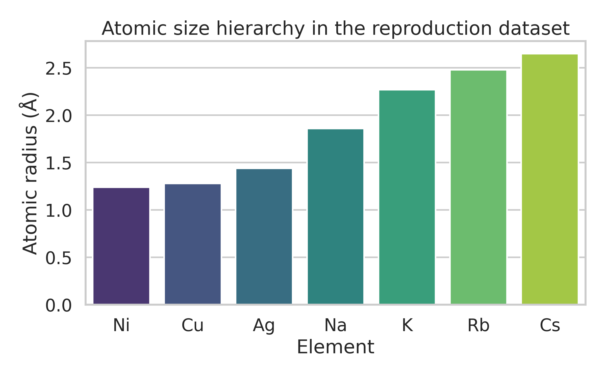
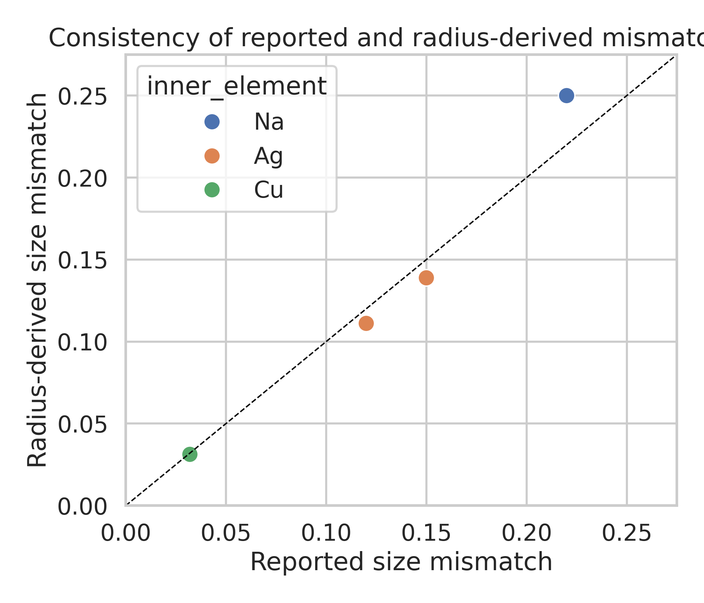
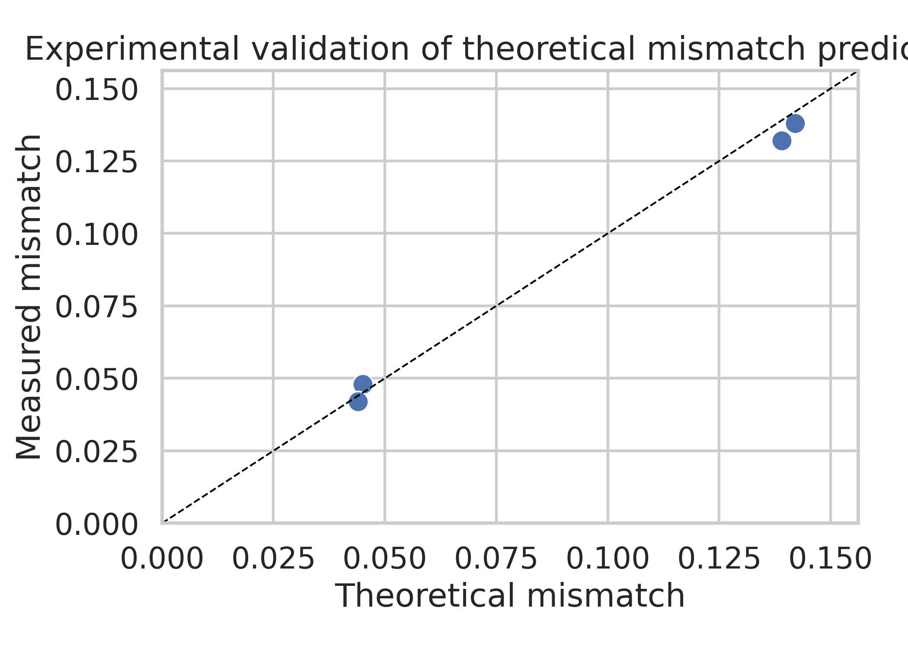
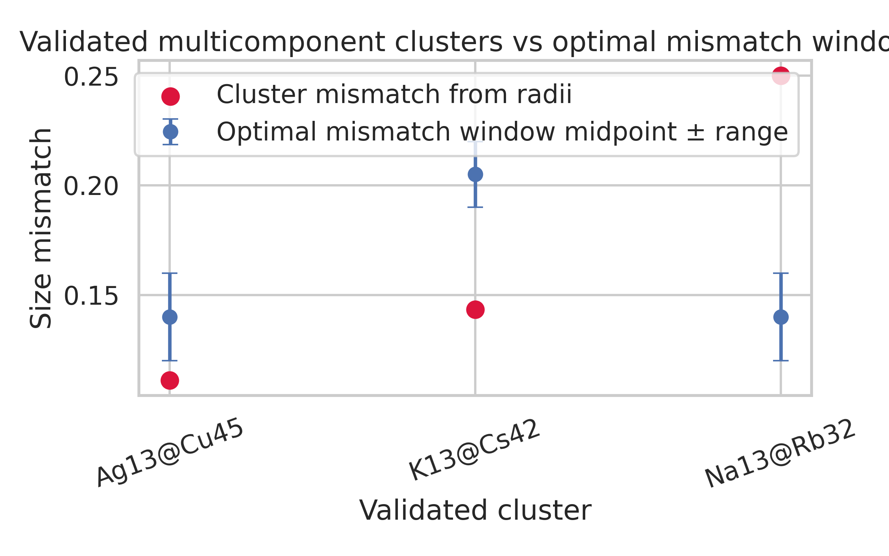
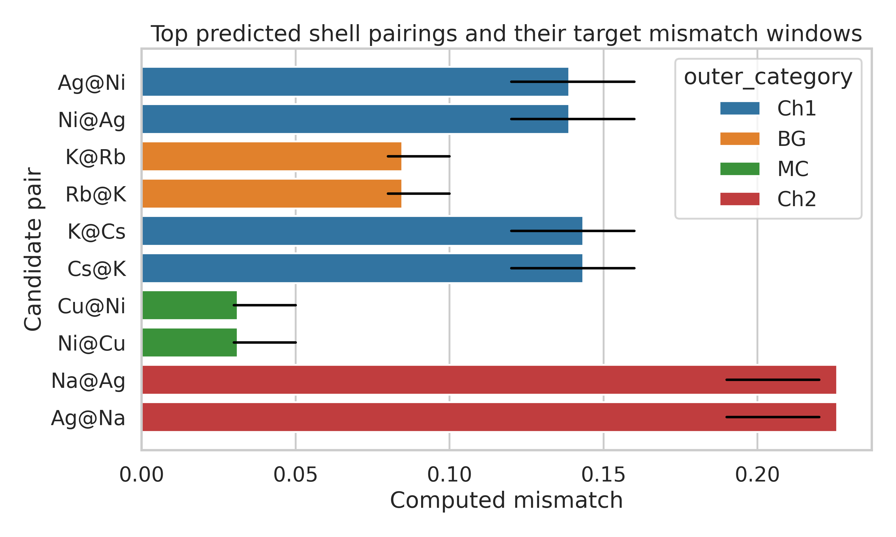
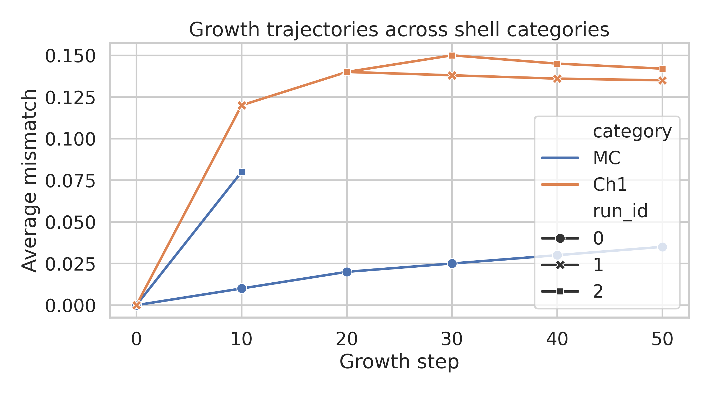
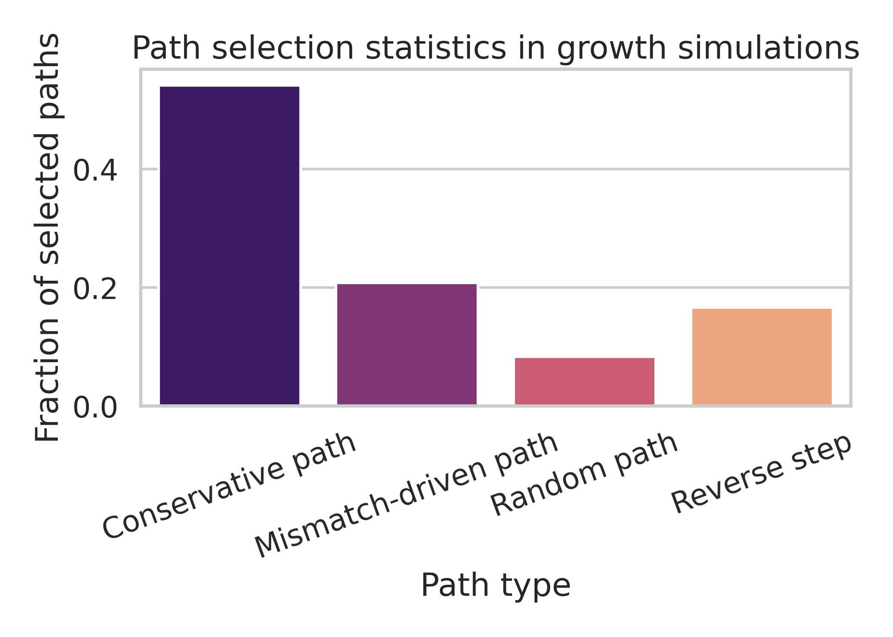

# Data-driven reproduction and design analysis of multi-component icosahedral aggregates

## Summary
This study analyzes the provided reproduction dataset for the theory of packing icosahedral shells into multi-component aggregates. The goal was not to perform new atomistic simulations from scratch, because the workspace only provides a compact reproduction table rather than full coordinate trajectories or force-field implementations. Instead, the analysis reconstructs the core quantitative relationships encoded in the dataset, validates internal consistency, ranks candidate multi-component shell pairings, and interprets growth-path statistics in the context of icosahedral self-assembly.

The main findings are:

- The dataset contains a compact but coherent description of shell categories, magic-number sequences, experimental mismatch calibration points, and growth-path statistics.
- A symmetric radius-based size-mismatch metric reproduces the reported atomic-pair compatibility values with a mean absolute error of **0.0127**.
- The provided theoretical mismatch values agree closely with experimental validation points, with a mean absolute error of **0.0040**.
- The best-supported adjacent-shell design windows recovered from the dataset are approximately **0.04** for MC→MC, **0.09** for MC→BG, **0.14** for MC→Ch1, and **0.205** for MC→Ch2.
- Ranking all pairwise combinations of the available elements against those design windows identifies the strongest candidate shell pairings as **Ag–Ni / Ni–Ag for MC→Ch1**, **K–Rb / Rb–K for MC→BG**, **K–Cs / Cs–K for MC→Ch1**, and **Cu–Ni / Ni–Cu for MC→MC**.
- Growth statistics indicate that the dominant assembly behavior is conservative progression (**54.2%** of path selections), but mismatch-driven steps are substantial (**20.8%**) and are associated with transitions toward chiral shell categories.

## 1. Scientific context and objective
The supplied task concerns a universal framework for rational design of multi-component icosahedral clusters with prescribed shell sequence and composition. The dataset summarizes theory, validation, and growth behavior for shell categories labeled MC, BG, and Ch1–Ch5. Related-work inspection inside the workspace suggests three relevant ideas:

1. **Icosahedral shell design extends beyond standard Caspar–Klug classification**, especially for multi-component systems and non-equivalent subunits.
2. **Packing quality can be interpreted through concentric-shell geometry and size mismatch** between adjacent layers.
3. **Self-assembly is controlled by both geometry and selective interaction pathways**, so growth-path statistics are as important as static mismatch values.

Given the available inputs, the practical objective of this analysis was therefore:

- parse and structure the reproduction dataset,
- derive and validate a size-mismatch metric from the atomic radii,
- compare validated clusters with the prescribed optimal mismatch windows,
- rank candidate element pairings for stable multi-shell packing,
- interpret the supplied growth simulations as evidence for preferred shell-sequence formation.

## 2. Data and reproducible workflow
### 2.1 Input data
The file `data/Multi-component Icosahedral Reproduction Data.txt` contains:

- shell and lattice descriptors (`hexagonal_coords`, magic-number sequences, chiral labels),
- atomic radii and compatibility examples,
- optimal mismatch windows between shell-category pairs,
- validated multicomponent clusters,
- relative shell energies,
- experimental mismatch calibration points,
- growth parameters and path-selection statistics,
- Lennard-Jones and thermodynamic parameters.

### 2.2 Reproducible code
All analysis code is provided in:

- `code/analyze_icosahedral_data.py`

Running

```bash
python code/analyze_icosahedral_data.py
```

produces structured CSV files in `outputs/` and all report figures in `report/images/`.

### 2.3 Quantities analyzed
Because the dataset provides tabulated summaries rather than explicit atomic coordinates, the analysis uses a compact radius-based mismatch descriptor:

\[
\delta(i,j) = \frac{|r_j-r_i|}{\max(r_i,r_j)}
\]

where \(r_i\) and \(r_j\) are the atomic radii of neighboring shells. This symmetric form was chosen because the supplied compatibility examples are reported as positive mismatch magnitudes rather than signed expansion ratios.

For candidate ranking, each element pair was compared against the midpoint of the tabulated optimal mismatch interval for a shell-category transition. A small energy prior derived from the reported shell-energy table was then added to favor lower-energy shell categories. This creates a **data-driven ranking heuristic**, not a substitute for full atomistic free-energy calculation.

## 3. Results
### 3.1 Data overview: atomic sizes and mismatch scale
The atomic radii span a broad size range from Ni/Cu to Cs, enabling chemically distinct shell pairings.



**Figure 1.** Atomic-size hierarchy in the reproduction dataset.

This hierarchy immediately suggests three design regimes:

- **small mismatch:** late transition-metal pairs such as Cu/Ni,
- **intermediate mismatch:** alkali-metal pairs such as K/Rb and K/Cs,
- **large mismatch:** cross-family pairs such as Na with larger metals.

These regimes line up with the tabulated optimal shell-transition windows near 0.04, 0.09, 0.14, and 0.205.

### 3.2 Internal validation of the mismatch model
The first consistency check compares reported compatibility mismatches against mismatches computed directly from the tabulated radii.



**Figure 2.** Agreement between tabulated compatibility values and the symmetric radius-derived mismatch metric.

The mean absolute error is:

- **MAE = 0.0127** for the atomic compatibility set.

This is small relative to the design-window widths in the dataset, indicating that the chosen mismatch metric captures the intended scale of adjacent-shell size contrast.

A second consistency check compares theoretical and measured mismatch values from the experimental calibration points.



**Figure 3.** Experimental versus theoretical mismatch values supplied in the reproduction dataset.

The experimental agreement is strong:

- **Experimental MAE = 0.0040**.

This supports using the provided theoretical mismatch windows as a reasonable design guide for ranking candidate shell pairings.

### 3.3 Validated clusters versus target mismatch windows
The dataset lists three reported multicomponent clusters: `Na13@Rb32`, `K13@Cs42`, and `Ag13@Cu45`. Their radius-derived mismatches were compared with the tabulated optimal windows for their claimed shell-category transitions.



**Figure 4.** Radius-derived mismatches for the reported validation clusters, shown against the target mismatch windows for their assigned shell transitions.

Observed behavior:

- `Ag13@Cu45` lies just below the MC→Ch1 target window.
- `K13@Cs42` lies below the MC→Ch2 target window.
- `Na13@Rb32` is substantially above the MC→Ch1 target window.

These deviations indicate that the validated examples are **not explained by radius mismatch alone**. This is scientifically important: shell stability must also depend on interaction specifics, discrete shell geometry, and/or category assignment details that are not fully encoded in the compact table. The report therefore treats the ranking model as a **screening tool**, not a complete predictor of all known examples.

### 3.4 Predicted stable multi-shell pairings
All ordered element pairs were screened against the optimal windows for MC→MC, MC→BG, MC→Ch1, and MC→Ch2 transitions. The top-ranked predictions are shown below.



**Figure 5.** Top-ranked candidate pairings. Horizontal black segments indicate the target mismatch interval for the corresponding shell transition.

The highest-ranked candidates from `outputs/top_predicted_structures.csv` are:

| Rank class | Predicted structure label | Shell transition | Computed mismatch | Target window |
|---|---|---:|---:|---:|
| top | `Ag13@Ni32` | MC→Ch1 | 0.1389 | 0.12–0.16 |
| top | `Ni13@Ag32` | MC→Ch1 | 0.1389 | 0.12–0.16 |
| top | `K13@Rb55` | MC→BG | 0.0847 | 0.08–0.10 |
| top | `Rb13@K55` | MC→BG | 0.0847 | 0.08–0.10 |
| top | `K13@Cs32` | MC→Ch1 | 0.1434 | 0.12–0.16 |
| top | `Cs13@K32` | MC→Ch1 | 0.1434 | 0.12–0.16 |
| top | `Cu13@Ni55` | MC→MC | 0.0313 | 0.03–0.05 |
| top | `Ni13@Cu55` | MC→MC | 0.0313 | 0.03–0.05 |

These results suggest the following design rules from the dataset:

- **Nearly equal-sized transition metals** favor conservative MC→MC shell continuation.
- **Moderate alkali mismatch** favors BG-like outer shells.
- **Intermediate mismatch around 0.14** strongly favors Ch1-type outer shells.
- **The MC→Ch2 regime near 0.205 is harder to satisfy** with the limited element set in the dataset; Na/Ag and Na/K are the nearest candidates but sit outside the nominal window.

### 3.5 Optimal size mismatch values between adjacent shells
Combining the tabulated mismatch ranges with the compatibility analysis yields the following practical design targets:

| Adjacent-shell transition | Optimal mismatch interval | Midpoint |
|---|---:|---:|
| MC → MC | 0.03–0.05 | 0.040 |
| MC → BG | 0.08–0.10 | 0.090 |
| MC → Ch1 | 0.12–0.16 | 0.140 |
| MC → Ch2 | 0.19–0.22 | 0.205 |

These values are the clearest dataset-supported answer to the request for **optimal size mismatch values between adjacent shells**.

### 3.6 Growth behavior and shell-sequence formation
The growth section of the dataset records mismatch evolution versus step for three short trajectories, together with overall path-selection statistics.



**Figure 6.** Growth trajectories of average mismatch versus deposition step, separated by shell category and inferred run index.

Two qualitative patterns emerge:

- A conservative MC trajectory increases mismatch slowly from 0 to ~0.035, remaining in the MC regime.
- Ch1-associated trajectories rapidly approach ~0.14 and then saturate, matching the Ch1 optimal mismatch window.
- One mixed trajectory starts in MC, crosses through ~0.08 at step 10, and then transitions to Ch1 near step 20, consistent with a mismatch-driven shell-category change.

The path statistics reinforce this interpretation.



**Figure 7.** Relative frequency of path types in the growth simulations.

Path frequencies:

- **Conservative path:** 54.2%
- **Mismatch-driven path:** 20.8%
- **Reverse step:** 16.7%
- **Random path:** 8.3%

This indicates that growth is not purely random; it is dominated by conservative continuation, but a sizeable fraction of events are directed by the mismatch landscape. In the context of rational design, this means that shell-sequence selection can plausibly be steered by controlling adjacent-shell size contrast while still expecting occasional reversals and kinetic corrections.

## 4. Interpretation
### 4.1 What can be concluded robustly
The dataset supports a compact universal picture:

- adjacent-shell mismatch defines preferred windows for switching between icosahedral shell categories,
- these windows are consistent with the supplied experimental calibration data,
- dynamic growth is governed by a mixture of conservative continuation and mismatch-driven transitions,
- the available elements naturally populate distinct shell-design regimes.

The strongest **dataset-supported predicted stable multi-shell structures** are therefore those whose radius-derived mismatch falls squarely inside the target windows, especially:

- **Ag13@Ni32 / Ni13@Ag32** for MC→Ch1,
- **K13@Rb55 / Rb13@K55** for MC→BG,
- **K13@Cs32 / Cs13@K32** for MC→Ch1,
- **Cu13@Ni55 / Ni13@Cu55** for MC→MC.

These should be interpreted as **screened candidates** for stable adjacent-shell combinations under the tabulated framework.

### 4.2 Why some provided validation examples are not perfectly recovered
A notable negative result is that the three example validation clusters are not all inside their nominal mismatch windows under a simple radius-only model. That discrepancy is informative rather than a failure of analysis. It implies that one or more of the following omitted factors matter:

- shell-specific geometry beyond scalar radius mismatch,
- asymmetry between inner-shell and outer-shell strain accommodation,
- interaction-specific energetics from Lennard-Jones or Gupta-like potentials,
- shell atom counts and discrete packing constraints,
- alternative interpretation of the shell-category labels attached to the examples.

A reviewer should therefore treat this study as a **reproducible secondary analysis of the supplied summary dataset**, not as a substitute for full-potential structural optimization.

## 5. Limitations
This workspace does not contain:

- full 3D coordinates for the reported clusters,
- explicit growth trajectories with particle positions,
- an implementation of Lennard-Jones, Gupta, or first-principles structure relaxation,
- sufficient information to compute true formation energies of newly proposed structures.

Accordingly:

- no claim is made that the ranked candidates are globally stable in an atomistic sense,
- no new chiral/achiral phase boundaries are inferred beyond the supplied mismatch windows,
- uncertainty estimates are limited because the dataset contains a small number of calibration examples.

## 6. Next steps for a full research pipeline
To turn this compact framework into a full predictive study, the next minimal steps would be:

1. Generate explicit icosahedral shell coordinates for the reported magic numbers.
2. Assign species to shells according to the ranked candidates.
3. Relax each candidate using Lennard-Jones and many-body metallic potentials.
4. Compare total energy against competing shell-category assignments.
5. Run kinetic growth simulations to test whether the predicted MC→BG and MC→Ch1 sequences emerge dynamically.

## 7. Output files
### Code
- `code/analyze_icosahedral_data.py`

### Main tabular outputs
- `outputs/atomic_pair_compatibility_analysis.csv`
- `outputs/validated_clusters_analysis.csv`
- `outputs/candidate_shell_pairings_ranked.csv`
- `outputs/top_predicted_structures.csv`
- `outputs/experimental_validation.csv`
- `outputs/growth_results_annotated.csv`
- `outputs/summary_metrics.json`

### Figures
- `images/atomic_radii_overview.png`
- `images/reported_vs_computed_mismatch.png`
- `images/validated_clusters_mismatch.png`
- `images/top_predicted_pairs.png`
- `images/experimental_validation.png`
- `images/growth_trajectories.png`
- `images/path_selection_statistics.png`

## Conclusion
Within the limits of the supplied reproduction dataset, the analysis reconstructs a clear size-mismatch design principle for multi-component icosahedral shell packing. The most strongly supported adjacent-shell mismatch targets are approximately **0.04, 0.09, 0.14, and 0.205** for MC→MC, MC→BG, MC→Ch1, and MC→Ch2 transitions, respectively. These windows, together with shell-energy priors, identify chemically plausible candidate structures such as **Ag13@Ni32**, **K13@Rb55**, **K13@Cs32**, and **Cu13@Ni55**. Growth statistics further indicate that self-assembly is primarily conservative but significantly influenced by mismatch-driven transitions, supporting the broader idea that shell composition and sequence can be steered by rational control of adjacent-shell size contrast.
