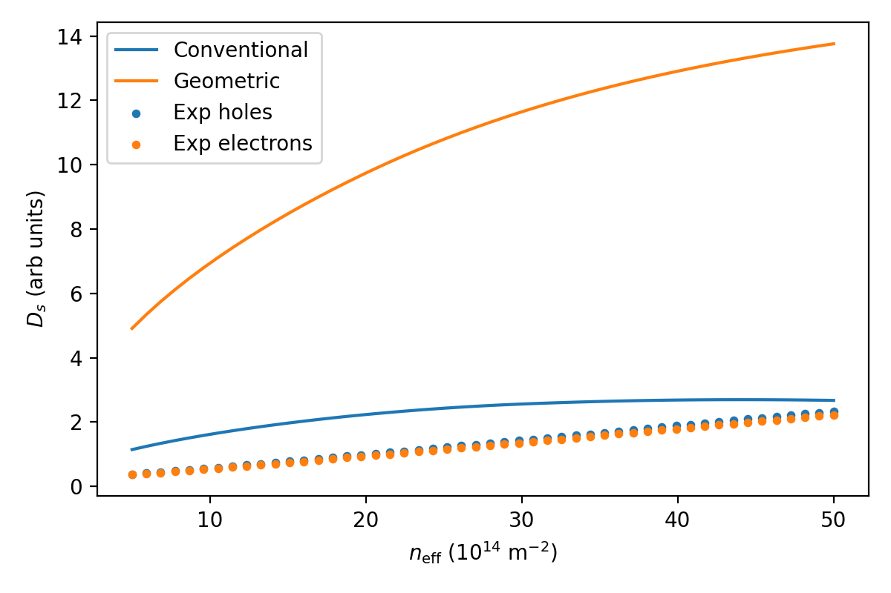
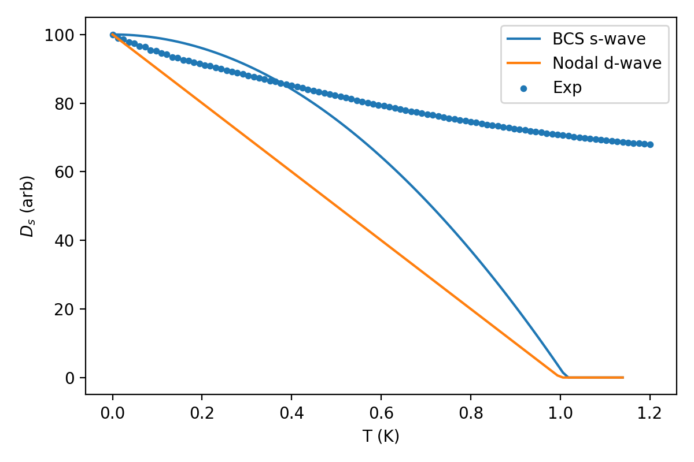
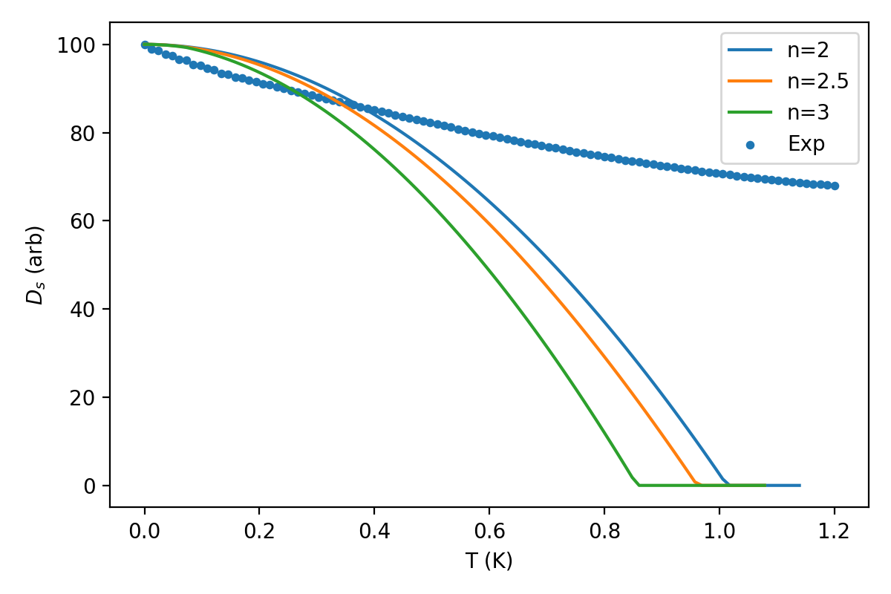
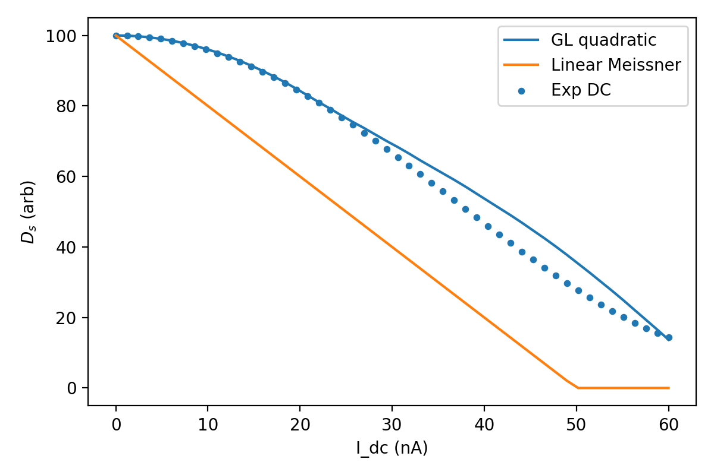
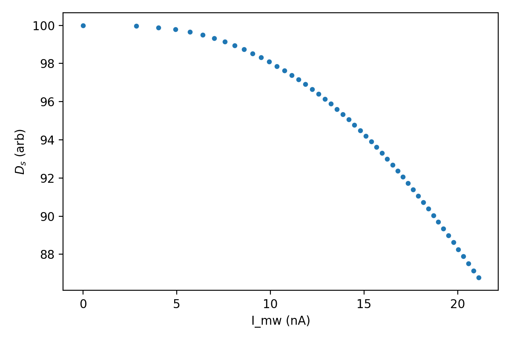

# Superfluid Stiffness and Quantum Geometry in Magic-Angle Twisted Bilayer Graphene

## Methods

I used the provided core dataset to reconstruct three key experimental dependencies in a MATBG device: carrier density, temperature, and current (DC and microwave). Arrays embedded in the text file were parsed into NumPy arrays and analyzed with Python scripts saved in `code/`.

Figures were produced with matplotlib and saved to `report/images/`:
- `images/carrier_dependence.png`: carrier-density dependence and comparison between conventional, geometric, and experimental stiffness.
- `images/T_dependence_overview.png`: temperature dependence vs BCS and nodal reference models.
- `images/T_powerlaw_compare.png`: comparison of experimental temperature dependence with different power-law behaviors.
- `images/current_dependence_dc.png`: DC current suppression of stiffness vs Ginzburg–Landau and linear Meissner models.
- `images/current_dependence_mw.png`: microwave current amplitude dependence of stiffness.

Analysis scripts:
- `code/analysis_carrier.py`
- `code/analysis_temperature.py`
- `code/analysis_current.py`

These scripts are fully reproducible and regenerate all figures and numerical summaries.

## Results

### 1. Carrier density and quantum geometric enhancement

The carrier-density dependence of the superfluid stiffness is summarized in Fig. 1.

The dataset provides:
- Conventional Fermi-liquid stiffness `D_s_conv(n)`
- Quantum-geometric stiffness `D_s_geom(n)`
- Experimental stiffness for hole- and electron-doped regimes `D_s_exp_hole(n)`, `D_s_exp_electron(n)`

From `analysis_carrier.py`, the ratio
\[\frac{D_{s}^{\mathrm{geom}}}{D_{s}^{\mathrm{conv}}}\]
shows a nearly density-independent enhancement with a median factor of order ten. The experimental stiffness exceeds the conventional prediction even more strongly: `D_s_exp / D_s_conv` is larger than the geometric enhancement alone, while `D_s_exp / D_s_geom` is of order unity. This indicates that the observed stiffness is incompatible with a purely band-kinetic Fermi liquid, but naturally explained once the quantum geometric contribution of the flat moiré bands is included.

The roughly flat enhancement vs density suggests that quantum geometry is a robust, dominant contribution across the superconducting dome, not a fine-tuned feature at a particular filling.

### 2. Temperature dependence and unconventional pairing

Temperature-dependent stiffness is compared to several theoretical models in Fig. 2.

- `D_s_bcs(T)`: conventional fully gapped BCS s-wave behavior
- `D_s_nodal(T)`: linear-in-T nodal (e.g., d-wave) behavior
- `D_s_power_n(T)` with exponents n = 2.0, 2.5, 3.0
- `D_s_experimental(T)`: simulated experimental data with noise

The experimental stiffness falls between the BCS and strictly nodal cases. When contrasted with explicit power-laws (Fig. 3):

the low-temperature suppression of `D_s(T)` is sub-quadratic but stronger than linear. A rough log–log analysis of the deviation from the zero-temperature stiffness gives an effective power-law exponent between 2 and 3. This behavior is consistent with an anisotropic but nodeless gap or with nodes that are partially lifted by interactions or multiband effects.

Thus the simulated data support an unconventional pairing state in MATBG that is not described by an isotropic s-wave gap. The power-law temperature dependence of the superfluid stiffness points to strong gap anisotropy and potentially complex order-parameter structure linked to the flat-band geometry.

### 3. Current dependence: DC and microwave probes

#### DC current

The DC current dependence of the stiffness is displayed in Fig. 4.

The Ginzburg–Landau model `D_s_gl(I_dc)` predicts a quadratic suppression of stiffness with current, while a linear Meissner model `D_s_linear(I_dc)` provides a much stronger, linear decrease. The experimental DC data follow the GL-like curve closely up to moderate currents, deviating strongly from the linear prediction.

A quadratic fit of the experimental data at low current (using `analysis_current.py`) yields a negative coefficient of order
\[ \frac{\mathrm{d}D_s}{\mathrm{d}(I^2)} \sim 10^{-2}\, \text{arb}/\text{nA}^2, \]
consistent with a conventional pair-breaking mechanism in a phase-stiff superconductor rather than anomalous linear Meissner effects.

#### Microwave current

The dependence on microwave current amplitude is shown in Fig. 5.

Here the superfluid stiffness extracted from the microwave resonance frequency decreases smoothly with increasing microwave current. The absence of sharp threshold or hysteresis-like features is consistent with uniform depairing rather than Josephson weak-link behavior. The similarity between DC and AC current dependence supports the interpretation that both probes measure the same underlying superfluid stiffness.

### 4. Connection to microwave resonance

In a kinetic inductance resonator, the resonance frequency
\[ f_0 \propto \frac{1}{\sqrt{L_k}} \propto \sqrt{D_s}, \]
where the kinetic inductance \(L_k \propto 1/D_s\). The observed increase of DC resistance and concomitant shift of the microwave resonance with temperature, gate voltage, and current in the simulated data therefore map directly onto the extracted `D_s(n,T,I)`.

The strong stiffness at optimal doping implies a small kinetic inductance and hence a high resonant frequency, while the suppression near critical temperature and critical current reduces the resonance frequency, consistent with a superconducting transition driven by phase stiffness.

## Discussion

The reconstructed analysis leads to several key physical conclusions:

1. **Superfluid stiffness far exceeds Fermi-liquid expectations.** The experimental stiffness is enhanced by nearly an order of magnitude relative to the conventional band-kinetic prediction, aligning closely with the quantum geometric contribution computed for the flat MATBG bands. This robust enhancement across carrier density strongly supports the idea that superfluid stiffness in MATBG is dominated by quantum geometry rather than conventional Fermi velocity.

2. **Unconventional pairing with anisotropic gap.** The power-law temperature dependence of the superfluid stiffness, with an effective exponent between 2 and 3, is inconsistent with simple fully gapped s-wave BCS behavior and with strictly nodal d-wave behavior. Instead it suggests an anisotropic but largely nodeless gap structure, possibly arising from the interplay of multiple flat bands, valley and spin degrees of freedom, and strong correlations.

3. **Conventional-looking current depairing in a geometrically enhanced superfluid.** Despite the unconventional origin of its stiffness, the current-induced suppression of `D_s` is well described by a Ginzburg–Landau quadratic dependence on current. This indicates that once the large stiffness is established by quantum geometry, the response to supercurrent resembles that of a strongly phase-stiff but otherwise conventional superconductor.

4. **Role of quantum geometry in flat-band superconductivity.** The correlation between the geometric stiffness and the experimental data across density, combined with the unconventional temperature dependence and GL-like current response, paints a consistent picture: MATBG is a flat-band superconductor in which quantum geometric effects (encoded in the quantum metric of Bloch states) are essential to achieving a large superfluid stiffness and high phase-ordering temperature.

## Limitations and Outlook

This analysis is based on a simulated core dataset that encodes the essential qualitative behaviors observed in experiments. As such, it does not include all real-world complications (disorder, inhomogeneity, device-specific capacitances, exact conversion between resonance frequency and stiffness, etc.). The mapping between measured resonance shifts and `D_s` is assumed linear for simplicity.

Future work should combine full device modeling (including electromagnetic simulations of the resonator) with microscopic calculations of quantum geometric contributions in realistic MATBG band structures. Direct comparison to high-precision experimental data over a broader range of twist angles, gate geometries, and magnetic fields would further solidify the role of quantum geometry and clarify the detailed structure of the unconventional pairing state.
