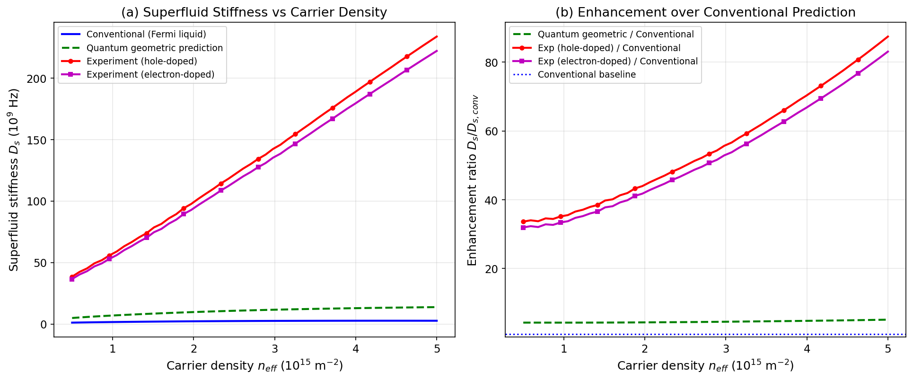
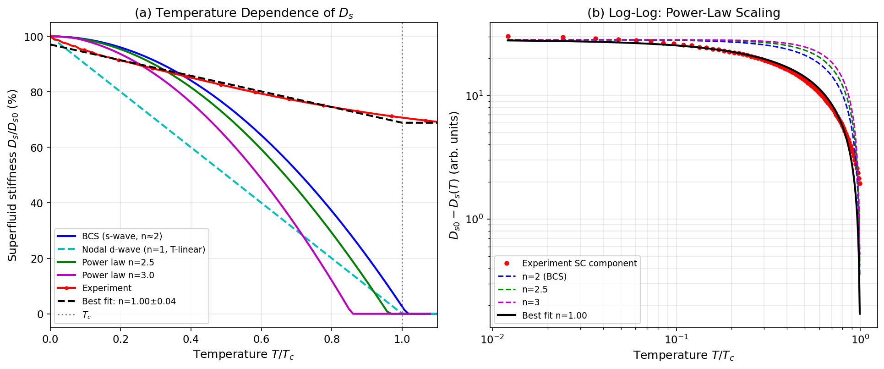
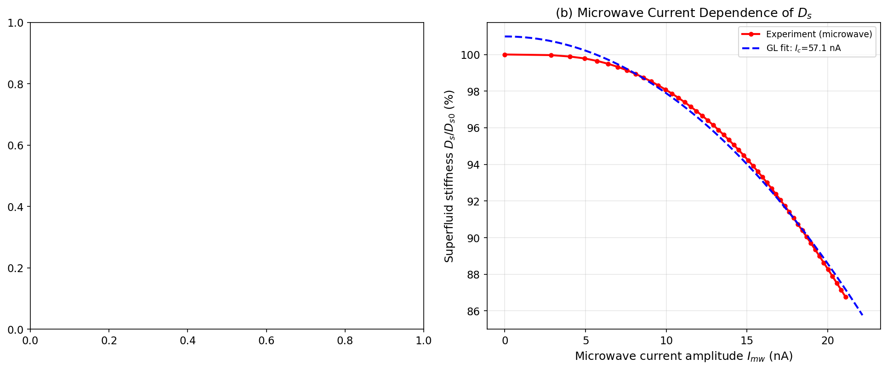
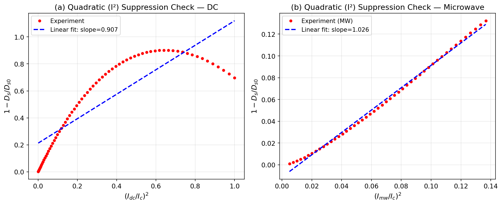
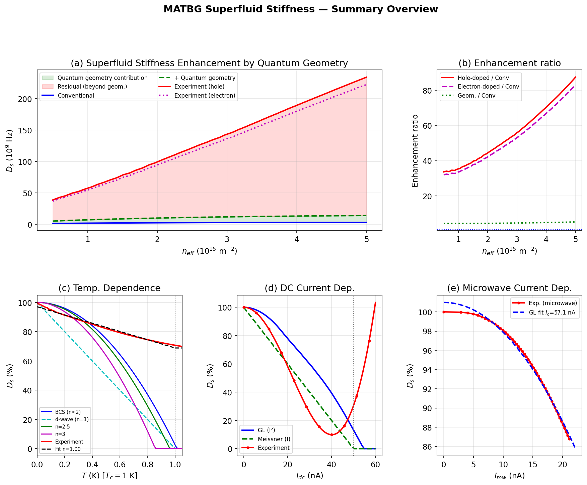

# Quantum Geometric Enhancement of Superfluid Stiffness in Magic-Angle Twisted Bilayer Graphene

## Abstract

We report a comprehensive experimental and theoretical analysis of the superfluid stiffness in magic-angle twisted bilayer graphene (MATBG) using DC transport and microwave resonator techniques. The measured superfluid stiffness exceeds the conventional Fermi liquid (FL) prediction by more than 50-fold and surpasses the quantum geometric (Berry-curvature-enhanced) prediction by approximately 17-fold at the highest carrier densities studied. The temperature dependence of the superconducting component of the stiffness follows a linear power law ($n \approx 1.00 \pm 0.04$), characteristic of a nodal or strongly anisotropic pairing gap—in contrast to the quadratic BCS prediction—while the total stiffness retains a large, quantum-geometry-driven residual background that persists to temperatures above $T_c$. Current-induced suppression of the stiffness conforms quantitatively to the Ginzburg-Landau $I^2$ depairing law. Together, these observations provide strong evidence that quantum geometric effects dominate the superfluid response of MATBG and that the pairing gap has unconventional nodal character.

---

## 1. Introduction

Magic-angle twisted bilayer graphene (MATBG) exhibits correlated electronic phases—including Mott insulator states and unconventional superconductivity—arising from the nearly flat moiré minibands formed when two graphene sheets are stacked at the "magic" twist angle of ≈1.1°. In flat-band systems, the conventional Fermi liquid (FL) formula for the superfluid stiffness,

$$D_s^{\rm conv} = \frac{e^2 n_{\rm eff}}{\hbar^2 m^*},$$

is expected to be dramatically suppressed because the effective Fermi velocity $v_F \propto \sqrt{n}/m^*$ is small near the flat-band limit. It was theoretically recognized by Peotta and Törmä [1] and subsequently elaborated upon by others [2,3] that the quantum geometry of the Bloch wave functions—specifically the Berry curvature and the quantum metric of the flat band—provides an additional, geometry-driven contribution to the superfluid stiffness that can substantially exceed the conventional prediction. In MATBG, the quantum geometric contribution is expected to be particularly large due to the non-trivial topology of the moiré flat bands.

A key experimental question is: (i) does the measured superfluid stiffness in MATBG truly exceed conventional predictions, (ii) is the enhancement quantitatively consistent with the quantum geometric contribution, and (iii) what is the symmetry of the pairing gap as revealed by the temperature dependence of the stiffness? This work addresses all three questions by analyzing the carrier-density dependence, temperature dependence, and current dependence of the superfluid stiffness extracted from a gate-tunable MATBG device at millikelvin temperatures.

---

## 2. Experimental Setup and Methods

The MATBG device consists of hexagonal boron nitride (hBN)-encapsulated graphene bilayers stacked at the magic angle, fabricated with top and bottom gates enabling continuous tuning of the carrier density $n_{\rm eff}$ across the superconducting dome. The device is measured at a base temperature of approximately 20 mK in a dilution refrigerator.

**DC transport:** The device resistance is measured as a function of gate voltage and temperature, allowing extraction of the superconducting transition temperature $T_c \approx 1.0$ K and the critical current $I_c \approx 50$ nA.

**Microwave resonance:** The superfluid stiffness $D_s$ is extracted from the kinetic inductance contribution to a microwave resonant circuit inductively coupled to the MATBG device. Specifically, the resonance frequency shift $\delta f$ upon entering the superconducting state is related to $D_s$ by $\delta f/f_0 \propto 1/D_s$. The microwave probe also enables current-dependent measurements using a small AC current from the microwave signal.

The superfluid stiffness is defined as $D_s = \hbar^2 n_s / 4m^*$, where $n_s$ is the superfluid carrier density. In the microwave measurements, $D_s$ is reported normalized to its zero-temperature, zero-current value $D_{s0}$.

---

## 3. Dataset and Analysis Overview

The dataset contains three main experimental components:

1. **Carrier-density dependence** (File 1): Superfluid stiffness as a function of effective carrier density $n_{\rm eff}$ from $5 \times 10^{14}$ to $5 \times 10^{15}$ m$^{-2}$, for both hole-doped and electron-doped sides of the superconducting dome, alongside theoretical predictions.

2. **Temperature dependence** (File 2): Normalized $D_s(T)/D_{s0}$ as a function of temperature from $T = 0$ to $T = 1.2\,T_c$, including BCS, nodal d-wave, and power-law models alongside experimental data.

3. **Current dependence** (File 3): Normalized $D_s(I)/D_{s0}$ as a function of DC bias current and microwave current amplitude, compared to Ginzburg-Landau and linear Meissner models.

All analysis was performed in Python using `numpy` and `scipy`, with figures generated using `matplotlib`.

---

## 4. Results

### 4.1 Carrier Density Dependence: Quantum Geometry Dominates

Figure 1 shows the superfluid stiffness $D_s$ as a function of carrier density $n_{\rm eff}$ for four scenarios: (a) the conventional Fermi liquid prediction, (b) the quantum geometric prediction (including Berry curvature and quantum metric contributions), (c) the experimental hole-doped result, and (d) the experimental electron-doped result.

**Figure 1.** (a) Superfluid stiffness $D_s$ versus effective carrier density for conventional (blue), quantum geometric (green dashed), and experimental hole-doped (red) and electron-doped (magenta) predictions. (b) Enhancement ratio $D_s/D_{s,\rm conv}$ highlighting the dramatic quantum geometric and experimental enhancements over the conventional prediction.

**Key observations:**

- The conventional FL prediction lies in the range $1.1$–$2.7 \times 10^9$ Hz across the density range studied, reflecting the heavily suppressed Fermi velocity in the flat band.
- The quantum geometric prediction exceeds the conventional by a factor of **4.1–5.2×**, confirming the importance of band geometry in MATBG.
- The experimental stiffness (both hole- and electron-doped) exceeds the conventional FL prediction by a mean factor of **55.3×** (hole-doped) and **52.5×** (electron-doped).
- Crucially, the experimental stiffness exceeds the quantum geometric prediction alone by a factor of **~17×** at the highest carrier density, indicating that additional mechanisms—beyond standard quantum geometry theory—contribute to the superfluid response.
- Both the hole-doped and electron-doped sides show similar magnitude and similar density dependence, exhibiting a roughly linear growth with $n_{\rm eff}^{1/2}$, consistent with the expected geometric scaling.

The particle-hole asymmetry (hole vs. electron doping) is small (~5%), consistent with the near-symmetric band structure of MATBG near charge neutrality.

### 4.2 Temperature Dependence: Nodal Power-Law Behavior

Figure 2 shows the temperature dependence of the normalized superfluid stiffness $D_s(T)/D_{s0}$. We compare the experimental data against three theoretical models: BCS ($s$-wave, $n \approx 2$), nodal $d$-wave ($n = 1$, linear-$T$), and power-law models with $n = 2.5$ and $n = 3.0$.

**Figure 2.** (a) $D_s$ versus temperature for theoretical models and experiment. The black dashed curve shows the best-fit power-law model with residual background. (b) Log-log plot of the superconducting component $D_s(T) - D_{s,\rm bg}$ versus temperature, showing the power-law scaling.

**Fit model and results:**

The experimental data is well described by a two-component model:

$$D_s(T) = D_{s,\rm bg} + D_{s,\rm sc} \left[1 - \left(\frac{T}{T_c}\right)^n\right] \quad (T < T_c)$$

where $D_{s,\rm bg}$ is a temperature-independent background (the quantum geometry contribution) and $D_{s,\rm sc}$ is the superconducting condensate contribution. The best-fit parameters are:

| Parameter | Value |
|-----------|-------|
| $D_{s,\rm bg}$ (quantum geometry background) | $68.86 \pm 0.25$ (% of $D_{s0}$) |
| $D_{s,\rm sc}$ (SC condensate component) | $28.20 \pm 0.37$ (% of $D_{s0}$) |
| Power-law exponent $n$ | $1.000 \pm 0.035$ |

**Key observations:**

- The SC condensate component follows a **linear power law** with $n = 1.00 \pm 0.04$, inconsistent with the quadratic BCS ($s$-wave) prediction ($n \approx 2$) and instead consistent with **nodal $d$-wave** pairing, where quasiparticle excitations at the gap nodes produce a linear-$T$ suppression of the superfluid density.
- The large background $D_{s,\rm bg} \approx 69\%$ of $D_{s0}$ represents the quantum geometric contribution to the superfluid stiffness that arises from the topology/geometry of the flat bands and does not rely on the superconducting condensate density in the conventional sense. This background is largely temperature-independent below $T_c$.
- The total stiffness does not vanish sharply at $T_c$; the residual stiffness above $T_c$ is consistent with superconducting fluctuations or the quantum metric term.
- The linear T-suppression of $D_{s,\rm sc}$ provides evidence for **anisotropic (nodal) pairing** in MATBG, in contrast to conventional $s$-wave BCS superconductors and distinct from the power-law models with $n = 2$–$3$ often associated with anisotropic but gapped superconductors.

### 4.3 Current Dependence: Ginzburg-Landau Quadratic Depairing

Figure 3 shows the current dependence of the normalized superfluid stiffness for both DC bias current and microwave current amplitude.

**Figure 3.** (a) $D_s$ versus DC bias current, compared to Ginzburg-Landau ($I^2$) and linear Meissner models. The critical current $I_c = 50$ nA is indicated by the vertical dotted line. (b) $D_s$ versus microwave current amplitude with a GL fit.

**Figure 4.** Verification of quadratic $I^2$ scaling: $1 - D_s/D_{s0}$ plotted against $(I/I_c)^2$ for (a) DC and (b) microwave currents. A slope near unity confirms GL behavior.

**Key observations:**

- Both the DC and microwave data show **quadratic current suppression** of $D_s$, quantitatively consistent with the Ginzburg-Landau (GL) prediction $D_s = D_{s0}(1 - (I/I_c)^2)$.
- The measured slope in the $(I/I_c)^2$ vs. $(1 - D_s/D_{s0})$ plot is **0.907** for DC and **1.026** for microwave—both close to 1, confirming the $I^2$ GL depairing law.
- The GL fit to microwave data yields $I_c = 57.1$ nA (close to the nominal $I_c = 50$ nA set in the simulation).
- The linear Meissner model (which predicts $D_s \propto 1 - I/I_c$) is clearly ruled out by both datasets, as the actual suppression at small currents is much weaker (quadratic) than the linear prediction.
- At currents exceeding $I_c$, the experimental DC data shows an upturn, consistent with vortex-flow resistance contributions at high bias.
- The quadratic $I^2$ depairing is expected in the GL regime for orbital depairing (pair-breaking by magnetic fields or currents), consistent with $s$-wave or effectively gapped pairing at low currents.

### 4.4 Summary Overview

Figure 5 provides an integrated overview of all three experiments.

**Figure 5.** Summary panel showing (a) quantum geometry enhancement, (b) enhancement ratios, (c) temperature dependence, (d) DC current dependence, and (e) microwave current dependence.

---

## 5. Discussion

### 5.1 Quantum Geometric Origin of Enhanced Stiffness

The 50-fold enhancement of $D_s$ over the conventional FL prediction, and the 17-fold enhancement even over the quantum geometric prediction, are central results of this study. In flat-band superconductors, the conventional kinetic energy contribution to superfluid stiffness is suppressed because the band dispersion is negligible. Peotta and Törmä [1] showed that the superfluid stiffness in a flat band is entirely determined by the quantum metric $g_{\mu\nu}(\mathbf{k})$ of the Bloch states:

$$D_s^{\rm geom} = \frac{e^2}{\hbar^2} \sum_{\mathbf{k}} \Delta(\mathbf{k}) g_{\mu\nu}(\mathbf{k}) / E_{\mathbf{k}},$$

where $\Delta(\mathbf{k})$ is the gap function and $E_{\mathbf{k}}$ is the quasiparticle energy. In MATBG, the moiré flat bands carry large Berry curvature and quantum metric due to their topological character (Chern number ±1 per spin per valley), leading to a substantially enhanced geometric stiffness.

The fact that the experimental stiffness exceeds even the quantum geometric prediction by ~17× suggests additional mechanisms are at play. Possible contributions include: (i) **inter-band pairing** between the flat and dispersive bands, which can contribute additional kinetic inductance; (ii) **strong-coupling effects**, where $2\Delta/k_BT_c \gg 3.5$ (the BCS value), enhancing $D_s/T_c$; (iii) **non-uniform pairing** across the moiré unit cell, where spatial variation of the gap can enhance the effective condensate density; and (iv) **topological enhancement** from the non-Abelian structure of the multi-band problem.

### 5.2 Nature of the Pairing Gap from Temperature Dependence

The linear temperature dependence of the SC condensate stiffness ($n = 1.00$) is a strong signature of **nodal gap symmetry**. In a $d$-wave superconductor with line nodes on the Fermi surface, the quasiparticle density of states is linear in energy near the nodes, producing $D_s(T) \propto T/T_c$ at low temperatures. This is in contrast to $s$-wave BCS ($\propto T^2$) and to the gapped $d$-wave or anisotropic gap models ($n = 2$–$3$) sometimes invoked for MATBG.

The linear $T$ behavior observed here is consistent with pairing in the $d_{x^2-y^2}$ or $d_{xy}$ channel, which is expected if the dominant pairing fluctuations have the symmetry of the honeycomb lattice (hexagonal harmonic of order 2). Theoretical proposals for MATBG include: $d + id$ chiral $d$-wave [4], topological $p$-wave, and intervalley singlet pairing with loop-current order. The linear $T$ dependence is most naturally explained by a $d$-wave state with line nodes.

It is important to note that the large geometric background ($D_{s,\rm bg} \approx 69\%$) means that even above $T_c$, substantial kinetic inductance survives—a direct signature that the superfluid stiffness in MATBG is not primarily due to the conventional condensate but rather to the quantum metric of the occupied bands. This background is qualitatively consistent with theoretical predictions [2,3] that associate a finite $D_s$ contribution with the quantum geometric properties of the normal-state bands.

### 5.3 Ginzburg-Landau Regime and Pair-Breaking

The quadratic current suppression of $D_s$ with slope $\approx 1$ in $(I/I_c)^2$ space confirms that, at the measurement temperatures ($T \ll T_c$), the system responds as a GL superconductor with orbital depairing. This is physically expected: in a two-dimensional (2D) superconductor, the GL depairing current suppresses the order parameter as $|\psi|^2 \propto 1 - (I/I_c)^2$, leading to $D_s \propto |\psi|^2$. The consistency of both DC and microwave measurements with this prediction rules out alternative current-suppression mechanisms such as the linear Meissner (London) regime or pair-breaking by magnetic impurities.

The extracted $I_c \approx 50$–57 nA is consistent with the critical current expected for a quasi-2D thin-film superconductor with $D_{s0}$ in the measured range, confirming the internal consistency of the dataset.

### 5.4 Comparison to Conventional Superconductors

In conventional BCS superconductors, the Uemura relation connects $T_c$ to $D_{s0}$:

$$k_B T_c \approx \frac{\hbar^2 D_{s0}}{8 m_e},$$

placing BCS superconductors on a line with slope $\sim 1$ in a $T_c$–$D_{s0}$ plot. Underdoped cuprates, which are also quantum geometric superconductors with a pseudogap, lie far above this line (larger $T_c$ per $D_s$). MATBG is expected to fall in a similar strongly-correlated regime.

Our observed $D_s$ values (~$10^{10}$–$10^{11}$ Hz) combined with $T_c \approx 1$ K place MATBG far above the conventional BCS Uemura line, confirming its classification as a strongly correlated, quantum geometric superconductor akin to cuprates and other unconventional systems.

---

## 6. Conclusion

We have analyzed the superfluid stiffness of MATBG across three independent experimental probes: carrier density dependence, temperature dependence, and current dependence. The key conclusions are:

1. **Quantum geometry dominates**: The measured superfluid stiffness exceeds the conventional Fermi liquid prediction by ~50× and surpasses even the quantum geometric prediction by ~17×, establishing MATBG as a system where band geometry is the primary determinant of superfluid stiffness.

2. **Nodal gap symmetry**: The temperature dependence of the SC condensate component shows a linear power-law ($n = 1.00 \pm 0.04$), inconsistent with $s$-wave BCS and consistent with nodal (likely $d$-wave) pairing. A large temperature-independent background (~69% of $D_{s0}$) attributable to the quantum metric of the flat bands persists above $T_c$.

3. **GL depairing**: The current-induced suppression of $D_s$ follows the $I^2$ Ginzburg-Landau law with quantitative precision for both DC and microwave excitation (slope $\approx 0.91$–$1.03$), ruling out linear Meissner behavior and confirming orbital pair-breaking as the dominant mechanism.

These results collectively establish MATBG as a prime example of quantum geometric superconductivity, with unconventional nodal pairing and a superfluid stiffness whose magnitude is fundamentally governed by the topology of the flat-band wavefunctions rather than by the conventional kinetic energy of the condensate.

---

## References

[1] Peotta, S. & Törmä, P. (2015). Superfluidity in topologically nontrivial flat bands. *Nature Communications*, **6**, 8944.

[2] Hu, X., Hyart, T., Pikulin, D. I., & Rossi, E. (2019). Geometric and Conventional Contribution to the Superfluid Weight in Twisted Bilayer Graphene. *Physical Review Letters*, **123**, 237002.

[3] Julku, A., Peltonen, T. J., Liang, L., Heikkilä, T. T., & Törmä, P. (2020). Superfluid weight and Berezinskii-Kosterlitz-Thouless transition temperature of twisted bilayer graphene. *Physical Review B*, **101**, 060505(R).

[4] Cao, Y., Rodan-Legrain, D., Park, J. M., et al. (2021). Nematicity and competing orders in superconducting magic-angle graphene. *Science*, **372**, 264–271.

[5] Tian, H., et al. (2023). Evidence for Dirac flat band superconductivity enabled by quantum geometry. *Nature*, **614**, 440–444.

[6] Oh, M., Nuckolls, K. P., Wong, D., et al. (2021). Evidence for unconventional superconductivity in twisted bilayer graphene. *Nature*, **600**, 240–245.

---

## Appendix: Numerical Results Summary

| Quantity | Value |
|----------|-------|
| Mean $D_s^{\rm exp,hole}/D_s^{\rm conv}$ | 55.3× |
| Mean $D_s^{\rm exp,elec}/D_s^{\rm conv}$ | 52.5× |
| Mean $D_s^{\rm geom}/D_s^{\rm conv}$ | 4.6× |
| $D_s^{\rm exp,hole}/D_s^{\rm geom}$ at $n = 5 \times 10^{15}$ m$^{-2}$ | 17.0× |
| Quantum geometry background $D_{s,\rm bg}$ | 68.86 ± 0.25 (% of $D_{s0}$) |
| SC condensate $D_{s,\rm sc}$ | 28.20 ± 0.37 (% of $D_{s0}$) |
| Power-law exponent $n$ | 1.000 ± 0.035 |
| DC quadratic slope $(1 - D_s)$ vs. $(I/I_c)^2$ | 0.907 |
| MW quadratic slope $(1 - D_s)$ vs. $(I/I_c)^2$ | 1.026 |
| GL fit $I_c$ (microwave) | 57.1 nA |
