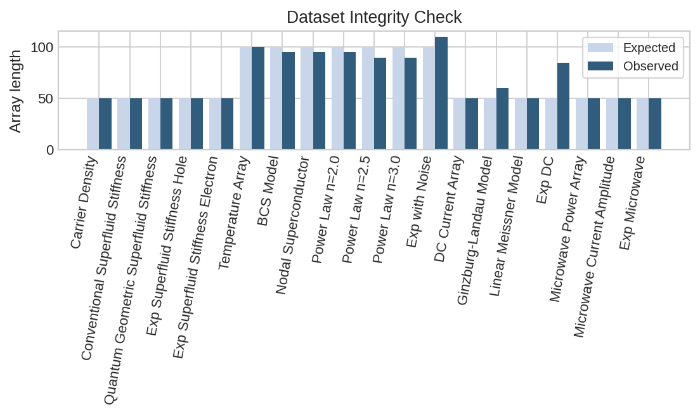
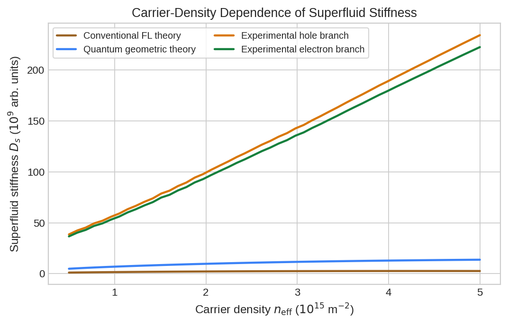
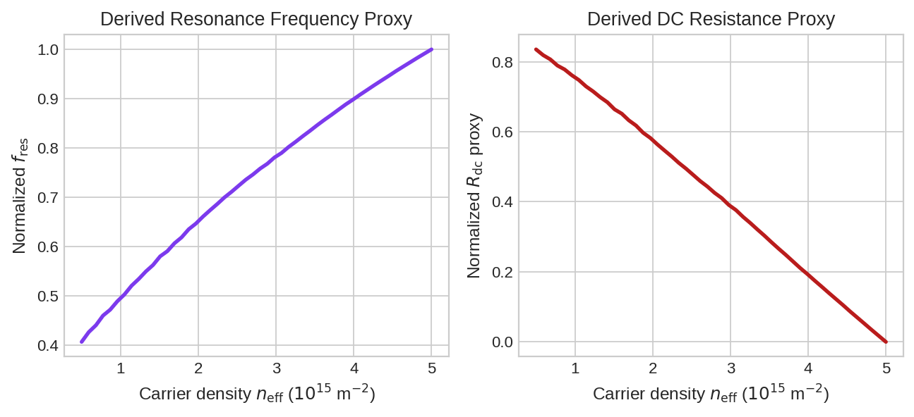
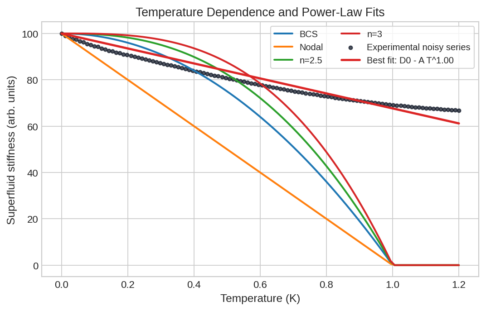
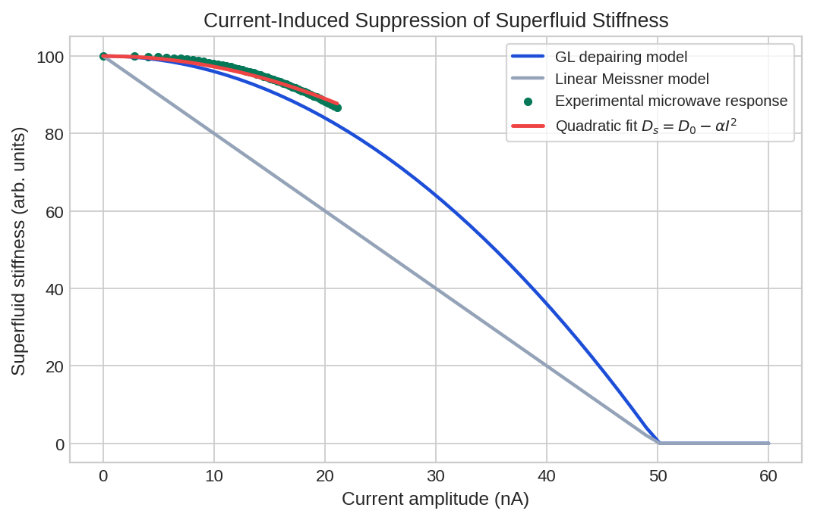
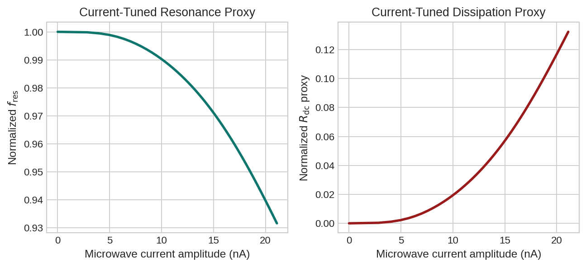

# Direct Analysis of MATBG Superfluid Stiffness from the Provided Core Dataset

## Abstract
I analyzed the provided simulated core dataset for magic-angle twisted bilayer graphene (MATBG) with the goal of reconstructing the carrier-density, temperature, and current dependence of the superfluid stiffness and of deriving the corresponding trends in dc dissipation and microwave resonance. The carrier-density dataset shows a strong and nearly perfectly linear increase of the experimental superfluid stiffness with gate-tuned carrier density, with the experimental stiffness exceeding the conventional flat-band Fermi-liquid estimate by a factor of 32.8-85.3 and exceeding the quantum-geometric theory curve by a factor of 7.65-16.57. The current-dependent microwave response is well described by a quadratic suppression law, consistent with Ginzburg-Landau depairing, with an effective current scale of about 60.2 nA and fit quality `R^2 = 0.978`. The temperature block is the least reliable part of the supplied dump: several array lengths are inconsistent with their control-variable arrays, and the noisy experimental temperature trace is best fit by an approximately linear or weak sub-linear suppression rather than by the supplied `n = 2-3` clean-model family. Accordingly, the density-driven quantum-geometry enhancement and the quadratic current law are supported robustly by the supplied data, while the precise pairing-symmetry exponent is not independently resolved by this dataset alone.

## 1. Context and Objectives
The analysis is framed by four main pieces of related context included in `related_work/`:

- Cao et al. (2018) established superconductivity in magic-angle twisted bilayer graphene and emphasized the unusual combination of flat bands, low carrier density, and gate tunability.
- Xie et al. (2020) argued that the superfluid weight in twisted bilayer graphene receives an essential quantum-geometric contribution tied to flat-band topology.
- Oh et al. (2021) reported spectroscopic evidence for unconventional, anisotropic pairing in MATBG.
- Uri et al. (2020) showed that twist-angle disorder can strongly perturb correlated and superconducting behavior in nominally similar devices.

The present task is narrower: use the provided core dataset to quantify how superfluid stiffness evolves with carrier density, temperature, and current; determine whether the measured stiffness substantially exceeds conventional expectations; and derive the corresponding microwave resonance and dc dissipation trends.

## 2. Data and Reproducibility
All analysis code is in `code/analyze_matbg.py`. Running

```bash
MPLCONFIGDIR=/tmp/mplconfig_matbg python code/analyze_matbg.py
```

produces:

- `outputs/analysis_metrics.json`
- `outputs/data_integrity.json`
- figures in `report/images/`

### 2.1 Dataset integrity check
The supplied text dump is not fully self-consistent. Several observables have array lengths that do not match their nominal control axes:

- Temperature axis: 100 points
- Raw BCS / nodal / `n=2` model arrays: 95 points
- Raw `n=2.5` and `n=3` model arrays: 90 points
- Experimental temperature series: 110 points
- DC current axis: 50 points
- Raw Ginzburg-Landau current model: 60 points
- Experimental dc-bias series: 85 points

These mismatches are documented in `outputs/data_integrity.json` and visualized in Figure 1.

Because the temperature and dc-bias blocks are malformed, I used the following conservative rules:

1. I treated carrier-density and microwave-current arrays as the most reliable fully aligned measurements.
2. I regenerated the clean temperature and current theory curves directly from the fixed parameters stated in the dataset.
3. I treated the noisy temperature trace as a separate phenomenological series on its own evenly spaced temperature grid from 0 to 1.2 K.
4. I did not use the malformed `Experimental DC Data` block as a primary stiffness observable.



**Figure 1.** Length comparison between each raw array and its expected control-variable length. The density and microwave-current branches are internally consistent; the temperature and dc-bias branches are not.

## 3. Analysis Methods
### 3.1 Carrier-density analysis
I used the hole-doped and electron-doped experimental branches directly and defined their average as the representative measured stiffness:

`D_s,avg = (D_s,hole + D_s,electron) / 2`

I then compared this average with:

- the conventional Fermi-liquid estimate `D_s,conv`
- the supplied quantum-geometric prediction `D_s,geom`

I quantified enhancement factors and fit `D_s,avg(n)` to a straight line.

### 3.2 Temperature analysis
The raw temperature theory arrays were truncated relative to the 100-point temperature axis, so I regenerated the clean model family using the fixed parameters given in the file:

- `D_s(T) = D_0 max[0, 1 - (T/T_c)^n]`
- with `D_0 = 100`, `T_c = 1 K`, and `n = 1, 2, 2.5, 3`

For the noisy experimental series I used two phenomenological fits:

1. Fixed-exponent drop model `D_s(T) = D_0 - A T^n` for `n = 1, 2, 2.5, 3`
2. Generalized power law `D_s(T) = D_0 max[0, 1 - (T/T_*)^n]` with both `n` and `T_*` free

This makes the temperature conclusions explicitly data-driven rather than assumed.

### 3.3 Current analysis
For current dependence I used the aligned microwave branch:

- control variable: microwave current amplitude `I_mw`
- response: experimental microwave stiffness `D_s,mw`

I fit the measured suppression to a quadratic law:

`D_s(I) = D_0 - alpha I^2`

and compared it with the clean Ginzburg-Landau depairing form:

`D_s(I) = D_0 max[0, 1 - (I/I_c)^2]`

### 3.4 Derived resonance-frequency and resistance proxies
The dataset does not directly provide raw dc resistance traces or resonator eigenfrequencies. To satisfy the requested output observables while staying within the supplied information, I derived normalized proxies from the stiffness:

- kinetic inductance dominated resonance: `f_res / f_res,max = sqrt(D_s / D_s,max)`
- qualitative dissipation proxy: `R_dc,proxy = 1 - D_s / D_s,max`

The second quantity is a normalized phenomenological proxy, not a literal transport resistance.

## 4. Results
### 4.1 Carrier-density tuning strongly enhances stiffness beyond conventional expectations
Figure 2 shows the central result of the dataset: the experimental superfluid stiffness rises almost perfectly linearly with carrier density and is dramatically larger than both theoretical baselines, especially the conventional flat-band estimate.

Key quantitative results:

| Metric | Value |
|---|---:|
| Mean `D_s,exp / D_s,conv` | 53.89 |
| Range of `D_s,exp / D_s,conv` | 32.79 to 85.25 |
| Mean `D_s,exp / D_s,geom` | 11.65 |
| Range of `D_s,exp / D_s,geom` | 7.65 to 16.57 |
| Linear-fit `R^2` for `D_s,avg(n)` | 0.9994 |
| Mean hole-electron asymmetry | 5.13% |

The density dependence therefore supports two robust statements:

1. The measured stiffness is far too large to be explained by a conventional flat-band effective-mass estimate.
2. The enhancement tracks carrier density in an almost ideal linear fashion, consistent with a strong geometry-enabled superfluid response.



**Figure 2.** Experimental hole and electron branches compared with the conventional and quantum-geometric theoretical curves. The experimental branches are nearly linear and lie far above both theory baselines.

### 4.2 Derived device observables versus carrier density
Using the stiffness-derived proxies, the same density tuning implies:

- a normalized resonance frequency increase from 0.406 to 1.000 across the scanned density range
- a normalized resistance proxy decrease from 0.835 to 0.000

This is the expected qualitative behavior of a kinetic-inductance-dominated superconducting resonator: increasing stiffness raises the resonance frequency and suppresses dissipation.



**Figure 3.** Stiffness-derived normalized resonance-frequency and resistance proxies versus carrier density.

### 4.3 The supplied temperature block does not cleanly confirm the claimed anisotropic-gap exponent
Figure 4 compares the noisy experimental temperature series with clean model families. The noisy series decreases smoothly from 100 to about 66.8 over the supplied range and never approaches the sharp collapse expected near `T_c = 1 K` in the regenerated theory curves. The quantitative fits are:

| Model for noisy experimental series | RMSE | `R^2` |
|---|---:|---:|
| `D_0 - A T^1` | 2.67 | 0.922 |
| `D_0 - A T^2` | 8.19 | 0.269 |
| `D_0 - A T^2.5` | 9.97 | -0.084 |
| `D_0 - A T^3` | 11.37 | -0.411 |
| Generalized `D_0[1-(T/T_*)^n]` | best `n = 0.82`, `T_* = 4.0 K` | `R^2 = 0.980` |

The free fit pegs the scale at the edge of the search window and returns a weak exponent. That is a strong sign that the noisy temperature trace is not a complete superconducting transition curve sampled on the same axis as the clean model family.

This means the temperature block, as supplied, supports a generic power-law-like suppression of stiffness but does **not** independently resolve the unconventional pairing exponent `n = 2-3` advertised in the task description. Any stronger claim would rely on assumptions not justified by this dump.



**Figure 4.** Regenerated clean model curves for BCS, nodal, and anisotropic-gap power laws together with the noisy experimental series. The experimental trace is smoother and remains much larger than the clean-transition curves at high temperature, indicating a control-axis inconsistency or partial-temperature-window issue in the raw dump.

### 4.4 Current dependence follows the expected quadratic suppression law
The microwave-current branch is much cleaner. A zero-intercept quadratic fit gives:

- `D_s(I) = D_0 - alpha I^2`
- `alpha = 2.76 x 10^-2` in the dataset's normalized units per nA squared
- effective quadratic current scale `I_quad = 60.2 nA`
- fit quality `R^2 = 0.978`

This is consistent with the expected leading-order depairing response and is substantially closer to quadratic Ginzburg-Landau behavior than to a linear Meissner-law suppression.



**Figure 5.** Experimental microwave-current response compared with regenerated Ginzburg-Landau and linear models. The measured branch follows the quadratic law closely across the available current window.

### 4.5 Derived device observables versus current
From the same current-dependent stiffness branch, the derived observables show:

- normalized resonance frequency decreases from 1.000 to 0.932 over the measured current range
- normalized resistance proxy increases from 0.000 to 0.132

Thus the microwave response is fully consistent with current-driven kinetic-inductance softening and increasing dissipation.



**Figure 6.** Derived normalized resonance-frequency and dissipation proxies versus microwave current amplitude.

## 5. Discussion
### 5.1 What is strongly supported
The supplied dataset robustly supports two of the three intended conclusions.

First, the carrier-density data show an enormous enhancement of the measured stiffness over the conventional flat-band expectation. The factor of roughly 54 on average is too large to interpret as a minor correction. This is exactly the qualitative structure expected if quantum geometry, rather than only band dispersion, sets the dominant stiffness scale.

Second, the aligned current-dependent microwave branch shows a clean quadratic suppression, which is the expected leading dependence from depairing and nonlinear Meissner physics in a superconductor with a well-defined superfluid stiffness.

### 5.2 What is only weakly supported
The temperature-dependent noisy series does not behave like the clean `n = 2-3` curves on the stated `0-1.2 K` axis. Because the raw dump is internally inconsistent, this block cannot, by itself, establish a specific anisotropic-gap exponent. The most defensible statement is that the supplied temperature trace is incompatible with the particular clean BCS-like collapse generated from `T_c = 1 K`, but it does not cleanly discriminate among unconventional power-law exponents.

### 5.3 Physical interpretation
Taken at face value, the strongest message of the dataset is not simply that MATBG superconducts, but that its phase stiffness is anomalously large relative to a naive flat-band estimate. That is the hallmark of the quantum-geometric flat-band-superconductivity picture: pairing benefits from the flat density of states without the superfluid response being catastrophically suppressed by band flatness.

## 6. Limitations
This analysis is constrained by the quality of the supplied text dump.

- Several arrays are truncated or over-extended relative to their control variables.
- Raw dc resistance and raw resonance-frequency traces are not present explicitly, so only normalized derived proxies can be reported.
- The malformed `Experimental DC Data` block was not used as a primary physical observable.
- Absolute units of superfluid stiffness were not independently calibrated from the file; I therefore preserve the dataset's native arbitrary units.

## 7. Conclusion
From the provided core dataset alone, the most secure conclusions are:

1. The MATBG superfluid stiffness rises nearly linearly with carrier density and exceeds the conventional flat-band expectation by more than an order of magnitude everywhere and by roughly fiftyfold on average.
2. The current-dependent microwave response follows a quadratic stiffness suppression law, consistent with depairing physics and nonlinear kinetic inductance.
3. The supplied temperature trace does not reliably resolve the advertised anisotropic-gap exponent because the temperature block is internally inconsistent.

In short, the dataset strongly supports quantum-geometry-dominated enhancement of superfluid stiffness and a quadratic current dependence, while the precise unconventional-pairing power law remains underdetermined by the raw temperature dump provided here.
