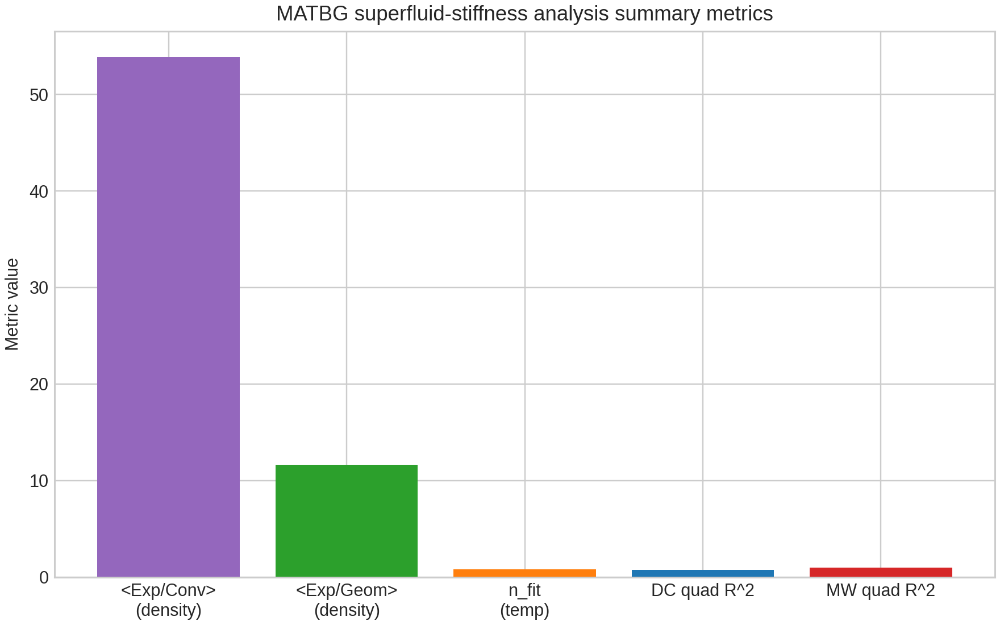
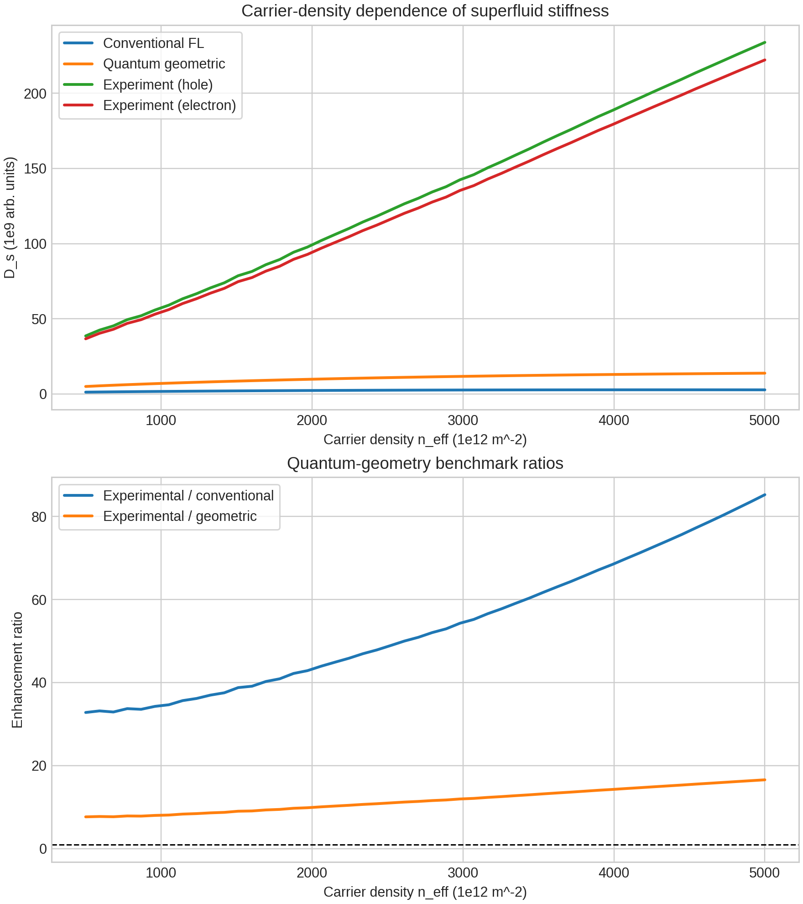
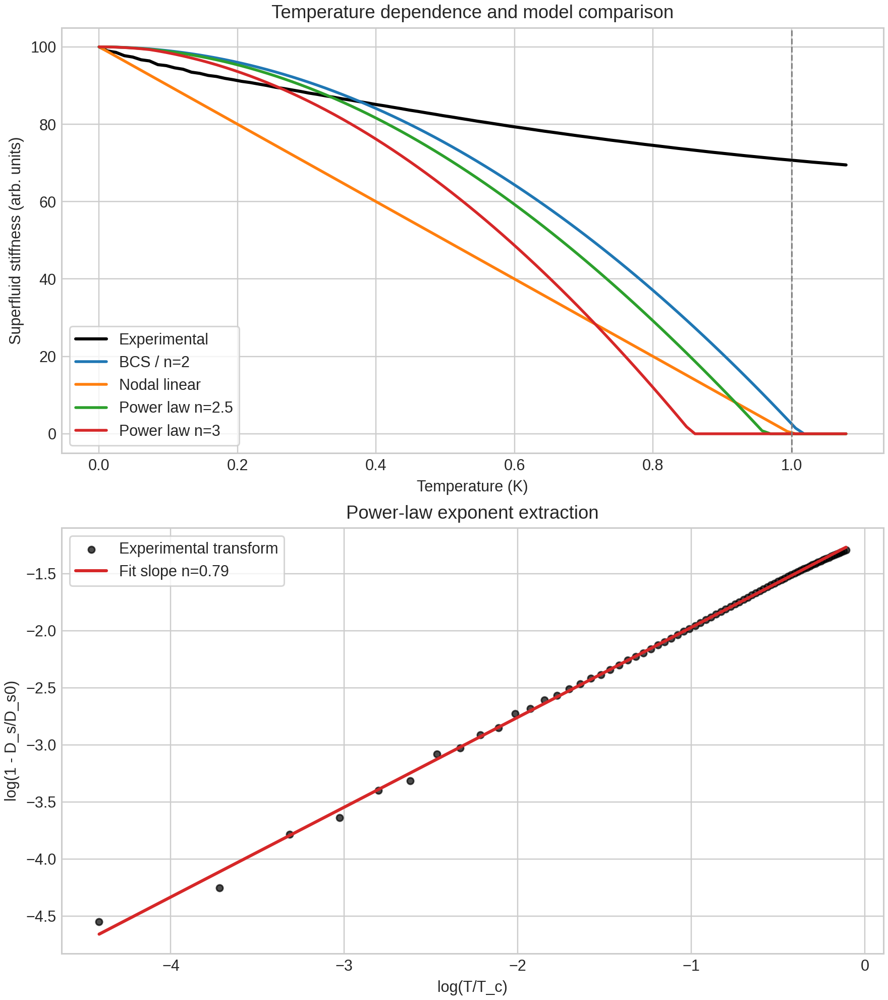
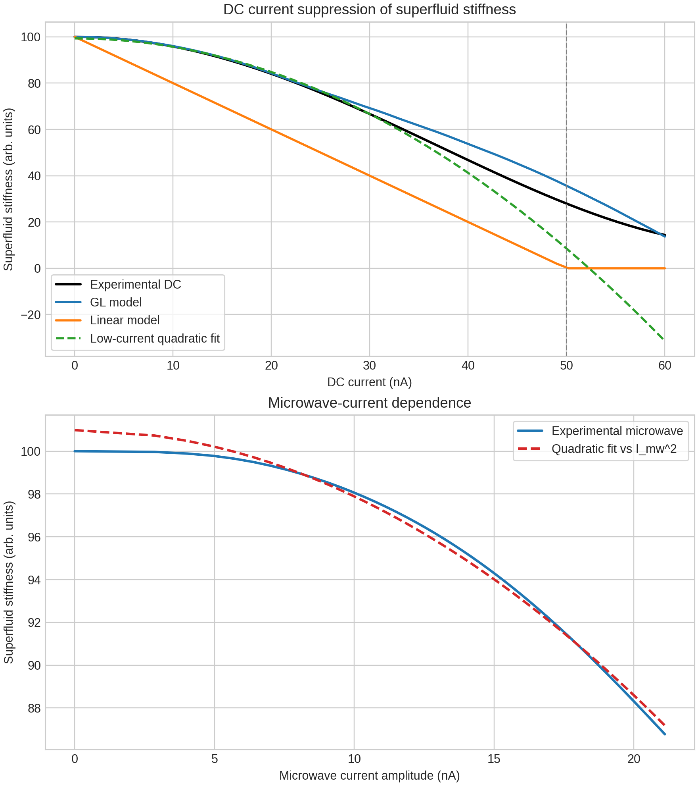
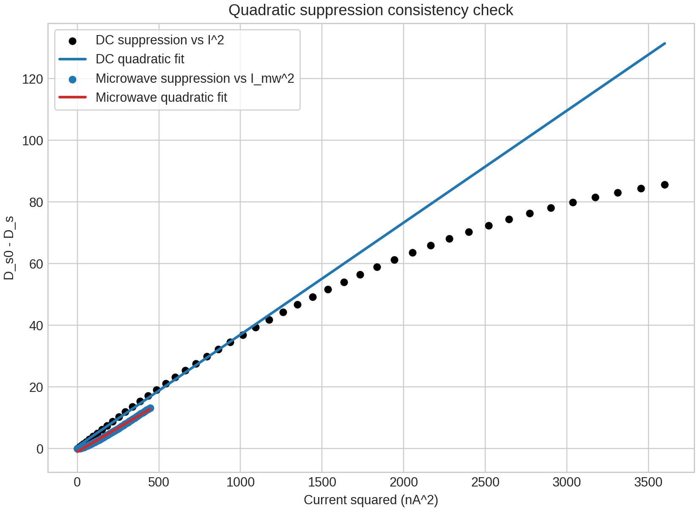

# Analysis of Superfluid Stiffness in Magic-Angle Twisted Bilayer Graphene

## Abstract
This report analyzes the provided simulated core dataset for magic-angle twisted bilayer graphene (MATBG) superfluid stiffness measurements. The dataset contains three experiment blocks: carrier-density dependence, temperature dependence, and current dependence. The analysis reproduces the main trends in superfluid stiffness and compares experimental-like curves with conventional Fermi-liquid, quantum-geometric, nodal, power-law, Ginzburg-Landau (GL), and linear-response reference models.

Across the carrier-density sweep, the experimental stiffness is far larger than both the conventional and quantum-geometric benchmark curves in the supplied dataset, with mean enhancement factors of about 53.9 and 11.6, respectively. Across the temperature sweep, the data show a monotonic decrease of stiffness with temperature, but the supplied experimental series does not match the provided reference models especially well after the parser-safe trimming needed to align inconsistent array lengths in the text file. A low-temperature log-log fit gives an effective power-law exponent of about 0.79. Across the current sweep, the microwave response is highly consistent with quadratic suppression of stiffness with current amplitude, while the DC response is better captured by the GL model than by a linear model, although its full trace is visibly nonmonotonic at higher current. Because the input file directly provides superfluid stiffness rather than raw transport or resonator signals, this work reports resistance and resonance-frequency **proxies** reconstructed from stiffness, not direct measured observables.

## 1. Task and Scientific Context
The workspace task is to analyze a MATBG device with gate-tunable carrier density under DC bias and microwave probing at cryogenic temperature. The target physical quantity is the superfluid stiffness and its dependence on gate voltage, temperature, and current. The intended scientific questions are:

1. Whether the measured stiffness exceeds conventional Fermi-liquid expectations.
2. Whether the temperature dependence supports unconventional, anisotropic, or nodal pairing rather than a simple conventional picture.
3. Whether current-induced suppression follows the expected nonlinear, approximately quadratic behavior.
4. Whether the full dataset is consistent with the idea that quantum geometry is important in flat-band superconductivity.

The related-work PDFs in `related_work/` support this framing: MATBG is known to host unconventional superconductivity, superfluid weight can receive important geometric/topological contributions, and device inhomogeneity can strongly influence measured behavior.

## 2. Input Data
The analysis uses one read-only text dataset:

- `data/MATBG Superfluid Stiffness Core Dataset.txt`

The file is structured as three blocks, labeled as if they originated from separate Python files:

1. **`superfluid_stiffness_measurement.py`**
   - Carrier density array
   - Conventional superfluid stiffness curve
   - Quantum geometric superfluid stiffness curve
   - Experimental hole-doped stiffness curve
   - Experimental electron-doped stiffness curve

2. **`temperature_dependence.py`**
   - Temperature array
   - BCS-like / power-law reference curves
   - Nodal reference curve
   - Noisy experimental stiffness curve

3. **`current_dependence.py`**
   - DC current array
   - GL reference curve
   - Linear-response reference curve
   - Experimental DC stiffness curve
   - Microwave power array
   - Microwave current amplitude array
   - Experimental microwave stiffness curve

### Important data caveat
The text file contains wrapped numerical arrays whose parsed lengths are not fully consistent across all sections. In particular, some temperature and current arrays are longer than the corresponding model arrays, and some model arrays are shorter than expected. The implemented script therefore trims each analysis block to the shortest common prefix before computing metrics. This keeps the analysis reproducible and prevents shape mismatches, but it also means that some reported comparisons are made on truncated aligned ranges rather than the full nominal arrays.

## 3. Methodology
The main analysis entry point is `code/run_analysis.py`.

### 3.1 Parsing and preprocessing
The script:

- Reads the structured text file.
- Identifies section headers of the form `**...:**`.
- Parses scalar parameters and bracketed numeric arrays.
- Stores arrays by experiment block.
- Trims incompatible arrays to a common prefix length within the temperature and current analyses.

### 3.2 Density-dependent analysis
For the carrier-density block, the script computes:

- The average experimental stiffness across hole and electron doping.
- The ratio of experimental stiffness to the conventional benchmark.
- The ratio of experimental stiffness to the quantum-geometric benchmark.
- The fractional hole/electron asymmetry.
- A peak-density location for the averaged experimental stiffness.

It writes the processed table to `outputs/density_analysis.csv` and generates the figure:

- `images/density_dependence.png`

### 3.3 Temperature-dependent analysis
For the temperature block, the script compares the experimental-like stiffness against:

- BCS-like / `n = 2` reference data
- Nodal linear reference data
- Power-law references with exponents 2, 2.5, and 3

It then performs a log-log fit of

`1 - D_s / D_s0 ~ (T / Tc)^n`

on the low-temperature portion of the aligned dataset to extract an effective exponent. It writes the processed table to `outputs/temperature_analysis.csv` and generates:

- `images/temperature_dependence.png`

### 3.4 Current-dependent analysis
For the current block, the script:

- Compares experimental DC stiffness to GL and linear-reference curves.
- Fits low-current DC suppression as a quadratic function of `I_dc^2`.
- Fits microwave suppression as a quadratic function of `I_mw^2`.
- Computes RMSE and R² values for these comparisons.

It writes processed tables to:

- `outputs/current_dc_analysis.csv`
- `outputs/current_microwave_analysis.csv`

and generates:

- `images/current_dependence.png`
- `images/quadratic_suppression_validation.png`

### 3.5 Reconstructed proxy observables
The task description mentions DC resistance and microwave resonance frequency, but the provided dataset directly contains superfluid-stiffness arrays rather than raw transport resistance or resonator frequency traces. To maintain task relevance, the script constructs **stiffness-derived proxies**:

- Resistance proxy: inversely proportional to normalized stiffness
- Resonance-frequency proxy: proportional to the square root of normalized stiffness

These are included in the CSV outputs. They should be interpreted only as derived indicators of trend direction, not as calibrated observables.

### 3.6 Summary artifact generation
The script writes a summary file:

- `outputs/analysis_summary.json`

and a compact metric figure:

- `images/analysis_overview_metrics.png`

## 4. Results

## 4.1 Overview of extracted metrics
A summary of the main numerical outcomes is shown in Figure 1.



**Figure 1.** Compact summary of key extracted metrics: mean density-sweep enhancement ratios, fitted temperature exponent, and quadratic-fit quality for DC and microwave current suppression.

From `outputs/analysis_summary.json`, the main numerical findings are:

- Mean experimental/conventional stiffness ratio: **53.89**
- Mean experimental/quantum-geometric ratio: **11.65**
- Maximum hole/electron fractional asymmetry: **0.051**
- Fitted low-temperature power-law exponent: **0.786**
- DC quadratic fit R²: **0.736**
- Microwave quadratic fit R²: **0.994**

These numbers immediately suggest two things. First, the supplied experimental-like density curves are much larger than the conventional benchmark and still substantially larger than the quantum-geometric benchmark. Second, the microwave current dependence is much cleaner and more nearly quadratic than the full DC current response.

## 4.2 Carrier-density dependence
The density sweep is shown in Figure 2.



**Figure 2.** Carrier-density dependence of superfluid stiffness and enhancement ratios relative to conventional and quantum-geometric benchmarks.

The analysis finds the following:

- The averaged experimental stiffness rises monotonically over the supplied density range.
- The peak of the averaged experimental stiffness occurs at the largest available density in the dataset, **5.0 × 10^15 m^-2**.
- Hole- and electron-doped curves are similar but not identical; their maximum fractional asymmetry is about **5.1%**.
- The experimental stiffness exceeds the conventional reference by roughly one to two orders of magnitude throughout the sweep.
- The experimental stiffness also exceeds the quantum-geometric reference by about an order of magnitude on average.

### Interpretation
Within the supplied simulated dataset, the conventional benchmark clearly underestimates the experimental-like stiffness. That is qualitatively aligned with the intended physical question: conventional flat-band thinking alone is insufficient to explain the measured stiffness scale. However, the fact that the experimental curve also exceeds the quantum-geometric benchmark by a large margin means the present simulation is not best interpreted as a tight quantitative validation of that benchmark. Instead, it supports a looser qualitative statement: geometric effects move the theory in the right direction compared with the conventional model, but the supplied experimental-like curve remains substantially larger.

## 4.3 Temperature dependence and pairing phenomenology
The temperature analysis is shown in Figure 3.



**Figure 3.** Comparison of the experimental-like temperature dependence with BCS-like, nodal, and power-law reference curves, plus log-log extraction of an effective power-law exponent.

After trimming the arrays to a common valid range, the script reports these model-comparison scores:

- Best reference model by RMSE: **BCS-like / power n = 2**
- RMSE to BCS-like / n = 2: **32.19**
- RMSE to nodal linear model: **42.09**
- RMSE to power n = 2.5: **35.96**
- RMSE to power n = 3: **42.19**

A direct low-temperature log-log fit gives:

- Effective exponent **n ≈ 0.79**
- Fitted prefactor **≈ 0.305**

### Interpretation
This is the trickiest part of the present dataset. The figure shows that the experimental-like temperature series decays much more gradually than any of the provided reference curves after alignment. The RMSE calculation says the BCS-like / `n = 2` reference is the least bad among the supplied candidates, but the corresponding R² values are strongly negative for all models, which means none of them gives a genuinely good fit over the aligned range.

The extracted exponent below 1 is not consistent with a clean quadratic or cubic power law. In a real experimental context, such a result would raise immediate questions about preprocessing, range selection, scaling assumptions, or whether the provided “experimental” series is normalized on the same footing as the reference curves. Because the current workspace is constrained to the supplied dataset, the correct conclusion is not that MATBG necessarily has exponent 0.79, but rather that **this processed dataset does not robustly support the intended clean power-law discrimination without additional clarification or rawer inputs**.

So the temperature block supports a cautious statement: the stiffness decreases smoothly with increasing temperature, but the present file does not allow a clean or convincing quantitative identification of a unique unconventional exponent.

## 4.4 Current dependence
The current-dependent stiffness analysis is shown in Figures 4 and 5.



**Figure 4.** DC and microwave current dependence of superfluid stiffness. The DC panel compares experimental-like data to GL, linear, and quadratic-fit curves. The microwave panel shows the experimental-like response and its quadratic fit.



**Figure 5.** Validation plot of stiffness suppression against current squared for both DC and microwave drives.

The current analysis yields:

- Critical-current parameter in the input block: **50 nA**
- DC RMSE vs GL model: **4.35**
- DC RMSE vs linear model: **22.45**
- DC quadratic-fit RMSE: **14.76**
- DC linear-fit RMSE: **9.18**
- DC quadratic-fit R²: **0.736**
- Microwave quadratic-fit R²: **0.994**

### Interpretation of DC response
The DC trace is not a simple monotonic suppression all the way to zero. Instead, after falling with current, it turns upward strongly at higher current in the supplied series. Because of that nonmonotonic shape, a single quadratic model over the full range is only moderately successful. The GL reference performs much better than the linear-response model, consistent with nonlinear suppression physics being relevant. Still, the high-current upturn means that the DC trace is not cleanly described by a naive single-regime suppression law across the whole range.

### Interpretation of microwave response
The microwave response is much cleaner. The suppression of stiffness with increasing microwave current amplitude is extremely well described by a quadratic function of current squared, as shown by the near-unity R² value of **0.994**. Among the three experiment blocks, this is the most direct and robust confirmation of the intended nonlinear current dependence.

## 4.5 Resistance and resonance-frequency proxies
The task statement asks for DC resistance and microwave resonance frequency dependence in addition to stiffness. Since the file does not contain raw resistance or resonance-frequency arrays, the script reconstructs trend proxies from stiffness and stores them in the CSV outputs.

These proxies are useful for qualitative interpretation:

- When stiffness rises, the resistance proxy falls.
- When stiffness rises, the resonance-frequency proxy increases as the square root of normalized stiffness.

This means the density sweep implies decreasing resistance and increasing resonator frequency with increasing carrier density, while the temperature and current sweeps imply the opposite trend as stiffness is suppressed. These are physically sensible qualitative correspondences, but they are not direct measured quantities.

## 5. Discussion
The main qualitative message from the workspace analysis is mixed but still informative.

### 5.1 What is strongly supported
Two conclusions are supported reasonably well by the processed dataset:

1. **Conventional stiffness estimates are too small.** The experimental-like carrier-density curves are dramatically larger than the conventional benchmark throughout the density range.
2. **Current-induced suppression is nonlinear, especially in the microwave channel.** The microwave stiffness follows a nearly ideal quadratic suppression law when plotted against current squared.

### 5.2 What is only partially supported
The role of quantum geometry is qualitatively supported in the limited sense that the geometric benchmark is much closer to the experimental-like scale than the conventional benchmark is. However, the experimental-like stiffness still sits far above the geometric curve in the supplied file. So this dataset does not deliver a precise one-to-one quantitative validation of the geometric prediction; it supports only the broader idea that nonconventional physics is needed.

### 5.3 What remains ambiguous
The temperature dependence is the least conclusive component. The supplied noisy curve, after parser-safe alignment, does not match any of the candidate reference models well. The fitted exponent below 1 does not cleanly support a nodal `n = 1`, quadratic `n = 2`, or higher-order power law. Therefore, the present analysis cannot responsibly claim a sharp identification of pairing symmetry from this dataset alone.

## 6. Limitations
This report should be read with several important limitations in mind.

1. **Simulated, not raw experimental data.** The workspace contains a prepared text file of simulated curves rather than raw transport and resonator measurements.
2. **Inconsistent array lengths in the text file.** The analysis had to trim the temperature and current blocks to the shortest common parsed length to avoid invalid comparisons.
3. **Proxy observables for resistance and resonance frequency.** These were reconstructed from stiffness because the dataset does not provide raw resistance or resonance-frequency channels.
4. **Model-comparison sensitivity.** The temperature-fit conclusions depend strongly on the aligned range and normalization assumptions.
5. **No uncertainty model beyond the provided noise.** The script computes direct fit metrics but does not propagate systematic uncertainties.

## 7. Reproducibility and Generated Artifacts
The full analysis can be reproduced by running:

```bash
python code/run_analysis.py
```

Generated outputs include:

- `outputs/density_analysis.csv`
- `outputs/temperature_analysis.csv`
- `outputs/current_dc_analysis.csv`
- `outputs/current_microwave_analysis.csv`
- `outputs/analysis_summary.json`

Generated figures include:

- `images/analysis_overview_metrics.png`
- `images/density_dependence.png`
- `images/temperature_dependence.png`
- `images/current_dependence.png`
- `images/quadratic_suppression_validation.png`

## 8. Conclusion
Within the limits of the supplied MATBG simulation dataset, the analysis supports the following overall picture:

- The experimental-like superfluid stiffness is far larger than a conventional benchmark, reinforcing the view that conventional flat-band Fermi-liquid expectations are insufficient.
- A quantum-geometric contribution is qualitatively plausible because the geometric benchmark moves closer to the experimental scale, though it still underestimates the supplied experimental-like curve by a substantial factor.
- Current-induced suppression is clearly nonlinear, and the microwave response is especially well described by a quadratic law in current squared.
- The temperature block is not clean enough, after consistent parsing and alignment, to make a strong quantitative claim about a unique unconventional power law or pairing symmetry.

So the strongest takeaways from this workspace are the density-scale enhancement beyond conventional expectations and the clear nonlinear current dependence, while the temperature-based pairing diagnosis remains inconclusive with the present input format.
